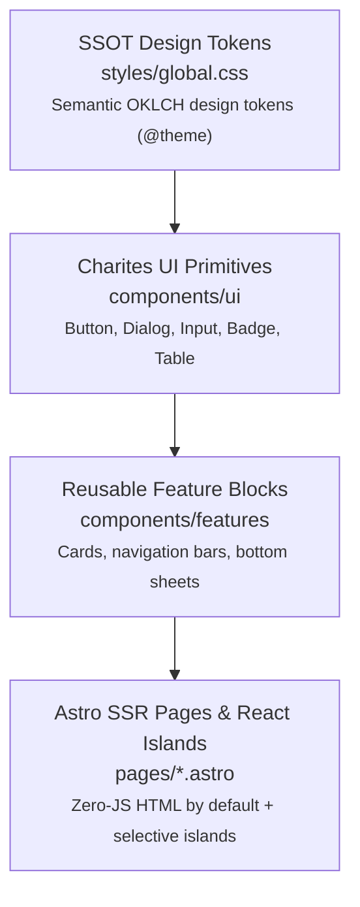
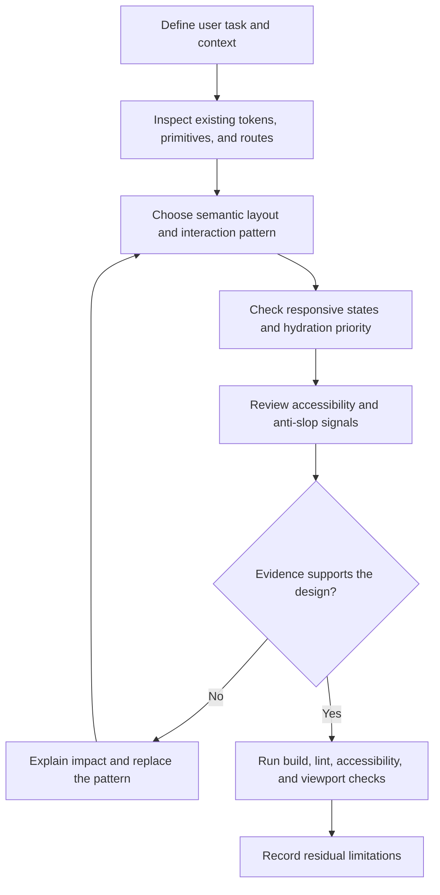

# Charites Responsive Guidelines -- Modern UI/UX & Touch-First Design System

Panduan ini mendefinisikan standar resmi arsitektur antarmuka responsif **Charites** yang menggabungkan Astro SSR, React islands, responsive CSS, WCAG 2.2, dan tinjauan kualitas anti-slop. Standar platform menjadi constraint yang dapat diuji; aturan token dan gaya visual Charites menjadi overlay repositori; anti-slop menjadi heuristik terukur yang dinilai lewat dampaknya terhadap hierarki, affordance, keterbacaan, performa, dan pemeliharaan jangka panjang.

---

## 1. Doktrin Utama: Fungsi Sebelum Dekorasi

Pengguna nyata membutuhkan antarmuka yang tenang, terprediksi, dan dapat diandalkan (*calm, predictable, and dependable*), bukan efek visual akrobatik yang memperlambat alur kerja.



### Baseline yang Dapat Diverifikasi:

1. **Token discipline:** Pada repository yang menetapkan token SSOT, gunakan token semantic untuk warna, spacing, dan radius. Arbitrary values perlu alasan komponen dan tidak boleh menjadi cara menghindari token.
2. **Visual restraint:** Tolak dekorasi yang menurunkan contrast, hierarchy, readability, performance, atau discoverability. Warna, gradient, blur, dan radius bukan pelanggaran otomatis tanpa dampak yang dapat dijelaskan.
3. **Cross-page coherence:** Pertahankan vocabulary visual dan interaction pattern dalam satu product surface, sambil mengizinkan variasi yang mendukung konteks dan density pengguna.

### Flow Review UI



---

## 2. Peta Rujukan dan Status Sumber

Dokumen riset lokal menjadi rationale anti-slop dan arsitektur UI; dokumentasi platform dan standar tetap menjadi sumber normatif.

### Sumber Primer dan Riset Lokal (September 2026)

- [Astro islands](https://docs.astro.build/en/concepts/islands/) dan [client directives](https://docs.astro.build/en/reference/directives-reference/): selective hydration dan pilihan `client:*`.
- [WCAG 2.2](https://www.w3.org/TR/WCAG22/): persyaratan aksesibilitas. Target `44px` adalah rekomendasi ergonomi mobile, bukan minimum WCAG universal.
- [CSS container queries](https://developer.mozilla.org/en-US/docs/Web/CSS/Guides/Containment/Container_queries): `container-type`, `container-name`, dan `@container`.
- [React reference](https://react.dev/reference/react): purity, hooks, components, dan API React.
- [Modern UI Systems Architecture Research](../../../docs/research/skills/Modern UI Systems Architecture Research.md): rationale anti-slop dan snapshot riset repository, ditinjau September 2026. Klaim di dokumen ini tetap perlu dibedakan dari persyaratan platform.

### Referensi Skill

| Referensi                                                                        | Gunakan saat                                                       |
| :------------------------------------------------------------------------------- | :----------------------------------------------------------------- |
| [`references/anti_slop_philosophy.md`](references/anti_slop_philosophy.md)       | Menganalisis clutter, hierarchy, affordance, dan visual restraint. |
| [`references/design_tokens_ssot.md`](references/design_tokens_ssot.md)           | Menerapkan token semantic repository dan validasi CSS/Tailwind.    |
| [`references/mobile_touch_ergonomics.md`](references/mobile_touch_ergonomics.md) | Menentukan target sentuh, viewport units, dan keyboard behavior.   |
| [`references/pattern_transformations.md`](references/pattern_transformations.md) | Mengubah modal, tabel, dan layout menggunakan container queries.   |
| [`references/islands_hydration_cls.md`](references/islands_hydration_cls.md)     | Menilai selective hydration, FOUC, dan layout-shift measurement.   |
| [`references/ios-quirks.md`](references/ios-quirks.md)                           | Debugging iOS Safari dan safe-area behavior.                       |
| [`references/android-quirks.md`](references/android-quirks.md)                   | Debugging Android Chrome dan OSK behavior.                         |
| [`references/forms-inputs.md`](references/forms-inputs.md)                       | Membuat form sensitif, kamera, dan input identitas.                |
| [`references/accessibility.md`](references/accessibility.md)                     | Audit WCAG, screen reader, keyboard, contrast, dan focus.          |
| [`references/component-patterns.md`](references/component-patterns.md)           | Membangun drawer, bottom navigation, FAB, dan tablecard.           |
| [`references/checklist.md`](references/checklist.md)                             | Validasi pra-rilis.                                                |

---

## 3. The 10-Point Anti-Slop Code & Design Review Rubric

Sebelum mengajukan perubahan antarmuka atau membuat PR, seluruh kode frontend wajib lolos 10 gerbang mutu ini:

| Poin   | Dimensi Evaluasi            | Target Metrik & Spesifikasi                                                                                                             | Kriteria Penolakan (Auto-Reject)                                               |
| :----- | :-------------------------- | :-------------------------------------------------------------------------------------------------------------------------------------- | :----------------------------------------------------------------------------- |
| **01** | **Design Token SSOT**       | 100% warna, spasi, dan radius wajib merujuk ke token semantik resmi `global.css`.                                                       | Ditemukan nilai arbitrer (`p-[19px]`, `bg-[#4f46e5]`) atau hardcoded hex.      |
| **02** | **Rasio Kontras**           | Teks normal **4.5:1**, teks besar **3:1**, dan non-text UI diverifikasi sesuai WCAG 2.2.                                                | Teks abu-abu pudar atau boundary kontrol yang tidak terbaca.                   |
| **03** | **Target Sentuh Jempol**    | Minimum WCAG 2.5.8 **24×24 CSS px** bila berlaku; target mobile **44×44px** sebagai rekomendasi ergonomi.                               | Tombol/ikon kecil tanpa area interaksi yang memadai.                           |
| **04** | **Focus Visual Affordance** | Setiap elemen interaktif wajib mendeklarasikan ring `:focus-visible` kontras tinggi.                                                    | Menghapus outline via `outline: none` tanpa menyediakan ring pengganti.        |
| **05** | **Safe Area Management**    | Meta viewport mendeklarasikan `viewport-fit=cover` dan memakai `env(safe-area-inset-*)`.                                                | Konten terpotong poni iPhone / Dynamic Island atau terbentur navigasi Android. |
| **06** | **Keyboard Occlusion**      | Meta viewport menyertakan `interactive-widget=resizes-content` + visualViewport fallback.                                               | Input form tertutup keyboard virtual saat pengguna mengetik.                   |
| **07** | **Selective Hydration**     | Konten non-interaktif tetap server-rendered; pilih `client:load`, `client:idle`, `client:visible`, atau `client:only` sesuai kebutuhan. | JavaScript dikirim atau dihidrasi tanpa kebutuhan interaksi yang jelas.        |
| **08** | **Stabilitas Layout**       | Alokasikan ukuran media/komponen dan ukur CLS pada halaman representatif; tidak menjanjikan nilai absolut.                              | Elemen melompat saat skrip atau media termuat.                                 |
| **09** | **HTML Semantik Murni**     | Menggunakan `<button>`, `<dialog>`, `<nav>`, bukan `<div onClick={...}>`.                                                               | Elemen `div` klik tanpa `role="button"`, `tabindex="0"`, dan keyboard handler. |
| **10** | **Restraint Fungsionalis**  | Nol gradasi neon, nol glow dekoratif, radius wajar (`4px` - `8px`, bukan `rounded-3xl`).                                                | Antarmuka berkilau seperti template SaaS landing page generik.                 |

### Anti-Slop Review Protocol

Gunakan anti-slop sebagai review berbasis bukti, bukan blacklist estetika:

1. **Detect:** tandai gradient/glow dekoratif, nested cards, arbitrary values, typography yang tidak konsisten, missing states, atau hierarchy yang tidak jelas.
2. **Explain impact:** hubungkan pola dengan dampak yang dapat diamati: contrast, focusability, task discoverability, density, layout stability, runtime cost, atau maintenance drift.
3. **Replace:** pilih token, primitive, layout, atau interaction pattern yang sudah ada; jika tidak ada, dokumentasikan alasan membuat pengecualian.
4. **Verify:** jalankan lint/typecheck/build yang tersedia, cek keyboard dan screen reader path, serta uji viewport representative. Review visual membantu, tetapi tidak menggantikan bukti aksesibilitas atau runtime.

Pola visual tidak otomatis salah hanya karena populer. Tolak ketika pola tersebut tidak melayani konteks pengguna, mengaburkan state, merusak aksesibilitas, atau menambah kompleksitas tanpa manfaat yang terukur.

---

## 4. Invarian Implementasi Cepat (Cheat Sheet)

### A. Meta Viewport Standar Wajib

```astro
<!-- src/layouts/Layout.astro -->
<meta
	name="viewport"
	content="width=device-width, initial-scale=1.0, viewport-fit=cover, interactive-widget=resizes-content"
/>
```

### B. Unit Viewport: Pilih Sesuai Perilaku

- Gunakan `dvh`, `svh`, atau `lvh` ketika browser chrome atau keyboard memengaruhi layout; `vh` tetap valid untuk konteks yang tidak membutuhkan tracking dinamis.
- Gunakan token/class semantik repository untuk tinggi bottom sheet; jangan menyalin arbitrary utility seperti `max-h-[85svh]` jika policy token melarangnya.

### C. Bottom Sheet Mobile-First

```css
.responsive-modal {
	position: fixed;
	inset: auto 0 0 0;
	width: 100%;
	max-height: 85svh;
	padding-bottom: calc(var(--primitive-space-4) + env(safe-area-inset-bottom));
}

@media (min-width: 768px) {
	.responsive-modal {
		inset: 50% auto auto 50%;
		transform: translate(-50%, -50%);
		max-width: 32rem;
	}
}
```

### D. Tabel Adaptif via Container Queries

```css
.table-container {
	container-type: inline-size;
}

@container (max-width: 640px) {
	thead {
		display: none;
	}
	tr {
		display: block;
		margin-bottom: 0.75rem;
	}
	td {
		display: flex;
		justify-content: space-between;
	}
	td::before {
		content: attr(data-label);
		font-weight: 600;
	}
}
```
