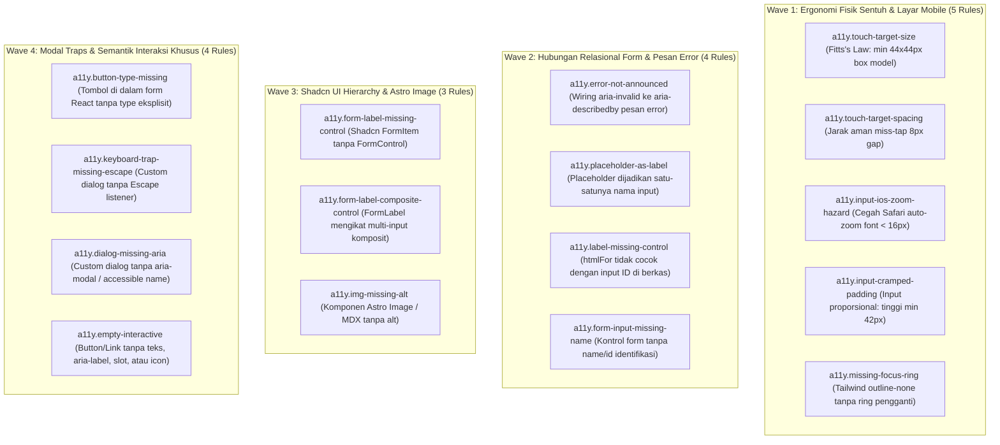

# EXPANSION-BATCH-02: Accessibility & Physical Ergonomics Standards (`a11y.*`)
> **Kode Dokumen:** `SPEC-EXP-02-A11Y`
> **Kategori:** `a11y`
> **Pilar:** `01-SPEC` (WHAT - Spesifikasi Perilaku & Kontrak Rule)
> **Status:** Active Expansion Specification (16 Aturan Terkurasi Bebas Redundansi Linter Standar)
> **Standar Rujukan:**
> - W3C Web Content Accessibility Guidelines (WCAG) 2.2 Level AA
> - `charites-legacy/a11y-checker.ts` (Paritas Penuh Astro + Shadcn UI)
> - Apple Human Interface Guidelines (Touch Target $\ge 44\times 44\text{px}$ & Mobile Viewport Physics)
> - Nielsen Norman Group ("Placeholders in Form Fields Are Harmful" & Mobile Form Ergonomics)
> - HTML Living Standard Form Specifications

---

## 1. Ikhtisar Kategori `a11y` (16 Aturan Non-Redundan)

> **Prinsip Eliminasi Redundansi:** Charites **TIDAK menduplikasi** aturan linter HTML dasar yang sudah ditangkap 100% oleh linter konvensional seperti ESLint `jsx-a11y` atau parser HTML statis (seperti `tabindex > 0`, `html lang`, `h1` tunggal, atau `heading-order`). Sebaliknya, Charites berfokus pada **false negatives** yang lolos dari ESLint/Stylelint karena membutuhkan:
> 1. **Perhitungan Geometri Token Tailwind (Token Physics):** Ukuran fisik piksel box model (`h-6 w-6` + padding) dan risiko auto-zoom iOS Safari (`text-sm`).
> 2. **Relational AST Traversal:** Menghubungkan ID kontrol input ke elemen pesan kesalahan (*error message*) di bawahnya (`aria-describedby`), atau memeriksa pohon hierarki komponen Shadcn UI (`<FormItem>` / `<FormLabel>` / `<FormControl>`).
> 3. **Pemeriksaan Komponen Lintas-File:** Menjamin `htmlFor` benar-benar terhubung ke kontrol input di file yang sama atau registrasi `id` dinamis.



---

## 2. Spesifikasi Detail Rule `a11y.*`

### 2.1. `a11y.touch-target-size`
- **Tujuan:** Menjamin tombol, tautan, dan kontrol interaktif memiliki ukuran fisik minimum $\ge 44	imes 44$px di layar mobile (Apple HIG / WCAG 2.5.8).
- **Mengapa Lolos Linter Standar:** ESLint hanya melihat atribut `className` sebagai opaque string. ESLint tidak tahu bahwa kelas `h-6 w-6` menghasilkan kotak 24px yang melanggar batas ergonomi sentuh jempol.
- **In-Scope:** Tag `<button>`, `<a>`, `<input>`, `<select>` dengan kelas Tailwind yang menghasilkan ukuran $< 44$px tanpa padding kompensasi.
- **Bad:** `<button className="h-6 w-6"><TrashIcon className="h-4 w-4" /></button>`
- **Good:** `<button className="h-11 w-11 flex items-center justify-center"><TrashIcon className="h-5 w-5" /></button>`
- **Engine:** Token Geometry AST.
- **Severity:** Warning.

### 2.2. `a11y.touch-target-spacing`
- **Tujuan:** Mencegah aktivasi keliru (*miss-tap*) antara kontrol yang berdekatan dengan menjamin jarak antar kontrol $\ge 8$px.
- **Mengapa Lolos Linter Standar:** Linter konvensional tidak memeriksa jarak spasial (*gap geometry*) antar elemen anak di dalam flex/grid container.
- **In-Scope:** Sibling tombol atau elemen interaktif dengan `gap-0`, `gap-1`, atau margin $< 8$px.
- **Bad:**
  ```tsx
  <div className="flex gap-1">
    <button className="h-11 px-3 bg-destructive">Hapus</button>
    <button className="h-11 px-3">Batal</button>
  </div>
  ```
- **Good:**
  ```tsx
  <div className="flex gap-3">
    <button className="h-11 px-3">Batal</button>
    <button className="h-11 px-3 bg-destructive">Hapus</button>
  </div>
  ```
- **Engine:** Relational AST.
- **Severity:** Warning.

### 2.3. `a11y.input-ios-zoom-hazard`
- **Tujuan:** Mencegah browser mobile Safari iOS melakukan auto-zoom paksa saat input berukuran font $< 16$px difokuskan, yang merusak layout dan pengalaman mengetik.
- **Mengapa Lolos Linter Standar:** Kelas `text-sm` (14px) sah secara CSS dan Tailwind. Linter konvensional tidak mengetahui batasan hardware iOS WebKit 16px font threshold.
- **In-Scope:** Elemen `<input>`, `<select>`, `<textarea>` dengan kelas ukuran font di bawah `text-base` tanpa responsive override ke 16px di mobile.
- **Bad:** `<input className="text-sm px-3 py-2 border rounded" />`
- **Good:** `<input className="text-base sm:text-sm px-3.5 py-2.5 border rounded" />`
- **Engine:** Token Geometry AST + Tailwind Class AST.
- **Severity:** Warning.

### 2.4. `a11y.input-cramped-padding`
- **Tujuan:** Menjamin kontrol isian formulir memiliki ketinggian ergonomis ($\ge 42$px) dan bantalan horizontal yang cukup agar teks tidak terhimpit border.
- **Mengapa Lolos Linter Standar:** Stylelint dan ESLint tidak menghitung total computed height dari kombinasi line-height + padding vertikal Tailwind.
- **In-Scope:** Kontrol input dengan padding vertikal kerdil (`p-1`, `py-1`, `h-7`, `h-8`) yang membuat input terjepit.
- **Bad:** `<input className="h-8 px-2 text-sm border" />`
- **Good:** `<input className="h-11 px-3.5 py-2.5 text-base sm:text-sm border rounded-lg" />`
- **Engine:** Token Geometry AST.
- **Severity:** Warning.

### 2.5. `a11y.missing-focus-ring`
- **Tujuan:** Mempertahankan indikator cincin fokus visual bagi pengguna navigasi keyboard saat memakai utility Tailwind CSS (WCAG 2.4.7).
- **Mengapa Lolos Linter Standar:** `outline-none` adalah kelas Tailwind yang valid. Linter biasa tidak memeriksa apakah deklarasi `outline-none` dipasangkan dengan cincin fokus pengganti (`focus-visible:ring-*`).
- **In-Scope:** Elemen interaktif dengan kelas `outline-none` atau `focus:outline-none` tanpa `focus-visible:ring-*`.
- **Bad:** `<button className="outline-none bg-primary text-white">Simpan</button>`
- **Good:** `<button className="outline-none focus-visible:ring-2 focus-visible:ring-primary bg-primary text-white">Simpan</button>`
- **Engine:** Token Class AST.
- **Severity:** Warning.

### 2.6. `a11y.error-not-announced`
- **Tujuan:** Menjamin pesan kesalahan validasi di bawah field input terhubung secara programatis via `aria-describedby` ke input tersebut (WCAG 3.3.1).
- **Mengapa Lolos Linter Standar:** ESLint `jsx-a11y` hanya memeriksa keberadaan atribut pada satu node. ESLint **tidak memeriksa hubungan relasional** antara atribut `aria-invalid` pada `<input>` dengan elemen `<p id="...">` yang menampilkan pesan error di bawahnya.
- **In-Scope:** Input dengan `aria-invalid` (atau kondisi error dinamis) tanpa `aria-describedby` yang menunjuk ke ID elemen pesan kesalahan.
- **Bad:**
  ```tsx
  <input id="email" aria-invalid={!!errors.email} className="border-destructive" />
  {errors.email && <p className="text-destructive text-xs mt-1">Format email tidak valid</p>}
  ```
- **Good:**
  ```tsx
  <input
    id="email"
    aria-invalid={!!errors.email}
    aria-describedby={errors.email ? "email-error" : undefined}
    className="border-destructive"
  />
  {errors.email && (
    <p id="email-error" role="alert" className="text-destructive text-xs mt-1">
      Format email tidak valid
    </p>
  )}
  ```
- **Engine:** Relational AST (Sibling & Parent Traversal).
- **Severity:** Error.

### 2.7. `a11y.placeholder-as-label`
- **Tujuan:** Mencegah placeholder dijadikan sebagai satu-satunya penanda identitas input tanpa label permanen (Nielsen Norman Group / WCAG 3.3.2).
- **Mengapa Lolos Linter Standar:** `placeholder="..."` sah secara HTML. ESLint `label-has-associated-control` hanya memeriksa apakah `<label>` ada, tetapi jika developer tidak menulis label sama sekali dan hanya memakai placeholder, banyak konfigurasi linter yang meloloskannya.
- **In-Scope:** Kontrol input dengan `placeholder` namun tanpa `<label htmlFor>`, tanpa pembungkus `<label>`, dan tanpa `aria-label`/`aria-labelledby`.
- **Bad:** `<input type="email" placeholder="Masukkan email Anda" />`
- **Good:** `<label htmlFor="email">Email</label><input id="email" type="email" placeholder="nama@domain.com" />`
- **Engine:** JSX/TSX AST.
- **Severity:** Error.

### 2.8. `a11y.label-missing-control`
- **Tujuan:** Memastikan nilai atribut `htmlFor` pada `<label>` benar-benar cocok dengan ID kontrol input yang ada di dalam berkas yang sama.
- **Mengapa Lolos Linter Standar:** ESLint hanya memeriksa apakah atribut `htmlFor` ada stringnya. ESLint tidak memindai seluruh dokumen untuk memverifikasi apakah kontrol dengan ID tersebut benar-benar eksis (rentan typo: `htmlFor="userId"` vs `id="user_id"`).
- **In-Scope:** Tag `<label htmlFor="xyz">` di mana tidak ada kontrol ber-ID `"xyz"` di berkas yang sama.
- **Bad:** `<label htmlFor="user_id">ID Pengguna</label><input id="userId" />`
- **Good:** `<label htmlFor="userId">ID Pengguna</label><input id="userId" />`
- **Engine:** File-Wide Symbol Table AST.
- **Severity:** Error.

### 2.9. `a11y.form-input-missing-name`
- **Tujuan:** Memastikan kontrol formulir memiliki atribut pengenal `name` atau `id` yang sah saat form disubmit atau diautofill.
- **Mengapa Lolos Linter Standar:** `<input type="text" />` tanpa `name`/`id` adalah JSX yang valid secara tipe dan sintaksis TypeScript.
- **In-Scope:** Kontrol input tanpa `name`, `id`, atau spread props `{...register('field')}`.
- **Bad:** `<input type="email" className="w-full" />`
- **Good:** `<input id="email" name="email" type="email" className="w-full" />`
- **Engine:** JSX/TSX AST.
- **Severity:** Warning.

### 2.10. `a11y.form-label-missing-control`
- **Tujuan:** Menjamin komponen Shadcn UI `<FormLabel>` di dalam `<FormItem>` memiliki kontrol input interaktif (`<FormControl>` atau kontrol langsung) untuk pengikatan aksesibilitas.
- **Mengapa Lolos Linter Standar:** Linter konvensional menganggap `<FormLabel>` dan `<FormItem>` sebagai custom React component biasa dan tidak memahami kontrak semantik Shadcn UI.
- **In-Scope:** Komponen `<FormItem>` yang memiliki `<FormLabel>` tetapi tidak memuat `<FormControl>` atau elemen input langsung.
- **Bad:**
  ```tsx
  <FormItem>
    <FormLabel>Nama Lengkap</FormLabel>
    <p>Silakan isi nama Anda di atas</p>
  </FormItem>
  ```
- **Good:**
  ```tsx
  <FormItem>
    <FormLabel>Nama Lengkap</FormLabel>
    <FormControl>
      <Input placeholder="Nama Anda" />
    </FormControl>
  </FormItem>
  ```
- **Engine:** Component Tree AST.
- **Severity:** Error.

### 2.11. `a11y.form-label-composite-control`
- **Tujuan:** Mencegah `<FormLabel>` Shadcn UI mengikat komponen komposit yang memuat banyak input sekaligus (seperti `<AlamatFields>` atau `<DateRangePicker>`), yang membuat pembacaan screen reader menjadi ambigu.
- **Mengapa Lolos Linter Standar:** Custom React components komposit tidak dapat dianalisis semantiknya oleh ESLint biasa.
- **In-Scope:** `<FormControl>` di bawah `<FormItem>` yang membungkus komponen komposit multi-field.
- **Engine:** Component Tree AST.
- **Severity:** Warning.

### 2.12. `a11y.img-missing-alt`
- **Tujuan:** Menjamin setiap komponen gambar pada ekosistem Astro (`<Image />`, `<Picture />`) dan MDX menyertakan atribut `alt`.
- **Mengapa Lolos Linter Standar:** ESLint `jsx-a11y/alt-text` hanya memeriksa tag native ``. Komponen khusus Astro seperti `astro:assets` `<Image />` sering kali lolos tanpa terdeteksi jika tidak dikonfigurasi khusus.
- **In-Scope:** Komponen `<Image>` atau `<Picture>` pada file `.astro` / `.mdx` tanpa atribut `alt`.
- **Bad:** `<Image src={heroImg} width={800} height={400} />`
- **Good:** `<Image src={heroImg} alt="Hero banner aplikasi" width={800} height={400} />`
- **Engine:** Astro/JSX AST.
- **Severity:** Error.

### 2.13. `a11y.button-type-missing`
- **Tujuan:** Mencegah tombol di dalam formulir React secara tidak sengaja memicu submit atau reload halaman karena perilaku default browser (`type="submit"`).
- **Mengapa Lolos Linter Standar:** `<button>` tanpa type sah secara HTML5 spec. Namun di aplikasi SPA React, tombol seperti "Tutup Modal", "Pratinjau", atau "Tambah Item" di dalam `<form>` yang lupa diberi `type="button"` akan memicu form submission yang tidak diinginkan.
- **In-Scope:** Tag `<button>` di dalam `<form>` tanpa atribut `type` eksplisit.
- **Bad:** `<form><button onClick={handlePreview}>Pratinjau</button></form>`
- **Good:** `<form><button type="button" onClick={handlePreview}>Pratinjau</button></form>`
- **Engine:** Hierarchy AST (Form Ancestor Traversal).
- **Severity:** Warning.

### 2.14. `a11y.keyboard-trap-missing-escape`
- **Tujuan:** Menjamin custom modal dialog atau floating overlay menyediakan mekanisme penutupan via tombol keyboard `Escape` (WCAG 2.1.2).
- **Mengapa Lolos Linter Standar:** Linter biasa tidak memeriksa implementasi event handler keyboard di dalam komponen overlay buatan developer.
- **In-Scope:** Komponen modal/dialog custom tanpa listener `onKeyDown` untuk tombol Escape dan tanpa tombol close yang dapat diakses keyboard.
- **Engine:** Component AST.
- **Severity:** Error.

### 2.15. `a11y.dialog-missing-aria`
- **Tujuan:** Memastikan modal dialog custom React diekspos dengan pembatas semantik dan nama yang dapat dibaca screen reader (`aria-modal="true"`, `aria-labelledby`).
- **Mengapa Lolos Linter Standar:** Modal custom berbahan dasar `<div>` sering kali lolos dari linter jika developer hanya memasang style visual tanpa atribut ARIA modal.
- **In-Scope:** Elemen dengan `role="dialog"` tanpa atribut `aria-modal="true"` dan tanpa `aria-labelledby` atau `aria-label`.
- **Good:** `<div role="dialog" aria-modal="true" aria-labelledby="modal-title">...</div>`
- **Engine:** JSX/TSX AST.
- **Severity:** Error.

### 2.16. `a11y.empty-interactive`
- **Tujuan:** Memastikan tombol atau tautan yang hanya berisi ikon SVG (misal icon Lucide `<TrashIcon />`) memiliki nama aksesibel yang dapat dibaca screen reader (`aria-label`).
- **Mengapa Lolos Linter Standar:** Linter standar sering kali terkecoh karena menganggap child component `<TrashIcon />` sebagai teks atau isi yang valid, padahal di DOM render hasil akhirnya hanyalah SVG kosong tanpa nama aksesibel.
- **In-Scope:** `<button>` atau `<a>` tanpa text content, tanpa `aria-label`, tanpa `title`, yang hanya memuat icon SVG.
- **Bad:** `<button onClick={handleDelete} className="p-2"><TrashIcon /></button>`
- **Good:** `<button onClick={handleDelete} aria-label="Hapus data" className="p-2"><TrashIcon /></button>`
- **Engine:** Component AST.
- **Severity:** Error.

---

## 3. Ringkasan Matriks Rule `a11y.*` (16 Aturan Non-Redundan)

| Rule ID | Fokus Invarian | Mengapa Tidak Tertangkap Linter Biasa | Severity | Engine Target |
|---|---|---|---|---|
| `a11y.touch-target-size` | Ukuran target sentuh $\ge 44	ext{px}$ | Butuh komputasi box model dari utility Tailwind | warning | Token Geometry AST |
| `a11y.touch-target-spacing` | Jarak aman miss-tap $\ge 8	ext{px}$ | Butuh analisis spasial relasional antar sibling | warning | Relational AST |
| `a11y.input-ios-zoom-hazard` | Cegah Safari auto-zoom font $< 16	ext{px}$ | ESLint tidak tahu ambang fisik hardware 16px iOS | warning | Token Geometry AST |
| `a11y.input-cramped-padding` | Ketinggian ergonomis input $\ge 42	ext{px}$ | Butuh kalkulasi total height line + padding | warning | Token Geometry AST |
| `a11y.missing-focus-ring` | Cincin fokus pengganti `outline-none` | Butuh deteksi pasangan utility Tailwind ring | warning | Token Class AST |
| `a11y.error-not-announced` | Wiring error `aria-describedby` | ESLint tidak memeriksa relasi sibling error message | error | Relational AST |
| `a11y.placeholder-as-label` | Placeholder bukan label resmi | Linter standar mengabaikan field tanpa label | error | JSX/TSX AST |
| `a11y.label-missing-control` | Typo/mismatch `htmlFor` vs `id` | Butuh cross-reference tabel ID seluruh berkas | error | File-Wide AST |
| `a11y.form-input-missing-name` | Identifikasi nama submit form | Sah secara TSX sintaksis, cacat saat form submit | warning | JSX/TSX AST |
| `a11y.form-label-missing-control` | Kontrak semantik Shadcn `<FormItem>` | ESLint buta terhadap custom component library | error | Component Tree AST |
| `a11y.form-label-composite-control` | Mencegah label mengikat multi-input | Butuh inspeksi hierarki komposit komponen | warning | Component Tree AST |
| `a11y.img-missing-alt` | Alt gambar Astro `<Image>` & MDX | `jsx-a11y` hanya cek tag native `` | error | Astro/JSX AST |
| `a11y.button-type-missing` | Tipe eksplisit tombol di dalam form | Sah di HTML5, memicu bug mutasi di React | warning | Hierarchy AST |
| `a11y.keyboard-trap-missing-escape` | Escape handler modal overlay | Linter biasa tidak cek keyboard event listener | error | Component AST |
| `a11y.dialog-missing-aria` | Semantik modal dialog custom | Linter biasa lolos jika div hanya bergaya visual | error | JSX/TSX AST |
| `a11y.empty-interactive` | Tombol icon Lucide/SVG tanpa label | Linter terkecoh child component non-text | error | Component AST |

---

## 4. Rule Classification & Execution Boundary

1. **Deterministic Token Geometry & Relational AST (< 50ms pre-commit gate):**
   - Seluruh 16 aturan di atas berjalan 100% deterministik dari AST tanpa perlu menjalankan browser atau server Node.js.
2. **Aturan yang Dieliminasi karena Redundan dengan Linter Konvensional:**
   - `positive-tabindex` (sudah 100% ditangani `jsx-a11y/tabindex-no-positive`).
   - `no-static-element-interactions` (sudah 100% ditangani `jsx-a11y/no-static-element-interactions`).
   - `anchor-as-button` (sudah 100% ditangani `jsx-a11y/anchor-is-valid`).
   - `html-missing-lang`, `heading-order-skip`, `single-h1-violation` (checklist HTML jadul yang sudah ditangani linter HTML standar).
