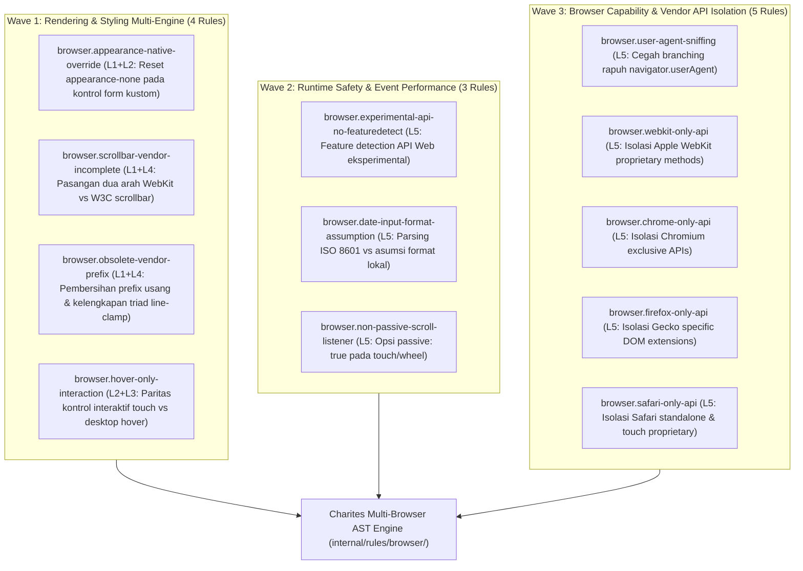

# EXPANSION-BATCH-05: Multi-Browser Compatibility Standards (`browser.*`)
> **Kode Dokumen:** `SPEC-EXP-05-BROWSER`
> **Kategori:** `browser`
> **Pilar:** `01-SPEC` (WHAT - Spesifikasi Perilaku & Kontrak Rule)
> **Status:** Active Expansion Specification (12 Aturan Terkurasi: Wave 1 s/d Wave 3)
> **Standar Rujukan:**
> - MDN Web Docs Browser Compatibility Knowledge Base & Web Platform Tests (WPT)
> - W3C CSS Basic User Interface Module Level 4 (`appearance: none`)
> - W3C CSS Scrollbars Styling Module Level 1 (`scrollbar-width`, `scrollbar-color`)
> - W3C CSS Overflow Module Level 3 (`line-clamp` & WebKit Triad)
> - WICG / WHATWG Touch Events & Pointer Events Level 3 (Touch vs Hover Ergonomics)
> - HTML Living Standard Section 4.10.5 (Form Controls & Native Widget Rendering)
> - Tailwind CSS v4 Engine Specifications
> **Pilar Terkait:** [01-SPEC: themes.md](themes.md), [01-SPEC: a11y.md](a11y.md), & [01-SPEC: ux.md](ux.md)

---

## 1. Ikhtisar Kategori `browser` & Paradigma Multi-Engine Reality

Kategori `browser` Charites berfokus pada **kesetaraan tampilan, kestabilan runtime, dan ketiadaan regresi perilaku lintas mesin peramban web (Chromium/Blink, Gecko/Firefox, dan WebKit/Safari)**.

> **Prinsip Deteksi: Menangkap False Negatives Linter Standar**
> Sebagian besar tim frontend melakukan pengembangan dan pengujian pada Chromium desktop (Chrome / Edge) dengan mesin bertenaga tinggi. Kode yang ditulis sering kali:
> 1. Sah secara sintaksis HTML/CSS/TypeScript (`tsc` lolos tanpa error).
> 2. Tidak melanggar aturan ESLint bawaan maupun Stylelint default.
> 3. Tampak sempurna saat di-preview di Chrome localhost.
>
> Namun, begitu kode dijalankan di **Safari iOS (WebKit)** atau **Firefox (Gecko)** pada perangkat nyata:
> - Kontrol form tampil acak-adut karena tabrakan dengan widget native OS,
> - Kustomisasi scrollbar lenyap total menjadi scrollbar polos abu-abu,
> - Pemotongan teks multi-baris (*line-clamp*) gagal dan teks meluap (*overflow*),
> - Tombol aksi penting tidak bisa diakses sama sekali oleh pengguna layar sentuh karena disembunyikan di balik hover state.
>
> Charites bertindak sebagai **pemeriksa kompatibilitas statis (*Static Cross-Engine Inspector*)** yang memverifikasi kode sumber di level AST sebelum cacat lintas-mesin merugikan pengguna di produksi.



---

## 2. Pemetaan 5 Layer Analisis Mesin (`browser.*`)

Selaras dengan arsitektur Charites, aturan dalam kategori `browser.*` dibangun di atas 5 layer analitik bersama:

| Layer | Nama Layer | Peran dalam Aturan Kompatibilitas Browser | Contoh Penerapan di `browser.*` |
| :--- | :--- | :--- | :--- |
| **L1** | **Syntax & Attribute Presence** | Mendeteksi keberadaan tag form native, atribut kustom, inline style properties, dan vendor-prefix strings. | Memeriksa ketiadaan `appearance-none` pada tag `<select>`, mendeteksi string `-webkit-line-clamp`. |
| **L2** | **Semantic Role Classification** | Mengklasifikasikan apakah node merupakan kontrol form native, elemen aksi interaktif, atau kontainer scrollable via Component Registry. | Menentukan apakah elemen merupakan form control native atau komponen kustom React (`SelectTrigger`). |
| **L3** | **Relational & Parity Graph** | Mengevaluasi keberadaan pasangan pelengkap lintas-varian atau lintas-mesin pada node bersangkutan. | Memverifikasi apakah varian `hover:` memiliki pendamping `focus-visible:` atau `group-focus-within:`. |
| **L4** | **Value & Token Resolution** | Me-resolve utility class Tailwind v4 dan blok CSS untuk memverifikasi apakah triad styling saling melengkapi. | Memastikan utility `line-clamp` otomatis menyusun `display: -webkit-box` dan `box-orient: vertical`. |
| **L5** | **Scope, Data-Flow & Call-Graph** | Melacak pemanggilan Web API browser, memastikan keberadaan guard `if ('api' in window)` atau try-catch. | Memeriksa pemanggilan `navigator.share()` atau `window.showOpenFilePicker()` tanpa feature detection. |

---

## 3. Ringkasan Matriks Rule `browser.*` (12 Aturan)

| Rule ID | Fokus Invarian | Wave | Layer | Severity | Autofix |
| :--- | :--- | :---: | :---: | :---: | :---: |
| `browser.appearance-native-override` | Kontrol form native ber-styling kustom wajib memiliki `appearance-none` untuk mereset render WebKit/Safari | **W1** | L1+L2 | `warning` | Yes |
| `browser.scrollbar-vendor-incomplete` | Kustomisasi scrollbar wajib mendeklarasikan pasangan dua arah (WebKit `::-webkit-scrollbar` $\leftrightarrow$ W3C `scrollbar-width`/`color`) | **W1** | L1+L4 | `warning` | Yes |
| `browser.obsolete-vendor-prefix` | Prefix usang harus dibersihkan, dan styling truncating `-webkit-line-clamp` wajib menyertakan triad lengkap | **W1** | L1+L4 | `info` / `warning` | Yes |
| `browser.hover-only-interaction` | Aksi atau pengungkapan konten interaktif tidak boleh hanya terikat pada `:hover`/`group-hover:` tanpa alternatif touch/keyboard | **W1** | L2+L3 | `error` (aksi) / `warning` | No |
| `browser.experimental-api-no-featuredetect` | Pemanggilan Web API modern wajib dibungkus pengujian ketersediaan (`'prop' in obj`, `typeof`, atau `CSS.supports`) | **W2** | L5 | `error` | No |
| `browser.date-input-format-assumption` | Nilai `value` dari kontrol tanggal wajib diparsing sebagai ISO 8601, bukan dipecah dengan asumsi format display lokal (`split('/')`) | **W2** | L5 | `error` | No |
| `browser.non-passive-scroll-listener` | Listener event `touchstart`, `touchmove`, atau `wheel` wajib mendeklarasikan opsi `{ passive: true }` kecuali memanggil `preventDefault` | **W2** | L5 | `warning` | Yes |
| `browser.user-agent-sniffing` | Percabangan fitur dilarang menggunakan regex/string matching pada `navigator.userAgent`; wajib menggunakan feature detection | **W3** | L5 | `warning` | No |
| `browser.webkit-only-api` | Pemanggilan method warisan WebKit berprefix (`webkitRequestFullscreen`) wajib memiliki fallback ke method standar W3C | **W3** | L5 | `warning` | No |
| `browser.chrome-only-api` | Penggunaan API eksklusif Chromium (`showOpenFilePicker`, `navigator.serial`) wajib memiliki jalur fallback untuk Firefox & Safari | **W3** | L5 | `warning` | No |
| `browser.firefox-only-api` | Penggunaan properti non-standar Gecko (`mozFullScreenElement`) wajib menyertakan resolusi ke standar W3C | **W3** | L5 | `warning` | No |
| `browser.safari-only-api` | Penggunaan API eksklusif ekosistem Apple (`navigator.standalone`, `ApplePaySession`) wajib memiliki fallback graceful | **W3** | L5 | `warning` | No |

---

## 4. Spesifikasi Detail Wave 1: Rendering & Styling Multi-Engine (4 Rules)

Wave 1 berfokus pada **kesetaraan tampilan visual murni di level CSS dan JSX**. Cacat pada Wave 1 adalah penyebab nomor satu mengapa website terlihat modern di Chrome laptop developer, tetapi hancur atau tidak bisa diklik di Safari iPhone pengguna.

---

### 4.1. `browser.appearance-native-override`
- **Design Rationale:** W3C CSS UI Level 4 & WebKit Form Control Rendering Disparity.
- **Konteks Realitas Lintas-Engine:**
  Blink (Chrome/Edge) dan Gecko (Firefox) secara otomatis menanggalkan sebagian besar dekorasi native platform saat developer menyematkan properti CSS seperti `border`, `background-color`, atau `border-radius` pada elemen form native.
  Sebaliknya, **WebKit (Safari macOS & iOS) mempertahankan gradien mengkilap (glossy gradient), bezel rounded 3D, dan panah native OS** kecuali properti `appearance: none` (`-webkit-appearance: none`) dideklarasikan secara eksplisit. Tanpa reset ini, styling Tailwind yang dipasang developer akan bertubrukan (*clash*) dengan widget native iOS.
- **Invariant (Predikat AST):**
  Untuk setiap elemen form native $E \in \{ \text{select}, \text{input[type=checkbox]}, \text{input[type=radio]}, \text{input[type=range]}, \text{input[type=date]} \}$:
  $$\text{hasCustomStyling}(E) \land \neg \text{hasAppearanceNone}(E) \implies \text{Violation (Warning)}$$
  di mana $\text{hasCustomStyling}(E)$ terpenuhi jika elemen memiliki class Tailwind bertema border (`border*`), background (`bg-*`), radius (`rounded-*`), atau shadow (`shadow-*`).
- **Mengapa Lolos Linter Standar:**
  Untaian `className` sepenuhnya sah secara sintaksis. ESLint dan Tailwind CSS IntelliSense tidak memahami bahwa rendering WebKit membutuhkan reset `appearance-none` untuk mengeksekusi override visual tersebut.
- **Anti-False-Positive & Skip Filter:**
  1. Komponen kustom yang hanya merender tag non-form (misal `<div role="combobox">` atau Radix UI `<SelectTrigger>`) secara otomatis di-*skip*.
  2. Input tipe teks standar (`text`, `email`, `password`, `search`) di mana WebKit tidak memaksakan bezel native kaku di-*skip*.
  3. Elemen yang sudah memiliki utility `appearance-none` dinyatakan **Compliant**.
- **Suspicious (Tampilan Rusak di Safari iOS):**
  ```tsx
  {/* Di Chrome tampak kotak rapi, di Safari iOS bertabrakan dengan glossy bezel native */}
  <select className="h-11 px-3.5 py-2.5 bg-background border border-input rounded-xl text-sm font-medium">
    <option value="1">Layanan Surat Pengantar</option>
    <option value="2">Layanan Keterangan Domisili</option>
  </select>
  ```
- **Compliant (Kesetaraan Visual Lintas Browser):**
  ```tsx
  {/* appearance-none mereset render native WebKit secara bersih */}
  <select className="appearance-none h-11 px-3.5 py-2.5 bg-background border border-input rounded-xl text-sm font-medium">
    <option value="1">Layanan Surat Pengantar</option>
    <option value="2">Layanan Keterangan Domisili</option>
  </select>
  ```
- **Engine:** L1 Syntax + L2 Semantic AST (`internal/rules/browser/appearance_native_override.go`).
- **Severity:** `warning`.
- **Autofix:** Otomatis menyisipkan kelas `appearance-none` pada urutan awal `className`.

---

### 4.2. `browser.scrollbar-vendor-incomplete`
- **Design Rationale:** W3C CSS Scrollbars Styling Module Level 1 vs WebKit Proprietary Pseudo-Elements.
- **Konteks Realitas Lintas-Engine:**
  Kustomisasi scrollbar memiliki sejarah fragmentasi panjang:
  - **WebKit / Blink Warisan:** Menggunakan pseudo-element `::-webkit-scrollbar`, `::-webkit-scrollbar-thumb`, `::-webkit-scrollbar-track`.
  - **Gecko (Firefox):** **Sama sekali tidak mendukung** `::-webkit-scrollbar`. Firefox secara ketat hanya mengimplementasikan standar resmi W3C: `scrollbar-width: thin | none | auto` dan `scrollbar-color: <thumb> <track>`.
  - **Chromium Modern (v121+):** Kini mendukung kedua metode, namun WebKit Safari masih mengandalkan pseudo-element.
  Jika developer hanya menulis CSS `::-webkit-scrollbar`, pengguna Firefox akan melihat scrollbar default sistem yang lebar dan kontrasnya bertabrakan dengan tema gelap aplikasi.
- **Invariant (Predikat AST):**
  Pada setiap blok CSS, CSS Module, atau styling kontainer scrollable:
  $$\text{declaresWebKitScrollbar} \iff \text{declaresW3CScrollbar}$$
  Jika dideklarasikan salah satu tanpa pasangannya, analyzer mengeluarkan peringatan ketidaklengkapan vendor.
- **Mengapa Lolos Linter Standar:**
  Stylelint default memvalidasi sintaks properti secara terpisah. Tidak ada aturan bawaan yang mewajibkan pasangan simetris antara pseudo-element vendor WebKit dan properti W3C standard.
- **Suspicious (Scrollbar Kustom Hilang di Firefox):**
  ```css
  /* Hanya berfungsi di Chrome/Safari; Firefox menampilkan scrollbar default abu-abu tebal */
  .custom-scroll::-webkit-scrollbar {
    width: 6px;
  }
  .custom-scroll::-webkit-scrollbar-thumb {
    background: var(--muted-foreground);
    border-radius: 9999px;
  }
  ```
- **Compliant (Dukungan Paritas Penuh Chrome, Safari, dan Firefox):**
  ```css
  .custom-scroll {
    /* Standar W3C Resmi (Didukung Firefox & Chromium Modern) */
    scrollbar-width: thin;
    scrollbar-color: var(--muted-foreground) transparent;
  }

  /* WebKit Legacy (Didukung Safari iOS/macOS & Chrome versi lama) */
  .custom-scroll::-webkit-scrollbar {
    width: 6px;
  }
  .custom-scroll::-webkit-scrollbar-thumb {
    background: var(--muted-foreground);
    border-radius: 9999px;
  }
  ```
- **Engine:** L1 Syntax + L4 Value Resolution AST (`internal/rules/browser/scrollbar_vendor_incomplete.go`).
- **Severity:** `warning`.
- **Autofix:** Menyediakan boilerplate pasangan standar `scrollbar-width: thin; scrollbar-color: ...` yang sesuai dengan token warna yang digunakan pada `::-webkit-scrollbar-thumb`.

---

### 4.3. `browser.obsolete-vendor-prefix`
- **Design Rationale:** CSS Cascade Cleanliness & W3C CSS Overflow Module Level 3 Triad Completeness.
- **Konteks Realitas Lintas-Engine:**
  Aturan ini menangani dua permasalahan kompatibilitas:
  1. **Vendor Prefix Usang (Dead Code):** Properti seperti `-moz-border-radius`, `-webkit-border-radius`, `-moz-box-shadow`, `-webkit-box-shadow`, atau `-webkit-transition` sudah menjadi baseline standar CSS selama lebih dari satu dekade. Menulisnya di era sekarang menambah bloat bundle dan mengotori cascade.
  2. **Triad Pemotongan Teks Multi-Baris (`-webkit-line-clamp`):**
     Spesifikasi pemotongan teks elipsis multi-baris mensyaratkan **tiga serangkai properti wajib (*The Mandatory Triad*)**:
     ```text
     display: -webkit-box;
     -webkit-box-orient: vertical;
     -webkit-line-clamp: <integer>;
     overflow: hidden;
     ```
     Jika developer hanya menulis `-webkit-line-clamp: 3` (misalnya pada inline style objek React `style={{ WebkitLineClamp: 3 }}`) tanpa `display: -webkit-box` dan `box-orient`, pemotongan teks akan **gagal senyap (*silent failure*)** di semua engine browser.
- **Invariant (Predikat AST):**
  1. Deteksi properti usang: bendera deklarasi CSS/JSX yang cocok dengan daftar prefix mati.
  2. Deteksi ketidaklengkapan triad: jika deklarasi memuat `-webkit-line-clamp` (atau camelCase `WebkitLineClamp`), pastikan kontainer juga memuat `display: -webkit-box`, `-webkit-box-orient: vertical`, dan `overflow: hidden`.
- **Mengapa Lolos Linter Standar:**
  Objek `style={{ WebkitLineClamp: 2 }}` sah secara tipe TypeScript `React.CSSProperties`. Type-checker tidak memiliki kecerdasan relasional untuk mengetahui bahwa properti tersebut membutuhkan 3 deklarasi pendamping agar dapat berfungsi.
- **Suspicious (Silent Failure pada Pemotongan Paragraf):**
  ```tsx
  {/* -webkit-line-clamp gagal senyap karena tidak ada display: -webkit-box */}
  <p style={{ WebkitLineClamp: 2, overflow: "hidden" }} className="text-sm text-muted-foreground">
    Pemberitahuan resmi terkait jadwal pelayanan administrasi kependudukan di balai desa...
  </p>
  ```
- **Compliant (Memanfaatkan Utilitas Resmi Tailwind v4):**
  ```tsx
  {/* Utility line-clamp-2 secara otomatis mengompilasi triad CSS yang lengkap dan kompatibel */}
  <p className="line-clamp-2 text-sm text-muted-foreground">
    Pemberitahuan resmi terkait jadwal pelayanan administrasi kependudukan di balai desa...
  </p>
  ```
- **Engine:** L1 Syntax + L4 Value Resolution AST (`internal/rules/browser/obsolete_vendor_prefix.go`).
- **Severity:** `info` (untuk pembersihan prefix usang) / `warning` (untuk ketidaklengkapan triad line-clamp).
- **Autofix:** Menyarankan penggantian objek inline style ke kelas utilitas Tailwind `line-clamp-*`.

---

### 4.4. `browser.hover-only-interaction`
- **Design Rationale:** Fitts's Law on Touch Surfaces & WCAG 2.2 SC 2.1.1 (Keyboard Navigation).
- **Konteks Realitas Lintas-Engine:**
  Mayoritas lalu lintas aplikasi modern berasal dari perangkat layar sentuh (Safari iOS dan Chrome Android). **Layar sentuh tidak memiliki kursor mouse fisik dan tidak memiliki mekanisme hover sungguhan.**
  Ketika aksi penting (seperti tombol Hapus, Edit, Salin Link, atau menu konteks) disembunyikan secara default dengan `opacity-0` dan hanya dimunculkan via `hover:` atau `group-hover:opacity-100`:
  1. Pengguna layar sentuh **tidak pernah bisa melihat tombol tersebut**.
  2. Pada Safari iOS, mengetuk elemen sering kali memicu *sticky hover* yang membingungkan dan membutuhkan dua kali tap untuk mengeksekusi aksi.
  3. Pengguna navigasi keyboard (aksesibilitas) tidak bisa melihat kontrol saat berpindah fokus menggunakan tombol `Tab`.
- **Invariant (Predikat AST):**
  Untuk setiap node interaktif atau kontainer aksi $N$:
  $$\text{hasHoverReveal}(N) \land \neg \text{hasKeyboardTouchCounterpart}(N) \implies \text{Violation (Error)}$$
  di mana $\text{hasHoverReveal}(N)$ adalah penggunaan utility `hover:*` atau `group-hover:*` yang mengubah visibilitas (`opacity-0`, `hidden`, `invisible`, `scale-0`), dan $\text{hasKeyboardTouchCounterpart}(N)$ adalah keberadaan alternatif `focus:*`, `focus-visible:*`, `group-focus-within:*`, atau tombol permanen.
- **Mengapa Lolos Linter Standar:**
  Rangkaian utility kelas `opacity-0 group-hover:opacity-100` adalah kode Tailwind yang 100% valid dan sangat populer di tutorial desktop web. Linter standar buta terhadap kenyataan bahwa ketiadaan hover di mobile melumpuhkan fungsionalitas aplikasi.
- **Suspicious (Aksi Tidak Bisa Diakses di HP & Keyboard):**
  ```tsx
  <div className="group flex items-center justify-between p-3 border rounded-xl">
    <span>Berkas_KTP.pdf</span>
    {/* Tombol hapus HANYA muncul saat mouse diarahkan (hilang total di layar sentuh!) */}
    <button
      type="button"
      onClick={handleDelete}
      className="opacity-0 group-hover:opacity-100 text-destructive text-sm"
    >
      Hapus
    </button>
  </div>
  ```
- **Compliant (Dukungan Paritas Layar Sentuh & Navigasi Keyboard):**
  ```tsx
  <div className="group flex items-center justify-between p-3 border rounded-xl">
    <span>Berkas_KTP.pdf</span>
    {/* Dapat diakses via hover desktop, tombol Tab keyboard, dan sentuhan fokus */}
    <button
      type="button"
      onClick={handleDelete}
      className="opacity-0 group-hover:opacity-100 group-focus-within:opacity-100 focus-visible:opacity-100 text-destructive text-sm"
    >
      Hapus
    </button>
  </div>
  ```
- **Engine:** L2 Semantic + L3 Relational AST (`internal/rules/browser/hover_only_interaction.go`).
- **Severity:** `error` (pada aksi destruktif/kritis seperti hapus/edit) / `warning` (pada pengungkapan dekoratif).

---

## 5. Gambaran Ringkas Wave 2 & Wave 3

### 5.1. Wave 2: Runtime Safety & Event Performance (3 Rules)
- **`browser.experimental-api-no-featuredetect` (L5):** Memeriksa pemanggilan Web API modern (`navigator.share`, `navigator.bluetooth`, `document.startViewTransition`) agar selalu dibungkus pengecekan ketersediaan runtime untuk mencegah `TypeError: undefined is not a function` di browser non-pendukung.
- **`browser.date-input-format-assumption` (L5):** Memastikan pembacaan input tanggal native tidak menggunakan asumsi pemecahan string lokal (`.split('/')`), melainkan mematuhi jaminan spesifikasi W3C ISO 8601 (`YYYY-MM-DD`).
- **`browser.non-passive-scroll-listener` (L5):** Menegakkan opsi `{ passive: true }` pada listener sentuh (`touchstart`, `touchmove`, `wheel`) untuk mencegah compositor thread browser terblokir yang menyebabkan patah-patah (*scroll jank*).

### 5.2. Wave 3: Browser Capability & Vendor API Isolation (5 Rules)
- **`browser.user-agent-sniffing` (L5):** Mengeliminasi deteksi browser rapuh berbasis `navigator.userAgent.includes(...)` dan mengarahkan ke feature detection modern via `CSS.supports` atau `'feature' in window`.
- **`browser.webkit-only-api`, `browser.chrome-only-api`, `browser.firefox-only-api`, `browser.safari-only-api` (L5):** Mengisolasi pemanggilan API spesifik vendor agar selalu memiliki jalur fallback universal.

---

## 6. Penyelarasan dengan Design Tokens & Tailwind v4 (`ThemeTokenRegistry`)

Sama seperti kategori `theme.*` dan `ux.*`, kategori `browser.*` mematuhi disiplin desain sistem:
1. **Nol Arbitrary Pixel:** Seluruh contoh kode perbaikan menggunakan standar rem Tailwind v4 (`h-11`, `px-3.5`, `py-2.5`, `rounded-xl`).
2. **Kepatuhan Token Warna:** Scrollbar kustom wajib merujuk ke token semantik (`var(--muted-foreground)`, `var(--border)`), bukan hex mentah atau palet primitif.
3. **Kompatibilitas Spesifisitas Tailwind v4:** Aturan `appearance-native-override` dirancang agar utilitas `appearance-none` dapat bekerja secara harmonis dengan layer utilitas Tailwind v4.

---

## 7. Infrastruktur Anti-False-Positive & Supresi Charites

Untuk skenario desain khusus di mana developer sengaja mempertahankan perilaku browser native tertentu:
1. **Supresi Terpadu Charites:**
   - JSX/TSX: `{/* charites:ignore browser.appearance-native-override -- intentional native select on iOS */}`
   - Astro: `<!-- charites:ignore browser.appearance-native-override -- intentional native select on iOS -->`
   - CSS: `/* charites:ignore browser.scrollbar-vendor-incomplete */`
2. **Component Semantic Registry Integration:** Komponen UI headless kustom (seperti Shadcn `<Select>` atau Radix UI) yang tidak merender kontrol native di-*skip* secara otomatis tanpa menghasilkan peringatan palsu.

---

## 8. Struktur Modul Kode & Roadmap Eksekusi Wave 1

Implementasi aturan Wave 1 ditempatkan secara modular di `internal/rules/browser/`:

```text
internal/rules/browser/
├── appearance_native_override.go     # Wave 1: Form control WebKit reset
├── scrollbar_vendor_incomplete.go    # Wave 1: Two-way scrollbar pairing
├── obsolete_vendor_prefix.go         # Wave 1: Clean dead prefixes & line-clamp triad
├── hover_only_interaction.go         # Wave 1: Touch vs hover parity
├── contract_test.go                  # 8-Pillars Canonical Contract Validator
└── benchmark_test.go                 # QUAL-03 Zero Allocation Benchmarks
```

Setiap rule Wave 1 akan divalidasi dengan **1-SSOT Golden Tri-Corpus** di `tests/correctness/browser/<slug>/` yang mencakup kasus uji positif, negatif, dan adversarial untuk menjamin **nol regresi dan nol false-positive**.
