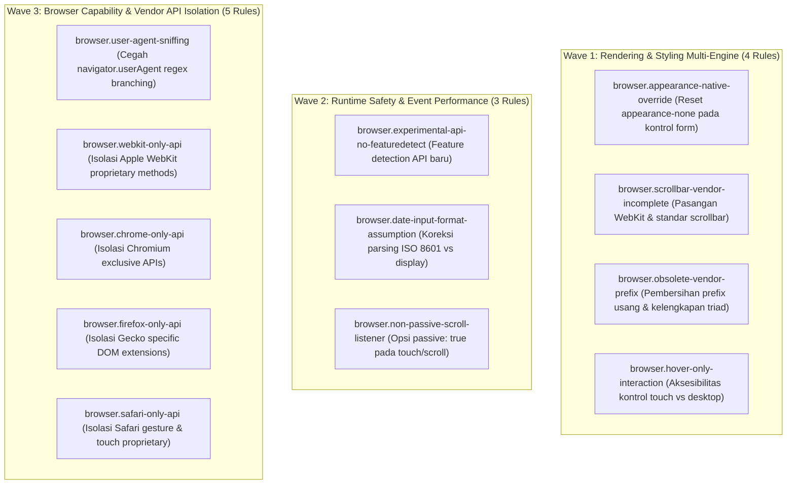

# EXPANSION-BATCH-05: Multi-Browser Compatibility Standards (`browser.*`)
> **Kode Dokumen:** `SPEC-EXP-05-BROWSER`
> **Kategori:** `browser`
> **Pilar:** `01-SPEC` (WHAT - Spesifikasi Perilaku & Kontrak Rule)
> **Status:** Active Expansion Specification (12 Aturan Terkurasi)
> **Standar Rujukan:**
> - MDN Web Docs Browser Compatibility Knowledge Base
> - W3C CSS Scrollbars Level 1 (`scrollbar-width`, `scrollbar-color`)
> - W3C CSS UI Level 4 (`appearance: none`)
> - WICG Passive Event Listeners Specification
> - HTML Living Standard Section 4.10.5.1.7 (Date/Time ISO 8601 Specifications)

---

## 1. Ikhtisar Kategori `browser` (12 Aturan Terkurasi)

Kategori `browser` Charites berfokus pada **kesetaraan tampilan dan stabilitas runtime lintas mesin browser (Chromium, Gecko/Firefox, dan WebKit/Safari)**.

> **Prinsip deteksi kategori ini:** Charites diarahkan untuk menangkap *false negative* dari linter/type-checker standar (ESLint, `tsc`, Stylelint default) - kode yang sintaksisnya sah, tipe datanya cocok, bahkan lolos smoke-test manual di browser default development (biasanya Chrome), tapi keliru secara desain lintas-engine: diam-diam no-op, salah cabang logika, atau rusak visual di Firefox/Safari. Setiap rule di bawah menyertakan alasan mengapa pola tersebut tidak tertangkap oleh linter biasa.



---

## 2. Spesifikasi Detail Rule `browser.*`

### 2.1. `browser.appearance-native-override`
- **Tujuan:** Mencegah elemen form custom tampil berbeda antar engine - Chrome/Firefox menghormati override CSS pada kontrol native, sementara Safari (WebKit) cenderung mempertahankan gaya native macOS/iOS bila tidak direset eksplisit.
- **Mengapa Lolos Linter Standar:** `className` tetap berupa string valid dan tidak ada aturan ESLint/Tailwind bawaan yang memeriksa apakah kombinasi kelas menghasilkan override visual yang benar; masalah baru kelihatan saat dirender di WebKit, bukan saat lint/build.
- **Dampak Lintas Browser:** Safari (utama), potensi minor di Firefox versi lama.
- **In-Scope:** Elemen `<select>` atau `<input type="checkbox|radio|range|date">` dengan className kustom (`border`, `bg-*`, `rounded-*`) tanpa `appearance-none`.
- **Bad:** `<select className="border rounded-md px-3 py-2">`
- **Good:** `<select className="appearance-none border rounded-md px-3 py-2">`
- **Engine:** JSX/TSX AST.
- **Severity:** Warning.

### 2.2. `browser.scrollbar-vendor-incomplete`
- **Tujuan:** Memastikan kustomisasi scrollbar konsisten. Chrome & Safari (WebKit) butuh pseudo-elemen `::-webkit-scrollbar*`, sedangkan Firefox butuh properti standar `scrollbar-width`/`scrollbar-color`.
- **Mengapa Lolos Linter Standar:** CSS-nya valid dan Stylelint default tidak punya rule yang mewajibkan pasangan cross-vendor untuk scrollbar; hasilnya "terlihat oke" saat preview di Chrome, padahal fallback-nya hilang total di Firefox.
- **Dampak Lintas Browser:** Firefox akan menampilkan scrollbar default polos jika hanya properti WebKit yang didefinisikan.
- **In-Scope:** Blok style (CSS Module/`styled-components`/inline styles) pada elemen scrollable yang hanya memuat salah satu keluarga (WebKit saja atau standar saja).
- **Bad:** `.list::-webkit-scrollbar { width: 6px; }` (tanpa `scrollbar-width`)
- **Good:** `.list { scrollbar-width: thin; scrollbar-color: #999 transparent; } .list::-webkit-scrollbar { width: 6px; }`
- **Engine:** CSS/Style AST.
- **Severity:** Warning.

### 2.3. `browser.experimental-api-no-featuredetect`
- **Tujuan:** Mencegah crash runtime saat memanggil Web API yang dukungannya tidak merata antar Chrome/Firefox/Safari (mis. `navigator.share`, `navigator.bluetooth`, `navigator.usb`, `document.startViewTransition`, `navigator.gpu`) tanpa pengecekan ketersediaan lebih dulu.
- **Mengapa Lolos Linter Standar:** `navigator.share` dkk terdaftar di `lib.dom.d.ts` sehingga `tsc` tidak error; ESLint juga tidak tahu API tsb bisa `undefined` di runtime browser tertentu - baru ketahuan saat pengguna Firefox desktop menekan tombol share dan aplikasi crash.
- **Dampak Lintas Browser:** Bervariasi per API; pola amannya sama - selalu feature-detect sebelum memanggil API eksperimental/vendor-spesifik.
- **In-Scope:** Pemanggilan langsung API di atas yang tidak dibungkus `if (typeof X !== 'undefined')`, `'share' in navigator`, atau try-catch.
- **Bad:** `navigator.share({ title, url });`
- **Good:** `if (navigator.share) { navigator.share({ title, url }); } else { fallbackCopyLink(url); }`
- **Engine:** Call Expression AST.
- **Severity:** Error.

### 2.4. `browser.obsolete-vendor-prefix`
- **Tujuan:** Membersihkan prefix vendor yang tidak lagi diperlukan pada baseline browser modern, sekaligus menangkap prefix yang dipasang tidak lengkap (mis. `-webkit-line-clamp` tanpa pasangan wajibnya).
- **Mengapa Lolos Linter Standar:** Properti camelCase pada objek `style` inline React (`WebkitLineClamp`, dst) sah secara tipe `React.CSSProperties`; linter tidak memeriksa apakah triad properti yang saling bergantung sudah lengkap.
- **Dampak Lintas Browser:** Fitur terlihat rusak di Chrome/Firefox modern karena hanya properti WebKit lama yang ditulis, atau properti mati yang membebani maintenance.
- **In-Scope:** `style={{ WebkitLineClamp: n }}` tanpa `display: '-webkit-box'` & `WebkitBoxOrient: 'vertical'` yang menyertainya.
- **Bad:** `style={{ WebkitLineClamp: 3 }}`
- **Good:** className `"line-clamp-3"` (utility Tailwind bawaan yang otomatis menyusun triad properti terkait)
- **Engine:** JSX/Style AST.
- **Severity:** Info.

### 2.5. `browser.hover-only-interaction`
- **Tujuan:** Mencegah kontrol penting hanya bisa diakses lewat state `:hover`/`group-hover:` - perangkat sentuh (mayoritas trafik mobile Chrome Android & Safari iOS) tidak punya hover sungguhan.
- **Mengapa Lolos Linter Standar:** Deretan className Tailwind ini sepenuhnya valid - tidak ada warning dari ESLint atau Tailwind IntelliSense; masalahnya murni perilaku UX di perangkat tanpa hover sungguhan, bukan kesalahan sintaksis.
- **Dampak Lintas Browser:** Mempengaruhi semua browser mobile, tidak spesifik satu engine.
- **In-Scope:** Elemen aksi/menu/tooltip berisi info wajib yang HANYA punya varian `hover:`/`group-hover:`, tanpa `focus:`, `focus-visible:`, `focus-within:`, atau `active:` sebagai alternatif.
- **Bad:** `<div className="opacity-0 group-hover:opacity-100">Hapus</div>`
- **Good:** `<div className="opacity-0 group-hover:opacity-100 group-focus-within:opacity-100 focus-visible:opacity-100">Hapus</div>`
- **Engine:** JSX/TSX AST.
- **Severity:** Error.

### 2.6. `browser.date-input-format-assumption`
- **Tujuan:** Mencegah asumsi format tampilan tanggal/waktu native (yang berbeda-beda antar Chromium, Gecko, WebKit) merembes ke logika parsing aplikasi.
- **Mengapa Lolos Linter Standar:** `.split('/')` pada string adalah operasi type-safe biasa; TypeScript tidak punya cara memverifikasi bahwa asumsi format separator itu keliru untuk locale/engine tertentu.
- **Dampak Lintas Browser:** Format tampilan `<input type="date">` berbeda per OS/engine, tapi `value` yang dibaca lewat JS dijamin ISO 8601 (`yyyy-mm-dd`) oleh spesifikasi HTML - banyak kode salah mengasumsikan format tampilan lokal.
- **In-Scope:** Pembacaan `e.target.value` dari `<input type="date|time|datetime-local">` yang langsung dipecah dengan asumsi format lokal (`split('/')`, dsb).
- **Bad:** `const [dd, mm, yyyy] = e.target.value.split('/');`
- **Good:** `const date = new Date(e.target.value); // value dijamin format ISO yyyy-mm-dd, konsisten lintas browser`
- **Engine:** Call Expression AST.
- **Severity:** Error.

### 2.7. `browser.non-passive-scroll-listener`
- **Tujuan:** Mencegah scroll/pinch terasa patah (*jank*) karena listener sentuh/scroll yang memblokir compositor thread saat dijalankan tanpa opsi `passive`.
- **Mengapa Lolos Linter Standar:** `addEventListener('touchmove', handler)` secara signature DOM API sah dengan 2 argumen; linter standar menganggapnya normal, padahal mematikan scroll optimization Chromium/Firefox.
- **Dampak Lintas Browser:** Chrome & Firefox menegakkan perilaku ini lebih ketat di beberapa target event; Safari lebih toleran tapi tetap diuntungkan performanya.
- **In-Scope:** `addEventListener('touchstart' | 'touchmove' | 'wheel', handler)` tanpa argumen ketiga berisi `{ passive: true }` (kecuali memang butuh `preventDefault()`).
- **Bad:** `el.addEventListener('touchmove', handler);`
- **Good:** `el.addEventListener('touchmove', handler, { passive: true });`
- **Engine:** Call Expression AST.
- **Severity:** Warning.

### 2.8. `browser.user-agent-sniffing`
- **Tujuan:** Mencegah percabangan logika deteksi browser berbasis parsing string `navigator.userAgent`/`navigator.appVersion` - UA string bisa dipalsukan (UA override DevTools, in-app browser Instagram/TikTok/WhatsApp menyisipkan token custom, browser baru meniru UA lama demi kompatibilitas web usang).
- **Mengapa Lolos Linter Standar:** `navigator.userAgent` adalah string biasa dan `.includes()`/`.match()`/`.indexOf()` adalah method String yang sepenuhnya type-safe - tidak ada error TypeScript maupun warning ESLint. Kerapuhannya murni logis, bukan sintaksis.
- **Dampak Lintas Browser:** Berpotensi salah deteksi di semua browser yang menjalankan cabang tsb, karena pola matching UA tidak pernah benar-benar lengkap/masa-depan-proof.
- **In-Scope:** Member expression `navigator.userAgent`/`navigator.appVersion` sebagai operand `.includes(...)`/`.match(...)`/`.indexOf(...)` di dalam kondisi `if`/`switch`/ternary untuk menentukan cabang fitur atau tampilan.
- **Bad:** `if (navigator.userAgent.includes('Safari') && !navigator.userAgent.includes('Chrome')) { applySafariFix(); }`
- **Good:** `if (!CSS.supports('height', '100dvh')) { applyDvhFallback(); } // feature detection, bukan UA sniffing`
- **Engine:** Member Expression AST.
- **Severity:** Warning.

### 2.9. `browser.webkit-only-api`
- **Tujuan:** Menandai pemanggilan method/properti berprefix `webkit*` peninggalan pra-standardisasi (mis. `webkitRequestFullscreen`, `webkitEnterFullscreen`, `webkitAudioContext`) tanpa fallback ke API standar.
- **Mengapa Lolos Linter Standar:** Properti-properti ini masih terdaftar di banyak type definition DOM sehingga type-checker tidak komplain; kode bahkan lolos smoke-test manual jika developer kebetulan testing di Safari/engine lama yang masih mengenali prefix tsb.
- **Dampak Lintas Browser:** Chrome/Firefox modern yang sudah pindah ke API standar akan mengabaikan pemanggilan ini secara diam-diam - tidak ada error, tapi fitur tidak jalan.
- **In-Scope:** Call expression ke `*.webkitRequestFullscreen()`, `*.webkitEnterFullscreen()`, `*.webkitExitFullscreen()`, dsb tanpa didahului pengecekan API standar (`requestFullscreen`) atau `typeof`.
- **Bad:** `videoEl.webkitEnterFullscreen();`
- **Good:** `if (videoEl.requestFullscreen) { videoEl.requestFullscreen(); } else if (videoEl.webkitEnterFullscreen) { videoEl.webkitEnterFullscreen(); }`
- **Engine:** Call Expression AST.
- **Severity:** Warning.

### 2.10. `browser.chrome-only-api`
- **Tujuan:** Menandai penggunaan API eksklusif Chromium (mis. File System Access API `window.showOpenFilePicker`/`showSaveFilePicker`, Web Serial `navigator.serial`, Web HID `navigator.hid`, Badging API `navigator.setAppBadge`) tanpa fallback, karena API ini sama sekali tidak ada di Firefox maupun Safari.
- **Mengapa Lolos Linter Standar:** Mayoritas tim development memakai Chrome, jadi kode ini "berjalan sempurna" saat manual testing dan lolos type-check dengan `@types` yang sesuai - ilusi sudah benar, padahal fitur akan hilang total (`undefined`, bukan error kompilasi) di browser lain.
- **Dampak Lintas Browser:** Firefox & Safari - properti terkait bernilai `undefined`, biasanya memicu `TypeError` saat dipanggil tanpa pengecekan.
- **In-Scope:** Pemanggilan langsung method di atas tanpa `'showOpenFilePicker' in window` atau jalur alternatif (mis. `<input type="file">`).
- **Bad:** `const [handle] = await window.showOpenFilePicker();`
- **Good:** `if ('showOpenFilePicker' in window) { const [handle] = await window.showOpenFilePicker(); } else { triggerHiddenFileInput(); }`
- **Engine:** Call Expression AST.
- **Severity:** Warning.

### 2.11. `browser.firefox-only-api`
- **Tujuan:** Menandai pemakaian API/properti non-standar khas Gecko (mis. `document.mozFullScreenElement`, `element.mozRequestFullScreen`) tanpa fallback ke API standar - pasangan simetris dari rule WebKit/Chrome di atas.
- **Mengapa Lolos Linter Standar:** Properti `moz*` legal secara akses objek JS biasa; tanpa type definition khusus, TypeScript hanya melewatkannya lewat `any`/cast, bukan error keras yang menghentikan build.
- **Dampak Lintas Browser:** Chrome & Safari - properti bernilai `undefined`, cabang logika terkait tidak pernah terpicu.
- **In-Scope:** Property access berprefix `moz*` pada `document`/`navigator`/elemen DOM tanpa fallback ke API standar atau pengecekan `typeof`.
- **Bad:** `if (document.mozFullScreenElement) { exitFullscreen(); }`
- **Good:** `const fsElement = document.fullscreenElement ?? document.webkitFullscreenElement ?? document.mozFullScreenElement;`
- **Engine:** Call Expression AST.
- **Severity:** Warning.

### 2.12. `browser.safari-only-api`
- **Tujuan:** Menandai penggunaan API/objek yang murni eksklusif ekosistem Safari/iOS/macOS - bukan sekadar prefix WebKit lama, tapi API yang memang tidak pernah diimplementasi Chromium/Gecko, mis. `navigator.standalone`, `window.ApplePaySession`, jembatan `window.webkit.messageHandlers` pada WKWebView.
- **Mengapa Lolos Linter Standar:** Developer yang membangun fitur ini biasanya testing langsung di perangkat Apple sehingga fitur memang berjalan benar; linter tidak melihat masalah apa pun karena tidak ada error - fiturnya hanya "diam-diam hilang" (bukan crash) di browser lain, sering baru disadari lewat bug report pengguna Android/Windows.
- **Dampak Lintas Browser:** Chrome & Firefox - nilai `undefined`, cabang UI/fitur terkait (mis. indikator mode standalone PWA) tidak pernah aktif.
- **In-Scope:** Akses `navigator.standalone`, `window.ApplePaySession`, `window.webkit?.messageHandlers` tanpa fallback/penanganan eksplisit untuk kondisi `undefined`.
- **Bad:** `if (navigator.standalone) { hideInstallBanner(); }`
- **Good:** `const isStandalone = ('standalone' in navigator && navigator.standalone === true) || window.matchMedia('(display-mode: standalone)').matches; if (isStandalone) { hideInstallBanner(); }`
- **Engine:** Call Expression AST.
- **Severity:** Warning.

---

## 3. Ringkasan Matriks Rule `browser.*`

| Rule ID | Fokus Tujuan | Severity | Engine / Target |
|---|---|---|---|
| `browser.appearance-native-override` | Konsistensi kontrol form native vs WebKit/Safari | warning | JSX/TSX AST |
| `browser.scrollbar-vendor-incomplete` | Konsistensi scrollbar WebKit vs Firefox standar | warning | CSS/Style AST |
| `browser.experimental-api-no-featuredetect` | Pencegahan runtime crash pada API eksperimental | error | Call Expression AST |
| `browser.obsolete-vendor-prefix` | Pembersihan vendor prefix mati & kelengkapan triad | info | JSX/Style AST |
| `browser.hover-only-interaction` | Penjaminan aksesibilitas kontrol pada touch device | error | JSX/TSX AST |
| `browser.date-input-format-assumption` | Penjaminan koreksi parsing nilai ISO 8601 | error | Call Expression AST |
| `browser.non-passive-scroll-listener` | Optimalisasi thread komposit & performa scrolling | warning | Call Expression AST |
| `browser.user-agent-sniffing` | Pencegahan branching rapuh berbasis UA string | warning | Member Expression AST |
| `browser.webkit-only-api` | Deteksi pemanggilan WebKit proprietary methods | warning | Call Expression AST |
| `browser.chrome-only-api` | Deteksi API eksklusif Chromium tanpa fallback | warning | Call Expression AST |
| `browser.firefox-only-api` | Deteksi non-standard Gecko methods | warning | Call Expression AST |
| `browser.safari-only-api` | Deteksi API eksklusif Safari/WebKit tanpa fallback | warning | Call Expression AST |

---

## 4. Browser Capability Profile & Knowledge Base Architecture

Rule `browser.*` menggunakan capability matrix terpusat untuk menjaga determinisme dan objektivitas:

```text
Browser Compatibility Knowledge Base
├── standards-baseline
│   ├── chrome-supported
│   ├── firefox-supported
│   └── safari-supported
└── vendor-divergence
    ├── webkit-quirks
    ├── gecko-quirks
    └── chromium-extensions
```

AST engine bertugas menemukan penggunaan capability secara statis:

```text
Source AST
    ↓
API / CSS / DOM Pattern Detection
    ↓
Capability Resolver
    ↓
Browser Compatibility Knowledge Base
    ↓
Chrome / Firefox / Safari Matrix
    ↓
Rule Diagnostic Result
```

Dengan arsitektur ini, rule tidak kaku mengatakan:
`"Safari tidak mendukung X"`
melainkan:
`"X digunakan tanpa feature detection, sementara compatibility profile menunjukkan capability X tidak universal pada baseline browser."`
Hal ini membuat seluruh rule berbobot tinggi, tidak mudah usang (*future-proof*), dan objektif.
