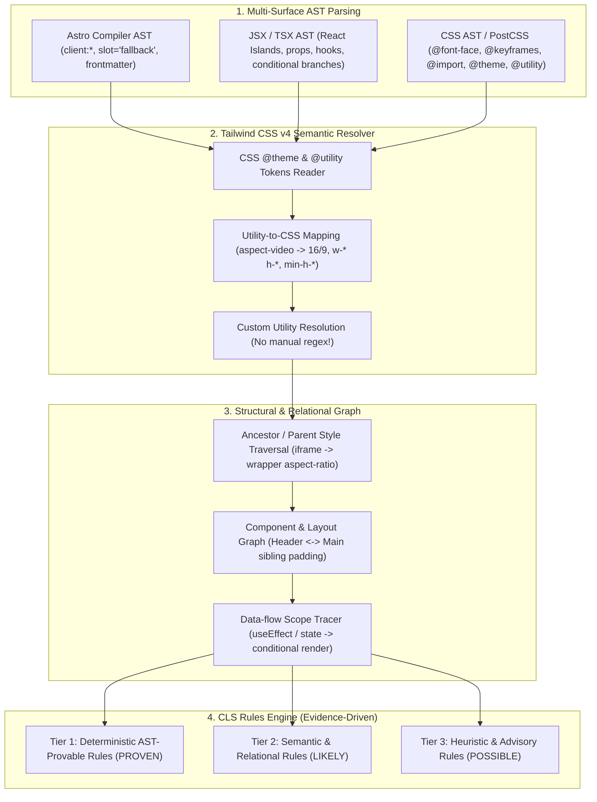

# EXPANSION-BATCH-08: Core Web Vitals - Cumulative Layout Shift (CLS) Standards (`cls.*`)
> **Kode Dokumen:** `SPEC-EXP-08-CLS`
> **Kategori:** `cls` (Core Web Vitals & Perceptual Layout Stability)
> **Pilar:** `01-SPEC` (WHAT - Spesifikasi Perilaku & Kontrak Rule)
> **Status:** Active Expansion Specification (16 Aturan Terkurasi: 4 Wave × 4 Aturan)
> **Kalibrasi Desain:** Calibrated against Reviewer 1 & Reviewer 2 AST-Driven Architecture Guidelines
> **Migrasi Sumber:** [`charites-legacy/cls-checker.ts`](file:///home/will/Monorepo/charites/charites-legacy/cls-checker.ts)
> **Standar Rujukan:**
> - W3C Web Performance Working Group: Cumulative Layout Shift (CLS) Metric Specification
> - Google Core Web Vitals Guidelines (Target CLS $< 0.1$ at 75th percentile of page loads)
> - W3C CSS Box Sizing Module Level 4 (`aspect-ratio`, `contain-intrinsic-size`, `interpolate-size`)
> - W3C CSS Fonts Module Level 4 (`font-display`, `size-adjust`, `ascent-override`, `descent-override`)
> - W3C CSS Transitions & Animations Level 2 (GPU Composited Layers vs Layout-Triggering Properties)
> - W3C CSS Overflow Module Level 3 (`scrollbar-gutter: stable`)
> - Astro Docs: Template Directives (`client:only`, `slot="fallback"`, Islands Architecture)
> - Tailwind CSS v4 Specification: CSS-First Configuration (`@theme`, `@utility`, `@source`), Sizing Utilities
> **Pilar Terkait:** [01-SPEC: a11y.md](a11y.md), [01-SPEC: browser.md](browser.md), [01-SPEC: pwa.md](pwa.md), [01-SPEC: responsive.md](responsive.md), [01-SPEC: themes.md](themes.md), & [01-SPEC: ux.md](ux.md)

---

## 1. Ikhtisar Kategori `cls` & Epistemologi Analisis Statis vs Runtime

Kategori `cls` Charites dirancang untuk mentransformasikan skrip warisan [`charites-legacy/cls-checker.ts`](file:///home/will/Monorepo/charites/charites-legacy/cls-checker.ts) ke dalam arsitektur static analyzer murni Go 1.26+ berkinerja tinggi (`0 B/op, 0 allocs/op` pada clean node).

### 1.1. Hakikat Runtime CLS vs Batasan Bukti Statis AST
Cumulative Layout Shift (CLS) adalah **metrik runtime yang diukur langsung oleh browser** selama siklus hidup halaman:

$$\text{CLS} = \sum (\text{Impact Fraction} \times \text{Distance Fraction})$$

Sebuah parser AST statis **tidak dapat dan tidak pernah berniat menjadi *final judge of performance***. Pengukuran layout shift aktual hanya dapat diputuskan secara definitif oleh web browser preview langsung (Chromium LayoutNG, Blink Paint, Firefox Gecko, Safari WebKit) yang menjalankan pipeline layouting penuh, sub-pixel rendering, kalkulasi dynamic viewport, dan observer LayoutShift API.

Secara konkret, sebuah parser AST statis:
1. **Bukan Web Browser**: Tidak memiliki layout tree fisik, font rasterizer, compositing engine, atau kalkulator geometri viewport runtime.
2. **Tidak Menghitung Piksel Runtime Aktual**: Tidak dapat mengetahui ukuran piksel aktual pada viewport tertentu atau menghitung skor CLS numerik aktual (misal: 0.04 vs 0.12).
3. **Tidak Menilai Nilai Absolut Dinamis**: Tidak dapat memverifikasi apakah besaran kompensasi padding secara absolut pas dengan tinggi dinamis suatu header responsif.
4. **Tidak Mengetahui State Lingkungan OS**: Tidak dapat memastikan apakah sebuah kontainer dengan `overflow-y: auto` akan memunculkan scrollbar fisik atau overlay scrollbar pada platform pengguna.

### 1.2. Prinsip Shift-Left: Detektor Pola Penulisan Kode, Bukan Final Judge Performa

> [!IMPORTANT]
> **Charites Adalah Detektor Pola Penulisan (*Static Pattern Detector*), Bukan Final Judge Performa Browser**
> - **Peran Charites (Shift-Left Gatekeeper):** Bekerja di level kode (editor, git hook, CI) dalam hitungan milidetik untuk mendeteksi **kebiasaan/pola penulisan kode yang cacat secara struktural** (misalnya: lupa reservasi dimensi gambar, abai terhadap fallback slot Astro, atau memicu reflow CPU via keyframes) sebelum kode menyentuh browser.
> - **Peran Web Browser Langsung (The Final Judge):** Pengujian visual langsung di browser, Chrome DevTools Performance Panel, Lighthouse CI, dan data CrUX/RUM pada pengguna riil adalah **satu-satunya pengambil keputusan final performa layout**. Analisis AST Charites jelas kalah jauh dalam hal observasi runtime dibandingkan browser langsung, sehingga Charites membatasi klaimnya hanya sebagai *"Static Evidence of Layout Instability Risk"* (indikator probabilitas risiko sintaksis).

Setiap temuan diagnostik Charites diklasifikasikan ke dalam 4 status keyakinan (*Evidence Confidence*):
- **`PROVEN`**: Pelanggaran sintaksis deterministik 100% yang dapat dibuktikan dari node AST murni (contoh: `@font-face` tanpa `font-display`, `@keyframes` menganimasikan `width`/`height`).
- **`LIKELY`**: Bukti struktural kuat tentang ketiadaan reservasi ruang statis (contoh: tag `` tanpa dimensi HTML/CSS/Tailwind, komponen Astro `client:only` tanpa `slot="fallback"`).
- **`POSSIBLE`**: Pola heuristik semantik atau rekomendasi kebijakan tingkat tata letak platform (contoh: kontainer slot iklan berbasis regex nama kelas, slider viewport tanpa batas tinggi, deklarasi `scrollbar-gutter`).
- **`UNVERIFIABLE`**: Konstruksi dinamis yang mematikan analisis statis (contoh: JSX spread props `{...imgProps}`, kelas dinamis variabel `className={clsx(dynamic)}`). Aturan Charites **wajib melaporkan status `UNVERIFIABLE` sebagai catatan peringatan/audit, bukan memperlakukannya sebagai lolos (silent pass)**.

### 1.3. Standar Narasi Diagnostik: Probabilitas Risiko vs Klaim Absolut Performa

Untuk menjaga integritas ilmiah dan mencegah klaim berlebihan (*overconfident / ownership bias*), Charites menetapkan pedoman narasi pesan diagnostik (*diagnostic message guidelines*) yang ketat bagi seluruh aturan `cls.*`:

> [!WARNING]
> **Larangan Klaim Kepastian Runtime (Anti-Pattern Pesan):**
> Mesin Charites **DILARANG** mengklaim bahwa suatu kode pasti merusak nilai CLS runtime atau menuduh layout pengguna pasti hancur:
> -  *Bukan:* `"CLS halaman ini jelek/rusak karena komponen ini!"`
> -  *Bukan:* `"Konten di bawah pasti bergeser saat gambar dimuat!"`
> -  *Bukan:* `"Header fixed ini pasti menyebabkan layout shift!"`
>
> **Standar Penyampaian Bukti Statis & Potensi Risiko (Wajib Dipatuhi):**
> Narasi diagnostik **WAJIB** membingkai temuan sebagai **bukti ketiadaan reservasi statis yang berpotensi memicu kenaikan CLS**:
> -  *Standar:* `"Elemen  tidak mendefinisikan dimensi intrinsik atau utilitas rasio aspek; pola penulisan ini berpotensi menyebabkan kenaikan CLS saat gambar dimuat oleh browser."`
> -  *Standar:* `"Komponen island Astro menggunakan client:only tanpa slot='fallback'; pola penulisan ini berisiko memicu pergeseran tata letak pasca-hidrasi."`
> -  *Standar:* `"Animasi @keyframes menargetkan properti geometri (top/left); pola penulisan ini berpotensi memicu reflow CPU berkelanjutan."`

Format pesan diagnostik terpadu Charites mengikuti struktur 3-lapisan:
$$\text{Pesan Diagnostik} = \text{[Bukti Statis AST]} + \text{[Potensi Risiko CLS]} + \text{[Saran Remediasi]}$$

---

## 2. Arsitektur Multi-Surface Parsing, Tailwind v4 Engine & Unfair Advantage

Ekosistem Astro + React Islands + Tailwind CSS v4 memerlukan mesin analisis multi-permukaan (*multi-surface parser engine*), bukan sekadar single-file visitor naif:



### 2.1. Spesifikasi Tailwind CSS v4 Semantic Resolver
Pada Tailwind CSS v4, konfigurasi tidak lagi berbasis file JavaScript (`tailwind.config.js`), melainkan **CSS-first configuration** menggunakan direktif `@theme`, `@utility`, dan `@source`. Analyzer yang hanya mengandalkan pencocokan regex nama kelas lama akan mengalami false-negative masif.

Mesin Charites mengintegrasikan **Tailwind v4 Semantic Resolver**:
1. **Peta Dimensi Bawaan**:
   - `aspect-video` $\implies \text{aspect-ratio: } 16 / 9$
   - `aspect-square` $\implies \text{aspect-ratio: } 1 / 1$
   - `w-full h-auto` $\implies$ lebar fleksibel tanpa reservasi vertikal (membutuhkan `aspect-*` atau atribut intrinsik)
   - `w-[240px] h-[120px]` / `w-10 h-10` $\implies$ reservasi dimensi geometris eksplisit
   - `min-h-[...]` / `h-[...]` $\implies$ batas tinggi tereservasi
   - `table-fixed` $\implies \text{table-layout: fixed}$
2. **Ekstraksi Token `@theme` Proyek**: Resolusi dinamis membaca deklarasi CSS global `@theme { --aspect-poster: 2/3; }` sehingga utilitas `aspect-poster` dikenali sebagai reservasi aspek rasio sah.
3. **Penyaringan Anotasi Eksplisit**: Mengakui direktif inline bypass `/* charites:ignore cls.* */` dan atribut data `data-cls-ignore`.

### 2.2. The AST Parser Unfair Advantage: Mengapa Linter Konvensional Gagal

Linter konvensional (seperti ESLint dengan `eslint-plugin-react` / `eslint-plugin-tailwindcss`, Stylelint, atau HTMLHint) beroperasi dengan asumsi **single-file, single-domain, regex-driven, dan node-isolated visitor**. Model ini mengalami kegagalan fundamental saat menghadapi masalah CLS modern:

| Dimensi Evaluasi | Linter Konvensional (ESLint, Stylelint, HTMLHint) | Charites Multi-Surface AST Engine | Unfair Advantage Charites |
| :--- | :--- | :--- | :--- |
| **Batas Lintas-Permukaan (*Cross-Surface Domain Boundaries*)** | Terisolasi per berkas: ESLint hanya membaca JS/TSX, Stylelint hanya membaca CSS, HTMLHint hanya membaca HTML statis. Ketiganya tidak dapat berkomunikasi. | Menyatukan Astro Compiler AST, React JSX AST, PostCSS CSS AST, dan Tailwind v4 Resolver dalam satu representasi Leaf IR terpadu. | Mampu menghubungkan direktif Astro (`client:only`) dengan slot fallback React, atau aturan CSS `@import` dengan tag `<link>` di dalam `<head>` layout Astro. |
| **Resolusi Utilitas Tailwind CSS v4** | Memakai pencocokan regex teks mentah pada atribut string `className`. Buta terhadap konfigurasi CSS-first (`@theme`, `@utility`). | Memiliki parser semantik yang mengekstrak langsung nilai dari blok `@theme` di CSS proyek. | Mengetahui bahwa `aspect-video` merepresentasikan `aspect-ratio: 16/9`, `w-10 h-10` adalah `2.5rem`, dan custom utility `@utility aspect-poster` adalah rasio sah. Nol false-positive pada utility Tailwind modern! |
| **Penelusuran Relasi & Leluhur (*Ancestor & Sibling Traversal*)** | Node visitor lokal satu arah. Mengevaluasi node `iframe` atau `header` secara terisolasi tanpa konteks kontainer pembungkusnya. | Graf Relasional L3 dengan penelusuran leluhur (*ancestor traversal*) hingga 3 tingkat dan simpul saudara (*sibling inspection*). | Mengakui `<div class="aspect-video"><iframe .../></div>` sebagai valid (menghindari alarm palsu ESLint), dan memverifikasi padding kompensasi `<main class="pt-16">` terhadap `<header class="fixed">`. |
| **Karakterisasi Dinamis & Spread Props** | Mengabaikan `{...props}` atau memberikan *silent pass*, menciptakan celah bahaya runtime layout shift yang lolos ke produksi. | Klasifikasi presisi dengan status `UNVERIFIABLE`. | Secara transparan menandai bahwa komponen dengan spread props tidak dapat dijamin keamanannya secara statis, memicu audit proaktif. |
| **Pelacakan Alur Data & Lifecycle (*Data-Flow Scope*)** | Hanya memeriksa nama fungsi hooks secara dangkal (misal: dependency array linter). | Pelacak cakupan L5 yang membedakan efek samping murni (analytics) dengan mutasi geometri DOM (`appendChild`, percabangan kondisional `{data && <Widget />}`). | Menangkap penyuntikan DOM dinamis yang merusak alur halaman (*in-flow content*) tanpa memicu alarm palsu pada hook non-DOM. |
| **Perilaku Performa Mesin** | Single-threaded JavaScript/Node.js, alokasi memori tinggi, waktu booting lama pada monorepo besar. | Arsitektur murni Go 1.26+ Leaf IR berkecepatan native (`0 B/op, 0 allocs/op` pada clean node). | Mampu memindai ratusan komponen Astro, React Islands, dan stylesheet dalam hitungan milidetik tanpa membebani memori pipeline CI. |

---

## 3. Garansi Zero Redundancy & Matriks Ortogonalitas Lintas Kategori

Untuk menjamin **100% pemisahan tanggung jawab (*Separation of Concerns*) dan 0% tumpang-tindih (Zero Redundancy)**, seluruh 16 aturan `cls.*` dipetakan terhadap kategori lain di Charites (`a11y.*`, `browser.*`, `pwa.*`, `responsive.*`, `theme.*`, `ux.*`):

| Rule `cls.*` | Rule Kategori Lain Terdekat | Fokus Domain Kategori Lain | Fokus Domain Kategori `cls` | Garansi Batasan Ortogonal (*Zero Redundancy Guarantee*) |
|---|---|---|---|---|
| `cls.unsized-image` | `responsive.image-overflow` | Mencegah gambar meluap melebihi lebar layar horizontal ponsel (`max-w-full`). | Memastikan kotak render tereservasi (*reserved rendering box*) sebelum berkas gambar diunduh. | `responsive` memeriksa dimensi kontainer horizontal ($X$ axis); `cls` memeriksa reservasi ruang vertikal awal ($Y$ axis reflow). |
| `cls.unsized-embed-frame` | `responsive.aspect-ratio-overflow` | Menjamin rasio aspek tidak terpotong di layar sempit ponsel. | Memastikan video/iframe late-loading memiliki dimensi atau pembungkus aspect-ratio statis. | `responsive` mengaudit keterpotongan konten viewport; `cls` mengaudit pergeseran vertikal ke bawah saat iframe termuat. |
| `cls.unreserved-ad-container` | `ux.spacing-inversion` | Mengatur hierarki ritme jarak margin/padding antarseksi halaman. | Menjamin slot iklan pihak ketiga memiliki `min-height` atau `aspect-ratio` tereservasi. | `ux` mengaudit estetika hierarki tipografi/konten; `cls` mengaudit penyuntikan runtime dinamis payload iklan ke alur dokumen. |
| `cls.unconstrained-carousel` | `responsive.horizontal-overflow` | Mencegah konten meluap ke luar lebar layar viewport secara horizontal. | Mengunci tinggi viewport slider atau rasio aspek slide agar pergantian item tidak mengubah tinggi total kontainer. | `responsive` memeriksa batas tepi kanan layar; `cls` memeriksa stabilitas tinggi vertikal saat pergantian slide dinamis. |
| `cls.font-display-missing` | `theme.missing-token-fallback` | Memastikan variabel CSS memiliki nilai cadangan (*token fallback*). | Memastikan `@font-face` memiliki strategi swap (`swap`, `optional`, `fallback`) untuk mencegah FOUT layout reflow. | `theme` mengaudit resolusi CSS token; `cls` mengaudit siklus rendering glif teks font web terhadap layout flow. |
| `cls.unadjusted-font-metric` | `theme.unlayered-token-definition` | Mengaudit pengorganisasian cascade layer `@layer` dalam CSS. | Menganjurkan deskriptor `size-adjust` dan `ascent-override` pada font fallback sistem untuk menyamakan bounding-box. | `theme` mengaudit struktur arsitektur CSS; `cls` mengaudit disparitas geometri bounding box glif font. |
| `cls.font-import-late-discovery` | `pwa.insecure-context-resource` | Memeriksa kepatuhan protokol HTTPS pada aset PWA. | Mendeteksi CSS `@import` font eksternal pemblokir rendering dan memvalidasi `<link rel="preconnect">` di `<head>`. | `pwa` mengaudit integritas keamanan transport; `cls` mengaudit rantai dependensi pemblokiran render CSS cascade. |
| `cls.text-icon-late-reflow` | `a11y.touch-target-size` | Memastikan target sentuh tombol fisik berukuran minimal $44 \times 44\text{px}$. | Memastikan ligatur font ikon teks memiliki kotak pembungkus terkunci (`w-* h-* inline-block`) sebelum glif dirender. | `a11y` mengaudit aksesibilitas motorik pengguna; `cls` mengaudit pelebaran layout oleh teks mentah sebelum substitusi glif. |
| `cls.layout-trigger-animation` | `theme.no-reduced-motion` | Menegakkan aksesibilitas vestibular pengguna lewat query `prefers-reduced-motion`. | Melarang animasi `@keyframes` pada properti reflow CPU (`top/left/width/height/margin/padding`). | `theme` mengaudit preferensi vestibular OS; `cls` mengaudit komputasi GPU composited vs CPU layout reflow pipeline. |
| `cls.layout-trigger-transition` | `ux.animation-excessive-duration` | Membatasi durasi animasi agar tidak memicu kelelahan kognitif ($< 300\text{ms}$). | Membatasi CSS `transition` hanya pada properti GPU composited (`transform`, `opacity`), bukan geometri layout. | `ux` mengaudit batas waktu ambang Doherty; `cls` mengaudit properti CSS yang memicu pergeseran tata letak berkelanjutan. |
| `cls.unstable-scrollbar-gutter` | `browser.scrollbar-vendor-incomplete` | Memastikan paritas vendor styling scrollbar (`::-webkit-scrollbar` vs `scrollbar-width`). | Menganjurkan `scrollbar-gutter: stable` pada scroller root untuk mencegah pergeseran horisontal saat scrollbar muncul. | `browser` mengaudit kompatibilitas rendering lintas-engine; `cls` mengaudit stabilitas lebar konten akibat kemunculan scrollbar. |
| `cls.dynamic-table-reflow` | `responsive.unwrapped-table-overflow` | Memastikan tabel dibungkus kontainer scroll horisontal (`overflow-x-auto`) di mobile. | Mengharuskan tabel dinamis memiliki strategi penguncian kolom (`table-fixed`, `<colgroup>`, atau lebar header stabil). | `responsive` mengaudit pembungkus scroll kontainer luar; `cls` mengaudit algoritma re-komputasi lebar kolom tabel dalam. |
| `cls.client-only-hydration-pop` | `theme.hydration-theme-mismatch` | Mencegah kilatan kontras warna dark/light mode (FOUC) saat proses hidrasi. | Mencegah kekosongan tata letak akibat pemintasan SSR total (`client:only`) tanpa kerangka fallback resmi Astro. | `theme` mengaudit ketidaksinkronan warna/token; `cls` mengaudit kekosongan ruang fisik geometris komponen. |
| `cls.unreserved-fixed-header` | `responsive.safe-area-missing` | Menangani inset fisik notch/poni perangkat (`env(safe-area-inset-top)`). | Memastikan elemen header fixed/sticky memiliki kompensasi padding/margin pada saudara layout (`<main class="pt-16">`). | `responsive` mengaudit area fisik hardware perangkat; `cls` mengaudit pergeseran relatif antar elemen saudara di DOM. |
| `cls.dynamic-content-without-reserved-space` | `ux.unbounded-async-flag` | Mengaudit keberadaan status boolean pemuatan (*loading indicator flag*). | Memastikan penyuntikan DOM dinamis atau percabangan async diarahkan ke kontainer dengan geometri tereservasi. | `ux` mengaudit transparansi status kognitif antarmuka; `cls` mengaudit ketiadaan reservasi fisik tempat pemasangan konten. |
| `cls.collapsible-height-jump` | `ux.animation-excessive-duration` | Mengaudit ambang waktu responsivitas perseptual interaksi manusia. | Mengharuskan transisi panel lipat menggunakan teknik zero-shift (CSS Grid `0fr -> 1fr`, clip-path, atau interpolate-size). | `ux` mengaudit persepsi latensi transisi; `cls` mengaudit mutasi dimensi layout tak terbatas yang mendorong konten di bawahnya. |

---

## 4. Ringkasan Matriks 16 Rule `cls.*` (4 Wave Terkalibrasi)

Setiap aturan dipetakan berdasarkan **Subject $\to$ Evidence $\to$ Predicate $\to$ Confidence $\to$ Exceptions**, Domain Parser, Severity, dan Kelayakan Autofix:

| Wave | Rule ID | Legacy Ref | Domain Parser | Tier | Confidence | Severity | Kelayakan Autofix |
| :---: | :--- | :---: | :---: | :---: | :---: | :---: | :---: |
| **W1** | `cls.unsized-image` | R1 | JSX/Astro + TW4 | T1 | `PROVEN` / `LIKELY` | `warning` | Parsial (auto-inject `astro:assets`; saran untuk remote) |
| **W1** | `cls.unsized-embed-frame` | R2 | JSX/Astro + TW4 + Ancestor | T1 | `LIKELY` | `warning` | Rendah (sarankan wrapper `aspect-video`) |
| **W1** | `cls.unreserved-ad-container` | Baru | JSX/Astro + Heuristic | T2 | `POSSIBLE` / `LIKELY` | `warning` | Rendah (sarankan `min-h-*` sesuai slot) |
| **W1** | `cls.unconstrained-carousel` | Baru | JSX/Astro + TW4 | T2 | `POSSIBLE` | `warning` | Rendah (sarankan bounded container height) |
| **W2** | `cls.font-display-missing` | R3 | CSS AST (PostCSS) | T1 | `PROVEN` | `error` | **Tinggi** (auto-inject `font-display: swap;`) |
| **W2** | `cls.unadjusted-font-metric` | Baru | CSS AST (PostCSS) | T3 | `POSSIBLE` | `info` | Tidak disarankan (membutuhkan data tabel metrik font) |
| **W2** | `cls.font-import-late-discovery` | Baru | CSS AST + HTML Graph | T2 | `LIKELY` | `warning` | Menengah (codemod `<link rel="preconnect">` di `<head>`) |
| **W2** | `cls.text-icon-late-reflow` | Baru | JSX/Astro + CSS AST | T3 | `POSSIBLE` | `info` | Menengah (sarankan sizing utility `w-6 h-6 inline-block`) |
| **W3** | `cls.layout-trigger-animation` | R4 | CSS AST (PostCSS) | T1 | `PROVEN` | `warning` | **Tinggi** untuk posisional (`top/left` $\to$ `translate`); tidak untuk width/height |
| **W3** | `cls.layout-trigger-transition` | R5 | CSS AST (PostCSS) | T1 | `PROVEN` | `warning` | Rendah (sarankan `transform` / `opacity`) |
| **W3** | `cls.unstable-scrollbar-gutter` | Baru | CSS AST (PostCSS) | T3 | `POSSIBLE` | `info` | **Tinggi** (tambahkan `scrollbar-gutter: stable;` di `:root`) |
| **W3** | `cls.dynamic-table-reflow` | Baru | JSX/Astro AST | T2 | `LIKELY` | `warning` | Menengah (sarankan `table-fixed` atau `<colgroup>`) |
| **W4** | `cls.client-only-hydration-pop` | R8 | Astro Compiler AST | T1 | `LIKELY` | `warning` | Menengah (sarankan kerangka `slot="fallback"`) |
| **W4** | `cls.unreserved-fixed-header` | R6 | JSX/Astro + Layout Graph | T2 | `POSSIBLE` | `warning` | Tidak (magnitude kompensasi tidak dapat diverifikasi statis) |
| **W4** | `cls.dynamic-content-without-reserved-space` | R7 | JSX/TSX Scope / Data-flow | T2 | `POSSIBLE` | `warning` | Tidak (memerlukan restrukturisasi alur state & skeleton) |
| **W4** | `cls.collapsible-height-jump` | Baru | JSX/Astro + CSS AST | T2 | `LIKELY` | `warning` | Menengah (sarankan pola CSS Grid `0fr -> 1fr` / `interpolate-size`) |

---

## 5. Spesifikasi Detail & Kontrak Formal 16 Rule `cls.*`

### 5.1. `cls.unsized-image` (Wave 1 - Migrasi Legacy R1)
- **Sumber Legacy:** `charites-legacy/cls-checker.ts` (HTML R1 & JSX R1).
- **Domain Parser:** Astro Template AST + React JSX AST + Tailwind v4 Semantic Resolver.
- **Tier / Severity:** Tier 1 (Deterministic AST) / `warning` (menjadi `error` pada image layout statis di atas pelipatan layar).
- **Formal Contract:**
  - **Subject:** Node elemen gambar (``, `<Image>`, `<Picture>`).
  - **Evidence:** Keberadaan atribut dimensi intrinsik (`width`, `height`), deklarasi inline style (`width`, `height`, `aspect-ratio`), utilitas Tailwind (`w-*` + `h-*`, `aspect-*`), atau kontrak aset impor (`astro:assets`).
  - **Predicate:** Node elemen gambar **wajib** mendefinisikan *statically inferable reserved rendering box* melalui dimensi intrinsik, dimensi CSS eksplisit, atau rasio aspek CSS sebelum berkas diunduh browser.
  - **Confidence:** `PROVEN` jika atribut dimensi tidak ditemukan pada elemen dengan atribut statis; `UNVERIFIABLE` jika node menggunakan spread props (`{...imgProps}`) atau ekspresi kelas dinamis tak terurai.
  - **Exceptions:** Komponen `<Image />` dari `astro:assets` dengan sumber lokal (dimensi terbaca otomatis saat build), elemen dengan kelas Tailwind `aspect-video` / `aspect-square` / `w-* h-*`, atau elemen dengan style `aspect-ratio: ...`.
- **AST Parser Unfair Advantage vs Linter Konvensional:**
  Linter konvensional seperti `eslint-plugin-jsx-a11y` atau `eslint-plugin-react` hanya memeriksa keberadaan literal atribut HTML `width="..."` dan `height="..."`. Linter tersebut akan menghasilkan **false-positive** pada kode modern seperti `` atau ``. Sebaliknya, linter CSS (Stylelint) tidak dapat melihat elemen markup. Charites menggabungkan AST markup dan Tailwind v4 Semantic Resolver, mengenali bahwa utilitas Tailwind mengunci geometri kotak render. Selain itu, Charites secara transparan menandai `{...props}` sebagai `UNVERIFIABLE`, bukan meloloskannya secara buta (*silent pass*).
- **Non-Redundancy Guarantee:**
  Ortogonal penuh terhadap `responsive.image-overflow`. Aturan `responsive` memeriksa apakah gambar meluap horizontal pada layar kecil (`max-w-full`); aturan `cls.unsized-image` memeriksa kalkulasi aspect ratio browser sebelum berkas biner diunduh untuk mengeliminasi reflow vertikal.
- **Autofix Feasibility:** Parsial. Untuk gambar lokal Astro, dimensi dapat diinjeksi otomatis dari metadata gambar. Untuk gambar remote/dinamis, autofix mekanis tidak aman (berikan saran konfigurasi).
- **Suspicious:**
  ```tsx
  // Pelanggaran: Hanya menetapkan w-full tanpa height atau aspect-ratio
  
  ```
- **Compliant:**
  ```tsx
  // Solusi 1: Atribut numerik eksplisit
  

  // Solusi 2: Utilitas aspect-ratio Tailwind v4 (terdefinisi di core atau @theme)
  

  // Solusi 3: Pasangan utilitas w-* dan h-* eksplisit
  
  ```

---

### 5.2. `cls.unsized-embed-frame` (Wave 1 - Migrasi Legacy R2)
- **Sumber Legacy:** `charites-legacy/cls-checker.ts` (HTML R2 & JSX R1).
- **Domain Parser:** Astro Template AST + React JSX AST + Ancestor Traversal Engine.
- **Tier / Severity:** Tier 1 (Deterministic with Ancestor Traversal) / `warning`.
- **Formal Contract:**
  - **Subject:** Node media embed (`<iframe>`, `<video>`, `<embed>`, `<object>`, `<YouTube>`, `<ReactPlayer>`).
  - **Evidence:** Atribut tag (`width`, `height`), atau penelusuran relasi simpul leluhur (*ancestor node traversal*) yang memiliki utilitas rasio aspek (`aspect-*`) atau batas tinggi tereservasi (`min-h-*`).
  - **Predicate:** Node media embed **wajib** memiliki dimensi intrinsik eksplisit **ATAU** dibungkus langsung oleh kontainer leluhur yang menetapkan rasio aspek statis atau batas ketinggian minimum.
  - **Confidence:** `LIKELY` pada single-file AST; `UNVERIFIABLE` jika pembungkus berada di lintas batas berkas (misal: dilewatkan via `slot` Astro atau `children` React).
  - **Exceptions:** Embed dengan atribut `width` dan `height`, atau terbungkus dalam `div` dengan utilitas `aspect-video` / `aspect-[16/9]` / `min-h-[...]`.
- **AST Parser Unfair Advantage vs Linter Konvensional:**
  ESLint mengevaluasi simpul JSX dalam isolasi lokal (*single-node visitor*). Ketika memeriksa `<iframe src={url} className="w-full h-full" />`, ESLint tidak dapat mengetahui bahwa elemen induknya adalah `<div className="aspect-video">`, sehingga menghasilkan peringatan palsu (*false-positive*). Charites memanfaatkan Graf Relasional L3 untuk menelusuri rantai simpul leluhur (*ancestor traversal*) hingga 3 tingkat, memvalidasi keberadaan utilitas dimensi pada kontainer pembungkus.
- **Non-Redundancy Guarantee:**
  Ortogonal penuh terhadap `responsive.aspect-ratio-overflow`. Aturan `responsive` mengaudit rasio aspek agar tidak terpotong di layar ponsel sempit; aturan `cls.unsized-embed-frame` mengaudit ketiadaan reservasi ruang vertikal awal sebelum koneksi iframe pihak ketiga terbentuk.
- **Autofix Feasibility:** Rendah. Rasio aspek bervariasi tergantung konten video. Berikan saran (*codemod suggestion*) untuk membungkus dengan kontainer `aspect-video`.
- **Suspicious:**
  ```tsx
  // Pelanggaran: iframe berdiri sendiri tanpa dimensi atau wrapper aspect-ratio
  <iframe src="https://www.youtube.com/embed/xyz" title="Video" className="w-full" />
  ```
- **Compliant:**
  ```tsx
  // Patuh: Pembungkus leluhur menetapkan aspect-video (resolusi semantik Tailwind v4)
  <div className="w-full aspect-video">
    <iframe src="https://www.youtube.com/embed/xyz" title="Video" className="w-full h-full" />
  </div>
  ```

---

### 5.3. `cls.unreserved-ad-container` (Wave 1 - Baru)
- **Sumber Legacy:** Konsep baru (Heuristic Dynamic Insertion Reserve).
- **Domain Parser:** Astro Template AST + React JSX AST + Semantic Classifier.
- **Tier / Severity:** Tier 2 (Semantic Heuristic) / `warning`.
- **Formal Contract:**
  - **Subject:** Kontainer elemen slot periklanan dinamis.
  - **Evidence:** Sinyal semantik:
    - *Tingkat Keyakinan Tinggi (HIGH):* Komponen `<AdBanner>`, `<GoogleAd>`, `<AdSense>`, atribut `data-ad-slot`, `data-ad-client`, atribut `id="ad-*"` atau `id="dfp-ad-*"`.
    - *Tingkat Keyakinan Menengah (MEDIUM):* Nilai atribut `slot="ad"`, `class` mengandung `advertisement`, `ad-slot`, `sponsor-banner`.
  - **Predicate:** Kontainer yang teridentifikasi sebagai slot iklan dinamis **sebaiknya** memiliki geometri ruang statis tereservasi (`min-height` atau `aspect-ratio`) untuk menampung banner sebelum skrip iklan menyuntikkan payload.
  - **Confidence:** `LIKELY` jika terdeteksi melalui komponen SDK atau atribut data khusus; `POSSIBLE` jika hanya terdeteksi via nama kelas umum.
  - **Exceptions:** Kontainer iklan yang telah menetapkan utilitas `min-h-[...]`, `h-[...]`, `aspect-*`, atau menyertakan kerangka skeleton statis awal.
- **AST Parser Unfair Advantage vs Linter Konvensional:**
  Linter konvensional tidak memiliki pemahaman domain periklanan web. Skrip regex sederhana pada teks string kelas akan menghasilkan banyak false-positive pada elemen non-iklan. Charites menerapkan pengklasifikasi semantik L2 bertingkat (*Confidence Layering: HIGH vs MEDIUM*) yang berkorelasi dengan pemindai dimensi L4 untuk memastikan reservasi vertikal `min-h-*`.
- **Non-Redundancy Guarantee:**
  Ortogonal penuh terhadap `ux.spacing-inversion`. Aturan `ux` mengatur ritme vertikal visual hierarki konten statis; aturan `cls.unreserved-ad-container` secara spesifik mengamankan kotak render untuk penyuntikan dinamis skrip pihak ketiga.
- **Autofix Feasibility:** Tidak disarankan (ukuran slot iklan tergantung kontrak inventaris periklanan).
- **Suspicious:**
  ```tsx
  // Pelanggaran: Kontainer iklan dinamis tanpa reservasi dimensi minimum
  <div id="ad-leaderboard" data-ad-slot="12345" className="w-full text-center" />
  ```
- **Compliant:**
  ```tsx
  // Patuh: Direservasi dengan min-height standar IAB leaderboard (90px)
  <div id="ad-leaderboard" data-ad-slot="12345" className="w-full min-h-[90px] md:min-h-[250px] bg-muted/20" />
  ```

---

### 5.4. `cls.unconstrained-carousel` (Wave 1 - Baru)
- **Sumber Legacy:** Konsep baru (Carousel Slide Viewport Box Reservation).
- **Domain Parser:** Astro Template AST + React JSX AST + Semantic Pattern Detector.
- **Tier / Severity:** Tier 2 (Pattern Detector Heuristic) / `warning`.
- **Formal Contract:**
  - **Subject:** Elemen akar atau viewport track slider/carousel.
  - **Evidence:** Kombinasi kelas utilitas geser horisontal (`overflow-x-auto` + `scroll-snap-type` / `snap-x`), impor pustaka slider ternama (`swiper`, `embla-carousel`, `keen-slider`), atau penamaan semantik komponen `<Carousel>`, `<Slider>`.
  - **Predicate:** Viewport carousel **sebaiknya** mengunci tinggi kontainer atau rasio aspek slide utamanya agar pergantian slide atau keterlambatan pemuatan gambar slide tidak memicu ekspansi vertikal kontainer.
  - **Confidence:** `POSSIBLE` (pengenalan berbasis pola perilaku geser dan pustaka).
  - **Exceptions:** Komponen carousel yang mendefinisikan tinggi eksplisit pada akar (`h-*`, `min-h-*`) atau memiliki child slide dengan rasio aspek terkunci.
- **AST Parser Unfair Advantage vs Linter Konvensional:**
  ESLint tidak dapat mensintesis hubungan perilaku CSS horisontal (`overflow-x-auto snap-x`) dengan struktur perulangan anak slide JSX (`slides.map(...)`). Charites mendeteksi pola relasional L2 + L3, memverifikasi apakah kontainer track membungkus item slide dalam ketinggian terikat.
- **Non-Redundancy Guarantee:**
  Ortogonal penuh terhadap `responsive.horizontal-overflow`. Aturan `responsive` memeriksa apakah kontainer meluap ke luar lebar viewport horizontal; aturan `cls.unconstrained-carousel` memeriksa stabilitas dimensi vertikal kontainer carousel selama proses perpindahan slide dan pemuatan gambar.
- **Autofix Feasibility:** Rendah (berikan saran konfigurasi batas tinggi pada kontainer viewport).
- **Suspicious:**
  ```tsx
  // Pelanggaran: Viewport slider tanpa pembatas tinggi
  <div className="flex overflow-x-auto snap-x">
    {slides.map(s => )}
  </div>
  ```
- **Compliant:**
  ```tsx
  // Patuh: Kontainer viewport mengunci ketinggian dan gambar slide memiliki dimensi
  <div className="flex overflow-x-auto snap-x h-64 md:h-96 w-full">
    {slides.map(s => (
      <div key={s.id} className="snap-center shrink-0 w-full h-full">
        
      </div>
    ))}
  </div>
  ```

---

### 5.5. `cls.font-display-missing` (Wave 2 - Migrasi Legacy R3)
- **Sumber Legacy:** `charites-legacy/cls-checker.ts` (HTML R3 & JSX R2).
- **Domain Parser:** CSS AST (PostCSS) + JSX Tagged Template AST (`styled`, `css`).
- **Tier / Severity:** Tier 1 (Deterministic CSS AST) / `error`.
- **Formal Contract:**
  - **Subject:** Aturan deklarasi `@font-face` dalam berkas CSS atau template literal.
  - **Evidence:** Simpul atRule `@font-face` dalam CSS AST.
  - **Predicate:** Deklarasi `@font-face` **wajib** menyertakan deskriptor `font-display` dengan salah satu nilai sah: `swap`, `optional`, atau `fallback`.
  - **Confidence:** `PROVEN` (100% kepastian sintaksis).
  - **Exceptions:** Tidak ada pengecualian. Semua deklarasi `@font-face` kustom wajib menetapkan strategi rendering teks.
- **AST Parser Unfair Advantage vs Linter Konvensional:**
  Stylelint memiliki aturan untuk nama font, tetapi tidak dapat memindai template literal JSX (`createGlobalStyle`, `styled.div`, atau Emotion `css` strings) secara seragam dengan stylesheet `.css` dan blok `<style>` Astro. Charites memproses simpul `@font-face` di seluruh permukaan kode secara deterministik murni via Leaf IR.
- **Non-Redundancy Guarantee:**
  Ortogonal penuh terhadap `theme.missing-token-fallback`. Aturan `theme` mengaudit resolusi CSS token variables; aturan `cls.font-display-missing` mengaudit fase siklus swap font teks browser.
- **Autofix Feasibility:** **Tinggi**. Dapat diinjeksi secara otomatis dan aman dengan nilai standar `font-display: swap;`.
- **Suspicious:**
  ```css
  /* Pelanggaran: @font-face tanpa font-display descriptor */
  @font-face {
    font-family: 'GeistSans';
    src: url('/fonts/geist.woff2') format('woff2');
  }
  ```
- **Compliant:**
  ```css
  /* Patuh: Menyertakan font-display: swap */
  @font-face {
    font-family: 'GeistSans';
    src: url('/fonts/geist.woff2') format('woff2');
    font-display: swap;
  }
  ```

---

### 5.6. `cls.unadjusted-font-metric` (Wave 2 - Baru)
- **Sumber Legacy:** Konsep baru (Font Metric Overrides Advisory).
- **Domain Parser:** CSS AST (PostCSS).
- **Tier / Severity:** Tier 3 (Advisory / Heuristic) / `info`.
- **Formal Contract:**
  - **Subject:** Aturan deklarasi `@font-face` fallback lokal (`src: local(...)`).
  - **Evidence:** Deklarasi `@font-face` yang merujuk pada font sistem fallback.
  - **Predicate:** Deklarasi font fallback **disarankan** menyertakan penyesuaian metrik font (`size-adjust`, `ascent-override`, atau `descent-override`) untuk meminimalkan disparitas bounding-box teks dengan font web utama.
  - **Confidence:** `POSSIBLE` (analyzer statis hanya dapat mengecek ada/tidaknya properti, bukan ketepatan nilai metrik terhadap file font biner).
  - **Exceptions:** Font sistem bawaan, font ikon, atau proyek yang menggunakan perkakas optimasi font build-time otomatis (misal: `@next/font` atau generator metrik Astro).
- **AST Parser Unfair Advantage vs Linter Konvensional:**
  Linter konvensional tidak dapat mengenali intensi arsitektural bahwa deklarasi `@font-face` tertentu merupakan font pengganti sementara (*fallback placeholder*). Charites mendeteksi simpul `src: local(...)` yang membayangi font web dan menyarankan deskriptor penyesuaian metrik.
- **Non-Redundancy Guarantee:**
  Ortogonal penuh terhadap `theme.unlayered-token-definition`. Aturan `theme` memeriksa aturan pengelompokan layer arsitektur CSS; aturan `cls.unadjusted-font-metric` memeriksa deskriptor kalkulasi metrik bounding box teks.
- **Autofix Feasibility:** Tidak disarankan (memerlukan ekstraksi metrik biner font otentik).
- **Suspicious:**
  ```css
  /* Advisory: Font fallback tanpa override metrik */
  @font-face {
    font-family: 'InterFallback';
    src: local('Arial');
  }
  ```
- **Compliant:**
  ```css
  /* Patuh: Metrik disesuaikan untuk meminimalkan pergeseran swap */
  @font-face {
    font-family: 'InterFallback';
    src: local('Arial');
    ascent-override: 90%;
    descent-override: 22%;
    size-adjust: 107%;
  }
  ```

---

### 5.7. `cls.font-import-late-discovery` (Wave 2 - Baru / Refined R3)
- **Alias / Nama Sebelumnya:** `cls.render-blocking-font-import`.
- **Domain Parser:** CSS AST (PostCSS) + Astro HTML Document Graph.
- **Tier / Severity:** Tier 2 (Cross-Domain Syntax Check) / `warning`.
- **Formal Contract:**
  - **Subject:** Aturan `@import` dalam berkas CSS atau blok `<style>`.
  - **Evidence:** Simpul atRule `@import` yang memuat URL sumber daya font eksternal (misal: `https://fonts.googleapis.com/...`).
  - **Predicate:** Aturan CSS `@import` yang merujuk font pihak ketiga eksternal **sebaiknya digantikan** oleh elemen `<link rel="preconnect">` dan `<link rel="stylesheet">` pada elemen `<head>` dokumen HTML/Astro untuk mengeliminasi rantai pemblokiran render (*cascading render-blocking chain*).
  - **Confidence:** `LIKELY` (keberadaan URL font eksternal pada `@import` dapat dibuktikan statis).
  - **Exceptions:** **WAJIB MENGEJUALIKAN (WHITELIST):** `@import "tailwindcss";`, `@import "tailwindcss/theme";`, dan impor berkas CSS lokal (`@import "./tokens.css";`).
- **AST Parser Unfair Advantage vs Linter Konvensional:**
  Stylelint yang memiliki aturan larangan `@import` akan secara membabi-buta menandai `@import "tailwindcss";` sebagai pelanggaran pada Tailwind v4! Selain itu, Stylelint tidak memiliki akses ke dokumen Astro untuk memeriksa apakah `<link rel="preconnect">` sudah dipasang di `<head>`. Charites menghubungkan AST CSS dengan Graf Dokumen Astro secara lintas-permukaan.
- **Non-Redundancy Guarantee:**
  Ortogonal penuh terhadap `pwa.insecure-context-resource`. Aturan `pwa` memeriksa kepatuhan protokol transport HTTPS; aturan `cls.font-import-late-discovery` memeriksa rantai air terjun keterlambatan penemuan font dalam CSS cascade.
- **Autofix Feasibility:** Menengah (sarankan pemindahan URL ke `<head>` Astro Layout).
- **Suspicious:**
  ```css
  /* Pelanggaran: Late-discovery font import di dalam CSS */
  @import url('https://fonts.googleapis.com/css2?family=Inter:wght@400;700&display=swap');
  ```
- **Compliant:**
  ```html
  <!-- Patuh: Dideklarasikan pada layout root <head> -->
  <link rel="preconnect" href="https://fonts.googleapis.com" />
  <link rel="preconnect" href="https://fonts.gstatic.com" crossorigin />
  <link rel="stylesheet" href="https://fonts.googleapis.com/css2?family=Inter:wght@400;700&display=swap" />
  ```

---

### 5.8. `cls.text-icon-late-reflow` (Wave 2 - Baru)
- **Sumber Legacy:** Konsep baru (Text-Ligature Icon Font Dimension Locking).
- **Domain Parser:** React JSX AST + Astro Template AST + CSS Semantic Checker.
- **Tier / Severity:** Tier 3 (Heuristic Presence Check) / `info` (ditingkatkan ke `warning` jika keluarga icon font terdeteksi eksplisit).
- **Formal Contract:**
  - **Subject:** Elemen teks pembungkus ligatur font ikon.
  - **Evidence:** Elemen yang menggunakan kelas font ikon teks terkenal (`material-icons`, `material-symbols`, `font-icon`) atau memiliki aturan gaya `font-family` ikon, yang berisi teks mentah nama glif (misal: `shopping_cart`, `menu`).
  - **Predicate:** Elemen ligatur font ikon berbasis teks **wajib** mengunci dimensi kotak pembungkus (`inline-block`, `w-*`, `h-*`, `overflow-hidden`) agar teks mentah tidak memperlebar tata letak sebelum glif font selesai diunduh.
  - **Confidence:** `POSSIBLE` (hanya dipicu jika kelas/identitas font ikon dikenali secara eksplisit; tidak dijalankan pada teks sembarang).
  - **Exceptions:** Ikon SVG langsung (`<svg>`), paket pustaka ikon komponen (Lucide, Radix Icons, Heroicons), atau elemen yang telah memiliki kelas pembatas `w-6 h-6 inline-block overflow-hidden`.
- **AST Parser Unfair Advantage vs Linter Konvensional:**
  Linter konvensional tidak dapat menjembatani deklarasi CSS `font-family: 'Material Icons'` dengan teks anak JSX `<span>shopping_cart</span>`. Charites mengkorelasikan semantik kelas ikon dengan anak teks mentah dan memverifikasi keberadaan kelas pengunci dimensi Tailwind (`w-* h-* inline-block`).
- **Non-Redundancy Guarantee:**
  Ortogonal penuh terhadap `a11y.touch-target-size`. Aturan `a11y` memvalidasi ukuran target sentuh fisik $44 \times 44\text{px}$; aturan `cls.text-icon-late-reflow` mengaudit pembatasan dimensi wadah glif ligatur sebelum web font termuat.
- **Autofix Feasibility:** Menengah (sarankan penambahan kelas dimensi atau migrasi ke SVG komponen).
- **Suspicious:**
  ```tsx
  // Pelanggaran: Ligatur teks tanpa kotak dimensi terkunci
  <button className="flex items-center gap-2">
    <span className="material-icons">shopping_cart</span> Beli
  </button>
  ```
- **Compliant:**
  ```tsx
  // Patuh: Kotak dimensi 24x24px terkunci dengan overflow hidden
  <button className="flex items-center gap-2">
    <span className="material-icons inline-block w-6 h-6 overflow-hidden">shopping_cart</span> Beli
  </button>
  ```

---

### 5.9. `cls.layout-trigger-animation` (Wave 3 - Migrasi Legacy R4)
- **Sumber Legacy:** `charites-legacy/cls-checker.ts` (HTML R4 & JSX R2).
- **Domain Parser:** CSS AST (PostCSS) + JSX Tagged Template AST.
- **Tier / Severity:** Tier 1 (Deterministic CSS AST) / `warning`.
- **Formal Contract:**
  - **Subject:** Blok deklarasi keyframe animasi (`@keyframes`).
  - **Evidence:** Properti yang dideklarasikan di dalam selektor keyframe (`from`, `to`, `0%`...):
    $$\text{Geometry Props} \in \{\text{top}, \text{right}, \text{bottom}, \text{left}, \text{width}, \text{height}, \text{margin*}, \text{padding*}, \text{inset*}, \text{border-width}\}$$
  - **Predicate:** Animasi `@keyframes` **dilarang** memutasi properti geometri tata letak pemicu reflow CPU; mutasi visual **wajib** memanfaatkan properti layer composited GPU (`transform`, `opacity`).
  - **Confidence:** `PROVEN` (100% kepastian sintaksis AST CSS).
  - **Exceptions:** Tidak ada pengecualian untuk properti pergeseran posisi murni.
- **AST Parser Unfair Advantage vs Linter Konvensional:**
  Stylelint dapat memvalidasi nama animasi, namun tidak mengklasifikasikan properti CSS ke dalam kategori komposit GPU vs pemicu reflow CPU. Charites mengekstrak seluruh deklarasi keyframes dan memfilternya terhadap himpunan properti geometri W3C secara deterministik.
- **Non-Redundancy Guarantee:**
  Ortogonal penuh terhadap `theme.no-reduced-motion`. Aturan `theme` memeriksa ketaatan pada preferensi gerak vestibular pengguna (`prefers-reduced-motion`); aturan `cls.layout-trigger-animation` memeriksa jenis properti CSS yang dimutasi untuk menjamin pemrosesan di thread komposit GPU.
- **Autofix Feasibility:** **Tinggi** untuk properti posisional (`top/left` $\to$ `transform: translate(...)`); **Tidak ada** autofix mekanis untuk `width/height` (sarankan teknik CSS Grid atau `clip-path`).
- **Suspicious:**
  ```css
  /* Pelanggaran: Menganimasikan top dan margin */
  @keyframes slideIn {
    from { top: -20px; margin-top: 10px; }
    to { top: 0; margin-top: 0; }
  }
  ```
- **Compliant:**
  ```css
  /* Patuh: GPU composited transform */
  @keyframes slideIn {
    from { transform: translateY(-20px); opacity: 0; }
    to { transform: translateY(0); opacity: 1; }
  }
  ```

---

### 5.10. `cls.layout-trigger-transition` (Wave 3 - Migrasi Legacy R5)
- **Sumber Legacy:** `charites-legacy/cls-checker.ts` (HTML R5).
- **Domain Parser:** CSS AST (PostCSS) + Tailwind v4 Semantic Resolver.
- **Tier / Severity:** Tier 1 (Deterministic CSS AST) / `warning`.
- **Formal Contract:**
  - **Subject:** Deklarasi CSS `transition` atau kelas utilitas transisi Tailwind.
  - **Evidence:** Nilai deklarasi `transition` yang menargetkan properti geometri (`width`, `height`, `margin`, `padding`, `top`, `left`) atau kelas utilitas `transition-all` yang dipasangkan dengan mutasi geometri pada pseudo-class `:hover` / `:focus`.
  - **Predicate:** Deklarasi transisi **sebaiknya tidak** menargetkan properti yang memicu reflow geometri tata letak jika efek visual tersebut dapat dicapai via `transform` atau `opacity`.
  - **Confidence:** `PROVEN` pada deklarasi eksplisit `transition: width ...`; `LIKELY` pada `transition-all`.
  - **Exceptions:** Elemen yang diisolasi dengan deklarasi `contain: layout` atau transisi yang memang didesain secara intensional untuk re-layout terkontrol.
- **AST Parser Unfair Advantage vs Linter Konvensional:**
  ESLint tidak memiliki pemindai transisi CSS, sedangkan Stylelint tidak dapat mengkorelasikan utilitas Tailwind `transition-all` dengan mutasi geometri pada kelas hover terpisah. Charites memanfaatkan Tailwind v4 Semantic Resolver untuk mendeteksi target transisi secara menyeluruh.
- **Non-Redundancy Guarantee:**
  Ortogonal penuh terhadap `ux.animation-excessive-duration`. Aturan `ux` memeriksa durasi transisi agar berada di bawah batas kognitif $300\text{ms}$; aturan `cls.layout-trigger-transition` memeriksa properti target transisi untuk menghindari reflow CPU selama transisi berlangsung.
- **Autofix Feasibility:** Rendah (berikan saran arsitektural untuk beralih ke composited transform/opacity).
- **Suspicious:**
  ```css
  /* Pelanggaran: Transisi pada dimensi lebar sidebar */
  .sidebar {
    transition: width 300ms ease-in-out;
  }
  ```
- **Compliant:**
  ```css
  /* Patuh: Transisi pada transformasi skala atau pergeseran */
  .sidebar {
    transition: transform 300ms ease-in-out;
  }
  ```

---

### 5.11. `cls.unstable-scrollbar-gutter` (Wave 3 - Baru)
- **Sumber Legacy:** Konsep baru (Platform Layout Advisory).
- **Domain Parser:** CSS AST (PostCSS).
- **Tier / Severity:** Tier 3 (Platform Layout Advisory) / `info`.
- **Formal Contract:**
  - **Subject:** Elemen akar dokumen (`html`, `body`, `:root`) atau kontainer scroller utama.
  - **Evidence:** Deklarasi `overflow-y: auto` pada elemen level akar tanpa adanya pemesanan gutter scrollbar.
  - **Predicate:** Scroller akar dokumen yang memuat konten panjang dinamis **disarankan** menyertakan deklarasi `scrollbar-gutter: stable` atau `overflow-y: scroll` untuk mencegah pergeseran horizontal (15-17px) saat scrollbar muncul/hilang.
  - **Confidence:** `POSSIBLE` (analyzer statis tidak dapat memprediksi tinggi konten dinamis pada runtime pengguna atau perilaku overlay scrollbar OS).
  - **Exceptions:** Proyek aplikasi mobile/touch-only, kontainer dialog/modal terisolasi, atau sistem yang menggunakan overlay scrollbar bawaan.
- **AST Parser Unfair Advantage vs Linter Konvensional:**
  Linter konvensional tidak memiliki pemahaman tentang dampak kemunculan scrollbar terhadap stabilitas lebar dokumen web. Charites mengevaluasi selektor tingkat akar dokumen (`html`, `body`) dan menyarankan deklarasi standar W3C `scrollbar-gutter`.
- **Non-Redundancy Guarantee:**
  Ortogonal penuh terhadap `browser.scrollbar-vendor-incomplete`. Aturan `browser` mengaudit kelengkapan vendor prefix antara WebKit dan Firefox; aturan `cls.unstable-scrollbar-gutter` mengaudit kestabilan lebar layout dokumen.
- **Autofix Feasibility:** **Tinggi** untuk stylesheet global (menambahkan `scrollbar-gutter: stable;` pada aturan `html`).
- **Suspicious:**
  ```css
  /* Info: Kontainer scroller tanpa reservasi scrollbar gutter */
  html {
    overflow-y: auto;
  }
  ```
- **Compliant:**
  ```css
  /* Patuh: Mencegah layout shift horizontal saat scrollbar muncul */
  html {
    overflow-y: auto;
    scrollbar-gutter: stable;
  }
  ```

---

### 5.12. `cls.dynamic-table-reflow` (Wave 3 - Baru)
- **Sumber Legacy:** Konsep baru (Dynamic Table Column Sizing Strategy).
- **Domain Parser:** React JSX AST + Astro Template AST.
- **Tier / Severity:** Tier 2 (Semantic & Structural AST) / `warning`.
- **Formal Contract:**
  - **Subject:** Node elemen tabel `<table>`.
  - **Evidence:** Tabel yang merender baris data secara dinamis (misal: elemen `<tbody>` berisi ekspresi perulangan `.map()` atas variabel data/props).
  - **Predicate:** Tabel data dinamis **sebaiknya mengekspos strategi penentuan ukuran kolom yang dapat disimpulkan secara statis** (*statically inferable column sizing strategy*), baik melalui kelas `table-fixed` (CSS `table-layout: fixed`), keberadaan deklarasi lebar pada `<colgroup>` / `<col>`, maupun penetapan lebar stabil pada seluruh sel header (`<th>`).
  - **Confidence:** `LIKELY` (pola iterasi baris pada `<tbody>` dapat dibuktikan statis).
  - **Exceptions:** Tabel dengan kelas `table-fixed` (Tailwind), tabel dengan blok `<colgroup>` berlebar eksplisit, atau tabel dengan lebar sel header yang terdefinisi lengkap.
- **AST Parser Unfair Advantage vs Linter Konvensional:**
  ESLint tidak dapat menautkan pemindaian perulangan baris `.map()` di dalam `<tbody>` dengan konfigurasi kolom pada simpul saudara `<colgroup>` atau elemen `<thead>`. Charites memeriksa struktur tabel secara relasional utuh untuk memvalidasi strategi kestabilan lebar kolom.
- **Non-Redundancy Guarantee:**
  Ortogonal penuh terhadap `responsive.unwrapped-table-overflow`. Aturan `responsive` memeriksa apakah tabel dibungkus kontainer scroll horisontal (`overflow-x-auto`); aturan `cls.dynamic-table-reflow` memeriksa strategi ukuran kolom internal tabel saat data streaming masuk.
- **Autofix Feasibility:** Menengah (sarankan penambahan kelas `table-fixed` atau elemen `<colgroup>`).
- **Suspicious:**
  ```tsx
  // Pelanggaran: Tabel dinamis tanpa strategi penguncian lebar kolom
  <table className="w-full">
    <tbody>
      {items.map(it => <tr key={it.id}><td>{it.name}</td><td>{it.price}</td></tr>)}
    </tbody>
  </table>
  ```
- **Compliant:**
  ```tsx
  // Opsi 1: Kelas table-fixed Tailwind
  <table className="w-full table-fixed">
    <tbody>
      {items.map(it => <tr key={it.id}><td>{it.name}</td><td>{it.price}</td></tr>)}
    </tbody>
  </table>

  // Opsi 2: Deklarasi colgroup eksplisit
  <table className="w-full">
    <colgroup>
      <col className="w-3/4" />
      <col className="w-1/4" />
    </colgroup>
    <tbody>
      {items.map(it => <tr key={it.id}><td>{it.name}</td><td>{it.price}</td></tr>)}
    </tbody>
  </table>
  ```

---

### 5.13. `cls.client-only-hydration-pop` (Wave 4 - Migrasi Legacy R8)
- **Sumber Legacy:** `charites-legacy/cls-checker.ts` (JSX R4: `no-client-only-cls`).
- **Domain Parser:** Astro Compiler AST.
- **Tier / Severity:** Tier 1 (Astro AST Invariant) / `warning` (dikurangi dari `error` karena penentuan alur kritis membutuhkan anotasi produk).
- **Formal Contract:**
  - **Subject:** Komponen island Astro dengan direktif `client:only`.
  - **Evidence:** Atribut `client:only="..."` pada tag komponen dalam berkas `.astro`.
  - **Predicate:** Komponen island Astro yang memintas rendering server via `client:only` **wajib** menyertakan slot cadangan (*fallback slot*) resmi Astro via `slot="fallback"` **ATAU** dibungkus dalam kontainer yang menetapkan reservasi ketinggian minimum (`min-h-*`).
  - **Confidence:** `LIKELY` (keberadaan direktif dan ketiadaan fallback dapat dibuktikan dari AST template).
  - **Exceptions:** Komponen yang menyertakan elemen anak beratribut `slot="fallback"`, komponen yang dibungkus dalam kontainer ber-`min-h-[...]`, atau komponen yang secara eksplisit dianotasi non-kritis (`data-cls-below-fold`).
- **AST Parser Unfair Advantage vs Linter Konvensional:**
  ESLint sama sekali buta terhadap direktif Astro compiler (`client:only="react"`) dan mekanisme slot Astro (`slot="fallback"`). Charites memanfaatkan Astro Compiler AST secara native untuk memeriksa keberadaan fallback shell sebelum hidrasi browser terjadi.
- **Non-Redundancy Guarantee:**
  Ortogonal penuh terhadap `theme.hydration-theme-mismatch`. Aturan `theme` memeriksa kilatan kontras mode warna dark/light; aturan `cls.client-only-hydration-pop` memeriksa ketiadaan kerangka layout geometris yang memicu lonjakan visual saat hidrasi client.
- **Autofix Feasibility:** Menengah (sarankan perancah kerangka pembungkus dengan `slot="fallback"`).
- **Suspicious:**
  ```astro
  ---
  // Pelanggaran: client:only tanpa fallback atau pembungkus tereservasi
  import AnalyticsChart from '../components/AnalyticsChart.tsx';
  ---
  <main class="space-y-4">
    <h1>Laporan Penjualan</h1>
    <AnalyticsChart client:only="react" />
    <p>Data diperbarui setiap 5 menit.</p>
  </main>
  ```
- **Compliant:**
  ```astro
  ---
  // Patuh: Memanfaatkan mekanisme fallback resmi Astro (slot="fallback")
  import AnalyticsChart from '../components/AnalyticsChart.tsx';
  ---
  <main class="space-y-4">
    <h1>Laporan Penjualan</h1>
    <AnalyticsChart client:only="react">
      <div slot="fallback" class="w-full min-h-[350px] bg-muted/20 animate-pulse rounded-lg flex items-center justify-center">
        <span>Memuat visualisasi...</span>
      </div>
    </AnalyticsChart>
    <p>Data diperbarui setiap 5 menit.</p>
  </main>
  ```

---

### 5.14. `cls.unreserved-fixed-header` (Wave 4 - Migrasi Legacy R6)
- **Sumber Legacy:** `charites-legacy/cls-checker.ts` (HTML R6: `check-fixed-header-reserve`).
- **Domain Parser:** React JSX AST + Astro Template AST + Layout Relational Graph.
- **Tier / Severity:** Tier 2 (Relational Layout Graph) / `warning`.
- **Formal Contract:**
  - **Subject:** Elemen navigasi header yang berposisi tetap (`position: fixed` atau `position: sticky`).
  - **Evidence:** Elemen `<header>`, `<nav>`, atau komponen navbar yang menetapkan utilitas `fixed top-0` atau `sticky top-0`.
  - **Predicate:** Header berposisi fixed/sticky **sebaiknya memiliki kompensasi ruang tata letak** (misal: padding atas pada elemen saudara kandung `<main className="pt-16">` atau spacer block terdedikasi) untuk mencegah konten di bawahnya tertutup atau melompat saat komponen terpasang secara dinamis.
  - **Confidence:** `POSSIBLE` (besaran nilai kompensasi terhadap tinggi aktual header tidak dapat diverifikasi secara statis; kompensasi dapat didefinisikan lintas berkas tata letak).
  - **Exceptions:** Halaman yang dirender secara penuh oleh SSR Astro (header terpasang sejak frame pertama), atau layout yang memiliki kelas kompensasi padding pada kontainer utama.
- **AST Parser Unfair Advantage vs Linter Konvensional:**
  ESLint yang memeriksa `<header className="fixed top-0">` tidak dapat melihat simpul saudara kandung `<main className="pt-16">` untuk memvalidasi kompensasi padding. Charites menggunakan Graf Relasional Tata Letak L3 untuk meninjau relasi spasial antar simpul saudara di level layout.
- **Non-Redundancy Guarantee:**
  Ortogonal penuh terhadap `responsive.safe-area-missing`. Aturan `responsive` mengaudit inset perangkat keras seperti notch (`env(safe-area-inset-top)`); aturan `cls.unreserved-fixed-header` mengaudit offset spasial antara elemen navigasi dengan konten halaman utama.
- **Autofix Feasibility:** Tidak disarankan (besaran padding tergantung pada desain responsif header).
- **Suspicious:**
  ```tsx
  // Pelanggaran: Header fixed tanpa kompensasi padding pada elemen main berikutnya
  <header className="fixed top-0 left-0 w-full h-16 bg-background z-50">
    <Navbar />
  </header>
  <main>
    <h1>Selamat Datang</h1>
  </main>
  ```
- **Compliant:**
  ```tsx
  // Patuh: Elemen main memiliki kompensasi padding pt-16 yang sepadan
  <header className="fixed top-0 left-0 w-full h-16 bg-background z-50">
    <Navbar />
  </header>
  <main className="pt-16">
    <h1>Selamat Datang</h1>
  </main>
  ```

---

### 5.15. `cls.dynamic-content-without-reserved-space` (Wave 4 - Refined Legacy R7)
- **Alias / Nama Sebelumnya:** `cls.dynamic-inject-without-placeholder`.
- **Domain Parser:** React JSX/TSX AST + Data-Flow & Lifecycle Tracer.
- **Tier / Severity:** Tier 2 (Data-Flow & Scope Analysis) / `warning`.
- **Formal Contract:**
  - **Subject:** Operasi penyuntikan DOM langsung atau percabangan rendering kondisional pasca-pemuatan asynchronous.
  - **Evidence:**
    1. Pemanggilan metode mutasi DOM langsung (`appendChild`, `insertBefore`, `prepend`) di dalam lifecycle hook (`useEffect`, `useLayoutEffect`, `requestAnimationFrame`).
    2. Pola percabangan rendering kondisional state asynchronous (`{data && <DynamicWidget />}`) yang langsung disisipkan ke dalam alur dokumen (*in-flow content*) tanpa kontainer pembungkus berdimensi tereservasi.
  - **Predicate:** Konten yang disuntikkan secara dinamis ke dalam alur dokumen setelah render awal **wajib** dipasang pada kontainer target yang telah memiliki reservasi dimensi statis (`min-h-*`) atau disertai kerangka skeleton penahan tata letak.
  - **Confidence:** `LIKELY` untuk mutasi DOM langsung; `POSSIBLE` untuk pelacakan alur data state React.
  - **Exceptions:** Elemen yang diposisikan di luar alur dokumen (`position: absolute` atau `position: fixed` modal/portal), atau percabangan yang dilindungi oleh batas `<Suspense fallback={<Skeleton />}>`.
- **AST Parser Unfair Advantage vs Linter Konvensional:**
  ESLint `react-hooks/exhaustive-deps` hanya memeriksa dependensi array hook. ESLint tidak memiliki pelacakan aliran data (*data-flow analysis*) untuk mendeteksi apakah efek samping hook memutasi geometri DOM yang mengubah alur dokumen. Charites memisahkan efek samping non-visual (misal logging) dengan mutasi struktur layout alur dokumen.
- **Non-Redundancy Guarantee:**
  Ortogonal penuh terhadap `ux.unbounded-async-flag`. Aturan `ux` memeriksa ketersediaan indikator loading visual; aturan `cls.dynamic-content-without-reserved-space` memeriksa reservasi ruang fisik geometris tempat penempatan elemen dinamis.
- **Autofix Feasibility:** Tidak disarankan (memerlukan keputusan arsitektural manajemen state dan desain skeleton).
- **Suspicious:**
  ```tsx
  // Pelanggaran 1: Penyuntikan DOM langsung ke body di dalam useEffect
  useEffect(() => {
    const banner = document.createElement("div");
    banner.innerText = "Pengumuman";
    document.body.prepend(banner);
  }, []);

  // Pelanggaran 2: Percabangan asynchronous tanpa reserved container
  return (
    <main>
      <h1>Artikel</h1>
      {hasPromo && <PromoBanner />}
      <Content />
    </main>
  );
  ```
- **Compliant:**
  ```tsx
  // Patuh 1: Menyuntikkan ke target slot yang telah direservasi dimensinya
  useEffect(() => {
    const banner = document.createElement("div");
    banner.innerText = "Pengumuman";
    document.getElementById("promo-slot")?.appendChild(banner);
  }, []);

  // Patuh 2: Membungkus percabangan dalam kontainer min-height tereservasi atau skeleton
  return (
    <main>
      <h1>Artikel</h1>
      <div className="min-h-[120px]">
        {hasPromo ? <PromoBanner /> : <div className="h-[120px] bg-muted/10 rounded" />}
      </div>
      <Content />
    </main>
  );
  ```

---

### 5.16. `cls.collapsible-height-jump` (Wave 4 - Baru)
- **Sumber Legacy:** Konsep baru (Collapsible Layout-Affecting Dimension Animation).
- **Domain Parser:** React JSX AST + Astro Template AST + CSS AST.
- **Tier / Severity:** Tier 2 (Animation Pattern Invariant) / `warning`.
- **Formal Contract:**
  - **Subject:** Komponen akordeon, drawer, atau panel lipat (*collapsible content*).
  - **Evidence:** Animasi transisi yang menargetkan properti dimensi secara langsung (`height: auto`, `max-height: 0` $\to$ `max-height: 500px`) atau utilitas `transition-all` yang dipasangkan dengan mutasi ketinggian kelas.
  - **Predicate:** Konten yang dapat dilipat/dibuka **dilarang menganimasikan dimensi tata letak tak terbatas secara langsung**; komponen **sebaiknya memanfaatkan teknik isolasi tata letak zero-shift** (seperti CSS Grid `grid-template-rows: 0fr -> 1fr` dengan `overflow: hidden`, `contain: paint`, `clip-path`, atau CSS modern `interpolate-size: allow-keywords`).
  - **Confidence:** `LIKELY` (pola transisi height / max-height dapat diidentifikasi secara statis).
  - **Exceptions:** Komponen yang menggunakan pola CSS Grid `grid-rows-[0fr] -> grid-rows-[1fr]`, elemen `<details>` / `<summary>` asli browser dengan animasi modern, atau transisi berbasis `transform: scaleY(...)` terisolasi.
- **AST Parser Unfair Advantage vs Linter Konvensional:**
  Linter konvensional tidak dapat mengevaluasi apakah animasi tinggi pada kontainer memicu pergeseran tata letak kumulatif atau aman karena menggunakan trik CSS Grid `0fr -> 1fr` bersarang dengan `overflow: hidden`. Charites memverifikasi pola struktur CSS dan tata letak secara simultan.
- **Non-Redundancy Guarantee:**
  Ortogonal penuh terhadap `ux.animation-excessive-duration`. Aturan `ux` membatasi durasi responsivitas interaksi; aturan `cls.collapsible-height-jump` menegakkan arsitektur transisi zero-shift tanpa memicu reflow CPU berkelanjutan.
- **Autofix Feasibility:** Menengah (berikan rekomendasi perbaikan pola CSS Grid `0fr -> 1fr`).
- **Suspicious:**
  ```tsx
  // Pelanggaran: Mengakali animasi height dengan max-height arbitrer besar
  <div className={`transition-all duration-300 overflow-hidden ${isOpen ? "max-h-[1000px]" : "max-h-0"}`}>
    <AccordionBody />
  </div>
  ```
- **Compliant:**
  ```tsx
  // Patuh: Teknik CSS Grid 0fr -> 1fr (Standar modern zero-shift tanpa kompromi performa)
  <div className={`grid transition-[grid-template-rows] duration-300 ${isOpen ? "grid-rows-[1fr]" : "grid-rows-[0fr]"}`}>
    <div className="overflow-hidden">
      <AccordionBody />
    </div>
  </div>
  ```

---

## 6. Rubrik Keparahan, Matriks Keyakinan & Pasangan Pengujian Runtime

### 6.1. Skala Keparahan (*Severity Scale*) & Syarat Penurunan (*Auto-Downgrade*)
```text
┌──────────────┬───────────────────────────────┬──────────────────────────────────────────┐
│   Severity   │ Kriteria Penentuan            │ Kondisi Penurunan (*Auto-Downgrade*)     │
├──────────────┼───────────────────────────────┼──────────────────────────────────────────┤
│ error        │ Pelanggaran deterministik murni│ Diturunkan ke warning jika elemen        │
│              │ yang terbukti memicu reflow   │ berada di bawah pelipatan (*below-fold*) │
│              │ atau FOUT pada render awal    │ atau dianotasi dengan data-cls-ignore.   │
├──────────────┼───────────────────────────────┼──────────────────────────────────────────┤
│ warning      │ Ketiadaan reservasi geometris │ Diturunkan ke info jika komponen         │
│              │ atau mutasi tata letak pada   │ terbungkus dalam kontainer berisolasi    │
│              │ komponen dinamis / transisi   │ CSS contain: layout / paint.             │
├──────────────┼───────────────────────────────┼──────────────────────────────────────────┤
│ info         │ Saran pengayaan metrik font,  │ -                                        │
│              │ ligatur ikon, atau scrollbar  │                                          │
│              │ stabilitas platform           │                                          │
└──────────────┴───────────────────────────────┴──────────────────────────────────────────┘
```

### 6.2. Matriks Kelayakan Autofix Mesin Charites
Untuk menjamin integritas kode tanpa risiko regresi visual yang merusak aplikasi:
1. **Otomatisasi Penuh (*Full Safe Autofix*):**
   - `cls.font-display-missing`: Menambahkan `font-display: swap;` pada `@font-face`.
   - `cls.layout-trigger-animation`: Mengubah deklarasi posisional (`top: X`, `left: Y`) menjadi `transform: translate(X, Y)`.
2. **Saran Rekomendasi (*Codemod / Actionable Suggestion*):**
   - Seluruh aturan lainnya menghasilkan saran perbaikan kode yang jelas tanpa melakukan mutasi berkas sepihak, terutama pada reservasi dimensi gambar remote, pembungkus embed video, dan fallback island Astro.

### 6.3. Sinergi dengan Alat Pengujian Runtime (*Companion Verification*)
Karena CLS adalah metrik dinamis runtime dan Charites secara sadar memposisikan diri sebagai **detektor pola penulisan kode (bukan final judge performa)**, pengujian lengkap wajib menduetkan Charites dengan penilai performa browser yang sesungguhnya:
- **Editor & Pull Request CI Gate (Charites AST Engine):** Bekerja cepat di level pre-commit/CI untuk mematikan anti-pola layout shift di tingkat penulisan kode sumber sebelum masuk ke browser.
- **Staging & Browser Preview (The Real Judge - Web Browser & Lighthouse CI):** Menjalankan preview halaman aktual di mesin rendering browser (Chromium/WebKit), mengukur pergeseran piksel sesungguhnya via panel Performance di Chrome DevTools, serta mengevaluasi skor pada simulasi throttling Lighthouse CI.
- **Production Observability (The Ultimate Reality - CrUX & RUM):** Memantau skor CLS pengguna riil di lapangan via paket `web-vitals` untuk memastikan ambang batas $p75 < 0.1$ tercapai pada kondisi perangkat dan jaringan heterogen.

---

## 7. Roadmap Implementasi 4 Wave

Penerapan engine static analyzer Go di `internal/rules/cls/` dijadwalkan secara bertahap:

1. **Wave 1 (Media & Embed Dimensions):**
   - `cls.unsized-image`
   - `cls.unsized-embed-frame`
   - `cls.unreserved-ad-container`
   - `cls.unconstrained-carousel`
2. **Wave 2 (Font Loading & Metric Stability):**
   - `cls.font-display-missing`
   - `cls.unadjusted-font-metric`
   - `cls.font-import-late-discovery`
   - `cls.text-icon-late-reflow`
3. **Wave 3 (CSS Animations & Table Layouts):**
   - `cls.layout-trigger-animation`
   - `cls.layout-trigger-transition`
   - `cls.unstable-scrollbar-gutter`
   - `cls.dynamic-table-reflow`
4. **Wave 4 (Lifecycle DOM & Hydration):**
   - `cls.client-only-hydration-pop`
   - `cls.unreserved-fixed-header`
   - `cls.dynamic-content-without-reserved-space`
   - `cls.collapsible-height-jump`
