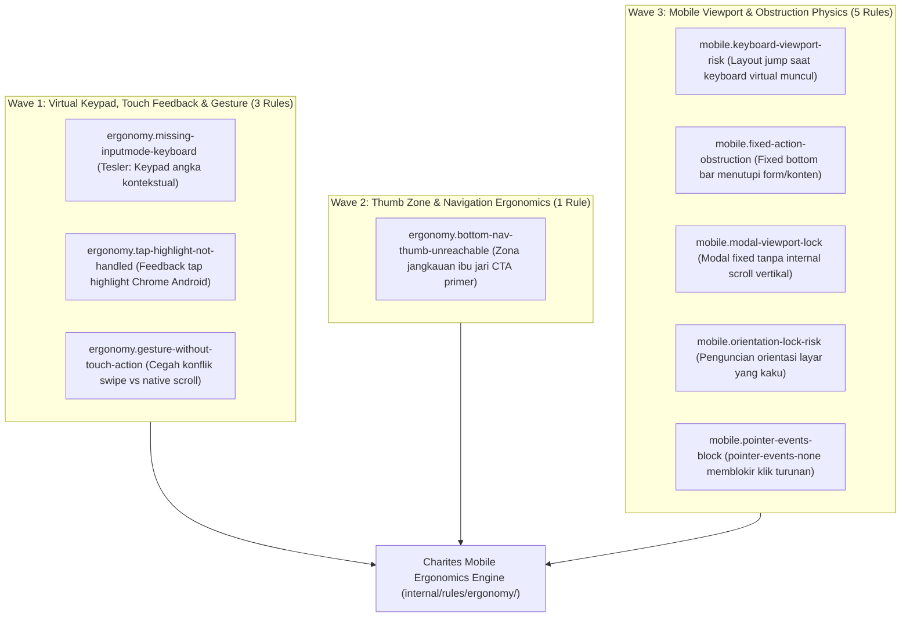

# EXPANSION-BATCH-07: Mobile Ergonomics & Physical Touch Standards (`ergonomy.*`, `mobile.*`)
> **Kode Dokumen:** `SPEC-EXP-07-ERGONOMY`
> **Kategori:** `ergonomy`, `mobile`
> **Pilar:** `01-SPEC` (WHAT - Spesifikasi Perilaku & Kontrak Rule)
> **Status:** Active Expansion Specification (9 Aturan Terkurasi)
> **Standar Rujukan:**
> - Apple Human Interface Guidelines (Touch Target $\ge 44\times 44\text{px}$ & Thumb Zone)
> - Google Material Design Touch Target Sizing ($\ge 48\times 48\text{px}$)
> - WCAG 2.2 Target Size (Minimum) Success Criterion 2.5.8
> - Tesler's Law (Conservation of Complexity in Virtual Keyboards)
> - Fitts's Law (Pointing Ergonomics & Thumb Reachability)
> - W3C Pointer Events Level 3 & Touch Events

---

## 1. Ikhtisar Kategori `ergonomy` & `mobile` (9 Aturan Terkurasi)

Kategori `ergonomy` Charites berfokus pada **kenyamanan fisik interaksi jari manusia pada layar sentuh ponsel, optimalisasi keyboard virtual, feedback sentuhan taktil Android, deklarasi touch-action gesture, dan kebebasan navigasi ibu jari (*thumb zone*)**.

> **Prinsip Eliminasi Redundansi & Delegasi Kanonikal 1-SSOT:**
> Untuk mencegah peringatan ganda (*duplicate warnings*) pada elemen yang sama:
> 1. **Ukuran Fisik Target Sentuh ($\ge 44\times 44\text{px}$):** Didelegasikan secara kanonikal ke `a11y.touch-target-size` dan `a11y.touch-target-spacing` (Apple HIG / WCAG 2.5.8).
> 2. **Pencegahan Auto-Zoom iOS (< 16px font):** Didelegasikan secara kanonikal ke `a11y.input-ios-zoom-hazard` (Apple WebKit Form Viewport).
> 3. **Fokus Kategori Ergonomy:** Didedikasikan untuk kenyamanan interaksi fisik sentuh, adaptasi keyboard virtual kontekstual, feedback tap highlight, dan koordinasi gesture non-konflik.



---

## 2. Spesifikasi Detail Rule Wave 1: Virtual Keypad, Touch Feedback & Gesture Ergonomics (3 Rules)

---

### 2.1. `ergonomy.missing-inputmode-keyboard`
- **Design Rationale:** Tesler's Law (Conservation of Complexity in Virtual Keyboards) & HTML Living Standard Section 4.10.5.3 (The inputmode attribute).
- **Konteks Realitas Mobile:**
  Ketika pengguna mengisi form di layar ponsel, memunculkan keyboard alfabet penuh (QWERTY) untuk field yang mengharuskan input angka atau telepon (seperti OTP, PIN, nomor HP, harga, kode pos) memaksa pengguna berpindah manual ke mode simbol/angka berkali-kali. Hal ini meningkatkan tingkat salah ketik dan cognitive friction.
  Menyematkan atribut `inputmode="numeric"`, `inputmode="tel"`, atau `type="tel"` memberi sinyal ke OS (Android & iOS) untuk langsung memunculkan keypad numerik besar yang nyaman ditekan ibu jari.
- **Invariant (Predikat AST):**
  Untuk setiap elemen `<input>` dengan identifier semantik $S \in \text{NameOrID}(\text{input})$:
  $$S \in \text{SemanticKeys} \land \neg \text{hasContextualKeyboard}(\text{input}) \implies \text{Violation (Info)}$$
  di mana $\text{SemanticKeys}$ mencakup kata kunci nomor telepon (`phone`, `telp`, `telepon`, `hp`, `wa`, `whatsapp`, `mobile`), token numerik/keuangan (`otp`, `pin`, `kode_otp`, `nominal`, `harga`, `amount`, `cvv`, `cvc`, `kodepos`, `postal_code`, `zip`), atau surel (`email`, `surel`).
- **Mengapa Lolos Linter Standar:**
  Elemen `<input name="nomor_hp" />` secara sintaksis adalah HTML yang sah. Linter umum tidak memahami relasi semantik antara nama field form dengan layout keyboard virtual mobile.
- **Suspicious (Keyboard QWERTY Penuh Muncul untuk Nomor HP):**
  ```tsx
  {/* Memaksa pengguna beralih manual ke layer keypad angka */}
  <input
    name="nomor_hp"
    placeholder="08123456789"
    className="h-11 px-3.5 py-2.5 bg-background border border-input rounded-xl text-base"
  />
  ```
- **Compliant (Keypad Numerik Langsung Muncul Sesuai Konteks):**
  ```tsx
  {/* Android & iOS langsung membuka keypad angka besar yang nyaman */}
  <input
    name="nomor_hp"
    type="tel"
    inputMode="tel"
    autoComplete="tel"
    placeholder="08123456789"
    className="h-11 px-3.5 py-2.5 bg-background border border-input rounded-xl text-base"
  />
  ```
- **Engine:** L1 Syntax + L2 Semantic Form AST (`internal/rules/ergonomy/missing_inputmode_keyboard.go`).
- **Severity:** `info`.
- **Autofix:** No (memerlukan pemilihan tipe inputmode yang sesuai oleh developer).

---

### 2.2. `ergonomy.tap-highlight-not-handled`
- **Design Rationale:** W3C Touch Events & Chromium Android Tap Feedback UX Standards.
- **Konteks Realitas Mobile:**
  Pada Chrome Android, saat pengguna menyentuh elemen interaktif kustom non-native (seperti kartu `<div onClick={...}>` atau `<span>`), browser secara default merender kotak abu-abu semi-transparan (*tap highlight box*) yang kaku di sekeliling elemen.
  Jika developer tidak mendefinisikan feedback sentuh yang disengaja (misal `active:scale-95`, `active:bg-muted`) atau menyetel `[-webkit-tap-highlight-color:transparent]`, tampilan aplikasi terasa seperti web desktop murah tanpa responsivitas taktil native.
- **Invariant (Predikat AST):**
  Untuk setiap elemen interaktif non-native $E \notin \{ \text{button}, \text{a}, \text{input}, \text{select}, \text{textarea}, \text{summary} \}$ yang memiliki event listener sentuh/klik (`onClick`, `onTouchStart`):
  $$\neg \text{hasActiveFeedback}(E) \land \neg \text{hasTransparentTapHighlight}(E) \implies \text{Violation (Info)}$$
- **Mengapa Lolos Linter Standar:**
  Penetapan `onClick` pada elemen `div` sah secara JSX jika diberi role dan aria. Linter umum tidak memeriksa kelas pseudo `active:` atau CSS tap-highlight vendor property.
- **Suspicious (Kotak Abu-Abu Kaku Chrome Android Tanpa Feedback Taktil):**
  ```tsx
  {/* Menghasilkan glitch kotak highlight abu-abu kaku saat diketuk di Android */}
  <div
    role="button"
    tabIndex={0}
    onClick={handleSelectCard}
    className="p-4 bg-card border rounded-2xl"
  >
    <span>Pilihan Paket Surat</span>
  </div>
  ```
- **Compliant (Feedback Taktil Halus & Highlight Terkelola):**
  ```tsx
  {/* Feedback sentuhan modern dengan penekanan halus tanpa glitch visual */}
  <div
    role="button"
    tabIndex={0}
    onClick={handleSelectCard}
    className="p-4 bg-card border rounded-2xl active:bg-muted/60 active:scale-[0.99] transition-transform [-webkit-tap-highlight-color:transparent]"
  >
    <span>Pilihan Paket Surat</span>
  </div>
  ```
- **Engine:** L1 Syntax + L2 Semantic Role AST (`internal/rules/ergonomy/tap_highlight_not_handled.go`).
- **Severity:** `info`.
- **Autofix:** No.

---

### 2.3. `ergonomy.gesture-without-touch-action`
- **Design Rationale:** W3C Pointer Events Level 3 (Section 5.2.8: The touch-action CSS property) & Compositor Thread Gesture Isolation.
- **Konteks Realitas Mobile:**
  Ketika developer membuat kontrol gesture kustom (seperti kartu swipeable, slider horizontal, atau carousel drag) menggunakan listener `onTouchMove` atau `onPointerMove`, browser mobile secara default tetap mencoba menjalankan gestur native viewport (seperti vertical scroll halaman atau pull-to-refresh).
  Akibatnya, gerakan jari pengguna tersendat, gesture custom sering terputus di tengah jalan (*canceled gesture*), atau halaman tergulir tidak sengaja saat pengguna sedang menggeser kartu. Menetapkan utilitas `touch-action` (misalnya `touch-pan-y` untuk gestur horizontal, atau `touch-none` untuk kanvas bebas) menginstruksikan compositor thread browser untuk mendedikasikan arah sumbu gestur secara mulus.
- **Invariant (Predikat AST):**
  Untuk setiap elemen $E$ yang mendeklarasikan event listener gesture kustom (`onTouchMove`, `onPointerMove`, atau pasangan `onTouchStart` + `onTouchMove`):
  $$\neg \text{hasTouchActionClass}(E) \implies \text{Violation (Warning)}$$
  di mana $\text{hasTouchActionClass}(E)$ terpenuhi jika elemen memiliki utility kelas `touch-none`, `touch-pan-x`, `touch-pan-y`, `touch-pan-left`, `touch-pan-right`, `touch-pan-up`, `touch-pan-down`, `touch-pinch-zoom`, atau `touch-manipulation`.
- **Mengapa Lolos Linter Standar:**
  React dan Astro mengizinkan deklarasi event listener DOM apa pun secara sintaksis. Linter umum tidak menghubungkan keberadaan event listener gesture dengan kepemilikan sumbu gerak CSS `touch-action`.
- **Suspicious (Konflik Gestur Swipe Horizontal vs Scroll Halaman Vertikal):**
  ```tsx
  {/* Swipe kartu tersendat karena browser bingung antara scroll vertikal vs geser horizontal */}
  <div
    onTouchStart={handleTouchStart}
    onTouchMove={handleTouchMove}
    className="flex overflow-x-auto gap-4 p-4"
  >
    <div className="w-64 h-40 bg-card rounded-2xl shrink-0">Kartu 1</div>
    <div className="w-64 h-40 bg-card rounded-2xl shrink-0">Kartu 2</div>
  </div>
  ```
- **Compliant (Penyelarasan Sumbu Compositor via touch-pan-y):**
  ```tsx
  {/* touch-pan-y memberi tahu browser bahwa scroll vertikal tetap native, swipe horizontal ditangani script */}
  <div
    onTouchStart={handleTouchStart}
    onTouchMove={handleTouchMove}
    className="flex overflow-x-auto gap-4 p-4 touch-pan-y"
  >
    <div className="w-64 h-40 bg-card rounded-2xl shrink-0">Kartu 1</div>
    <div className="w-64 h-40 bg-card rounded-2xl shrink-0">Kartu 2</div>
  </div>
  ```
- **Engine:** L1 Syntax + L2 Semantic Event AST (`internal/rules/ergonomy/gesture_without_touch_action.go`).
- **Severity:** `warning`.
- **Autofix:** No (memerlukan penentuan sumbu pan yang sesuai oleh developer).

---

## 3. Spesifikasi Detail Rule Wave 2 & Wave 3 (Mobile Viewport & Thumb Ergonomics)
* **Tujuan:** Mendeteksi layout yang berpotensi rusak atau terpotong ketika virtual keyboard perangkat mobile muncul.
* **In-Scope:**
  * Fixed bottom controls di dalam container dengan input aktif
  * Kontainer `100vh` yang terkunci tanpa dynamic units (`dvh` / `svh`)
  * Input form di dalam modal fixed yang tidak dapat bergulir saat keyboard aktif
* **Bad:**
  ```tsx
  <div className="fixed inset-0 h-screen flex flex-col justify-between">
    <input type="text" />
    <button className="fixed bottom-0">Submit</button>
  </div>
  ```
* **Good (Tailwind v4):**
  ```tsx
  <div className="min-h-dvh flex flex-col justify-between pb-[env(safe-area-inset-bottom)]">
    <input type="text" />
    <button className="sticky bottom-4">Submit</button>
  </div>
  ```
* **Severity:** Advisory (Heuristic AST).

### 2.8. `mobile.fixed-action-obstruction`
* **Tujuan:** Mencegah fixed bottom navigation bar atau floating CTA menutupi konten bawah atau form inputs.
* **In-Scope:** Elemen `fixed bottom-0` tanpa padding kompensasi (`pb-*`) pada container layout induk atau sibling layout.
* **Bad:**
  ```tsx
  <>
    <main>Contoh Konten Panjang</main>
    <nav className="fixed bottom-0 h-16 w-full bg-background">...</nav>
  </>
  ```
* **Good:**
  ```tsx
  <>
    <main className="pb-24">Contoh Konten Panjang</main>
    <nav className="fixed bottom-0 h-16 w-full pb-[env(safe-area-inset-bottom)] bg-background">...</nav>
  </>
  ```
* **Severity:** Warning.

### 2.9. `mobile.modal-viewport-lock`
* **Tujuan:** Mendeteksi modal atau dialog popup yang menggunakan fixed viewport dimensions dan tidak dapat discroll pada layar smartphone pendek.
* **In-Scope:** Kontainer modal `fixed inset-0` dengan `overflow-hidden` tanpa region scroll vertikal internal (`overflow-y-auto`).
* **Bad:**
  ```tsx
  <div className="fixed inset-0 overflow-hidden">
    <DialogContent className="h-screen">Form Panjang</DialogContent>
  </div>
  ```
* **Good:**
  ```tsx
  <div className="fixed inset-0 overflow-y-auto">
    <DialogContent className="min-h-full py-8">Form Panjang</DialogContent>
  </div>
  ```
* **Severity:** Error.

### 2.10. `mobile.orientation-lock-risk`
* **Tujuan:** Mendeteksi penguncian orientasi layar (*orientation lock*) yang membatasi aksesibilitas bagi pengguna dengan mount holder atau tablet horizontal.
* **In-Scope:** Penggunaan Screen Orientation API lock (`screen.orientation.lock()`) atau deklarasi manifest `orientation: "portrait"` tanpa justifikasi aplikasi spesifik.
* **Severity:** Advisory.

### 2.11. `mobile.pointer-events-block`
* **Tujuan:** Mencegah kelas `pointer-events-none` pada kontainer induk memblokir seluruh interaksi ketukan sentuh pada elemen anak di perangkat mobile.
* **In-Scope:** Interaktif descendants (`<button>`, `<a>`, `<input>`) di bawah elemen leluhur ber-`pointer-events-none` tanpa pemulihan eksplisit `pointer-events-auto`.
* **Bad:**
  ```tsx
  <div className="pointer-events-none">
    <button>Lanjutkan</button>
  </div>
  ```
* **Good:**
  ```tsx
  <div className="pointer-events-none">
    <button className="pointer-events-auto">Lanjutkan</button>
  </div>
  ```
* **Severity:** Warning.

---

## 4. Ringkasan Matriks Rule `ergonomy.*` & `mobile.*` (9 Aturan Terkurasi)

| Rule ID | Fokus Tujuan | Wave | Severity | Engine / Target |
|---|---|:---:|---|---|
| `ergonomy.missing-inputmode-keyboard` | Penentuan keyboard virtual kontekstual (Tesler's Law) | **W1** | info | JSX/TSX AST |
| `ergonomy.tap-highlight-not-handled` | Penanganan feedback tap highlight Android | **W1** | info | JSX/TSX AST |
| `ergonomy.gesture-without-touch-action` | Pencegahan konflik gesture custom dengan native scroll | **W1** | warning | JSX/TSX AST |
| `ergonomy.bottom-nav-thumb-unreachable` | Jangkauan ibu jari (thumb zone reachability) | **W2** | info (heuristik) | JSX/TSX AST (struktural) |
| `mobile.keyboard-viewport-risk` | Kestabilan layout saat virtual keyboard terbuka | **W3** | advisory | Heuristic AST |
| `mobile.fixed-action-obstruction` | Pencegahan elemen fixed menutupi konten bawah | **W3** | warning | JSX/TSX AST |
| `mobile.modal-viewport-lock` | Akses scroll pada dialog mobile berlayar pendek | **W3** | error | JSX/TSX AST |
| `mobile.orientation-lock-risk` | Fleksibilitas orientasi layar untuk aksesibilitas | **W3** | advisory | Heuristic AST |
| `mobile.pointer-events-block` | Pencegahan pemblokiran klik touch pada turunan | **W3** | warning | JSX/TSX AST |

> **Catatan SSOT:** Aturan ukuran target sentuh ($\ge 44\text{px}$) ditegakkan oleh `a11y.touch-target-size` & `a11y.touch-target-spacing`, dan ambang 16px iOS auto-zoom ditegakkan oleh `a11y.input-ios-zoom-hazard`.

---

## 5. Rule Classification & Execution Boundary

1. **Deterministic AST Rules (< 50ms pre-commit gate):**
   - `ergonomy.missing-inputmode-keyboard`, `ergonomy.tap-highlight-not-handled`, `ergonomy.gesture-without-touch-action`, `mobile.fixed-action-obstruction`, `mobile.modal-viewport-lock`, `mobile.pointer-events-block`.
2. **Heuristic AST Rules (Static semantic risk finding):**
   - `ergonomy.bottom-nav-thumb-unreachable`, `mobile.keyboard-viewport-risk`, `mobile.orientation-lock-risk`.
3. **Runtime Validation Layer:**
   - Uji sentuhan nyata pada perangkat sentuh mobile atau emulator browser untuk memverifikasi dynamic keyboard layout behavior dan multi-touch handling.

---

## 6. Struktur Modul Kode & Roadmap Eksekusi Wave 1

Implementasi aturan `ergonomy.*` ditempatkan secara modular di `internal/rules/ergonomy/`:

```text
internal/rules/ergonomy/
├── missing_inputmode_keyboard.go   # Wave 1: Contextual virtual keyboard (Tesler)
├── tap_highlight_not_handled.go    # Wave 1: Android Chrome tap feedback
├── gesture_without_touch_action.go # Wave 1: Touch-action gesture isolation
├── contract_test.go                # 8-Pillars Canonical Contract Validator
└── benchmark_test.go               # QUAL-03 Zero Allocation Benchmarks
```

Setiap rule divalidasi dengan **1-SSOT Golden Tri-Corpus** di `tests/correctness/ergonomy/<slug>/` yang mencakup kasus uji positif, negatif, dan adversarial untuk menjamin **nol regresi dan nol false-positive**.
