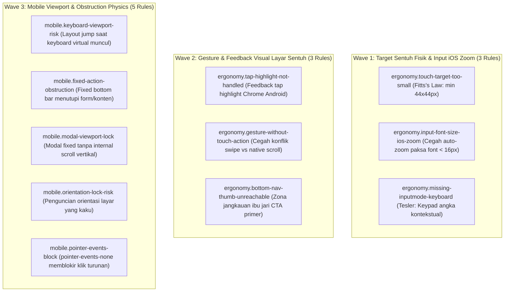

# EXPANSION-BATCH-07: Mobile Ergonomics & Physical Touch Standards (`ergonomy.*`, `mobile.*`)
> **Kode Dokumen:** `SPEC-EXP-07-ERGONOMY`
> **Kategori:** `ergonomy`, `mobile`
> **Pilar:** `01-SPEC` (WHAT - Spesifikasi Perilaku & Kontrak Rule)
> **Status:** Active Expansion Specification (11 Aturan Terkurasi)
> **Standar Rujukan:**
> - Apple Human Interface Guidelines (Touch Target $\ge 44\times 44\text{px}$ & Thumb Zone)
> - Google Material Design Touch Target Sizing ($\ge 48\times 48\text{px}$)
> - WCAG 2.2 Target Size (Minimum) Success Criterion 2.5.8
> - Tesler's Law (Conservation of Complexity in Virtual Keyboards)
> - Fitts's Law (Pointing Ergonomics & Thumb Reachability)
> - W3C Pointer Events Level 3 & Touch Events

---

## 1. Ikhtisar Kategori `ergonomy` & `mobile` (11 Aturan Terkurasi)

Kategori `ergonomy` Charites berfokus pada **kenyamanan fisik interaksi jari manusia pada layar sentuh ponsel, pencegahan auto-zoom Safari iOS yang mengganggu, optimalisasi keyboard virtual, dan kebebasan navigasi jari (*thumb zone*)**. Aturan-aturan ini memastikan kontrol sentuh mudah ditekan, responsif, dan tidak terhalang oleh keyboard virtual atau fixed element.



---

## 2. Spesifikasi Detail Rule `ergonomy.*` & `mobile.*`

### 2.1. `ergonomy.touch-target-too-small`
- **Tujuan:** Memastikan elemen interaktif punya area sentuh memadai. WCAG 2.2 SC 2.5.8 mensyaratkan minimum 24×24px (Level AA), sementara Apple HIG & Material Design merekomendasikan ambang lebih aman 44-48px - dipakai sebagai baseline linter agar toleran di semua platform.
- **In-Scope:** `<button>`/`<a>`/elemen ber-`onClick` dengan kelas tinggi/lebar eksplisit menghasilkan < 44px (mis. `h-6 w-6`, `h-8 w-8`) tanpa `p-*` yang cukup mengompensasi luas total.
- **Bad:** `<button className="h-6 w-6"><TrashIcon /></button>`
- **Good:** `<button className="h-11 w-11 flex items-center justify-center"><TrashIcon className="h-5 w-5" /></button>`
- **Severity:** Warning.

### 2.2. `ergonomy.input-font-size-ios-zoom`
- **Tujuan:** Mencegah Safari iOS melakukan auto-zoom paksa saat fokus ke `<input>`/`<textarea>`/`<select>` berukuran font di bawah 16px, yang merusak layout dan alur pengetikan.
- **In-Scope:** Elemen form dengan kelas ukuran teks eksplisit di bawah `text-base` (mis. `text-sm`, `text-xs`) tanpa override untuk menaikkannya ke minimal 16px pada breakpoint mobile.
- **Bad:** `<input className="text-sm px-3 py-2" />`
- **Good:** `<input className="text-base sm:text-sm px-3 py-2" />`
- **Severity:** Warning.

### 2.3. `ergonomy.missing-inputmode-keyboard`
- **Tujuan:** Menampilkan keyboard virtual sesuai konteks (numerik, email, telepon) agar input mobile lebih cepat dan minim salah ketik (Tesler's Law).
- **In-Scope:** `<input>` dengan `name`/`id` mengandung kata kunci semantik (`email`, `phone`, `telp`, `hp`, `otp`, `pin`, `nominal`, `harga`) tapi tanpa `type`/`inputMode` yang sesuai.
- **Bad:** `<input name="nomor_hp" />`
- **Good:** `<input name="nomor_hp" type="tel" inputMode="tel" autoComplete="tel" />`
- **Severity:** Info.

### 2.4. `ergonomy.tap-highlight-not-handled`
- **Tujuan:** Mencegah kotak highlight bawaan Chrome Android muncul mencolok saat elemen non-native ditekan, tanpa feedback tekan alternatif yang disengaja.
- **In-Scope:** Elemen non-native (`<div>`, `<span>`) dengan `onClick`/`onTouchStart` tanpa kelas `active:` maupun `[-webkit-tap-highlight-color:transparent]` yang didefinisikan sengaja.
- **Bad:** `<div onClick={handlePress} className="rounded-lg bg-card p-4">`
- **Good:** `<div onClick={handlePress} className="rounded-lg bg-card p-4 active:bg-card/70 [-webkit-tap-highlight-color:transparent]">`
- **Severity:** Info.

### 2.5. `ergonomy.gesture-without-touch-action`
- **Tujuan:** Mencegah konflik gesture kustom (swipe/drag) dengan gestur native browser (scroll, pull-to-refresh, pinch-zoom) yang berperilaku berbeda antar engine.
- **In-Scope:** Elemen dengan `onTouchStart`/`onTouchMove`/`onPointerDown` untuk drag/swipe kustom, tanpa kelas `touch-action` eksplisit (mis. `touch-pan-y`, `touch-none`).
- **Bad:** `<div onTouchStart={onSwipeStart} onTouchMove={onSwipeMove} className="w-full h-40">`
- **Good:** `<div onTouchStart={onSwipeStart} onTouchMove={onSwipeMove} className="w-full h-40 touch-pan-y">`
- **Severity:** Warning.

### 2.6. `ergonomy.bottom-nav-thumb-unreachable`
- **Tujuan:** Menempatkan aksi primer di zona yang mudah dijangkau ibu jari pada layar mobile besar, alih-alih menaruh satu-satunya CTA di pojok atas yang sulit digapai saat digenggam satu tangan (Fitts's Law thumb zone).
- **In-Scope (heuristik):** Halaman/komponen dengan tepat satu tombol beraksi primer (`variant="primary"`/`bg-primary` mencolok) yang hanya berada di dalam `<header>` atau elemen `fixed top-0`, tanpa duplikasi/alternatif di area bawah layar.
- **Bad:** `<header className="fixed top-0 ..."><Button variant="primary">Simpan</Button></header>` (satu-satunya tombol simpan)
- **Good:** Aksi primer diduplikasi ke `<footer className="fixed bottom-0 ...">` atau floating action button di area bawah layar.
- **Severity:** Info (heuristik).

### 2.7. `mobile.keyboard-viewport-risk`
* **Tujuan:** Mendeteksi layout yang berpotensi rusak atau terpotong ketika virtual keyboard perangkat mobile muncul.
* **In-Scope:**
  * Fixed bottom controls di dalam container dengan input aktif
  * Kontainer `100vh` yang terkunci tanpa dynamic units (`100dvh`)
  * Input form di dalam modal fixed yang tidak dapat bergulir saat keyboard aktif
* **Bad:**
  ```tsx
  <div className="fixed inset-0 h-screen flex flex-col justify-between">
    <input type="text" />
    <button className="fixed bottom-0">Submit</button>
  </div>
  ```
* **Good:**
  ```tsx
  <div className="min-h-[100dvh] flex flex-col justify-between pb-[env(safe-area-inset-bottom)]">
    <input type="text" />
    <button className="sticky bottom-4">Submit</button>
  </div>
  ```
* **Severity:** Advisory (Heuristic AST).

### 2.8. `mobile.fixed-action-obstruction`
* **Tujuan:** Mencegah fixed bottom navigation bar atau floating CTA menutupi konten bawah atau form inputs.
* **In-Scope:** Elemen `fixed bottom-0` tanpa padding kompensasi (`pb-*`) pada container layout induk atau sibling layout.
* **Bad:**
  ```tsx
  <>
    <main>Contoh Konten Panjang</main>
    <nav className="fixed bottom-0 h-16 w-full bg-background">...</nav>
  </>
  ```
* **Good:**
  ```tsx
  <>
    <main className="pb-24">Contoh Konten Panjang</main>
    <nav className="fixed bottom-0 h-16 w-full pb-[env(safe-area-inset-bottom)] bg-background">...</nav>
  </>
  ```
* **Severity:** Warning.

### 2.9. `mobile.modal-viewport-lock`
* **Tujuan:** Mendeteksi modal atau dialog popup yang menggunakan fixed viewport dimensions dan tidak dapat discroll pada layar smartphone pendek.
* **In-Scope:** Kontainer modal `fixed inset-0` dengan `overflow-hidden` tanpa region scroll vertikal internal (`overflow-y-auto`).
* **Bad:**
  ```tsx
  <div className="fixed inset-0 overflow-hidden">
    <DialogContent className="h-screen">Form Panjang</DialogContent>
  </div>
  ```
* **Good:**
  ```tsx
  <div className="fixed inset-0 overflow-y-auto">
    <DialogContent className="min-h-full py-8">Form Panjang</DialogContent>
  </div>
  ```
* **Severity:** Error.

### 2.10. `mobile.orientation-lock-risk`
* **Tujuan:** Mendeteksi penguncian orientasi layar (*orientation lock*) yang membatasi aksesibilitas bagi pengguna dengan mount holder atau tablet horizontal.
* **In-Scope:** Penggunaan Screen Orientation API lock (`screen.orientation.lock()`) atau deklarasi manifest `orientation: "portrait"` tanpa justifikasi aplikasi spesifik.
* **Severity:** Advisory.

### 2.11. `mobile.pointer-events-block`
* **Tujuan:** Mencegah kelas `pointer-events-none` pada kontainer induk memblokir seluruh interaksi ketukan sentuh pada elemen anak di perangkat mobile.
* **In-Scope:** Interaktif descendants (`<button>`, `<a>`, `<input>`) di bawah elemen leluhur ber-`pointer-events-none` tanpa pemulihan eksplisit `pointer-events-auto`.
* **Bad:**
  ```tsx
  <div className="pointer-events-none">
    <button>Lanjutkan</button>
  </div>
  ```
* **Good:**
  ```tsx
  <div className="pointer-events-none">
    <button className="pointer-events-auto">Lanjutkan</button>
  </div>
  ```
* **Severity:** Warning.

---

## 3. Ringkasan Matriks Rule `ergonomy.*` & `mobile.*`

| Rule ID | Fokus Tujuan | Severity | Engine / Target |
|---|---|---|---|
| `ergonomy.touch-target-too-small` | Ukuran target sentuh minimum $\ge 44\times 44\text{px}$ (Fitts's Law) | warning | JSX/TSX AST |
| `ergonomy.input-font-size-ios-zoom` | Pencegahan auto-zoom paksa Safari iOS (< 16px) | warning | JSX/TSX AST |
| `ergonomy.missing-inputmode-keyboard` | Penentuan keyboard virtual kontekstual (Tesler's Law) | info | JSX/TSX AST |
| `ergonomy.tap-highlight-not-handled` | Penanganan feedback tap highlight Android | info | JSX/TSX AST |
| `ergonomy.gesture-without-touch-action` | Pencegahan konflik gesture custom dengan native scroll | warning | JSX/TSX AST |
| `ergonomy.bottom-nav-thumb-unreachable` | Jangkauan ibu jari (thumb zone reachability) | info (heuristik) | JSX/TSX AST (struktural) |
| `mobile.keyboard-viewport-risk` | Kestabilan layout saat virtual keyboard terbuka | advisory | Heuristic AST |
| `mobile.fixed-action-obstruction` | Pencegahan elemen fixed menutupi konten bawah | warning | JSX/TSX AST |
| `mobile.modal-viewport-lock` | Akses scroll pada dialog mobile berlayar pendek | error | JSX/TSX AST |
| `mobile.orientation-lock-risk` | Fleksibilitas orientasi layar untuk aksesibilitas | advisory | Heuristic AST |
| `mobile.pointer-events-block` | Pencegahan pemblokiran klik touch pada turunan | warning | JSX/TSX AST |

---

## 4. Rule Classification & Execution Boundary

1. **Deterministic AST Rules (< 50ms pre-commit gate):**
   - `ergonomy.touch-target-too-small`, `ergonomy.input-font-size-ios-zoom`, `ergonomy.missing-inputmode-keyboard`, `ergonomy.tap-highlight-not-handled`, `ergonomy.gesture-without-touch-action`, `mobile.fixed-action-obstruction`, `mobile.modal-viewport-lock`, `mobile.pointer-events-block`.
2. **Heuristic AST Rules (Static semantic risk finding):**
   - `ergonomy.bottom-nav-thumb-unreachable`, `mobile.keyboard-viewport-risk`, `mobile.orientation-lock-risk`.
3. **Runtime Validation Layer:**
   - Uji sentuhan nyata pada perangkat sentuh mobile atau emulator browser untuk memverifikasi dynamic keyboard layout behavior dan multi-touch handling.
