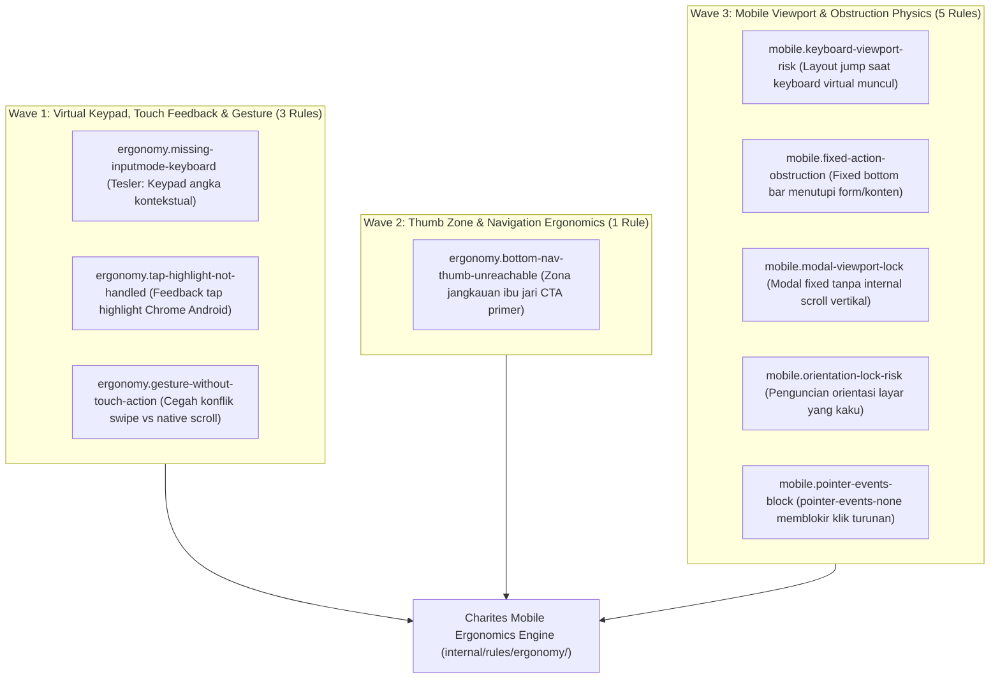

# EXPANSION-BATCH-07: Mobile Ergonomics & Physical Touch Standards (`ergonomy.*`, `mobile.*`)
> **Kode Dokumen:** `SPEC-EXP-07-ERGONOMY`
> **Kategori:** `ergonomy`, `mobile`
> **Pilar:** `01-SPEC` (WHAT - Spesifikasi Perilaku & Kontrak Rule)
> **Status:** Active Expansion Specification (9 Aturan Terkurasi)
> **Standar Rujukan:**
> - Apple Human Interface Guidelines (Touch Target $\ge 44\times 44\text{px}$ & Thumb Zone)
> - Google Material Design Touch Target Sizing ($\ge 48\times 48\text{px}$)
> - WCAG 2.2 Target Size (Minimum) Success Criterion 2.5.8
> - Tesler's Law (Conservation of Complexity in Virtual Keyboards)
> - Fitts's Law (Pointing Ergonomics & Thumb Reachability)
> - W3C Pointer Events Level 3 & Touch Events

---

## 1. Ikhtisar Kategori `ergonomy` & `mobile` (9 Aturan Terkurasi)

Kategori `ergonomy` Charites berfokus pada **kenyamanan fisik interaksi jari manusia pada layar sentuh ponsel, optimalisasi keyboard virtual, feedback sentuhan taktil Android, deklarasi touch-action gesture, dan kebebasan navigasi ibu jari (*thumb zone*)**.

> **Prinsip Eliminasi Redundansi & Delegasi Kanonikal 1-SSOT:**
> Untuk mencegah peringatan ganda (*duplicate warnings*) pada elemen yang sama:
> 1. **Ukuran Fisik Target Sentuh ($\ge 44\times 44\text{px}$):** Didelegasikan secara kanonikal ke `a11y.touch-target-size` dan `a11y.touch-target-spacing` (Apple HIG / WCAG 2.5.8).
> 2. **Pencegahan Auto-Zoom iOS (< 16px font):** Didelegasikan secara kanonikal ke `a11y.input-ios-zoom-hazard` (Apple WebKit Form Viewport).
> 3. **Fokus Kategori Ergonomy:** Didedikasikan untuk kenyamanan interaksi fisik sentuh, adaptasi keyboard virtual kontekstual, feedback tap highlight, dan koordinasi gesture non-konflik.



---

## 2. Spesifikasi Detail Rule Wave 1: Virtual Keypad, Touch Feedback & Gesture Ergonomics (3 Rules)

---

### 2.1. `ergonomy.missing-inputmode-keyboard`
- **Design Rationale:** Tesler's Law (Conservation of Complexity in Virtual Keyboards) & HTML Living Standard Section 4.10.5.3 (The inputmode attribute).
- **Konteks Realitas Mobile:**
  Ketika pengguna mengisi form di layar ponsel, memunculkan keyboard alfabet penuh (QWERTY) untuk field yang mengharuskan input angka atau telepon (seperti OTP, PIN, nomor HP, harga, kode pos) memaksa pengguna berpindah manual ke mode simbol/angka berkali-kali. Hal ini meningkatkan tingkat salah ketik dan cognitive friction.
  Menyematkan atribut `inputmode="numeric"`, `inputmode="tel"`, atau `type="tel"` memberi sinyal ke OS (Android & iOS) untuk langsung memunculkan keypad numerik besar yang nyaman ditekan ibu jari.
- **Invariant (Predikat AST):**
  Untuk setiap elemen `<input>` dengan identifier semantik $S \in \text{NameOrID}(\text{input})$:
  $$S \in \text{SemanticKeys} \land \neg \text{hasContextualKeyboard}(\text{input}) \implies \text{Violation (Info)}$$
  di mana $\text{SemanticKeys}$ mencakup kata kunci nomor telepon (`phone`, `telp`, `telepon`, `hp`, `wa`, `whatsapp`, `mobile`), token numerik/keuangan (`otp`, `pin`, `kode_otp`, `nominal`, `harga`, `amount`, `cvv`, `cvc`, `kodepos`, `postal_code`, `zip`), atau surel (`email`, `surel`).
- **Mengapa Lolos Linter Standar:**
  Elemen `<input name="nomor_hp" />` secara sintaksis adalah HTML yang sah. Linter umum tidak memahami relasi semantik antara nama field form dengan layout keyboard virtual mobile.
- **Suspicious (Keyboard QWERTY Penuh Muncul untuk Nomor HP):**
  ```tsx
  {/* Memaksa pengguna beralih manual ke layer keypad angka */}
  <input
    name="nomor_hp"
    placeholder="08123456789"
    className="h-11 px-3.5 py-2.5 bg-background border border-input rounded-xl text-base"
  />
  ```
- **Compliant (Keypad Numerik Langsung Muncul Sesuai Konteks):**
  ```tsx
  {/* Android & iOS langsung membuka keypad angka besar yang nyaman */}
  <input
    name="nomor_hp"
    type="tel"
    inputMode="tel"
    autoComplete="tel"
    placeholder="08123456789"
    className="h-11 px-3.5 py-2.5 bg-background border border-input rounded-xl text-base"
  />
  ```
- **Engine:** L1 Syntax + L2 Semantic Form AST (`internal/rules/ergonomy/missing_inputmode_keyboard.go`).
- **Severity:** `info`.
- **Autofix:** No (memerlukan pemilihan tipe inputmode yang sesuai oleh developer).

---

### 2.2. `ergonomy.tap-highlight-not-handled`
- **Design Rationale:** W3C Touch Events & Chromium Android Tap Feedback UX Standards.
- **Konteks Realitas Mobile:**
  Pada Chrome Android, saat pengguna menyentuh elemen interaktif kustom non-native (seperti kartu `<div onClick={...}>` atau `<span>`), browser secara default merender kotak abu-abu semi-transparan (*tap highlight box*) yang kaku di sekeliling elemen.
  Jika developer tidak mendefinisikan feedback sentuh yang disengaja (misal `active:scale-95`, `active:bg-muted`) atau menyetel `[-webkit-tap-highlight-color:transparent]`, tampilan aplikasi terasa seperti web desktop murah tanpa responsivitas taktil native.
- **Invariant (Predikat AST):**
  Untuk setiap elemen interaktif non-native $E \notin \{ \text{button}, \text{a}, \text{input}, \text{select}, \text{textarea}, \text{summary} \}$ yang memiliki event listener sentuh/klik (`onClick`, `onTouchStart`):
  $$\neg \text{hasActiveFeedback}(E) \land \neg \text{hasTransparentTapHighlight}(E) \implies \text{Violation (Info)}$$
- **Mengapa Lolos Linter Standar:**
  Penetapan `onClick` pada elemen `div` sah secara JSX jika diberi role dan aria. Linter umum tidak memeriksa kelas pseudo `active:` atau CSS tap-highlight vendor property.
- **Suspicious (Kotak Abu-Abu Kaku Chrome Android Tanpa Feedback Taktil):**
  ```tsx
  {/* Menghasilkan glitch kotak highlight abu-abu kaku saat diketuk di Android */}
  <div
    role="button"
    tabIndex={0}
    onClick={handleSelectCard}
    className="p-4 bg-card border rounded-2xl"
  >
    <span>Pilihan Paket Surat</span>
  </div>
  ```
- **Compliant (Feedback Taktil Halus & Highlight Terkelola):**
  ```tsx
  {/* Feedback sentuhan modern dengan penekanan halus tanpa glitch visual */}
  <div
    role="button"
    tabIndex={0}
    onClick={handleSelectCard}
    className="p-4 bg-card border rounded-2xl active:bg-muted/60 active:scale-[0.99] transition-transform [-webkit-tap-highlight-color:transparent]"
  >
    <span>Pilihan Paket Surat</span>
  </div>
  ```
- **Engine:** L1 Syntax + L2 Semantic Role AST (`internal/rules/ergonomy/tap_highlight_not_handled.go`).
- **Severity:** `info`.
- **Autofix:** No.

---

### 2.3. `ergonomy.gesture-without-touch-action`
- **Design Rationale:** W3C Pointer Events Level 3 (Section 5.2.8: The touch-action CSS property) & Compositor Thread Gesture Isolation.
- **Konteks Realitas Mobile:**
  Ketika developer membuat kontrol gesture kustom (seperti kartu swipeable, slider horizontal, atau carousel drag) menggunakan listener `onTouchMove` atau `onPointerMove`, browser mobile secara default tetap mencoba menjalankan gestur native viewport (seperti vertical scroll halaman atau pull-to-refresh).
  Akibatnya, gerakan jari pengguna tersendat, gesture custom sering terputus di tengah jalan (*canceled gesture*), atau halaman tergulir tidak sengaja saat pengguna sedang menggeser kartu. Menetapkan utilitas `touch-action` (misalnya `touch-pan-y` untuk gestur horizontal, atau `touch-none` untuk kanvas bebas) menginstruksikan compositor thread browser untuk mendedikasikan arah sumbu gestur secara mulus.
- **Invariant (Predikat AST):**
  Untuk setiap elemen $E$ yang mendeklarasikan event listener gesture kustom (`onTouchMove`, `onPointerMove`, atau pasangan `onTouchStart` + `onTouchMove`):
  $$\neg \text{hasTouchActionClass}(E) \implies \text{Violation (Warning)}$$
  di mana $\text{hasTouchActionClass}(E)$ terpenuhi jika elemen memiliki utility kelas `touch-none`, `touch-pan-x`, `touch-pan-y`, `touch-pan-left`, `touch-pan-right`, `touch-pan-up`, `touch-pan-down`, `touch-pinch-zoom`, atau `touch-manipulation`.
- **Mengapa Lolos Linter Standar:**
  React dan Astro mengizinkan deklarasi event listener DOM apa pun secara sintaksis. Linter umum tidak menghubungkan keberadaan event listener gesture dengan kepemilikan sumbu gerak CSS `touch-action`.
- **Suspicious (Konflik Gestur Swipe Horizontal vs Scroll Halaman Vertikal):**
  ```tsx
  {/* Swipe kartu tersendat karena browser bingung antara scroll vertikal vs geser horizontal */}
  <div
    onTouchStart={handleTouchStart}
    onTouchMove={handleTouchMove}
    className="flex overflow-x-auto gap-4 p-4"
  >
    <div className="w-64 h-40 bg-card rounded-2xl shrink-0">Kartu 1</div>
    <div className="w-64 h-40 bg-card rounded-2xl shrink-0">Kartu 2</div>
  </div>
  ```
- **Compliant (Penyelarasan Sumbu Compositor via touch-pan-y):**
  ```tsx
  {/* touch-pan-y memberi tahu browser bahwa scroll vertikal tetap native, swipe horizontal ditangani script */}
  <div
    onTouchStart={handleTouchStart}
    onTouchMove={handleTouchMove}
    className="flex overflow-x-auto gap-4 p-4 touch-pan-y"
  >
    <div className="w-64 h-40 bg-card rounded-2xl shrink-0">Kartu 1</div>
    <div className="w-64 h-40 bg-card rounded-2xl shrink-0">Kartu 2</div>
  </div>
  ```
- **Engine:** L1 Syntax + L2 Semantic Event AST (`internal/rules/ergonomy/gesture_without_touch_action.go`).
- **Severity:** `warning`.
- **Autofix:** No (memerlukan penentuan sumbu pan yang sesuai oleh developer).

---

## 3. Spesifikasi Detail Rule Wave 2: Thumb Zone & Navigation Ergonomics (1 Rule)

---

### 3.1. `ergonomy.bottom-nav-thumb-unreachable`
- **Design Rationale:** Steven Hoober (2017, "Designing for Touch"), Fitts's Law of Motor Movement, Apple Human Interface Guidelines (Bottom Toolbars & Reachability), dan Google Material Design 3 (Bottom App Bars & Floating Action Buttons).
- **Konteks Realitas Mobile:**
  Pada smartphone modern dengan bentang layar tinggi (6.1 inci hingga 6.7+ inci dengan rasio 19.5:9 atau 20:9), sepertiga area atas layar berada pada "Hard to Reach Zone" / "Ow Zone" untuk penggunaan satu tangan (*one-handed thumb navigation*).
  Riset Steven Hoober membuktikan bahwa 49% pengguna mengoperasikan ponsel hanya dengan satu jempol satu tangan. Menempatkan tombol aksi utama (*primary Call-to-Action*, seperti tombol submit form "Simpan", "Kirim", atau tombol checkout "Bayar") secara eksklusif di header navigasi atas (`<header>` atau kontainer `top-0`) memaksa pengguna meregangkan ibu jari secara berlebihan atau menggunakan tangan kedua.
  Sesuai Fitts's Law ($T = a + b \log_2(2D/W)$), jarak $D$ ke pojok atas layar memperlambat waktu aksi pengguna dan meningkatkan risiko perangkat tergelincir (*drop hazards*).
- **Invariant (Predikat AST):**
  Untuk setiap elemen tombol aksi primer $B \in \text{InteractiveButtons}$:
  $$\text{isInTopHeader}(B) \land \text{isPrimaryCTA}(B) \land \neg \text{isDesktopOnly}(B) \land \neg \text{hasBottomAlternative}(\text{Root}) \implies \text{Violation (Info)}$$
  di mana $\text{isPrimaryCTA}(B)$ bernilai true jika $B$ memiliki atribut `type="submit"`, styling kelas primer (`bg-primary`, `btn-primary`), atau teks aksi konfirmasi ("Simpan", "Submit", "Kirim", "Bayar", "Selesai", "Lanjut", "Daftar", "Beli", "Checkout"), dan bukan merupakan tombol sekunder/utilitas header (seperti tombol kembali, tutup/batal, hamburger menu, atau search toggle).
- **Mengapa Lolos Linter Standar:**
  Tombol `<button type="submit">Simpan</button>` di dalam `<header>` adalah HTML dan JSX yang valid secara sintaksis. Linter konvensional (ESLint, Prettier) tidak memiliki pemahaman ergonomis fisik genggaman perangkat seluler ataupun jangkauan jempol layar sentuh.
- **Suspicious (Tombol Aksi Utama Terjebak di Header Atas Tanpa Alternatif Bawah):**
  ```tsx
  {/* Pengguna ponsel harus meregangkan jempol ke pojok kanan atas untuk submit form */}
  <header className="sticky top-0 z-10 flex items-center justify-between p-4 bg-background border-b">
    <button type="button" aria-label="Kembali">
      <ArrowLeft className="w-6 h-6" />
    </button>
    <h1 className="font-semibold text-lg">Edit Profil Warga</h1>
    <button
      type="submit"
      className="h-10 px-4 bg-primary text-primary-foreground rounded-xl font-medium"
    >
      Simpan
    </button>
  </header>
  <main className="p-4 space-y-4">
    <input name="nama" placeholder="Nama Lengkap" />
    <input name="nik" placeholder="NIK" />
  </main>
  ```
- **Compliant (Tombol Aksi Primer Berada di Zona Nyaman Ibu Jari Bawah):**
  ```tsx
  {/* Aksi primer ditempatkan pada floating bottom bar yang mudah dijangkau satu tangan */}
  <header className="sticky top-0 z-10 flex items-center justify-between p-4 bg-background border-b">
    <button type="button" aria-label="Kembali">
      <ArrowLeft className="w-6 h-6" />
    </button>
    <h1 className="font-semibold text-lg">Edit Profil Warga</h1>
  </header>
  <main className="p-4 space-y-4 pb-24">
    <input name="nama" placeholder="Nama Lengkap" />
    <input name="nik" placeholder="NIK" />
  </main>
  <footer className="fixed bottom-0 left-0 right-0 p-4 bg-background border-t pb-[env(safe-area-inset-bottom)]">
    <button
      type="submit"
      className="w-full h-12 bg-primary text-primary-foreground rounded-xl font-semibold"
    >
      Simpan Perubahan
    </button>
  </footer>
  ```
- **Engine:** L1 Syntax + L2 Structural Thumb Zone AST (`internal/rules/ergonomy/bottom_nav_thumb_unreachable.go`).
- **Severity:** `info`.
- **Autofix:** No (memerlukan restrukturisasi tata letak antarmuka oleh developer).

---

## 4. Spesifikasi Detail Rule Wave 3: Mobile Viewport & Obstruction Physics (5 Rules)

---

### 4.1. `mobile.keyboard-viewport-risk`
- **Design Rationale:** W3C CSS Values and Units Module Level 4 (Viewport-percentage Lengths: dvh, svh, lvh) & Chromium Virtual Keyboard API.
- **Konteks Realitas Mobile:**
  Ketika keyboard virtual muncul di smartphone (mengonsumsi 40-50% tinggi layar), visual viewport browser menyusut seketika. Kontainer formulir yang dikunci dengan tinggi kaku `h-screen` atau `h-[100vh]` (berbasis Large Viewport Height) tidak mengecil secara dinamis, menyebabkan tombol aksi bawah tetap (`fixed bottom-0`) atau field input aktif terdorong ke balik keyboard virtual atau terpotong tanpa bisa digulir.
- **Invariant (Predikat AST):**
  Untuk setiap kontainer layout $C$ yang memuat input teks interaktif ($\text{input}, \text{textarea}$):
  $$\text{hasRigidViewportHeight}(C) \land \text{hasFixedBottomControl}(C) \land \neg \text{hasDynamicViewportUnit}(C) \implies \text{Violation (Info)}$$
  di mana $\text{hasRigidViewportHeight}$ mencakup kelas `h-screen`, `h-[100vh]`, dan $\text{hasDynamicViewportUnit}$ mencakup unit modern `min-h-dvh`, `h-dvh`, `min-h-svh`, `h-svh`.
- **Mengapa Lolos Linter Standar:**
  Linter konvensional menganggap `h-screen` dan `fixed bottom-0` sebagai utilitas layout yang sah dan tidak mengaitkannya dengan perilaku resizing visual viewport saat virtual keyboard aktif.
- **Suspicious (Layout Terpotong / Tertutup Virtual Keyboard):**
  ```tsx
  {/* h-screen tidak mengecil saat keyboard virtual muncul, layout terpotong */}
  <div className="fixed inset-0 h-screen flex flex-col justify-between">
    <input type="text" placeholder="Masukkan alamat lengkap" />
    <button className="fixed bottom-0 w-full py-3 bg-primary text-white">Simpan</button>
  </div>
  ```
- **Compliant (Menggunakan Dynamic Viewport Unit dvh):**
  ```tsx
  {/* min-h-dvh menyesuaikan tinggi secara dinamis saat keyboard virtual aktif */}
  <div className="min-h-dvh flex flex-col justify-between pb-[env(safe-area-inset-bottom)]">
    <input type="text" placeholder="Masukkan alamat lengkap" />
    <button className="sticky bottom-4 w-full py-3 bg-primary text-white rounded-xl">Simpan</button>
  </div>
  ```
- **Engine:** L1 Syntax + L2 Viewport AST (`internal/rules/mobile/keyboard_viewport_risk.go`).
- **Severity:** `info`.
- **Autofix:** No (memerlukan penyesuaian unit viewport oleh developer).

---

### 4.2. `mobile.fixed-action-obstruction`
- **Design Rationale:** Apple HIG Bottom Clearance & Google Material Design 3 Bottom App Bar Clearance Guidelines.
- **Konteks Realitas Mobile:**
  Elemen navigasi atau aksi bawah tetap (`fixed bottom-0`, seperti bottom app bar, tab bar seluler, atau floating CTA) mengambang secara permanen di atas konten halaman. Jika kontainer konten utama (`<main>`, `<article>`, `<form>`) tidak mendeklarasikan padding bawah kompensasi (`pb-16`, `pb-20`, `pb-24`, `pb-safe`), konten terbawah, tombol aksi submit, atau form input akan tertutup secara permanen oleh bar tetap tersebut.
- **Invariant (Predikat AST):**
  Untuk setiap elemen fixed bottom $F \in \text{FixedBottomElements}$:
  $$\neg \text{hasCompensatingBottomPadding}(\text{ParentOrSiblings}(F)) \land \neg \text{isDesktopOnly}(F) \implies \text{Violation (Warn)}$$
  di mana $\text{hasCompensatingBottomPadding}$ memverifikasi keberadaan kelas `pb-*` (selain `pb-0`) pada kontainer induk atau elemen konten utama saudara.
- **Mengapa Lolos Linter Standar:**
  Penetapan `fixed bottom-0` valid secara CSS. Linter standar tidak memeriksa apakah terdapat ruang bebas (*clearance padding*) pada sibling layout untuk mencegah tabrakan visual.
- **Suspicious (Fixed Bottom Bar Menutupi Konten Terbawah):**
  ```tsx
  {/* Konten terbawah di dalam main tertutup oleh bottom bar */}
  <div className="min-h-screen bg-background">
    <main className="p-4 space-y-4">
      <p>Paragraf terakhir formulir warga...</p>
    </main>
    <nav className="fixed bottom-0 inset-x-0 h-16 bg-card border-t">
      <button type="button">Beranda</button>
    </nav>
  </div>
  ```
- **Compliant (Padding Kompensasi Disediakan):**
  ```tsx
  {/* pb-24 memberikan ruang bebas sehingga konten tidak tertutup bottom bar */}
  <div className="min-h-screen bg-background">
    <main className="p-4 space-y-4 pb-24">
      <p>Paragraf terakhir formulir warga...</p>
    </main>
    <nav className="fixed bottom-0 inset-x-0 h-16 bg-card border-t pb-[env(safe-area-inset-bottom)]">
      <button type="button">Beranda</button>
    </nav>
  </div>
  ```
- **Engine:** L1 Syntax + L2 Sibling Clearance AST (`internal/rules/mobile/fixed_action_obstruction.go`).
- **Severity:** `warning`.
- **Autofix:** No (memerlukan penentuan nilai pb-* yang proporsional dengan tinggi bottom bar).

---

### 4.3. `mobile.modal-viewport-lock`
- **Design Rationale:** WCAG 2.2 SC 2.1.2 (No Keyboard Trap) & W3C ARIA Authoring Practices Guide (Modal Dialog Design Pattern).
- **Konteks Realitas Mobile:**
  Dialog modal atau bottom sheet yang menggunakan `fixed inset-0` dengan `overflow-hidden` memotong seluruh konten jika tinggi modal melebihi tinggi layar ponsel (misalnya pada smartphone kecil, resolusi rendah, atau dalam orientasi lanskap). Tanpa region scroll vertikal internal (`overflow-y-auto`), pengguna terjebak dan tidak dapat melihat form input bawah atau menekan tombol aksi konfirmasi/tutup.
- **Invariant (Predikat AST):**
  Untuk setiap kontainer modal $M \in \text{ModalContainers}$:
  $$\text{hasOverflowHidden}(M) \land \neg \text{hasInternalScrollRegion}(M) \implies \text{Violation (Error)}$$
  di mana $\text{ModalContainers}$ mencakup elemen dengan `role="dialog"`, `role="alertdialog"`, tag `<dialog>`, atau komponen bernama modal/dialog.
- **Mengapa Lolos Linter Standar:**
  Linter umum menganggap `overflow-hidden` pada modal sebagai praktik lazim untuk mencegah scroll background, tanpa memeriksa apakah kontainer dialog menyediakan area scroll internal.
- **Suspicious (Modal Terkunci Tanpa Scroll Internal):**
  ```tsx
  {/* Pengguna smartphone pendek tidak dapat menggulir ke tombol Simpan */}
  <div role="dialog" aria-modal="true" className="fixed inset-0 overflow-hidden flex items-center justify-center p-4">
    <div className="bg-card p-6 rounded-2xl w-full max-w-md h-screen">
      <h2>Form Permohonan Bantuan</h2>
      <div className="space-y-4">...isi form panjang...</div>
      <button type="submit">Kirim</button>
    </div>
  </div>
  ```
- **Compliant (Area Scroll Internal Disediakan):**
  ```tsx
  {/* overflow-y-auto memungkinkan pengguliran mulus pada layar kecil */}
  <div role="dialog" aria-modal="true" className="fixed inset-0 overflow-y-auto flex items-center justify-center p-4">
    <div className="bg-card p-6 rounded-2xl w-full max-w-md my-auto">
      <h2>Form Permohonan Bantuan</h2>
      <div className="space-y-4">...isi form panjang...</div>
      <button type="submit">Kirim</button>
    </div>
  </div>
  ```
- **Engine:** L1 Syntax + L2 Modal Overflow AST (`internal/rules/mobile/modal_viewport_lock.go`).
- **Severity:** `error`.
- **Autofix:** No.

---

### 4.4. `mobile.orientation-lock-risk`
- **Design Rationale:** W3C Web Content Accessibility Guidelines (WCAG) 2.2 Success Criterion 1.3.4 (Orientation - Level AA).
- **Konteks Realitas Mobile:**
  Mengunci orientasi tampilan ke mode potret secara kaku (melalui `screen.orientation.lock("portrait")` atau meta tag manifest kaku) membatasi aksesibilitas bagi pengguna difabel yang memasang ponsel secara horizontal di kursi roda, dashboard mobil, atau dudukan meja. Standar WCAG mewajibkan konten dapat diakses baik dalam mode portrait maupun landscape kecuali orientasi khusus mutlak esensial (seperti aplikasi simulator piano atau pemindaian cek bank).
- **Invariant (Predikat AST):**
  Untuk setiap pemanggilan Screen Orientation API atau atribut meta orientasi:
  $$\text{invokesOrientationLock}(Node) \implies \text{Violation (Info)}$$
  mendeteksi pemanggilan `screen.orientation.lock(` atau properti orientasi kaku.
- **Mengapa Lolos Linter Standar:**
  Screen Orientation API adalah Web API standar yang valid di JavaScript/TypeScript. Linter biasa tidak memvalidasi kepatuhan terhadap WCAG 1.3.4 Orientation.
- **Suspicious (Penguncian Orientasi Kaku):**
  ```tsx
  {/* Mengunci paksa ke portrait mengabaikan pengguna dengan mount horizontal */}
  useEffect(() => {
    if (screen.orientation && screen.orientation.lock) {
      screen.orientation.lock("portrait").catch(() => {});
    }
  }, []);
  ```
- **Compliant (Layout Responsif Adaptif Terhadap Kedua Orientasi):**
  ```tsx
  {/* Desain antarmuka beradaptasi mulus dengan orientasi portrait maupun landscape */}
  <div className="flex flex-col landscape:flex-row gap-4 p-4">
    <aside className="w-full landscape:w-64">Navigasi</aside>
    <main className="flex-1">Konten Utama</main>
  </div>
  ```
- **Engine:** L1 Syntax + L2 API Call AST (`internal/rules/mobile/orientation_lock_risk.go`).
- **Severity:** `info`.
- **Autofix:** No.

---

### 4.5. `mobile.pointer-events-block`
- **Design Rationale:** W3C Pointer Events Level 3 & CSS Basic User Interface Module Level 4 (pointer-events property).
- **Konteks Realitas Mobile:**
  Menetapkan kelas `pointer-events-none` pada kontainer induk memblokir seluruh pengiriman event pointer (ketukan jari, klik, hover) ke seluruh elemen turunan di bawahnya. Jika di dalam kontainer terdapat elemen interaktif (`<button>`, `<a>`, `<input>`, `<select>`, `<textarea>`) tanpa pemulihan eksplisit `pointer-events-auto`, tombol atau link tersebut menjadi mati total dan tidak dapat disentuh sama sekali di perangkat mobile.
- **Invariant (Predikat AST):**
  Untuk setiap elemen interaktif $I \in \text{InteractiveElements}$:
  $$\text{hasAncestorPointerEventsNone}(I) \land \neg \text{hasPointerEventsAuto}(I) \land \neg \text{isDisabled}(I) \implies \text{Violation (Warn)}$$
- **Mengapa Lolos Linter Standar:**
  Kombinasi kelas Tailwind `pointer-events-none` pada pembungkus luar dan elemen `<button>` di dalamnya adalah HTML/JSX yang sah secara sintaksis. Linter biasa tidak menelusuri rantai pewarisan pointer-events antar parent dan child.
- **Suspicious (Tombol Interaktif Mati Total Karena pointer-events-none Induk):**
  ```tsx
  {/* Tombol Simpan tidak dapat diklik atau disentuh sama sekali */}
  <div className="pointer-events-none opacity-90 p-4">
    <button onClick={handleSave} className="bg-primary text-white px-4 py-2">
      Simpan Data
    </button>
  </div>
  ```
- **Compliant (pointer-events-auto Dipulihkan Secara Eksplisit):**
  ```tsx
  {/* pointer-events-auto memulihkan interaktivitas sentuhan pada tombol */}
  <div className="pointer-events-none opacity-90 p-4">
    <button onClick={handleSave} className="pointer-events-auto bg-primary text-white px-4 py-2 rounded-xl">
      Simpan Data
    </button>
  </div>
  ```
- **Engine:** L1 Syntax + L2 Ancestor Pointer Hierarchy AST (`internal/rules/mobile/pointer_events_block.go`).
- **Severity:** `warning`.
- **Autofix:** No.


---

## 5. Ringkasan Matriks Rule `ergonomy.*` & `mobile.*` (9 Aturan Terkurasi)

| Rule ID | Fokus Tujuan | Wave | Severity | Engine / Target |
|---|---|:---:|---|---|
| `ergonomy.missing-inputmode-keyboard` | Penentuan keyboard virtual kontekstual (Tesler's Law) | **W1** | info | JSX/TSX AST |
| `ergonomy.tap-highlight-not-handled` | Penanganan feedback tap highlight Android | **W1** | info | JSX/TSX AST |
| `ergonomy.gesture-without-touch-action` | Pencegahan konflik gesture custom dengan native scroll | **W1** | warning | JSX/TSX AST |
| `ergonomy.bottom-nav-thumb-unreachable` | Jangkauan ibu jari (thumb zone reachability) | **W2** | info (heuristik) | JSX/TSX AST (struktural) |
| `mobile.keyboard-viewport-risk` | Kestabilan layout saat virtual keyboard terbuka | **W3** | advisory | Heuristic AST |
| `mobile.fixed-action-obstruction` | Pencegahan elemen fixed menutupi konten bawah | **W3** | warning | JSX/TSX AST |
| `mobile.modal-viewport-lock` | Akses scroll pada dialog mobile berlayar pendek | **W3** | error | JSX/TSX AST |
| `mobile.orientation-lock-risk` | Fleksibilitas orientasi layar untuk aksesibilitas | **W3** | advisory | Heuristic AST |
| `mobile.pointer-events-block` | Pencegahan pemblokiran klik touch pada turunan | **W3** | warning | JSX/TSX AST |

> **Catatan SSOT:** Aturan ukuran target sentuh ($\ge 44\text{px}$) ditegakkan oleh `a11y.touch-target-size` & `a11y.touch-target-spacing`, dan ambang 16px iOS auto-zoom ditegakkan oleh `a11y.input-ios-zoom-hazard`.

---

## 6. Rule Classification & Execution Boundary

1. **Deterministic AST Rules (< 50ms pre-commit gate):**
   - `ergonomy.missing-inputmode-keyboard`, `ergonomy.tap-highlight-not-handled`, `ergonomy.gesture-without-touch-action`, `mobile.fixed-action-obstruction`, `mobile.modal-viewport-lock`, `mobile.pointer-events-block`.
2. **Heuristic AST Rules (Static semantic risk finding):**
   - `ergonomy.bottom-nav-thumb-unreachable`, `mobile.keyboard-viewport-risk`, `mobile.orientation-lock-risk`.
3. **Runtime Validation Layer:**
   - Uji sentuhan nyata pada perangkat sentuh mobile atau emulator browser untuk memverifikasi dynamic keyboard layout behavior dan multi-touch handling.

---

## 7. Struktur Modul Kode & Roadmap Eksekusi Wave 1 & Wave 2

Implementasi aturan `ergonomy.*` ditempatkan secara modular di `internal/rules/ergonomy/`:

```text
internal/rules/ergonomy/
├── missing_inputmode_keyboard.go      # Wave 1: Contextual virtual keyboard (Tesler)
├── tap_highlight_not_handled.go       # Wave 1: Android Chrome tap feedback
├── gesture_without_touch_action.go    # Wave 1: Touch-action gesture isolation
├── bottom_nav_thumb_unreachable.go    # Wave 2: Fitts's Law Thumb Zone Reachability
├── contract_test.go                   # 8-Pillars Canonical Contract Validator
└── benchmark_test.go                  # QUAL-03 Zero Allocation Benchmarks
```

Setiap rule divalidasi dengan **1-SSOT Golden Tri-Corpus** di `tests/correctness/ergonomy/<slug>/` yang mencakup kasus uji positif, negatif, dan adversarial untuk menjamin **nol regresi dan nol false-positive**.

