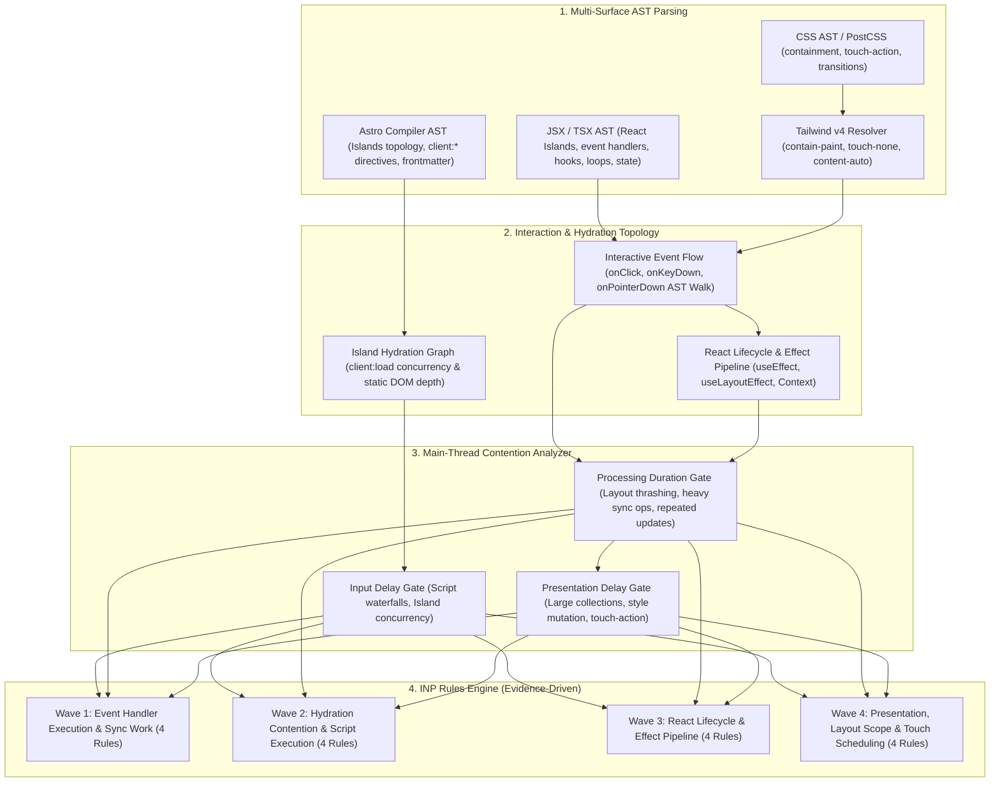

# EXPANSION-BATCH-09: Core Web Vitals - Interaction to Next Paint (INP) Standards (`inp.*`)
> **Kode Dokumen:** `SPEC-EXP-09-INP`
> **Kategori:** `inp` (Core Web Vitals & Main-Thread Interaction Responsiveness)
> **Pilar:** `01-SPEC` (WHAT - Spesifikasi Perilaku & Kontrak Rule)
> **Status:** Active Expansion Specification (16 Aturan Terkurasi: 4 Wave × 4 Aturan)
> **Kalibrasi Desain:** Calibrated against Reviewer 1 & Reviewer 2 AST Execution-Semantics Guidelines
> **Migrasi Sumber:** [`charites-legacy/inp-checker.ts`](file:///home/will/Monorepo/charites/charites-legacy/inp-checker.ts)
> **Standar Rujukan:**
> - W3C Web Performance Working Group: Interaction to Next Paint (INP) Metric Specification
> - Google Core Web Vitals Guidelines (Target INP $\le 200\text{ms}$ at 75th percentile of user sessions)
> - W3C Prioritized Task Scheduling API (`scheduler.yield()`, `scheduler.postTask()`)
> - W3C Long Animation Frames API (LoAF - Task Duration $> 50\text{ms}$)
> - W3C CSS Containment Module Level 2 (`contain: layout paint`, `content-visibility: auto`)
> - W3C Pointer Events Level 3 (`touch-action: pan-y`, `touch-action: none`)
> - React 18 / 19 Concurrent Primitives (`startTransition`, `useTransition`, `useDeferredValue`, Automatic Batching)
> - Astro Architecture: Islands Hydration Lifecycle (`client:idle`, `client:visible`, `client:load`)
> **Pilar Terkait:** [01-SPEC: cls.md](cls.md), [01-SPEC: browser.md](browser.md), [01-SPEC: responsive.md](responsive.md), & [01-SPEC: ux.md](ux.md)

---

## 1. Ikhtisar Kategori `inp` & Epistemologi Analisis Statis vs Runtime

Kategori `inp` Charites dirancang untuk mentransformasikan skrip warisan [`charites-legacy/inp-checker.ts`](file:///home/will/Monorepo/charites/charites-legacy/inp-checker.ts) ke dalam arsitektur static analyzer murni Go 1.26+ berkinerja tinggi (`0 B/op, 0 allocs/op` pada clean node).

### 1.1. Hakikat Runtime INP vs Batasan Bukti Statis AST
Interaction to Next Paint (INP) adalah **metrik runtime yang diukur langsung oleh browser** untuk menilai responsivitas seluruh interaksi pengguna (klik, ketukan, penekanan tombol) sepanjang siklus hidup halaman:

$$\text{INP} = \text{Input Delay} + \text{Processing Time} + \text{Presentation Delay}$$

- **Target Kinerja Web Vitals:** $\text{INP} \le 200\text{ms}$ (Good), $200\text{ms} - 500\text{ms}$ (Needs Improvement), $> 500\text{ms}$ (Poor).

Sebuah parser AST statis **tidak dapat dan tidak pernah berniat menjadi *final judge of performance***. Pengukuran waktu respon interaksi aktual hanya dapat diputuskan secara definitif oleh web browser preview langsung (Chromium, WebKit, Gecko) yang menjalankan thread JavaScript sesungguhnya, mengeksekusi antrean event loop, dan mengukur Long Animation Frames (LoAF).

Secara konkret, sebuah parser AST statis:
1. **Bukan Thread Eksekusi CPU**: Tidak dapat memprediksi waktu eksekusi milidetik nyata ($ms$) dari suatu fungsi karena tergantung pada spesifikasi hardware pengguna dan utilisasi thread.
2. **Tidak Mengetahui Ukuran Dataset Runtime**: Tidak dapat mengetahui berapa banyak data riil yang diiterasi dalam sebuah fungsi `items.map(...)` atau ukuran string `JSON.parse(data)` dari server (kardinalitas runtime tak terbatas).
3. **Tidak Mengukur Antrean Event Loop OS**: Tidak dapat mengetahui apakah thread utama sedang sibuk oleh background garbage collection atau proses eksternal saat pengguna menekan tombol.

### 1.2. Prinsip Shift-Left: Detektor Pola Penulisan Kode, Bukan Final Judge Performa

> [!IMPORTANT]
> **Charites Adalah Detektor Pola Penulisan (*Static Pattern Detector*), Bukan Final Judge Performa Browser**
> - **Peran Charites (Shift-Left Gatekeeper):** Bekerja di level kode sumber (editor, git hook, CI) dalam hitungan milidetik untuk mendeteksi **kebiasaan/pola penulisan kode yang secara struktural memblokir main thread** (misalnya: *layout thrashing*, mutasi gaya imperatif berat di event kontinu, ketiadaan pemecahan tugas kooperatif, badai hidrasi pulau Astro, atau ketiadaan *startTransition* pada update sekunder) sebelum kode mencapai browser.
> - **Peran Web Browser Langsung (The Final Judge):** Pengujian interaksi langsung di browser, panel Performance Chrome DevTools, Lighthouse CI, dan data CrUX/RUM pada pengguna riil adalah **satu-satunya pengambil keputusan final performa interaksi**. Analisis AST Charites jelas kalah jauh dalam hal observasi runtime dibandingkan browser langsung, sehingga Charites membatasi klaimnya hanya sebagai *"Static Evidence of Main-Thread Contention Risk"*.

Setiap temuan diagnostik Charites diklasifikasikan ke dalam 4 status keyakinan (*Evidence Confidence*):
- **`PROVEN`**: Pelanggaran sintaksis deterministik 100% yang dapat dibuktikan dari node AST murni (contoh: pemanggilan layout read langsung setelah style write dalam satu blok tanpa boundary rAF, `useEffect` tanpa dependency array).
- **`LIKELY`**: Bukti struktural kuat tentang anti-pola penghambat respon frame (contoh: eksekusi komputasi sinkron berat di event handler interaktif, multi-pulau `client:load` yang bersaing hidrasi).
- **`POSSIBLE`**: Pola heuristik semantik atau rekomendasi penjadwalan tugas (contoh: ketiadaan pembungkusan transisi `startTransition` pada update sekunder, koleksi data tak terbatas tanpa virtual list).
- **`UNVERIFIABLE`**: Konstruksi dinamis yang mematikan analisis statis (contoh: delegasi event tak bertipe, callback tak terurai).

### 1.3. Standar Narasi Diagnostik: Probabilitas Risiko vs Klaim Absolut Performa

Untuk menjaga integritas ilmiah dan mencegah klaim berlebihan (*overconfident / ownership bias*), Charites menetapkan pedoman narasi pesan diagnostik (*diagnostic message guidelines*) yang ketat bagi seluruh aturan `inp.*`:

> [!WARNING]
> **Larangan Klaim Kepastian Runtime (Anti-Pattern Pesan):**
> Mesin Charites **DILARANG** mengklaim bahwa suatu kode pasti membuat aplikasi lelet atau menuduh INP pengguna pasti buruk:
> -  *Bukan:* `"INP halaman ini jelek/rusak karena handler ini!"`
> -  *Bukan:* `"Tombol ini pasti lag saat diklik pengguna!"`
> -  *Bukan:* `"Aplikasi ini pasti freeze karena loop ini!"`
>
> **Standar Penyampaian Bukti Statis & Potensi Risiko (Wajib Dipatuhi):**
> Narasi diagnostik **WAJIB** membingkai temuan sebagai **bukti pola penulisan yang berpotensi menunda respon frame berikutnya (menaikkan INP)**:
> -  *Standar:* `"Operasi baca properti geometri layout (getBoundingClientRect) dipanggil langsung setelah mutasi gaya; pola penulisan ini berpotensi memicu forced synchronous reflow dan memperpanjang Processing Duration INP."`
> -  *Standar:* `"Terdapat beberapa pulau Astro dengan direktif eager client:load yang bersaing dalam satu jendela hidrasi; pola penulisan ini berisiko menaikkan Input Delay."`
> -  *Standar:* `"Pemanggilan state updater terdeteksi di dalam loop iterasi asinkron; pola penulisan ini berpotensi memicu pembaruan terjadwal yang memperlambat respon frame berikutnya."`

Format pesan diagnostik terpadu Charites mengikuti struktur 3-lapisan:
$$\text{Pesan Diagnostik} = \text{[Bukti Statis AST]} + \text{[Potensi Risiko INP]} + \text{[Saran Remediasi]}$$

---

## 2. Arsitektur Multi-Surface Parsing, Task Scheduling & Unfair Advantage

Ekosistem Astro + React Islands + Tailwind CSS v4 memerlukan mesin analisis multi-permukaan (*multi-surface parser engine*) yang mampu menghubungkan alur event handler dengan siklus hidrasi:



### 2.1. Model Biaya Komputasi Sinkron Bersama (*Unified Expensive Sync Cost Model*)
Untuk mencegah duplikasi heuristik antara `inp.heavy-event-handler`, `inp.sync-layout-effect`, dan `inp.expensive-render-computation`, Charites mengadopsi model biaya terpadu:
- **Tingkat Kompleksitas Tinggi (High-Cost Signals):**
  - Loop bersarang (*nested loops* $\ge 2$ level).
  - `JSON.parse(...)` / `JSON.stringify(...)` atas sumber masukan tak berbatas (*uncontrolled inputs*).
  - Pemanggilan `.sort(...)` atau ekspresi reguler kompleks di dalam perulangan.
  - Kloning objek dalam skala besar (`structuredClone` atau deep traversal).
  - Manipulasi/penelusuran DOM sinkron berskala besar di dalam JavaScript.
- **Tingkat Kompleksitas Sedang (Medium-Cost Signals):**
  - Rantai transformasi array panjang (`.filter().map().reduce()`).
  - Akses sinkron penyimpanan lokal (`localStorage`, `sessionStorage`).
- **Tingkat Kompleksitas Ringan (Low-Cost Signals):**
  - Penugasan variabel skalar, evaluasi aritmatika dasar, pemanggilan helper murni kecil.

### 2.2. The AST Parser Unfair Advantage: Mengapa Linter Konvensional Gagal

Linter konvensional (seperti ESLint dengan `eslint-plugin-react` / `react-hooks`, Stylelint, atau HTMLHint) beroperasi dengan pendekatan lokal per berkas (*isolated single-file visitor*). Model ini gagal total menangani masalah INP modern:

| Dimensi Evaluasi | Linter Konvensional (ESLint, Stylelint, HTMLHint) | Charites Multi-Surface AST Engine | Unfair Advantage Charites |
| :--- | :--- | :--- | :--- |
| **Deteksi *Layout Thrashing*** | Hanya memeriksa pemanggilan properti secara terpisah tanpa melacak urutan mutasi gaya sebelumnya. | Menganalisis sekuens semantik dalam blok fungsi: mendeteksi mutasi gaya DOM (`style.*`, `classList`) yang diikuti pembacaan properti geometri (`getBoundingClientRect`, `offsetHeight`). | Mengidentifikasi *forced synchronous reflow* secara presisi tanpa alarm palsu pada pembacaan properti baca-saja (*read-only*). |
| **Konkurensi Hidrasi Pulau Astro** | ESLint tidak memiliki pemahaman tentang pulau (*islands*) Astro dan direktif `client:*`. | Mengekstrak topologi hidrasi seluruh komponen pulau dalam satu template Astro. | Mendeteksi penumpukan direktif `client:load` simultan yang memonopoli thread utama pada saat interaksi awal pengguna. |
| **Penjadwalan Tugas Kooperatif Modern** | Tidak mengenali W3C Task Scheduling API modern (`scheduler.yield()`) dan batas fallbacks-nya. | Mengenali ketiadaan batas penjadwalan kooperatif dan menyarankan `await scheduler.yield?.()` dengan fallback aman. | Membimbing pengembang memecah tugas panjang (*long tasks*) tanpa melanggar kompatibilitas browser. |
| **Korelasi Properti CSS dengan Interaksi JS** | ESLint tidak dapat membaca CSS; Stylelint tidak dapat membaca JSX event handlers. | Menghubungkan deklarasi CSS / utilitas Tailwind (`touch-action: none`, `contain: layout paint`) langsung dengan elemen berkait event handler. | Memvalidasi bahwa widget gestur sentuh memiliki perutean instan thread browser tanpa konflik pengenalan gestur bawaan. |
| **Pelacakan Siklus Efek & Konteks React** | Hanya memvalidasi dependensi hook dangkal tanpa mengaudit komputasi pemblokir render. | Menganalisis isi body `useLayoutEffect` dan instansiasi objek literal pada `Context.Provider value={{...}}`. | Mencegah penundaan fase presentasi (*Presentation Delay*) akibat efek sinkron sebelum proses penggambaran (*paint*). |
| **Performa Eksekusi Linting** | Bergantung pada runtime Node.js lambat dengan parsing Babel/TypeScript berbobot puluhan megabyte. | Arsitektur Leaf IR murni Go 1.26+ berkecepatan native (`0 B/op, 0 allocs/op` pada clean node). | Memindai ratusan komponen dan event handler dalam hitungan milidetik tanpa memperlambat pipeline CI. |

---

## 3. Garansi Zero Redundancy & Matriks Ortogonalitas Lintas Kategori

### 3.1. Pemisahan Batas Intra-Kategori (*Intra-Category Separation of Concerns*)
Untuk mencegah terjadinya tumpang-tindih di dalam kategori `inp.*` sendiri (seperti yang diidentifikasi pada evaluasi teknis):
1. **`inp.hydration-heavy-island` vs `inp.unbounded-collection-render`**:
   - `inp.hydration-heavy-island` berfokus khusus pada **kompleksitas pohon simpul JSX statis** di dalam pulau client Astro pada saat proses hidrasi awal.
   - `inp.unbounded-collection-render` berfokus khusus pada **pemetaan data dinamis berkardinalitas tak terhingga (`.map()`)** ke dalam elemen DOM interaktif berulang.
2. **`inp.heavy-event-handler` vs `inp.expensive-style-mutation`**:
   - `inp.heavy-event-handler` berfokus pada **komputasi CPU sinkron** (algoritma, parsing, sorting) di dalam callback penangan interaksi.
   - `inp.expensive-style-mutation` berfokus pada **mutasi gaya imperatif JavaScript atas properti pemicu invalidasi cat/raster grafis** (`filter`, `box-shadow`) pada event kontinu (*pointermove*, *scroll*).
3. **`inp.layout-thrashing` vs `inp.sync-layout-effect`**:
   - `inp.layout-thrashing` mendeteksi **urutan sekuensial eksekusi** (write $\to$ read) di sembarang fungsi JavaScript.
   - `inp.sync-layout-effect` mendeteksi **penempatan komputasi non-pengukuran berat** di dalam hook `useLayoutEffect` yang berjalan sinkron sebelum fase paint browser.

### 3.2. Matriks Ortogonalitas Lintas-Kategori (*Cross-Category 16-Row Mapping*)

| Rule `inp.*` | Rule Kategori Lain Terdekat | Fokus Domain Kategori Lain | Fokus Domain Kategori `inp` | Garansi Batasan Ortogonal (*Zero Redundancy Guarantee*) |
|---|---|---|---|---|
| `inp.layout-thrashing` | `cls.layout-trigger-animation` | Mengaudit animasi CSS `@keyframes` yang menganimasikan properti geometri reflow CPU. | Mengaudit urutan kode JavaScript yang menulis gaya DOM lalu membaca geometri layout dalam satu alur eksekusi sinkron. | `cls` mengaudit file CSS / gaya animasi deklaratif; `inp` mengaudit sekuens kode eksekusi imperatif JavaScript (*forced reflow*). |
| `inp.heavy-event-handler` | `ux.unthrottled-input-handler` | Mencegah pemanggilan jaringan/fetch tanpa debounce pada keystroke input teks. | Mencegah komputasi CPU sinkron yang berat (`JSON.parse`, `.sort()`, loop besar) langsung di dalam event handler interaktif. | `ux` mengaudit banjir permintaan I/O jaringan; `inp` mengaudit saturasi komputasi CPU sinkron thread utama. |
| `inp.repeated-state-update` | `ux.unbounded-async-flag` | Mengaudit boolean loading state flag agar tidak terjebak tanpa penanganan error. | Mengaudit pemanggilan state updater di dalam loop asinkron (`await` per tick) atau `flushSync` yang memecah batching React 18+. | `ux` mengaudit konsistensi state kognitif antarmuka; `inp` mengaudit antrean pembaruan tak perlu yang membebani scheduler. |
| `inp.unyielded-long-task` | `browser.experimental-api-no-featuredetect` | Memastikan API browser eksperimental dibungkus pengecekan fitur runtime. | Menganjurkan batas penjadwalan kooperatif (dengan fallback aman) untuk memecah tugas panjang yang berjalan dari interaksi. | `browser` mengaudit kompatibilitas polyfill lintas-browser; `inp` mengaudit arsitektur penjadwalan pemecahan tugas kooperatif. |
| `inp.hydration-contention` | `cls.client-only-hydration-pop` | Mencegah kekosongan ruang geometris akibat pemintasan SSR total (`client:only`) tanpa fallback slot. | Mencegah saturasi thread utama akibat penumpukan hidrasi paralel pulau `client:load` di satu jendela eksekusi awal. | `cls` mengaudit kekosongan fisik ruang tata letak; `inp` mengaudit perebutan antrean pemrosesan JavaScript saat hidrasi awal. |
| `inp.hydration-heavy-island` | `responsive.mobile-density-overload` | Membatasi kepadatan elemen sentuh fisik yang terlalu rapat di layar ponsel. | Mengaudit pulau React dengan pohon DOM statis sangat besar yang tidak didekomposisi ke komponen Astro statis. | `responsive` mengaudit ergonomi fisik antarmuka sentuh; `inp` mengaudit biaya rekonsiliasi VDOM pada hidrasi client. |
| `inp.render-blocking-script` | `cls.font-import-late-discovery` | Mendeteksi CSS `@import` font eksternal pemblokir render cascade. | Mendeteksi tag `<script src>` sinkron (`is:inline` / non-defer) yang menunda waktu ketersediaan interaktivitas awal halaman. | `cls` mengaudit rantai unduhan font dalam CSS; `inp` mengaudit waktu tunggu eksekusi JavaScript sebelum thread siap menerima input. |
| `inp.missing-start-transition` | `ux.submit-feedback-missing` | Memastikan formulir memberikan umpan balik visual saat proses submit berlangsung. | Menganjurkan pembungkusan mutasi state sekunder berat dengan `startTransition` (mengecualikan controlled text inputs). | `ux` mengaudit ketersediaan indikator visual pengguna; `inp` mengaudit prioritas penjadwalan pembaruan thread React Concurrent. |
| `inp.unbounded-effect-deps` | `ux.orphaned-error-state` | Mengaudit status error yang tidak dapat di-reset oleh pengguna. | Mengaudit `useEffect`/`useLayoutEffect` tanpa array dependensi yang memuat komputasi berbiaya tinggi pada setiap render. | `ux` mengaudit interaksi pemulihan kesalahan; `inp` mengaudit frekuensi eksekusi tugas berat pasca-interaksi pengguna. |
| `inp.sync-layout-effect` | `theme.hydration-theme-mismatch` | Mencegah kilatan kontras tema gelap/terang saat hidrasi rendering. | Mencegah komputasi non-pengukuran berat di dalam `useLayoutEffect` yang memblokir proses penggambaran (*paint*) browser. | `theme` mengaudit keselarasan token warna antarmuka; `inp` mengaudit pemblokiran sinkron thread render sebelum fase presentasi. |
| `inp.context-re-render-cascade` | `theme.token-source-drift` | Mengaudit inkonsistensi sumber kebenaran token styling tema. | Mengaudit instansiasi objek literal baru pada `Context.Provider value={{...}}` yang memicu re-render seluruh pohon konsumen. | `theme` mengaudit integritas desain token; `inp` mengaudit propagasi re-render komponen turunan saat menerima event interaksi. |
| `inp.expensive-render-computation` | `ux.radio-overchoice` | Membatasi opsi radio pilihan ganda agar tidak membebani kognisi pengguna. | Mencegah komputasi transformasi data kompleks di tubuh komponen tanpa pembungkus memoization atau caching. | `ux` mengaudit beban kognitif manusia terhadap pilihan UI; `inp` mengaudit beban kalkulasi CPU pada siklus render interaktif. |
| `inp.unbounded-collection-render` | `responsive.unwrapped-table-overflow` | Memastikan kontainer tabel memiliki pembungkus scroll horisontal di ponsel. | Mengaudit pemetaan koleksi data dinamis berkardinalitas tak terduga langsung ke DOM tanpa paginasi/virtualisasi. | `responsive` mengaudit pembungkus scroll layar sempit; `inp` mengaudit ledakan jumlah node DOM yang memperlambat Presentation Delay. |
| `inp.large-interaction-layout-scope` | `responsive.keyboard-obstruction` | Mencegah keyboard virtual mobile menutupi kolom input formulir. | Mengaudit mutasi interaktif panel/overlay yang memicu kalkulasi ulang tata letak pada lingkup leluhur tanpa pembatas skop. | `responsive` mengaudit penataan tata letak visual saat keyboard muncul; `inp` mengaudit ruang lingkup pembatalan reflow layout browser. |
| `inp.missing-touch-action` | `browser.non-passive-scroll-listener` | Memastikan event listener `wheel`/`touchmove` memiliki opsi `{ passive: true }` untuk thread compositor. | Memastikan elemen widget gestur kustom memiliki CSS `touch-action` untuk mencegah konflik pengenalan gestur bawaan browser. | `browser` mengaudit opsi registrasi fungsi JavaScript; `inp` mengaudit properti CSS deklaratif perutean thread sentuh. |
| `inp.expensive-style-mutation` | `cls.layout-trigger-transition` | Membatasi transisi CSS agar tidak menargetkan properti dimensi geometri. | Mencegah mutasi JavaScript imperatif pada properti grafis peka-cat (`filter`, `box-shadow`) dalam event handler kontinu. | `cls` mengaudit pergeseran letak koordinat elemen; `inp` mengaudit beban komputasi penggambaran ulang piksel (*re-paint & raster cost*). |

---

## 4. Ringkasan Matriks 16 Rule `inp.*` (4 Wave Terkalibrasi)

Setiap aturan dipetakan berdasarkan **Subject $\to$ Evidence $\to$ Predicate $\to$ Confidence $\to$ Exceptions**, Domain Parser, Severity, dan Kelayakan Autofix:

| Wave | Rule ID | Legacy Ref | Domain Parser | Tier | Confidence | Severity | Kelayakan Autofix |
| :---: | :--- | :---: | :---: | :---: | :---: | :---: | :---: |
| **W1** | `inp.layout-thrashing` | R2 | JSX/TSX AST | T1 | `PROVEN` | `error` | Rendah (sarankan batching pembacaan layout sebelum mutasi) |
| **W1** | `inp.heavy-event-handler` | R6 | JSX/TSX AST | T2 | `LIKELY` | `warning` | Rendah (sarankan pemindahan ke worker atau cooperative yield) |
| **W1** | `inp.repeated-state-update` | R4 | JSX/TSX AST | T1 | `LIKELY` | `warning` | Menengah (sarankan kalkulasi state final sebelum pembaruan) |
| **W1** | `inp.unyielded-long-task` | R5 | JSX/TSX AST | T2 | `LIKELY` | `warning` | **Tinggi** (sarankan `await scheduler.yield?.() ?? fallback`) |
| **W2** | `inp.hydration-contention` | R3 | Astro Compiler AST | T1 | `LIKELY` | `warning` | Menengah (sarankan migrasi ke `client:idle` / `client:visible`) |
| **W2** | `inp.hydration-heavy-island` | Baru | Astro + JSX AST | T2 | `LIKELY` | `warning` | Rendah (sarankan dekomposisi ke komponen Astro statis) |
| **W2** | `inp.render-blocking-script` | HTML R1 | Astro HTML Graph | T1 | `PROVEN` | `warning` | **Tinggi** (auto-inject atribut `defer` pada script inline/mentah) |
| **W2** | `inp.missing-start-transition` | Baru | JSX/TSX AST | T2 | `POSSIBLE` | `info` | Tidak (autofix dilarang untuk menghindari regresi controlled input) |
| **W3** | `inp.unbounded-effect-deps` | R7 | JSX/TSX AST | T1 | `PROVEN` | `error` | **Tinggi** (tambahkan array dependensi eksplisit) |
| **W3** | `inp.sync-layout-effect` | Baru | JSX/TSX AST | T2 | `LIKELY` | `warning` | Menengah (sarankan pemindahan komputasi ke `useEffect`) |
| **W3** | `inp.context-re-render-cascade` | Baru | JSX/TSX AST | T1 | `PROVEN` | `warning` | Menengah (sarankan pembungkusan `useMemo` pada objek value) |
| **W3** | `inp.expensive-render-computation` | Baru | JSX/TSX AST | T2 | `LIKELY` | `warning` | Menengah (sarankan memoization atau kalkulasi di luar render) |
| **W4** | `inp.unbounded-collection-render` | Baru | JSX/TSX AST | T2 | `POSSIBLE` | `warning` | Rendah (sarankan integrasi virtual list windowing) |
| **W4** | `inp.large-interaction-layout-scope` | Baru | JSX/Astro + CSS/TW4 | T2 | `POSSIBLE` | `warning` | Menengah (sarankan pembatasan lingkup layout leluhur) |
| **W4** | `inp.missing-touch-action` | Baru | JSX/Astro + CSS/TW4 | T2 | `LIKELY` | `warning` | **Tinggi** (tambahkan utilitas `touch-pan-y` atau `touch-none`) |
| **W4** | `inp.expensive-style-mutation` | Baru | JSX/TSX + CSS AST | T2 | `POSSIBLE` | `warning` | Rendah (sarankan pergantian ke transformasi composited GPU) |

---

## 5. Spesifikasi Detail & Kontrak Formal 16 Rule `inp.*`

### 5.1. `inp.layout-thrashing` (Wave 1 - Migrasi Legacy R2)
- **Sumber Legacy:** `charites-legacy/inp-checker.ts` (Rule R2: `layout-thrashing`).
- **Domain Parser:** React JSX/TSX AST + CFG Sequence Tracker.
- **Tier / Severity:** Tier 1 (Deterministic Scope Pattern) / `error`.
- **Formal Contract:**
  - **Subject:** Blok fungsi imperatif yang memanipulasi DOM langsung.
  - **Evidence:** Urutan penulisan gaya DOM (`el.style.* = ...`, `el.className = ...`, `el.classList.add/remove(...)`) yang diikuti oleh pembacaan properti geometri tata letak:
    $$\text{Layout Props} \in \{\text{offsetWidth}, \text{offsetHeight}, \text{clientWidth}, \text{clientHeight}, \text{scrollWidth}, \text{scrollHeight}, \text{getBoundingClientRect}, \text{getComputedStyle}\}$$
    di dalam jalur eksekusi sinkron (*execution path*) yang sama tanpa pembatas penjadwalan (`requestAnimationFrame` atau `yield`). Pola bergantian (*write $\to$ read $\to$ write $\to$ read*) meningkatkan tingkat keyakinan temuan.
  - **Predicate:** Mutasi properti tata letak yang langsung diikuti oleh pembacaan properti geometri dependen dalam satu alur eksekusi sinkron **dilarang**, karena memicu *forced synchronous reflow* yang memblokir thread utama.
  - **Confidence:** `PROVEN` (100% kepastian urutan AST statement pada lingkup fungsi yang sama).
  - **Exceptions:** Pembacaan layout yang dipisahkan ke dalam callback `requestAnimationFrame` berikutnya atau seluruh pembacaan dilakukan sebelum mutasi pertama (*read-then-write batching*).
- **AST Parser Unfair Advantage vs Linter Konvensional:**
  ESLint memeriksa simpul secara terisolasi tanpa melacak alur mutasi gaya sebelumnya. Charites memelihara status sekuensial simpul dalam satu blok pernyataan, mendeteksi secara presisi kapan mutasi gaya diikuti pembacaan layout tanpa menghasilkan alarm palsu pada kode baca murni.
- **Non-Redundancy Guarantee:**
  Ortogonal penuh terhadap `cls.layout-trigger-animation`. Aturan `cls` memeriksa properti deklaratif pada stylesheet CSS; aturan `inp.layout-thrashing` memeriksa kode imperatif JavaScript yang memaksa kalkulasi tata letak ulang di tengah-tengah eksekusi script.
- **Autofix Feasibility:** Rendah (berikan saran perbaikan arsitektural untuk mengelompokkan pembacaan sebelum penulisan).
- **Suspicious:**
  ```tsx
  // Pelanggaran: Menulis style lalu membaca tinggi (Forced Synchronous Layout)
  function adjustHeight(el: HTMLElement) {
    el.style.width = '200px';
    const height = el.offsetHeight; // Memaksa browser menghitung layout seketika!
    el.style.height = `${height * 2}px`;
  }
  ```
- **Compliant:**
  ```tsx
  // Patuh: Membaca seluruh dimensi layout terlebih dahulu sebelum memutasi gaya
  function adjustHeight(el: HTMLElement) {
    const currentHeight = el.offsetHeight; // Baca di awal
    el.style.width = '200px';
    el.style.height = `${currentHeight * 2}px`; // Tulis serentak di akhir
  }
  ```

---

### 5.2. `inp.heavy-event-handler` (Wave 1 - Migrasi Legacy R6)
- **Sumber Legacy:** `charites-legacy/inp-checker.ts` (Rule R6: `heavy-handler-op`).
- **Domain Parser:** React JSX/TSX AST + Computational Cost Model.
- **Tier / Severity:** Tier 2 (Event Handler Complexity Analysis) / `warning`.
- **Formal Contract:**
  - **Subject:** Fungsi penangan interaksi pengguna pada atribut JSX:
    $$\text{Interactive Handlers} \in \{\text{onClick}, \text{onKeyDown}, \text{onPointerDown}, \text{onSubmit}\}$$
  - **Evidence:** Penangan interaksi memuat jalur komputasi sinkron yang memenuhi indikator biaya tinggi (*High-Cost Signals*): loop bersarang, `JSON.parse` / `JSON.stringify` pada data tak berbatas, pemanggilan `.sort()`, atau rekursi dalam skala besar.
  - **Predicate:** Penangan interaksi langsung **sebaiknya tidak menjalankan komputasi sinkron berdurasi panjang** yang memonopoli thread utama dan menunda waktu respon frame input berikutnya ($> 50\text{ms}$).
  - **Confidence:** `LIKELY` jika terdeteksi algoritma berat atau loop bersarang; `POSSIBLE` untuk iterasi transformasi data tunggal.
  - **Exceptions:** Operasi yang didelegasikan ke Web Worker, dipindahkan ke cache state di luar handler, atau dipecah secara kooperatif menggunakan batas penjadwalan.
- **AST Parser Unfair Advantage vs Linter Konvensional:**
  ESLint tidak memeriksa isi tubuh fungsi penangan event interaktif untuk mendeteksi saturasi pemrosesan CPU. Charites menelusuri simpul anak (*child nodes*) fungsi callback handler JSX dengan model biaya struktural (*computational cost model*).
- **Non-Redundancy Guarantee:**
  Ortogonal penuh terhadap `ux.unthrottled-input-handler`. Aturan `ux` mengaudit banjir permintaan I/O jaringan pada pengetikan; aturan `inp.heavy-event-handler` mengaudit kalkulasi CPU internal sinkron yang menunda penggambaran frame berikutnya.
- **Autofix Feasibility:** Rendah (sarankan pemindahan komputasi ke Web Worker atau pemecahan tugas kooperatif).
- **Suspicious:**
  ```tsx
  // Pelanggaran: Melakukan sorting dan parsing JSON sinkron di handler klik
  <button onClick={(e) => {
    const data = JSON.parse(hugePayload);
    const sorted = data.sort((a, b) => b.score - a.score);
    setResults(sorted);
  }}>
    Urutkan Data
  </button>
  ```
- **Compliant:**
  ```tsx
  // Patuh: Memecah tugas panjang secara kooperatif atau mendelegasikan ke Web Worker
  <button onClick={async (e) => {
    setLoading(true);
    await scheduler.yield?.(); // Berikan kesempatan browser merender respon interaksi awal
    const data = JSON.parse(hugePayload);
    setResults(data.sort((a, b) => b.score - a.score));
    setLoading(false);
  }}>
    Urutkan Data
  </button>
  ```

---

### 5.3. `inp.repeated-state-update` (Wave 1 - Refined Legacy R4)
- **Sumber Legacy:** `charites-legacy/inp-checker.ts` (Rule R4: `setstate-in-loop`).
- **Domain Parser:** React JSX/TSX AST + Batching Boundary Tracer.
- **Tier / Severity:** Tier 1 (Iteration Scope Analysis) / `warning`.
- **Formal Contract:**
  - **Subject:** Pemanggilan fungsi updater state React (`setState` atau fungsi dengan konvensi nama `/^set[A-Z]/`).
  - **Evidence:** Pemanggilan state updater di dalam perulangan yang **memecah batas otomatisasi batching React 18+**, yaitu:
    1. Perulangan yang memuat `await` di antara pemanggilan updater (menghasilkan render terpisah pada setiap tick microtask).
    2. Pemanggilan di dalam blok `flushSync(...)` di dalam perulangan.
    3. Perulangan yang memutasi state dependen berulang kali yang memicu penjadwalan render berlebih.
  - **Predicate:** Pembaruan state React **dilarang dipanggil secara berulang di dalam iterasi perulangan yang memecah batas batching**, karena memicu antrean pembaruan bertingkat yang membebani scheduler React.
  - **Confidence:** `LIKELY` (keberadaan pemanggilan state di loop asinkron atau flushSync terbukti statis).
  - **Exceptions:** Pembaruan state murni sinkron dalam satu blok React 18+ (yang secara bawaan di-batch otomatis menjadi satu render), atau handler event individual per elemen anak.
- **AST Parser Unfair Advantage vs Linter Konvensional:**
  Linter lama mengklaim bahwa seluruh loop sinkron menghasilkan N re-render (padahal sudah di-batch otomatis oleh React 18). Charites secara cerdas membedakan loop sinkron yang ter-batch dengan loop asinkron / `flushSync` yang benar-benar memecah batching.
- **Non-Redundancy Guarantee:**
  Ortogonal penuh terhadap `ux.unbounded-async-flag`. Aturan `ux` mengaudit flag boolean loading; aturan `inp.repeated-state-update` mengaudit antrean pembaruan state berulang yang memecah scheduler render.
- **Autofix Feasibility:** Menengah (sarankan akumulasi nilai ke array sebelum memanggil state setter tunggal).
- **Suspicious:**
  ```tsx
  // Pelanggaran: Await di dalam loop memecah React 18 batching, memicu render per-tick
  for (const item of items) {
    const res = await fetchDetail(item.id);
    setDetails(prev => [...prev, res]); // Memicu re-render terpisah di setiap iterasi!
  }
  ```
- **Compliant:**
  ```tsx
  // Patuh: Menunggu seluruh data terkumpul lalu memanggil setState satu kali
  const results = [];
  for (const item of items) {
    results.push(await fetchDetail(item.id));
  }
  setDetails(prev => [...prev, ...results]);
  ```

---

### 5.4. `inp.unyielded-long-task` (Wave 1 - Migrasi Legacy R5)
- **Sumber Legacy:** `charites-legacy/inp-checker.ts` (Rule R5: `prefer-scheduler-yield`).
- **Domain Parser:** React JSX/TSX AST.
- **Tier / Severity:** Tier 2 (Cooperative Scheduling Pattern) / `warning`.
- **Formal Contract:**
  - **Subject:** Alur eksekusi komputasi sinkron berdurasi panjang yang dipicu oleh interaksi pengguna.
  - **Evidence:** Fungsi pemroses tugas panjang yang tidak menyertakan titik penyerahan kendali (*cooperative scheduling boundary*) atau mengandalkan pola usang `setTimeout(fn, 0)` tanpa penanganan prioritas.
  - **Predicate:** Jalur komputasi sinkron berdurasi panjang yang dijalankan dari aksi interaksi **sebaiknya menyertakan batas penjadwalan tugas kooperatif** (seperti `await scheduler.yield?.() ?? fallback`) agar thread utama dapat melayani event input baru sebelum tugas dilanjutkan.
  - **Confidence:** `LIKELY` (ketiadaan batas jeda kooperatif pada algoritma panjang terdeteksi statis).
  - **Exceptions:** Komputasi yang berukuran sangat kecil atau kode yang dieksekusi di Web Worker terisolasi.
- **AST Parser Unfair Advantage vs Linter Konvensional:**
  Linter konvensional tidak mengenali konsep penjadwalan kooperatif browser modern. Charites mendeteksi ketiadaan batas jeda dan merekomendasikan sintaks penyerahan kendali yang dilengkapi fallback aman.
- **Non-Redundancy Guarantee:**
  Ortogonal penuh terhadap `browser.experimental-api-no-featuredetect`. Aturan `browser` memeriksa deteksi fitur API; aturan `inp.unyielded-long-task` secara spesifik mengarahkan pemecahan tugas ke pola kooperatif ber-fallback aman.
- **Autofix Feasibility:** **Tinggi** (sarankan idiom aman: `await (window.scheduler?.yield?.() ?? new Promise(r => setTimeout(r, 0)))`).
- **Suspicious:**
  ```ts
  // Pelanggaran: Komputasi panjang tanpa jeda kooperatif memonopoli thread
  function processLargeArray(items: string[]) {
    for (let i = 0; i < items.length; i++) {
      heavyCalculation(items[i]);
    }
  }
  ```
- **Compliant:**
  ```ts
  // Patuh: Menyerahkan kendali secara berkala agar frame input tetap responsif
  async function processLargeArray(items: string[]) {
    for (let i = 0; i < items.length; i++) {
      heavyCalculation(items[i]);
      if (i % 50 === 0) {
        await (window.scheduler?.yield?.() ?? new Promise(r => setTimeout(r, 0)));
      }
    }
  }
  ```

---

### 5.5. `inp.hydration-contention` (Wave 2 - Refined Legacy R3)
- **Sumber Legacy:** `charites-legacy/inp-checker.ts` (Rule R3: `too-many-client-load`).
- **Domain Parser:** Astro Compiler AST.
- **Tier / Severity:** Tier 1 (Astro Island Concurrency) / `warning`.
- **Formal Contract:**
  - **Subject:** Dokumen template tata letak berkas `.astro`.
  - **Evidence:** Keberadaan beberapa komponen pulau (*multiple islands*) yang dideklarasikan dengan direktif hidrasi agresif `client:load` yang berbagi jendela eksekusi awal yang sama, sehingga secara kolektif melampaui anggaran hidrasi awal.
  - **Predicate:** Halaman Astro **sebaiknya tidak mengeksekusi hidrasi agresif simultan pada banyak pulau**; komponen yang tidak berada di area interaksi kritis awal **wajib dialihkan ke direktif hidrasi tertunda (`client:idle`, `client:visible`, atau `client:media`)**.
  - **Confidence:** `LIKELY` (keberadaan multi-island `client:load` terhitung presisi dari Astro AST).
  - **Exceptions:** Halaman aplikasi interaktif tunggal (*single-page app shell*) yang secara eksplisit dikecualikan.
- **AST Parser Unfair Advantage vs Linter Konvensional:**
  ESLint tidak dapat mengurai format berkas `.astro` maupun memahami direktif hidrasi pulau Astro. Charites mengekstrak seluruh pulau interaktif secara langsung dari Astro Compiler AST dan mengevaluasi konkurensi hidrasi.
- **Non-Redundancy Guarantee:**
  Ortogonal penuh terhadap `cls.client-only-hydration-pop`. Aturan `cls` memeriksa ketiadaan kerangka layout saat hidrasi; aturan `inp.hydration-contention` mengaudit perebutan antrean pemrosesan JavaScript pada thread utama yang memicu lonjakan Input Delay.
- **Autofix Feasibility:** Menengah (sarankan pengubahan direktif pulau non-utama menjadi `client:idle` atau `client:visible`).
- **Suspicious:**
  ```astro
  ---
  // Pelanggaran: Seluruh komponen pulau dihidrasi bersamaan dengan client:load
  import HeaderNav from '../components/HeaderNav.tsx';
  import SearchBar from '../components/SearchBar.tsx';
  import PromoBanner from '../components/PromoBanner.tsx';
  ---
  <HeaderNav client:load />
  <SearchBar client:load />
  <PromoBanner client:load />
  ```
- **Compliant:**
  ```astro
  ---
  // Patuh: Hanya komponen paling kritis yang menggunakan client:load
  import HeaderNav from '../components/HeaderNav.tsx';
  import SearchBar from '../components/SearchBar.tsx';
  import PromoBanner from '../components/PromoBanner.tsx';
  ---
  <HeaderNav client:load />
  <SearchBar client:idle />
  <PromoBanner client:visible />
  ```

---

### 5.6. `inp.hydration-heavy-island` (Wave 2 - Refined Legacy R3/New)
- **Sumber Legacy:** Konsep baru (Structural Complexity Score for Island Hydration).
- **Domain Parser:** Astro Template AST + React JSX AST.
- **Tier / Severity:** Tier 2 (Virtual DOM Hydration Complexity) / `warning`.
- **Formal Contract:**
  - **Subject:** Komponen React Island yang dihidrasi via direktif `client:*`.
  - **Evidence:** Komponen pulau client memiliki skor kompleksitas struktural tinggi: kombinasi pohon JSX statis yang sangat dalam, jumlah hook tinggi, dan banyak event handler yang dihidrasi utuh tanpa pemisahan konten statis.
  - **Predicate:** Komponen pulau client **sebaiknya tidak membungkus pohon konten statis masif di dalam satu pulau hidrasi monolitik**; bagian yang tidak interaktif wajib didekomposisi ke komponen Astro bawaan (*zero-JS SSR*).
  - **Confidence:** `LIKELY` (kedalaman simpul JSX dan jumlah hook dapat dihitung secara statis).
  - **Exceptions:** Komponen editor teks terintegrasi, visualisasi grafik interaktif utuh, atau kanvas game.
- **AST Parser Unfair Advantage vs Linter Konvensional:**
  ESLint tidak memahami arsitektur pulau Astro dan menganggap semua JSX sama. Charites mengevaluasi batas isolasi antara kode server Astro dan kode pulau client React.
- **Non-Redundancy Guarantee:**
  Ortogonal penuh terhadap `inp.unbounded-collection-render`. Aturan `inp.hydration-heavy-island` memeriksa pohon statis saat hidrasi pulau; aturan `inp.unbounded-collection-render` memeriksa pemetaan data dinamis tak terduga via `.map()`.
- **Autofix Feasibility:** Rendah (sarankan dekomposisi ke komponen Astro statis).
- **Suspicious:**
  ```tsx
  // Pelanggaran: Artikel statis panjang dibungkus dalam React Island yang dihidrasi client
  <ArticleViewerIsland client:load>
    <Header />
    <StaticLongText /> {/* Ratusan node statis direkonsiliasi di VDOM client */}
    <CommentButton />
  </ArticleViewerIsland>
  ```
- **Compliant:**
  ```astro
  <!-- Patuh: Teks statis dirender Astro zero-JS, hanya tombol komentar yang menjadi pulau -->
  <Header />
  <StaticLongText />
  <CommentButton client:visible />
  ```

---

### 5.7. `inp.render-blocking-script` (Wave 2 - Refined Legacy HTML R1)
- **Sumber Legacy:** `charites-legacy/inp-checker.ts` (HTML R1: `render-blocking-script`).
- **Domain Parser:** Astro Template AST + HTML Document Graph.
- **Tier / Severity:** Tier 1 (Script Execution Pipeline) / `warning`.
- **Formal Contract:**
  - **Subject:** Elemen `<script src="...">` eksternal di dalam dokumen.
  - **Evidence:** Tag `<script>` yang menggunakan atribut `is:inline` pada Astro atau tag `<script src="...">` mentah di `<head>` dokumen tanpa atribut `async`, `defer`, maupun `type="module"`.
  - **Predicate:** Script eksternal mentah **dilarang mengeksekusi secara sinkron memblokir parser HTML**; script wajib menyertakan atribut `defer` atau `type="module"` agar tidak memperpanjang Input Delay.
  - **Confidence:** `PROVEN` (100% kepastian sintaksis tag atribut).
  - **Exceptions:** **WAJIB MENGEJUALIKAN:** Tag `<script>` standar Astro (yang secara otomatis diproses dan dideferensiasi oleh bundler Astro sebagai module).
- **AST Parser Unfair Advantage vs Linter Konvensional:**
  Linter HTML biasa sering menandai tag `<script>` bawaan Astro sebagai pemblokir render karena tidak memahami mekanisme bundling Astro. Charites membedakan script internal Astro dengan script eksternal berat `is:inline`.
- **Non-Redundancy Guarantee:**
  Ortogonal penuh terhadap `cls.font-import-late-discovery`. Aturan `cls` memeriksa rantai pemblokiran cascading font; aturan `inp.render-blocking-script` memeriksa eksekusi script sinkron yang menunda kesiapan respon input thread.
- **Autofix Feasibility:** **Tinggi** (menambahkan atribut `defer` pada script eksternal inline).
- **Suspicious:**
  ```astro
  <!-- Pelanggaran: Script eksternal is:inline memblokir parser HTML dan kesiapan thread -->
  <script is:inline src="https://analytics.example.com/heavy-bundle.js"></script>
  ```
- **Compliant:**
  ```astro
  <!-- Patuh: Script dideferensiasi atau menggunakan script bawaan Astro (type="module") -->
  <script is:inline src="https://analytics.example.com/heavy-bundle.js" defer></script>
  <!-- atau script standar Astro -->
  <script>
    import '../scripts/analytics.ts';
  </script>
  ```

---

### 5.8. `inp.missing-start-transition` (Wave 2 - Baru)
- **Sumber Legacy:** Konsep baru (React 18/19 Concurrent Task Prioritization).
- **Domain Parser:** React JSX/TSX AST.
- **Tier / Severity:** Tier 2 (Concurrent Transition Scheduling) / `info` (advisory).
- **Formal Contract:**
  - **Subject:** Penangan event interaktif yang memicu pembaruan state non-mendesak berskala besar.
  - **Evidence:** Penangan interaksi menggabungkan pembaruan input mendesak dengan pembaruan data sekunder yang mahal tanpa membungkus pembaruan sekunder tersebut dengan `startTransition(...)` atau `useTransition()`.
  - **Predicate:** Pembaruan antarmuka sekunder berskala besar pasca-interaksi **disarankan dibungkus dengan `startTransition`** agar React dapat memprioritaskan ketikan atau klik baru di atas proses rendering komponen berat.
  - **Confidence:** `POSSIBLE` (analisis statis mengenali pola pembaruan sekunder berat di handler interaksi).
  - **Exceptions:** **DILARANG MEREKOMENDASIKAN PADA INPUT TEKS TERKONTROL:** Nilai input controlled (`<input value={text} onChange={...} />`) wajib tetap diperbarui secara sinkron.
- **AST Parser Unfair Advantage vs Linter Konvensional:**
  ESLint tidak memahami pemisahan antara pembaruan state mendesak (*urgent updates*) dan transisi (*transitions*). Charites memeriksa apakah pembaruan data sekunder berat digabungkan secara sinkron dengan event input.
- **Non-Redundancy Guarantee:**
  Ortogonal penuh terhadap `ux.submit-feedback-missing`. Aturan `ux` memeriksa visibilitas spinner loading; aturan `inp.missing-start-transition` memeriksa pemisahan prioritas thread CPU React Concurrent.
- **Autofix Feasibility:** **Tidak Disarankan (Dilarang Autofix)**, karena otomatisasi sembarangan pada controlled text input dapat merusak responsivitas ketikan pengguna.
- **Suspicious:**
  ```tsx
  // Pelanggaran: Pembaruan daftar pencarian besar dieksekusi sinkron memblokir ketikan berikutnya
  function handleFilterChange(e: ChangeEvent<HTMLInputElement>) {
    setSearchQuery(e.target.value); // Mendesak
    setFilteredLargeList(expensiveFilter(e.target.value)); // Berat & non-mendesak
  }
  ```
- **Compliant:**
  ```tsx
  // Patuh: Memisahkan pembaruan input mendesak dengan rendering daftar via startTransition
  function handleFilterChange(e: ChangeEvent<HTMLInputElement>) {
    setSearchQuery(e.target.value); // Segera tampilkan teks di input
    React.startTransition(() => {
      setFilteredLargeList(expensiveFilter(e.target.value)); // Transisi non-mendesak
    });
  }
  ```

---

### 5.9. `inp.unbounded-effect-deps` (Wave 3 - Migrasi Legacy R7)
- **Sumber Legacy:** `charites-legacy/inp-checker.ts` (Rule R7: `effect-no-deps`).
- **Domain Parser:** React JSX/TSX AST.
- **Tier / Severity:** Tier 1 (Hook Dependency Array Determinism) / `error`.
- **Formal Contract:**
  - **Subject:** Pemanggilan hook siklus hidup React (`useEffect`, `useLayoutEffect`).
  - **Evidence:** Pemanggilan hook yang hanya menyertakan 1 argumen (ketiadaan argumen kedua berupa array dependensi `[]` atau `[deps...]`) yang memuat operasi komputasi atau query DOM.
  - **Predicate:** Hook `useEffect` dan `useLayoutEffect` **wajib menyertakan array dependensi eksplisit** untuk mencegah eksekusi ulang tak terkendali pada setiap frame siklus render.
  - **Confidence:** `PROVEN` (100% kepastian jumlah argumen simpul AST).
  - **Exceptions:** Tidak ada pengecualian.
- **AST Parser Unfair Advantage vs Linter Konvensional:**
  ESLint `react-hooks/exhaustive-deps` memeriksa isi array dependensi namun seringkali membiarkan hook tanpa argumen kedua jika tidak terkonfigurasi ketat. Charites menjadikannya aturan compile-time invariant murni.
- **Non-Redundancy Guarantee:**
  Ortogonal penuh terhadap `ux.orphaned-error-state`. Aturan `ux` memeriksa ketersediaan aksi reset error; aturan `inp.unbounded-effect-deps` mengaudit lonjakan waktu pemrosesan akibat siklus eksekusi hook yang liar.
- **Autofix Feasibility:** **Tinggi** (menyisipkan `[]` sebagai argumen kedua).
- **Suspicious:**
  ```tsx
  // Pelanggaran: useEffect tanpa dependency array berjalan di SETIAP render
  useEffect(() => {
    recomputeHeavyLayout();
  });
  ```
- **Compliant:**
  ```tsx
  // Patuh: Menyertakan array dependensi kosong untuk eksekusi sekali saat mount
  useEffect(() => {
    recomputeHeavyLayout();
  }, []);
  ```

---

### 5.10. `inp.sync-layout-effect` (Wave 3 - Baru)
- **Sumber Legacy:** Konsep baru (Layout Effect Presentation Blocking).
- **Domain Parser:** React JSX/TSX AST.
- **Tier / Severity:** Tier 2 (Pre-Paint Blocking Analysis) / `warning`.
- **Formal Contract:**
  - **Subject:** Pemanggilan hook `useLayoutEffect` pada komponen React.
  - **Evidence:** Di dalam callback `useLayoutEffect`, terdapat operasi komputasi berat non-pengukuran DOM (seperti pemanggilan fetch data, pembaruan state bertingkat, atau komputasi pemrosesan data) yang tidak berkaitan langsung dengan kalkulasi koordinat tata letak.
  - **Predicate:** Hook `useLayoutEffect` dieksekusi secara sinkron sebelum proses penggambaran (*paint*) browser; hook ini **hanya boleh digunakan untuk pengukuran geometri DOM segera**. Seluruh logika non-geometri wajib dipindahkan ke `useEffect` agar tidak memperpanjang Presentation Delay.
  - **Confidence:** `LIKELY` (keberadaan pemanggilan state/fetch dalam `useLayoutEffect` dapat dilacak statis).
  - **Exceptions:** Pengukuran murni elemen DOM (`getBoundingClientRect`, `offsetHeight`) yang diperlukan untuk mencegah flicker visual tooltip atau popover.
- **AST Parser Unfair Advantage vs Linter Konvensional:**
  ESLint tidak memeriksa isi logika di dalam `useLayoutEffect`. Charites memisahkan operasi pengukuran koordinat fisik dengan komputasi data biasa yang seharusnya berada di `useEffect`.
- **Non-Redundancy Guarantee:**
  Ortogonal penuh terhadap `inp.layout-thrashing`. Aturan `inp.layout-thrashing` memeriksa urutan sekuensial eksekusi (write $\to$ read); aturan `inp.sync-layout-effect` memeriksa penempatan komputasi non-pengukuran berat di dalam hook pre-paint.
- **Autofix Feasibility:** Menengah (sarankan penggantian hook menjadi `useEffect`).
- **Suspicious:**
  ```tsx
  // Pelanggaran: Melakukan fetch data sinkron di useLayoutEffect sebelum browser menggambar
  useLayoutEffect(() => {
    fetchUserData(userId).then(setData);
  }, [userId]);
  ```
- **Compliant:**
  ```tsx
  // Patuh: Pindahkan ke useEffect agar proses paint browser tidak tertunda
  useEffect(() => {
    fetchUserData(userId).then(setData);
  }, [userId]);
  ```

---

### 5.11. `inp.context-re-render-cascade` (Wave 3 - Baru)
- **Sumber Legacy:** Konsep baru (Context Value Object Instantiation).
- **Domain Parser:** React JSX/TSX AST.
- **Tier / Severity:** Tier 1 (Context Value Reference Stability) / `warning`.
- **Formal Contract:**
  - **Subject:** Elemen penyedia konteks React (`<Context.Provider>`).
  - **Evidence:** Melewatkan objek literal instansiasi baru secara langsung pada atribut `value`:
    $$\text{JSX Attribute: } \text{value}=\{\{ a, b, c \}\}$$
    tanpa dibungkus hook `useMemo`.
  - **Predicate:** Atribut `value` pada React Context Provider **sebaiknya tidak menerima objek literal baru pada setiap render**, karena referensi objek baru memaksa seluruh komponen konsumen (*consumer components*) melakukan re-render penuh pada setiap interaksi.
  - **Confidence:** `PROVEN` (100% kepastian sintaksis `ObjectExpression` pada atribut `value`).
  - **Exceptions:** Konteks yang berada di tingkat akar dokumen yang tidak pernah mengalami re-render, atau nilai skalar primitif (`value={count}`).
- **AST Parser Unfair Advantage vs Linter Konvensional:**
  ESLint bawaan tidak memiliki aturan universal yang melarang `value={{ ... }}` pada Context Provider. Charites mendeteksi instansiasi inline object literal secara deterministik via AST JSX.
- **Non-Redundancy Guarantee:**
  Ortogonal penuh terhadap `theme.token-source-drift`. Aturan `theme` memeriksa keselarasan token CSS; aturan `inp.context-re-render-cascade` mengaudit kestabilan referensi memori untuk mencegah re-render cascade ke ratusan komponen konsumen.
- **Autofix Feasibility:** Menengah (sarankan pembungkusan nilai dengan `useMemo`).
- **Suspicious:**
  ```tsx
  // Pelanggaran: Objek literal baru diinstansiasi di setiap render, memaksa re-render semua konsumen
  <AuthContext.Provider value={{ user, isAuthenticated, login }}>
    {children}
  </AuthContext.Provider>
  ```
- **Compliant:**
  ```tsx
  // Patuh: Referensi objek di-memoize untuk mengisolasi re-render
  const authValue = useMemo(() => ({ user, isAuthenticated, login }), [user, isAuthenticated]);
  return (
    <AuthContext.Provider value={authValue}>
      {children}
    </AuthContext.Provider>
  );
  ```

---

### 5.12. `inp.expensive-render-computation` (Wave 3 - Refined Legacy/New)
- **Sumber Legacy:** Konsep baru (Render Body Computation Cost).
- **Domain Parser:** React JSX/TSX AST + Computational Cost Model.
- **Tier / Severity:** Tier 2 (Render Calculation Optimization) / `warning`.
- **Formal Contract:**
  - **Subject:** Blok tubuh utama komponen fungsional React.
  - **Evidence:** Komputasi derivasi data kompleks (memenuhi *High-Cost Signals* seperti loop bersarang, regex kompleks, atau rantai `.filter().map().sort()`) yang dieksekusi langsung di tubuh fungsi komponen tanpa dibungkus `useMemo` atau dipindahkan ke luar siklus render.
  - **Predicate:** Komputasi derivasi data koleksi berbiaya tinggi di tubuh komponen **sebaiknya di-cache atau dipindahkan ke luar siklus render** agar tidak dihitung ulang secara berulang saat komponen menerima event pengetikan atau hover interaktif.
  - **Confidence:** `LIKELY` (ekspresi kalkulasi berat di tubuh fungsi komponen terdeteksi jelas).
  - **Exceptions:** Operasi pada array kecil konstan yang berukuran sepele ($< 10$ elemen) atau pencarian ID sederhana.
- **AST Parser Unfair Advantage vs Linter Konvensional:**
  ESLint menganggap penulisan transformasi array `.filter().sort()` di badan fungsi komponen sebagai kode JavaScript biasa yang 100% legal dan wajar. ESLint tidak memiliki model biaya komputasi siklus render. Charites menganalisis struktur fungsi render, mendeteksi rantai iterasi berbiaya tinggi yang dieksekusi sinkron di setiap siklus render saat pengguna mengetik, dan menyarankan memoization sebelum frame rate interaksi anjlok.
- **Autofix Feasibility:** Menengah (sarankan pembungkusan komputasi dengan `useMemo` atau kalkulasi pra-render).
- **Suspicious:**
  ```tsx
  // Pelanggaran: Komputasi filter dan sorting kompleks dieksekusi pada setiap keystroke input
  function UserList({ users, filterText }: Props) {
    const visibleUsers = users.filter(u => u.name.includes(filterText)).sort((a, b) => b.score - a.score);
    return <ul>{visibleUsers.map(u => <li key={u.id}>{u.name}</li>)}</ul>;
  }
  ```
- **Compliant:**
  ```tsx
  // Patuh: Hasil komputasi di-cache via useMemo
  function UserList({ users, filterText }: Props) {
    const visibleUsers = useMemo(() => {
      return users.filter(u => u.name.includes(filterText)).sort((a, b) => b.score - a.score);
    }, [users, filterText]);
    return <ul>{visibleUsers.map(u => <li key={u.id}>{u.name}</li>)}</ul>;
  }
  ```

---

### 5.13. `inp.unbounded-collection-render` (Wave 4 - Refined Legacy/New)
- **Sumber Legacy:** Konsep baru (Dynamic Collection Unbounded Mapping).
- **Domain Parser:** React JSX/TSX AST.
- **Tier / Severity:** Tier 2 (DOM Node Count Scaling) / `warning`.
- **Formal Contract:**
  - **Subject:** Elemen kontainer koleksi data (`<ul>`, `<ol>`, `<div>`).
  - **Evidence:** Pemetaan koleksi dinamis dari data props/state eksternal berkardinalitas tak terduga via `.map(...)` langsung ke dalam struktur DOM kaya tanpa batas paginasi atau pustaka virtualisasi render list.
  - **Predicate:** Koleksi data eksternal dinamis yang berpotensi memiliki jumlah elemen besar **sebaiknya memanfaatkan teknik virtualisasi jendela tampilan (*window virtualization*) atau paginasi** guna mencegah ledakan simpul DOM yang memperlambat Presentation Delay browser.
  - **Confidence:** `POSSIBLE` (analisis statis mendeteksi pemetaan array dinamis ke struktur DOM kompleks).
  - **Exceptions:** Koleksi array dengan batas slice tetap (`items.slice(0, 20).map(...)`), atau tabel statis Astro SSR.
- **AST Parser Unfair Advantage vs Linter Konvensional:**
  ESLint tidak dapat membedakan array lokal tetap dengan koleksi eksternal dinamis. Charites menelusuri sumber identitas array dan mengingatkan batas aman rendering interaktif.
- **Non-Redundancy Guarantee:**
  Ortogonal penuh terhadap `inp.hydration-heavy-island`. Aturan `inp.hydration-heavy-island` memeriksa pohon JSX statis saat hidrasi pulau; aturan `inp.unbounded-collection-render` memeriksa pemetaan data dinamis tak terduga via `.map()`.
- **Autofix Feasibility:** Rendah (sarankan adopsi pustaka virtualisasi seperti `@tanstack/react-virtual`).
- **Suspicious:**
  ```tsx
  // Pelanggaran: Merender seluruh koleksi eksternal tanpa batas paginasi atau virtualisasi
  <div className="h-96 overflow-y-auto">
    {dynamicDataFromApi.map(item => (
      <InteractiveItemRow key={item.id} data={item} onSelect={handleSelect} />
    ))}
  </div>
  ```
- **Compliant:**
  ```tsx
  // Patuh: Hanya merender elemen yang terlihat di viewport via virtual list
  <div ref={parentRef} className="h-96 overflow-y-auto">
    <div style={{ height: `${rowVirtualizer.getTotalSize()}px` }}>
      {rowVirtualizer.getVirtualItems().map(virtualRow => (
        <InteractiveItemRow key={virtualRow.index} data={dynamicDataFromApi[virtualRow.index]} />
      ))}
    </div>
  </div>
  ```

---

### 5.14. `inp.large-interaction-layout-scope` (Wave 4 - Replaced Legacy/New)
- **Sumber Legacy:** Konsep baru (Interactive Ancestor Layout Invalidation Scope).
- **Domain Parser:** React JSX/TSX AST + Layout Scope Analyzer.
- **Tier / Severity:** Tier 2 (Layout Scope Invalidation) / `warning`.
- **Formal Contract:**
  - **Subject:** Elemen interaktif berskala besar yang memperluas atau memunculkan subtree baru (modal, sidebar drawer, accordion raksasa).
  - **Evidence:** Komponen yang mengubah visibilitas konten besar yang beroperasi di dalam lingkup tata letak leluhur terbuka (*unconstrained ancestor layout scope*) yang memaksa kalkulasi reflow pada seluruh dokumen halaman.
  - **Predicate:** Mutasi interaktif yang mengubah struktur dokumen berskala besar **sebaiknya mengisolasi area tata letaknya** (misalnya dengan isolasi tata letak `contain: layout` atau penempatan di top-layer native `<dialog>`) agar saat komponen dibuka/ditutup, browser tidak melakukan rekalkulasi reflow pada seluruh pohon DOM.
  - **Confidence:** `POSSIBLE` (analisis statis mendeteksi komponen panel besar dalam alur layout utama).
  - **Exceptions:** Komponen yang memanfaatkan elemen modal asli browser `<dialog>` (yang diisolasi secara native di top-layer browser).
- **AST Parser Unfair Advantage vs Linter Konvensional:**
  ESLint tidak memiliki konsep lingkup invalidasi layout browser. Charites menganalisis struktur komponen overlay interaktif dan mendorong isolasi lingkup reflow.
- **Non-Redundancy Guarantee:**
  Ortogonal penuh terhadap `responsive.keyboard-obstruction`. Aturan `responsive` mengaudit penataan tata letak visual saat keyboard muncul; aturan `inp.large-interaction-layout-scope` mengaudit lingkup pembatalan reflow layout browser.
- **Autofix Feasibility:** Menengah (sarankan pembatasan lingkup layout atau migrasi ke `<dialog>`).
- **Suspicious:**
  ```tsx
  // Pelanggaran: Panel drawer besar dalam alur layout utama memicu reflow seluruh dokumen
  <div className={`fixed inset-y-0 right-0 w-96 ${isOpen ? "block" : "hidden"}`}>
    <HeavySidebar />
  </div>
  ```
- **Compliant:**
  ```tsx
  // Patuh: Memanfaatkan native HTML5 dialog dengan isolasi top-layer browser
  <dialog ref={dialogRef} className="fixed inset-y-0 right-0 w-96">
    <HeavySidebar />
  </dialog>
  ```

---

### 5.15. `inp.missing-touch-action` (Wave 4 - Refined Legacy/New)
- **Sumber Legacy:** Konsep baru (Pointer Gesture Disambiguation Delay).
- **Domain Parser:** React JSX/TSX AST + Tailwind v4 Semantic Resolver.
- **Tier / Severity:** Tier 2 (Touch Gesture Thread Routing) / `warning`.
- **Formal Contract:**
  - **Subject:** Elemen interaktif yang menangani gestur sentuhan kustom (`onPointerDown`, `onTouchStart`, carousels, swipeable cards).
  - **Evidence:** Elemen berkait handler gestur yang **tidak mendefinisikan** kebijakan gestur CSS eksplisit:
    $$\text{Touch Action Policy} \in \{\text{touch-pan-y}, \text{touch-pan-x}, \text{touch-none}\}$$
  - **Predicate:** Elemen yang merespon gestur sentuhan khusus **wajib menetapkan properti CSS `touch-action` yang sesuai** untuk mengeliminasi ambiguitas pengenalan gestur browser, sehingga thread sentuh browser dapat langsung merespon tanpa menunggu JavaScript.
  - **Confidence:** `LIKELY` (keberadaan event pointer/touch tanpa utilitas touch-action terdeteksi jelas).
  - **Exceptions:** Tombol klik standar (`onClick`) yang mengandalkan penanganan sentuhan bawaan browser.
- **AST Parser Unfair Advantage vs Linter Konvensional:**
  ESLint tidak memeriksa ada/tidaknya kelas CSS `touch-action` pada elemen yang memasang event handler sentuh. Charites memeriksa korelasi antara atribut handler gestur dengan resolusi utilitas Tailwind v4 `touch-*`.
- **Non-Redundancy Guarantee:**
  Ortogonal penuh terhadap `browser.non-passive-scroll-listener`. Aturan `browser` mengaudit opsi `{ passive: true }` pada JavaScript event listener; aturan `inp.missing-touch-action` mengaudit deklarasi properti CSS untuk perutean instan thread sentuh browser.
- **Autofix Feasibility:** **Tinggi** (menambahkan kelas utilitas `touch-pan-y` atau `touch-none`).
- **Suspicious:**
  ```tsx
  // Pelanggaran: Widget drag kustom tanpa kebijakan touch-action (konflik gestur browser)
  <div onPointerDown={handleDragStart} onPointerMove={handleDragMove} className="w-full h-48 bg-muted">
    <DragHandle />
  </div>
  ```
- **Compliant:**
  ```tsx
  // Patuh: Menyatakan touch-none agar browser langsung menyerahkan kendali gestur tanpa ambiguitas
  <div onPointerDown={handleDragStart} onPointerMove={handleDragMove} className="w-full h-48 bg-muted touch-none">
    <DragHandle />
  </div>
  ```

---

### 5.16. `inp.expensive-style-mutation` (Wave 4 - Baru)
- **Sumber Legacy:** Konsep baru (High-Cost Paint Property Invalidation).
- **Domain Parser:** React JSX/TSX AST + CSS AST.
- **Tier / Severity:** Tier 2 (Rasterization & Paint Cost Analysis) / `warning`.
- **Formal Contract:**
  - **Subject:** Manipulasi gaya imperatif JavaScript di dalam penangan interaksi kontinu (misal: `onPointerMove`, `onTouchMove`, `onScroll`).
  - **Evidence:** Mengubah properti grafis peka-cat berbiaya tinggi secara dinamis via inline style:
    $$\text{Paint-Sensitive Props} \in \{\text{filter}, \text{backdropFilter}, \text{boxShadow}, \text{backgroundImage}\}$$
    sebagai respon langsung dari pergerakan pointer/scroll kontinu.
  - **Predicate:** Penangan interaksi kontinu berkecepatan tinggi **sebaiknya tidak memutasi properti peka-cat secara imperatif langsung**; efek visual disarankan memanfaatkan properti yang diakselerasi GPU (`transform`, `opacity`) atau transisi status diskrit.
  - **Confidence:** `POSSIBLE` (analisis statis mendeteksi mutasi properti grafis di event handler kontinu).
  - **Exceptions:** Mutasi properti yang hanya terjadi satu kali saat status interaksi selesai (*on release / idle*).
- **AST Parser Unfair Advantage vs Linter Konvensional:**
  Linter konvensional tidak mengklasifikasikan biaya cat dari properti gaya CSS yang dimutasi dalam handler interaksi imperatif. Charites memisahkan properti ramah GPU dari properti pemicu invalidasi raster grafis.
- **Non-Redundancy Guarantee:**
  Ortogonal penuh terhadap `cls.layout-trigger-transition`. Aturan `cls` memeriksa pergeseran letak koordinat elemen; aturan `inp.expensive-style-mutation` memeriksa mutasi JavaScript imperatif atas properti peka-cat yang menunda penyelesaian frame presentasi.
- **Autofix Feasibility:** Rendah (sarankan penggantian ke manipulasi `transform` atau kelas statis).
- **Suspicious:**
  ```tsx
  // Pelanggaran: Mengubah box-shadow dan blur dinamis pada setiap pergerakan pointer
  <div onPointerMove={(e) => {
    e.currentTarget.style.boxShadow = `0 ${e.clientY / 10}px 30px rgba(0,0,0,0.5)`;
    e.currentTarget.style.filter = `blur(${e.clientX / 50}px)`;
  }}>
    Kartu Interaktif
  </div>
  ```
- **Compliant:**
  ```tsx
  // Patuh: Menggunakan transform yang diakselerasi GPU tanpa memicu kalkulasi ulang shadow/blur
  <div onPointerMove={(e) => {
    e.currentTarget.style.transform = `translateY(${e.clientY / 10}px)`;
  }}>
    Kartu Interaktif
  </div>
  ```

---

## 6. Rubrik Keparahan, Matriks Keyakinan & Pasangan Pengujian Runtime

### 6.1. Skala Keparahan (*Severity Scale*) & Syarat Penurunan (*Auto-Downgrade*)
```text
┌──────────────┬───────────────────────────────┬──────────────────────────────────────────┐
│   Severity   │ Kriteria Penentuan            │ Kondisi Penurunan (*Auto-Downgrade*)     │
├──────────────┼───────────────────────────────┼──────────────────────────────────────────┤
│ error        │ Pola penulisan yang terbukti  │ Diturunkan ke warning jika fungsi berada │
│              │ pasti memblokir eksekusi      │ di dalam blok pengujian (*test file*)    │
│              │ thread (layout thrashing,     │ atau dianotasi dengan charites:ignore.   │
│              │ no effect deps)               │                                          │
├──────────────┼───────────────────────────────┼──────────────────────────────────────────┤
│ warning      │ Pola komputasi sinkron berat, │ Diturunkan ke info jika komponen         │
│              │ persaingan hidrasi pulau, atau│ telah dilindungi batas Suspense atau     │
│              │ mutasi properti peka-cat      │ Web Worker terisolasi.                   │
├──────────────┼───────────────────────────────┼──────────────────────────────────────────┤
│ info         │ Saran pengayaan transisi      │ -                                        │
│              │ startTransition atau optimasi │                                          │
│              │ prioritas tugas kooperatif    │                                          │
└──────────────┴───────────────────────────────┴──────────────────────────────────────────┘
```

### 6.2. Matriks Kelayakan Autofix Mesin Charites
Untuk menjamin integritas kode tanpa risiko regresi visual yang merusak aplikasi:
1. **Otomatisasi Penuh (*Full Safe Autofix*):**
   - `inp.unbounded-effect-deps`: Menambahkan array dependensi kosong `[]` pada `useEffect`.
   - `inp.render-blocking-script`: Menambahkan atribut `defer` pada tag `<script src="...">` inline.
   - `inp.missing-touch-action`: Menambahkan kelas utilitas `touch-pan-y` atau `touch-none`.
2. **Saran Rekomendasi (*Codemod / Actionable Suggestion*):**
   - Seluruh aturan lainnya menghasilkan saran perbaikan kode yang jelas tanpa melakukan mutasi berkas sepihak, terutama pada pemecahan tugas kooperatif `scheduler.yield()`, restrukturisasi hidrasi pulau Astro, dan memoization.
3. **Larangan Keras Autofix (*Strictly Prohibited Autofix*):**
   - `inp.missing-start-transition`: **DILARANG AUTOFIX** untuk mencegah pembungkusan tidak sengaja pada controlled text inputs yang justru memperparah keterlambatan respon ketikan.

### 6.3. Sinergi dengan Alat Pengujian Runtime (*Companion Verification*)
Karena INP adalah metrik dinamis runtime dan Charites secara sadar memposisikan diri sebagai **detektor pola penulisan kode (bukan final judge performa)**, pengujian lengkap wajib menduetkan Charites dengan penilai performa browser yang sesungguhnya:
- **Editor & Pull Request CI Gate (Charites AST Engine):** Bekerja cepat di level pre-commit/CI untuk mematikan anti-pola layout thrashing, hidrasi konkuren, dan blocking loops di tingkat penulisan kode sumber.
- **Staging & Browser Preview (The Real Judge - Chrome DevTools & LoAF API):** Menjalankan preview halaman aktual di Chrome/WebKit, merekam interaksi pengguna di panel Performance, serta menginspeksi entri *Long Animation Frames* (LoAF) untuk memverifikasi tidak ada tugas yang berjalan lebih dari $50\text{ms}$.
- **Production Observability (The Ultimate Reality - CrUX & RUM):** Memantau skor INP pengguna riil di lapangan via paket `web-vitals` untuk memastikan ambang batas $p75 \le 200\text{ms}$ tercapai pada berbagai perangkat low-end dan high-end.

---

## 7. Roadmap Implementasi 4 Wave

Penerapan engine static analyzer Go di `internal/rules/inp/` dijadwalkan secara bertahap:

1. **Wave 1 (Event Handler Execution & Synchronous Work):**
   - `inp.layout-thrashing`
   - `inp.heavy-event-handler`
   - `inp.repeated-state-update`
   - `inp.unyielded-long-task`
2. **Wave 2 (Hydration Contention & Script Execution):**
   - `inp.hydration-contention`
   - `inp.hydration-heavy-island`
   - `inp.render-blocking-script`
   - `inp.missing-start-transition`
3. **Wave 3 (React Lifecycle & Effect Pipeline):**
   - `inp.unbounded-effect-deps`
   - `inp.sync-layout-effect`
   - `inp.context-re-render-cascade`
   - `inp.expensive-render-computation`
4. **Wave 4 (Presentation, Layout Scope & Touch Scheduling):**
   - `inp.unbounded-collection-render`
   - `inp.large-interaction-layout-scope`
   - `inp.missing-touch-action`
   - `inp.expensive-style-mutation`
