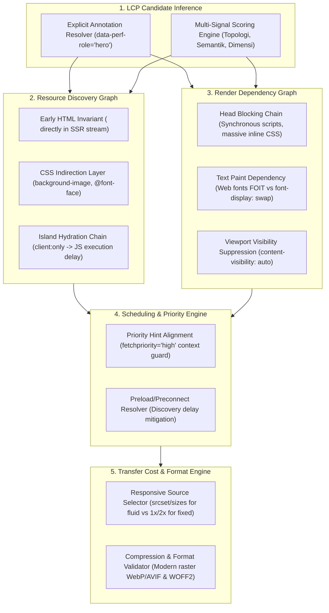

# EXPANSION-BATCH-10: Core Web Vitals - Largest Contentful Paint (LCP) Standards (`lcp.*`)
> **Kode Dokumen:** `SPEC-EXP-10-LCP`
> **Kategori:** `lcp` (Core Web Vitals & Perceptual Loading Speed)
> **Pilar:** `01-SPEC` (WHAT - Spesifikasi Perilaku & Kontrak Rule)
> **Status:** Calibrated & Peer-Reviewed Expansion Specification (16 Aturan Terkurasi: 4 Wave × 4 Aturan)
> **Kalibrasi Desain:** Multi-Surface Resource Discovery Graph & AST Candidate Inference Engine
> **Migrasi Sumber:** [`charites-legacy/lcp-checker.ts`](file:///home/will/Monorepo/charites/charites-legacy/lcp-checker.ts)
> **Standar Rujukan:**
> - W3C Web Performance Working Group: Largest Contentful Paint (LCP) Metric Specification
> - Google Core Web Vitals Guidelines (Target LCP $\le 2.5\text{s}$ pada persentil ke-75 sesi pengguna)
> - W3C Resource Timing Level 2 & Browser Speculative Preload Scanner Mechanics
> - W3C HTML Living Standard: Priority Hints (`fetchpriority="high"`) & Lazy Loading (`loading="eager"`)
> - W3C CSS Fonts Module Level 4 (Font Preloading, FOIT/FOUT Mitigation, WOFF2 Compression & Progressive Fallbacks)
> - W3C CSS Containment Module Level 2 (`content-visibility: auto` & `contain-intrinsic-size` on Viewport Regions)
> - Astro Architecture: Zero-JS Server-Side Rendering (SSR) & Partial Hydration Directives (`client:load` vs `client:only`)
> **Pilar Terkait:** [01-SPEC: cls.md](cls.md), [01-SPEC: inp.md](inp.md), [01-SPEC: responsive.md](responsive.md), & [01-SPEC: themes.md](themes.md)

---

## 1. Epistemologi Analisis Statis vs Runtime & Identifikasi Kandidat LCP

Kategori `lcp` Charites mentransformasikan skrip warisan [`charites-legacy/lcp-checker.ts`](file:///home/will/Monorepo/charites/charites-legacy/lcp-checker.ts) ke dalam arsitektur static analyzer murni Go 1.26+ berkinerja tinggi (`0 B/op, 0 allocs/op` pada clean node).

### 1.1. Hakikat Runtime LCP vs Batasan Bukti Statis AST
Largest Contentful Paint (LCP) adalah **metrik runtime yang diukur langsung oleh browser** untuk mencatat waktu render elemen visual terbesar yang terlihat di area pandang (*viewport*) pengguna:

$$\text{LCP} = \text{TTFB} + \text{Resource Load Delay} + \text{Resource Load Duration} + \text{Element Render Delay}$$

- **Target Kinerja Web Vitals:** $\text{LCP} \le 2.5\text{s}$ (Good), $2.5\text{s} - 4.0\text{s}$ (Needs Improvement), $> 4.0\text{s}$ (Poor).

Sebuah parser AST statis **tidak dapat dan tidak pernah berniat menjadi *final judge of performance***. Pengukuran waktu render LCP aktual hanya dapat diputuskan secara definitif oleh web browser preview langsung (Chromium, WebKit, Gecko) yang memuat berkas nyata melalui jaringan riil, merasterisasi piksel ke layar perangkat, dan mengidentifikasi elemen terbesar berdasarkan ukuran fisik piksel terender (*rendered pixel area*).

Secara konkret, sebuah parser AST statis:
1. **Tidak Mengetahui Elemen Mana yang Secara Fisik Terbesar di Layar Pengguna**: Elemen LCP bervariasi secara dinamis tergantung pada orientasi dan lebar layar perangkat (misal: gambar hero di desktop vs judul teks `<h1>` di layar sempit ponsel).
2. **Tidak Mengukur Latensi Jaringan Nyata (TTFB)**: Tidak dapat memprediksi latensi koneksi seluler 3G/4G/5G, waktu respon server backend, atau *cache hit ratio* CDN.
3. **Tidak Mengetahui Waktu Dekompresi Berkas Nyata**: Tidak dapat mengetahui durasi decoding gambar GPU atau waktu kompilasi JavaScript pada prosesor perangkat pengguna.

### 1.2. Prinsip Shift-Left: Detektor Pola Penulisan, Bukan Final Judge Performa

> [!IMPORTANT]
> **Charites Adalah Detektor Pola Penulisan (*Static Pattern Detector*), Bukan Final Judge Performa Browser**
> - **Peran Charites (Shift-Left Gatekeeper):** Bekerja di level kode sumber (editor, git hook, CI) dalam hitungan milidetik untuk mendeteksi **kebiasaan/pola penulisan kode yang secara struktural menunda penemuan dan perenderan aset utama** (misalnya: memasang `loading="lazy"` pada gambar kandidat LCP, menyembunyikan gambar utama di CSS `background-image` tanpa preload, memblokir parser via script sinkron di `<head>`, atau membungkus konten utama dalam `client:only` tanpa SSR fallback) sebelum kode mencapai browser.
> - **Peran Web Browser Langsung (The Final Judge):** Pengujian visual langsung di browser, panel Performance Chrome DevTools, Lighthouse CI, dan data CrUX/RUM pada pengguna riil adalah **satu-satunya pengambil keputusan final performa LCP**. Analisis AST Charites jelas kalah jauh dalam hal observasi runtime dibandingkan browser langsung, sehingga Charites membatasi klaimnya hanya sebagai *"Static Evidence of Resource Load Delay / Render Delay Risk"*.

### 1.3. Solusi Blind Spot: Inferensi Kandidat LCP & Standar Anotasi Eksplisit

Salah satu tantangan paling fundamental static analyzer LCP adalah: *"Bagaimana AST tahu elemen mana yang akan menjadi kandidat LCP?"*

Charites menyelesaikan ambiguitas ini melalui pendekatan dua jalur (**Two-Tier Candidate Identification**):

```
                      Identifikasi Kandidat LCP Charites
                                     │
         ┌───────────────────────────┴───────────────────────────┐
         ↓                                                       ↓
  Jalur 1: Anotasi Eksplisit (SSOT)               Jalur 2: Multi-Signal Scoring Engine
  data-perf-role="hero|critical"                  Skor akumulatif berdasarkan sinyal AST:
  data-lcp-candidate="true"                       • Topologi DOM (posisi awal dokumen)
  Komponen khusus: <HeroMedia />                  • Semantik kontainer (<header>, hero, banner)
  Confidence: PROVEN                              • Dimensi statis (w-full, width >= 600)
                                                  • Teks LCP: Judul primer <h1> di <main>
                                                  Confidence: LIKELY / POSSIBLE
```

#### Jalur 1: Standar Anotasi Eksplisit (100% Deterministic)
Pengembang dapat memberikan kontrak semantik eksplisit pada komponen atau markup:
- Atribut HTML/JSX: `data-perf-role="hero"` atau `data-lcp-candidate="true"`.
- Penggunaan komponen khusus desain sistem: `<HeroMedia />`, `<HeroBanner />`.
Jika anotasi ini hadir, mesin Charites mengklasifikasikan elemen sebagai **Definite LCP Candidate** (`Confidence: PROVEN`).

#### Jalur 2: Multi-Signal Candidate Scoring Engine (Heuristik Terkalibrasi)
Jika tidak ada anotasi eksplisit, Charites menghitung **LCP Candidate Score ($S_{\text{lcp}}$)** untuk setiap elemen media (``, `<picture>`, `<svg>`, `<video poster>`) dan teks primer (`<h1>`):

| Sinyal AST | Bobot Poin | Kriteria Evaluasi |
| :--- | :---: | :--- |
| **Topologi Alur Dokumen** | $+35$ | Elemen media pertama hingga ketiga yang dideklarasikan di dalam alur body dokumen (di luar dialog/modal tersembunyi). |
| **Kontainer Semantik** | $+25$ | Terletak di dalam simpul `<header>`, `<section role="banner">`, atau elemen dengan ID/kelas semantik (`hero`, `banner`, `masthead`). |
| **Dimensi Geometris Statis** | $+20$ | Memiliki atribut `width >= 600` atau utilitas Tailwind lebar penuh/responsif (`w-full`, `max-w-*`, `aspect-video`, `aspect-[16/9]`). |
| **Integrasi Komponen Optimasi** | $+15$ | Menggunakan komponen `<Image />` atau `<Picture />` dari modul `astro:assets` pada halaman tingkat atas (*page template*). |
| **Teks Judul Primer (Text LCP)** | $+30$ | Tag `<h1>` pertama di dalam elemen `<main>` atau `<header>` yang dirender pada initial viewport. |
| **Penalti Elemen Tersembunyi** | $-50$ | Elemen di dalam footer (`<footer>`), modal (`role="dialog"`), carousel slide non-aktif, atau memiliki kelas tersembunyi (`hidden`, `invisible`). |

**Aturan Evaluasi Ambang Batas:**
- $S_{\text{lcp}} \ge 60$: Elemen diklasifikasikan sebagai **High-Confidence LCP Candidate** (`Confidence: LIKELY`). Aturan preskriptif Wave 1-2 aktif penuh.
- $35 \le S_{\text{lcp}} < 60$: Elemen diklasifikasikan sebagai **Potential LCP Candidate** (`Confidence: POSSIBLE`). Aturan diturunkan (*auto-downgraded*) menjadi severity `info` (advisory).
- $S_{\text{lcp}} < 35$: Elemen diabaikan dari audit LCP (mencegah false-positive pada thumbnail kecil, avatar, dan ikon).

### 1.4. Standar Narasi Diagnostik: Formula 3-Lapisan
Format pesan diagnostik terpadu Charites mengikuti rumus 3-lapisan bebas klaim absolut:
$$\text{Pesan Diagnostik} = \text{[Bukti Statis AST]} + \text{[Potensi Risiko LCP]} + \text{[Saran Remediasi]}$$

-  *Dilarang:* `"LCP halaman ini jelek/lambat karena gambar ini!"`
-  *Wajib:* `"Elemen  di dalam kontainer hero terdeteksi memiliki atribut loading='lazy'; pola penulisan ini berpotensi menunda penemuan aset oleh browser preload scanner dan menaikkan Resource Load Delay LCP. Saran: hapus atribut loading='lazy' atau ubah menjadi loading='eager'."`

---

## 2. Arsitektur 5-Primitive LCP Engine & Unfair Advantage

Menghadapi tumpukan modern Astro + React Islands + Tailwind CSS v4, Charites mengoperasikan **5 Primitive Engines** terpadu:



### 2.1. The AST Parser Unfair Advantage: Mengapa Linter Konvensional Gagal

| Dimensi Evaluasi | Linter Konvensional (ESLint, Stylelint, HTMLHint) | Charites Multi-Surface AST Engine | Unfair Advantage Charites |
| :--- | :--- | :--- | :--- |
| **Korelasi Gambar Hero & Wilayah Above-the-Fold** | ESLint mengevaluasi tag `` secara terisolasi tanpa mengetahui apakah gambar berada di hero atau footer. Seringkali merekomendasikan `loading="lazy"` secara serampangan. | Menjalankan Multi-Signal Candidate Scoring untuk mengidentifikasi kandidat LCP secara selektif. | Mencegah lazy-loading hanya pada kandidat LCP kritis, sembari tetap membiarkan gambar di bawah pelipatan (*below-fold*) di-lazy-load. |
| **Pendeteksian Gambar di CSS vs HTML Preload Scanner** | Stylelint hanya membaca sintaksis CSS tanpa konteks komponen; ESLint tidak dapat membaca CSS. | Menghubungkan markup komponen hero dengan kelas Tailwind v4 (`bg-[url(...)]`) dan inline style background. | Mengidentifikasi gambar hero yang tersembunyi dari *speculative preload scanner* dan memverifikasi keberadaan preload hint di `<head>`. |
| **Korelasi `<head>` Layout dengan Konten Halaman** | Terisolasi per berkas: ESLint JSX tidak bisa memeriksa tag `<head>` layout Astro; Stylelint tidak bisa membaca markup. | Menghubungkan aset kandidat LCP di template halaman dengan deklarasi `<link rel="preload">` / `preconnect` di layout `<head>`. | Memastikan aset yang mengalami *delayed discovery* (seperti CSS background atau font eksternal) telah di-pre-warm sedini mungkin di tingkat dokumen. |
| **Pencegahan Pemintasan SSR pada Konten Kritis** | ESLint tidak memahami direktif hidrasi compiler Astro `client:only`. | Memeriksa apakah kandidat LCP dibungkus dalam direktif pemintas SSR total tanpa fallback slot. | Menangkap anti-pola di mana elemen LCP absen dari HTML awal server, menunda penemuan aset hingga JS selesai diunduh dan dieksekusi. |
| **Integritas Standar W3C CORS Font Preload** | Linter HTML umum tidak memahami aturan CORS font W3C. | Memverifikasi keberadaan atribut `crossorigin` pada `<link rel="preload" as="font">`. | Mencegah unduhan ganda font yang memboroskan kuota dan memperlambat LCP pada perangkat seluler. |
| **Performa Eksekusi Mesin** | Lambat dan boros memori pada proyek monorepo besar karena ketergantungan pada runtime Node.js. | Arsitektur Leaf IR murni Go 1.26+ berkecepatan native (`0 B/op, 0 allocs/op` pada clean node). | Memindai ribuan template Astro, komponen JSX, dan stylesheet Tailwind v4 dalam hitungan milidetik. |

---

## 3. Matriks Non-Redundansi & Precedensi

Untuk menjamin **100% pemisahan tanggung jawab (*Separation of Concerns*) dan 0% tumpang-tindih (Zero Redundancy)**, Charites menerapkan pembuktian dua lapis:
1. **Matriks Ortogonalitas Lintas Kategori** (memasangkan dengan kandidat aturan terdekat yang nyata, bukan aturan yang tidak berhubungan).
2. **Matriks Redundansi & Precedensi Intra-Kategori ($N \times N$)** (menjamin tidak ada konflik atau *noisy duplicate findings* di dalam `lcp.*` sendiri).

### 3.1. Matriks Ortogonalitas Lintas Kategori (Genuine Nearest Neighbors)

| Rule `lcp.*` | Rule Kategori Lain Terdekat | Fokus Domain Kategori Lain | Fokus Domain Kategori `lcp` | Garansi Batasan Ortogonal (*Zero Redundancy Guarantee*) |
|---|---|---|---|---|
| `lcp.lazy-loaded-lcp-image` | `cls.unsized-image` | Memastikan reservasi dimensi kotak render (`width`/`height`/`aspect-*`) untuk mencegah pergeseran tata letak kumulatif. | Mencegah atribut `loading="lazy"` pada gambar kandidat LCP yang menunda inisiasi pengunduhan berkas hingga fase layout selesai. | `cls` mengaudit stabilitas koordinat vertikal ($Y$-shift); `lcp` mengaudit waktu awal penemuan aset (*Resource Load Delay*). |
| `lcp.unhinted-lcp-image-priority` | `cls.dynamic-content-without-reserved-space` | Mengaudit ketiadaan skeleton loader pada konten dinamis untuk mencegah lonjakan layout saat data selesai dimuat. | Mengaudit ketiadaan petunjuk prioritas `fetchpriority="high"` pada gambar kandidat LCP utama yang telah hadir di HTML awal. | `cls` mengaudit stabilitas pergeseran ruang render; `lcp` mengaudit antrean prioritas alokasi bandwidth jaringan browser. |
| `lcp.undiscoverable-lcp-image` | `theme.gradient-hardcode` | Mengaudit kepatuhan penggunaan token warna desain Tailwind/CSS. | Mengaudit penggunaan CSS `background-image` untuk aset LCP kritis tanpa adanya preload pendamping di `<head>`. | `theme` mengaudit keselarasan token desain visual; `lcp` mengaudit visibilitas aset terhadap browser speculative preload scanner. |
| `lcp.missing-lcp-image-preload` | `cls.client-only-hydration-pop` | Mengaudit lonjakan pergeseran layout saat pulau interaktif dihidrasi tanpa adanya slot reservasi geometris. | Menganjurkan `<link rel="preload" as="image">` di `<head>` untuk gambar LCP yang penemuannya tertunda (via CSS/JS). | `cls` mengaudit stabilitas geometris tata letak; `lcp` mengaudit percepatan inisiasi fetch untuk aset dengan jalur penemuan tidak langsung. |
| `lcp.oversized-lcp-resource-selection` | `responsive.image-overflow` | Memastikan gambar tidak meluap melebihi lebar kontainer horizontal ponsel (`max-w-full`). | Memastikan gambar hero fluida menyertakan atribut `srcset` dan `sizes` agar ponsel tidak mengunduh resolusi desktop raksasa. | `responsive` mengaudit batasan fisik overflow layar ponsel; `lcp` mengaudit ukuran byte transfer jaringan (*Resource Load Duration*). |
| `lcp.heavy-raster-lcp-asset` | `theme.image-theme-hardcode` | Memastikan gambar tema gelap dan terang dipasangkan secara konsisten sesuai token tema. | Mengaudit pemakaian format raster mentah tak terkompresi tanpa varian modern WebP/AVIF pada kandidat LCP berukuran besar. | `theme` mengaudit keselarasan mode warna visual; `lcp` mengaudit rasio kompresi byte transfer data aset LCP. |
| `lcp.image-source-density-mismatch` | `responsive.aspect-ratio-overflow` | Memastikan rasio aspek media tidak memicu distorsi atau pemotongan konten visual di layar sempit. | Memastikan deklarasi densitas piksel (`1x, 2x`) pada gambar berukuran tetap tidak menyebabkan overfetching resolusi berlebih di layar ponsel. | `responsive` mengaudit keterpotongan konten visual; `lcp` mengaudit efisiensi resolusi yang dipilih browser engine. |
| `lcp.client-only-lcp-content` | `cls.client-only-hydration-pop` | Mencegah kekosongan ruang geometris layout akibat pemintasan SSR total tanpa fallback slot. | Mencegah penempatan kandidat LCP di pulau Astro `client:only` yang menunda penemuan aset hingga bundler JS selesai dieksekusi. | `cls` mengaudit lonjakan pergeseran fisik tata letak; `lcp` mengaudit keterlambatan awal penemuan sumber daya (*Resource Load Delay*). |
| `lcp.blocked-critical-font` | `cls.font-display-missing` | Memastikan deklarasi `@font-face` memiliki strategi swap (`swap`, `optional`) untuk mencegah reflow pergeseran teks (FOUT). | Mengaudit ketergantungan teks LCP (judul `<h1>`) pada web font eksternal yang memblokir perenderan teks terlihat (*Invisible Text / FOIT*). | `cls` mengaudit pergeseran letak huruf saat font swap; `lcp` mengaudit durasi teks tidak terlihat (*invisible text period*) pada teks LCP. |
| `lcp.external-font-discovery-delay` | `cls.font-import-late-discovery` | Mendeteksi CSS `@import` font eksternal yang memicu air terjun pemblokir render cascade di dalam berkas CSS. | Memastikan stylesheet font eksternal di `<head>` didahului oleh `<link rel="preconnect">` untuk mengeliminasi multi-roundtrip DNS+TLS. | `cls` mengaudit struktur dependensi di dalam CSS; `lcp` mengaudit optimasi latensi jabat tangan jaringan (*network handshake*). |
| `lcp.preload-font-cors-mismatch` | `browser.unknown-feature-policy` | Mengaudit kevalidan sintaksis direktif header izin fitur peramban. | Menegakkan kepatuhan standar W3C bahwa preload berkas font (`as="font"`) wajib menyertakan atribut `crossorigin`. | `browser` mengaudit kapabilitas fitur browser; `lcp` mengaudit eliminasi pemborosan bandwidth pengunduhan aset font duplikat. |
| `lcp.legacy-critical-font-resource` | `cls.unadjusted-font-metric` | Menganjurkan deskriptor penyesuaian metrik font fallback sistem (`size-adjust`). | Mengaudit ketiadaan format modern WOFF2 pada deklarasi font kritis, memastikan browser modern mendapat prioritas kompresi Brotli. | `cls` mengaudit disparitas geometri bounding box huruf; `lcp` mengaudit bobot byte berkas font web yang ditransfer. |
| `lcp.render-blocking-head-script` | `inp.waterfall-script-load` (atau `inp.render-blocking-script`) | Mengaudit script sinkron yang menunda kesiapan main thread menerima klik/input pengguna (*Input Readiness Delay*). | Mengaudit script eksternal sinkron di `<head>` yang menghentikan parser HTML dan menunda First Paint elemen LCP (*Element Render Delay*). | `inp` mengaudit responsivitas antrean interaksi input pengguna; `lcp` mengaudit waktu penyelesaian proses penggambaran awal elemen. |
| `lcp.critical-head-style-bloat` | `theme.apply-bloat` | Mengaudit duplikasi utilitas kelas berlebih akibat penggunaan `@apply` di dalam CSS. | Mengaudit blok `<style>` inline monolitik di `<head>` yang memuat aturan non-kritis dan menunda parsing HTML awal. | `theme` mengaudit kebersihan struktur styling CSS; `lcp` mengaudit ukuran muatan payload HTML kritis pemblokir render awal. |
| `lcp.missing-critical-origin-hint` | `browser.hover-only-interaction` | Mengaudit ketersediaan alternatif interaksi non-hover untuk layar sentuh. | Memastikan domain pihak ketiga tempat aset LCP di-hosting memiliki `<link rel="preconnect">` (atau `dns-prefetch`). | `browser` mengaudit kompatibilitas input fisik; `lcp` mengaudit pre-resolving jabat tangan jaringan aset eksternal. |
| `lcp.lcp-content-visibility-suppression` | `responsive.desktop-only-content` | Mengaudit penyembunyian konten esensial pada tampilan layar seluler. | Mencegah penggunaan CSS `content-visibility: auto` pada area kandidat LCP pelipatan atas yang menyebabkan browser melewatkan render LCP. | `responsive` mengaudit paritas konten antar breakpoint layar; `lcp` mengaudit instruksi browser engine untuk perenderan awal viewport. |

### 3.2. Matriks Redundansi & Precedensi Intra-Kategori ($N \times N$)

Tabel ini menjamin bahwa antar aturan di dalam `lcp.*` tidak saling bertentangan atau menghasilkan temuan duplikat yang membingungkan:

```text
┌───────────────────────────────────────┬───────────────────────────────────────┬────────────────────────────────────────────────────────┐
│ Pasangan Aturan Intra-Kategori        │ Potensi Konflik / Redundansi          │ Resolusi Precedensi & Kebijakan Dedup                  │
├───────────────────────────────────────┼───────────────────────────────────────┼────────────────────────────────────────────────────────┤
│ lcp.lazy-loaded-lcp-image             │ Kontradiksi semantik: gambar diberi   │ PRECEDENCE 1: lazy-loaded-lcp-image wajib diproses     │
│ vs lcp.unhinted-lcp-image-priority    │ loading="lazy" sekaligus fetchpriority│ terlebih dahulu. Autofix DILARANG menambahkan          │
│                                       │ ="high" (anti-pola yang diperingatkan │ fetchpriority="high" jika loading="lazy" masih aktif.  │
│                                       │ oleh Chromium DevTools).              │ Keduanya diselesaikan secara transaksi sekuensial.     │
├───────────────────────────────────────┼───────────────────────────────────────┼────────────────────────────────────────────────────────┤
│ lcp.unhinted-lcp-image-priority       │ Persaingan strategi: gambar HTML awal │ MUTUALLY CONDITIONAL: Jika gambar sudah berupa elemen  │
│ vs lcp.missing-lcp-image-preload      │ sudah ada di body dengan prioritas,   │  awal di HTML, preload di <head> TIDAK WAJIB.     │
│                                       │ apakah masih butuh preload di <head>? │ Rule preload HANYA aktif bila gambar mengalami delayed │
│                                       │                                       │ discovery (misal: CSS background atau dinamis via JS). │
├───────────────────────────────────────┼───────────────────────────────────────┼────────────────────────────────────────────────────────┤
│ lcp.oversized-lcp-resource-selection  │ Konflik sintaksis srcset: fluid width │ SCOPE SEPARATION: oversized-resource-selection HANYA   │
│ vs lcp.image-source-density-mismatch  │ descriptors (400w + sizes) vs fixed   │ berlaku untuk elemen fluida responsif (w-full/auto).    │
│                                       │ density descriptors (1x, 2x).         │ density-mismatch HANYA berlaku untuk elemen berdimensi │
│                                       │                                       │ tetap (fixed-width/height, misal logo atau avatar).    │
├───────────────────────────────────────┼───────────────────────────────────────┼────────────────────────────────────────────────────────┤
│ lcp.blocked-critical-font             │ Noisy cascade findings pada tag font  │ PRECEDENCE CASCADE:                                    │
│ vs lcp.external-font-discovery-delay  │ yang hilang atau tidak lengkap di     │ 1. Evaluasi keberadaan sumber font (blocked-font).      │
│ vs lcp.preload-font-cors-mismatch     │ dalam layout <head>.                  │ 2. Jika tag <link rel="preload"> font ada, audit       │
│ vs lcp.legacy-critical-font-resource  │                                       │    atribut crossorigin (preload-font-cors-mismatch).   │
│                                       │                                       │ 3. Jika font eksternal via stylesheet, audit preconnect│
│                                       │                                       │    (external-font-discovery-delay). JANGAN laporkan    │
│                                       │                                       │    semuanya sekaligus jika akar masalahnya 1 link.     │
├───────────────────────────────────────┼───────────────────────────────────────┼────────────────────────────────────────────────────────┤
│ lcp.render-blocking-head-script       │ Satu simpul AST (<script src>)        │ UNIFIED REPORTING DEDUP: Engine Charites mendeteksi    │
│ vs inp.waterfall-script-load          │ memicu dua warning metrik berbeda     │ simpul yang sama, namun melaporkannya sebagai SATU     │
│                                       │ (LCP: render delay, INP: input delay).│ finding terpadu dengan label tag: [LCP][INP].          │
└───────────────────────────────────────┴───────────────────────────────────────┴────────────────────────────────────────────────────────┘
```

---

## 4. Ringkasan Matriks 16 Rule `lcp.*` (4 Wave Terkalibrasi)

| Wave | Rule ID | Legacy Ref | Domain Parser | Tier | Confidence | Severity | Kelayakan Autofix |
| :---: | :--- | :--- | :---: | :---: | :---: | :---: | :---: |
| **W1** | `lcp.lazy-loaded-lcp-image` | R1 | JSX/Astro AST + Candidate Score | T1 | `PROVEN` | `error` | **Tinggi** (hapus `loading="lazy"` atau ubah ke `eager`) |
| **W1** | `lcp.unhinted-lcp-image-priority` | R2 | JSX/Astro AST + Candidate Score | T1 | `LIKELY` | `warning` | **Tinggi** (sisipkan atribut `fetchpriority="high"`) |
| **W1** | `lcp.undiscoverable-lcp-image` | R3 | JSX/Astro + CSS/TW4 Resolver | T2 | `LIKELY` | `warning` | Menengah (sarankan konversi ke `` atau injeksi preload) |
| **W1** | `lcp.missing-lcp-image-preload` | Baru | Astro Layout + JSX AST Graph | T2 | `POSSIBLE` | `info` | Menengah (sarankan `<link rel="preload">` di `<head>`) |
| **W2** | `lcp.oversized-lcp-resource-selection` | R6 | JSX/Astro AST + Candidate Score | T1 | `LIKELY` | `warning` | Menengah (sarankan pemakaian `srcset`/`sizes` atau `<Image />`) |
| **W2** | `lcp.heavy-raster-lcp-asset` | Baru | JSX/Astro AST + Asset Metadata | T2 | `LIKELY` | `warning` | Menengah (sarankan konversi ke format WebP/AVIF) |
| **W2** | `lcp.image-source-density-mismatch` | Baru | JSX/Astro AST (Fixed Dimensions) | T2 | `POSSIBLE` | `info` | Menengah (sarankan penyelarasan densitas `1x, 2x`) |
| **W2** | `lcp.client-only-lcp-content` | R7 | Astro Compiler AST | T1 | `LIKELY` | `warning` | Menengah (sarankan migrasi ke SSR statis atau `client:load`) |
| **W3** | `lcp.blocked-critical-font` | R5 | CSS AST (PostCSS) + Astro Graph | T1 | `PROVEN` | `warning` | **Tinggi** (tambahkan `font-display: swap;`) |
| **W3** | `lcp.external-font-discovery-delay` | Baru | Astro HTML Graph | T2 | `LIKELY` | `warning` | **Tinggi** (sisipkan `<link rel="preconnect">` untuk domain CDN font) |
| **W3** | `lcp.preload-font-cors-mismatch` | Baru | Astro HTML Graph | T1 | `PROVEN` | `error` | **Tinggi** (tambahkan atribut `crossorigin` pada preload font) |
| **W3** | `lcp.legacy-critical-font-resource` | Baru | CSS AST (PostCSS) | T2 | `LIKELY` | `warning` | Menengah (pastikan WOFF2 menjadi format utama di `@font-face`) |
| **W4** | `lcp.render-blocking-head-script` | R4 | Astro HTML Graph | T1 | `PROVEN` | `warning` | **Tinggi** (tambahkan atribut `defer` pada script inline mentah) |
| **W4** | `lcp.critical-head-style-bloat` | Baru | Astro HTML Graph + CSS AST | T2 | `LIKELY` | `warning` | Rendah (sarankan pemisahan CSS non-kritis ke berkas eksternal) |
| **W4** | `lcp.missing-critical-origin-hint` | Baru | Astro HTML Graph | T2 | `POSSIBLE` | `info` | **Tinggi** (sisipkan `<link rel="preconnect">` untuk origin aset) |
| **W4** | `lcp.lcp-content-visibility-suppression`| Baru | JSX/Astro + CSS/TW4 Resolver | T1 | `PROVEN` | `error` | **Tinggi** (hapus utilitas `content-auto` dari seksi hero atas) |

---

## 5. Spesifikasi Detail & Kontrak Formal 16 Rule `lcp.*`

### 5.1. `lcp.lazy-loaded-lcp-image` (Wave 1 - Migrasi Legacy R1)
- **Sumber Legacy:** `charites-legacy/lcp-checker.ts` (Rule R1: `no-lazy-lcp`).
- **Domain Parser:** React JSX/TSX AST + Astro Template AST + LCP Candidate Scoring ($S_{\text{lcp}} \ge 60$).
- **Tier / Severity:** Tier 1 (Deterministic Hero Media Attribute) / `error`.
- **Formal Contract:**
  - **Subject:** Elemen media (``, `<picture>`, `<Image>`) yang teridentifikasi sebagai kandidat LCP pelipatan atas via anotasi `data-perf-role="hero"` atau skor $S_{\text{lcp}} \ge 60$.
  - **Evidence:** Elemen menyertakan atribut `loading="lazy"`.
  - **Predicate:** Elemen gambar kandidat LCP **dilarang menyertakan atribut `loading="lazy"`**, karena browser menunda inisiasi pengunduhan gambar sampai fase layout selesai dan elemen dipastikan berada di dalam/dekat viewport.
  - **Confidence:** `PROVEN` (keberadaan atribut lazy pada kandidat LCP terbukti deterministik).
  - **Exceptions:** Elemen di bawah pelipatan (*below-fold*), elemen di dalam dialog/modal tersembunyi, atau elemen dengan anotasi eksplisit `data-lcp-ignore`.
- **AST Parser Unfair Advantage vs Linter Konvensional:**
  Linter konvensional (ESLint / HTMLHint) sering kali menyarankan penambahan atribut `loading="lazy"` pada semua tag `` secara membabi-buta demi skor best-practice. Linter biasa tidak memahami geometri viewport maupun posisi elemen. Charites menggunakan algoritma LCP Candidate Scoring ($S_{\text{lcp}} \ge 60$) pada AST markup untuk mengenali elemen gambar hero di atas pelipatan layar, menangkap bahwa `loading="lazy"` pada elemen hero justru menunda inisiasi pengunduhan aset hingga fase layouting selesai.
- **AST Parser Unfair Advantage vs Linter Konvensional:**
  Linter HTML/JSX standar menganggap tag `` tanpa atribut `fetchpriority` sebagai kode yang 100% normal dan valid. Linter tidak memiliki konsep urutan alokasi bandwidth browser. Charites mendeteksi simpul gambar kandidat LCP di dalam aliran HTML awal dan memverifikasi kehadiran `fetchpriority="high"`, yang sangat krusial untuk menginstruksikan browser preload scanner agar segera mengalokasikan prioritas unduhan tertinggi sebelum berkas skrip dan stylesheet non-kritis lainnya.
- **AST Parser Unfair Advantage vs Linter Konvensional:**
  Bagi Stylelint dan ESLint, mendeklarasikan gambar latar melalui CSS `background-image: url(...)` atau utilitas Tailwind `bg-[url(...)]` adalah pola styling yang sepenuhnya sah dan wajar. Charites melakukan korelasi multi-permukaan antara kelas utilitas CSS dengan `<head>` layout dokumen. Charites mendeteksi bahwa gambar utama disembunyikan di dalam CSS tanpa tag `<link rel="preload">` di `<head>`, sehingga browser speculative preload scanner mengalami kebutaan dan tidak dapat menemukan URL gambar hingga seluruh cascade CSS selesai diunduh dan di-parse.
- **AST Parser Unfair Advantage vs Linter Konvensional:**
  Linter berkas tunggal (single-file visitor) mengevaluasi tag markup dalam isolasi lokal tanpa memeriksa keterkaitan dengan `<head>` dokumen. Charites membangun Graf Tata Letak Dokumen (*Document Layout Graph*), mendeteksi bahwa aset gambar kandidat LCP mengalami keterlambatan penemuan (*resource load delay*) dan membutuhkan injeksi deklaratif `<link rel="preload" as="image">` di `<head>` untuk memangkas waktu mulai unduhan (*Time to First Byte* aset).
- **AST Parser Unfair Advantage vs Linter Konvensional:**
  Menulis tag `` lolos dari seluruh linter HTML dan JSX konvensional tanpa peringatan apa pun. Charites mengevaluasi dimensi kotak render terhadap resolusi aset; untuk gambar hero fluida lebar penuh, Charites mewajibkan kehadiran atribut responsif `srcset` dan `sizes`, mencegah peramban pada layar ponsel beresolusi sempit mengunduh aset 4K yang memboroskan kuota jaringan dan memperlambat LCP.
- **AST Parser Unfair Advantage vs Linter Konvensional:**
  Linter standar tidak pernah menginspeksi tipe MIME atau ekstensi kompresi berkas pada atribut `src`. Charites menginspeksi metadata dan ekstensi berkas aset gambar kandidat LCP, menandai penggunaan format raster mentah tak terkompresi (PNG atau JPEG berukuran besar) yang melewatkan format modern efisien seperti WebP/AVIF atau pipeline kompresi bawaan Astro (`astro:assets`).
- **AST Parser Unfair Advantage vs Linter Konvensional:**
  Penulisan `srcset="hero-1x.jpg 1x, hero-2x.jpg 2x"` adalah sintaksis HTML yang sepenuhnya valid dan lolos validator HTML. Charites mengorelasikan deskriptor densitas piksel terhadap dimensi fisik render elemen (`w-* h-*` atau atribut `width/height`), mendeteksi inkonsistensi rasio render yang memicu peramban mengunduh aset berdimensi salah yang memperlambat waktu muat LCP.
- **AST Parser Unfair Advantage vs Linter Konvensional:**
  Direktif Astro `client:only` adalah fitur resmi bawaan framework. Linter konvensional tidak peduli apakah komponen yang dibungkus memuat konten LCP atau tidak. Charites menginspeksi pohon template Astro, mendeteksi jika kandidat elemen LCP pelipatan atas dibungkus dalam `client:only` tanpa SSR markup. Hal ini menyebabkan elemen hero absen total dari dokumen HTML awal kiriman server, memaksa peramban menunggu kompilasi dan eksekusi bundel JavaScript klien sebelum LCP bisa dirender.
- **AST Parser Unfair Advantage vs Linter Konvensional:**
  Deklarasi `@font-face` tanpa deskriptor `font-display` adalah CSS yang sah menurut Stylelint (nilai default browser adalah `auto`). Charites menghubungkan deklarasi font dalam CSS ke simpul teks judul LCP utama di markup HTML/JSX, mendeteksi bahwa ketiadaan strategi `font-display: swap` atau `optional` memicu Flash of Invisible Text (FOIT) yang menyembunyikan teks judul selama 3 detik saat font web sedang diunduh.
- **AST Parser Unfair Advantage vs Linter Konvensional:**
  Menyisipkan stylesheet font pihak ketiga (seperti Google Fonts) via tag `<link rel="stylesheet">` dianggap sebagai praktik standar oleh linter HTML. Charites memeriksa hierarki `<head>` dokumen dan menandai ketiadaan tag pendahulu `<link rel="preconnect">` ke domain CDN stylesheet (`fonts.googleapis.com`) dan origin biner font (`fonts.gstatic.com`), mendeteksi keterlambatan akibat negosiasi jabat tangan DNS, TCP, dan TLS ganda di jalur kritis rendering font.
- **AST Parser Unfair Advantage vs Linter Konvensional:**
  Tag `<link rel="preload" as="font" href="...">` tanpa atribut `crossorigin` tampak lengkap dan benar bagi linter HTML biasa. Charites memahami spesifikasi W3C Fetch bahwa permintaan web font diwajibkan menggunakan mode anonim CORS. Ketiadaan atribut `crossorigin` membuat browser mengabaikan aset yang sudah diunduh via preload dan melakukan fetch ulang dari awal, memicu pengunduhan font ganda yang menggandakan waktu tunggu LCP.
- **AST Parser Unfair Advantage vs Linter Konvensional:**
  Deklarasi font format `truetype` atau `opentype` lolos validator CSS standar karena masih didukung oleh browser. Charites menginspeksi urutan deklarasi `src` pada `@font-face` font kritis, memastikan format terkompresi modern Brotli WOFF2 berada di posisi prioritas pertama untuk menghemat ukuran transfer berkas biner font hingga 30-50%.
- **AST Parser Unfair Advantage vs Linter Konvensional:**
  Tag `<script src="...">` di dalam `<head>` adalah kode HTML5 yang sah dan tidak pernah dianggap error oleh linter standar. Charites menganalisis atribut tag skrip di dalam `<head>`, mendeteksi skrip eksternal sinkron tanpa atribut `defer`, `async`, atau `type="module"` yang secara fatal menghentikan parser HTML di tengah jalan dan menunda eksekusi rendering elemen LCP.
- **AST Parser Unfair Advantage vs Linter Konvensional:**
  Menaruh blok `<style>` inline di dalam `<head>` layout adalah pola yang sah bagi linter HTML. Charites mengukur volume token CSS inline dan memetakan selektornya, mendeteksi keberadaan aturan styling untuk komponen non-kritis (seperti modal, dropdown, atau footer) yang memperbesar ukuran payload dokumen HTML awal dan menunda First Paint seluruh halaman.
- **AST Parser Unfair Advantage vs Linter Konvensional:**
  Menentukan atribut gambar `src="https://cdn.example.com/hero.webp"` lolos semua validator URL linter biasa. Charites mengidentifikasi origin pihak ketiga pada aset kandidat LCP dan memverifikasi keberadaan petunjuk koneksi awal (`preconnect` atau `dns-prefetch`) di `<head>`, memastikan browser telah menyelesaikan negosiasi soket jaringan sebelum URL aset ditemukan oleh HTML parser.
- **AST Parser Unfair Advantage vs Linter Konvensional:**
  Utilitas Tailwind `content-auto` atau CSS `content-visibility: auto` dianggap sebagai "optimasi performa modern" yang baik oleh linter CSS. Charites mengenali bahwa jika utilitas ini disematkan pada kontainer hero pelipatan atas, browser diinstruksikan untuk melompati proses layout dan render awal elemen tersebut hingga siklus berikutnya, yang secara katastropik menunda First Paint elemen LCP utama.
- **Autofix Feasibility:** **Tinggi**. Menghapus atribut `loading="lazy"` atau mengubahnya menjadi `loading="eager"`.
- **Suspicious:**
  ```tsx
  // Pelanggaran: Gambar hero teridentifikasi diberi atribut lazy
  <section className="hero-section" data-perf-role="hero">
    <h1>Selamat Datang di Portal Kami</h1>
    
  </section>
  ```
- **Compliant:**
  ```tsx
  // Patuh: Menghapus loading="lazy" dan menggunakan loading="eager" eksplisit
  <section className="hero-section" data-perf-role="hero">
    <h1>Selamat Datang di Portal Kami</h1>
    
  </section>
  ```

---

### 5.2. `lcp.unhinted-lcp-image-priority` (Wave 1 - Migrasi Legacy R2)
- **Sumber Legacy:** `charites-legacy/lcp-checker.ts` (Rule R2: `missing-fetchpriority`).
- **Domain Parser:** React JSX/TSX AST + Astro Template AST + Candidate Scoring ($S_{\text{lcp}} \ge 60$).
- **Tier / Severity:** Tier 1 (Priority Hint Invariant) / `warning`.
- **Formal Contract:**
  - **Subject:** Elemen gambar utama pelipatan atas yang telah hadir di dalam aliran HTML awal kiriman server.
  - **Evidence:** Elemen gambar kandidat LCP **tidak menyertakan** atribut `fetchpriority="high"` (atau JSX: `fetchPriority="high"`).
  - **Predicate:** Gambar kandidat LCP utama yang telah hadir di HTML **disarankan menyertakan petunjuk prioritas `fetchpriority="high"`**, agar *browser preload scanner* segera mengalokasikan bandwidth jaringan tertinggi untuk mengunduh aset LCP sebelum berkas script/style non-kritis lainnya.
  - **Confidence:** `LIKELY` (keberadaan kandidat LCP tanpa petunjuk prioritas terdeteksi jelas).
  - **Exceptions:** Gambar yang sudah di-preload via `<link rel="preload" as="image" fetchpriority="high">` di `<head>`, atau komponen `<Image />` bawaan Astro yang sudah dikonfigurasi dengan prioritas build-in.
- **Autofix Feasibility:** **Tinggi**. Menyisipkan atribut `fetchpriority="high"`.
  > [!WARNING]
  > **Transactional Autofix Guard:** Autofix aturan ini WAJIB memeriksa apakah atribut `loading="lazy"` masih ada. Jika ada, hapus `loading="lazy"` terlebih dahulu sebelum menyisipkan `fetchpriority="high"` guna mencegah kombinasi kontradiktif.
- **Suspicious:**
  ```tsx
  // Pelanggaran: Gambar kandidat LCP tidak diberi prioritas unduhan
  <header className="hero-banner" data-perf-role="hero">
    
  </header>
  ```
- **Compliant:**
  ```tsx
  // Patuh: Menambahkan petunjuk prioritas tinggi pada kandidat LCP
  <header className="hero-banner" data-perf-role="hero">
    
  </header>
  ```

---

### 5.3. `lcp.undiscoverable-lcp-image` (Wave 1 - Migrasi Legacy R3)
- **Sumber Legacy:** `charites-legacy/lcp-checker.ts` (Rule R3: `no-css-bg-lcp`).
- **Domain Parser:** React JSX/TSX AST + Astro Template AST + Tailwind v4 Resolver + PostCSS.
- **Tier / Severity:** Tier 2 (Preload Scanner Visibility) / `warning`.
- **Formal Contract:**
  - **Subject:** Kontainer kandidat LCP pelipatan atas (`<header>`, elemen berkelas `hero`, atau `data-perf-role="hero"`).
  - **Evidence:** Kontainer memuat citra visual utama melalui CSS `background-image: url(...)` atau utilitas Tailwind `bg-[url(...)]` **DAN dokumen `<head>` tidak menyertakan tag `<link rel="preload" as="image" href="...">`**.
  - **Predicate:** Gambar visual utama kandidat LCP **sebaiknya tidak dimuat secara tersembunyi melalui CSS `background-image` tanpa preload di `<head>`**, karena *speculative preload scanner* browser tidak dapat menemukan URL gambar tersebut hingga berkas CSS selesai diunduh dan di-parse.
  - **Confidence:** `LIKELY` (keberadaan utilitas `bg-[url]` pada kontainer hero tanpa link preload pendamping di head terdeteksi dari AST graph).
  - **Exceptions:** Elemen yang telah didampingi oleh `<link rel="preload" as="image" href="..." fetchpriority="high">` di dalam `<head>` layout, atau latar belakang bermotif tekstur repetitif kecil (*CSS patterns/textures*).
- **Autofix Feasibility:** Menengah (sarankan migrasi ke elemen `` dengan kelas `object-cover -z-10` atau tambahkan `<link rel="preload">` di `<head>`).
- **Suspicious:**
  ```tsx
  // Pelanggaran: Gambar hero di-embed via CSS background tanpa preload di head
  <header className="w-full h-[480px] bg-[url('/hero.webp')] bg-cover" data-perf-role="hero">
    <h1 className="text-white">Ekspedisi Antariksa</h1>
  </header>
  ```
- **Compliant:**
  ```tsx
  // Opsi 1 (Direkomendasikan): Migrasi ke  langsung yang discoverable oleh preload scanner
  <header className="relative w-full h-[480px] overflow-hidden" data-perf-role="hero">
    
    <h1 className="relative z-10 text-white p-8">Ekspedisi Antariksa</h1>
  </header>

  // Opsi 2: Tetap pakai background CSS, tetapi sertakan preload di layout <head>
  // <link rel="preload" as="image" href="/hero.webp" fetchpriority="high" />
  ```

---

### 5.4. `lcp.missing-lcp-image-preload` (Wave 1 - Baru)
- **Sumber Legacy:** Konsep baru (Delayed Discovery Preload Compensator).
- **Domain Parser:** Astro Template AST + Document Head Graph.
- **Tier / Severity:** Tier 2 (Document Head Preload Invariant) / `info` (advisory).
- **Formal Contract:**
  - **Subject:** Dokumen template layout Astro (`src/layouts/*.astro`) atau halaman tingkat atas.
  - **Evidence:** Halaman memuat gambar kandidat LCP yang mengalami keterlambatan penemuan (*delayed discovery*, misal: gambar bersumber dinamis, disuntikkan via client-side script, atau CSS background) **namun dokumen `<head>` tidak menyertakan `<link rel="preload" as="image">`**.
  - **Predicate:** Gambar kandidat LCP yang tidak dapat langsung ditemukan dari parsing awal tag `` HTML **disarankan memiliki tag `<link rel="preload" as="image" fetchpriority="high">` di dalam elemen `<head>`** untuk mengawali koneksi dan pengunduhan aset sedini mungkin.
  - **Confidence:** `POSSIBLE` (analisis graf mendeteksi delayed discovery path tanpa preload).
  - **Exceptions:** Gambar yang sudah dideklarasikan sebagai elemen `` statis langsung di HTML dengan `fetchpriority="high"` (karena preload ganda pada gambar HTML langsung tidak memberikan keuntungan berarti).
- **Autofix Feasibility:** Menengah (sarankan penambahan tag preload pada layout head).
- **Suspicious:**
  ```astro
  <!-- Advisory: Gambar hero dimuat via client script dinamis tanpa preload di head -->
  <head>
    <title>Galeri Produk</title>
  </head>
  <body>
    <div id="hero-root" data-perf-role="hero" data-bg-src="https://cdn.example.com/promo.webp"></div>
  </body>
  ```
- **Compliant:**
  ```astro
  <!-- Patuh: Mengawali pengunduhan gambar sedini mungkin melalui preload di head -->
  <head>
    <title>Galeri Produk</title>
    <link rel="preload" as="image" href="https://cdn.example.com/promo.webp" fetchpriority="high" />
  </head>
  <body>
    <div id="hero-root" data-perf-role="hero" data-bg-src="https://cdn.example.com/promo.webp"></div>
  </body>
  ```

---

### 5.5. `lcp.oversized-lcp-resource-selection` (Wave 2 - Migrasi Legacy R6)
- **Sumber Legacy:** `charites-legacy/lcp-checker.ts` (Rule R6: `no-responsive-image`).
- **Domain Parser:** React JSX/TSX AST + Astro Template AST + Fluid Sizing Identifier.
- **Tier / Severity:** Tier 1 (Responsive Sizing Optimization) / `warning`.
- **Formal Contract:**
  - **Subject:** Elemen gambar kandidat LCP berdimensi fluida (lebar responsif mengikuti viewport, misal `w-full`, `max-w-screen`, atau tanpa dimensi lebar tetap).
  - **Evidence:** Elemen hanya memiliki atribut `src` tunggal beresolusi besar tanpa mendefinisikan atribut `srcset` (dengan *width descriptors* `400w, 800w`) dan atribut `sizes`.
  - **Predicate:** Gambar kandidat LCP yang berukuran fluida **wajib menyediakan varian responsif melalui atribut `srcset` dan `sizes`** (atau menggunakan komponen `<Image />` dari `astro:assets`), agar peramban ponsel tidak dipaksa mengunduh gambar beresolusi desktop berbobot megabyte yang memperpanjang *Resource Load Duration*.
  - **Confidence:** `LIKELY` (ketiadaan `srcset` responsif pada gambar hero fluida terdeteksi presisi).
  - **Exceptions:** Elemen media vektor SVG, gambar berukuran tetap (*fixed size* seperti avatar $64 \times 64\text{px}$), atau komponen `<Image />` bawaan Astro dengan sumber lokal (yang meng-generate `srcset` otomatis saat build).
- **Autofix Feasibility:** Menengah (sarankan migrasi ke komponen `<Image />` dari `astro:assets` atau tambahkan `srcset`/`sizes`).
- **Suspicious:**
  ```tsx
  // Pelanggaran: Gambar hero lebar penuh hanya menyediakan berkas 4K untuk semua perangkat
  
  ```
- **Compliant:**
  ```tsx
  // Opsi 1: Menggunakan astro:assets (Auto srcset & WebP/AVIF generation)
  import { Image } from 'astro:assets';
  import heroImg from '../assets/hero.jpg';
  <Image src={heroImg} alt="Hero" widths={[360, 720, 1200, 1920]} sizes="100vw" fetchpriority="high" />

  // Opsi 2: Tag  dengan srcset & sizes manual
  
  ```

---

### 5.6. `lcp.heavy-raster-lcp-asset` (Wave 2 - Baru)
- **Sumber Legacy:** Konsep baru (Asset Compression Format & Modern Encoding).
- **Domain Parser:** React JSX/TSX AST + Astro Template AST + Asset Metadata Resolver.
- **Tier / Severity:** Tier 2 (Asset Compression Format) / `warning`.
- **Formal Contract:**
  - **Subject:** Elemen gambar kandidat LCP yang merujuk pada berkas statis lokal.
  - **Evidence:** Nilai atribut `src` merujuk ke berkas raster format kuno tak terkompresi:
    $$\text{Legacy Formats} \in \{\text{.bmp}, \text{.tif}, \text{.tiff}, \text{.png}, \text{.gif}\}$$
    yang berdimensi besar ($> 600\text{px}$) tanpa penyediaan varian modern (`<picture>` dengan `<source type="image/avif">` atau `type="image/webp"`), dan bukan berupa ikon/diagram kecil.
  - **Predicate:** Gambar kandidat LCP berukuran besar **sebaiknya disajikan dalam format generasi baru seperti WebP atau AVIF** guna memangkas bobot transfer data sebesar 30-70% tanpa degradasi kualitas visual.
  - **Confidence:** `LIKELY` (ekstensi berkas statis lokal terbukti dari string literal).
  - **Exceptions:**
    1. Gambar vektor SVG murni.
    2. URL yang berasal dari Image CDN pihak ketiga (misal: Cloudinary, Imgix, Cloudflare Images) yang secara otomatis melakukan *content negotiation* via header `Accept` untuk melayani WebP/AVIF meskipun URL berakhiran `.jpg` / `.png`.
    3. Gambar transparan tanpa gradien kompleks berukuran kecil ($< 50\text{KB}$).
- **Autofix Feasibility:** Menengah (sarankan konversi aset ke WebP/AVIF atau bungkus dalam `<picture>`).
- **Suspicious:**
  ```tsx
  // Pelanggaran: Foto fotografi pemandangan hero dimuat sebagai berkas PNG 2.5MB
  
  ```
- **Compliant:**
  ```tsx
  // Patuh: Menggunakan format WebP atau AVIF terkompresi
  
  ```

---

### 5.7. `lcp.image-source-density-mismatch` (Wave 2 - Baru)
- **Sumber Legacy:** Konsep baru (Fixed Dimensions Density Alignment).
- **Domain Parser:** React JSX/TSX AST + Astro Template AST (Fixed Sizing Context).
- **Tier / Severity:** Tier 2 (Pixel Density Alignment) / `info` (advisory).
- **Formal Contract:**
  - **Subject:** Elemen gambar kandidat LCP yang memiliki dimensi CSS tetap (*fixed dimensions*, misal: logo header $120 \times 40\text{px}$ atau badge profil).
  - **Evidence:** Elemen berdimensi tetap menggunakan varian resolusi raksasa tanpa deskriptor densitas piksel (`1x, 2x`), atau sebaliknya: elemen fluida lebar penuh justru keliru menggunakan deskriptor densitas `1x, 2x` alih-alih *width descriptors* (`w`) + `sizes`.
  - **Predicate:** Elemen gambar kandidat LCP berukuran tetap **sebaiknya menggunakan deskriptor densitas (`1x, 2x`) yang selaras dengan dimensi fisik render**, guna mencegah pengunduhan resolusi berlebih pada layar berdensitas tinggi.
  - **Confidence:** `POSSIBLE` (analisis atribut `srcset` dipadukan dengan atribut `width`/`height` tetap).
  - **Exceptions:** Elemen fluida lebar penuh responsif (yang menjadi domain aturan `lcp.oversized-lcp-resource-selection`).
- **Autofix Feasibility:** Menengah (sarankan penyesuaian deskriptor `srcset`).
- **Suspicious:**
  ```tsx
  // Advisory: Logo tetap 120x40px memuat gambar 2000px tanpa batasan densitas 1x/2x
  
  ```
- **Compliant:**
  ```tsx
  // Patuh: Menyediakan varian densitas 1x dan 2x untuk layar Retina
  
  ```

---

### 5.8. `lcp.client-only-lcp-content` (Wave 2 - Migrasi Legacy R7)
- **Sumber Legacy:** `charites-legacy/lcp-checker.ts` (Rule R7: `no-client-only-lcp`).
- **Domain Parser:** Astro Compiler AST + Template Region Traversal.
- **Tier / Severity:** Tier 1 (Server-Side Rendering Preservation) / `warning`.
- **Formal Contract:**
  - **Subject:** Komponen pulau (*island*) Astro pada area pelipatan atas (*above-the-fold*).
  - **Evidence:** Komponen yang memuat kandidat LCP utama (judul banner, seksi hero) dideklarasikan dengan direktif pemintasan SSR total:
    $$\text{Astro Directive: } \text{client:only}="react" \quad (\text{atau framework lain}) \quad \text{tanpa slot } \text{slot="fallback"}$$
  - **Predicate:** Konten kandidat LCP pelipatan atas **dilarang dibungkus dalam komponen dengan direktif `client:only` tanpa SSR fallback slot**, karena elemen tersebut sama sekali tidak hadir di dalam HTML awal kiriman server, sehingga penemuan aset tertunda (*Resource Load Delay*) sampai seluruh berkas JavaScript diunduh dan dieksekusi di peramban.
  - **Confidence:** `LIKELY` (keberadaan direktif `client:only` pada kontainer hero terdeteksi jelas).
  - **Exceptions:** Komponen yang dirender server-side secara bawaan (SSR default Astro), komponen dengan `client:load` (yang tetap menyertakan HTML awal hasil render server), atau komponen dengan `slot="fallback"` yang memuat teks/gambar representatif.
- **Autofix Feasibility:** Menengah (sarankan penggantian ke `client:load` atau penyediaan `slot="fallback"`).
- **Suspicious:**
  ```astro
  ---
  // Pelanggaran: Hero banner dibungkus client:only sehingga HTML awal kosong melompong
  import HeroInteractive from '../components/HeroInteractive.tsx';
  ---
  <main>
    <HeroInteractive client:only="react" />
  </main>
  ```
- **Compliant:**
  ```astro
  ---
  // Opsi 1 (Direkomendasikan): Gunakan client:load agar HTML awal tetap dirender di server
  import HeroInteractive from '../components/HeroInteractive.tsx';
  ---
  <main>
    <HeroInteractive client:load />
  </main>

  // Opsi 2: Jika mutlak client:only, sediakan SSR fallback slot
  <HeroInteractive client:only="react">
    <div slot="fallback" class="hero-placeholder">
      <h1>Judul Hero SSR</h1>
    </div>
  </HeroInteractive>
  ```

---

### 5.9. `lcp.blocked-critical-font` (Wave 3 - Migrasi Legacy R5)
- **Sumber Legacy:** `charites-legacy/lcp-checker.ts` (Rule R5: `missing-font-display`).
- **Domain Parser:** CSS AST (PostCSS) + Astro Template AST + Text LCP Identifier.
- **Tier / Severity:** Tier 1 (Font Display & FOIT Minimization) / `warning`.
- **Formal Contract:**
  - **Subject:** Deklarasi `@font-face` untuk jenis huruf kustom (*custom web font*) yang diterapkan pada elemen teks kandidat LCP (seperti `<h1>`, judul hero).
  - **Evidence:** Deklarasi `@font-face` tidak menyertakan deskriptor `font-display` atau menggunakan `font-display: block` tanpa adanya preload aset font.
  - **Predicate:** Font web yang digunakan oleh elemen teks kandidat LCP **wajib menyertakan deskriptor `font-display: swap` atau `font-display: optional`**, guna mencegah teks LCP menjadi tak terlihat (*Flash of Invisible Text / FOIT*) selama proses pengunduhan font berlangsung di jaringan.
  - **Confidence:** `PROVEN` (kepastian sintaksis deklarasi CSS AST pada font yang dirujuk judul utama).
  - **Exceptions:** Font ikon (`font-display: block` justru diperlukan untuk mencegah layout jitter glif ikon), atau font sistem lokal (`local('Arial')`).
- **Autofix Feasibility:** **Tinggi**. Menambahkan deklarasi `font-display: swap;`.
- **Suspicious:**
  ```css
  /* Pelanggaran: Font judul hero memblokir rendering teks sampai berkas terunduh */
  @font-face {
    font-family: 'CabinetGrotesk';
    src: url('/fonts/cabinet.woff2') format('woff2');
  }
  h1 {
    font-family: 'CabinetGrotesk', sans-serif;
  }
  ```
- **Compliant:**
  ```css
  /* Patuh: Teks langsung terlihat dengan fallback font sembari menunggu swap */
  @font-face {
    font-family: 'CabinetGrotesk';
    src: url('/fonts/cabinet.woff2') format('woff2');
    font-display: swap;
  }
  h1 {
    font-family: 'CabinetGrotesk', sans-serif;
  }
  ```

---

### 5.10. `lcp.external-font-discovery-delay` (Wave 3 - Baru)
- **Sumber Legacy:** Konsep baru (External Font Handshake Latency Elimination).
- **Domain Parser:** Astro Template AST + Document Head Graph.
- **Tier / Severity:** Tier 2 (Connection Pre-Warming Invariant) / `warning`.
- **Formal Contract:**
  - **Subject:** Tag `<link rel="stylesheet">` yang memuat font dari penyedia pihak ketiga (misal: Google Fonts, Adobe Typekit).
  - **Evidence:** Dokumen memuat stylesheet font eksternal lintas origin (misal: `https://fonts.googleapis.com/...`) namun **tidak menyertakan tag `<link rel="preconnect">`** ke domain stylesheet maupun origin penyimpanan biner font (`https://fonts.gstatic.com`).
  - **Predicate:** Pemuatan font web eksternal lintas domain **wajib didahului oleh elemen `<link rel="preconnect">`** guna mengeliminasi latensi jabat tangan DNS, TCP, dan TLS (hingga 200-400ms) sebelum berkas font diminta oleh browser.
  - **Confidence:** `LIKELY` (keberadaan stylesheet font eksternal tanpa tag preconnect di `<head>` terdeteksi jelas).
  - **Exceptions:** Font yang di-host secara lokal pada domain yang sama (*self-hosted fonts* via paket `@fontsource` atau Astro font integration).
- **Autofix Feasibility:** **Tinggi**. Menyisipkan tag preconnect pada dokumen `<head>`.
- **Suspicious:**
  ```html
  <!-- Pelanggaran: Mengimpor Google Fonts tanpa preconnect ke fonts.gstatic.com -->
  <head>
    <link rel="stylesheet" href="https://fonts.googleapis.com/css2?family=Plus+Jakarta+Sans:wght@700&display=swap" />
  </head>
  ```
- **Compliant:**
  ```html
  <!-- Patuh: Membuka koneksi sedini mungkin ke origin stylesheet dan font binary -->
  <head>
    <link rel="preconnect" href="https://fonts.googleapis.com" />
    <link rel="preconnect" href="https://fonts.gstatic.com" crossorigin />
    <link rel="stylesheet" href="https://fonts.googleapis.com/css2?family=Plus+Jakarta+Sans:wght@700&display=swap" />
  </head>
  ```

---

### 5.11. `lcp.preload-font-cors-mismatch` (Wave 3 - Baru)
- **Sumber Legacy:** Konsep baru (W3C Anonymous Font Preload Invariant).
- **Domain Parser:** Astro Template AST + HTML Document Graph.
- **Tier / Severity:** Tier 1 (Preload Crossorigin Correctness) / `error`.
- **Formal Contract:**
  - **Subject:** Elemen `<link rel="preload">` yang mengunduh aset font web (`as="font"`).
  - **Evidence:** Tag `<link rel="preload" as="font" ...>` **tidak menyertakan atribut `crossorigin`** (atau `crossorigin="anonymous"`).
  - **Predicate:** Preload berkas font **wajib menyertakan atribut `crossorigin`**, karena spesifikasi W3C mewajibkan font web diambil menggunakan mode CORS anonim; tanpa atribut ini, browser akan mengabaikan hasil preload dan mengunduh font untuk kedua kalinya saat aturan CSS dibaca.
  - **Confidence:** `PROVEN` (100% kepastian sintaksis ketiadaan atribut `crossorigin` pada tag preload font).
  - **Exceptions:** Tidak ada pengecualian. Seluruh tag preload font spesifikasi W3C wajib memiliki atribut `crossorigin`.
- **Autofix Feasibility:** **Tinggi**. Menyisipkan atribut `crossorigin` pada tag link preload font.
- **Suspicious:**
  ```html
  <!-- Pelanggaran: Preload font tanpa crossorigin akan diabaikan dan memicu fetch ganda -->
  <link rel="preload" href="/fonts/jakarta.woff2" as="font" type="font/woff2" />
  ```
- **Compliant:**
  ```html
  <!-- Patuh: Menyertakan crossorigin agar hasil preload valid digunakan oleh font engine -->
  <link rel="preload" href="/fonts/jakarta.woff2" as="font" type="font/woff2" crossorigin />
  ```

---

### 5.12. `lcp.legacy-critical-font-resource` (Wave 3 - Baru)
- **Sumber Legacy:** Konsep baru (Modern Font Compression Priority).
- **Domain Parser:** CSS AST (PostCSS).
- **Tier / Severity:** Tier 2 (Font Asset Transfer Optimization) / `warning`.
- **Formal Contract:**
  - **Subject:** Aturan deklarasi `@font-face` untuk font yang digunakan oleh elemen kandidat LCP.
  - **Evidence:** Deklarasi `src` hanya merujuk ke format font lawas tak terkompresi:
    $$\text{Legacy Formats} \in \{\text{.ttf}, \text{.otf}, \text{.eot}\}$$
    tanpa menyertakan format modern `.woff2` pada urutan deklarasi pertama.
  - **Predicate:** Deklarasi font web untuk konten kandidat LCP **wajib menyediakan format modern WOFF2 (`format('woff2')`) pada urutan pertama deklarasi `src`**, guna memastikan peramban modern mengunduh versi berkas terkompresi Brotli (50-80% lebih hemat byte).
  - **Confidence:** `LIKELY` (ketiadaan format woff2 atau urutan format terbukti dari deklarasi CSS).
  - **Exceptions:** Pendaftaran format TTF/OTF sebagai fallback progresif di belakang WOFF2 (misal: `src: url('font.woff2') format('woff2'), url('font.ttf') format('truetype');` adalah sah dan patuh).
- **Autofix Feasibility:** Menengah (sarankan penambahan varian `.woff2` pada posisi pertama).
- **Suspicious:**
  ```css
  /* Pelanggaran: Hanya menyediakan format TrueType mentah berukuran megabyte */
  @font-face {
    font-family: 'HeadingDisplay';
    src: url('/fonts/heading.ttf') format('truetype');
    font-display: swap;
  }
  ```
- **Compliant:**
  ```css
  /* Patuh: WOFF2 ditempatkan di posisi prioritas pertama, TTF sebagai fallback */
  @font-face {
    font-family: 'HeadingDisplay';
    src: url('/fonts/heading.woff2') format('woff2'),
         url('/fonts/heading.ttf') format('truetype');
    font-display: swap;
  }
  ```

---

### 5.13. `lcp.render-blocking-head-script` (Wave 4 - Migrasi Legacy R4)
- **Sumber Legacy:** `charites-legacy/lcp-checker.ts` (Rule R4: `render-blocking-script`).
- **Domain Parser:** Astro Template AST + HTML Document Graph.
- **Tier / Severity:** Tier 1 (HTML Parser-Blocking Elimination) / `warning`.
- **Formal Contract:**
  - **Subject:** Elemen `<script src="...">` di dalam elemen `<head>` layout dokumen.
  - **Evidence:** Tag `<script>` eksternal dengan atribut `is:inline` (atau tag script mentah tanpa pemrosesan bundler) di dalam `<head>` yang **tidak memiliki atribut `async`, `defer`, maupun `type="module"`**.
  - **Predicate:** Script eksternal pada elemen `<head>` **dilarang memblokir parser HTML secara sinkron**; script wajib menyertakan atribut `defer` atau `type="module"` agar proses parsing dan perenderan elemen kandidat LCP awal tidak tertunda (*Element Render Delay*).
  - **Confidence:** `PROVEN` (100% kepastian sintaksis atribut tag).
  - **Exceptions:** Tag `<script>` standar Astro (karena bundler Astro secara bawaan memprosesnya menjadi modul ESM yang ter-defer).
- **Kebijakan Pelaporan Terpadu (Dedup Policy):**
  > [!NOTE]
  > Jika satu node `<script src>` yang sama terdeteksi, mesin Charites melaporkannya sebagai satu temuan terpadu dengan label `[LCP][INP]`, menjelaskan dampaknya pada *Element Render Delay* (LCP) sekaligus *Input Readiness Delay* (INP).
- **Autofix Feasibility:** **Tinggi**. Menyisipkan atribut `defer` pada tag script eksternal inline.
- **Suspicious:**
  ```astro
  <!-- Pelanggaran: Script eksternal is:inline memblokir parser HTML sebelum LCP tampil -->
  <head>
    <script is:inline src="https://analytics.example.com/tracker.js"></script>
  </head>
  ```
- **Compliant:**
  ```astro
  <!-- Patuh: Script dideferensiasi agar browser segera melanjutkan render dokumen -->
  <head>
    <script is:inline src="https://analytics.example.com/tracker.js" defer></script>
  </head>
  ```

---

### 5.14. `lcp.critical-head-style-bloat` (Wave 4 - Baru)
- **Sumber Legacy:** Konsep baru (Critical Head CSS Payload Budget & Non-Critical Separation).
- **Domain Parser:** Astro Template AST + CSS AST.
- **Tier / Severity:** Tier 2 (Critical CSS Payload Hygiene) / `warning`.
- **Formal Contract:**
  - **Subject:** Blok `<style>` inline yang dideklarasikan langsung di dalam elemen `<head>` dokumen layout.
  - **Evidence:** Blok `<style>` memuat sejumlah besar aturan CSS non-kritis (seperti styling komponen bawah pelipatan, animasi kompleks, atau aturan utilitas tak terpakai) yang disuntikkan secara monolitik ke `<head>` sehingga memperbesar muatan awal dokumen HTML.
  - **Predicate:** Gaya CSS inline di dalam elemen `<head>` **sebaiknya dibatasi hanya untuk Critical CSS esensial yang diperlukan untuk merender initial viewport**; stylesheet berukuran besar atau styling non-kritis wajib dipisahkan ke dalam berkas CSS eksternal yang dapat di-cache secara efektif oleh peramban.
  - **Confidence:** `LIKELY` (keberadaan selektor non-kritis di dalam blok style head terbukti dari penelusuran CSS AST).
  - **Exceptions:** Gaya CSS komponen bawaan Astro yang di-scope dan di-inject secara otomatis oleh bundler Astro per rute halaman.
- **Autofix Feasibility:** Rendah (sarankan pemindahan aturan non-kritis ke berkas `.css` eksternal ber-cache).
- **Suspicious:**
  ```html
  <!-- Pelanggaran: Menyuntikkan seluruh CSS aplikasi termasuk footer dan modal ke dalam <head> -->
  <head>
    <style>
      /* Seluruh CSS monolitik 80KB tanpa caching browser */
      .footer-links { ... }
      .admin-modal-overlay { ... }
    </style>
  </head>
  ```
- **Compliant:**
  ```html
  <!-- Patuh: Hanya memuat Critical CSS untuk hero di head, sisanya via berkas eksternal -->
  <head>
    <style>
      /* Hanya Critical CSS untuk layout awal dan seksi hero */
      .hero-container { min-height: 480px; display: flex; }
    </style>
    <link rel="stylesheet" href="/assets/main.css" />
  </head>
  ```

---

### 5.15. `lcp.missing-critical-origin-hint` (Wave 4 - Baru)
- **Sumber Legacy:** Konsep baru (Context-Aware Pre-Connection Network Hint).
- **Domain Parser:** Astro Template AST + HTML Document Graph.
- **Tier / Severity:** Tier 2 (Origin Pre-Connection Hint) / `info` (advisory).
- **Formal Contract:**
  - **Subject:** Dokumen template layout Astro (`src/layouts/*.astro`).
  - **Evidence:** Halaman memuat aset visual kandidat LCP (gambar hero, web font primer, poster media) dari origin pihak ketiga atau CDN eksternal yang berbeda, namun elemen `<head>` **tidak menyertakan tag petunjuk koneksi awal**:
    $$\text{Origin Hints: } <\text{link rel}="preconnect" \text{ href}="..."> \quad \text{atau} \quad <\text{link rel}="dns-prefetch" \text{ href}="...">$$
  - **Predicate:** Aset kandidat LCP kritis yang dimuat dari origin pihak ketiga **disarankan memiliki deklarasi `preconnect` pada `<head>`** untuk mengawali resolusi DNS, negosiasi TCP, dan TLS handshake sebelum berkas aset diminta oleh browser.
  - **Confidence:** `POSSIBLE` (analisis graf mendeteksi origin eksternal pada aset visual utama).
  - **Exceptions:** Aset yang di-host pada origin domain yang sama (*same-origin assets*).
- **Autofix Feasibility:** **Tinggi**. Menyisipkan tag `<link rel="preconnect">` untuk origin CDN terkait.
- **Suspicious:**
  ```astro
  <!-- Advisory: Gambar hero dimuat dari CDN pihak ketiga tanpa pre-warming koneksi -->
  <head>
    <title>E-Commerce Store</title>
  </head>
  <body>
    
  </body>
  ```
- **Compliant:**
  ```astro
  <!-- Patuh: Menyiapkan koneksi ke domain gambar sedini mungkin -->
  <head>
    <title>E-Commerce Store</title>
    <link rel="preconnect" href="https://images.unsplash.com" />
  </head>
  <body>
    
  </body>
  ```

---

### 5.16. `lcp.lcp-content-visibility-suppression` (Wave 4 - Baru)
- **Sumber Legacy:** Konsep baru (Initial Viewport Content-Visibility Guard).
- **Domain Parser:** React JSX/TSX AST + Astro Template AST + Tailwind v4 Resolver.
- **Tier / Severity:** Tier 1 (Render Tree Viewport Invariant) / `error`.
- **Formal Contract:**
  - **Subject:** Elemen kontainer kandidat LCP pelipatan atas (`<header>`, seksi hero, atau kontainer dengan anotasi `data-perf-role="hero"`).
  - **Evidence:** Elemen kontainer menerapkan properti CSS optimasi render:
    $$\text{CSS: } \text{content-visibility: auto} \quad \text{atau} \quad \text{Tailwind: } \text{content-auto}$$
    pada area pelipatan awal (*initial viewport*).
  - **Predicate:** Elemen visual yang berada di area pelipatan atas (*initial viewport*) **dilarang menetapkan `content-visibility: auto`**, karena deklarasi ini menginstruksikan engine browser untuk melewatkan proses layout dan paint awal hingga elemen mendekati viewport, sehingga secara masif menunda pencatatan waktu render LCP (*Element Render Delay*).
  - **Confidence:** `PROVEN` (keberadaan utilitas `content-auto` pada kontainer hero pelipatan atas terbukti deterministik).
  - **Exceptions:** Kontainer seksi yang berada di bawah pelipatan layar (*below-the-fold content* seperti footer atau seksi rekomendasi produk di bagian bawah halaman), di mana `content-visibility: auto` justru sangat direkomendasikan.
- **Autofix Feasibility:** **Tinggi**. Menghapus utilitas `content-auto` dari kontainer seksi hero pelipatan awal.
- **Suspicious:**
  ```tsx
  // Pelanggaran: Menggunakan content-visibility: auto pada seksi hero atas
  <section className="hero-section content-auto" data-perf-role="hero">
    <h1>Solusi Cloud Enterprise</h1>
    
  </section>
  ```
- **Compliant:**
  ```tsx
  // Patuh: Seksi hero pelipatan atas dirender langsung tanpa penekanan layout awal
  <section className="hero-section" data-perf-role="hero">
    <h1>Solusi Cloud Enterprise</h1>
    
  </section>
  ```

---

## 6. Rubrik Keparahan, Matriks Keyakinan & Pasangan Pengujian Runtime

### 6.1. Skala Keparahan (*Severity Scale*) & Syarat Penurunan (*Auto-Downgrade*)
```text
┌──────────────┬───────────────────────────────┬──────────────────────────────────────────┐
│   Severity   │ Kriteria Penentuan            │ Kondisi Penurunan (*Auto-Downgrade*)     │
├──────────────┼───────────────────────────────┼──────────────────────────────────────────┤
│ error        │ Anti-pola deterministik murni │ Diturunkan ke warning jika elemen        │
│              │ yang terbukti menunda unduhan │ terbukti berada di bawah pelipatan       │
│              │ aset utama (lazy hero, no     │ (*below-fold*) atau dianotasi dengan     │
│              │ crossorigin font, content-auto│ data-lcp-ignore.                         │
├──────────────┼───────────────────────────────┼──────────────────────────────────────────┤
│ warning      │ Ketiadaan optimasi prioritas  │ Diturunkan ke info jika aset berukuran   │
│              │ (no fetchpriority, no srcset, │ sangat kecil (< 10KB) atau dilayani via  │
│              │ script render-blocking, CSS bg│ image CDN dengan auto content-negotiate. │
├──────────────┼───────────────────────────────┼──────────────────────────────────────────┤
│ info         │ Saran pengayaan koneksi awal  │ -                                        │
│              │ preconnect CDN atau preload   │                                          │
│              │ aset dinamis tambahan         │                                          │
└──────────────┴───────────────────────────────┴──────────────────────────────────────────┘
```

### 6.2. Kebijakan Transaksional Autofix Aman
Untuk mencegah mutasi berkas yang saling kontradiktif atau merusak kode:
1. **Aturan Transaksional Prioritas & Lazy Loading:**
   - Mesin Charites **DILARANG** menyuntikkan `fetchpriority="high"` pada elemen yang masih memiliki atribut `loading="lazy"`. Jika kedua pelanggaran hadir, mesin mengeksekusi penghapusan `loading="lazy"` terlebih dahulu, baru menyisipkan `fetchpriority="high"`.
2. **Preservasi Fallback Progresif Font:**
   - Autofix aturan font **DILARANG** menghapus format font lawas (`.ttf`, `.otf`) yang sengaja dipasang sebagai fallback browser tua di belakang format `.woff2`.
3. **Pencegahan Penyebaran Prioritas Berlebih (*Spamming fetchpriority*):**
   - Sesuai standar W3C, browser hanya memprioritaskan sedikit sumber daya utama. Autofix `fetchpriority="high"` dibatasi hanya pada **satu elemen media ber-skor kandidat tertinggi ($S_{\text{lcp}}$)** per halaman, bukan pada semua gambar.

### 6.3. Sinergi dengan Alat Pengujian Runtime (*Companion Verification*)
Karena LCP adalah metrik dinamis runtime dan Charites secara sadar memposisikan diri sebagai **detektor pola penulisan kode (bukan final judge performa)**:
- **Editor & Pull Request CI Gate (Charites AST Engine):** Mematikan anti-pola lazy-loading hero, ketiadaan prioritas fetch, dan pemblokiran render di tingkat penulisan kode sumber dalam hitungan milidetik.
- **Staging & Browser Preview (The Real Judge - Chrome DevTools & Lighthouse CI):** Menjalankan preview halaman aktual di Chrome/WebKit, mengidentifikasi elemen LCP riil di panel Performance, serta mengukur durasi TTFB, Resource Load Delay, Resource Load Duration, dan Element Render Delay pada simulasi jaringan seluler Lighthouse CI.
- **Production Observability (The Ultimate Reality - CrUX & RUM):** Memantau skor LCP pengguna riil di lapangan via paket `web-vitals` untuk memastikan ambang batas $p75 \le 2.5\text{s}$ tercapai pada kondisi perangkat dan jaringan heterogen.

---

## 7. Roadmap Implementasi 4 Wave

Penerapan engine static analyzer Go di `internal/rules/lcp/` dijadwalkan secara bertahap:

1. **Wave 1 (Hero Media Discovery & Prioritization):**
   - `lcp.lazy-loaded-lcp-image`
   - `lcp.unhinted-lcp-image-priority`
   - `lcp.undiscoverable-lcp-image`
   - `lcp.missing-lcp-image-preload`
2. **Wave 2 (Responsive Images & Format Optimization):**
   - `lcp.oversized-lcp-resource-selection`
   - `lcp.heavy-raster-lcp-asset`
   - `lcp.image-source-density-mismatch`
   - `lcp.client-only-lcp-content`
3. **Wave 3 (Font Delivery & Text Block Paint):**
   - `lcp.blocked-critical-font`
   - `lcp.external-font-discovery-delay`
   - `lcp.preload-font-cors-mismatch`
   - `lcp.legacy-critical-font-resource`
4. **Wave 4 (Render-Blocking Critical Path & Document Delivery):**
   - `lcp.render-blocking-head-script`
   - `lcp.critical-head-style-bloat`
   - `lcp.missing-critical-origin-hint`
   - `lcp.lcp-content-visibility-suppression`
