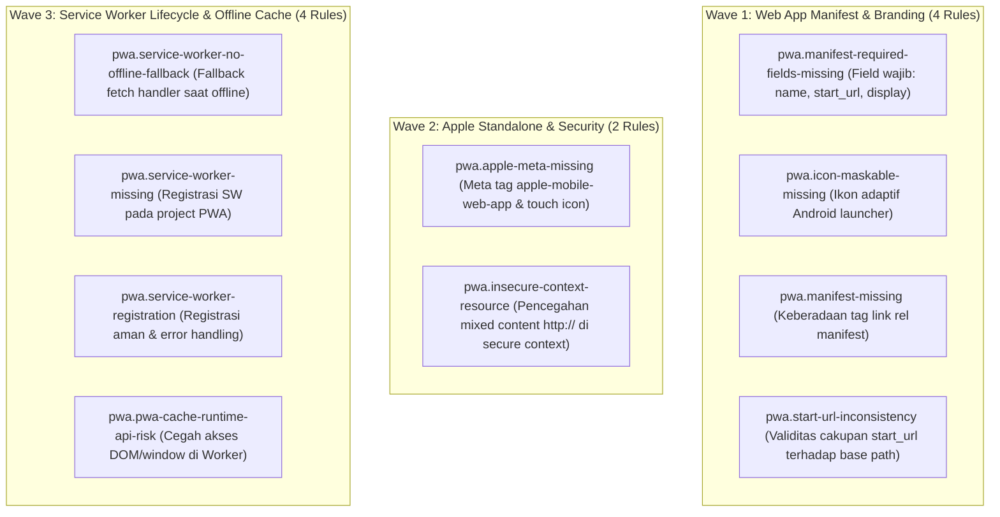

# EXPANSION-BATCH-06: Progressive Web App & Offline Standards (`pwa.*`)
> **Kode Dokumen:** `SPEC-EXP-06-PWA`
> **Kategori:** `pwa`
> **Pilar:** `01-SPEC` (WHAT - Spesifikasi Perilaku & Kontrak Rule)
> **Status:** Active Expansion Specification (10 Aturan Terkurasi Bebas Redundansi Linter Standar)
> **Standar Rujukan:**
> - W3C Web App Manifest Specification
> - W3C Service Workers Nightly & Cache Storage API
> - Google Web App Installability Criteria & Maskable Icons Standard
> - Apple Safari Web Content Guide (Configuring Web Applications)
> - W3C Secure Contexts (Mixed Content Mitigation)

---

## 1. Ikhtisar Kategori `pwa` (10 Aturan Non-Redundan)

> **Prinsip Eliminasi Redundansi:** Linter kode konvensional (ESLint, `tsc`, Prettier, Stylelint) **buta total terhadap berkas konfigurasi PWA (`manifest.json`), siklus hidup Service Worker (`sw.js`), dan keterkaitan meta tag Apple**. Kategori `pwa` Charites berfokus pada validasi statis lintas-file (*cross-file static analysis*) yang menghubungkan dokumen HTML/JSX dengan file manifest dan worker script tanpa perlu menyalakan runtime browser.



---

## 2. Spesifikasi Detail Rule `pwa.*`

### 2.1. `pwa.manifest-required-fields-missing`
- **Tujuan:** Memastikan `manifest.json`/`manifest.webmanifest` memiliki field wajib agar prompt "Add to Home Screen" tervalidasi di Chrome/Android, dan agar Safari iOS tidak fallback ke nama dan ikon default.
- **Mengapa Lolos Linter Standar:** Berkas `manifest.json` adalah file JSON terpisah di luar jangkauan ESLint JSX. Linter kode biasa tidak memvalidasi skema Web App Manifest W3C.
- **In-Scope:** File manifest tanpa `name`/`short_name`, `start_url`, `display`, atau array `icons` dengan minimal satu entri.
- **Bad:** `{ "name": "MyApp" }`
- **Good:** `{ "name": "MyApp", "short_name": "MyApp", "start_url": "/", "display": "standalone", "background_color": "#ffffff", "theme_color": "#111827", "icons": [ ... ] }`
- **Engine:** JSON/Manifest AST.
- **Severity:** Error.

### 2.2. `pwa.icon-maskable-missing`
- **Tujuan:** Mencegah ikon aplikasi terpotong dengan latar belakang putih janggal pada launcher adaptif Android modern yang mensyaratkan ikon varian `purpose: "maskable"`.
- **Mengapa Lolos Linter Standar:** File manifest valid secara sintaksis JSON. Schema validator umum tidak mewajibkan entri maskable, sehingga masalah baru disadari saat aplikasi diinstall di ponsel Android.
- **In-Scope:** Array `icons` pada manifest yang seluruh entrinya `purpose: "any"` atau tanpa `purpose`, tanpa satupun `purpose: "maskable"`.
- **Bad:** `"icons": [{ "src": "/icon-512.png", "sizes": "512x512", "type": "image/png" }]`
- **Good:** Menyediakan entri maskable terpisah: `{ "src": "/icon-512-maskable.png", "sizes": "512x512", "type": "image/png", "purpose": "maskable" }`
- **Engine:** JSON/Manifest AST.
- **Severity:** Warning.

### 2.3. `pwa.apple-meta-missing`
- **Tujuan:** Safari iOS tidak sepenuhnya membaca `manifest.json` untuk mode standalone - memerlukan meta tag khusus WebKit agar tampil tanpa address bar dan memakai ikon custom saat ditambahkan ke Home Screen.
- **Mengapa Lolos Linter Standar:** Menaruh `<link rel="manifest">` tanpa meta tag Apple adalah HTML yang sah. ESLint tidak mengetahui dependensi WebKit iOS untuk mode PWA standalone.
- **In-Scope:** Root layout (`<head>` / Astro Layout / Next.js metadata) yang memasang `<link rel="manifest">` tapi tidak menyertakan `<meta name="apple-mobile-web-app-capable">`, `<meta name="apple-mobile-web-app-status-bar-style">`, dan `<link rel="apple-touch-icon">`.
- **Bad:** `<link rel="manifest" href="/manifest.json" />`
- **Good:** Menyertakan `<link rel="apple-touch-icon" href="/apple-touch-icon.png" />`, `<meta name="apple-mobile-web-app-capable" content="yes" />`, dan `<meta name="apple-mobile-web-app-status-bar-style" content="black-translucent" />`.
- **Engine:** JSX/HTML Head AST.
- **Severity:** Warning.

### 2.4. `pwa.service-worker-no-offline-fallback`
- **Tujuan:** Memastikan Service Worker memiliki strategi penanganan saat offline (bukan sekadar pass-through fetch), agar aplikasi tidak menampilkan layar dinosaurus putus koneksi di Chrome, Firefox, atau Safari.
- **Mengapa Lolos Linter Standar:** `e.respondWith(fetch(e.request))` adalah kode JavaScript yang sah secara tipe dan sintaksis. Linter biasa tidak menganalisis skenario saat `fetch()` melempar NetworkError saat offline.
- **In-Scope:** File `sw.js` dengan listener `fetch` yang memanggil `fetch()` tanpa blok `.catch()` atau fallback ke cache/halaman offline.
- **Bad:** `self.addEventListener('fetch', (e) => { e.respondWith(fetch(e.request)); });`
- **Good:**
  ```js
  self.addEventListener('fetch', (e) => {
    e.respondWith(
      fetch(e.request).catch(() => caches.match(e.request).then((r) => r || caches.match('/offline.html')))
    );
  });
  ```
- **Engine:** Call Expression AST.
- **Severity:** Warning.

### 2.5. `pwa.insecure-context-resource`
- **Tujuan:** Fitur inti PWA (Service Worker, Web Push, Persistent Storage) hanya berjalan pada *secure context* (HTTPS). Resource campuran HTTP diblokir secara diam-diam dan membuat fitur offline gagal.
- **Mengapa Lolos Linter Standar:** String URL absolut `"http://api.example.com"` adalah string biasa yang legal di JavaScript. Linter biasa tidak memeriksa skema protokol pada pemanggilan `fetch` atau asset loading.
- **In-Scope:** Literal string URL berskema `http://` (bukan localhost) yang dipakai sebagai `src`, `href`, atau endpoint `fetch`.
- **Bad:** `fetch('http://api.domain.com/data')`
- **Good:** `fetch('https://api.domain.com/data')`
- **Engine:** String Literal AST.
- **Severity:** Error.

### 2.6. `pwa.manifest-missing`
- **Tujuan:** Memastikan aplikasi web yang menargetkan mode PWA memiliki tag link manifest pada dokumen root.
- **Mengapa Lolos Linter Standar:** Tidak ada linter HTML default yang mewajibkan `<link rel="manifest">`.
- **In-Scope:** Root layout / `<head>` tanpa tag manifest ketika project memiliki berkas `manifest.json`.
- **Engine:** JSX/HTML Head AST.
- **Severity:** Warning.

### 2.7. `pwa.service-worker-missing`
- **Tujuan:** Memastikan proyek PWA mendaftarkan service worker untuk mengelola offline caching dan network resilience.
- **Mengapa Lolos Linter Standar:** Linter kode hanya memindai per-file, tidak menghubungkan konfigurasi manifest dengan registrasi worker di berkas entry client.
- **In-Scope:** Proyek dengan manifest PWA tetapi tanpa registrasi service worker di client entry.
- **Engine:** Project Scanner.
- **Severity:** Warning.

### 2.8. `pwa.service-worker-registration`
- **Tujuan:** Mendeteksi registrasi Service Worker yang tidak aman atau tanpa penanganan kegagalan (*error handling*).
- **Mengapa Lolos Linter Standar:** `navigator.serviceWorker.register(...)` tanpa `.catch()` sah secara Promise, namun unhandled rejection dapat mengganggu error monitoring.
- **In-Scope:** Pemanggilan `navigator.serviceWorker.register()` tanpa pengecekan `'serviceWorker' in navigator` atau tanpa `.catch()`.
- **Bad:** `navigator.serviceWorker.register('/sw.js');`
- **Good:**
  ```ts
  if ('serviceWorker' in navigator) {
    navigator.serviceWorker.register('/sw.js').catch(console.error);
  }
  ```
- **Engine:** Call Expression AST.
- **Severity:** Warning.

### 2.9. `pwa.start-url-inconsistency`
- **Tujuan:** Mencegah `start_url` pada manifest mengarah ke rute yang tidak valid atau berada di luar cakupan (*scope*) aplikasi.
- **Mengapa Lolos Linter Standar:** Linter tidak membandingkan nilai string di `manifest.json` dengan konfigurasi `base` URL aplikasi.
- **In-Scope:** Nilai `start_url` yang tidak konsisten dengan `base` path routing aplikasi.
- **Engine:** JSON/Manifest AST.
- **Severity:** Error.

### 2.10. `pwa.pwa-cache-runtime-api-risk`
- **Tujuan:** Mencegah penggunaan API non-worker (seperti akses DOM langsung `document.*` atau `window.*`) di dalam thread Service Worker yang menyebabkan runtime crash seketika.
- **Mengapa Lolos Linter Standar:** Jika project tidak memiliki konfigurasi `tsconfig.worker.json` terpisah, TypeScript sering kali menyertakan `DOM` lib di global scope sehingga `window` atau `localStorage` dianggap legal oleh type-checker.
- **In-Scope:** Penggunaan `window`, `document`, atau `localStorage` di dalam file Service Worker (`sw.js`).
- **Bad:**
  ```ts
  self.addEventListener('fetch', () => {
    const token = window.localStorage.getItem('token');
  });
  ```
- **Good:** Menggunakan Cache Storage API atau IndexedDB yang valid pada Web Worker scope.
- **Engine:** Worker Scope AST.
- **Severity:** Error.

---

## 3. Ringkasan Matriks Rule `pwa.*` (10 Aturan Non-Redundan)

| Rule ID | Fokus Invarian | Mengapa Tidak Tertangkap Linter Biasa | Severity | Engine Target |
|---|---|---|---|---|
| `pwa.manifest-required-fields-missing` | Field wajib manifest PWA | Linter kode biasa tidak memindai skema file manifest | error | JSON/Manifest AST |
| `pwa.icon-maskable-missing` | Ikon launcher adaptif Android | Schema validator umum tidak mewajibkan purpose maskable | warning | JSON/Manifest AST |
| `pwa.apple-meta-missing` | Standalone mode Safari iOS | ESLint tidak mengetahui dependensi WebKit Apple meta | warning | JSX/HTML Head AST |
| `pwa.service-worker-no-offline-fallback` | Fallback fetch handler offline | `fetch()` pass-through tanpa catch sah secara sintaksis | warning | Call Expression AST |
| `pwa.insecure-context-resource` | Cegah mixed-content HTTP | Linter biasa tidak memeriksa skema URL di fetch | error | String Literal AST |
| `pwa.manifest-missing` | Link manifest pada root layout | Tidak ada rule HTML bawaan yang mewajibkan manifest | warning | JSX/HTML Head AST |
| `pwa.service-worker-missing` | Service worker pada project PWA | Analisis lintas berkas antara manifest dan entry script | warning | Project Scanner |
| `pwa.service-worker-registration` | Feature detect registrasi SW | Unhandled rejection pada Promise registrasi diabaikan | warning | Call Expression AST |
| `pwa.start-url-inconsistency` | Validitas URL awal aplikasi | Linter tidak membandingkan manifest dengan base path | error | JSON/Manifest AST |
| `pwa.pwa-cache-runtime-api-risk` | Cegah akses DOM di SW thread | TypeScript global DOM lib meloloskan window/document | error | Worker Scope AST |

---

## 4. Rule Classification & Execution Boundary

1. **Deterministic AST Rules (< 50ms pre-commit gate):**
   - `pwa.manifest-required-fields-missing`, `pwa.icon-maskable-missing`, `pwa.apple-meta-missing`, `pwa.service-worker-no-offline-fallback`, `pwa.insecure-context-resource`, `pwa.manifest-missing`, `pwa.service-worker-registration`, `pwa.pwa-cache-runtime-api-risk`.
2. **Project / Routing Analysis Rules:**
   - `pwa.service-worker-missing`, `pwa.start-url-inconsistency`.
3. **Runtime Validation Layer:**
   - Verifikasi audit Lighthouse PWA dan install prompt sesungguhnya di Android/iOS.
