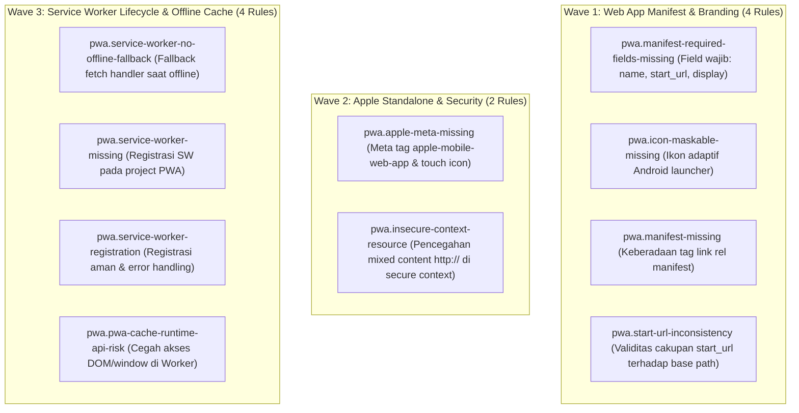

# EXPANSION-BATCH-06: Progressive Web App & Offline Standards (`pwa.*`)
> **Kode Dokumen:** `SPEC-EXP-06-PWA`
> **Kategori:** `pwa`
> **Pilar:** `01-SPEC` (WHAT - Spesifikasi Perilaku & Kontrak Rule)
> **Status:** Active Expansion Specification (10 Aturan Terkurasi Bebas Redundansi Linter Standar)
> **Standar Rujukan:**
> - W3C Web App Manifest Specification
> - W3C Service Workers Nightly & Cache Storage API
> - Google Web App Installability Criteria & Maskable Icons Standard
> - Apple Safari Web Content Guide (Configuring Web Applications)
> - W3C Secure Contexts (Mixed Content Mitigation)

---

## 1. Ikhtisar Kategori `pwa` (10 Aturan Non-Redundan)

> **Prinsip Eliminasi Redundansi:** Linter kode konvensional (ESLint, `tsc`, Prettier, Stylelint) **buta total terhadap berkas konfigurasi PWA (`manifest.json`), siklus hidup Service Worker (`sw.js`), dan keterkaitan meta tag Apple**. Kategori `pwa` Charites berfokus pada validasi statis lintas-file (*cross-file static analysis*) yang menghubungkan dokumen HTML/JSX dengan file manifest dan worker script tanpa perlu menyalakan runtime browser.



---

## 2. Spesifikasi Detail Rule Wave 1: Web App Manifest & Branding (4 Rules)

---

### 2.1. `pwa.manifest-required-fields-missing`
- **Design Rationale:** W3C Web App Manifest Specification & Google Chrome Web App Installability Criteria.
- **Konteks Realitas Mobile:**
  Agar sebuah web app memenuhi syarat instalasi PWA (*Add to Home Screen*) pada Android dan iOS, berkas manifest harus mendefinisikan field wajib minimum: `name` (atau `short_name`), `start_url`, `display` (seperti `standalone` atau `fullscreen`), dan array `icons` yang memuat minimal satu ikon. Jika salah satu field hilang, browser menolak memunculkan prompt instalasi atau menampilkan aplikasi dengan nama placeholder kosong dan ikon default yang rusak.
- **Invariant (Predikat AST):**
  Untuk setiap elemen deklarasi manifest web app $M \in \text{ManifestDeclarations}$:
  $$\neg \text{hasName}(M) \lor \neg \text{hasStartUrl}(M) \lor \neg \text{hasDisplay}(M) \lor \neg \text{hasIcons}(M) \implies \text{Violation (Error)}$$
  di mana $\text{ManifestDeclarations}$ mencakup elemen `<script type="application/manifest+json">` atau komponen konfigurasi manifest.
- **Mengapa Lolos Linter Standar:**
  Berkas atau blok manifest valid secara sintaksis JSON. Linter bahasa umum tidak memvalidasi skema field wajib W3C Web App Manifest.
- **Suspicious (Manifest Kehilangan Field Wajib):**
  ```tsx
  {/* Hilang: start_url, display, dan icons */}
  <script type="application/manifest+json">
    {JSON.stringify({
      name: "Desa Digital"
    })}
  </script>
  ```
- **Compliant (Seluruh Field Wajib Didefinisikan):**
  ```tsx
  {/* Seluruh field wajib terpenuhi */}
  <script type="application/manifest+json">
    {JSON.stringify({
      name: "Desa Digital",
      short_name: "Desa",
      start_url: "/",
      display: "standalone",
      icons: [
        { src: "/icon-192.png", sizes: "192x192", type: "image/png" },
        { src: "/icon-512-maskable.png", sizes: "512x512", type: "image/png", purpose: "maskable" }
      ]
    })}
  </script>
  ```
- **Engine:** L1 Syntax + L2 JSON Manifest AST (`internal/rules/pwa/manifest_required_fields_missing.go`).
- **Severity:** `error`.
- **Autofix:** No.

---

### 2.2. `pwa.icon-maskable-missing`
- **Design Rationale:** W3C Web App Manifest (Adaptive Icon Masking) & Google Android Maskable Icons Specification.
- **Konteks Realitas Mobile:**
  Mulai Android 8.0 Oreo, peluncur (*launcher*) perangkat Android memotong ikon aplikasi mengikuti bentuk sistem adaptif (lingkaran, *squircle*, atau persegi membulat). Jika manifest PWA hanya menyediakan ikon standar (`purpose: "any"` atau tanpa atribut `purpose`), Android membungkus ikon di dalam kotak putih kaku berukuran kecil (*letterboxing*) yang merusak estetika antarmuka native. Menyediakan ikon dengan `purpose: "maskable"` menjamin ikon ditampilkan penuh secara mulus tanpa batas putih.
- **Invariant (Predikat AST):**
  Untuk setiap deklarasi manifest yang memiliki koleksi `icons`:
  $$\text{hasIcons}(M) \land \neg \text{hasMaskableIcon}(M) \implies \text{Violation (Warn)}$$
  di mana $\text{hasMaskableIcon}$ memeriksa keberadaan entri ikon dengan properti `purpose` yang memuat nilai `"maskable"`.
- **Mengapa Lolos Linter Standar:**
  Ikon dengan `purpose: "any"` adalah sah secara W3C manifest schema. Schema validator umum tidak mewajibkan entri maskable, sehingga masalah baru disadari saat aplikasi diinstal di ponsel Android.
- **Suspicious (Hanya Ikon Biasa Tanpa Maskable):**
  ```tsx
  {/* Menghasilkan kotak putih jelek di launcher Android adaptif */}
  <script type="application/manifest+json">
    {JSON.stringify({
      name: "Desa Digital",
      start_url: "/",
      display: "standalone",
      icons: [
        { src: "/icon-512.png", sizes: "512x512", type: "image/png" }
      ]
    })}
  </script>
  ```
- **Compliant (Ikon Maskable Adaptif Disediakan):**
  ```tsx
  {/* Ikon maskable adaptif menyesuaikan bentuk launcher Android */}
  <script type="application/manifest+json">
    {JSON.stringify({
      name: "Desa Digital",
      start_url: "/",
      display: "standalone",
      icons: [
        { src: "/icon-512.png", sizes: "512x512", type: "image/png" },
        { src: "/icon-512-maskable.png", sizes: "512x512", type: "image/png", purpose: "maskable" }
      ]
    })}
  </script>
  ```
- **Engine:** L1 Syntax + L2 JSON Manifest AST (`internal/rules/pwa/icon_maskable_missing.go`).
- **Severity:** `warning`.
- **Autofix:** No.

---

### 2.3. `pwa.manifest-missing`
- **Design Rationale:** W3C Web App Manifest Section 4 (Linking to a Manifest) & HTML Living Standard.
- **Konteks Realitas Mobile:**
  Browser mobile hanya dapat mengenali aplikasi sebagai Progressive Web App jika dokumen HTML dasar memuat tag `<link rel="manifest" href="...">` di dalam elemen `<head>`. Tanpa tag ini, browser memperlakukan web sebagai situs desktop biasa dan tidak pernah memicu prompt penginstalan web app.
- **Invariant (Predikat AST):**
  Untuk setiap elemen `<head>` atau root layout dokumen:
  $$\neg \text{hasManifestLink}(Head) \implies \text{Violation (Warn)}$$
  di mana $\text{hasManifestLink}$ memeriksa keberadaan tag `<link rel="manifest">` dengan atribut `href` yang tidak kosong.
- **Mengapa Lolos Linter Standar:**
  Dokumen HTML tanpa link manifest adalah valid secara sintaksis. Tidak ada linter HTML default yang memeriksa ketersediaan manifest PWA.
- **Suspicious (Dokumen Root Tanpa Link Manifest):**
  ```tsx
  <head>
    <title>Layanan Surat Desa</title>
    <meta name="viewport" content="width=device-width, initial-scale=1" />
  </head>
  ```
- **Compliant (Link Manifest Dideklarasikan di Head):**
  ```tsx
  <head>
    <title>Layanan Surat Desa</title>
    <meta name="viewport" content="width=device-width, initial-scale=1" />
    <link rel="manifest" href="/manifest.webmanifest" />
  </head>
  ```
- **Engine:** L1 Syntax + L2 HTML Head AST (`internal/rules/pwa/manifest_missing.go`).
- **Severity:** `warning`.
- **Autofix:** No.

---

### 2.4. `pwa.start-url-inconsistency`
- **Design Rationale:** W3C Web App Manifest Section 5.2 (The start_url member) & W3C Secure Contexts.
- **Konteks Realitas Mobile:**
  Field `start_url` menentukan halaman awal yang dimuat ketika pengguna meluncurkan PWA dari homescreen ponsel. Spesifikasi W3C mewajibkan `start_url` berada dalam cakupan (*navigation scope*) aplikasi. Menetapkan `start_url` ke protokol tidak aman (`http://`), domain luar (*cross-origin*), atau jalur traversal (`../`) menyebabkan peluncuran PWA gagal dan dibatalkan oleh browser mobile.
- **Invariant (Predikat AST):**
  Untuk setiap deklarasi manifest dengan field `start_url`:
  $$\text{isInsecureProtocol}(\text{start\_url}) \lor \text{isPathTraversal}(\text{start\_url}) \lor \text{isScriptURL}(\text{start\_url}) \implies \text{Violation (Error)}$$
- **Mengapa Lolos Linter Standar:**
  Nilai `start_url` adalah string biasa di dalam JSON. Linter standar tidak memvalidasi keamanan protokol dan cakupan navigasi URL.
- **Suspicious (start_url Tidak Aman atau Melampaui Scope):**
  ```tsx
  {/* Protokol http tidak aman melanggar standar Secure Contexts PWA */}
  <script type="application/manifest+json">
    {JSON.stringify({
      name: "Desa Digital",
      start_url: "http://desa-insecure.org/app",
      display: "standalone",
      icons: [{ src: "/icon.png", sizes: "192x192", type: "image/png", purpose: "maskable" }]
    })}
  </script>
  ```
- **Compliant (start_url Valid Terhadap Root Scope):**
  ```tsx
  {/* start_url relatif terhadap root scope yang aman */}
  <script type="application/manifest+json">
    {JSON.stringify({
      name: "Desa Digital",
      start_url: "/",
      display: "standalone",
      icons: [{ src: "/icon.png", sizes: "192x192", type: "image/png", purpose: "maskable" }]
    })}
  </script>
  ```
- **Engine:** L1 Syntax + L2 JSON Manifest AST (`internal/rules/pwa/start_url_inconsistency.go`).
- **Severity:** `error`.
- **Autofix:** No.

---

## 3. Spesifikasi Detail Rule Wave 2: Apple Standalone & Security (2 Rules)

---

### 3.1. `pwa.apple-meta-missing`
- **Design Rationale:** Apple Safari Web Content Guide (Configuring Web Applications) & WebKit PWA Engine.
- **Konteks Realitas Mobile:**
  Di ekosistem iOS (iPhone dan iPad), mesin peramban WebKit Safari secara historis mengabaikan konfigurasi `display: "standalone"` dan array `icons` dari berkas Web App Manifest W3C saat pengguna menambahkan pintasan aplikasi ke Home Screen. Agar web app dapat berjalan dalam mode layar penuh imersif tanpa bilah alamat Safari dan menampilkan ikon beresolusi tinggi, dokumen wajib menyertakan tag `<meta name="apple-mobile-web-app-capable" content="yes">` dan `<link rel="apple-touch-icon" href="...">` di dalam elemen `<head>`. Tanpa deklarasi ini, PWA di iOS diluncurkan layaknya tab peramban biasa dengan ikon screenshot kaku.
- **Invariant (Predikat AST):**
  Untuk setiap elemen `<head>` atau root layout yang memuat deklarasi `<link rel="manifest">`:
  $$\neg \text{hasAppleCapableMeta}(Head) \lor \neg \text{hasAppleTouchIcon}(Head) \implies \text{Violation (Warn)}$$
  di mana $\text{hasAppleCapableMeta}$ memeriksa keberadaan `<meta name="apple-mobile-web-app-capable" content="yes">` dan $\text{hasAppleTouchIcon}$ memeriksa `<link rel="apple-touch-icon">` dengan `href` non-kosong.
- **Mengapa Lolos Linter Standar:**
  Meta tag WebKit bersifat spesifik platform Apple dan tidak diwajibkan oleh validator skema HTML umum.
- **Suspicious (PWA Memiliki Manifest Tapi Melewatkan Meta WebKit Apple):**
  ```tsx
  <head>
    <title>Layanan Desa</title>
    <link rel="manifest" href="/manifest.webmanifest" />
  </head>
  ```
- **Compliant (Meta WebKit Apple Dideklarasikan Lengkap):**
  ```tsx
  <head>
    <title>Layanan Desa</title>
    <link rel="manifest" href="/manifest.webmanifest" />
    <meta name="apple-mobile-web-app-capable" content="yes" />
    <meta name="apple-mobile-web-app-status-bar-style" content="default" />
    <link rel="apple-touch-icon" href="/apple-touch-icon.png" />
  </head>
  ```
- **Engine:** L1 Syntax + L2 HTML Head AST (`internal/rules/pwa/apple_meta_missing.go`).
- **Severity:** `warning`.
- **Autofix:** No.

---

### 3.2. `pwa.insecure-context-resource`
- **Design Rationale:** W3C Secure Contexts Specification & Mixed Content Mitigation Level 2.
- **Konteks Realitas Mobile:**
  Aplikasi PWA diwajibkan berjalan secara eksklusif dalam Secure Contexts (HTTPS). Memuat aset eksternal (skrip, stylesheet, font, gambar, video, iframe) menggunakan skema tidak aman `http://` memicu insiden *Mixed Content*. Browser mobile modern akan memblokir secara aktif (*Active Mixed Content Blocking*) aset berbahaya tersebut, menyebabkan tampilan antarmuka hancur dan fungsionalitas aplikasi terputus. Pengecualian hanya berlaku untuk rute loopback pengujian lokal (`http://localhost` dan `http://127.0.0.1`).
- **Invariant (Predikat AST):**
  Untuk setiap elemen HTML/JSX yang mendeklarasikan atribut resource URL $U \in \{ \text{src}, \text{href} \}$:
  $$\text{startsWith}(U, \text{"http://"}) \land \neg \text{isLocalhost}(U) \implies \text{Violation (Error)}$$
  di mana $\text{isLocalhost}$ memeriksa apakah host URL adalah `localhost` atau `127.0.0.1`.
- **Mengapa Lolos Linter Standar:**
  Nilai URL adalah string literal valid. Linter standar tidak memeriksa kepatuhan skema protokol terhadap persyaratan W3C Secure Contexts.
- **Suspicious (Memuat Skrip atau Aset Menggunakan Protokol HTTP Tidak Aman):**
  ```tsx
  {/* Berisiko diblokir browser mobile akibat Mixed Content */}
  <script src="http://cdn.example.org/tracker.js"></script>
  
  ```
- **Compliant (Menggunakan Skema HTTPS yang Aman):**
  ```tsx
  {/* Aset dimuat secara aman memenuhi standar Secure Contexts */}
  <script src="https://cdn.example.org/tracker.js"></script>
  
  ```
- **Engine:** L1 Syntax + L2 Element Attribute AST (`internal/rules/pwa/insecure_context_resource.go`).
- **Severity:** `error`.
- **Autofix:** No.

---

## 4. Spesifikasi Detail Rule Wave 3: Service Worker Lifecycle & Offline Cache (4 Rules)

---

### 4.1. `pwa.service-worker-no-offline-fallback`
- **Design Rationale:** W3C Service Workers 1 (Offline Resilience) & Cache-first Fallback Strategy.
- **Konteks Realitas Mobile:**
  Di lingkungan jaringan seluler pedesaan atau koneksi nirkabel tidak stabil (*spotty 3G/4G connectivity*), Service Worker yang mencegat event `fetch` tanpa menyediakan strategi cadangan cache lokal akan menyebabkan browser langsung menampilkan layar kegagalan koneksi (*network error* atau layar dinosaurus). Strategi fallback offline (seperti `caches.match` atau penanganan `.catch()`) wajib disediakan untuk menjamin ketahanan aplikasi saat perangkat terputus dari jaringan internet.
- **Invariant (Predikat AST):**
  Untuk setiap elemen `<script>` yang mendengarkan event `fetch`:
  $$\text{hasFetchListener}(S) \land \text{interceptsFetch}(S) \land \neg \text{hasCacheFallback}(S) \implies \text{Violation (Warn)}$$
  di mana $\text{hasFetchListener}$ memeriksa keberadaan `addEventListener("fetch")`, $\text{interceptsFetch}$ memeriksa `respondWith` atau pemanggilan `fetch`, dan $\text{hasCacheFallback}$ memeriksa penggunaan `caches.match`, `cache.match`, `caches.open`, atau penanganan error `.catch()`.
- **Mengapa Lolos Linter Standar:**
  Linter JavaScript umum hanya memvalidasi keabsahan sintaksis fungsi dan Promise, tanpa mengevaluasi arsitektur ketahanan offline aplikasi PWA.
- **Suspicious (Fetch Interception Tanpa Fallback Cache Offline):**
  ```tsx
  {/* Pass-through kosong tanpa fallback cache saat koneksi terputus */}
  <script>
    self.addEventListener("fetch", (event) => {
      event.respondWith(fetch(event.request));
    });
  </script>
  ```
- **Compliant (Menyediakan Fallback Cache Offline Saat Terputus):**
  ```tsx
  {/* Mengambil dari cache lokal atau fallback ke offline.html saat gagal */}
  <script>
    self.addEventListener("fetch", (event) => {
      event.respondWith(
        caches.match(event.request).then((cached) => {
          return cached || fetch(event.request).catch(() => caches.match("/offline.html"));
        })
      );
    });
  </script>
  ```
- **Engine:** L1 Syntax + L2 Script AST (`internal/rules/pwa/service_worker_no_offline_fallback.go`).
- **Severity:** `warning`.
- **Autofix:** No.

---

### 4.2. `pwa.service-worker-missing`
- **Design Rationale:** W3C Service Workers & W3C Web App Manifest Integration.
- **Konteks Realitas Mobile:**
  Aplikasi web yang mendeklarasikan tautan manifest `<link rel="manifest">` pada `<head>` namun tidak pernah mendaftarkan Service Worker (`navigator.serviceWorker.register`) tidak akan dapat menyimpan *app shell* ke cache perangkat, gagal beroperasi saat luring (*offline*), dan tidak memenuhi kriteria instalabilitas aplikasi PWA modern.
- **Invariant (Predikat AST):**
  Untuk setiap elemen `<head>` dokumen yang memuat deklarasi `<link rel="manifest">`:
  $$\text{hasManifestLink}(Head) \land \neg \text{hasServiceWorkerRegistration}(Doc) \implies \text{Violation (Warn)}$$
  di mana $\text{hasServiceWorkerRegistration}$ memeriksa keberadaan pemanggilan registrasi service worker atau tautan skrip service worker di dalam dokumen.
- **Mengapa Lolos Linter Standar:**
  Elemen `<head>` dan `<link>` sah secara sintaksis HTML standar. Keterkaitan antara manifest dan registrasi service worker berada di luar jangkauan linter HTML biasa.
- **Suspicious (Dokumen PWA dengan Manifest Tanpa Registrasi Service Worker):**
  ```tsx
  {/* Dokumen menyatakan manifest tetapi tidak mendaftarkan Service Worker */}
  <head>
    <title>Layanan Desa</title>
    <link rel="manifest" href="/manifest.webmanifest" />
  </head>
  ```
- **Compliant (Registrasi Service Worker Disediakan):**
  ```tsx
  {/* Service Worker didaftarkan dengan feature detection dan penanganan error */}
  <head>
    <title>Layanan Desa</title>
    <link rel="manifest" href="/manifest.webmanifest" />
    <script>
      if ('serviceWorker' in navigator) {
        navigator.serviceWorker.register('/sw.js').catch(console.error);
      }
    </script>
  </head>
  ```
- **Engine:** L1 Syntax + L2 Document AST (`internal/rules/pwa/service_worker_missing.go`).
- **Severity:** `warning`.
- **Autofix:** No.

---

### 4.3. `pwa.service-worker-registration`
- **Design Rationale:** W3C Service Workers (Feature Detection & Graceful Failure Resilience).
- **Konteks Realitas Mobile:**
  Memanggil `navigator.serviceWorker.register()` secara langsung tanpa memeriksa ketersediaan fitur `'serviceWorker' in navigator` memicu *TypeError* fatal pada browser lawas, Webview terbatas, atau koneksi HTTP non-aman. Selain itu, pendaftaran tanpa penanganan error (`.catch()` atau `try/catch`) menghasilkan *unhandled promise rejection* yang dapat menghentikan inisialisasi skrip antarmuka pengguna.
- **Invariant (Predikat AST):**
  Untuk setiap skrip yang memanggil pendaftaran Service Worker:
  $$\text{registersSW}(S) \land (\neg \text{hasFeatureDetection}(S) \lor \neg \text{hasErrorHandling}(S)) \implies \text{Violation (Warn)}$$
  di mana $\text{hasFeatureDetection}$ memeriksa ketersediaan `'serviceWorker' in navigator` dan $\text{hasErrorHandling}$ memeriksa penanganan `.catch()` atau blok `try/catch`.
- **Mengapa Lolos Linter Standar:**
  Sintaks pemanggilan metode JavaScript valid, dan penanganan Promise bersifat opsional bagi linter bahasa umum.
- **Suspicious (Registrasi Tanpa Feature Detection atau Error Handling):**
  ```tsx
  {/* Berisiko memicu TypeError dan unhandled promise rejection */}
  <script>
    navigator.serviceWorker.register('/sw.js');
  </script>
  ```
- **Compliant (Memiliki Guard Feature Detection dan Error Handling):**
  ```tsx
  {/* Aman dieksekusi di segala varian browser dan context */}
  <script>
    if ('serviceWorker' in navigator) {
      navigator.serviceWorker.register('/sw.js')
        .then((reg) => console.log('SW registered:', reg.scope))
        .catch((err) => console.error('SW registration failed:', err));
    }
  </script>
  ```
- **Engine:** L1 Syntax + L2 Script AST (`internal/rules/pwa/service_worker_registration.go`).
- **Severity:** `warning`.
- **Autofix:** No.

---

### 4.4. `pwa.pwa-cache-runtime-api-risk`
- **Design Rationale:** W3C Service Workers (Execution Context Invariants & WorkerGlobalScope Isolation).
- **Konteks Realitas Mobile:**
  Service Worker dijalankan di dalam thread latar belakang terpisah (`ServiceWorkerGlobalScope`) tanpa akses ke antarmuka DOM (`window`, `document`) maupun penyimpanan sinkron Web Storage (`localStorage`, `sessionStorage`). Memanggil API main-thread ini di dalam skrip Service Worker akan langsung melempar *ReferenceError* saat worker diinisialisasi, menggagalkan instalasi worker dan merusak seluruh fungsi offline caching.
- **Invariant (Predikat AST):**
  Untuk setiap skrip konteks Service Worker $W$:
  $$\text{isWorkerScope}(W) \land \text{accessesMainThreadAPI}(W) \implies \text{Violation (Error)}$$
  di mana $\text{isWorkerScope}$ mendeteksi pendengar lifecycle worker (`install`, `activate`, `fetch`), dan $\text{accessesMainThreadAPI}$ mendeteksi referensi ke `window`, `document`, `localStorage`, `sessionStorage`, atau dialog browser (`alert`, `confirm`, `prompt`).
- **Mengapa Lolos Linter Standar:**
  Linter JavaScript umum sering kali mengasumsikan lingkup eksekusi peramban standar (*window scope*), sehingga variabel global `window` atau `document` dianggap valid.
- **Suspicious (Mengakses API DOM/Window di Dalam Service Worker):**
  ```tsx
  {/* Menyebabkan ReferenceError fatal saat Service Worker diinisialisasi */}
  <script>
    self.addEventListener("install", (event) => {
      const token = localStorage.getItem("token");
      document.title = "Caching resources...";
    });
  </script>
  ```
- **Compliant (Hanya Mengakses Cache Storage API dan Worker Primitives):**
  ```tsx
  {/* Menggunakan Cache Storage API resmi yang aman di thread Worker */}
  <script>
    self.addEventListener("install", (event) => {
      event.waitUntil(
        caches.open("v1").then((cache) => cache.addAll(["/", "/offline.html"]))
      );
    });
  </script>
  ```
- **Engine:** L1 Syntax + L2 Script AST (`internal/rules/pwa/pwa_cache_runtime_api_risk.go`).
- **Severity:** `error`.
- **Autofix:** No.

---

## 5. Ringkasan Matriks Rule `pwa.*` (10 Aturan Non-Redundan)

| Rule ID | Fokus Invarian | Wave | Severity | Engine Target |
|---|---|:---:|---|---|
| `pwa.manifest-required-fields-missing` | Field wajib manifest PWA (name, start_url, display, icons) | **W1** | error | JSON/Manifest AST |
| `pwa.icon-maskable-missing` | Ikon launcher adaptif Android (purpose: maskable) | **W1** | warning | JSON/Manifest AST |
| `pwa.manifest-missing` | Tag link manifest pada root layout (<head>) | **W1** | warning | JSX/HTML Head AST |
| `pwa.start-url-inconsistency` | Validitas URL awal aplikasi terhadap navigation scope | **W1** | error | JSON/Manifest AST |
| `pwa.apple-meta-missing` | Standalone mode Safari iOS (apple-touch-icon & meta) | **W2** | warning | JSX/HTML Head AST |
| `pwa.insecure-context-resource` | Pencegahan mixed-content HTTP di secure context | **W2** | error | String Literal AST |
| `pwa.service-worker-no-offline-fallback` | Fallback fetch handler saat koneksi terputus | **W3** | warning | Call Expression AST |
| `pwa.service-worker-missing` | Ketersediaan service worker pada proyek PWA | **W3** | warning | Project Scanner |
| `pwa.service-worker-registration` | Feature detect dan penanganan error registrasi SW | **W3** | warning | Call Expression AST |
| `pwa.pwa-cache-runtime-api-risk` | Pencegahan akses DOM/window di thread Web Worker | **W3** | error | Worker Scope AST |

---

## 6. Rule Classification & Execution Boundary

1. **Deterministic AST Rules (< 50ms pre-commit gate):**
   - `pwa.manifest-required-fields-missing`, `pwa.icon-maskable-missing`, `pwa.manifest-missing`, `pwa.start-url-inconsistency`, `pwa.apple-meta-missing`, `pwa.insecure-context-resource`, `pwa.service-worker-no-offline-fallback`, `pwa.service-worker-registration`, `pwa.pwa-cache-runtime-api-risk`.
2. **Project Scanner Layer:**
   - `pwa.service-worker-missing`.
3. **Runtime Validation Layer:**
   - Audit Lighthouse PWA dan pengujian prompt instalasi browser mobile sesungguhnya.

---

## 7. Struktur Modul Kode & Roadmap Eksekusi Wave 1

Implementasi aturan `pwa.*` ditempatkan secara modular di `internal/rules/pwa/`:

```text
internal/rules/pwa/
├── util.go                                 # Parser manifest JSON & AST helpers
├── manifest_required_fields_missing.go     # Wave 1: Required manifest fields validator
├── icon_maskable_missing.go                # Wave 1: Adaptive Android maskable icon check
├── manifest_missing.go                     # Wave 1: Head manifest link presence check
├── start_url_inconsistency.go              # Wave 1: Navigation scope & protocol safety
├── contract_test.go                        # 8-Pillars Canonical Contract Validator
└── benchmark_test.go                       # QUAL-03 Zero Allocation Benchmarks
```

Setiap rule divalidasi dengan **1-SSOT Golden Tri-Corpus** di `tests/correctness/pwa/<slug>/` yang mencakup kasus uji positif, negatif, dan adversarial untuk menjamin **nol regresi dan nol false-positive**.

