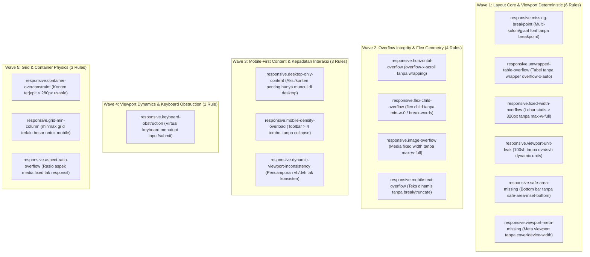

# EXPANSION-BATCH-04: Responsive Layout & Viewport Integrity Standards (`responsive.*`)
> **Kode Dokumen:** `SPEC-EXP-04-RESPONSIVE`
> **Kategori:** `responsive`
> **Pilar:** `01-SPEC` (WHAT - Spesifikasi Perilaku & Kontrak Rule)
> **Status:** Active Expansion Specification (18 Aturan Terkurasi Bebas Redundansi Linter Standar)
> **Standar Rujukan:**
> - W3C CSS Values and Units Module Level 4 (Small/Dynamic Viewport Units: `svh`, `dvh`)
> - W3C CSS Mobile Safe Area Insets (`env(safe-area-inset-*)`)
> - HTML Living Standard Section 4.2.5 (Viewport Meta & `interactive-widget`)
> - Mobile-First Responsive Breakpoint Architecture (Tailwind CSS `sm:`, `md:`, `lg:`)
> - W3C CSS Grid Layout Module Level 2 & CSS Container Queries

---

## 1. Ikhtisar Kategori `responsive` (18 Aturan Non-Redundan)

> **Prinsip Eliminasi Redundansi:** Linter kode JavaScript/TypeScript konvensional (ESLint) **hanya melihat string class Tailwind sebagai token teks buram (*opaque string*)**. ESLint tidak memiliki kalkulator box model untuk mengetahui apakah `grid-cols-4` akan pecah di layar ponsel 360px, apakah `100vh` akan memicu layout jump di Safari iOS, atau apakah `fixed bottom-0` akan terpotong oleh Home Indicator iPhone.
>
> Seluruh aturan di dalam kategori ini berfokus pada **integritas layout fisik, kestabilan viewport mobile, dan pencegahan kebocoran horizontal (*horizontal overflow*)** yang mustahil dideteksi oleh linter konvensional. Aturan ukuran target sentuh didelegasikan secara kanonikal ke `a11y.touch-target-size` dan `a11y.touch-target-spacing` agar tidak terjadi duplikasi antar-kategori.



---

## 2. Spesifikasi Detail Rule Wave 1: Layout Core & Viewport Deterministic (6 Rules)

---

### 2.1. `responsive.missing-breakpoint`
- **Design Rationale:** Mobile-First CSS Grid Architecture & Responsive Typography Scaling.
- **Konteks Realitas Mobile:**
  Pada layar smartphone berukuran sempit (360px-390px), mendefinisikan layout multi-kolom (`grid-cols-3` s/d `grid-cols-12`) atau ukuran font raksasa (`text-5xl` s/d `text-9xl`) langsung pada baseline mobile tanpa modifier breakpoint (`sm:`, `md:`, `lg:`) akan memeras lebar setiap kolom menjadi kurang dari 100px. Hal ini merusak tata letak kartu, memotong teks, atau menyebabkan konten bertumpuk tak terbaca. Pendekatan mobile-first mewajibkan baseline mobile dimulai dari 1 kolom (`grid-cols-1`) dan diperluas secara bertahap menggunakan breakpoint modifier.
- **Invariant (Predikat AST):**
  Untuk setiap elemen dengan kelas Tailwind $C \in \text{Classes}(E)$:
  $$\text{isUnprefixedMultiColGrid}(C) \lor \text{isUnprefixedGiantFont}(C) \implies \text{Violation (Warn)}$$
  di mana $\text{isUnprefixedMultiColGrid}$ mendeteksi `grid-cols-[3-9]` atau `grid-cols-1[0-2]` tanpa prefix breakpoint responsif, dan $\text{isUnprefixedGiantFont}$ mendeteksi `text-[5-9]xl` tanpa prefix breakpoint dan tanpa baseline responsif.
- **Mengapa Lolos Linter Standar:**
  String kelas `grid-cols-4` valid secara sintaksis HTML/JSX. Linter standar tidak memahami kalkulasi box model per kolom pada lebar fisik viewport mobile 360px.
- **Suspicious (Multi-Kolom Dideklarasikan Sebagai Baseline Mobile):**
  ```tsx
  {/* Memeras 4 kolom pada layar ponsel sempit 360px */}
  <div className="grid grid-cols-4 gap-4">
    <div className="bg-card p-4">Item 1</div>
    <div className="bg-card p-4">Item 2</div>
  </div>
  ```
- **Compliant (Mobile-First dengan Breakpoint Responsif):**
  ```tsx
  {/* Baseline mobile 1 kolom, melebar menjadi 2 kolom di tablet dan 4 di desktop */}
  <div className="grid grid-cols-1 sm:grid-cols-2 md:grid-cols-4 gap-4">
    <div className="bg-card p-4">Item 1</div>
    <div className="bg-card p-4">Item 2</div>
  </div>
  ```
- **Engine:** L1 Syntax + L2 Class Token AST (`internal/rules/responsive/missing_breakpoint.go`).
- **Severity:** `warning`.
- **Autofix:** No.

---

### 2.2. `responsive.unwrapped-table-overflow`
- **Design Rationale:** W3C HTML Living Standard Table Layout & Responsive Data Table Ergonomics.
- **Konteks Realitas Mobile:**
  Di layar smartphone compact (360px-390px), tabel data (`<table>`) memiliki algoritma layout intrinsik (`table-layout: auto`) yang memaksa lebar tabel menyesuaikan konten terlebar di setiap kolomnya. Menempatkan elemen `<table>` secara langsung di dalam dokumen tanpa pembungkus kontainer yang mengizinkan pengguliran horizontal (`overflow-x-auto`, `overflow-x-scroll`) atau tanpa transformasi responsif (`block md:table`, `hidden md:table`) akan membuat tabel merobek batas horizontal layar. Hal ini memicu *horizontal page sway* di seluruh dokumen, merusak gestur navigasi usap (*swipe*), dan membuat kolom di sisi kanan terpotong tanpa indikator gulir.
- **Invariant (Predikat AST):**
  Untuk setiap elemen `<table>` $T$:
  $$\neg \text{hasResponsiveDisplay}(T) \land \neg \text{hasScrollWrapper}(T) \implies \text{Violation (Warn)}$$
  di mana $\text{hasResponsiveDisplay}$ memeriksa apakah `<table>` memiliki kelas `hidden md:table`, `block md:table`, atau transformasi kartu mobile, dan $\text{hasScrollWrapper}$ memeriksa apakah *parent* atau *ancestor* terdekat memiliki kelas `overflow-x-auto`, `overflow-x-scroll`, `overflow-auto`, atau `overflow-scroll`.
- **Mengapa Lolos Linter Standar:**
  Elemen `<table>` adalah sintaks HTML semantik standar. Linter konvensional (ESLint, Tailwind LSP) tidak pernah memeriksa hubungan geometris kontainer pembungkus terhadap elemen tabel.
- **Suspicious (Tabel Data Tanpa Wrapper Scroll):**
  ```tsx
  {/* Tabel telanjang langsung merobek viewport layar 360px */}
  <table className="w-full border">
    <thead>
      <tr>
        <th>Nama</th>
        <th>NIK</th>
        <th>Alamat</th>
        <th>Status</th>
      </tr>
    </thead>
    <tbody>
      <tr>
        <td>Warga 1</td>
        <td>3201...</td>
        <td>Dusun Krajan RT 01 RW 02</td>
        <td>Aktif</td>
      </tr>
    </tbody>
  </table>
  ```
- **Compliant (Tabel Dibungkus Kontainer Scroll Responsif):**
  ```tsx
  {/* Dibungkus kontainer overflow-x-auto sehingga tabel dapat digeser mulus di mobile */}
  <div className="w-full overflow-x-auto">
    <table className="w-full border">
      <thead>
        <tr>
          <th>Nama</th>
          <th>NIK</th>
          <th>Alamat</th>
          <th>Status</th>
        </tr>
      </thead>
      <tbody>
        <tr>
          <td>Warga 1</td>
          <td>3201...</td>
          <td>Dusun Krajan RT 01 RW 02</td>
          <td>Aktif</td>
        </tr>
      </tbody>
    </table>
  </div>
  ```
- **Engine:** L1 Syntax + L2 HTML/JSX Element AST (`internal/rules/responsive/unwrapped_table_overflow.go`).
- **Severity:** `warning`.
- **Autofix:** No.

---

### 2.3. `responsive.fixed-width-overflow`
- **Design Rationale:** Responsive Viewport Fluidity & Prevention of Horizontal Overflow.
- **Konteks Realitas Mobile:**
  Layar smartphone entry-level dan compact beroperasi pada rentang lebar fisik 320px (iPhone SE generasi awal, Galaxy Fold tertutup) hingga 390px (iPhone 14/15/16). Menetapkan lebar kontainer statis arbitrer melebihi 320px (`w-[500px]`, `w-[400px]`, `min-w-[360px]`) tanpa pembatas fleksibel (`max-w-full`) secara mekanis memecahkan batas horizontal layar, memunculkan bilah gulir samping (*horizontal scrollbar*) dan merusak gestur navigasi usap (*swipe*).
- **Invariant (Predikat AST):**
  Untuk setiap elemen dengan kelas lebar $c \in C$:
  $$\text{isUnprefixedStaticWidth}(c) \land \text{WidthValue}(c) > 320 \land \neg \text{hasFluidBoundary}(C) \implies \text{Violation (Error)}$$
  di mana $\text{hasFluidBoundary}$ memeriksa keberadaan `max-w-full`, `max-w-[100%]`, `w-full`, atau modifier breakpoint desktop (`md:`, `lg:`).
- **Mengapa Lolos Linter Standar:**
  `w-[500px]` adalah arbitrary value valid pada Tailwind CSS. Linter standar tidak mengetahui batas fisik lebar perangkat seluler.
- **Suspicious (Lebar Statis > 320px Tanpa Pembatas Fluida):**
  ```tsx
  {/* Merobek viewport mobile 360px */}
  <div className="w-[500px] bg-card p-4">
    <p>Kartu Informasi Desa</p>
  </div>
  ```
- **Compliant (Lebar Fleksibel dengan Batas Maksimum):**
  ```tsx
  {/* Fleksibel di mobile, dibatasi maksimal pada layar lebar */}
  <div className="w-full max-w-lg bg-card p-4">
    <p>Kartu Informasi Desa</p>
  </div>
  ```
- **Engine:** L1 Syntax + L2 Token Geometry AST (`internal/rules/responsive/fixed_width_overflow.go`).
- **Severity:** `error`.
- **Autofix:** No.

---

### 2.4. `responsive.viewport-unit-leak`
- **Design Rationale:** W3C CSS Values and Units Module Level 4 (Dynamic & Small Viewport Units: `dvh`, `svh`).
- **Konteks Realitas Mobile:**
  Di peramban seluler (Safari iOS dan Chrome Android), bilah alamat (*URL bar*) dan bilah navigasi bawah secara dinamis menciut saat pengguna menggulir halaman ke bawah dan mengembang kembali saat menggulir ke atas. Unit viewport klasik `100vh` dihitung berdasarkan ukuran viewport terbesar (*Large Viewport Height*). Akibatnya, tombol penting di bagian bawah kontainer `100vh` terpotong di balik bilah peramban, dan halaman mengalami lonjakan tata letak (*layout shift*) mendadak saat bilah peramban muncul/hilang. Spesifikasi CSS Level 4 memperkenalkan `dvh` (*Dynamic Viewport Height*) dan `svh` (*Small Viewport Height*) untuk mengatasi masalah ini.
- **Invariant (Predikat AST):**
  Untuk setiap elemen dengan kelas tinggi viewport $c \in C$:
  $$c \in \{ \text{"h-screen"}, \text{"min-h-screen"}, \text{"max-h-screen"}, \text{"h-[100vh]"}, \text{"min-h-[100vh]"} \} \implies \text{Violation (Warn)}$$
- **Mengapa Lolos Linter Standar:**
  `h-screen` dan `100vh` adalah utilitas resmi standar CSS Level 3 yang valid secara sintaksis.
- **Suspicious (Menggunakan Unit Viewport Statis 100vh):**
  ```tsx
  {/* Memicu layout jump dan tombol bawah terpotong bilah alamat Safari */}
  <main className="min-h-screen bg-background flex flex-col justify-between">
    <h1>Beranda Desa</h1>
    <button className="h-11 px-4 bg-primary text-primary-foreground">Lanjutkan</button>
  </main>
  ```
- **Compliant (Menggunakan Unit Dynamic Viewport dvh):**
  ```tsx
  {/* Menyesuaikan tinggi secara mulus dengan pergerakan bilah peramban mobile */}
  <main className="min-h-dvh bg-background flex flex-col justify-between">
    <h1>Beranda Desa</h1>
    <button className="h-11 px-4 bg-primary text-primary-foreground">Lanjutkan</button>
  </main>
  ```
- **Engine:** L1 Syntax + L2 CSS Class Token AST (`internal/rules/responsive/viewport_unit_leak.go`).
- **Severity:** `warning`.
- **Autofix:** No.

---

### 2.5. `responsive.safe-area-missing`
- **Design Rationale:** W3C CSS Mobile Safe Area Insets (`env(safe-area-inset-bottom)`) & Apple Human Interface Guidelines.
- **Konteks Realitas Mobile:**
  Perangkat smartphone modern tanpa tombol fisik (seperti iPhone dengan Home Indicator atau Android gestur layar penuh) memiliki bilah gestur navigasi sistem di bagian bawah layar. Komponen navigasi yang diposisikan menempel di dasar viewport (`fixed bottom-0` atau `sticky bottom-0`) tanpa bantalan safe area (*padding bottom*) akan tertimpa oleh Home Indicator. Hal ini menyebabkan tombol navigasi bawah sulit ditekan atau memicu salah sentuh (*mis-tap*) pada navigasi sistem operasi.
- **Invariant (Predikat AST):**
  Untuk setiap elemen yang diposisikan di bawah layar:
  $$\text{isBottomDocked}(E) \land \neg \text{hasSafeAreaPadding}(E) \implies \text{Violation (Warn)}$$
  di mana $\text{isBottomDocked}$ mendeteksi `fixed` atau `sticky` berkombinasi dengan `bottom-0` pada baseline mobile, dan $\text{hasSafeAreaPadding}$ mendeteksi keberadaan `pb-[env(safe-area-inset-bottom)]`, `pb-safe`, atau utilitas safe-area bottom.
- **Mengapa Lolos Linter Standar:**
  Kombinasi `fixed bottom-0` sah di CSS standar. Linter biasa buta terhadap kehadiran bilah Home Indicator perangkat keras mobile.
- **Suspicious (Bilah Bawah Fixed Tanpa Safe Area Padding):**
  ```tsx
  {/* Tertimpa oleh Home Indicator iPhone */}
  <nav className="fixed bottom-0 left-0 right-0 h-16 bg-surface flex items-center justify-around">
    <a href="/home">Beranda</a>
    <a href="/layanan">Layanan</a>
  </nav>
  ```
- **Compliant (Dilengkapi Padding Safe Area Bawah):**
  ```tsx
  {/* Diberi bantalan aman agar terangkat di atas Home Indicator */}
  <nav className="fixed bottom-0 left-0 right-0 pb-[env(safe-area-inset-bottom)] bg-surface flex items-center justify-around">
    <a href="/home">Beranda</a>
    <a href="/layanan">Layanan</a>
  </nav>
  ```
- **Engine:** L1 Syntax + L2 Element Class AST (`internal/rules/responsive/safe_area_missing.go`).
- **Severity:** `warning`.
- **Autofix:** No.

---

### 2.6. `responsive.viewport-meta-missing`
- **Design Rationale:** HTML Living Standard (Viewport Meta Element) & Apple WebKit Safe Area Viewport Expansion.
- **Konteks Realitas Mobile:**
  Agar halaman web dapat dirender secara proporsional di layar ponsel dan memanfaatkan seluruh area layar termasuk safe-area tanpa bilah putih (*letterboxing*), tag meta viewport wajib mendeklarasikan `width=device-width` dan `viewport-fit=cover`. Melewatkan `width=device-width` menyebabkan browser merender halaman pada kanvas virtual desktop 980px dengan teks mikro. Melewatkan `viewport-fit=cover` menyebabkan fungsi CSS `env(safe-area-inset-*)` bernilai `0px`, menggagalkan seluruh mitigasi safe area di perangkat iOS.
- **Invariant (Predikat AST):**
  Untuk setiap elemen `<meta name="viewport">`:
  $$\neg \text{hasDeviceWidth}(M) \lor \neg \text{hasViewportFitCover}(M) \implies \text{Violation (Warn)}$$
  di mana $\text{hasDeviceWidth}$ memeriksa keberadaan token `width=device-width` dan $\text{hasViewportFitCover}$ memeriksa `viewport-fit=cover` di dalam atribut `content`.
- **Mengapa Lolos Linter Standar:**
  Linter HTML umum hanya memverifikasi keberadaan tag `<meta name="viewport">` secara dangkal, tanpa memeriksa parameter konfigurasi safe-area `viewport-fit=cover`.
- **Suspicious (Tag Meta Viewport Tanpa viewport-fit=cover):**
  ```tsx
  {/* env(safe-area-inset-*) akan bernilai 0px di iOS Safari */}
  <meta name="viewport" content="width=device-width, initial-scale=1.0" />
  ```
- **Compliant (Mendeklarasikan Konfigurasi Viewport Mobile Lengkap):**
  ```tsx
  {/* Mengaktifkan skalabilitas proporsional dan ekspansi safe area */}
  <meta name="viewport" content="width=device-width, initial-scale=1.0, viewport-fit=cover" />
  ```
- **Engine:** L1 Syntax + L2 HTML/JSX Meta AST (`internal/rules/responsive/viewport_meta_missing.go`).
- **Severity:** `warning`.
- **Autofix:** No.

---

### 2.7. `responsive.horizontal-overflow`
- **Design Rationale:** W3C CSS Overflow Module Level 3 & Mobile Gesture Chaining Preservation.
- **Konteks Realitas Mobile:**
  Penggunaan kelas utilitas `overflow-x-scroll` secara kaku langsung pada baseline mobile memaksa peramban (WebKit dan Blink) untuk merender rel scrollbar horizontal permanen dan memutus rantai gestur usap (*swipe gesture chaining*). Pada perangkat sentuh kecil, pengguna yang berniat menggulir halaman ke bawah sering kali tersangkut di dalam kontainer `overflow-x-scroll` jika kontainer tersebut tidak memiliki pembatas lebar (`w-full` atau kontainer batas) atau tidak menggunakan `overflow-x-auto`. Selain itu, kontainer gulir samping wajib dilengkapi dengan isolasi sentuh yang tepat agar tidak mengguncang dokumen utama (*horizontal page wobble*).
- **Invariant (Predikat AST):**
  Untuk setiap elemen dengan kelas overflow horizontal:
  $$C \in \text{Classes}(E) \land C = \text{"overflow-x-scroll"} \land \neg \text{hasBreakpointPrefix}(C) \land \neg \text{hasFluidWidthBoundary}(E) \implies \text{Violation (Warn)}$$
  di mana elemen yang mendeklarasikan `overflow-x-scroll` tanpa pembatas fluida `w-full`/`max-w-full` atau tanpa breakpoint modifier diperingatkan untuk menggunakan `overflow-x-auto w-full`.
- **Mengapa Lolos Linter Standar:**
  `overflow-x-scroll` adalah nilai CSS valid. Linter sintaksis tidak membedakan konsekuensi ergonomis antara `scroll` (rel scrollbar kaku permanen) dan `auto` (bergulir dinamis saat dibutuhkan) pada layar sentuh.
- **Suspicious (Memaksa Scroll Horizontal Tanpa Batas Fluida):**
  ```tsx
  {/* Memaksa rel scrollbar kaku di layar sentuh mobile */}
  <div className="overflow-x-scroll">
    <div className="flex gap-4">
      <div className="p-4 bg-card">Kartu 1</div>
      <div className="p-4 bg-card">Kartu 2</div>
    </div>
  </div>
  ```
- **Compliant (Menggunakan overflow-x-auto dengan Batas Fluida Penuh):**
  ```tsx
  {/* Bergulir halus saat konten meluap tanpa rel scrollbar kaku permanen */}
  <div className="w-full overflow-x-auto">
    <div className="flex gap-4 min-w-max">
      <div className="p-4 bg-card">Kartu 1</div>
      <div className="p-4 bg-card">Kartu 2</div>
    </div>
  </div>
  ```
- **Engine:** L1 Syntax + L2 Token Geometry AST (`internal/rules/responsive/horizontal_overflow.go`).
- **Severity:** `warning`.
- **Autofix:** No.

---

### 2.8. `responsive.flex-child-overflow`
- **Design Rationale:** W3C CSS Flexible Box Layout Module Level 1 (Section 4.5: Implied Minimum Size of Flex Items).
- **Konteks Realitas Mobile:**
  Spesifikasi CSS Flexbox menetapkan bahwa nilai bawaan `min-width` untuk flex item adalah `auto`, bukan `0`. Akibatnya, anak langsung kontainer flex (`flex child`) tidak akan pernah mengecil lebih sempit daripada konten intrinsiknya. Jika anak flex memuat teks dinamis yang panjang, blok kode (`<code>`), atau kontainer anak yang lebar, flex item tersebut akan mengembang melebihi 100vw dan merobek kontainer induk serta layar ponsel. Penawar wajib gotcha ini adalah menyertakan `min-w-0` pada flex child yang memuat konten teks/dinamis.
- **Invariant (Predikat AST):**
  Untuk setiap elemen anak langsung dari kontainer flex ($P = \text{Parent}(E) \land \text{isFlexContainer}(P)$):
  $$\text{hasPotentiallyOverflowingContent}(E) \land \neg \text{hasFlexChildMinBoundary}(E) \implies \text{Violation (Warn)}$$
  di mana $\text{hasFlexChildMinBoundary}$ memeriksa kehadiran utilitas peredam `min-w-0`, `overflow-hidden`, `w-0`, atau lebar statis yang aman.
- **Mengapa Lolos Linter Standar:**
  Perilaku `min-width: auto` pada flex items adalah gotcha spesifikasi layout CSS, bukan kesalahan sintaksis. Linter sintaksis murni tidak memodelkan hierarki parent-child flexbox.
- **Suspicious (Flex Child Tanpa min-w-0 Mengembangkan Kontainer):**
  ```tsx
  {/* Flex child akan melebar keluar layar jika teks atau kode panjang */}
  <div className="flex items-center gap-4">
    <div className="w-full">
      <p className="truncate">{userDescription}</p>
    </div>
  </div>
  ```
- **Compliant (Flex Child Dilindungi min-w-0):**
  ```tsx
  {/* min-w-0 meredam batas minimum flex child sehingga truncate berfungsi */}
  <div className="flex items-center gap-4">
    <div className="min-w-0 w-full">
      <p className="truncate">{userDescription}</p>
    </div>
  </div>
  ```
- **Engine:** L1 Syntax + L2 Relational AST (`internal/rules/responsive/flex_child_overflow.go`).
- **Severity:** `warning`.
- **Autofix:** No.

---

### 2.9. `responsive.image-overflow`
- **Design Rationale:** HTML Living Standard (Embedded Media Elements) & Web.dev Responsive Media Principles.
- **Konteks Realitas Mobile:**
  Pengembang web modern menyematkan atribut dimensi eksplisit `width={1200} height={800}` pada tag ``, `<video>`, atau `<svg>` untuk mencegah Cumulative Layout Shift (CLS) demi skor Core Web Vitals. Namun, tanpa aturan gaya responsif `max-w-full h-auto`, peramban akan merender gambar pada lebar piksel absolut atribut tersebut, menyebabkan media keluar dari layar ponsel selebar 360px dan memicu horizontal overflow parah.
- **Invariant (Predikat AST):**
  Untuk setiap elemen media $M \in \{ \text{"img"}, \text{"video"}, \text{"svg"}, \text{"picture"}, \text{"canvas"} \}$:
  $$\text{hasLargeIntrinsicWidth}(M) \land \neg \text{hasResponsiveMediaScaling}(M) \implies \text{Violation (Warn)}$$
  di mana $\text{hasLargeIntrinsicWidth}$ mendeteksi atribut `width > 320` atau kelas lebar statis $> 320$px, dan $\text{hasResponsiveMediaScaling}$ memeriksa keberadaan kelas `max-w-full`, `w-full`, atau container query yang membatasi media.
- **Mengapa Lolos Linter Standar:**
  Atribut `width` dan `height` numerik justru merupakan rekomendasi linter SEO dan performa. Linter konvensional tidak memeriksa apakah aturan CSS pelindung fluida `max-w-full` hadir bersamaan.
- **Suspicious (Media dengan Dimensi Besar Tanpa max-w-full):**
  ```tsx
  {/* Merobek viewport mobile karena dirender pada lebar fisik 1200px */}
  
  ```
- **Compliant (Media Dilengkapi max-w-full h-auto):**
  ```tsx
  {/* Mempertahankan aspect-ratio tanpa melebihi batas layar mobile */}
  
  ```
- **Engine:** L1 Syntax + L2 HTML/JSX Media AST (`internal/rules/responsive/image_overflow.go`).
- **Severity:** `warning`.
- **Autofix:** No.

---

### 2.10. `responsive.mobile-text-overflow`
- **Design Rationale:** W3C CSS Text Module Level 3 & WCAG 2.2 SC 1.4.10 (Reflow - Level AA).
- **Konteks Realitas Mobile:**
  Data dinamis seperti URL, token otentikasi, hash transaksi, nomor rekening/IBAN, atau alamat surel sering kali tidak memuat karakter spasi. Pada layar ponsel berlebar 360px, mendeklarasikan `whitespace-nowrap` pada kontainer teks tanpa memotong teks (`truncate` atau `overflow-hidden`), atau menyematkan blok kode (`<code>`) tanpa pemenggalan kata (`break-all`, `break-words`) atau scroll wrapper, akan memaksa peramban memperluas lebar kontainer melampaui layar.
- **Invariant (Predikat AST):**
  Untuk setiap elemen teks atau blok kode $T$:
  $$((\text{hasNowrap}(T) \land \neg \text{hasTextOverflowProtection}(T)) \lor (\text{isCodeBlock}(T) \land \neg \text{hasCodeWrapOrScroll}(T))) \implies \text{Violation (Warn)}$$
  di mana $\text{hasNowrap}$ mendeteksi `whitespace-nowrap`, $\text{hasTextOverflowProtection}$ mendeteksi `truncate`, `overflow-hidden`, `overflow-x-auto`, dan $\text{hasCodeWrapOrScroll}$ memeriksa `break-all`, `break-words`, atau ancestor horizontal scroll.
- **Mengapa Lolos Linter Standar:**
  `whitespace-nowrap` adalah kelas CSS valid. Linter standar tidak mengetahui apakah teks di dalamnya bersifat dinamis dan panjang.
- **Suspicious (whitespace-nowrap Tanpa Truncate atau Scroll):**
  ```tsx
  {/* String panjang tanpa spasi merobek layout mobile */}
  <div className="whitespace-nowrap text-sm text-foreground">
    <span>Token Transaksi: {transactionHash}</span>
  </div>
  ```
- **Compliant (Dilengkapi Pemotongan Teks Truncate atau Break):**
  ```tsx
  {/* Aman di layar sempit dengan pemotongan elipsis */}
  <div className="whitespace-nowrap truncate text-sm text-foreground">
    <span>Token Transaksi: {transactionHash}</span>
  </div>
  ```
- **Engine:** L1 Syntax + L2 Text Geometry AST (`internal/rules/responsive/mobile_text_overflow.go`).
- **Severity:** `warning`.
- **Autofix:** No.

### 2.11. `responsive.desktop-only-content`
### 2.11. `responsive.desktop-only-content`
- **Design Rationale:** Mobile-First Responsive Web Design Principles (Luke Wroblewski) & WCAG 2.2 SC 3.2.3 (Consistent Navigation).
- **Konteks Realitas Mobile:**
  Dalam perancangan mobile-first, menyembunyikan konten sekunder (seperti badge pemasaran atau bilah navigasi samping desktop) pada layar kecil adalah hal lumrah. Namun, menyembunyikan pemicu aksi vital (seperti tombol "Checkout", "Bayar Sekarang", "Kirim Berkas", atau tombol submit formulir) via kelas utilitas `hidden md:flex` atau `hidden lg:block` tanpa menyediakan alternatif di layar ponsel membuat pengguna smartphone terkunci dari alur konversi inti.
- **Invariant (Predikat AST):**
  Untuk setiap elemen kontrol aksi primer $A$:
  $$\text{isPrimaryAction}(A) \land \text{isDesktopHidden}(A) \implies \text{Violation (Warn)}$$
  di mana $\text{isPrimaryAction}$ memeriksa `type="submit"`, kelas warna primer/destruktif (`bg-primary`), atau kata kunci semantik aksi (bayar, simpan, kirim, checkout), dan $\text{isDesktopHidden}$ mendeteksi `hidden` berkombinasi dengan kelas display breakpoint desktop (`md:flex`, `lg:block`, dsb).
- **Mengapa Lolos Linter Standar:**
  `hidden md:flex` adalah kelas utilitas Tailwind yang sah secara sintaksis. Linter biasa tidak memahami semantik aksi atau kepentingan fungsional kontrol yang disembunyikan.
- **Suspicious (Tombol Checkout Vital Disembunyikan di Mobile):**
  ```tsx
  {/* Pengguna HP tidak bisa menyelesaikan transaksi karena tombol tersembunyi */}
  <button type="submit" className="hidden md:flex items-center px-6 py-3 bg-primary text-white">
    Bayar Sekarang
  </button>
  ```
- **Compliant (Tombol Aksi Tersedia Penuh di Mobile):**
  ```tsx
  {/* Terlihat di seluruh breakpoint dengan penyesuaian lebar fluida */}
  <button type="submit" className="flex w-full md:w-auto items-center justify-center px-6 py-3 bg-primary text-white">
    Bayar Sekarang
  </button>
  ```
- **Engine:** L1 Syntax + L2 Semantic Action AST (`internal/rules/responsive/desktop_only_content.go`).
- **Severity:** `warning`.
- **Autofix:** No.

---

### 2.12. `responsive.mobile-density-overload`
- **Design Rationale:** Steven Hoober (Designing for Touch), WCAG 2.2 SC 2.5.8 (Target Size - Minimum & Spacing), & Material Design 3 Mobile App Bar Guidelines.
- **Konteks Realitas Mobile:**
  Pada layar ponsel sempit selebar 360px, menjejalkan 5 atau lebih tombol interaktif di dalam satu baris horizontal tanpa kontainer scroll atau dropdown memadatkan lebar setiap tombol di bawah batas aman 44px. Hal ini memicu tingkat salah sentuh (*mis-tap*) yang tinggi karena jari pengguna menimpa tombol yang bersebelahan.
- **Invariant (Predikat AST):**
  Untuk setiap kontainer baris horizontal $R$:
  $$\text{isHorizontalFlexRow}(R) \land \text{countInteractiveChildren}(R) > 4 \implies \text{Violation (Warn)}$$
  di mana $\text{isHorizontalFlexRow}$ mendeteksi kontainer flex sebaris tanpa `overflow-x-auto`, tanpa `flex-col`, dan tanpa `flex-wrap`.
- **Mengapa Lolos Linter Standar:**
  Menempatkan 6 tombol `<button>` di dalam `<div className="flex">` sepenuhnya valid secara sintaksis. Linter biasa buta terhadap kalkulasi lebar target sentuh fisik.
- **Suspicious (Lima Tombol Berdesakan dalam Satu Baris Rigid):**
  ```tsx
  {/* Tombol berhimpitan dan saling tumpang-tindih di layar HP 360px */}
  <div className="flex items-center gap-2 p-2 bg-surface">
    <button type="button">Edit</button>
    <button type="button">Salin</button>
    <button type="button">Cetak</button>
    <button type="button">Bagikan</button>
    <button type="button">Hapus</button>
  </div>
  ```
- **Compliant (Bilah Aksi Dilengkapi Scroll Horizontal Halus):**
  ```tsx
  {/* Dapat digulir menyamping dengan mulus tanpa memampatkan ukuran tombol */}
  <div className="flex items-center gap-2 p-2 bg-surface overflow-x-auto">
    <button type="button">Edit</button>
    <button type="button">Salin</button>
    <button type="button">Cetak</button>
    <button type="button">Bagikan</button>
    <button type="button">Hapus</button>
  </div>
  ```
- **Engine:** L1 Syntax + L2 Spatial Density AST (`internal/rules/responsive/mobile_density_overload.go`).
- **Severity:** `warning`.
- **Autofix:** No.

---

### 2.13. `responsive.dynamic-viewport-inconsistency`
- **Design Rationale:** W3C CSS Values and Units Module Level 4 (Small, Large, and Dynamic Viewport Units) & WebKit Dynamic Viewport Sizing.
- **Konteks Realitas Mobile:**
  Peramban mobile modern (Safari iOS dan Chrome Android) memiliki bilah alamat dinamis yang membesar dan menyusut saat pengguna menggulir halaman. Unit `dvh` menyesuaikan tinggi aktif viewport secara dinamis, sementara `100vh` atau `h-screen` terpaku pada Large Viewport statis. Ketika kontainer pembungkus menggunakan `min-h-dvh` namun komponen anak di dalamnya menyetel `h-screen` atau `h-[100vh]`, anak akan melebihi area visible kontainer induk saat bilah alamat muncul, memicu scrollbar ganda (*double scrollbar*) dan layout loncat (*viewport jitter*).
- **Invariant (Predikat AST):**
  Untuk setiap elemen $E$:
  $$(\text{hasStatic}(E) \land \text{hasDynamic}(E)) \lor (\text{hasStatic}(E) \land \exists A \in \text{Ancestors}(E): \text{hasDynamic}(A)) \implies \text{Violation (Warn)}$$
  di mana unit statis mencakup `100vh`, `h-screen`, `min-h-screen`, dan unit dinamis mencakup `dvh`, `svh`.
- **Catatan Redundansi:**
  Pemeriksaan paritas interaksi hover murni (*hover without touch/focus-visible*) didelegasikan secara kanonikal ke [`browser.hover-only-interaction`](../expansion/browser.md) sesuai dengan **Prinsip Eliminasi Redundansi** Charites.
- **Suspicious (Anak Menggunakan h-screen di Dalam Induk min-h-dvh):**
  ```tsx
  {/* Anak meluap keluar dari kontainer dvh saat bilah alamat mobile aktif */}
  <main className="min-h-dvh flex flex-col">
    <div className="h-screen bg-surface p-6">
      <h1>Konten Terpotong di Mobile</h1>
    </div>
  </main>
  ```
- **Compliant (Konsisten Menggunakan Unit Dinamis atau h-full):**
  ```tsx
  {/* Tinggi anak mengikuti tinggi kontainer dinamis secara selaras */}
  <main className="min-h-dvh flex flex-col">
    <div className="h-full bg-surface p-6">
      <h1>Konten Selaras Mengikuti Viewport</h1>
    </div>
  </main>
  ```
- **Engine:** L1 Syntax + L2 Relational Hierarchy AST (`internal/rules/responsive/dynamic_viewport_inconsistency.go`).
- **Severity:** `warning`.
- **Autofix:** No.

### 2.16. `responsive.container-overconstraint`
- **Tujuan:** Mendeteksi kombinasi constraint lebar yang menyebabkan area konten menjadi terlalu sempit di mobile ($< 280$px usable width).
- **Mengapa Lolos Linter Standar:** Mengombinasikan `w-full max-w-xs px-10` sah di Tailwind. Hanya komputasi spasial yang dapat mendeteksi bahwa pada layar 360px, padding 80px menyisakan area usable yang tidak layak.
- **Engine:** Token Geometry AST.
- **Severity:** Advisory.

### 2.17. `responsive.grid-min-column`
- **Tujuan:** Mencegah CSS grid menghasilkan horizontal overflow karena `minmax()` dengan nilai minimum kaku yang melebihi lebar layar smartphone.
- **Mengapa Lolos Linter Standar:** `grid-cols-[repeat(auto-fit,minmax(400px,1fr))]` adalah CSS valid. Linter biasa tidak tahu bahwa 400px lebih lebar dari layar iPhone SE (375px) atau Android standar (360px).
- **Bad:** `<div className="grid grid-cols-[repeat(auto-fit,minmax(400px,1fr))]">`
- **Good:** `<div className="grid grid-cols-[repeat(auto-fit,minmax(min(100%,16rem),1fr))]">`
- **Engine:** CSS/Tailwind AST.
- **Severity:** Warning.

### 2.18. `responsive.aspect-ratio-overflow`
- **Tujuan:** Mencegah rasio aspek media kaku menghasilkan tinggi yang tak terkendali atau overflow pada viewport sempit.
- **Mengapa Lolos Linter Standar:** Nilai aspect ratio statis valid secara CSS, namun memerlukan responsive boundary saat container menyusut.
- **Engine:** JSX/TSX AST.
- **Severity:** Warning.

---

## 3. Ringkasan Matriks Rule `responsive.*` (18 Aturan Non-Redundan)

| Rule ID | Fokus Invarian | Mengapa Tidak Tertangkap Linter Biasa | Severity | Engine Target |
|---|---|---|---|---|
| `responsive.missing-breakpoint` | Multi-kolom tanpa breakpoint | ESLint tidak tahu kolom grid memeras layar 360px | warning | JSX/TSX + Tailwind AST |
| `responsive.unwrapped-table-overflow` | Tabel data tanpa wrapper scroll | Linter biasa tidak memeriksa hubungan parent scroll container | warning | HTML/JSX + Class AST |
| `responsive.fixed-width-overflow` | Lebar statis > 320px tanpa pembatas | Linter biasa tidak menghitung ambang layar HP | error | Token Geometry AST |
| `responsive.viewport-unit-leak` | 100vh layout jump di mobile | Linter biasa tidak paham spesifikasi dvh/svh CSS Level 4 | warning | JSX/TSX + CSS AST |
| `responsive.safe-area-missing` | Proteksi Home Bar iPhone | Linter biasa buta terhadap notch/safe-area hardware | warning | JSX/TSX AST |
| `responsive.viewport-meta-missing` | Konfigurasi viewport-fit=cover | Linter HTML dasar hanya cek ada/tidaknya tag meta | warning | HTML/JSX AST |
| `responsive.horizontal-overflow` | Deteksi potensi overflow-x liar | Linter tidak menganalisis risiko gestur swipe mobile | warning | JSX/TSX + Style AST |
| `responsive.flex-child-overflow` | Gotcha min-width: auto pada flex child | Gotcha CSS flexbox yang tidak dideteksi linter teks | warning | JSX/TSX AST |
| `responsive.image-overflow` | Media tanpa max-w-full | Atribut width/height besar sah untuk CWV tapi bisa jebol | warning | JSX/TSX AST |
| `responsive.mobile-text-overflow` | Teks dinamis tanpa break-words | Ekspresi string dinamis valid secara tipe tapi merusak layout | warning | JSX/TSX AST |
| `responsive.desktop-only-content` | Aksi primer disembunyikan di mobile | Pola hidden md:block sah di Tailwind, tapi fatal di UX | warning | JSX/TSX AST |
| `responsive.mobile-density-overload` | Toolbar > 4 tombol tanpa collapse | Meletakkan banyak button sah di HTML, tapi berdesakan di HP | warning | JSX/TSX AST |
| `responsive.dynamic-viewport-inconsistency` | Hierarki viewport unit bentrok | Linter biasa tidak membandingkan unit parent vs child | warning | Relational AST |
| `responsive.keyboard-obstruction` | Submit fixed menutupi input aktif | Linter tidak menganalisis kenaikan virtual keyboard | warning | JSX/TSX AST |
| `responsive.container-overconstraint` | Konten terjepit < 280px | Butuh kalkulasi total lebar dikurangi padding | advisory | Token Geometry AST |
| `responsive.grid-min-column` | minmax grid kaku > lebar ponsel | CSS minmax 400px sah secara sintaksis, jebol di layar 360px | warning | CSS/Tailwind AST |
| `responsive.aspect-ratio-overflow` | Rasio aspek media tak responsif | Aspek rasio statis tidak memperhitungkan viewport sempit | warning | JSX/TSX AST |

---

## 4. Cross-Reference Delegasi Kanonikal

Untuk mencegah duplikasi antar-kategori (*zero redundancy*), aturan-aturan terkait kontrol interaktif dan ergonomi fisik sentuh didelegasikan secara kanonikal:
- **Ukuran target sentuh ($\ge 44\text{px}$):** Didelegasikan ke `a11y.touch-target-size` & `ergonomy.touch-target-too-small`.
- **Jarak aman miss-tap ($\ge 8\text{px}$):** Didelegasikan ke `a11y.touch-target-spacing`.
- **Keyboard virtual contextual inputmode:** Didelegasikan ke `ergonomy.missing-inputmode-keyboard`.
- **Paritas interaksi hover vs touch/keyboard:** Didelegasikan ke `browser.hover-only-interaction`.
