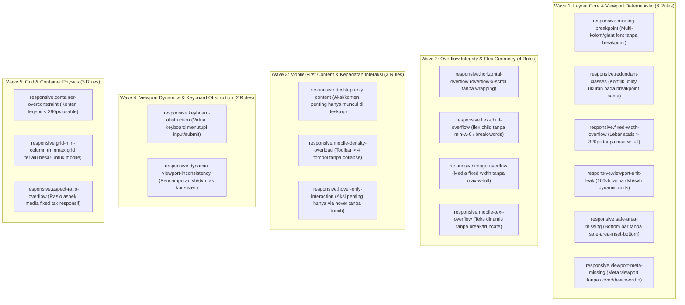

# EXPANSION-BATCH-04: Responsive Layout & Viewport Integrity Standards (`responsive.*`)
> **Kode Dokumen:** `SPEC-EXP-04-RESPONSIVE`
> **Kategori:** `responsive`
> **Pilar:** `01-SPEC` (WHAT - Spesifikasi Perilaku & Kontrak Rule)
> **Status:** Active Expansion Specification (18 Aturan Terkurasi Bebas Redundansi Linter Standar)
> **Standar Rujukan:**
> - W3C CSS Values and Units Module Level 4 (Small/Dynamic Viewport Units: `svh`, `dvh`)
> - W3C CSS Mobile Safe Area Insets (`env(safe-area-inset-*)`)
> - HTML Living Standard Section 4.2.5 (Viewport Meta & `interactive-widget`)
> - Mobile-First Responsive Breakpoint Architecture (Tailwind CSS `sm:`, `md:`, `lg:`)
> - W3C CSS Grid Layout Module Level 2 & CSS Container Queries

---

## 1. Ikhtisar Kategori `responsive` (18 Aturan Non-Redundan)

> **Prinsip Eliminasi Redundansi:** Linter kode JavaScript/TypeScript konvensional (ESLint) **hanya melihat string class Tailwind sebagai token teks buram (*opaque string*)**. ESLint tidak memiliki kalkulator box model untuk mengetahui apakah `grid-cols-4` akan pecah di layar ponsel 360px, apakah `100vh` akan memicu layout jump di Safari iOS, atau apakah `fixed bottom-0` akan terpotong oleh Home Indicator iPhone.
>
> Seluruh aturan di dalam kategori ini berfokus pada **integritas layout fisik, kestabilan viewport mobile, dan pencegahan kebocoran horizontal (*horizontal overflow*)** yang mustahil dideteksi oleh linter konvensional. Aturan ukuran target sentuh didelegasikan secara kanonikal ke `a11y.touch-target-size` dan `a11y.touch-target-spacing` agar tidak terjadi duplikasi antar-kategori.



---

## 2. Spesifikasi Detail Rule `responsive.*`

### 2.1. `responsive.missing-breakpoint`
- **Asal Usul:** Warisan Legacy `charites-legacy/tailwind-checker.ts` (R4).
- **Tujuan:** Mendeteksi layout multi-kolom atau tipografi raksasa yang dideklarasikan sebagai baseline mobile tanpa breakpoint responsif.
- **Mengapa Lolos Linter Standar:** `className="grid grid-cols-4"` adalah string yang 100% valid secara sintaksis. ESLint tidak memahami bahwa kolom 4-grid pada layar 360px akan memeras konten menjadi 80px per kolom.
- **In-Scope:** Deklarasi kelas `grid-cols-3` s/d `grid-cols-12` atau heading `text-5xl` s/d `text-8xl` tanpa awalan modifier breakpoint (`sm:`, `md:`, `lg:`).
- **Bad:** `<div className="grid grid-cols-4 gap-4">`
- **Good:** `<div className="grid grid-cols-1 sm:grid-cols-2 md:grid-cols-4 gap-4">`
- **Engine:** JSX/TSX AST + Tailwind Class AST.
- **Severity:** Warning.

### 2.2. `responsive.redundant-classes`
- **Asal Usul:** Warisan Legacy `charites-legacy/tailwind-checker.ts` (R3).
- **Tujuan:** Mendeteksi instruksi ukuran bertabrakan dari famili properti CSS yang sama pada breakpoint yang sama.
- **Mengapa Lolos Linter Standar:** ESLint biasa tidak memahami mapping utility Tailwind ke properti CSS. Ekstensi IDE Tailwind hanya menyorot di editor tetapi tidak menjadi pre-commit blocker di CI/CD CLI.
- **In-Scope:** Dua atau lebih utility dari family yang sama pada breakpoint yang sama (mis. padding ganda atau font-size ganda).
- **Bad:**
  ```tsx
  <div className={clsx("p-2", "p-6", "text-sm", "text-lg")}>
  ```
- **Good:** `<div className="p-6 text-lg">`
- **Engine:** Token Geometry AST.
- **Severity:** Warning.

### 2.3. `responsive.fixed-width-overflow`
- **Tujuan:** Mencegah kebocoran horizontal pada layar smartphone sempit (320px-390px) akibat lebar kontainer statis.
- **Mengapa Lolos Linter Standar:** `w-[500px]` adalah arbitrary value yang sah di Tailwind. Linter tidak mengetahui lebar rata-rata layar smartphone dan tidak tahu apakah kontainer memiliki pembatas `max-w-full`.
- **In-Scope:** Elemen kontainer dengan lebar statis `w-[...px]` atau `min-w-[...px]` dengan nilai > 320px tanpa pembatas `max-w-full`.
- **Bad:** `<div className="w-[500px] bg-card">`
- **Good:** `<div className="w-[500px] max-w-full bg-card">`
- **Good:** `<div className="w-full md:w-[500px]">`
- **Engine:** Token Geometry AST.
- **Severity:** Error.

### 2.4. `responsive.viewport-unit-leak`
- **Tujuan:** Mengurangi layout jump pada browser mobile ketika address bar atau toolbar muncul/menghilang saat layar digulir.
- **Mengapa Lolos Linter Standar:** `h-screen` (`100vh`) adalah utility standar Tailwind yang valid secara CSS spec level 3. Linter biasa tidak mengetahui standar CSS Values Level 4 (`100dvh` / `100svh`).
- **In-Scope:** Elemen layout utama yang menggunakan `h-screen`, `min-h-screen`, `h-[100vh]`, atau `min-h-[100vh]` tanpa dynamic units (`dvh`/`svh`).
- **Bad:** `<main className="min-h-screen">`
- **Good:** `<main className="min-h-[100dvh]">`
- **Good:** `<main className="min-h-svh">`
- **Engine:** JSX/TSX AST + CSS AST.
- **Severity:** Warning.

### 2.5. `responsive.safe-area-missing`
- **Tujuan:** Mencegah bilah navigasi bawah (*bottom bar*) atau floating action button tertutup oleh Home Indicator perangkat iOS iPhone.
- **Mengapa Lolos Linter Standar:** `fixed bottom-0` sah di CSS. Linter biasa tidak tahu bahwa perangkat ber-notch/home-bar membutuhkan deklarasi safe area inset.
- **In-Scope:** Elemen `fixed`/`sticky` dengan posisi `bottom-0` yang tidak mempunyai deklarasi padding safe-area inset bottom (`env(safe-area-inset-bottom)`).
- **Bad:** `<nav className="fixed bottom-0 left-0 right-0 h-16">`
- **Good:** `<nav className="fixed bottom-0 left-0 right-0 pb-[env(safe-area-inset-bottom)]">`
- **Engine:** JSX/TSX AST.
- **Severity:** Warning.

### 2.6. `responsive.viewport-meta-missing`
- **Tujuan:** Memastikan root document mempunyai konfigurasi viewport yang sesuai untuk perangkat mobile dan safe-area.
- **Mengapa Lolos Linter Standar:** Linter HTML dasar hanya memeriksa ada/tidaknya tag `<meta name="viewport">`, tetapi tidak memvalidasi kehadiran token `viewport-fit=cover` untuk aplikasi modern.
- **In-Scope:** Tag meta viewport tanpa `viewport-fit=cover` atau tanpa `width=device-width`.
- **Bad:** `<meta name="viewport" content="initial-scale=1.0">`
- **Good:** `<meta name="viewport" content="width=device-width, initial-scale=1.0, viewport-fit=cover">`
- **Engine:** HTML/JSX AST.
- **Severity:** Warning.

### 2.7. `responsive.horizontal-overflow`
- **Tujuan:** Mendeteksi layout yang secara CSS valid tetapi berpotensi memicu horizontal scrolling yang merusak gestur swipe mobile.
- **Mengapa Lolos Linter Standar:** `overflow-x-scroll` sah secara CSS, namun sering dipasang tanpa pertimbangan bahwa seluruh halaman web ikut goyang ke kanan-kiri di mobile jika tidak dibungkus rapi.
- **In-Scope:** Kontainer dengan `overflow-x-scroll` atau `overflow-x-auto` tanpa strategi responsive wrapping.
- **Engine:** JSX/TSX AST + Style AST.
- **Severity:** Warning.

### 2.8. `responsive.flex-child-overflow`
- **Tujuan:** Mencegah anak flex (`flex child`) menyebabkan kontainer melebar melebihi lebar viewport karena `min-width: auto` default pada CSS Flexbox.
- **Mengapa Lolos Linter Standar:** Perilaku `min-width: auto` pada flex items adalah salah satu gotcha paling membingungkan di CSS yang sama sekali tidak dapat dideteksi oleh linter sintaksis.
- **In-Scope:** Elemen flex child yang memuat dynamic string panjang tanpa kelas peredam `min-w-0` dan `break-words`.
- **Bad:**
  ```tsx
  <div className="flex">
    <div className="w-full">
      <code>{longDynamicString}</code>
    </div>
  </div>
  ```
- **Good:**
  ```tsx
  <div className="flex">
    <div className="min-w-0 w-full break-words">
      <code>{longDynamicString}</code>
    </div>
  </div>
  ```
- **Engine:** JSX/TSX AST.
- **Severity:** Warning.

### 2.9. `responsive.image-overflow`
- **Tujuan:** Menjamin elemen media tidak menyebabkan kebocoran horizontal saat dibuka di ponsel berlayar kecil.
- **Mengapa Lolos Linter Standar:** Atribut `width={1200} height={800}` pada tag `` adalah best practice untuk Core Web Vitals (mencegah CLS), tetapi jika lupa dipasangi CSS `max-w-full h-auto`, gambar akan menabrak keluar layar.
- **In-Scope:** Tag ``, `<Image>`, `<video>` dengan atribut dimensi besar tanpa kelas `max-w-full`.
- **Bad:** ``
- **Good:** ``
- **Engine:** JSX/TSX AST.
- **Severity:** Warning.

### 2.10. `responsive.mobile-text-overflow`
- **Tujuan:** Mencegah string teks panjang tanpa spasi (seperti URL, UUID, token hash, atau email) merobek layout mobile.
- **Mengapa Lolos Linter Standar:** `{user.email}` adalah ekspresi JSX yang valid. Linter biasa tidak tahu bahwa teks dinamis tersebut dapat melebihi lebar kontainer jika tidak ada aturan word breaking.
- **In-Scope:** Kontainer teks dengan `whitespace-nowrap` atau lebar terbatas tanpa `break-words` atau `truncate`.
- **Engine:** JSX/TSX AST.
- **Severity:** Warning.

### 2.11. `responsive.desktop-only-content`
- **Tujuan:** Mendeteksi aksi penting atau navigasi utama yang hanya tersedia di breakpoint desktop (`hidden md:flex`) tanpa alternatif di layar mobile.
- **Mengapa Lolos Linter Standar:** `hidden md:flex` adalah pola Tailwind resmi. Linter biasa tidak memahami apakah tombol tersebut merupakan aksi penting (seperti "Konfirmasi Pembayaran") yang jika disembunyikan di mobile akan membuat aplikasi tidak bisa digunakan.
- **In-Scope:** Primary CTA atau navigasi penting yang disembunyikan di mobile tanpa mobile drawer/floating button.
- **Engine:** JSX/TSX AST.
- **Severity:** Error untuk aksi primer, Warning untuk konten sekunder.

### 2.12. `responsive.mobile-density-overload`
- **Tujuan:** Mencegah toolbar atau bilah aksi memadatkan terlalu banyak tombol interaktif ($> 4$ tombol) sejajar di layar smartphone 360px tanpa menu dropdown/collapse.
- **Mengapa Lolos Linter Standar:** Meletakkan 7 tombol di dalam `<div className="flex">` adalah kode yang valid secara sintaksis, namun secara fisik tombol-tombol tersebut akan saling berhimpitan dan tidak muat di layar HP.
- **In-Scope:** Sibling interactive buttons $> 4$ dalam satu baris tanpa responsive collapse pada mobile.
- **Engine:** JSX/TSX AST.
- **Severity:** Warning.

### 2.13. `responsive.hover-only-interaction`
- **Tujuan:** Mencegah fungsionalitas penting hanya dapat diakses melalui state `:hover`/`group-hover:`, yang tidak ada pada layar sentuh.
- **Mengapa Lolos Linter Standar:** `group-hover:opacity-100` adalah kelas Tailwind yang valid. Linter biasa tidak mengetahui bahwa perangkat sentuh tidak dapat memicu efek hover.
- **In-Scope:** Kontrol aksi yang disembunyikan (`opacity-0`) dan HANYA dimunculkan via `hover:` tanpa alternatif `focus-visible:` atau status tap.
- **Bad:** `<button className="opacity-0 hover:opacity-100">Hapus</button>`
- **Good:** `<button className="opacity-100 md:opacity-0 md:group-hover:opacity-100 focus-visible:opacity-100">Hapus</button>`
- **Engine:** JSX/TSX AST.
- **Severity:** Error.

### 2.14. `responsive.keyboard-obstruction`
- **Tujuan:** Mendeteksi layout form yang berisiko tertutup oleh virtual keyboard mobile saat pengguna mengetik.
- **Mengapa Lolos Linter Standar:** Tombol `fixed bottom-0` di bawah form adalah pola desktop yang umum. Pada mobile, saat keyboard virtual naik, elemen fixed bottom sering kali menutupi kotak input yang sedang aktif.
- **In-Scope:** Form di dalam kontainer `h-screen` dengan tombol `fixed bottom-0` tanpa scrollable region.
- **Engine:** JSX/TSX AST.
- **Severity:** Warning.

### 2.15. `responsive.dynamic-viewport-inconsistency`
- **Tujuan:** Mencegah pencampuran unit viewport yang saling bertentangan (`100vh` dengan `100dvh`) pada satu hierarki komponen layout.
- **Mengapa Lolos Linter Standar:** Masing-masing nilai CSS sah secara individual. Linter biasa tidak memeriksa konsistensi hierarki parent-child viewport units.
- **Engine:** Relational AST.
- **Severity:** Warning.

### 2.16. `responsive.container-overconstraint`
- **Tujuan:** Mendeteksi kombinasi constraint lebar yang menyebabkan area konten menjadi terlalu sempit di mobile ($< 280$px usable width).
- **Mengapa Lolos Linter Standar:** Mengombinasikan `w-full max-w-xs px-10` sah di Tailwind. Hanya komputasi spasial yang dapat mendeteksi bahwa pada layar 360px, padding 80px menyisakan area usable yang tidak layak.
- **Engine:** Token Geometry AST.
- **Severity:** Advisory.

### 2.17. `responsive.grid-min-column`
- **Tujuan:** Mencegah CSS grid menghasilkan horizontal overflow karena `minmax()` dengan nilai minimum kaku yang melebihi lebar layar smartphone.
- **Mengapa Lolos Linter Standar:** `grid-cols-[repeat(auto-fit,minmax(400px,1fr))]` adalah CSS valid. Linter biasa tidak tahu bahwa 400px lebih lebar dari layar iPhone SE (375px) atau Android standar (360px).
- **Bad:** `<div className="grid grid-cols-[repeat(auto-fit,minmax(400px,1fr))]">`
- **Good:** `<div className="grid grid-cols-[repeat(auto-fit,minmax(min(100%,16rem),1fr))]">`
- **Engine:** CSS/Tailwind AST.
- **Severity:** Warning.

### 2.18. `responsive.aspect-ratio-overflow`
- **Tujuan:** Mencegah rasio aspek media kaku menghasilkan tinggi yang tak terkendali atau overflow pada viewport sempit.
- **Mengapa Lolos Linter Standar:** Nilai aspect ratio statis valid secara CSS, namun memerlukan responsive boundary saat container menyusut.
- **Engine:** JSX/TSX AST.
- **Severity:** Warning.

---

## 3. Ringkasan Matriks Rule `responsive.*` (18 Aturan Non-Redundan)

| Rule ID | Fokus Invarian | Mengapa Tidak Tertangkap Linter Biasa | Severity | Engine Target |
|---|---|---|---|---|
| `responsive.missing-breakpoint` | Multi-kolom tanpa breakpoint | ESLint tidak tahu kolom grid memeras layar 360px | warning | JSX/TSX + Tailwind AST |
| `responsive.redundant-classes` | Konflik ukuran di breakpoint sama | CLI CI/CD blocker tanpa perlu Node IDE extension | warning | Token Geometry AST |
| `responsive.fixed-width-overflow` | Lebar statis > 320px tanpa pembatas | Linter biasa tidak menghitung ambang layar HP | error | Token Geometry AST |
| `responsive.viewport-unit-leak` | 100vh layout jump di mobile | Linter biasa tidak paham spesifikasi dvh/svh CSS Level 4 | warning | JSX/TSX + CSS AST |
| `responsive.safe-area-missing` | Proteksi Home Bar iPhone | Linter biasa buta terhadap notch/safe-area hardware | warning | JSX/TSX AST |
| `responsive.viewport-meta-missing` | Konfigurasi viewport-fit=cover | Linter HTML dasar hanya cek ada/tidaknya tag meta | warning | HTML/JSX AST |
| `responsive.horizontal-overflow` | Deteksi potensi overflow-x liar | Linter tidak menganalisis risiko gestur swipe mobile | warning | JSX/TSX + Style AST |
| `responsive.flex-child-overflow` | Gotcha min-width: auto pada flex child | Gotcha CSS flexbox yang tidak dideteksi linter teks | warning | JSX/TSX AST |
| `responsive.image-overflow` | Media tanpa max-w-full | Atribut width/height besar sah untuk CWV tapi bisa jebol | warning | JSX/TSX AST |
| `responsive.mobile-text-overflow` | Teks dinamis tanpa break-words | Ekspresi string dinamis valid secara tipe tapi merusak layout | warning | JSX/TSX AST |
| `responsive.desktop-only-content` | Aksi primer disembunyikan di mobile | Pola hidden md:block sah di Tailwind, tapi fatal di UX | error / warning | JSX/TSX AST |
| `responsive.mobile-density-overload` | Toolbar > 4 tombol tanpa collapse | Meletakkan banyak button sah di HTML, tapi berdesakan di HP | warning | JSX/TSX AST |
| `responsive.hover-only-interaction` | Affordance aksi hanya via hover | Kelas hover valid di Tailwind, tapi non-existent di touch | error | JSX/TSX AST |
| `responsive.keyboard-obstruction` | Submit fixed menutupi input aktif | Linter tidak menganalisis kenaikan virtual keyboard | warning | JSX/TSX AST |
| `responsive.dynamic-viewport-inconsistency` | Hierarki viewport unit bentrok | Linter biasa tidak membandingkan unit parent vs child | warning | Relational AST |
| `responsive.container-overconstraint` | Konten terjepit < 280px | Butuh kalkulasi total lebar dikurangi padding | advisory | Token Geometry AST |
| `responsive.grid-min-column` | minmax grid kaku > lebar ponsel | CSS minmax 400px sah secara sintaksis, jebol di layar 360px | warning | CSS/Tailwind AST |
| `responsive.aspect-ratio-overflow` | Rasio aspek media tak responsif | Aspek rasio statis tidak memperhitungkan viewport sempit | warning | JSX/TSX AST |

---

## 4. Cross-Reference Delegasi Kanonikal

Untuk mencegah duplikasi antar-kategori (*zero redundancy*), aturan-aturan terkait kontrol interaktif dan ergonomi fisik sentuh didelegasikan secara kanonikal:
- **Ukuran target sentuh ($\ge 44	ext{px}$):** Didelegasikan ke `a11y.touch-target-size` & `ergonomy.touch-target-too-small`.
- **Jarak aman miss-tap ($\ge 8	ext{px}$):** Didelegasikan ke `a11y.touch-target-spacing`.
- **Keyboard virtual contextual inputmode:** Didelegasikan ke `ergonomy.missing-inputmode-keyboard`.
