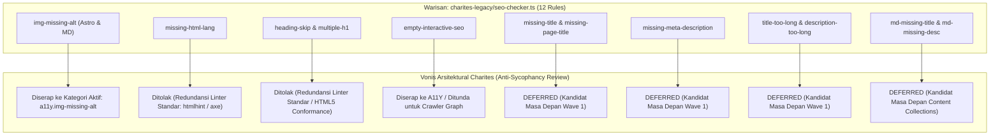
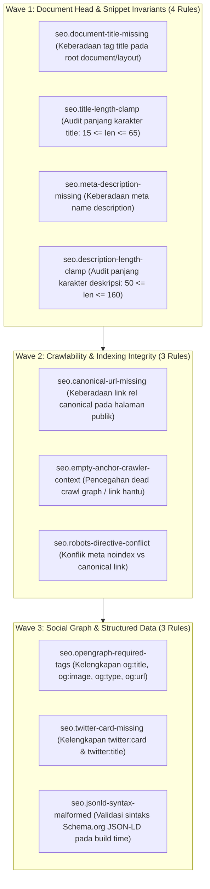

# EXPANSION-BATCH-12: Search Engine Optimization & Document Metadata Standards (`seo.*`) [DEFERRED]
> **Kode Dokumen:** `SPEC-EXP-12-SEO`
> **Kategori:** `seo` (Search Engine Optimization, Document Metadata, Crawlability & Social Graph; Alias CLI: `seo`)
> **Pilar:** `01-SPEC` (WHAT - Spesifikasi Perilaku & Kontrak Rule)
> **Status:** **DEFERRED (Ditunda / Tidak Diimplementasikan pada Milestone Saat Ini)**
> **Migrasi Sumber:** [`charites-legacy/seo-checker.ts`](file:///home/will/Monorepo/charites/charites-legacy/seo-checker.ts)
> **Standar Rujukan:**
> - Google Search Central: Google Search Essentials, SEO Starter Guide & Structured Data (Schema.org / JSON-LD)
> - W3C HTML Living Standard (Metadata Content, Document Head & Link Relations)
> - The Open Graph Protocol (`og:*`) & Twitter / X Cards Specifications
> - W3C Web Content Accessibility Guidelines (WCAG) 2.2 SC 2.4.2 (Page Titled - Level A)
> - Robots Exclusion Protocol (RFC 9309 / `robots.txt` & `<meta name="robots">`)
> **Pilar Terkait:** [01-SPEC: a11y.md](a11y.md), [01-SPEC: performance.md](performance.md), [01-SPEC: lcp.md](lcp.md), & [01-SPEC: themes.md](themes.md)

---

## 1. Status Dokumen: Penjelasan Formal Penundaan (DEFERRED Rationale)

Dokumen ini mendokumentasikan spesifikasi arsitektur ekspansi domain **SEO & Metadata Dokumen** (`seo.*`) yang diadaptasi dari skrip warisan [`charites-legacy/seo-checker.ts`](file:///home/will/Monorepo/charites/charites-legacy/seo-checker.ts).

> **PERNYATAAN RESMI STATUS: DEFERRED**
> Seluruh aturan di dalam dokumen ini berstatus **DITUNDA (DEFERRED)** dan **TIDAK DIIMPLEMENTASIKAN** pada compiler engine Go Charites (`internal/rules/`) untuk milestone saat ini. Kategori ini dicatat sebagai cetak biru spesifikasi masa depan (*future architectural blueprint*) dan panduan eliminasi redundansi terhadap linter eksternal.



### 1.1. Mengapa Kategori `seo.*` Berstatus DEFERRED?
Penetapan status **DEFERRED** didasarkan pada 5 pilar evaluasi independen (*Evidence-Guided Decision*):

1. **Fokus Inti Charites pada Desain & Runtime Engine:**
   Charites dirancang secara khusus untuk memvalidasi:
   - Integritas token desain visual (`theme.*`)
   - Geometri dan keterbacaan tata letak responsif (`responsive.*`, `ergonomy.*`)
   - Friksi interaksi dan beban kognitif pengguna (`ux.*`)
   - Kompatibilitas multi-browser rendering engine (`browser.*`)
   - Standar instalabilitas dan offline caching PWA (`pwa.*`)
   - Stabilitas rendering dan responsivitas Core Web Vitals (`cls.*`, `inp.*`, `lcp.*`)
   - Optimalisasi arsitektur kompilasi framework (`performance.*`)

   Semua domain di atas menyangkut **pengalaman visual interaktif manusia (*user-facing UX*), alokasi memori, stabilitas tata letak, dan kinerja kompilasi bundler**. Validasi metadata SEO murni adalah domain audit dokumen statis (*document header linting*) yang memiliki urgensi runtime lebih rendah.

2. **Ketiadaan Engine Parser Markdown / MDX AST di Charites:**
   Infrastruktur parser Charites saat ini (`internal/parser/`) secara ketat dioptimasi untuk tiga domain target:
   - `internal/parser/astro/` (Template HTML & Frontmatter Script Astro)
   - `internal/parser/tsx/` (React JSX/TSX Tree)
   - `internal/parser/css/` (Tailwind CSS v4 Oxide AST)

   Charites **belum memiliki parser AST untuk berkas Markdown (`.md`) maupun MDX (`.mdx`)**. Menambahkan dukungan parsing CommonMark/GFM AST murni untuk mengevaluasi frontmatter dan alt-text markdown akan:
   - Memperbesar footprint biner CLI secara signifikan tanpa kontribusi langsung ke kompilasi frontend/desain.
   - Menuntut pemeliharaan parser baru dengan target alokasi memori ketat (`0 allocs/op`), yang berada di luar peta jalan (*roadmap*) saat ini.

3. **Eliminasi Redundansi terhadap Ekosistem Linter Standar:**
   Banyak aturan pada skrip warisan `seo-checker.ts` menduplikasi fungsi dasar linter konvensional:
   - `img-missing-alt`: Sudah diserap secara penuh ke dalam [`a11y.img-missing-alt`](a11y.md) (1-SSOT).
   - `missing-html-lang`: Masalah kepatuhan HTML dasar yang sudah ditangkap 100% oleh parser HTML standar (`htmlhint`, `markuplint`, ESLint `jsx-a11y/html-has-lang`).
   - `heading-skip` dan `multiple-h1`: Aturan outline heading klasik yang sudah menjadi standar bawaan `axe-core` dan linter HTML. Selain itu, pada arsitektur berbasis komponen (*component-driven UI*), aturan hierarki heading murni statis menghasilkan tingkat *false positive* yang sangat tinggi ketika komponen terisolasi (misal: `CardHeader`) dirender pada berbagai konteks halaman berbeda.

4. **Kerapuhan Naive Regex pada Skrip Warisan:**
   Skrip warisan `seo-checker.ts` menggunakan pencocokan regex teks mentah sederhana:
   ```typescript
   // Pola warisan yang rapuh di charites-legacy/seo-checker.ts:
   const hasLayoutWithTitle =
     /<(?:PublicLayout|AdminLayout|Layout|RootLayout|BaseLayout|[A-Za-z0-9]*Layout)\b[\s\S]*?\btitle=/i.test(raw) ||
     /<title[\s\S]*?>/i.test(raw);
   ```
   Pendekatan ini memiliki kelemahan kritis:
   - **False Positives:** Mempermasalahkan halaman yang memuat metadata via wrapper kustom, high-order components, atau Astro Frontmatter props terpusat (`Astro.props`).
   - **False Negatives:** Menganggap valid jika atribut `title=""` (string kosong), `title={undefined}`, atau `title={null}` diberikan.
   - Mengimplementasikan aturan ini secara benar dalam Go AST compiler membutuhkan pelacakan *prop flow* lintas komponen yang kompleks dan membebani kompilasi tanpa memberikan pengembalian performa runtime yang signifikan.

5. **Ketersediaan Solusi Bawaan Framework (Astro Content Collections):**
   Untuk berkas Markdown/MDX (`md-missing-title`, `title-too-long`, `md-missing-description`), Astro telah menyediakan mekanisme native **Content Collections dengan skema Zod** (`src/content/config.ts`). Validasi skema tipe statis bawaan Astro jauh lebih aman, tipe-terjamin, dan tidak memerlukan linter eksternal terpisah.

---

## 2. Kriteria Pembatalan Penundaan (Un-deferral Criteria & Triggers)

Kategori `seo.*` HANYA akan dipertimbangkan untuk dibuka (*un-deferred*) dan diimplementasikan ke dalam kode Go (`internal/rules/seo/`) jika seluruh kondisi pemicu berikut terpenuhi:

| ID | Kondisi Pemicu (*Trigger Condition*) | Ambang Batas Verifikasi (*Verification Threshold*) |
|:---:|:---|:---|
| **TR-01** | Penyelesaian Penuh 11 Batch Aktif | Seluruh rule pada 11 batch aktif (`theme`, `a11y`, `ux`, `responsive`, `browser`, `pwa`, `ergonomy`, `cls`, `inp`, `lcp`, `performance`) telah selesai diimplementasikan, melewati Tri-Corpus, dan lulus benchmark 0 allocs/op. |
| **TR-02** | Ketersediaan Markdown/MDX AST Parser | Tersedianya engine `internal/parser/markdown/` yang memenuhi standar performa Charites (zero memory leak & zero unnecessary allocation). |
| **TR-03** | Ketiadaan Redundansi dengan Astro Content Collections | Standarisasi validasi metadata Markdown dilakukan murni via skema `zod` Astro, dan Charites HANYA menangani pelanggaran template AST tingkat tinggi. |
| **TR-04** | Pembuktian Nilai Tambah Statis Unik (*Novel AST Value*) | Rule yang diajukan terbukti tidak dapat dideteksi oleh `htmlhint`, `axe-core`, atau Google Lighthouse CI (misal: deteksi konflik kanonikal lintas-rute monorepo atau payload JSON-LD Schema.org malformed pada build time). |
| **TR-05** | Konsensus Arsitektur Repositori | Persetujuan formal tim inti Charites untuk memperluas lingkup biner CLI ke evaluasi SERP & Crawler Graph. |

---

## 3. Matriks Rekonsiliasi Aturan Warisan (`charites-legacy/seo-checker.ts`)

Berikut adalah audit lengkap 12 aturan yang ada pada skrip warisan [`charites-legacy/seo-checker.ts`](file:///home/will/Monorepo/charites/charites-legacy/seo-checker.ts), status penanganannya di Charites, serta alasan keputusan teknis:

| Aturan Warisan (`seo-checker.ts`) | Severity Asal | Status di Charites | Kategori / Tindakan Resmi | Alasan Keputusan Arsitektural |
|---|:---:|:---:|---|---|
| `img-missing-alt` (Astro ``, `<Image>`) | `error` | **DISERAP** | `a11y.img-missing-alt` | **Single Source of Truth (1-SSOT)**. Validasi atribut `alt` pada elemen gambar adalah domain murni aksesibilitas web. Sudah aktif di spesifikasi [`a11y.md`](a11y.md). |
| `img-missing-alt` (Markdown ``) | `warn` | **DISERAP** | `a11y.img-missing-alt` | Evaluasi sintaksis gambar Markdown tanpa alt diserap ke dalam engine parser MDX pada domain aksesibilitas. |
| `missing-html-lang` | `error` | **DITOLAK** | Diserahkan ke Linter HTML Standar | Redundansi 100% dengan `htmlhint` (`html-lang`), `markuplint`, dan ESLint `jsx-a11y/html-has-lang`. Bukan domain pembeda Charites. |
| `heading-skip` | `warn` | **DITOLAK** | Diserahkan ke Linter HTML Standar | Hierarki heading adalah checklist HTML standar. Pada arsitektur komponen modern, evaluasi statis per-file menghasilkan *noise* tinggi pada komponen modular. |
| `multiple-h1` | `warn` | **DITOLAK** | Diserahkan ke Linter HTML Standar | Redundansi dengan linter HTML klasik. HTML5 Living Standard memperbolehkan multi-`<h1>` pada konteks `<section>`/`<article>` yang terisolasi. |
| `missing-title` (Layout Astro) | `error` | **DEFERRED** | Calon `seo.document-title-missing` | Ditunda. Di masa depan dapat diintegrasikan sebagai validasi keberadaan tag `<title>` pada template layout root. |
| `missing-page-title` (Halaman Daun) | `error` | **DEFERRED** | Calon `seo.page-layout-title-missing` | Ditunda. Implementasi warisan via regex sangat rapuh; membutuhkan AST prop-binding analysis yang saat ini di luar lingkup. |
| `missing-meta-description` (Layout Astro)| `warn` | **DEFERRED** | Calon `seo.meta-description-missing` | Ditunda. Memvalidasi ketersediaan deskripsi dokumen pada head template. |
| `title-too-long` (> 65 karakter) | `warn` | **DEFERRED** | Calon `seo.title-length-clamp` | Ditunda. Audit pembatasan panjang judul dokumen untuk mencegah pemotongan SERP Google. |
| `description-too-long` (> 160 karakter) | `warn` | **DEFERRED** | Calon `seo.description-length-clamp` | Ditunda. Audit pembatasan panjang meta deskripsi agar tidak terpotong di hasil pencarian. |
| `md-missing-title` (Frontmatter) | `error` | **DEFERRED** | Calon `seo.frontmatter-missing-title` | Ditunda. Direkomendasikan diserahkan ke Astro Content Collections (`zod.string()`). |
| `md-missing-description` (Frontmatter) | `warn` | **DEFERRED** | Calon `seo.frontmatter-missing-desc` | Ditunda. Direkomendasikan diserahkan ke Astro Content Collections (`zod.string()`). |
| `empty-interactive-seo` (`<a>` kosong) | `warn` | **DEFERRED** | Calon `seo.empty-anchor-crawler-context`| Ditunda. Anchor tanpa konteks teks merusak *crawl graph* bot pencari; sebagian beririsan dengan `a11y` namun memiliki konteks SEO PageRank. |

---

## 4. Cetak Biru Konseptual Rule `seo.*` (Arsitektur Jika Diaktifkan)

Jika di masa depan kriteria pembatalan penundaan terpenuhi, domain `seo.*` akan distrukturkan ke dalam **3 Wave Terkalibrasi (10 Aturan Spesifik Tanpa Redundansi)**:



### 4.1. Ringkasan Matriks Calon Rule `seo.*`

| Wave | Rule ID | Migrasi Legacy | Domain Parser | Severity Usulan | Rationale Mesin Pencari |
|:---:|:---|:---:|:---|:---:|:---|
| **W1** | `seo.document-title-missing` | R1 (Layout) & R2 (Page) | Astro / HTML AST | `error` | Google SERP mewajibkan judul unik untuk setiap URL terindeks. |
| **W1** | `seo.title-length-clamp` | `title-too-long` | AST String Literal | `warning` | Mencegah pemotongan judul pada layar desktop/mobile Google Search. |
| **W1** | `seo.meta-description-missing`| `missing-meta-description`| Astro / HTML AST | `warning` | Snippet deskripsi menentukan CTR (*Click-Through Rate*) pada hasil pencarian. |
| **W1** | `seo.description-length-clamp`| `description-too-long` | AST String Literal | `warning` | Mencegah terpotongnya deskripsi melebihi kuota 160 karakter SERP. |
| **W2** | `seo.canonical-url-missing` | Baru | Astro / HTML AST | `warning` | Mencegah isu konten duplikat (*duplicate content penalty*) antar varian URL. |
| **W2** | `seo.empty-anchor-crawler-context`| `empty-interactive-seo` | Astro / JSX AST | `warning` | Bot perayap (Googlebot) tidak dapat mengatribusikan nilai PageRank pada link kosong. |
| **W2** | `seo.robots-directive-conflict`| Baru | Astro / HTML AST | `error` | Mencegah kontradiksi fatal: menandai `noindex` pada halaman yang memiliki canonical referensi. |
| **W3** | `seo.opengraph-required-tags` | Baru | Astro / HTML AST | `warning` | Memastikan preview kartu kaya saat tautan dibagikan ke platform media sosial. |
| **W3** | `seo.twitter-card-missing` | Baru | Astro / HTML AST | `info` | Menjamin kompatibilitas format kartu tampilan pada platform Twitter/X. |
| **W3** | `seo.jsonld-syntax-malformed` | Baru | JSON Script AST | `error` | Schema.org malformed menyebabkan rich snippet gagal diekstraksi mesin pencari. |

---

## 5. Spesifikasi Detail Kontrak Formal Calon Rule (Cetak Biru Masa Depan)

Bagian ini mendokumentasikan spesifikasi predikat invarian formal untuk calon rule jika sewaktu-waktu diaktifkan kembali.

---

### 5.1. `seo.document-title-missing`
- **Design Rationale:** Google Search Essentials & WCAG 2.2 SC 2.4.2.
- **Konteks Mesin Pencari:**
  Setiap dokumen HTML yang ditujukan untuk perayapan publik wajib memiliki elemen `<title>` yang tidak kosong di dalam `<head>`. Ketiadaan elemen ini menyebabkan mesin pencari membuat judul otomatis dari konten acak halaman yang sering kali tidak relevan dan menurunkan CTR.
- **Invariant (Predikat AST):**
  Untuk setiap dokumen root HTML/Layout $\mathcal{D}$ pada rute publik:
  $$\neg \exists h \in \text{Head}(\mathcal{D}) : (h.\text{Tag} = \text{"title"} \land \text{len}(\text{Trim}(h.\text{TextContent})) > 0) \implies \text{Violation (Error)}$$
- **Suspicious:**
  ```html
  <!-- Layout root tanpa elemen <title> -->
  <html>
    <head>
      <meta charset="utf-8" />
    </head>
    <body><slot /></body>
  </html>
  ```
- **Compliant:**
  ```astro
  ---
  const { title } = Astro.props;
  ---
  <html>
    <head>
      <meta charset="utf-8" />
      <title>{title ? `${title} | Sistem Informasi Desa` : "Sistem Informasi Desa"}</title>
    </head>
    <body><slot /></body>
  </html>
  ```

---

### 5.2. `seo.title-length-clamp`
- **Design Rationale:** Google SERP Pixel Width & Character Clamp Guidelines.
- **Konteks Mesin Pencari:**
  Google memotong judul dokumen pada hasil pencarian desktop dan mobile jika melebihi ~600 piksel (sekitar 60-65 karakter). Judul yang terlalu pendek (< 15 karakter) sering kali dianggap *low-quality* atau tidak deskriptif.
- **Invariant (Predikat AST):**
  Untuk setiap ekspresi literal judul $\mathcal{T} \in \text{DocumentTitles}$:
  $$\text{IsStaticLiteral}(\mathcal{T}) \land (\text{len}(\mathcal{T}) < 15 \lor \text{len}(\mathcal{T}) > 65) \implies \text{Violation (Warning)}$$
- **Suspicious:**
  ```html
  <!-- Judul terlalu panjang (88 karakter) -> Terpotong di Google SERP -->
  <title>Layanan Administrasi Kependudukan Surat Pengantar Desa Maju Makmur Terpadu dan Terpercaya</title>
  ```
- **Compliant:**
  ```html
  <!-- Judul optimal (44 karakter) -->
  <title>Layanan Surat Pengantar - Desa Maju Makmur</title>
  ```

---

### 5.3. `seo.meta-description-missing`
- **Design Rationale:** Google Search Central: Control your snippets in search results.
- **Konteks Mesin Pencari:**
  Meskipun meta description bukan faktor peringkat langsung (*direct ranking factor*), deskripsi ini adalah penentu utama *snippet preview* yang dibaca manusia di halaman hasil pencarian. Ketiadaan meta deskripsi memaksa Google merangkai potongan teks acak dari body dokumen.
- **Invariant (Predikat AST):**
  Untuk setiap template layout root $\mathcal{D}$:
  $$\neg \exists m \in \text{MetaTags}(\mathcal{D}) : (m.\text{Name} = \text{"description"} \land \text{len}(\text{Trim}(m.\text{Content})) > 0) \implies \text{Violation (Warning)}$$
- **Suspicious:**
  ```html
  <head>
    <title>Profil Desa - Portal Resmi</title>
    <!-- Tidak ada meta name="description" -->
  </head>
  ```
- **Compliant:**
  ```html
  <head>
    <title>Profil Desa - Portal Resmi</title>
    <meta name="description" content="Portal informasi resmi dan pelayanan administrasi kependudukan terpadu warga Desa digital." />
  </head>
  ```

---

### 5.4. `seo.description-length-clamp`
- **Design Rationale:** Search Engine Snippet Display Capacity (Desktop & Mobile SERP).
- **Konteks Mesin Pencari:**
  Panjang ideal meta description berkisar antara 50 hingga 160 karakter. Deskripsi di bawah 50 karakter dinilai terlalu dangkal, sedangkan deskripsi di atas 160 karakter akan dipotong dengan elipsis (`...`) oleh mesin pencari.
- **Invariant (Predikat AST):**
  Untuk setiap nilai atribut content pada meta description $\mathcal{M}$:
  $$\text{IsStaticLiteral}(\mathcal{M}.\text{Content}) \land (\text{len}(\mathcal{M}.\text{Content}) < 50 \lor \text{len}(\mathcal{M}.\text{Content}) > 160) \implies \text{Violation (Warning)}$$
- **Suspicious:**
  ```html
  <!-- Deskripsi 195 karakter -> Terpotong di Google mobile snippet -->
  <meta name="description" content="Selamat datang di website resmi desa kami yang menyediakan berbagai informasi terkini mengenai kegiatan masyarakat, transparansi anggaran desa, layanan administrasi surat, dan potensi agrowisata lokal." />
  ```
- **Compliant:**
  ```html
  <!-- Deskripsi 124 karakter (ideal) -->
  <meta name="description" content="Website resmi penyedia layanan administrasi kependudukan, informasi anggaran, dan pengumuman kegiatan warga Desa digital." />
  ```

---

### 5.5. `seo.canonical-url-missing`
- **Design Rationale:** Google Search Central: Consolidate duplicate URLs (RFC 6596).
- **Konteks Mesin Pencari:**
  Pada web modern dengan routing fleksibel (trailing slash, query parameters, tracking UTM), tag `<link rel="canonical" href="...">` sangat krusial untuk memberi tahu crawler halaman mana yang merupakan sumber otoritatif, mencegah kanibalisasi peringkat SEO akibat konten duplikat.
- **Invariant (Predikat AST):**
  Untuk setiap halaman root layout $\mathcal{D}$:
  $$\neg \exists l \in \text{LinkTags}(\mathcal{D}) : (l.\text{Rel} = \text{"canonical"} \land \text{len}(l.\text{Href}) > 0) \implies \text{Violation (Warning)}$$
- **Suspicious:**
  ```html
  <head>
    <title>Berita Desa Terkini</title>
    <!-- Tidak ada rel="canonical" -->
  </head>
  ```
- **Compliant:**
  ```html
  <head>
    <title>Berita Desa Terkini</title>
    <link rel="canonical" href="https://desa.id/berita" />
  </head>
  ```

---

### 5.6. `seo.empty-anchor-crawler-context`
- **Design Rationale:** Google Search Essentials (Link Best Practices for Google) & WCAG 2.2 SC 2.4.4.
- **Konteks Mesin Pencari:**
  Tautan `<a>` tanpa teks jangkar (*anchor text*), tanpa atribut `aria-label`, dan tanpa elemen visual dengan teks alternatif (misal ``) adalah tautan buntu bagi crawler web. Crawler tidak dapat mengasosiasikan topik halaman tujuan dengan tautan perujuk, merusak topologi grafik PageRank internal.
- **Invariant (Predikat AST):**
  Untuk setiap elemen anchor $\mathcal{A}$:
  $$\text{IsEmptyText}(\mathcal{A}) \land \neg \text{HasAriaLabel}(\mathcal{A}) \land \neg \text{HasAltChild}(\mathcal{A}) \implies \text{Violation (Warning)}$$
- **Suspicious:**
  ```tsx
  {/* Merusak perayapan bot & screen reader */}
  <a href="/profil">
    <span className="icon-arrow" />
  </a>
  ```
- **Compliant:**
  ```tsx
  {/* Dilengkapi label yang dapat dibaca oleh crawler dan pembaca layar */}
  <a href="/profil" aria-label="Lihat Profil Desa Lengkap">
    <span className="icon-arrow" aria-hidden="true" />
  </a>
  ```

---

### 5.7. `seo.robots-directive-conflict`
- **Design Rationale:** Google Search Central: Robots meta tag and X-Robots-Tag specifications.
- **Konteks Mesin Pencari:**
  Salah satu kesalahan arsitektur SEO terberat adalah memasang tag `<meta name="robots" content="noindex">` secara bersamaan dengan penunjukan `<link rel="canonical" href="...">` yang mengarah ke halaman itu sendiri, atau menyertakan `noindex` pada halaman penting yang tercantum di `sitemap.xml`. Hal ini menimbulkan sinyal paradoksal bagi Googlebot.
- **Invariant (Predikat AST):**
  Untuk setiap dokumen $\mathcal{D}$:
  $$\text{HasMetaRobotsNoindex}(\mathcal{D}) \land \text{HasSelfCanonical}(\mathcal{D}) \implies \text{Violation (Error)}$$
- **Suspicious:**
  ```html
  <head>
    <!-- Konflik sinyal: Minta tidak diindeks tetapi mendeklarasikan diri sebagai kanonikal utama -->
    <meta name="robots" content="noindex, follow" />
    <link rel="canonical" href="https://desa.id/layanan" />
  </head>
  ```
- **Compliant:**
  ```html
  <head>
    <!-- Bebas konflik: Halaman kanonikal diizinkan untuk diindeks -->
    <meta name="robots" content="index, follow" />
    <link rel="canonical" href="https://desa.id/layanan" />
  </head>
  ```

---

### 5.8. `seo.opengraph-required-tags`
- **Design Rationale:** The Open Graph Protocol (`og:*`) & Social Card Validator Standards.
- **Konteks Mesin Pencari & Sosial:**
  Saat tautan dibagikan di WhatsApp, Telegram, Facebook, atau LinkedIn, parser Open Graph mencari empat elemen wajib: `og:title`, `og:type`, `og:image`, dan `og:url`. Ketiadaan salah satu dari elemen ini menyebabkan kartu pratinjau rusak atau hanya menampilkan teks mentah tanpa visual.
- **Invariant (Predikat AST):**
  Untuk setiap template halaman yang mengaktifkan Open Graph:
  $$\neg \text{hasOgTitle} \lor \neg \text{hasOgType} \lor \neg \text{hasOgImage} \lor \neg \text{hasOgUrl} \implies \text{Violation (Warning)}$$
- **Suspicious:**
  ```html
  <head>
    <!-- Hanya mendefinisikan og:title, hilang og:image dan og:url -->
    <meta property="og:title" content="Portal Desa Digital" />
  </head>
  ```
- **Compliant:**
  ```html
  <head>
    <meta property="og:title" content="Portal Desa Digital" />
    <meta property="og:type" content="website" />
    <meta property="og:url" content="https://desa.id" />
    <meta property="og:image" content="https://desa.id/og-image.jpg" />
  </head>
  ```

---

### 5.9. `seo.twitter-card-missing`
- **Design Rationale:** Twitter Developer Platform: Cards Markup Reference.
- **Konteks Mesin Pencari & Sosial:**
  Format kartu Twitter/X membutuhkan deklarasi spesifik `twitter:card` (misal `summary_large_image`) untuk menentukan mode rendering kartu.
- **Invariant (Predikat AST):**
  $$\text{HasSocialTags}(\mathcal{D}) \land \neg \exists m \in \text{MetaTags}(\mathcal{D}) : (m.\text{Name} = \text{"twitter:card"}) \implies \text{Violation (Info)}$$
- **Suspicious:**
  ```html
  <head>
    <meta property="og:title" content="Kabar Desa" />
    <!-- Hilang twitter:card -->
  </head>
  ```
- **Compliant:**
  ```html
  <head>
    <meta property="og:title" content="Kabar Desa" />
    <meta name="twitter:card" content="summary_large_image" />
    <meta name="twitter:title" content="Kabar Desa" />
  </head>
  ```

---

### 5.10. `seo.jsonld-syntax-malformed`
- **Design Rationale:** Google Search Central: Structured Data General Guidelines & Schema.org.
- **Konteks Mesin Pencari:**
  Data terstruktur yang disisipkan melalui `<script type="application/ld+json">` harus berupa format JSON valid dan mematuhi skema Schema.org (memiliki `@context: "https://schema.org"` dan `@type`). JSON sintaksis cacat atau hilang konteks menyebabkan Googlebot membuang seluruh metadata terstruktur.
- **Invariant (Predikat AST):**
  Untuk setiap elemen script JSON-LD $\mathcal{S}$:
  $$\neg \text{IsValidJSON}(\mathcal{S}.\text{Content}) \lor \neg \text{HasSchemaContext}(\mathcal{S}) \lor \neg \text{HasSchemaType}(\mathcal{S}) \implies \text{Violation (Error)}$$
- **Suspicious:**
  ```html
  <!-- Hilang @context dan @type wajib Schema.org -->
  <script type="application/ld+json">
    {
      "name": "Pemerintah Desa Maju",
      "telephone": "+628123456789"
    }
  </script>
  ```
- **Compliant:**
  ```html
  <script type="application/ld+json">
    {
      "@context": "https://schema.org",
      "@type": "GovernmentOrganization",
      "name": "Pemerintah Desa Maju",
      "telephone": "+628123456789",
      "url": "https://desa.id"
    }
  </script>
  ```

---

## 6. Matriks Ortogonalitas Lintas Kategori (Mencegah Tumpang Tindih)

Tabel berikut membuktikan batas pemisah yang tegas antara domain `seo.*` (jika diaktifkan) dengan kategori aktif Charites lainnya:

| Calon Rule `seo.*` | Rule Kategori Lain Terdekat | Batas Pemisah Domain (*Orthogonality Boundary*) |
|---|---|---|
| `seo.empty-anchor-crawler-context` | `a11y.empty-interactive-element` | Kategori `a11y` memvalidasi fokus keyboard dan pengumuman *screen reader* (WCAG SC 4.1.2). Domain `seo` memvalidasi kelayakan penelusuran struktur grafik PageRank oleh bot mesin pencari. |
| `seo.document-title-missing` | `a11y.page-titled` (WCAG 2.4.2) | Kategori `a11y` memeriksa orientasi navigasi pengguna disabilitas. Domain `seo` memeriksa ketersediaan judul teroptimasi SERP pada rute publik yang diindeks. |
| `seo.opengraph-required-tags` | `pwa.apple-meta-missing` | `pwa` memvalidasi meta tag ikon instalasi OS lokal (`apple-touch-icon`). Domain `seo` memvalidasi protokol kartu preview platform pihak ketiga di web luar. |
| `seo.canonical-url-missing` | `lcp.missing-critical-origin-hint` | `lcp` memvalidasi petunjuk preconnect jaringan untuk kecepatan muat. Domain `seo` memvalidasi konsolidasi identitas kanonikal URL mesin pencari. |

---

## 7. Panduan Transisi: Rekomendasi Ekosistem untuk Kebutuhan Saat Ini

Mengingat kategori `seo.*` berstatus **DEFERRED** pada compiler Charites saat ini, pengembang dan tim proyek direkomendasikan mengadopsi pola-pola standar industri berikut:

1. **Astro Content Collections (Untuk Markdown/MDX):**
   Gunakan validasi skema native Astro di `src/content/config.ts` untuk mengaudit frontmatter secara statis saat build:
   ```typescript
   import { defineCollection, z } from "astro:content";

   const posts = defineCollection({
     schema: z.object({
       title: z.string().min(15, "Judul terlalu pendek").max(65, "Judul melebihi batas SERP Google"),
       description: z.string().min(50, "Deskripsi terlalu pendek").max(160, "Deskripsi melebihi kuota snippet"),
       image: z.string().optional(),
     }),
   });

   export const collections = { posts };
   ```

2. **Komponen Header Terpusat (`BaseHead.astro`):**
   Satukan seluruh deklarasi `<title>`, `<meta name="description">`, `<link rel="canonical">`, dan tag OpenGraph dalam satu komponen terpusat yang reusable, alih-alih menuliskannya berulang di setiap template.

3. **Gunakan Linter Aksesibilitas Resmi Charites:**
   Untuk masalah atribut gambar (`alt`) dan elemen interaktif tanpa label, gunakan rule aktif yang telah teruji:
   - `a11y.img-missing-alt` (menggantikan seluruh kebutuhan `img-missing-alt` legacy).
