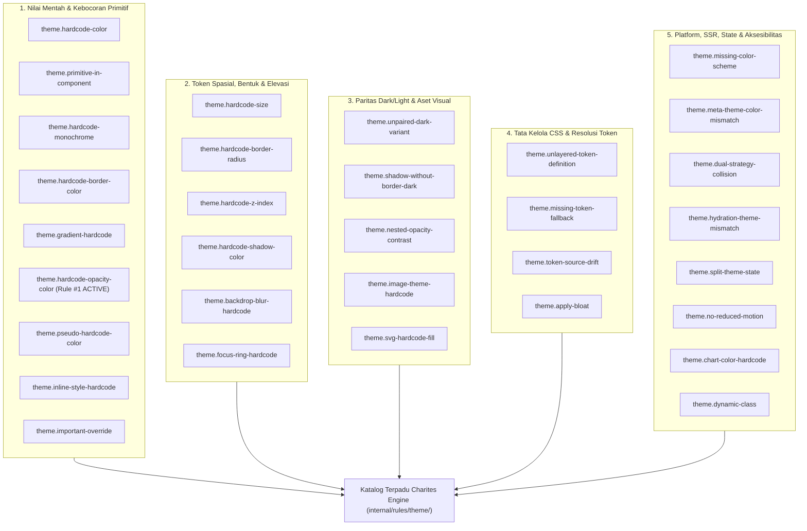
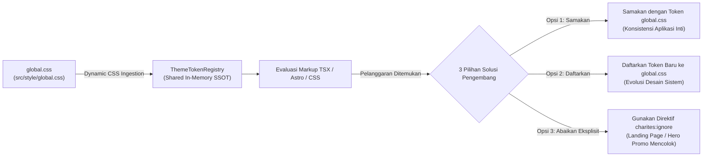
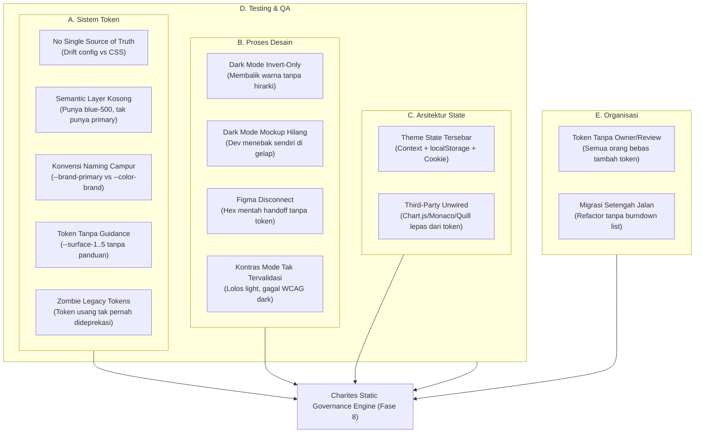
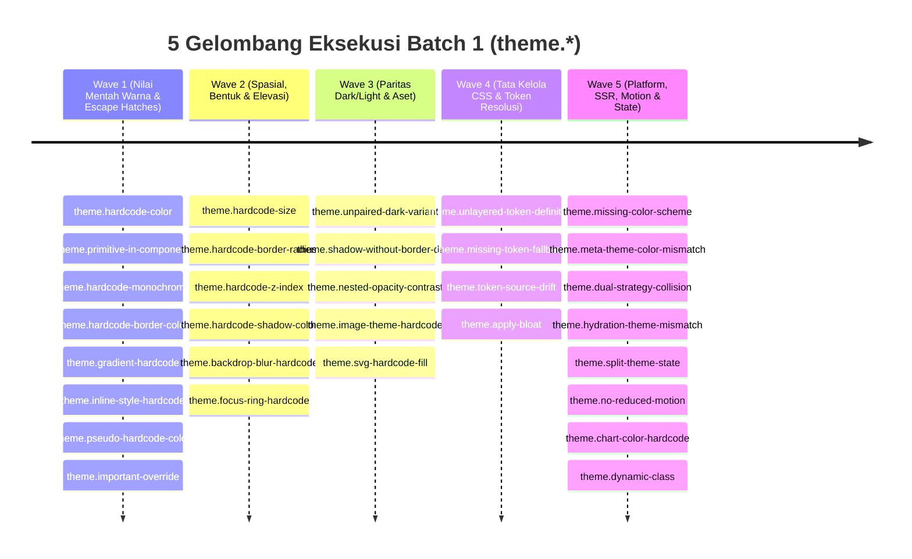

# EXPANSION-BATCH-01: Theme & Design Tokens (`theme.*`)
> **Kode Dokumen:** `SPEC-EXP-01-THEME`
> **Kategori:** `theme`
> **Pilar:** `01-SPEC` (WHAT - Spesifikasi Perilaku & Kontrak Rule)
> **Status:** Active Expansion Specification
> **Standar Rujukan:** W3C DTCG (v2025.10), WCAG 2.2, W3C CSS Color Module Level 4 (OKLCH), Tailwind CSS v4, W3C Media Queries 5
> **Pilar Terkait:** [01-SPEC: 08-expansion.md](../08-expansion.md) & [06-ROADMAP: 08-expansion.md](../../06-roadmap/08-expansion.md)

---

## 1. Ikhtisar Portofolio Rule Tema (32 Aturan Kanonikal)

Dokumen ini memetakan seluruh portofolio spesifikasi rule kategori `theme.*` (total **32 aturan kanonikal**) yang mengonsolidasikan:
1. **Warisan Legacy (*charites-legacy/tailwind-checker.ts*):** Aturan fondasi warna arbitrer, ukuran, opacity, palet, `@apply`, dan dynamic class.
2. **Riset Anti-Pattern Sistemik (*Deep Research AP-1 s/d AP-7*):** Paritas inversi gelap/terang, kolaps bayangan/elevasi, desinkronisasi `color-scheme`, tabrakan strategi, dan kontras alpha bertingkat.
3. **Analisis Celah & Arsitektur Lanjutan (*Research AP-8 s/d AP-22*):** Kebocoran atribut `style`, gradien, border radius, z-index, shadow color, focus ring, konsumsi token primitif, `@layer` precedence, token fallback, `!important` cascade breaks, hidrasi SSR, state drift, prefers-reduced-motion, dan aset gambar.



---

## 2. Paradigma Arsitektur: Dynamic CSS Ingestion & Tri-Path Remediation

### 2.1. Filosofi Konsistensi: Ekstraktor, Bukan Generator Estetika
Charites memiliki peran yang tegas dan berbeda dari sekadar *design tool*:
- **Generator vs Ekstraktor:** Jika dokumen seperti [tokens_template.json](../../.agents/skills/charites-responsive-guidelines/assets/tokens_template.json) adalah *generator* (mendikte nilai dan palet warna yang harus dibuat), maka **Charites adalah Ekstraktor & Penegak Konsistensi (Extractor & Integrity Verifier)**.
- **Bukan Alat Mempercantik:** Mempercantik antarmuka adalah bakat, selera, dan domain kreatif desainer. Bagus menurut orang A belum tentu disukai orang B. Charites **tidak masuk ke ranah perdebatan selera estetika subjektif**, melainkan berfokus pada **tiga pilar objektif: Konsistensi, Keterdugaan (*Predictability*), dan Kenyamanan Performa**.
- **Membasmi Cacat Inkonsistensi Nyata:** Masalah fatal pada produk nyata bukanlah apakah warnanya estetik, melainkan **inkonsistensi visual yang membingungkan pengguna (*cognitive friction*)**:
  - Di *Modal Edit* tombol aksi berwarna biru tua (`#1e3a8a`), tapi di *Modal Add* tombol aksi tiba-tiba berubah jadi biru dongker (`#172554`).
  - Di *Step 1* formulir pesan validasi error berwarna merah terang (`#ef4444`), tapi di *Step 2* berubah jadi merah gelap (`#991b1b`).
  - Di halaman A kontainer memakai radius `rounded-lg` (`8px`), di halaman B memakai radius sembarangan `rounded-[11px]`.
- **Nol Konfigurasi Berulang (*Zero Friction*):** Karena Charites bertindak sebagai *ekstraktor*, pengembang dan tim desain **tidak perlu repot mengonfigurasi aturan apa saja yang harus konsisten satu per satu**. Charites cukup mengekstrak apa yang sudah dideklarasikan tim di `global.css`, lalu memastikan seluruh kode antarmuka (TSX, Astro, CSS) 100% patuh pada kesepakatan tersebut.
- **Skalabilitas Tim Multi-Developer (Eliminasi Human Drift):** Begitu proyek dikerjakan oleh 2-3 frontend developer atau lebih, *human drift* pasti terjadi jika hanya mengandalkan ingatan atau panduan teks:
  - Dev A membuat kartu dengan `bg-slate-900 border-gray-200`.
  - Dev B membuat modal dengan `bg-zinc-900 border-zinc-700`.
  - Dev C membuat badge dengan `bg-blue-500/20 text-blue-600`.
  Akibatnya, puluhan variasi abu-abu dan biru liar merayap ke produksi, reviewer kelelahan di Pull Request (*PR review fatigue* mencari beda hex code), dan paritas mode gelap jebol. Charites menghentikan ini secara otomatis di level mesin (CI / pre-commit), sehingga produk akhir terasa dibangun oleh **satu developer dengan satu otak desain yang sinkron**.



### 2.2. Tri-Path Remediation (Tiga Jalur Solusi Pengembang)
Ketika Charites menandai sebuah utilitas warna, slash modifier, atau nilai spasial sebagai pelanggaran, pengembang selalu memiliki **tiga jalur solusi** yang logis, pragmatis, dan akuntabel:

1. **Jalur 1 (Samakan dengan yang Ada di Global - Konsistensi Komponen Aplikasi):**
   Ubah kode komponen agar merujuk ke token semantik yang sudah resmi terdaftar di `global.css`.
   - *Contoh:* Ganti `bg-[#2563eb]` menjadi `bg-primary`, atau ganti `bg-primary/10` menjadi `bg-primary-light`.
2. **Jalur 2 (Tambahkan ke Global jika Kebutuhan Reusable Baru - Evolusi Desain Sistem):**
   Jika warna, nilai opacity, atau varian tersebut memang merupakan keputusan desain baru yang sah dan akan digunakan berulang:
   - **Daftarkan token tersebut secara resmi ke dalam `global.css`** (misal: deklarasikan `--color-brand-accent: #2563eb;` atau `--color-primary-light: ...` di blok `@theme` atau `:root`).
   - Begitu berkas CSS disimpan, Charites secara otomatis langsung mengenali dan memvalidasi token tersebut pada scan berikutnya **tanpa perlu mengubah kode linter atau kompilasi ulang Go binary**.
3. **Jalur 3 (Abaikan secara Eksplisit untuk Kasus Khusus - Intentional One-Off Exception):**
   Untuk konteks antarmuka khusus seperti **Landing Page**, **Hero Section promosi**, atau **Kampanye Visual Musiman** yang sengaja didesain mencolok (*eye-catching visual*) dengan efek neon/gradien unik sekali pakai:
   - Pengembang **tidak perlu memaksakan** memasukkan warna one-off tersebut ke `global.css` (yang berisiko mengotori SSOT token aplikasi inti).
   - Pengembang dapat menggunakan **Direktif Abaikan Resmi** Charites secara transparan:
     - **Inline Directive (TSX/JSX):**
       ```tsx
       // charites:ignore theme.hardcode-color
       <div className="bg-[#ff007a] shadow-[0_0_50px_#ff007a]">Landing Promo</div>
       ```
     - **Inline Directive (Astro/HTML):**
       ```astro
       <!-- charites:ignore theme.hardcode-color -->
       <section class="bg-gradient-to-r from-[#ff007a] to-[#7928ca]">Hero</section>
       ```
     - **Scoped Ignore di `charites.yaml`:**
       ```yaml
       ignore:
         - "src/pages/landing/**"
         - "src/components/marketing/PromoBanner.tsx"
       ```
   - **Prinsip Tata Kelola:** Pengecualian visual dilakukan secara sadar, eksplisit, dan terdokumentasi rapi di kode (*transparent evidence-guided governance*), tanpa membengkokkan rule inti compiler.

### 2.3. Mekanisme Shared Theme Context
1. **Discovery Path:** Scanner compiler mencari berkas CSS tema global secara otomatis dengan urutan prioritas:
   - `src/style/global.css`
   - `src/styles/global.css`
   - `styles/global.css`
   - `global.css`
   - Atau path eksplisit yang dikonfigurasikan di `charites.yaml` (`theme_css: "..."`).
2. **Dynamic Ingestion:** Modul parser `internal/parser/tailwind` membaca deklarasi blok `@theme` (Tailwind v4) maupun custom properties di `:root` dan `[data-theme]`, lalu mengekstraknya ke dalam `ThemeTokenRegistry`.
3. **Shared Distribution across Rules:** Seluruh rule kategori `theme.*` mengonsumsi registry bersama ini untuk tiga pemeriksaan fundamental:
   - **Deteksi Warna Liar (`theme.hardcode-color` & `theme.primitive-in-component`):** Menolak setiap kode heksadesimal mentah (`#...`), fungsi OKLCH sembarangan (`[oklch(...)]`), atau palet mentah yang tidak terpetakan di `global.css`.
   - **Deteksi Embel-embel Slash (`theme.hardcode-opacity-color`):** Memeriksa apakah ada embel-embel `/` (misal `primary/10`, `primary/30`, `primary/[0.08]`). Cek apakah ada varian semantik seperti `primary-light` atau `primary-subtle` di `global.css`. Jika ada, rekomendasikan token tersebut; jika tidak ada, larang modifikasi slash arbitrer dan minta daftarkan token resmi.
   - **Deteksi Paritas Mode Gelap (`theme.unpaired-dark-variant`):** Memverifikasi apakah token yang digunakan pada mode terang (`:root`) memiliki pemetaan terkalibrasi pada mode gelap (`[data-theme="dark"]` atau `.dark`).

### 2.4. Taksonomi Akar Masalah Hulu: 5 Dimensi Kegagalan Sistemik Tema
Pelanggaran di baris kode JSX/CSS hanyalah gejala hilir (*downstream symptoms*). Di balik setiap pelanggaran statis terdapat **akar masalah sistemik di level proses, desain, arsitektur, dan organisasi**. Charites hadir sebagai jaring pengaman (*safety net*) otomatis untuk membasmi kegagalan pada 5 dimensi hulu berikut:



#### A. Anti-Pattern Sistem Token
1. **No Single Source of Truth:** Token didefinisikan di banyak tempat terpisah (Tailwind config, `global.css`, konstanta JS, dan file Figma). Nilai perlahan bergeser (*drift*) antar sumber tanpa ada yang tahu mana yang kanonikal $\to$ *Akar langsung dari `theme.token-source-drift`*.
2. **Semantic Layer Kosong:** Proyek memiliki palet primitif (`blue-500`), tetapi tidak memiliki layer semantik peranan (`primary`). Developer dipaksa menebak: satu pakai `blue-500`, yang lain pakai `blue-600` $\to$ *Akar langsung dari `theme.primitive-in-component`*.
3. **Konvensi Naming Campur:** `--brand-primary` di satu berkas, `--primary-brand` di berkas lain, dan `--color-brand` di config. Terjadi *alias drift* sebelum token sempat dipakai di antarmuka.
4. **Token Tanpa Guidance Pemakaian:** Tersedia token `--surface-1` hingga `--surface-5`, tetapi tidak ada dokumentasi kapan harus memakai yang mana. Hasilnya pemakaian acak dan hierarki kedalaman visual rusak.
5. **Token Legacy Tidak Pernah Dideprekasi:** Refactor menambah token baru, tetapi token lama dibiarkan hidup. Set token membengkak (*bloat*), developer baru meng-copy-paste kode lama yang belum termigrasi.

#### B. Anti-Pattern Proses Desain
1. **Dark Mode "Invert-Only":** Mode gelap dibuat sekadar membalikkan nilai hex terang menjadi gelap tanpa mendesain ulang hierarki elevasi dan kontras $\to$ *Akar langsung dari `theme.shadow-without-border-dark` & `theme.hardcode-shadow-color`*.
2. **Mockup Dark Mode Tidak Disediakan:** Desainer hanya mengirimkan rancangan mode terang. Setiap developer mengira-ngira sendiri warna gelapnya $\to$ *Akar langsung dari `theme.unpaired-dark-variant`*.
3. **Figma Styles Tidak Terpetakan ke Token:** Desainer menggunakan hex mentah di canvas Figma; handoff menghasilkan nilai arbitrer yang disalin mentah ke kode sumber tanpa pipeline sinkronisasi (seperti Tokens Studio / Style Dictionary).
4. **Kontras Tidak Divalidasi per Mode:** Warna lolos inspeksi mata di mode terang, namun gagal total rasio kontras WCAG 2.2 (< 4.5:1) di mode gelap tanpa ada yang menyadari hingga pengguna komplain.

#### C. Anti-Pattern Arsitektur State
1. **Theme State Tersebar:** Status tema dikelola sebagian di React Context, dipersist di `localStorage`, sebagian di cookie SSR, dan library pihak ketiga memiliki state tema sendiri. Ketika tombol toggle ditekan, halaman setengah gelap dan setengah terang $\to$ *Akar dari `theme.split-theme-state` & `theme.hydration-theme-mismatch`*.
2. **Library Pihak Ketiga Tidak Terhubung ke Token:** Widget charting (Recharts, Chart.js), code editor (Monaco), rich text (Quill), dan maps memiliki konfigurasi warna statis sendiri yang tidak membaca CSS variables $\to$ *Akar dari `theme.chart-color-hardcode`*.

#### D. Anti-Pattern Testing & QA
1. **Visual Regression Single-Mode:** Tool screenshot testing (Percy, Chromatic) hanya dijalankan pada mode terang default; regresi visual mode gelap lolos ke tahap produksi.
2. **Storybook Stories Tanpa Varian Dark:** Komponen hanya diuji dalam kanvas putih selama masa pengembangan.
3. **QA Checklist Buta Dark Mode:** Skenario pengujian manual QA hanya berfokus pada mode terang; bug mode gelap dianggap sekadar "kosmetik minor".

#### E. Anti-Pattern Organisasi
1. **Token Tanpa Owner & Review:** Siapa pun dapat menambahkan token baru ke dalam stylesheet kapan pun tanpa review tim desain sistem. Kumpulan token menjadi tempat pembuangan keputusan ad-hoc.
2. **Migrasi Setengah Jalan Tanpa Tracking:** Refactoring ke token baru berjalan paralel dengan kode lama tanpa daftar burndown berkas yang terukur. Charites menutup celah ini dengan menyediakan output audit diagnostik terstruktur (`charites scan --format=json`) sebagai basis metrik burndown migrasi.

---

## 3. Matriks Komprehensif Rule `theme.*` (32 Aturan)

| Canonical Rule ID | Sumber Asal | Target AST | Default Severity | Ringkasan Pola Pelanggaran | Rekomendasi Hint / Solusi |
| :--- | :---: | :---: | :---: | :--- | :--- |
| **`theme.hardcode-color`** | Legacy + Spec 08 | TSX / Astro / CSS | `warn` | Penggunaan arbitrary hex/rgb: `bg-[#2563eb]`, `text-[rgb(...)]`, `[color:#fff]` | Samakan dengan token `global.css` (`bg-primary`) atau daftarkan token baru di `global.css` |
| **`theme.primitive-in-component`** | Research (AP-14) | TSX / Astro / CSS | `error` | Komponen mengonsumsi primitive token langsung: `var(--blue-500)`, `text-blue-500` | Ganti ke semantic token dari `global.css`: `var(--color-primary)`, `text-primary` |
| **`theme.hardcode-monochrome`** | Research (AP-2) | TSX / Astro | `warn` | Penggunaan `bg-white`, `bg-black`, `text-white` (termasuk varian alpha: `bg-black/50`, `text-white/[0.06]`) | Alihkan ke surface token: `bg-card`, `bg-background`, `text-foreground` |
| **`theme.hardcode-border-color`** | Gap Analysis | TSX / Astro | `warn` | `border-gray-200`, `border-[#e5e5e5]` lolos dari pengecekan bg/text | Ganti ke token border semantik: `border-border`, `border-input` |
| **`theme.gradient-hardcode`** | Research (AP-9) | TSX / Astro / CSS | `warn` | Gradient arbitrary/primitive: `from-[#3b82f6]`, `to-blue-500`, `bg-gradient-to-r from-red-500` | Definisikan token gradient semantik: `bg-gradient-primary` atau `from-primary to-secondary` |
| **`theme.hardcode-opacity-color`** | Legacy (R2) | TSX / Astro | `error` | Embel-embel slash opacity liar pada warna: `primary/20`, `primary/30`, `primary/[0.08]` | Gunakan varian semantik dari `global.css` (`primary-light`) atau daftarkan token baru |
| **`theme.inline-style-hardcode`** | Research (AP-8) | TSX / Astro / JSX | `error` | Atribut style dengan hardcode value: `style={{ color: '#2563eb' }}`, `style="background:#fff"` | Pindahkan ke class utility token semantik atau CSS variable. Inline style menangkal cascade tema |
| **`theme.pseudo-hardcode-color`** | Gap Analysis | TSX / Astro | `warn` | `placeholder:text-gray-400`, `selection:bg-yellow-200` pada pseudo | Perluas validasi token ke seluruh varian pseudo-element/class |
| **`theme.important-override`** | Research (AP-17) | TSX / Astro / CSS | `error` | Penggunaan `!important` pada utility class: `!bg-red-500`, `!text-white` | Hindari `!important`; gunakan layer/token precedence yang benar. `!important` merusak cascade tema |
| **`theme.hardcode-size`** | Legacy (R1-Size) | TSX / Astro | `warn` | Arbitrary size: `p-[13px]`, `w-[230px]`, `text-[15px]` & pecahan liar: `p-3.25`, `w-2.75` | Gunakan skala modular W3C: `p-3`, `p-3.5`, `p-4`, `w-64`, `text-base` |
| **`theme.hardcode-border-radius`**| Research (AP-11) | TSX / Astro | `warn` | Arbitrary radius: `rounded-[7px]`, `rounded-[11px]` | Gunakan skala radius token: `rounded-sm`, `rounded-md`, `rounded-lg`, `rounded-xl` |
| **`theme.hardcode-z-index`** | Research (AP-10) | TSX / Astro / CSS | `warn` | Arbitrary z-index: `z-[999]`, `z-[10000]` yang tidak mengikuti skala token | Gunakan skala token z-index: `z-dropdown`, `z-modal`, `z-toast` |
| **`theme.hardcode-shadow-color`** | Research (AP-12) | TSX / Astro / CSS | `warn` | Shadow dengan warna hardcode: `shadow-[0_4px_10px_#00000040]` | Gunakan token shadow semantik: `shadow-md`, `shadow-lg`, atau shadow-colored berbasis token |
| **`theme.backdrop-blur-hardcode`** | Research (AP-22) | TSX / Astro | `warn` | Arbitrary backdrop blur: `backdrop-blur-[5px]` | Gunakan skala token: `backdrop-blur-sm`, `backdrop-blur-md`, `backdrop-blur-lg` |
| **`theme.focus-ring-hardcode`** | Research (AP-13) | TSX / Astro | `warn` | Focus ring arbitrary: `ring-[#3b82f6]`, `outline-[2px_solid_#000]` | Gunakan token focus: `ring-ring`, `ring-primary`, `outline-ring` |
| **`theme.unpaired-dark-variant`** | Research (AP-1) | TSX / Astro | `error` | Varian `dark:*` hadir tanpa mitra terang yang seimbang (black-on-black) | Deklarasikan pasangan terang atau alihkan ke token semantik |
| **`theme.shadow-without-border-dark`**| Research (AP-3) | TSX / Astro | `warn` | Elevasi kontainer (`shadow-md`, `shadow-lg`) tanpa border di dark mode | Tambahkan `border border-border` untuk ketegasan kontras |
| **`theme.nested-opacity-contrast`** | Research (AP-6) | TSX / Astro | `warn` | Penumpukan kelas opacity (`opacity-75` + `text-*/50`) merusak kontras | Hindari alpha bertingkat; gunakan token warna kontras tetap |
| **`theme.image-theme-hardcode`** | Research (AP-21) | TSX / Astro | `warn` | Asset gambar (logo, ilustrasi, icon) hardcode untuk light mode saja tanpa dark variant | Sediakan src switching berdasarkan theme atau gunakan SVG dengan currentColor / CSS variable |
| **`theme.svg-hardcode-fill`** | Research (AP-4) | TSX / Astro | `warn` | Atribut `fill`, `stroke`, `stop-color` pada SVG/gradient atau di dalam blok `<style>` SVG | Ganti dengan `fill="currentColor"`, `stroke="currentColor"`, atau token CSS |
| **`theme.unlayered-token-definition`**| Research (AP-15) | CSS (`*.css`) | `error` | Token custom property didefinisikan di luar `@layer` atau tanpa explicit precedence | Bungkus token dalam `@layer theme` dengan stack layer yang jelas: `@layer base, theme, components` |
| **`theme.missing-token-fallback`** | Research (AP-16) | CSS (`*.css`) | `warn` | Penggunaan `var(--token)` tanpa fallback value | Selalu sediakan fallback: `var(--token, #fallback)` atau pastikan token terdefinisi |
| **`theme.token-source-drift`** | Gap Analysis | Config + CSS | `error` | Nilai token diduplikasi berbeda: `tailwind.config` vs `global.css` | Jadikan CSS variable sebagai SSOT tunggal (`hsl(var(--primary))`) |
| **`theme.apply-bloat`** | Legacy (CssRules) | CSS (`*.css`) | `warn` | Direktif `@apply` memuat lebih dari 8 utility classes | Dekomposisi ke komponen murni atau utility di markup |
| **`theme.missing-color-scheme`** | Research (AP-4) | CSS (`global.css`) | `error` | Berkas CSS tema root tanpa deklarasi `color-scheme: light dark` | Tambahkan `color-scheme: dark` pada `.dark` atau `[data-theme="dark"]` |
| **`theme.meta-theme-color-mismatch`** | Gap Analysis | Layout (Astro/HTML) | `warn` | `<meta name="theme-color">` statis cuma untuk light, tidak sinkron dengan state dark | Update `theme-color` secara dinamis via script sesuai state tema aktif |
| **`theme.dual-strategy-collision`** | Research (AP-5) | CSS / Config | `error` | Mencampur `@media (prefers-color-scheme)`, `.dark` class, atau `[data-theme="dark"]` attribute | Gunakan Single Source of Truth selector (`class` / `[data-theme]`) |
| **`theme.hydration-theme-mismatch`**| Research (AP-18) | Layout SSR (Next/Astro)| `error` | Server render dengan theme default berbeda dari client preference (hydration error / FOUC) | Gunakan cookie/inline script untuk sinkronisasi theme sebelum hydration; hindari client-only detection di render awal |
| **`theme.split-theme-state`** | Research (AP-19) | TSX / Config | `error` | State tema dipecah antara multiple source: React Context + localStorage + cookie + URL param tanpa SSoT | Tentukan Single Source of Truth untuk theme state; gunakan satu resolver theme yang konsisten |
| **`theme.no-reduced-motion`** | Research (AP-20) | CSS / TSX | `warn` | Transisi/animasi tema tidak menghormati `prefers-reduced-motion` | Bungkus animasi tema dalam `@media (prefers-reduced-motion: no-preference)` atau gunakan `motion-safe:` |
| **`theme.chart-color-hardcode`** | Gap Analysis | TSX (data-viz) | `warn` | Array hex statis untuk chart (Recharts/Chart.js) lepas dari token tema | Ambil warna via `getComputedStyle`/CSS var, map ke token tema |
| **`theme.dynamic-class`** | Legacy (JsxRules) | TSX / JSX | `error` | Template literal interpolasi dinamis di className: `` `bg-${c}-500` `` | Gunakan lookup map statis agar dapat dideteksi Tailwind JIT |

---

## 4. Invarian Deteksi AST & Pertahanan Adversarial (Adversarial Engineering Invariants)

Untuk memastikan parser Charites tidak menghasilkan *false positive* maupun *false negative* di lingkungan kode produksi nyata, engine scanner wajib mematuhi 8 invarian deteksi berikut:

### 4.1. Variant Stack Normalization & Tail Extraction
- **Kenyataan Kode Riil:** Utilitas Tailwind di dunia nyata hampir selalu bertumpuk (*stacked*), misal: `md:hover:focus:dark:bg-blue-500`, `group-hover/card:text-slate-800`, atau `peer-checked:border-gray-200`.
- **Invarian Parser:** Rule evaluasi warna/spasi **DILARANG** melakukan `strings.HasPrefix("bg-")` secara naif. Parser wajib mengekstrak **Tail Utility** setelah melucuti seluruh rantai prefix yang dipisahkan tanda titik dua (`:`):
  ```
  md:hover:dark:bg-blue-500  ──►  Variants: ["md", "hover", "dark"]  |  Tail: "bg-blue-500"
  ```
  Evaluasi aturan `theme.primitive-in-component` dilakukan pada `Tail`, sementara informasi `Variants` diteruskan ke rule paritas `theme.unpaired-dark-variant`.

### 4.2. Penanganan Modifier Slash & Monokrom Alpha (`bg-black/50`, `text-white/[0.06]`)
- **Blind Spot Klasik:** `hardcode-monochrome` yang mencocokkan `^bg-black$` akan melewatkan `bg-black/50`. Sementara `hardcode-opacity-color` hanya memetakan palet semantik (`primary/10`), sehingga `text-white/[0.06]` lolos total dari kedua rule!
- **Invarian Parser:** Parser wajib memisahkan token dasar dari modifier alpha:
  ```
  base, alpha, hasAlpha := SplitAlphaModifier("text-white/[0.06]")
  // base = "text-white", alpha = "[0.06]"
  ```
  Jika `base` adalah `bg-white`, `bg-black`, `text-white`, `text-black`:
  1. `theme.hardcode-monochrome` **WAJIB MENANDAI SEBAGAI PELANGGARAN**, terlepas dari ada atau tidaknya modifier alpha.
  2. Jika disertai arbitrary opacity (`/[0.06]`), diagnostik memberikan pesan ganda: pelanggaran permukaan monokrom + bypass opacity token.

### 4.3. Arbitrary Property & Arbitrary Variant Inspection
- **Kenyataan Sintaks Tailwind:**
  - *Arbitrary Property:* `[color:#fff]`, `[background-color:#09090b]`, `[border-color:rgb(30,41,59)]`.
  - *Arbitrary Variant:* `[&>svg]:fill-slate-500`, `[data-state=open]:bg-slate-100`.
- **Invarian Parser:**
  - Jika token berformat `[property:value]`: parser mengekstrak `property` dan `value`. Jika properti berhubungan dengan warna (`color`, `fill`, `border`), `value` diuji terhadap regex kode warna mentah pada `theme.hardcode-color`.
  - Jika token memiliki arbitrary variant `[&>...]:<utility>`: parser melucuti selektor bracket dan meneruskan `<utility>` ke pipeline evaluasi linter standar.

### 4.4. Deep String Traversal di Luar Atribut `className`
- **Blind Spot:** Pengembang modern mengisolasi kelas Tailwind di dalam helper fungsi: `cva({ variants: { ... } })`, argumen `clsx()`, `cn()`, `twMerge()`, `twJoin()`, `tv()`, atau manipulasi `classList.add(...)`.
- **Invarian Scanner:**
  - Scanner TSX/Astro **TIDAK BOLEH** hanya memeriksa atribut JSX `className="..."` atau HTML `class="..."`.
  - Scanner wajib melakukan *deep walk* pada AST AST TSX:
    1. Seluruh argumen pada pemanggilan fungsi `CallExpression` yang bernama `cn`, `clsx`, `twMerge`, `twJoin`, `cva`, `tv`.
    2. Seluruh string literal di dalam `ObjectExpression` pada argumen `cva({ base: "...", variants: { ... } })`.
    3. Method call `classList.add(...)` atau `classList.toggle(...)`.

### 4.5. Dekomposisi Segmen Statis Template Literal (Static vs Dynamic Class)
- **Kenyataan Sintaks:** `` `p-4 font-bold ${gap} text-slate-800` ``.
- **Invarian Parser:**
  - Segmen statis (*quasis*) di dalam template literal wajib dipecah (*split by whitespace*) dan **TETAP DIEVALUASI PENUH** oleh seluruh rule `hardcode-*` dan `primitive-in-component`. Pada contoh di atas, `text-slate-800` tetap wajib ditangkap sebagai pelanggaran palet primitif!
  - Rule `theme.dynamic-class` **HANYA DI-TRIGGER** jika ekspresi variabel menempel langsung pada potongan utility tanpa pemisah spasi (misal: `` `bg-${color}-500` `` atau `` `text-[${dynamicSize}]` ``).
  - Jika interpolasi berupa percabangan kondisional terisolasi `` `${isActive ? 'bg-primary' : 'bg-muted'}` ``, masing-masing cabang string dievaluasi sebagai kelas mandiri dan **TIDAK DIANGGAP** sebagai dynamic-class error.

### 4.6. Pewarisan Rule Penuh pada Argumen `@apply`
- **Blind Spot:** Checker lama hanya menjalankan `apply-bloat` pada file CSS dan membiarkan kode warna mentah di dalam `@apply` lolos begitu saja.
- **Invarian Scanner:**
  - Ketika scanner CSS mendeteksi deklarasi `@apply <utilities>;`:
  - Seluruh daftar token utility yang ada di dalam argumen `@apply` **WAJIB DIPASANGKAN** ke seluruh pipeline rule: `theme.hardcode-color`, `theme.primitive-in-component`, `theme.hardcode-monochrome`, `theme.gradient-hardcode`, dan `theme.unpaired-dark-variant`.

### 4.7. Tabrakan Tri-Strategi Tema (Media vs Class vs Data-Attribute)
- **Blind Spot:** Sering kali proyek tidak hanya mencampur media query dan class `.dark`, tetapi juga mencampur kelas `.dark` dengan atribut HTML `[data-theme="dark"]` atau `[data-mode="dark"]`.
- **Invarian Deteksi `theme.dual-strategy-collision`:**
  - Rule ini memeriksa seluruh berkas konfigurasi (`tailwind.config.*`), `charites.yaml`, dan file CSS global.
  - Jika terdeteksi lebih dari 1 strategi selektor aktif sekaligus dari ketiga himpunan:
    1. `@media (prefers-color-scheme: ...)`
    2. `.dark` class
    3. `[data-theme="..."]` / `[data-mode="..."]` attribute
  - Rule wajib mengibarkan `error` tabrakan strategi tema ganda/tiga (*Tri-Strategy Collision*).

### 4.8. Penutupan Blind Spot SVG (`stop-color` & Embedded `<style>`)
- **Blind Spot:** Tag `<linearGradient>` dan `<radialGradient>` pada SVG tidak menggunakan `fill`, melainkan atribut `stop-color="#..."`. Selain itu, banyak ikon SVG yang menyematkan blok internal `<style>`.
- **Invarian Deteksi `theme.svg-hardcode-fill`:**
  - Rule wajib menginspeksi atribut `stop-color` pada elemen `<stop>`.
  - Rule wajib mem-parse teks di dalam tag `<style>` internal SVG dan memeriksa deklarasi CSS `fill:` dan `stroke:` terhadap kode warna heksadesimal mentah.

---

## 5. Rincian Spesifikasi Teknis Tiap Rule

### 5.1. Kelompok 1: Penegakan Token & Nilai Skalar Mentah

#### `theme.hardcode-color`
- **Tujuan:** Membasmi warna arbitrer dalam kurung siku dan arbitrary property.
- **In-Scope:** Class Tailwind yang memuat `#[0-9a-fA-F]{3,8}`, `rgba?\(.*\)`, serta arbitrary properties `[color:#...]`, `[background-color:#...]`.
- **Out-of-Scope:** Anchor link `<a href="#...">`, ID selector `<div id="...">`, variabel CSS `var(--...)`.
- **Bad:** `<div className="bg-[#1e293b] text-[#f8fafc] [color:#fff]">`
- **Good:** `<div className="bg-card text-card-foreground">`

#### `theme.primitive-in-component`
- **Tujuan:** Menegakkan W3C DTCG 3-Tier Hierarchy: komponen dilarang mengonsumsi token Tier 1 secara langsung.
- **In-Scope:** Class `(bg|text|border|ring)-(slate|zinc|stone|gray|blue|cyan|sky|indigo|violet|purple|pink|rose|red|orange|yellow|lime|green|emerald|teal)-\d{2,3}` atau deklarasi CSS `var(--blue-500)`.
- **Bad:** `<button className="bg-blue-600 hover:bg-blue-700 text-white">`
- **Good:** `<button className="bg-primary hover:bg-primary-hover text-primary-foreground">`

#### `theme.hardcode-monochrome`
- **Tujuan:** Mencegah kartu putih benderang atau teks tak terlihat saat tema beralih ke dark mode (termasuk variasi alpha).
- **In-Scope:** Class `bg-white`, `bg-black`, `text-black`, `border-black`, `bg-black/50`, `text-white/[0.06]` yang berdiri sendiri tanpa pengkondisian semantik.
- **Pengecualian Sah:** Tombol primer high-contrast dengan teks putih sengaja (`bg-slate-900 text-white`).
- **Bad:** `<div className="bg-white p-6 shadow-sm bg-black/40">`
- **Good:** `<div className="bg-card p-6 border border-border">`

#### `theme.hardcode-border-color`
- **Tujuan:** Memastikan garis batas mengikuti token tema dan tidak terabaikan oleh linter latar belakang/teks.
- **In-Scope:** Class `border-(slate|zinc|gray|blue|...)-\d{2,3}` dan `border-[#...]`.
- **Bad:** `<div className="border border-gray-200">`
- **Good:** `<div className="border border-border">`

#### `theme.gradient-hardcode`
- **Tujuan:** Memastikan gradient color stops menggunakan token tema terkelola.
- **In-Scope:** Class dengan prefix `from-`, `via-`, `to-` yang memuat nilai hex atau palet mentah Tailwind.
- **Bad:** `<div className="bg-gradient-to-r from-[#3b82f6] to-blue-500">`
- **Good:** `<div className="bg-gradient-to-r from-primary to-accent">`

#### `theme.inline-style-hardcode`
- **Tujuan:** Menutup celah injeksi warna hardcoded via atribut `style` yang menangkal cascade tema.
- **In-Scope:** Properti `color`, `background`, `backgroundColor`, `borderColor`, `fill`, `stroke` di dalam atribut `style` (JSX objek atau string HTML).
- **Pengecualian Sah:** Nilai kalkulasi posisi dinamis runtime non-tema (`top`, `transform`).
- **Bad:** `<div style={{ color: '#2563eb', background: '#fff' }}>`
- **Good:** `<div className="text-primary bg-background">`

#### `theme.pseudo-hardcode-color`
- **Tujuan:** Mencegah warna mentah diselundupkan melalui varian pseudo-element dan pseudo-class.
- **In-Scope:** Class dengan prefix `placeholder:`, `selection:`, `file:`, `marker:` yang memuat warna palet mentah atau hex.
- **Bad:** `<input className="placeholder:text-gray-400 selection:bg-blue-200" />`
- **Good:** `<input className="placeholder:text-muted-foreground selection:bg-primary-light" />`

#### `theme.important-override`
- **Tujuan:** Mencegah perusakan hierarki spesifisitas tema akibat modifier `!important`.
- **In-Scope:** Penggunaan prefix `!` pada utility pewarnaan (`!bg-red-500`, `!text-white`) atau deklarasi `!important` di stylesheet komponen.
- **Bad:** `<button className="!bg-red-500 !text-white">`
- **Good:** Kelola spesifisitas via layer token precedence resmi (`@layer components`).

---

### 5.2. Kelompok 2: Token Spasial, Bentuk & Elevasi

#### `theme.hardcode-size`
- **Tujuan:** Mempertahankan ritme tata letak modular 4px/8px dan mencegah drift tipografi serta sub-pixel blur akibat desimal liar.
- **In-Scope:** Class `(w|h|p|px|py|m|mx|my|gap|top|bottom|left|right|text|inset)-\[\d+px\]` serta pecahan desimal non-standar (`p-3.25`, `w-2.75`, `gap-1.25`).
- **Bad:** `<div className="p-[19px] p-3.25 w-2.75 text-[15px]">`
- **Good:** `<div className="p-3.5 p-4 text-base">`

#### `theme.hardcode-border-radius`
- **Tujuan:** Menjaga keselarasan bentuk geometris komponen sesuai skala shape design token.
- **In-Scope:** Class `rounded-\[\d+px\]` atau `rounded-\[\d+rem\]`.
- **Bad:** `<button className="rounded-[7px]">`
- **Good:** `<button className="rounded-md">`

#### `theme.hardcode-z-index`
- **Tujuan:** Mencegah perang z-index (*z-index wars*) dengan menegakkan skala elevasi semantik.
- **In-Scope:** Class `z-\[\d+\]` atau nilai angka mentah arbitrer (`z-50`, `z-[999]`).
- **Bad:** `<div className="fixed z-[9999] top-0">`
- **Good:** `<div className="fixed z-modal top-0">`

#### `theme.hardcode-shadow-color`
- **Tujuan:** Mencegah bayangan dengan nilai alpha/hex acak yang tidak dapat beradaptasi di mode gelap.
- **In-Scope:** Class `shadow-\[.*#[0-9a-fA-F]{3,8}.*\]` atau deklarasi `box-shadow` dengan hex mentah.
- **Bad:** `<div className="shadow-[0_4px_10px_#00000040]">`
- **Good:** `<div className="shadow-md">` atau gunakan token shadow semantik.

#### `theme.backdrop-blur-hardcode`
- **Tujuan:** Menjaga konsistensi efek glassmorphism pada skala token blur yang terstandarisasi.
- **In-Scope:** Class `backdrop-blur-\[\d+px\]`.
- **Bad:** `<div className="backdrop-blur-[5px]">`
- **Good:** `<div className="backdrop-blur-sm">`

#### `theme.focus-ring-hardcode`
- **Tujuan:** Memastikan indikator fokus keyboard konsisten dan memenuhi rasio kontras WCAG 2.4.11 / 2.4.13.
- **In-Scope:** Class `ring-[#...]`, `ring-(blue|red|...)-\d{2,3}`, atau `outline-[..._#...]`.
- **Bad:** `<button className="focus:ring-[#3b82f6]">`
- **Good:** `<button className="focus-visible:ring-2 focus-visible:ring-ring">`

---

### 5.3. Kelompok 3: Paritas Mode Gelap & Fisika Optik

#### `theme.unpaired-dark-variant`
- **Tujuan:** Mencegah bencana *black-on-black* atau *white-on-white* akibat deklarasi tema sepihak.
- **In-Scope:** Elemen dengan `dark:bg-*` tanpa base `bg-*`, atau kontainer yang menginversi background tanpa anak menginversi teks.
- **Bad:**
  ```tsx
  <div className="bg-white dark:bg-zinc-900">
    <span className="text-zinc-900">Judul</span>
  </div>
  ```
- **Good:**
  ```tsx
  <div className="bg-card text-card-foreground">
    <span>Judul</span>
  </div>
  ```

#### `theme.shadow-without-border-dark`
- **Tujuan:** Mencegah hilangnya batas elevasi di dark mode karena bayangan hitam lenyap di atas kanvas hitam.
- **In-Scope:** Kontainer berelevasi (`shadow-md`, `shadow-lg`, `shadow-xl`) tanpa class `border` atau `ring`.
- **Bad:** `<div className="bg-card shadow-xl rounded-xl p-6">`
- **Good:** `<div className="bg-card border border-border shadow-xl rounded-xl p-6">`

#### `theme.nested-opacity-contrast`
- **Tujuan:** Mencegah kontras teks kolaps di bawah 4.5:1 (WCAG AA) akibat penumpukan nilai transparansi alpha.
- **In-Scope:** Kontainer ber-opacity yang membungkus teks ber-opacity.
- **Bad:**
  ```tsx
  <div className="bg-muted/40 opacity-80">
    <p className="text-foreground/50">Keterangan</p>
  </div>
  ```
- **Good:**
  ```tsx
  <div className="bg-muted">
    <p className="text-muted-foreground">Keterangan</p>
  </div>
  ```

#### `theme.image-theme-hardcode`
- **Tujuan:** Mencegah aset visual (logo, diagram, ilustrasi) lenyap atau tidak terbaca di mode gelap.
- **In-Scope:** Tag `` yang merujuk pada berkas grafis tanpa mekanisme pergantian tema (`dark:block hidden`, `<picture>`, atau SVG `currentColor`).
- **Bad:** ``
- **Good:**
  ```html
  
  
  ```

#### `theme.svg-hardcode-fill`
- **Tujuan:** Menjamin seluruh ikon vektor beradaptasi secara dinamis dengan warna teks induknya di seluruh tema.
- **In-Scope:** Tag `<svg>`, `<path>`, `<rect>`, `<circle>`, `<stop>` (atribut `stop-color`), serta blok `<style>` internal SVG yang memuat nilai heksadesimal mentah.
- **Bad:** `<path fill="#000000" d="..." /> <stop stop-color="#3b82f6" />`
- **Good:** `<path fill="currentColor" d="..." /> <stop stop-color="var(--primary)" />`

---

### 5.4. Kelompok 4: Tata Kelola CSS & Resolusi Token

#### `theme.unlayered-token-definition`
- **Tujuan:** Menegakkan cascading order yang terprediksi sesuai spesifikasi CSS Cascade Layers Level 5.
- **In-Scope:** Deklarasi CSS custom properties (`:root`, `[data-theme]`) di luar blok `@layer theme` atau `@layer base`.
- **Bad:**
  ```css
  :root {
    --primary: #2563eb;
  }
  ```
- **Good:**
  ```css
  @layer theme {
    :root {
      --primary: #2563eb;
    }
  }
  ```

#### `theme.missing-token-fallback`
- **Tujuan:** Menjamin antarmuka tetap memiliki fallback visual yang aman jika variabel CSS gagal dimuat.
- **In-Scope:** Penggunaan `var(--custom-token)` tanpa nilai cadangan argumen kedua di dalam stylesheet produksi.
- **Bad:** `color: var(--text-brand);`
- **Good:** `color: var(--text-brand, #1e293b);` atau pastikan token terikat pada kontrak build-time.

#### `theme.token-source-drift`
- **Tujuan:** Mencegah inkonsistensi nilai token saat didefinisikan ganda di `tailwind.config` dan `global.css`.
- **In-Scope:** Berkas konfigurasi Tailwind yang memetakan nilai warna mentah (`#...`) alih-alih merujuk ke CSS custom property.
- **Bad:** `colors: { primary: "#2563eb" }` di config + `--primary: #3b82f6;` di CSS.
- **Good:** `colors: { primary: "var(--primary)" }` di config (Single Source of Truth).

#### `theme.apply-bloat`
- **Tujuan:** Mencegah file CSS membengkak dan sulit dirawat akibat penyalahgunaan `@apply`.
- **In-Scope:** Deklarasi `@apply` di dalam file `*.css` yang memuat lebih dari 8 token utility.
- **Bad:** `@apply flex items-center justify-between p-4 bg-white rounded-lg shadow-md border border-gray-200 text-sm font-medium;`
- **Good:** Terapkan langsung utility di markup komponen atau pisahkan aturan CSS murni.

---

### 5.5. Kelompok 5: Platform, SSR, State & Aksesibilitas

#### `theme.missing-color-scheme`
- **Tujuan:** Memastikan elemen native browser (scrollbar, `<select>` popover, date picker, autofill) otomatis gelap saat tema gelap aktif.
- **In-Scope:** Selektor `.dark` atau `[data-theme="dark"]` di berkas CSS tanpa properti `color-scheme: dark`.
- **Bad:**
  ```css
  .dark {
    --background: #09090b;
  }
  ```
- **Good:**
  ```css
  .dark {
    color-scheme: dark;
    --background: #09090b;
  }
  ```

#### `theme.meta-theme-color-mismatch`
- **Tujuan:** Memastikan address bar browser mobile (Safari iOS, Chrome Android) selaras dengan tema aplikasi.
- **In-Scope:** Tag `<meta name="theme-color">` statis tanpa atribut `media="(prefers-color-scheme: ...)"` atau tanpa script sinkronisasi dinamis.
- **Bad:** `<meta name="theme-color" content="#ffffff" />`
- **Good:**
  ```html
  <meta name="theme-color" media="(prefers-color-scheme: light)" content="#ffffff" />
  <meta name="theme-color" media="(prefers-color-scheme: dark)" content="#09090b" />
  ```

#### `theme.dual-strategy-collision`
- **Tujuan:** Mencegah UI terbelah (*Frankenstein state*) akibat tabrakan 3 strategi selektor tema berbeda.
- **In-Scope:** Penggunaan bersamaan lebih dari satu selektor dari himpunan: `@media (prefers-color-scheme)`, class `.dark`, atau atribut `[data-theme="dark"]`.
- **Solusi:** Pilih strategi tunggal berbasis class/data-theme pada root document.

#### `theme.hydration-theme-mismatch`
- **Tujuan:** Mengeliminasi kedipan putih terang (*Flash of Unstyled Theme / FOUC*) dan React hydration mismatch error pada SSR.
- **In-Scope:** Tata letak SSR (Astro / Next.js) yang tidak menyertakan blocking inline script di `<head>` atau mendeteksi tema hanya di dalam `useEffect()`.
- **Solusi:** Sinkronkan tema via cookie atau render-blocking inline script di dalam tag `<head>` sebelum DOM pertama digambar.

#### `theme.split-theme-state`
- **Tujuan:** Mencegah status tema terpecah antara multiple state manager tanpa ada satu Single Source of Truth (SSOT).
- **In-Scope:** Kode yang membaca dan memperbarui status tema secara terpisah di `localStorage`, React Context terisolasi, cookie, dan URL search params tanpa resolver tunggal.
- **Solusi:** Buat satu modul Theme Provider terpadu sebagai SSOT resolusi tema.

#### `theme.no-reduced-motion`
- **Tujuan:** Memastikan transisi perpindahan tema menghormati preferensi aksesibilitas pengguna sensitif gerakan (vestibular disorders).
- **In-Scope:** Transisi tema (`transition: background-color ...`, `transition: all ...`) tanpa pembungkus media query reduced motion.
- **Bad:** `* { transition: background-color 0.3s ease; }`
- **Good:**
  ```css
  @media (prefers-reduced-motion: no-preference) {
    * { transition: background-color 0.3s ease; }
  }
  ```

#### `theme.chart-color-hardcode`
- **Tujuan:** Memastikan visualisasi data (Recharts, Chart.js) otomatis beradaptasi saat tema berubah.
- **In-Scope:** Objek konfigurasi atau prop chart (seperti `fill="#8884d8"`, `stroke="#82ca9d"`) yang menggunakan hex array statis.
- **Bad:** `<Bar dataKey="uv" fill="#3b82f6" />`
- **Good:** `<Bar dataKey="uv" fill="var(--chart-1)" />` atau pemetaan dinamis berbasis CSS variables.

#### `theme.dynamic-class`
- **Tujuan:** Menjamin keandalan deteksi statis Tailwind JIT compiler agar utility tidak hilang pada production build.
- **In-Scope:** JSX attribute `className` berupa template literal dengan ekspresi variabel terbuka yang menempel langsung pada potongan utility tanpa spasi.
- **Bad:** `<div className={`text-${color}-500`}>`
- **Good:**
  ```tsx
  const colorMap = { red: "text-destructive", green: "text-emerald-light" };
  <div className={colorMap[color]}>
  ```

---

## 6. Urutan Implementasi Bertahap (5 Phased Rollout Waves)

Untuk menjaga stabilitas compiler dan disiplin *The 3 Touchpoints*, pengerjaan 32 rule kategori `theme.*` dibagi menjadi 5 gelombang terstruktur:



### Wave 1: Nilai Mentah Warna & Escape Hatches (Prioritas Paling Kritis)
1. `theme.hardcode-color` *(Template referensi SPEC-08)*
2. `theme.primitive-in-component` *(Penegakan 3-Tier W3C DTCG)*
3. `theme.hardcode-monochrome` *(Deteksi white/black default termasuk varian alpha)*
4. `theme.hardcode-border-color` *(Warna border mentah)*
5. `theme.gradient-hardcode` *(Gradient stops from/via/to)*
6. `theme.inline-style-hardcode` *(Penutup bypass atribut style)*
7. `theme.pseudo-hardcode-color` *(Placeholder/selection)*
8. `theme.important-override` *(Penegakan integritas cascade)*

### Wave 2: Skala Spasial, Bentuk & Elevasi
1. `theme.hardcode-size` *(Skala modular spacing & typography)*
2. `theme.hardcode-border-radius` *(Skala shape token)*
3. `theme.hardcode-z-index` *(Skala z-index elevasi)*
4. `theme.hardcode-shadow-color` *(Warna bayangan mentah)*
5. `theme.backdrop-blur-hardcode` *(Skala blur glassmorphism)*
6. `theme.focus-ring-hardcode` *(Focus ring affordance WCAG)*

### Wave 3: Paritas Dark/Light & Aset Visual
1. `theme.unpaired-dark-variant` *(Deteksi black-on-black & variant unstacking)*
2. `theme.shadow-without-border-dark` *(Deteksi shadow collapse)*
3. `theme.nested-opacity-contrast` *(Deteksi kolaps kontras alpha)*
4. `theme.image-theme-hardcode` *(Deteksi logo/aset statis tanpa dark mode)*
5. `theme.svg-hardcode-fill` *(Deteksi fill/stroke/stop-color hardcoded)*

### Wave 4: Tata Kelola CSS & Resolusi Token
1. `theme.unlayered-token-definition` *(Penegakan @layer CSS)*
2. `theme.missing-token-fallback` *(Deteksi var() tanpa fallback)*
3. `theme.token-source-drift` *(Sinkronisasi tailwind.config vs global.css)*
4. `theme.apply-bloat` *(Pewarisan rule penuh di dalam @apply)*

### Wave 5: Platform, SSR, Aksesibilitas & State Management
1. `theme.missing-color-scheme` *(Sinkronisasi native browser chrome)*
2. `theme.meta-theme-color-mismatch` *(Sinkronisasi mobile browser address bar)*
3. `theme.dual-strategy-collision` *(Eliminasi konflik tri-strategi: media vs class vs data-theme)*
4. `theme.hydration-theme-mismatch` *(Eliminasi Theme FOUC & hydration mismatch)*
5. `theme.split-theme-state` *(Resolusi SSOT state tema)*
6. `theme.no-reduced-motion` *(Aksesibilitas vestibular motion)*
7. `theme.chart-color-hardcode` *(Sinkronisasi tema visualisasi data)*
8. `theme.dynamic-class` *(Dekomposisi quasis statis vs dynamic template literal)*

---

## 7. Protokol Pengujian Tri-Corpus Terpadu

Setiap rule di atas wajib mengimplementasikan struktur fixture pengujian baku sebelum dinyatakan berstatus **PASS**:

```text
tests/correctness/theme.<slug>/
├── positive/          # File TSX/Astro/CSS yang sengaja melanggar (POS-001, POS-002, ...)
├── negative/          # File sah yang menggunakan token resmi (NEG-001, NEG-002, ...)
├── adversarial/       # Jebakan bait, template string, nested closure, inline ignore (ADV-001, ...)
└── matrix.json        # Matriks semantik ekspektasi presisi (baris, kolom, hint)
```
