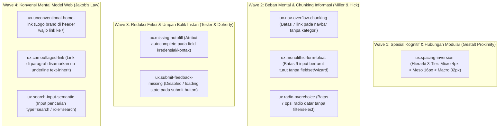

# EXPANSION-BATCH-03: Usability & Cognitive Ergonomics Standards (`ux.*`)
> **Kode Dokumen:** `SPEC-EXP-03-UX`
> **Kategori:** `ux`
> **Pilar:** `01-SPEC` (WHAT - Spesifikasi Perilaku & Kontrak Rule)
> **Status:** Active Expansion Specification (9 Aturan Terkurasi Bebas Redundansi Linter Standar)
> **Standar Rujukan:**
> - ISO 9241-110 (*Dialogue Principles & Ergonomics of Human-System Interaction*)
> - Miller's Law (*The Magical Number Seven, Plus or Minus Two: Capacity for Processing Information*)
> - Tesler's Law (*The Law of Conservation of Complexity*)
> - Doherty Threshold (*Computer-Human Interaction Response Rate*)
> - Jakob's Law of Internet User Experience
> - Gestalt Principles of Perceptual Organization (*Law of Proximity*)

---

## 1. Ikhtisar Kategori `ux` (9 Aturan Non-Redundan)

> **Prinsip Eliminasi Redundansi:** Kategori `ux` Charites **TIDAK menduplikasi** aturan linter aksesibilitas form (seperti label input dasar yang sudah ada di `a11y.*` atau inputmode virtual keyboard yang ada di `ergonomy.*`). Kategori ini berfokus murni pada **ergonomi kognitif, pencegahan kepanikan pengguna (*double-submit*), dan kepatuhan terhadap hukum psikologi desain (Gestalt, Miller, Hick, Tesler, Doherty, Jakob)** yang 100% lolos dari linter konvensional (ESLint/Stylelint).



---

## 2. Spesifikasi Detail Rule `ux.*`

### 2.1. `ux.spacing-inversion`
- **Landasan Teori:** Gestalt Law of Proximity & Hierarki Spasial Berjenjang (*3-Tier Spatial Ratio*).
- **Tujuan:** Menegakkan proporsi jarak modular berjenjang agar hubungan elemen jelas: **Micro (Intra-elemen: 4-6px) < Meso (Inter-field: 16-24px) < Macro (Inter-section/Submit CTA: 32-64px)**.
- **Mengapa Lolos Linter Standar:** ESLint dan Stylelint memeriksa kelas secara atomik per node. Linter biasa tidak dapat membandingkan nilai jarak relasional antara margin anak (`mb-6` = 24px) dengan gap kontainer induk (`space-y-2` = 8px) untuk mendeteksi pembalikan ritme visual.
- **In-Scope:** Form wrapper di mana jarak label-ke-input lebih renggang daripada jarak antar-field data, atau submit button yang menempel ke field terakhir tanpa napas Macro.
- **Bad (Inversi Spasi):**
  ```tsx
  <div className="space-y-2">
    {/* Jarak dalam (mb-6 = 24px) lebih renggang dari jarak luar (space-y-2 = 8px) */}
    <div>
      <label className="block mb-6">Nama Lengkap</label>
      <input type="text" className="w-full" />
    </div>
  </div>
  ```
- **Good (Proporsional 3-Tier):**
  ```tsx
  <form className="space-y-4"> {/* Meso: 16px antar field data */}
    <div className="space-y-1"> {/* Micro: 4px label ke input */}
      <label htmlFor="name">Nama Lengkap</label>
      <input id="name" type="text" className="w-full" />
    </div>
    <div className="pt-8"> {/* Macro: 32px pemisah tegas ke tombol Submit */}
      <button type="submit" className="w-full py-2.5 px-5 bg-primary text-primary-foreground">
        Simpan Perubahan
      </button>
    </div>
  </form>
  ```
- **Engine:** Relational Spacing AST.
- **Severity:** Warning.

### 2.2. `ux.nav-overflow-chunking`
- **Landasan Teori:** Miller's Law (The Magical Number $7 \pm 2$).
- **Tujuan:** Mencegah kelumpuhan pilihan (*choice overload*) pada menu navigasi utama.
- **Mengapa Lolos Linter Standar:** Jumlah tautan `<a>` di dalam `<nav>` sah-sah saja secara DOM dan TypeScript. Linter konvensional tidak menghitung kepadatan item kognitif.
- **In-Scope:** Tag `<nav>` yang memuat lebih dari 7 tautan setara langsung pada tingkat pertama tanpa pengelompokan (kategori, dropdown, atau menu `...`).
- **Good:** Kelompokkan tautan navigasi ke dalam kategori semantik atau pindahkan tautan sekunder ke dropdown/footer.
- **Engine:** AST Sibling Counter.
- **Severity:** Advisory.

### 2.3. `ux.monolithic-form-bloat`
- **Landasan Teori:** Miller's Law & Cognitive Intimidation Reduction.
- **Tujuan:** Mengurangi beban intimidasi kognitif saat pengguna melihat formulir panjang yang memicu pengabaian form (*form abandonment*).
- **Mengapa Lolos Linter Standar:** Meletakkan 15 `<input>` di dalam satu `<form>` sah secara HTML. Linter biasa tidak peduli dengan arsitektur multi-step atau fieldset grouping.
- **In-Scope:** Tag `<form>` yang memuat $> 9$ input field berturut-turut tanpa pembagian section (`<fieldset>`, `<legend>`, tab, atau multi-step wizard).
- **Good:** Pecah form ke dalam langkah-langkah terstruktur (*Step 1: Identitas, Step 2: Kontak, Step 3: Verifikasi*).
- **Engine:** AST Form Depth Analyzer.
- **Severity:** Warning.

### 2.4. `ux.radio-overchoice`
- **Landasan Teori:** Hick's Law & Miller's Law.
- **Tujuan:** Mempercepat waktu pengambilan keputusan pengguna pada formulir pemilihan opsi.
- **Mengapa Lolos Linter Standar:** Me-render 12 radio button sejajar valid secara React dan HTML.
- **In-Scope:** Grup radio button atau daftar pilihan datar yang memuat $> 7$ opsi statis tanpa kotak pencarian filter atau komponen `<select>`.
- **Good:** Gunakan komponen `<Select>` searchable atau Combobox jika pilihan $> 7$.
- **Engine:** AST Component Analyzer.
- **Severity:** Advisory.

### 2.5. `ux.missing-autofill`
- **Landasan Teori:** Tesler's Law (The Law of Conservation of Complexity).
- **Tujuan:** Memindahkan beban pengetikan repetitif dari jempol pengguna ke memori cerdas browser native.
- **Mengapa Lolos Linter Standar:** Atribut `autocomplete` bersifat opsional di HTML. Linter standar tidak memeriksa apakah field sensitif seperti email/password/OTP/telepon menyertakan token autocomplete resmi W3C.
- **In-Scope:** Input pada formulir autentikasi, pembayaran, atau profil tanpa atribut `autoComplete` resmi (`email`, `current-password`, `new-password`, `one-time-code`, `name`, `tel`, `address-line1`).
- **Bad:** `<input type="email" name="user_email" />`
- **Good:** `<input type="email" name="user_email" autoComplete="email" />`
- **Engine:** JSX/TSX AST.
- **Severity:** Info.

### 2.6. `ux.submit-feedback-missing`
- **Landasan Teori:** Doherty Threshold (*Never leave users guessing*).
- **Tujuan:** Mencegah kepanikan pengguna dan insiden mutasi ganda (*double-submit*) saat memproses mutasi transaksi.
- **Mengapa Lolos Linter Standar:** `<button type="submit">Bayar</button>` adalah kode yang 100% valid secara TypeScript dan ESLint. Linter biasa tidak memeriksa apakah tombol di-disable saat status mutasi `isPending` / `isSubmitting`.
- **In-Scope:** Tag `<button type="submit">` di dalam form yang tidak memiliki binding atribut `disabled` dan tidak memuat indikator visual pemrosesan (spinner).
- **Bad:**
  ```tsx
  <button type="submit" className="bg-primary text-primary-foreground">
    Bayar Sekarang
  </button>
  ```
- **Good:**
  ```tsx
  <button type="submit" disabled={isSubmitting} className="bg-primary text-primary-foreground">
    {isSubmitting ? <Spinner /> : "Bayar Sekarang"}
  </button>
  ```
- **Engine:** JSX/TSX State Binding AST.
- **Severity:** Error.

### 2.7. `ux.unconventional-home-link`
- **Landasan Teori:** Jakob's Law (Mental model web selama 30 tahun).
- **Tujuan:** Menghormati refleks alamiah pengguna bahwa logo brand di bagian header selalu membawa kembali ke halaman beranda.
- **Mengapa Lolos Linter Standar:** Menaruh logo `` atau `<svg>` di dalam `<header>` tanpa `<a>` adalah HTML valid. Linter standar tidak memahami konvensi mental model web.
- **In-Scope:** Elemen logo atau nama brand di dalam `<header>` / `<nav>` yang berdiri sendiri tanpa dibungkus tautan `<a href="/">`.
- **Bad:**
  ```tsx
  <header>
    
  </header>
  ```
- **Good:**
  ```tsx
  <header>
    <a href="/" aria-label="Beranda">
      
    </a>
  </header>
  ```
- **Engine:** Header Tree AST.
- **Severity:** Warning.

### 2.8. `ux.camouflaged-link`
- **Landasan Teori:** Jakob's Law & Visual Affordance.
- **Tujuan:** Menjamin pengguna langsung mengenali kata mana di dalam bacaan yang merupakan tautan interaktif yang bisa diklik.
- **Mengapa Lolos Linter Standar:** `className="no-underline text-inherit"` adalah styling Tailwind yang sah. Linter biasa tidak tahu bahwa kelas ini mematikan affordance visual link di dalam blok teks paragraf.
- **In-Scope:** Tag `<a>` di dalam teks paragraf (`<p>`) yang menggunakan utilitas penghapus garis bawah dan warna teks yang sama persis dengan body text tanpa pembeda visual.
- **Bad:**
  ```tsx
  <p>Silakan baca <a href="/terms" className="no-underline text-inherit">syarat dan ketentuan</a> kami.</p>
  ```
- **Good:**
  ```tsx
  <p>Silakan baca <a href="/terms" className="underline text-primary hover:text-primary/80">syarat dan ketentuan</a> kami.</p>
  ```
- **Engine:** JSX/TSX AST + Prose Context.
- **Severity:** Warning.

### 2.9. `ux.search-input-semantic`
- **Landasan Teori:** Jakob's Law & Platform Affordance.
- **Tujuan:** Mengaktifkan tombol 'X' pembersih otomatis dan tombol aksi 'Cari' (Search key) bawaan keyboard virtual mobile.
- **Mengapa Lolos Linter Standar:** `<input type="text" placeholder="Cari barang..." />` sah di HTML. Linter biasa tidak membedakan fungsi pencarian dengan isian teks biasa.
- **In-Scope:** Input dengan placeholder atau nama mengandung kata kunci pencarian (`search`, `cari`, `filter`) yang hanya menggunakan `type="text"` alih-alih `type="search"`.
- **Bad:** `<input type="text" placeholder="Cari produk..." />`
- **Good:** `<input type="search" placeholder="Cari produk..." />`
- **Engine:** JSX/TSX AST.
- **Severity:** Info.

---

## 3. Ringkasan Matriks Rule `ux.*` (9 Aturan Non-Redundan)

| Rule ID | Fokus Invarian | Mengapa Tidak Tertangkap Linter Biasa | Severity | Engine Target |
|---|---|---|---|---|
| `ux.spacing-inversion` | Hierarki 3-Tier (Micro < Meso < Macro) | Linter tidak bisa membandingkan margin anak vs gap induk | warning | Relational Spacing AST |
| `ux.nav-overflow-chunking` | Miller's Law: Batas 7 link navbar | Linter biasa tidak menghitung kepadatan kognitif navigasi | advisory | AST Sibling Counter |
| `ux.monolithic-form-bloat` | Miller's Law: Batas 9 field form | Linter biasa tidak mengevaluasi grouping form wizard | warning | AST Form Depth Analyzer |
| `ux.radio-overchoice` | Hick's Law: Batas 7 radio tanpa filter | Me-render radio banyak sah secara sintaksis | advisory | AST Component Analyzer |
| `ux.missing-autofill` | Tesler's Law: Browser native autocomplete | Atribut autocomplete opsional di HTML standar | info | JSX/TSX AST |
| `ux.submit-feedback-missing` | Doherty Threshold: Double-submit blocker | Linter biasa tidak melacak state disabled saat pending submit | error | State Binding AST |
| `ux.unconventional-home-link` | Jakob's Law: Brand logo link ke `/` | Logo tanpa link sah di HTML, melanggar mental model | warning | Header Tree AST |
| `ux.camouflaged-link` | Jakob's Law: Link paragraf disamarkan | Kelas no-underline text-inherit sah di Tailwind | warning | Prose Context AST |
| `ux.search-input-semantic` | Platform keyboard mobile `type="search"` | Input teks biasa sah, tapi mematikan search action key | info | JSX/TSX AST |

---

## 4. Rule Classification & Execution Boundary

1. **Deterministic AST Rules (< 50ms pre-commit gate):**
   - `ux.spacing-inversion`, `ux.nav-overflow-chunking`, `ux.monolithic-form-bloat`, `ux.radio-overchoice`, `ux.missing-autofill`, `ux.submit-feedback-missing`, `ux.unconventional-home-link`, `ux.camouflaged-link`, `ux.search-input-semantic`.
2. **Aturan yang Dieliminasi karena Redundan dengan Kategori Lain:**
   - `ux.input-missing-label` (telah dilindungi secara kanonikal di `a11y.label-missing-control`).
   - `ux.orphan-error-message` (telah dilindungi secara kanonikal di `a11y.error-not-announced`).
   - `ux.missing-inputmode` (telah dilindungi secara kanonikal di `ergonomy.missing-inputmode-keyboard`).
