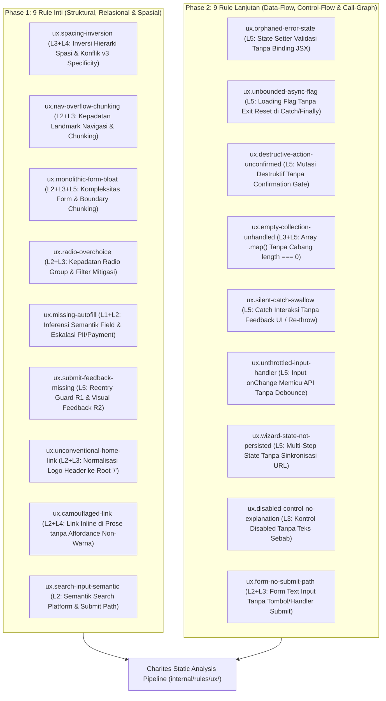
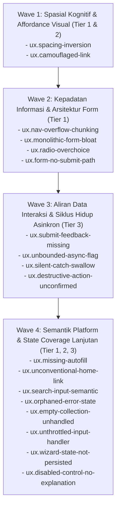

# EXPANSION-BATCH-03: Usability, Interaction Flow & Cognitive Invariants (`ux.*`)
> **Kode Dokumen:** `SPEC-EXP-03-UX`
> **Kategori:** `ux`
> **Pilar:** `01-SPEC` (WHAT - Spesifikasi Perilaku & Kontrak Rule)
> **Status:** Active Expansion Specification (18 Aturan: 9 Core Phase 1 + 9 Advanced Flow Phase 2)
> **Standar Rujukan:**
> - W3C DTCG (v2025.10) & Tailwind CSS v4 / v3 Engine Specifications
> - ISO 9241-110 (*Dialogue Principles & Ergonomics of Human-System Interaction*)
> - Nielsen Norman Group (NN/g) Usability Guidelines & Form Interaction Models
> - W3C HTML Living Standard Autocomplete Specifications
> - W3C Web Content Accessibility Guidelines (WCAG) 2.2 SC 1.4.1 (Use of Color), SC 3.3.7 (Redundant Entry)
> - Evidence-Based Static Program Analysis (Control-Flow & Call-Graph Synthesis)
> **Pilar Terkait:** [01-SPEC: themes.md](themes.md) & [01-SPEC: a11y.md](a11y.md)

---

## 1. Ikhtisar Kategori `ux` (18 Aturan Terkurasi)

Kategori `ux` Charites dirancang untuk menangkap anomali desain antarmuka dan interaksi yang berada di luar jangkauan linter konvensional (ESLint, Stylelint, `eslint-plugin-jsx-a11y`).

> **Prinsip Utama: Observable Invariant, Bukan Psychological Scoring**
> Prinsip-prinsip psikologi kognitif dan HCI (Gestalt, Miller, Hick, Tesler, Doherty, Jakob) diposisikan sebagai **Design Rationale** (alasan logis mengapa pola tersebut berdampak pada persepsi dan kenyamanan manusia). Sementara itu, Charites Rule Engine **hanya mengevaluasi predikat struktural dan invariant konkret**: rasio spasi antar-node, jumlah sibling interaktif, batas kontainer semantik, binding state-ke-prop, jalur eksekusi asinkron (CFG), trace identifier setter-ke-render, dan perbandingan warna hasil komputasi token.



---

## 2. Paradigma Arsitektur: 5 Layer Analisis & 3 Complexity Tier

Linter konvensional memeriksa kode per node AST secara atomik dan terisolasi. Oleh karena itu, linter biasa tidak mampu mendeteksi cacat UX yang membutuhkan analisis lintas node, evaluasi semantik peran komponen, atau pelacakan aliran data.

Charites menormalisasi kapabilitas mesin ke dalam **5 Layer Analisis**:

| Layer | Nama Layer | Deskripsi & Kemampuan Mesin | Mengapa Lolos Linter Konvensional |
| :--- | :--- | :--- | :--- |
| **L1** | **Syntax & Presence** | Memeriksa keberadaan tag, atribut literal, dan token kelas langsung. | Wilayah kerja linter biasa (`jsx-a11y`, `eslint`). Rule `ux.*` **tidak ada yang murni L1**. |
| **L2** | **Semantic Classification** | Menentukan peran fungsional node (nav link vs CTA, field vs filter, logo vs ilustrasi) via ARIA role, heuristik penamaan, dan **Component Semantic Registry**. | Linter biasa tidak memiliki model domain semantik dan tidak memahami abstraksi komponen custom. |
| **L3** | **Relational Graph** | Membandingkan relasi lintas node: rasio spasi parentchild, kedalaman subtree, jumlah sibling berkarakter sama, dan batas kontainer (*boundary chunking*). | Linter biasa bekerja per node, buta terhadap relasi spasial dan hierarkis antar elemen DOM. |
| **L4** | **Value Resolution** | Me-resolve token kelas (Tailwind v3/v4), CSS variable, dan design token ke nilai konkret (rem, px, oklch) via shared `ThemeTokenRegistry`. | Linter biasa hanya membaca string literal class tanpa mengompilasi nilai cascading atau skala desain. |
| **L5** | **Scope, Data-Flow & CFG** | Membangun binding graph antar identifier: state setter $\to$ JSX prop, pelacakan async handler, evaluasi exit path try/catch/finally, dan korelasi cross-hook. | Ini wilayah compiler/flow analysis, di luar jangkauan static syntax linter. |

### Pemetaan 3 Complexity Tier untuk Implementasi Engine

1. **Tier 1 (Single-Pass, Tree-Local AST):**
   Traversal AST lokal berbasis L1+L2+L3 tanpa memerlukan resolusi style rumit atau pelacakan CFG.
   *Target Rules:* `nav-overflow-chunking`, `monolithic-form-bloat`, `radio-overchoice`, `missing-autofill`, `unconventional-home-link`, `search-input-semantic`, `empty-collection-unhandled`, `form-no-submit-path`.
2. **Tier 2 (Scope & Token Resolution AST):**
   Memerlukan integrasi resolver CSS/token (L4) atau penelusuran declare-use variabel dalam satu scope komponen (L3/L5).
   *Target Rules:* `spacing-inversion`, `camouflaged-link`, `orphaned-error-state`, `unthrottled-input-handler`, `disabled-control-no-explanation`.
3. **Tier 3 (CFG, Call-Graph & Cross-Hook AST):**
   Membangun Control-Flow Graph (semua jalur keluar fungsi asinkron), call-graph fungsi handler, dan korelasi antar-hook React/Astro.
   *Target Rules:* `submit-feedback-missing`, `unbounded-async-flag`, `destructive-action-unconfirmed`, `silent-catch-swallow`, `wizard-state-not-persisted`.

---

## 3. Penyelarasan Sistemik dengan Rule Tema (`theme.*`)

Kategori `ux.*` berbagi fondasi desain sistem dengan kategori `theme.*` ([01-SPEC: themes.md](themes.md)):

### 3.1. Konsumsi Shared `ThemeTokenRegistry` (L4 Value Resolution)
- Aturan spasial (`ux.spacing-inversion`) dan keterbacaan link (`ux.camouflaged-link`) tidak menggunakan tebakan piksel sembarangan. Rule memanfaatkan `ThemeTokenRegistry` yang diekstrak langsung dari `global.css` (Tailwind v4 `@theme` atau Tailwind v3 config).
- **Deteksi Bug Spesifisitas Tailwind v3 vs v4:**
  Pada Tailwind v3, utility `space-y-*` menggunakan selector berbobot tinggi:
  ```css
  /* Tailwind v3 Space Plugin - Specificity (0, 3, 0) */
  > :not([hidden]) ~ :not([hidden]) { margin-top: calc(2rem * calc(1 - var(--tw-space-y-reverse))); }
  ```
  Jika child menambahkan `mt-4` berbobot `(0, 1, 0)`, margin child **kalah total secara diam-diam**.
  Pada Tailwind v4, selector dialihkan ke pseudo-class `:where()` berbobot `(0, 0, 0)` sehingga override child berfungsi normal. Analyzer `ux.spacing-inversion` bersikap *version-aware*: memberikan warning keras pada proyek v3 jika mendeteksi collision antara `space-y` kontainer dan `mt` child!

### 3.2. Penegakan Standar Rem Tailwind v4 (Bebas Arbitrary Pixel)
Selaras dengan arsitektur Charites, semua rekomendasi kode dan fixture pengujian dilarang menggunakan nilai sembarangan piksel `[...px]`. Seluruh ukuran tombol, input, dan padding wajib mematuhi standar rem Tailwind v4 (`h-11`, `min-h-11`, `py-2.5`, `px-4`, `text-sm`, `gap-3`).

### 3.3. Tri-Path Remediation Selaras
Setiap temuan `ux.*` memberikan 3 jalur penyelesaian transparan kepada developer:
1. **Opsi 1 (Struktur):** Perbaiki struktur DOM / tambahkan mekanisme grouping / pasang pending guard.
2. **Opsi 2 (Registrasi):** Daftarkan komponen kustom ke dalam `ComponentSemanticRegistry` jika komponen memiliki peran semantik internal.
3. **Opsi 3 (Supresi Eksplisit):** Berikan arahan supresi resmi jika desain memang memiliki kebutuhan khusus:
   - JSX/TSX: `{/* charites:ignore ux.nav-overflow-chunking -- single landing page hero */}`
   - Astro: `<!-- charites:ignore ux.nav-overflow-chunking -- single landing page hero -->`
   - SCRIPT: `// charites:ignore ux.nav-overflow-chunking`

---

## 4. Ringkasan Matriks Rule `ux.*` (18 Aturan)

| Rule ID | Invarian Presisi (Predikat AST) | Layer | Tier | Kenapa Lolos Linter Biasa | Severity | Autofix |
| :--- | :--- | :---: | :---: | :--- | :---: | :---: |
| `ux.spacing-inversion` | `intra_spacing(child) >= gap(parent)` per sumbu + deteksi tabrakan spesifisitas `space-y` vs `mt` di v3 | L3+L4 | T2 | Linter biasa mengevaluasi property terisolasi, bukan perbandingan komputasi spasi lintas node | `warning` / `advisory` |  |
| `ux.nav-overflow-chunking` | $N > 7 \land \neg \text{hasChunking}$, di mana $N$ hanya menghitung `a[href]` / navlink terdaftar (button CTA/toggle dikecualikan) | L2+L3 | T1 | Menghitung sibling butuh batas landmark + klasifikasi semantik (link vs action button) | `warning` |  |
| `ux.monolithic-form-bloat` | $(\text{total} > 9 \land \text{chunk} = 0) \lor (\text{per\_chunk} > 7)$. Radio group ber-`name` sama dihitung 1 field | L2+L3+L5 | T1 | Linter biasa tidak membedakan agregat field relasional terhadap batas `<fieldset>` atau step wizard | `warning` |  |
| `ux.radio-overchoice` | $N > 7 \land \neg \text{hasFilterInput}$ pada opsi radio ber-`name` sama atau ancestor radiogroup | L2+L3 | T1 | Pengelompokan `name` bersifat semantik; perlu pengecekan ketiadaan filter control | `warning` / `advisory` |  |
| `ux.missing-autofill` | Field identitas semantik (PII/kontak/alamat) tanpa `autocomplete`, atau `autocomplete="off"` pada password | L1+L2 | T1 | Atribut `autocomplete` valid jika ditiadakan menurut HTML schema; linter biasa mengabaikannya | `info` $\to$ `warning` (pass/pay) |  |
| `ux.submit-feedback-missing` | Handler trigger async mutation tanpa reentry lock (R1: `disabled`/`useActionState`) dan tanpa visual feedback (R2) | L5 | T3 | Membutuhkan tracing data-flow: JSX attr $\to$ handler def $\to$ async mutation $\to$ state binding | `error` (async) / `warning` |  |
| `ux.unconventional-home-link` | Node heuristik logo pada header utama tidak dibungkus tautan dengan target path ternormalisasi `"/"` | L2+L3 | T1 | Elemen gambar/SVG di header valid tanpa tautan; cacat bersumber dari ekspektasi mental model web | `warning` |  |
| `ux.camouflaged-link` | Anchor inline dalam konteks teks biasa (*prose*) tanpa pembeda non-warna persisten atau hanya `hover:underline` | L2+L4 | T2 | Class Tailwind valid per se; cacat muncul dari ketiadaan affordance visual terhadap teks sekitarnya | `warning` / `advisory` |  |
| `ux.search-input-semantic` | Input dengan intent pencarian menggunakan generic `type="text"`, atau `type="search"` tanpa form/submit path | L2 | T1 | Valid secara HTML sintaks; intent pencarian dan kegagalan keyboard mobile tidak terbaca linter biasa | `info` / `warning` |  |
| `ux.orphaned-error-state` | State setter error dipanggil di validasi, namun identifier error tidak pernah direferensikan dalam JSX return tree | L5 | T2 | `unused-vars` lolos karena variabel dipakai pada setter; butuh trace deklarasi $\to$ setter $\to$ render JSX | `warning` |  |
| `ux.unbounded-async-flag` | `setLoading(true)` dipanggil sebelum `await`, namun tidak ada reset di `finally` atau blok `catch` | L5 | T3 | Try/catch valid sintaks; butuh evaluasi Control-Flow Graph (CFG) pada seluruh exit path fungsi | `error` |  |
| `ux.destructive-action-unconfirmed` | Handler tombol memanggil mutasi destruktif (`/delete\|remove\|destroy/i`) tanpa dialog gating / modal konfirmasi | L5 | T3 | Pemanggilan fungsi valid; butuh call-graph resolution handler $\to$ body mutation $\to$ modal confirmation gate | `error` |  |
| `ux.empty-collection-unhandled` | Ekspresi `{items.map(...)}` tanpa percabangan kondisi penanganan saat koleksi kosong (`items.length === 0`) | L3+L5 | T1 | `.map()` pada array kosong mengembalikan `[]` tanpa runtime error; ini murni celah UX state coverage | `advisory` |  |
| `ux.silent-catch-swallow` | Blok `catch` interaksi pengguna hanya berisi `console.*` atau kosong tanpa umpan balik UI (toast/alert) & tanpa re-throw | L5 | T3 | Catch kosong valid di JS; butuh korelasi event handler interaktif $\to$ absennya pemanggilan feedback UI | `error` |  |
| `ux.unthrottled-input-handler` | Handler `onChange` pada text input memicu network/API call langsung tanpa wrapper debounce atau throttle | L5 | T2 | Butuh resolusi referensi fungsi handler $\to$ inspeksi pemanggilan network di body fungsi | `warning` |  |
| `ux.wizard-state-not-persisted` | Multi-step wizard state (`useState` step) tanpa sinkronisasi ke router/query params atau session storage | L5 | T3 | State lokal valid mandiri; cacat baru terbukti jika state multi-step tidak memiliki sinkronisasi URL | `warning` |  |
| `ux.disabled-control-no-explanation` | Kontrol berstatus `disabled={expr}` tanpa teks pendukung, tooltip, atau `aria-describedby` penjelas alasan | L3 | T2 | Binding boolean valid sintaks; cacat UX muncul dari ketidakjelasan alasan kontrol dinonaktifkan | `warning` |  |
| `ux.form-no-submit-path` | Form dengan input teks tidak memiliki tombol submit (`button[type=submit]`) dan tanpa handler `onSubmit` | L2+L3 | T1 | Valid secara markup; tombol Enter keyboard fisik/virtual mati total bagi pengguna | `error` |  |

---

## 5. Spesifikasi Detail & Kontrak AST Rule `ux.*`

---

### 5.1. `ux.spacing-inversion`
- **Design Rationale:** Gestalt Law of Proximity & Ritme Hierarki Visual. Elemen yang berelasi erat harus memiliki jarak lebih rapat daripada jarak pemisah antar-kelompok.
- **Invariant (Predikat AST):**
  Untuk kontainer parent $P$ dengan spacing antar-child $g$ (`gap-*`, `space-y-*`, `divide-*`) dan child $C$ dengan internal spacing $s$ (`mt-*`, `mb-*`, `pt-*`, `pb-*`):
  $$\text{intra\_spacing}(C) < \text{gap}(P) \quad (\text{dievaluasi per sumbu: vertikal dan horizontal})$$
- **Sub-Check Spesifisitas Tailwind v3 (Bug Engine Nyata):**
  Pada Tailwind v3, analyzer memeriksa apakah parent memiliki utility `space-y-*` sementara child memiliki `mt-*`. Karena selector v3 `> :not([hidden]) ~ :not([hidden])` memiliki bobot spesifisitas `(0, 3, 0)`, `mt-*` child berbobot `(0, 1, 0)` akan kalah secara diam-diam (*silent override failure*).
- **Anti-False-Positive & Skip Filter:**
  1. Child dengan posisi `absolute` atau `fixed` (di luar flow layout $\to$ *skip*).
  2. Margin negatif yang dipadukan dengan `z-*` atau utility transformasi (desain tumpukan visual yang disengaja $\to$ *skip*).
  3. Spacing berbasis CSS variable yang dinamis $\to$ turunkan ke severity `advisory`.
- **Suspicious (Inversi Spasi):**
  ```tsx
  {/* space-y-4 = 1rem (16px), mb-8 = 2rem (32px) -> Inversi Hierarki */}
  <section className="space-y-4">
    <div className="mb-8">
      <h3 className="text-sm font-semibold">Grup A</h3>
    </div>
  </section>
  ```
- **Compliant (Hierarki Tertata):**
  ```tsx
  <section className="space-y-8">
    <div className="mb-3">
      <h3 className="text-sm font-semibold">Grup A</h3>
    </div>
  </section>
  ```
- **Engine:** L3 Relational + L4 Value Resolution AST.
- **Severity:** `warning` (token ter-resolve) / `advisory` (token CSS variable).

---

### 5.2. `ux.nav-overflow-chunking`
- **Design Rationale:** Miller's Law ($7 \pm 2$) & Pengelompokan Arsitektur Informasi Navigasi.
- **Invariant (Predikat AST):**
  Dalam landmark `<nav>` atau elemen ber-role `navigation` di dalam header:
  $$\text{Count}(direct\ a[href] \mid NavLink) \le 7 \lor \text{hasChunkingMechanism} == \text{true}$$
- **Definisi Elemen Terhitung:**
  Hanya menghitung tautan navigasi (`<a>`, `<Link>`, `<NavLink>`). Elemen `<button>` (seperti CTA, tombol switch tema, tombol hamburger) **dikecualikan dari perhitungan $N$** untuk mencegah false positive.
- **Mekanisme Chunking yang Diakui:**
  1. Dropdown / Disclosure menu (`aria-expanded`, `<NavigationMenu>`, `<DropdownMenu>`).
  2. Tombol Hamburger / Mobile sheet drawer.
  3. Mega-menu dengan pembagian multi-kolom.
- **Suspicious (Navigasi Datar Berjejal):**
  ```tsx
  <nav className="flex items-center gap-4">
    <a href="/p1">Produk 1</a>
    <a href="/p2">Produk 2</a>
    <a href="/p3">Produk 3</a>
    <a href="/p4">Produk 4</a>
    <a href="/p5">Produk 5</a>
    <a href="/p6">Produk 6</a>
    <a href="/p7">Produk 7</a>
    <a href="/p8">Produk 8</a>
    <a href="/p9">Produk 9</a>
  </nav>
  ```
- **Compliant (Pengelompokan Terstruktur):**
  ```tsx
  <nav className="flex items-center gap-4">
    <a href="/p1">Produk 1</a>
    <a href="/p2">Produk 2</a>
    <NavigationMenu title="Kategori Lainnya">
      <NavigationMenuItem href="/p3">Produk 3</NavigationMenuItem>
      <NavigationMenuItem href="/p4">Produk 4</NavigationMenuItem>
    </NavigationMenu>
    <a href="/contact">Kontak</a>
  </nav>
  ```
- **Engine:** L2 Semantic + L3 Relational AST.
- **Severity:** `warning`.

---

### 5.3. `ux.monolithic-form-bloat`
- **Design Rationale:** Pengurangan Beban Kognitif Formulir & Penyelesaian Bertahap (*Progressive Task Completion*).
- **Invariant (Predikat AST):**
  Kompleksitas formulir dievaluasi secara berjenjang:
  $$\text{Total Field} > 9 \land \text{Chunk Count} == 0 \implies \text{Violation}$$
  $$\text{Field per Chunk} > 7 \implies \text{Violation}$$
- **Aturan Perhitungan Field:**
  - Menghitung `<input>`, `<select>`, `<textarea>`, dan komponen form terdaftar.
  - **Pengecualian Kritis:** Sekelompok radio button dengan atribut `name` yang sama **hanya dihitung sebagai 1 field logis** (mencegah double-counting dengan `ux.radio-overchoice`). Input bertipe `hidden`, `submit`, dan widget captcha dikecualikan.
- **Deteksi Chunking (L5 Scope):**
  - Mengakui `<fieldset>` / `<legend>`, komponen `<Stepper>`, `<Wizard>`, `<Tabs>`, serta **conditional render guard** (`{step === 1 && <StepOne />}`, `switch(step)`).
- **Suspicious (Formulir Raksasa Monolitik):**
  ```tsx
  <form onSubmit={handleSave} className="space-y-4">
    <Input name="f1" />
    <Input name="f2" />
    <Input name="f3" />
    <Input name="f4" />
    <Input name="f5" />
    <Input name="f6" />
    <Input name="f7" />
    <Input name="f8" />
    <Input name="f9" />
    <Input name="f10" />
    <button type="submit">Kirim</button>
  </form>
  ```
- **Compliant (Dikelompokkan secara Struktural):**
  ```tsx
  <form onSubmit={handleSave} className="space-y-6">
    <fieldset className="space-y-4">
      <legend className="text-sm font-semibold">Data Pribadi</legend>
      <Input name="f1" />
      <Input name="f2" />
      <Input name="f3" />
    </fieldset>
    <fieldset className="space-y-4">
      <legend className="text-sm font-semibold">Alamat Tagihan</legend>
      <Input name="f4" />
      <Input name="f5" />
      <Input name="f6" />
    </fieldset>
    <button type="submit">Kirim</button>
  </form>
  ```
- **Engine:** L2 Semantic + L3 Relational + L5 Scope AST.
- **Severity:** `warning`.

---

### 5.4. `ux.radio-overchoice`
- **Design Rationale:** Hick-Hyman Law. Waktu pengambilan keputusan meningkat secara logaritmik terhadap jumlah opsi yang disajikan secara datar.
- **Invariant (Predikat AST):**
  Untuk grup radio dengan `name` sama atau berada di dalam `role="radiogroup"` / `<RadioGroup>`:
  $$N \le 4 \implies \text{Pass}$$
  $$5 \le N \le 7 \implies \text{Advisory (Pertimbangkan Select)}$$
  $$N > 7 \land \neg \text{hasFilterInput} \implies \text{Warning}$$
- **Penanganan Dynamic Options:**
  Jika opsi dirender dari array dinamis (`options={dynamicList}`), analyzer **tidak berspekulasi runtime**, melainkan menandainya sebagai *unverifiable static* dan melewati (*skip*) node tersebut.
- **Suspicious:**
  ```tsx
  <div className="space-y-2">
    <label>Pilih Provinsi Asal:</label>
    <input type="radio" name="province" value="1" /> Aceh
    <input type="radio" name="province" value="2" /> Sumut
    <input type="radio" name="province" value="3" /> Sumbar
    {/* ... 15 opsi radio berjejal tanpa search ... */}
  </div>
  ```
- **Compliant:**
  ```tsx
  <Combobox
    options={provinceOptions}
    placeholder="Cari provinsi..."
    searchable={true}
  />
  ```
- **Engine:** L2 Semantic + L3 Relational AST.
- **Severity:** `warning` ($N > 7$) / `advisory` ($5 \le N \le 7$).

---

### 5.5. `ux.missing-autofill`
- **Design Rationale:** Tesler's Law of Conservation of Complexity & WCAG 2.2 SC 3.3.7 (Redundant Entry).
- **Invariant (Predikat AST):**
  Field yang cocok dengan kamus semantik PII (nama, telepon, alamat, password) harus memiliki atribut `autoComplete` yang valid menurut W3C HTML Living Standard.
- **3 Sub-Check Presisi:**
  1. **Token Inference:** Menginferensikan semantik dari `name`, `id`, `type`, `label`, atau `placeholder`. Missing autocomplete pada identitas biasa $\to$ `info`. **Eskalasi menjadi `warning` khusus untuk field password dan pembayaran (*credit card*)** karena friksi password manager terbukti nyata.
  2. **Grammar Validity:** Memastikan token autocomplete mematuhi grammar resmi W3C (misal `section-billing cc-number`). Nilai token salah eja di-flag sebagai `warning` karena browser akan mengabaikannya secara diam-diam.
  3. **Password Off Check:** Atribut `autocomplete="off"` pada input password di-flag sebagai `warning` karena diabaikan oleh browser modern dan mengganggu password manager.
- **Suspicious:**
  ```tsx
  <input type="password" name="new_password" />
  ```
- **Compliant:**
  ```tsx
  <input type="password" name="new_password" autoComplete="new-password" />
  ```
- **Engine:** L1 Syntax + L2 Semantic AST.
- **Severity:** `warning` (password/payment) / `info` (profil umum). Autofix tersedia untuk token deterministik.

---

### 5.6. `ux.submit-feedback-missing`
- **Design Rationale:** Doherty Threshold & Pencegahan Mutasi Ganda (*Duplicate-Action Prevention*).
- **Invariant (Data-Flow Contract):**
  Setiap pemicu mutasi asinkron (tombol submit form atau action button dengan handler async) wajib memenuhi dua kontrak:
  1. **R1 (Reentry Guard):** Mengunci kontrol interaksi selama operasi berlangsung (`disabled={isPending}`, hook `useFormStatus`, `useActionState`, TanStack `mutation.isPending`).
  2. **R2 (Perceivable Feedback):** Memberikan sinyal visual bahwa operasi sedang berjalan (`aria-busy="true"`, indikator spinner bersyarat, atau label teks yang berubah).
- **Evaluasi Severity Dinamis:**
  - Async terkonfirmasi secara data-flow + R1 & R2 absen $\implies$ **`error`** (Satu-satunya rule `ux.*` ber-severity error).
  - Async terkonfirmasi + R1 ada namun R2 absen $\implies$ **`warning`**.
  - Handler asinkron lintas modul tak ter-resolve $\implies$ **`warning` (confidence medium)**.
- **Suspicious:**
  ```tsx
  const handleSave = async () => {
    await api.post("/invoice", data);
  };
  <button onClick={handleSave}>Bayar Sekarang</button>
  ```
- **Compliant:**
  ```tsx
  <button
    type="button"
    onClick={handleSave}
    disabled={isPending}
    aria-busy={isPending}
    className="h-11 px-4 text-sm font-medium bg-primary text-primary-foreground"
  >
    {isPending ? "Memproses Pembayaran..." : "Bayar Sekarang"}
  </button>
  ```
- **Engine:** L5 Scope & Data-Flow AST.
- **Severity:** `error` (kondisional pada async terkonfirmasi).

---

### 5.7. `ux.unconventional-home-link`
- **Design Rationale:** Jakob's Law of Internet User Experience (mental model bahwa logo brand di header selalu mengarah ke halaman beranda).
- **Invariant (Predikat AST):**
  Elemen identitas/brand di dalam header utama (`<header>`) harus berada di dalam tautan (`<a>` / `<Link>`) dengan href ternormalisasi ke root (`"/"`).
- **Pipeline Deteksi Logo:**
  - Elemen `` dengan `alt` non-kosong yang cocok dengan `/logo|brand/i`.
  - Elemen `<svg>` dengan class atau testid brand/logo.
  - Komponen kustom bernama `/Logo|Brand|Wordmark|SiteLogo/i`.
- **Normalisasi URL Href:**
  Analyzer menormalisasi tautan dengan menghapus trailing slash, origin host, dan prefix locale dari konfigurasi (`/en`, `/id`) untuk memastikan kecocokan dengan `"/"`.
- **Suspicious:**
  ```tsx
  <header className="h-16 flex items-center px-4 border-b">
    
    <nav className="ml-auto">...</nav>
  </header>
  ```
- **Compliant:**
  ```tsx
  <header className="h-16 flex items-center px-4 border-b">
    <a href="/" aria-label="Beranda" className="flex items-center">
      
    </a>
    <nav className="ml-auto">...</nav>
  </header>
  ```
- **Engine:** L2 Semantic + L3 Relational AST.
- **Severity:** `warning`.

---

### 5.8. `ux.camouflaged-link`
- **Design Rationale:** Visual Affordance & WCAG 2.2 SC 1.4.1 (Use of Color). Tautan interaktif tidak boleh hanya mengandalkan warna untuk membedakan dirinya dari teks sekitarnya.
- **Scope Ketat (Anti-False-Positive):**
  Hanya mengevaluasi anchor inline di dalam **konteks bacaan / prose** (ancestor `<p>`, `<li>`, `.prose`, `.rich-text`, atau komponen Typography). Elemen navigasi navbar, sidebar menu, dan action card dikecualikan secara otomatis.
- **Kondisi Pelanggaran:**
  1. Link inline menggunakan utility `no-underline` dan warna teks identik atau mewarisi teks induk (`text-inherit`).
  2. **Affordance Hanya Saat Hover:** Menggunakan `hover:underline` tanpa penanda non-warna persisten saat idle (pengguna tidak tahu teks tersebut dapat diklik sebelum melakukan hover).
- **Suspicious:**
  ```tsx
  <p className="text-muted-foreground text-sm">
    Silakan baca <a href="/terms" className="text-inherit hover:underline">syarat dan ketentuan</a> kami.
  </p>
  ```
- **Compliant:**
  ```tsx
  <p className="text-muted-foreground text-sm">
    Silakan baca <a href="/terms" className="text-primary underline font-medium hover:text-primary/80 focus-visible:ring-2">syarat dan ketentuan</a> kami.
  </p>
  ```
- **Engine:** L2 Semantic + L4 Value Resolution AST.
- **Severity:** `warning`.

---

### 5.9. `ux.search-input-semantic`
- **Design Rationale:** Platform Ergonomics & Virtual Keyboard Optimization.
- **Invariant (Predikat AST):**
  1. Input yang terindikasi sebagai pencarian wajib menggunakan semantik `type="search"` atau `role="searchbox"`.
  2. **Cross-Check Submit Path:** Input dengan `type="search"` yang **tidak memiliki form ancestor dan tidak memiliki submit handler** di-flag sebagai `warning` karena tombol 'Search' pada keyboard virtual mobile tidak akan memicu aksi apapun.
- **Suspicious:**
  ```tsx
  <input type="text" name="q" placeholder="Cari artikel..." className="h-11 px-3.5 border rounded-lg" />
  ```
- **Compliant:**
  ```tsx
  <form onSubmit={handleSearch} role="search">
    <input type="search" name="q" placeholder="Cari artikel..." className="h-11 px-3.5 border rounded-lg" />
  </form>
  ```
- **Engine:** L2 Semantic AST.
- **Severity:** `info` (tipe semantik) / `warning` (absennya submit path).

---

### 5.10. `ux.orphaned-error-state` (Fase 2)
- **Design Rationale:** Transparansi Umpan Balik Validasi Form.
- **Invariant (Data-Flow Trace):**
  Identifier setter pesan kesalahan (misal `setEmailError("Email tidak valid")`) yang dipanggil dalam fungsi validasi harus memiliki identifier state (`emailError`) yang direferensikan dalam return JSX komponen.
- **Mengapa Lolos Linter Biasa:** Aturan `no-unused-vars` lolos karena variabel dipakai saat memanggil setter. Dibutuhkan trace alur deklarasi $\to$ setter $\to$ konsumsi render JSX.
- **Suspicious:**
  ```tsx
  const [emailError, setEmailError] = useState("");
  const validate = () => {
    if (!email.includes("@")) setEmailError("Format salah");
  };
  return <input value={email} onChange={e => setEmail(e.target.value)} />;
  // emailError tidak pernah dirender di return JSX!
  ```
- **Compliant:**
  ```tsx
  return (
    <div>
      <input value={email} onChange={e => setEmail(e.target.value)} />
      {emailError && <span className="text-sm text-destructive">{emailError}</span>}
    </div>
  );
  ```
- **Engine:** L5 Data-Flow AST (Declare-Use Trace).
- **Severity:** `warning`.

---

### 5.11. `ux.unbounded-async-flag` (Fase 2)
- **Design Rationale:** Eliminasi Deadlock Status Antarmuka & Spinner Tak Terbatas.
- **Invariant (Control-Flow Graph):**
  Jika fungsi asinkron memanggil setter status loading (`setLoading(true)`) sebelum operasi `await`, maka **seluruh jalur keluar (exit path)** fungsi (baik blok `finally` maupun blok `catch`) wajib me-reset status loading (`setLoading(false)`).
- **Suspicious:**
  ```tsx
  const fetchData = async () => {
    setLoading(true);
    try {
      await api.get("/users");
    } catch (err) {
      console.error(err);
      // Lupa setLoading(false)! Spinner berputar selamanya jika API gagal.
    }
  };
  ```
- **Compliant:**
  ```tsx
  const fetchData = async () => {
    setLoading(true);
    try {
      await api.get("/users");
    } finally {
      setLoading(false); // Reset dijamin di semua skenario
    }
  };
  ```
- **Engine:** L5 Control-Flow AST (Exit-Path Graph).
- **Severity:** `error`.

---

### 5.12. `ux.destructive-action-unconfirmed` (Fase 2)
- **Design Rationale:** Mitigasi Kesalahan Tidak Disengaja (*Slips and Lapses Prevention* - Nielsen Heuristics #5).
- **Invariant (Call-Graph Resolution):**
  Handler interaksi pengguna yang memicu fungsi mutasi bernada destruktif (mencocokkan `/delete|remove|destroy|purge|revoke/i`) wajib memiliki gating dialog konfirmasi (`window.confirm`, komponen `<AlertDialog>`, atau flag konfirmasi 2-langkah).
- **Suspicious:**
  ```tsx
  <button onClick={() => deleteUser(user.id)} className="text-destructive">
    Hapus Akun
  </button>
  ```
- **Compliant:**
  ```tsx
  <AlertDialogTrigger asChild>
    <button className="text-destructive">Hapus Akun</button>
  </AlertDialogTrigger>
  ```
- **Engine:** L5 Call-Graph AST.
- **Severity:** `error`.

---

### 5.13. `ux.empty-collection-unhandled` (Fase 2)
- **Design Rationale:** Zero Empty State Confusion.
- **Invariant (Branch Coverage AST):**
  Ekspresi rendering daftar `{collection.map(...)}` harus memiliki penanganan cabang kondisi ketika koleksi kosong (`collection.length === 0`).
- **Suspicious:**
  ```tsx
  <div className="space-y-2">
    {invoices.map(inv => <InvoiceRow key={inv.id} data={inv} />)}
  </div>
  ```
- **Compliant:**
  ```tsx
  <div className="space-y-2">
    {invoices.length === 0 ? (
      <EmptyState title="Belum ada tagihan" />
    ) : (
      invoices.map(inv => <InvoiceRow key={inv.id} data={inv} />)
    )}
  </div>
  ```
- **Engine:** L3 Relational + L5 AST.
- **Severity:** `advisory`.

---

### 5.14. `ux.silent-catch-swallow` (Fase 2)
- **Design Rationale:** User Feedback on Failure & State Recoverability.
- **Invariant (CFG Catch Body Classifier):**
  Blok `catch` pada handler interaksi pengguna dilarang menelan error secara senyap (hanya `console.log` atau kosong) tanpa memicu pemanggilan feedback ke antarmuka (toast, alert, banner error) atau melakukan *re-throw*.
- **Suspicious:**
  ```tsx
  const handleUpdate = async () => {
    try {
      await api.updateProfile(data);
    } catch (e) {
      console.log(e); // Pengguna tidak tahu aksi mereka gagal!
    }
  };
  ```
- **Compliant:**
  ```tsx
  const handleUpdate = async () => {
    try {
      await api.updateProfile(data);
    } catch (e) {
      toast.error("Gagal memperbarui profil. Coba lagi.");
    }
  };
  ```
- **Engine:** L5 Control-Flow AST.
- **Severity:** `error`.

---

### 5.15. `ux.unthrottled-input-handler` (Fase 2)
- **Design Rationale:** System Performance & Keystroke Input Optimization.
- **Invariant (Handler Body Scan):**
  Fungsi yang terpasang pada atribut `onChange` input teks dilarang memanggil network call / fetch API secara langsung tanpa pembungkus debounce atau throttle.
- **Suspicious:**
  ```tsx
  <input onChange={e => fetchSuggestions(e.target.value)} />
  ```
- **Compliant:**
  ```tsx
  const debouncedSearch = useDebouncedCallback(fetchSuggestions, 300);
  <input onChange={e => debouncedSearch(e.target.value)} />
  ```
- **Engine:** L5 Scope & Data-Flow AST.
- **Severity:** `warning`.

---

### 5.16. `ux.wizard-state-not-persisted` (Fase 2)
- **Design Rationale:** State Resilience & Navigational Integrity.
- **Invariant (Cross-Hook Correlation):**
  Pengontrol tahapan multi-step form (`useState` bertema step/activeStep) wajib memiliki sinkronisasi ke router/query parameters (`useSearchParams`, `router.query`) atau storage browser agar status form tidak hilang saat pengguna melakukan refresh halaman.
- **Suspicious:**
  ```tsx
  const [currentStep, setCurrentStep] = useState(1);
  // Multi-step form 5 tahap tanpa sync query params -> refresh reset ke step 1!
  ```
- **Compliant:**
  ```tsx
  const [step, setStep] = useQueryState("step", parseAsInteger.withDefault(1));
  ```
- **Engine:** L5 Cross-Hook AST.
- **Severity:** `warning`.

---

### 5.17. `ux.disabled-control-no-explanation` (Fase 2)
- **Design Rationale:** Explainable UI & Affordance Clarity.
- **Invariant (Binding-Sibling AST):**
  Tombol atau kontrol input yang dinonaktifkan secara dinamis (`disabled={condition}`) wajib memiliki teks penjelas alasan, tooltip, atau asosiasi `aria-describedby` di sekitarnya yang menjelaskan mengapa kontrol tersebut tidak dapat diakses.
- **Suspicious:**
  ```tsx
  <button disabled={cartTotal < 50000} className="bg-primary">
    Checkout
  </button>
  ```
- **Compliant:**
  ```tsx
  <div>
    <button disabled={cartTotal < 50000} aria-describedby="min-order-hint">
      Checkout
    </button>
    {cartTotal < 50000 && (
      <p id="min-order-hint" className="text-xs text-muted-foreground mt-1">
        Minimum pembelian Rp 50.000 untuk checkout.
      </p>
    )}
  </div>
  ```
- **Engine:** L3 Relational + L5 AST.
- **Severity:** `warning`.

---

### 5.18. `ux.form-no-submit-path` (Fase 2)
- **Design Rationale:** Keyboard Accessibility & Natural Form Submission.
- **Invariant (Form Tree AST):**
  Setiap elemen `<form>` yang memiliki setidaknya satu input teks wajib memiliki tombol submit eksplisit (`<button type="submit">` atau atribut `form="form-id"`) ATAU handler `onSubmit` pada form.
- **Suspicious:**
  ```tsx
  <form>
    <input type="text" name="search" />
    <button type="button" onClick={handleSearch}>Cari</button>
  </form>
  {/* Tombol Enter pada keyboard desktop & virtual keyboard mobile mati! */}
  ```
- **Compliant:**
  ```tsx
  <form onSubmit={handleSearch}>
    <input type="text" name="search" />
    <button type="submit">Cari</button>
  </form>
  ```
- **Engine:** L2 Semantic + L3 Relational AST.
- **Severity:** `error`.

---

## 6. Rubrik Severity, Confidence Scoring & Auto-Downgrade

Tingkat keparahan (*Severity*) dievaluasi secara dinamis berdasarkan dampak fungsional dan tingkat keyakinan bukti AST (*Confidence Score*):

```text
┌──────────────┬───────────────────────────────┬──────────────────────────────────────────┐
│   Severity   │ Kriteria Penentuan            │ Kondisi Auto-Downgrade                   │
├──────────────┼───────────────────────────────┼──────────────────────────────────────────┤
│ error        │ Interaksi rusak total /       │ Diturunkan ke warning jika handler       │
│              │ potensi data hilang/ganda     │ berada lintas berkas (cross-file         │
│              │ dengan Confidence HIGH        │ import) yang tidak ter-resolve penuh.    │
├──────────────┼───────────────────────────────┼──────────────────────────────────────────┤
│ warning      │ Pelanggaran konvensi terukur  │ Diturunkan ke advisory jika kalkulasi    │
│              │ (WCAG, platform, hierarki)    │ nilai mengandalkan CSS variable dinamis  │
│              │ dengan Confidence >= MEDIUM   │ atau komponen custom tanpa registry.     │
├──────────────┼───────────────────────────────┼──────────────────────────────────────────┤
│ advisory     │ Peluang optimasi pengalaman   │ -                                        │
│              │ pengguna & kenyamanan state   │                                          │
├──────────────┼───────────────────────────────┼──────────────────────────────────────────┤
│ info         │ Peningkatan semantik platform │ -                                        │
│              │ & progressive enhancement     │                                          │
└──────────────┴───────────────────────────────┴──────────────────────────────────────────┘
```

---

## 7. Infrastruktur Anti-False-Positive

### 7.1. Component Semantic Registry (YAML Schema)
Untuk mendukung fleksibilitas ekosistem modern (`shadcn/ui`, `radix-ui`, `mui`, `chakra`), Charites menyediakan skema registrasi peran semantik komponen di file `.charites.yml` dengan konfigurasi bawaan tersemat:

```yaml
# charites.yml
semantics:
  components:
    Button:
      role: button
      variants:
        cta: [primary, default]
    NavigationMenu:
      role: navigation-chunk
    RadioGroup:
      role: radiogroup
    Stepper:
      role: form-step-chunk
    Logo:
      role: brand-identity
```

### 7.2. Konfigurasi Ambang Batas (Configurable Thresholds)
Pengembang dapat menyesuaikan ambang batas batas invarian sesuai arsitektur informasi produk:
```yaml
ux:
  nav:
    max_direct_links: 7
  form:
    max_total_fields: 9
    max_fields_per_chunk: 7
  radio:
    max_flat_options: 7
```

---

## 8. Struktur Modul & Roadmap Implementasi

Struktur modul pada `internal/rules/ux/` dibagi secara modular:

```text
internal/rules/ux/
├── relational/             # Tier 1 & 2: Spacing, Density, Boundary Chunking
│   ├── spacing_inversion.go
│   ├── nav_overflow_chunking.go
│   ├── monolithic_form_bloat.go
│   ├── radio_overchoice.go
│   └── form_no_submit_path.go
│
├── semantic/               # Tier 1: Semantik Platform & Brand
│   ├── missing_autofill.go
│   ├── unconventional_home_link.go
│   └── search_input_semantic.go
│
├── visual/                 # Tier 2: Resolusi Affordance Visual Prose
│   └── camouflaged_link.go
│
├── stateflow/              # Tier 2 & 3: Scope, CFG, Call-Graph & Data-Flow
│   ├── submit_feedback_missing.go
│   ├── orphaned_error_state.go
│   ├── unbounded_async_flag.go
│   ├── destructive_action_unconfirmed.go
│   ├── empty_collection_unhandled.go
│   ├── silent_catch_swallow.go
│   ├── unthrottled_input_handler.go
│   ├── wizard_state_not_persisted.go
│   └── disabled_control_no_explanation.go
│
├── contract_test.go        # 8-Pillars Canonical Contract Validator
└── benchmark_test.go       # QUAL-03 Zero Allocation Benchmarks
```


