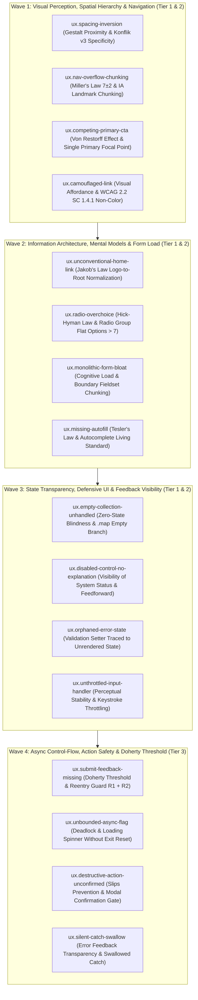
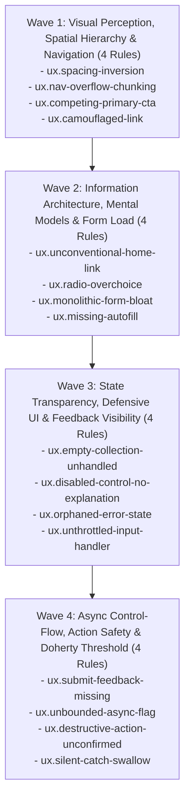

# EXPANSION-BATCH-03: Usability, Interaction Flow & Cognitive Invariants (`ux.*`)
> **Kode Dokumen:** `SPEC-EXP-03-UX`
> **Kategori:** `ux`
> **Pilar:** `01-SPEC` (WHAT - Spesifikasi Perilaku & Kontrak Rule)
> **Status:** Active Expansion Specification (16 Aturan Terkurasi: 4 Wave × 4 Aturan)
> **Standar Rujukan:**
> - W3C DTCG (v2025.10) & Tailwind CSS v4 / v3 Engine Specifications
> - ISO 9241-110 (*Dialogue Principles & Ergonomics of Human-System Interaction*)
> - Nielsen Norman Group (NN/g) Usability Guidelines & Form Interaction Models
> - Laws of UX (Jon Yablonski): Gestalt Proximity, Miller's Law, Von Restorff Effect, Hick-Hyman Law, Jakob's Law, Tesler's Law, Doherty Threshold, Zero-State Usability, Slips & Mistakes Prevention (Nielsen #5)
> - W3C HTML Living Standard Autocomplete Specifications
> - W3C Web Content Accessibility Guidelines (WCAG) 2.2 SC 1.4.1 (Use of Color), SC 3.3.7 (Redundant Entry)
> - Evidence-Based Static Program Analysis (Control-Flow & Call-Graph Synthesis)
> **Pilar Terkait:** [01-SPEC: themes.md](themes.md) & [01-SPEC: a11y.md](a11y.md)

---

## 1. Ikhtisar Kategori `ux` (16 Aturan Terkurasi dalam 4 Wave)

Kategori `ux` Charites dirancang untuk menangkap anomali desain antarmuka, friksi interaksi, dan pelanggaran hukum psikologi kognitif manusia yang berada di luar jangkauan linter konvensional (ESLint, Stylelint, `eslint-plugin-jsx-a11y`).

> **Prinsip Utama: Metered Psychology of UX, Bukan Scoring Opini**
> Prinsip-prinsip psikologi kognitif dan HCI (*Gestalt, Miller, Von Restorff, Hick-Hyman, Jakob, Tesler, Doherty, Nielsen Heuristics*) diposisikan sebagai **Design Rationale** yang ditransformasikan menjadi **predikat invarian terukur (*metered invariants*)**:
> rasio spasi intra-child vs parent-gap, jumlah direct sibling links pada landmark, jumlah primary CTA dalam satu container, affordance non-warna pada link inline, batas field tanpa boundary chunking, binding state-ke-prop JSX, dan kelengkapan exit-path CFG fungsi asinkron.



---

## 2. Paradigma Arsitektur: 5 Layer Analisis & 3 Complexity Tier

Charites menormalisasi kapabilitas engine ke dalam **5 Layer Analisis**:

| Layer | Nama Layer | Deskripsi & Kemampuan Mesin | Mengapa Lolos Linter Konvensional |
| :--- | :--- | :--- | :--- |
| **L1** | **Syntax & Presence** | Memeriksa keberadaan tag, atribut literal, dan token kelas langsung. | Wilayah kerja linter biasa. Rule `ux.*` **tidak ada yang murni L1**. |
| **L2** | **Semantic Classification** | Menentukan peran fungsional node (nav link vs CTA, field vs filter, logo vs ilustrasi) via ARIA role, heuristik penamaan, dan **Component Semantic Registry**. | Linter biasa tidak memiliki model domain semantik dan tidak memahami abstraksi komponen custom. |
| **L3** | **Relational Graph** | Membandingkan relasi lintas node: rasio spasi parent-child, kedalaman subtree, jumlah sibling berkarakter sama, dan batas kontainer (*boundary chunking*). | Linter biasa bekerja per node, buta terhadap relasi spasial dan hierarkis antar elemen DOM. |
| **L4** | **Value Resolution** | Me-resolve token kelas (Tailwind v3/v4), CSS variable, dan design token ke nilai konkret (rem, px, oklch) via shared `ThemeTokenRegistry`. | Linter biasa hanya membaca string literal class tanpa mengompilasi nilai cascading atau skala desain. |
| **L5** | **Scope, Data-Flow & CFG** | Membangun binding graph antar identifier: state setter $\to$ JSX prop, pelacakan async handler, evaluasi exit path try/catch/finally, dan call-graph modal gating. | Wilayah compiler/flow analysis, di luar jangkauan static syntax linter. |

### Pemetaan 3 Complexity Tier untuk Implementasi Engine

1. **Tier 1 (Single-Pass, Tree-Local AST):**
   Traversal AST lokal berbasis L1+L2+L3 tanpa resolusi style rumit atau pelacakan CFG.
   *Target Rules:* `nav-overflow-chunking`, `competing-primary-cta`, `unconventional-home-link`, `radio-overchoice`, `monolithic-form-bloat`, `missing-autofill`, `empty-collection-unhandled`.
2. **Tier 2 (Scope & Token Resolution AST):**
   Memerlukan integrasi resolver CSS/token (L4) atau penelusuran declare-use variabel dalam satu scope komponen (L3/L5).
   *Target Rules:* `spacing-inversion`, `camouflaged-link`, `disabled-control-no-explanation`, `orphaned-error-state`, `unthrottled-input-handler`.
3. **Tier 3 (CFG, Call-Graph & Cross-Hook AST):**
   Membangun Control-Flow Graph (semua jalur keluar fungsi asinkron) dan call-graph fungsi handler.
   *Target Rules:* `submit-feedback-missing`, `unbounded-async-flag`, `destructive-action-unconfirmed`, `silent-catch-swallow`.

---

## 3. Garansi Zero Redundancy & Batasan Delegasi Lintas Kategori

Untuk mencegah duplikasi antar-kategori (`a11y`, `ergonomy`, `responsive`, `mobile`, `theme`), batas evaluasi tiap rule didefinisikan secara presisi:

| Rule `ux.*` | Rule Kategori Lain Terdekat | Garansi Batasan (*Orthogonal Boundary*) |
|---|---|---|
| `ux.nav-overflow-chunking` | `responsive.mobile-density-overload` | `responsive.mobile-density-overload` membatasi baris tombol aksi horizontal di viewport ponsel. `ux.nav-overflow-chunking` mengevaluasi Information Architecture (Miller's Law) pada landmark `<nav>` (`<a>`, `<NavLink>`). Tombol aksi/CTA dieksklusikan. |
| `ux.competing-primary-cta` | `a11y.touch-target-size` | `a11y` hanya mengukur dimensi piksel fisik tombol ($\ge 44\text{px}$). `ux.competing-primary-cta` mengevaluasi hukum Von Restorff (keberadaan $> 1$ primary button dalam 1 action container) yang memicu *choice paralysis*. |
| `ux.camouflaged-link` | `theme.hardcode-color` | `theme` mengecek token warna semantik vs raw hex. `ux.camouflaged-link` mengecek keterbacaan teks/affordance WCAG 2.2 SC 1.4.1: link inline dalam paragraf teks/prose dilarang hanya mengandalkan warna tanpa underline/affordance non-warna persisten. |
| `ux.missing-autofill` | `ergonomy.missing-inputmode-keyboard` | `ergonomy` mengatur tipe keyboard virtual ponsel via `inputmode`. `ux.missing-autofill` mengatur interaksi browser password/autofill manager via W3C Living Standard `autocomplete`. |
| `ux.orphaned-error-state` | `a11y.error-not-announced` | `a11y` mengecek apakah container error memiliki `role="alert"` / `aria-live`. `ux.orphaned-error-state` mengecek compiler data-flow: setter error JS/TS dijalankan tetapi identifier error sama sekali tidak pernah di-render ke JSX. |
| `ux.disabled-control-no-explanation` | `a11y.label-missing-control` | `a11y` mengecek relasi label dengan kontrol. `ux` mengecek tombol yang di-`disabled` secara dinamis tanpa penjelasan teks pendukung atau `aria-describedby` bagi pengguna. |
| `ux.destructive-action-unconfirmed` | `mobile.fixed-action-obstruction` | `mobile` mengecek tabrakan posisi fixed di layar. `ux` mengecek call-graph handler aksi destruktif (`delete`, `remove`) wajib memiliki modal dialog konfirmasi. |

---

## 4. Ringkasan Matriks 16 Rule `ux.*`

| Wave | Rule ID | Metered Psychology of UX | Invarian Presisi (Predikat AST) | Layer | Tier | Severity |
| :---: | :--- | :--- | :--- | :---: | :---: | :---: |
| **W1** | `ux.spacing-inversion` | **Gestalt Law of Proximity** | $\text{intra\_spacing}(C) \ge \text{gap}(P)$ per sumbu + konflik spesifisitas v3 `space-y` vs `mt` | L3+L4 | T2 | `warning` |
| **W1** | `ux.nav-overflow-chunking` | **Miller's Law ($7 \pm 2$)** | Direct nav links $N > 7 \land \neg \text{hasChunking}$ dalam landmark `<nav>` | L2+L3 | T1 | `warning` |
| **W1** | `ux.competing-primary-cta` | **Von Restorff Effect** | $\text{Count}(\text{Primary CTA Buttons}) > 1$ dalam satu action container / flex row | L2+L3 | T1 | `warning` |
| **W1** | `ux.camouflaged-link` | **Visual Affordance & WCAG SC 1.4.1** | Link inline dalam prose tanpa underline persisten atau penanda non-warna | L2+L4 | T2 | `warning` |
| **W2** | `ux.unconventional-home-link` | **Jakob's Law** | Logo/brand di header tidak dibungkus link dengan target href normalisasi `"/"` | L2+L3 | T1 | `warning` |
| **W2** | `ux.radio-overchoice` | **Hick-Hyman Law** | $N > 7$ opsi radio ber-`name` sama tanpa filter input / saran combobox | L2+L3 | T1 | `warning` |
| **W2** | `ux.monolithic-form-bloat` | **Cognitive Load & Chunking** | Total fields $> 9$ tanpa chunking atau field per-chunk $> 7$ | L2+L3+L5 | T1 | `warning` |
| **W2** | `ux.missing-autofill` | **Tesler's Law of Complexity** | Input PII/password/payment tanpa `autocomplete` atau `autocomplete="off"` | L1+L2 | T1 | `info` $\to$ `warning` |
| **W3** | `ux.empty-collection-unhandled` | **Zero-State Usability** | Ekspresi `{items.map(...)}` tanpa penanganan kondisi `items.length === 0` | L3+L5 | T1 | `advisory` |
| **W3** | `ux.disabled-control-no-explanation` | **Visibility of System Status** | Kontrol `disabled={condition}` tanpa teks pendukung, tooltip, atau `aria-describedby` | L3 | T2 | `warning` |
| **W3** | `ux.orphaned-error-state` | **Error Recognition (Nielsen #9)** | State setter error dipanggil di validasi, namun variabel error tidak direferensikan di JSX | L5 | T2 | `warning` |
| **W3** | `ux.unthrottled-input-handler` | **Perceptual Stability** | Handler `onChange` input teks memicu API network langsung tanpa debounce/throttle | L5 | T2 | `warning` |
| **W4** | `ux.submit-feedback-missing` | **Doherty Threshold & Reentry Guard** | Handler trigger async mutation tanpa reentry lock (R1) dan visual feedback (R2) | L5 | T3 | `error` / `warning` |
| **W4** | `ux.unbounded-async-flag` | **Deadlock & Infinite Wait** | `setLoading(true)` sebelum `await` tanpa jaminan reset di `finally` atau `catch` | L5 | T3 | `error` |
| **W4** | `ux.destructive-action-unconfirmed` | **Slips & Mistakes Prevention** | Handler mutasi destruktif (`delete/remove`) tanpa modal dialog konfirmasi | L5 | T3 | `error` |
| **W4** | `ux.silent-catch-swallow` | **Feedback Transparency** | Blok `catch` interaksi pengguna kosong atau hanya `console.*` tanpa umpan balik UI | L5 | T3 | `error` |

---

## 5. Spesifikasi Detail & Kontrak AST 16 Rule `ux.*`

### 5.1. `ux.spacing-inversion` (Wave 1)
- **Metered Psychology:** **Gestalt Law of Proximity** (elemen yang berelasi logis harus lebih rapat daripada jarak pemisah antar-kelompok luar).
- **Invariant (Predikat AST):**
  Untuk kontainer parent $P$ dengan gap $g$ (`gap-*`, `space-y-*`) dan child $C$ dengan internal margin/padding $s$ (`mt-*`, `mb-*`, `pt-*`, `pb-*`):
  $$\text{intra\_spacing}(C) < \text{gap}(P) \quad (\text{dievaluasi per sumbu: vertikal dan horizontal})$$
- **Sub-Check Spesifisitas Tailwind v3:**
  Jika parent v3 memiliki `space-y-*` dan child memiliki `mt-*`, flag sebagai warning keras karena selector v3 `> :not([hidden]) ~ :not([hidden])` `(0, 3, 0)` mengalahkan `mt-*` `(0, 1, 0)` secara diam-diam.
- **Suspicious:**
  ```tsx
  <section className="space-y-4">
    <div className="mb-8">
      <h3 className="text-sm font-semibold">Grup A</h3>
    </div>
  </section>
  ```
- **Compliant:**
  ```tsx
  <section className="space-y-8">
    <div className="mb-3">
      <h3 className="text-sm font-semibold">Grup A</h3>
    </div>
  </section>
  ```
- **Engine:** L3 Relational + L4 Value Resolution AST.
- **Severity:** `warning`.

---

### 5.2. `ux.nav-overflow-chunking` (Wave 1)
- **Metered Psychology:** **Miller's Law ($7 \pm 2$) & Arsitektur Informasi Navigasi**.
- **Invariant (Predikat AST):**
  Dalam landmark `<nav>` atau elemen ber-role `navigation`:
  $$\text{Count}(direct\ a[href] \mid NavLink) \le 7 \lor \text{hasChunkingMechanism} == \text{true}$$
- **Pengecualian Kritis:**
  Hanya menghitung tautan navigasi (`<a>`, `<Link>`, `<NavLink>`). Elemen `<button>` (CTA aksi, tema toggle, hamburger) **dikecualikan dari $N$**.
- **Chunking Terdaftar:** Dropdown, Sheet, Drawer, Disclosure menu (`aria-expanded`).
- **Suspicious:**
  ```tsx
  <nav className="flex items-center gap-4">
    <a href="/p1">P1</a><a href="/p2">P2</a><a href="/p3">P3</a>
    <a href="/p4">P4</a><a href="/p5">P5</a><a href="/p6">P6</a>
    <a href="/p7">P7</a><a href="/p8">P8</a>
  </nav>
  ```
- **Compliant:**
  ```tsx
  <nav className="flex items-center gap-4">
    <a href="/p1">P1</a><a href="/p2">P2</a>
    <DropdownMenu trigger="Produk Lainnya">
      <DropdownMenuItem href="/p3">P3</DropdownMenuItem>
      <DropdownMenuItem href="/p4">P4</DropdownMenuItem>
    </DropdownMenu>
  </nav>
  ```
- **Engine:** L2 Semantic + L3 Relational AST.
- **Severity:** `warning`.

---

### 5.3. `ux.competing-primary-cta` (Wave 1)
- **Metered Psychology:** **Von Restorff Effect (The Isolation Effect) & Hick-Hyman Law**.
  Ketika pengguna melihat lebih dari satu tombol aksi utama yang berbobot visual sama kuat dalam satu tampilan, perhatian kognitif terpecah dan memicu *decision paralysis*. Satu kontainer interaksi harus memiliki tepat 1 primary focal point.
- **Invariant (Predikat AST):**
  Dalam satu kontainer aksi bersama (elemen dengan class `.flex`, `.grid`, tag dialog footer, form footer, card footer, atau toolbar aksi):
  $$\text{Count}(Button[\text{variant}=\text{primary} \mid \text{variant}=\text{default} \mid \text{bg-primary} \mid \text{btn-primary}]) \le 1$$
  Jika dalam kontainer tersebut terdapat $> 1$ tombol dengan varian primary $\implies$ **Violation (`warning`)**.
- **Suspicious (Dua Primary Bersaing):**
  ```tsx
  <div className="flex items-center justify-end gap-3">
    <button className="bg-primary text-primary-foreground">Simpan Draf</button>
    <button className="bg-primary text-primary-foreground">Publikasikan</button>
  </div>
  ```
- **Compliant (1 Primary, 1 Secondary/Outline):**
  ```tsx
  <div className="flex items-center justify-end gap-3">
    <button className="border border-input bg-background hover:bg-accent">Simpan Draf</button>
    <button className="bg-primary text-primary-foreground">Publikasikan</button>
  </div>
  ```
- **Engine:** L2 Semantic + L3 Relational AST.
- **Severity:** `warning`.

---

### 5.4. `ux.camouflaged-link` (Wave 1)
- **Metered Psychology:** **Visual Affordance & WCAG 2.2 SC 1.4.1 (Use of Color)**.
  Tautan interaktif tidak boleh hanya mengandalkan perbedaan warna untuk membedakan dirinya dari teks bacaan sekitarnya.
- **Scope Evaluasi:** Hanya memeriksa anchor inline di dalam konteks teks biasa (*prose*, `<p>`, `<li>`, `.prose`, `.rich-text`). Navbar dan action card dieksklusikan.
- **Invariant:**
  Anchor inline dalam prose wajib memiliki affordance non-warna persisten saat *idle* (seperti `underline`). Penggunaan `no-underline` atau hanya mengandalkan `hover:underline` di-flag sebagai pelanggaran.
- **Suspicious:**
  ```tsx
  <p className="text-muted-foreground text-sm">
    Silakan baca <a href="/terms" className="text-primary hover:underline">syarat dan ketentuan</a> kami.
  </p>
  ```
- **Compliant:**
  ```tsx
  <p className="text-muted-foreground text-sm">
    Silakan baca <a href="/terms" className="text-primary underline font-medium">syarat dan ketentuan</a> kami.
  </p>
  ```
- **Engine:** L2 Semantic + L4 Value Resolution AST.
- **Severity:** `warning`.

---

### 5.5. `ux.unconventional-home-link` (Wave 2)
- **Metered Psychology:** **Jakob's Law of Internet User Experience**.
  Pengguna mengharapkan identitas brand/logo di pojok kiri atas header utama selalu mengarah ke halaman beranda (`"/"`).
- **Invariant (Predikat AST):**
  Elemen identitas/brand di dalam header utama (`<header>`) harus berada di dalam tautan (`<a>` / `<Link>`) dengan href ternormalisasi ke root (`"/"`).
- **Suspicious:**
  ```tsx
  <header className="h-16 flex items-center px-4 border-b">
    
    <nav className="ml-auto">...</nav>
  </header>
  ```
- **Compliant:**
  ```tsx
  <header className="h-16 flex items-center px-4 border-b">
    <a href="/" aria-label="Beranda" className="flex items-center">
      
    </a>
    <nav className="ml-auto">...</nav>
  </header>
  ```
- **Engine:** L2 Semantic + L3 Relational AST.
- **Severity:** `warning`.

---

### 5.6. `ux.radio-overchoice` (Wave 2)
- **Metered Psychology:** **Hick-Hyman Law** (waktu reaksi meningkat secara logaritmik terhadap banyaknya opsi datar).
- **Invariant (Predikat AST):**
  Untuk grup radio dengan atribut `name` sama atau di dalam `<RadioGroup>`:
  $$N \le 4 \implies \text{Pass}$$
  $$5 \le N \le 7 \implies \text{Advisory (Pertimbangkan Select)}$$
  $$N > 7 \land \neg \text{hasFilterInput} \implies \text{Warning (Gunakan Combobox/Select)}$$
- **Suspicious:**
  ```tsx
  <div className="space-y-2">
    <input type="radio" name="province" value="1" /> Aceh
    {/* ... 15 opsi radio tanpa search ... */}
  </div>
  ```
- **Compliant:**
  ```tsx
  <Combobox options={provinceOptions} placeholder="Pilih provinsi..." searchable />
  ```
- **Engine:** L2 Semantic + L3 Relational AST.
- **Severity:** `warning` ($N > 7$) / `advisory` ($5 \le N \le 7$).

---

### 5.7. `ux.monolithic-form-bloat` (Wave 2)
- **Metered Psychology:** **Cognitive Load Theory & Progressive Task Completion**.
- **Invariant (Predikat AST):**
  $$\text{Total Field} > 9 \land \text{Chunk Count} == 0 \implies \text{Violation}$$
  $$\text{Field per Chunk} > 7 \implies \text{Violation}$$
- **Aturan Perhitungan:** Sekelompok radio button ber-`name` sama dihitung sebagai 1 field logis. Boundary chunking diakui via `<fieldset>`, `<Stepper>`, `<Tabs>`, atau multi-step conditional rendering.
- **Suspicious:**
  ```tsx
  <form className="space-y-4">
    <Input name="f1" /><Input name="f2" /><Input name="f3" />
    <Input name="f4" /><Input name="f5" /><Input name="f6" />
    <Input name="f7" /><Input name="f8" /><Input name="f9" /><Input name="f10" />
    <button type="submit">Kirim</button>
  </form>
  ```
- **Compliant:**
  ```tsx
  <form className="space-y-6">
    <fieldset className="space-y-4">
      <legend>Data Identitas</legend>
      <Input name="f1" /><Input name="f2" /><Input name="f3" />
    </fieldset>
    <fieldset className="space-y-4">
      <legend>Data Kontak</legend>
      <Input name="f4" /><Input name="f5" /><Input name="f6" />
    </fieldset>
    <button type="submit">Kirim</button>
  </form>
  ```
- **Engine:** L2 Semantic + L3 Relational + L5 Scope AST.
- **Severity:** `warning`.

---

### 5.8. `ux.missing-autofill` (Wave 2)
- **Metered Psychology:** **Tesler's Law (Conservation of Complexity) & WCAG 2.2 SC 3.3.7**.
  Sistem harus menghemat tenaga kognitif pengguna dengan memanfaatkan pengisian otomatis browser untuk data yang sering diinputkan.
- **Invariant (Predikat AST):**
  Field yang cocok dengan kamus semantik PII (nama, telepon, alamat, password, credit-card) wajib memiliki atribut `autoComplete` yang valid menurut W3C HTML Living Standard. Atribut `autocomplete="off"` pada password/credit-card di-flag sebagai pelanggaran keras.
- **Suspicious:**
  ```tsx
  <input type="password" name="current_password" />
  ```
- **Compliant:**
  ```tsx
  <input type="password" name="current_password" autoComplete="current-password" />
  ```
- **Engine:** L1 Syntax + L2 Semantic AST.
- **Severity:** `warning` (password/payment) / `info` (kontak biasa).

---

### 5.9. `ux.empty-collection-unhandled` (Wave 3)
- **Metered Psychology:** **Zero-State Usability & Mental Model Continuity**.
  Daftar dinamis yang tidak memiliki perlakuan saat data kosong membuat pengguna bingung apakah sistem sedang memuat, rusak, atau memang tidak memiliki data.
- **Invariant (Branch Coverage AST):**
  Ekspresi `{collection.map(...)}` pada JSX wajib memiliki penanganan cabang eksplisit ketika koleksi kosong (`collection.length === 0`).
- **Suspicious:**
  ```tsx
  <div className="space-y-2">
    {invoices.map(inv => <InvoiceRow key={inv.id} data={inv} />)}
  </div>
  ```
- **Compliant:**
  ```tsx
  <div className="space-y-2">
    {invoices.length === 0 ? (
      <EmptyState title="Belum ada tagihan" />
    ) : (
      invoices.map(inv => <InvoiceRow key={inv.id} data={inv} />)
    )}
  </div>
  ```
- **Engine:** L3 Relational + L5 AST.
- **Severity:** `advisory`.

---

### 5.10. `ux.disabled-control-no-explanation` (Wave 3)
- **Metered Psychology:** **Nielsen Heuristic #1 (Visibility of System Status) & Feedforward Principle**.
  Kontrol interaktif yang dinonaktifkan secara dinamis tanpa petunjuk mengapa kontrol terkunci menciptakan jalan buntu (*dead end*) bagi pengguna.
- **Invariant (Binding-Sibling AST):**
  Tombol atau input yang memiliki binding dinamis `disabled={expr}` wajib memiliki teks penjelas di sekitarnya, tooltip pendukung, atau asosiasi `aria-describedby` yang menerangkan prasyarat yang belum terpenuhi.
- **Suspicious:**
  ```tsx
  <button disabled={cartTotal < 50000} className="bg-primary">Checkout</button>
  ```
- **Compliant:**
  ```tsx
  <div>
    <button disabled={cartTotal < 50000} aria-describedby="min-order-hint">Checkout</button>
    {cartTotal < 50000 && (
      <p id="min-order-hint" className="text-xs text-muted-foreground mt-1">
        Minimum belanja Rp 50.000 untuk checkout.
      </p>
    )}
  </div>
  ```
- **Engine:** L3 Relational + L5 AST.
- **Severity:** `warning`.

---

### 5.11. `ux.orphaned-error-state` (Wave 3)
- **Metered Psychology:** **Nielsen Heuristic #9 (Help Users Recognize, Diagnose, and Recover from Errors)**.
- **Invariant (Data-Flow Trace):**
  Identifier setter status error (misal `setEmailError("Email tidak valid")`) yang dipanggil dalam fungsi validasi wajib memiliki identifier state (`emailError`) yang direferensikan dalam pohon return JSX komponen.
- **Suspicious:**
  ```tsx
  const [emailError, setEmailError] = useState("");
  const validate = () => {
    if (!email.includes("@")) setEmailError("Format salah");
  };
  return <input value={email} onChange={e => setEmail(e.target.value)} />;
  // emailError tidak pernah dirender di return JSX!
  ```
- **Compliant:**
  ```tsx
  return (
    <div>
      <input value={email} onChange={e => setEmail(e.target.value)} />
      {emailError && <span className="text-sm text-destructive">{emailError}</span>}
    </div>
  );
  ```
- **Engine:** L5 Data-Flow AST (Declare-Use Trace).
- **Severity:** `warning`.

---

### 5.12. `ux.unthrottled-input-handler` (Wave 3)
- **Metered Psychology:** **Perceptual Stability & Keystroke Throttling**.
  Mengetik pada input teks dilarang memicu mutasi jaringan langsung pada setiap tombol ditekan, yang menyebabkan *layout jitter* dan respon *out-of-order*.
- **Invariant (Handler Body Scan):**
  Fungsi yang terpasang pada atribut `onChange` input teks dilarang memanggil network call / fetch API langsung tanpa wrapper debounce atau throttle.
- **Suspicious:**
  ```tsx
  <input onChange={e => fetchSuggestions(e.target.value)} />
  ```
- **Compliant:**
  ```tsx
  const debouncedSearch = useDebouncedCallback(fetchSuggestions, 300);
  <input onChange={e => debouncedSearch(e.target.value)} />
  ```
- **Engine:** L5 Scope & Data-Flow AST.
- **Severity:** `warning`.

---

### 5.13. `ux.submit-feedback-missing` (Wave 4)
- **Metered Psychology:** **Doherty Threshold ($< 400$ms) & Duplicate-Action Prevention**.
- **Invariant (Data-Flow Contract):**
  Setiap pemicu mutasi asinkron wajib memenuhi dua kontrak:
  1. **R1 (Reentry Guard):** Mengunci kontrol interaksi selama mutasi berlangsung (`disabled={isPending}`, hook `useActionState`, TanStack `isPending`).
  2. **R2 (Perceivable Feedback):** Memberikan umpan balik visual bahwa proses berjalan (`aria-busy="true"`, indikator spinner, atau teks tombol yang berubah).
- **Suspicious:**
  ```tsx
  const handleSave = async () => {
    await api.post("/invoice", data);
  };
  <button onClick={handleSave}>Bayar Sekarang</button>
  ```
- **Compliant:**
  ```tsx
  <button
    type="button"
    onClick={handleSave}
    disabled={isPending}
    aria-busy={isPending}
  >
    {isPending ? "Memproses Pembayaran..." : "Bayar Sekarang"}
  </button>
  ```
- **Engine:** L5 Scope & Data-Flow AST.
- **Severity:** `error` (jika R1 dan R2 absen) / `warning` (jika hanya salah satu absen).

---

### 5.14. `ux.unbounded-async-flag` (Wave 4)
- **Metered Psychology:** **Eliminasi Deadlock Status Antarmuka & Spinner Tak Terbatas**.
- **Invariant (Control-Flow Graph):**
  Jika fungsi asinkron mengaktifkan status loading (`setLoading(true)`) sebelum operasi `await`, maka **seluruh jalur keluar (exit path)** fungsi (baik blok `finally` maupun blok `catch`) wajib me-reset status loading (`setLoading(false)`).
- **Suspicious:**
  ```tsx
  const fetchData = async () => {
    setLoading(true);
    try {
      await api.get("/users");
    } catch (err) {
      console.error(err);
      // Lupa setLoading(false)! Spinner berputar selamanya jika API gagal.
    }
  };
  ```
- **Compliant:**
  ```tsx
  const fetchData = async () => {
    setLoading(true);
    try {
      await api.get("/users");
    } finally {
      setLoading(false); // Reset dijamin di semua skenario
    }
  };
  ```
- **Engine:** L5 Control-Flow AST (Exit-Path Graph).
- **Severity:** `error`.

---

### 5.15. `ux.destructive-action-unconfirmed` (Wave 4)
- **Metered Psychology:** **Mitigasi Kesalahan Tidak Disengaja (*Slips and Lapses Prevention* - Nielsen #5)**.
- **Invariant (Call-Graph Resolution):**
  Handler interaksi pengguna yang memicu mutasi bernada destruktif (cocok dengan `/delete|remove|destroy|purge|revoke/i`) wajib memiliki gating dialog konfirmasi (`window.confirm`, komponen `<AlertDialog>`, modal konfirmasi, atau flag konfirmasi 2-langkah).
- **Suspicious:**
  ```tsx
  <button onClick={() => deleteUser(user.id)} className="text-destructive">
    Hapus Akun
  </button>
  ```
- **Compliant:**
  ```tsx
  <AlertDialogTrigger asChild>
    <button className="text-destructive">Hapus Akun</button>
  </AlertDialogTrigger>
  ```
- **Engine:** L5 Call-Graph AST.
- **Severity:** `error`.

---

### 5.16. `ux.silent-catch-swallow` (Wave 4)
- **Metered Psychology:** **Feedback on Failure & Error Recoverability**.
- **Invariant (CFG Catch Body Classifier):**
  Blok `catch` pada handler interaksi pengguna dilarang menelan error secara senyap (hanya `console.log` atau kosong) tanpa memicu pemanggilan umpan balik antarmuka (toast, alert, banner error) atau melakukan *re-throw*.
- **Suspicious:**
  ```tsx
  const handleUpdate = async () => {
    try {
      await api.updateProfile(data);
    } catch (e) {
      console.log(e); // Pengguna tidak tahu aksinya gagal!
    }
  };
  ```
- **Compliant:**
  ```tsx
  const handleUpdate = async () => {
    try {
      await api.updateProfile(data);
    } catch (e) {
      toast.error("Gagal memperbarui profil. Coba lagi.");
    }
  };
  ```
- **Engine:** L5 Control-Flow AST.
- **Severity:** `error`.

---

## 6. Rubrik Severity, Confidence Scoring & Auto-Downgrade

```text
┌──────────────┬───────────────────────────────┬──────────────────────────────────────────┐
│   Severity   │ Kriteria Penentuan            │ Kondisi Auto-Downgrade                   │
├──────────────┼───────────────────────────────┼──────────────────────────────────────────┤
│ error        │ Interaksi rusak total /       │ Diturunkan ke warning jika handler       │
│              │ potensi data hilang/ganda     │ berada lintas berkas (cross-file         │
│              │ dengan Confidence HIGH        │ import) yang tidak ter-resolve penuh.    │
├──────────────┼───────────────────────────────┼──────────────────────────────────────────┤
│ warning      │ Pelanggaran konvensi terukur  │ Diturunkan ke advisory jika kalkulasi    │
│              │ (WCAG, platform, hierarki)    │ nilai mengandalkan CSS variable dinamis  │
│              │ dengan Confidence >= MEDIUM   │ atau komponen custom tanpa registry.     │
├──────────────┼───────────────────────────────┼──────────────────────────────────────────┤
│ advisory     │ Peluang optimasi pengalaman   │ -                                        │
│              │ pengguna & kenyamanan state   │                                          │
├──────────────┼───────────────────────────────┼──────────────────────────────────────────┤
│ info         │ Peningkatan semantik platform │ -                                        │
│              │ & progressive enhancement     │                                          │
└──────────────┴───────────────────────────────┴──────────────────────────────────────────┘
```

---

## 7. Infrastruktur Anti-False-Positive

### 7.1. Component Semantic Registry (YAML Schema)
Untuk mendukung fleksibilitas ekosistem modern (`shadcn/ui`, `radix-ui`, `mui`, `chakra`), Charites menyediakan skema registrasi peran semantik komponen di file `.charites.yml`:

```yaml
# charites.yml
semantics:
  components:
    Button:
      role: button
      variants:
        cta: [primary, default]
    NavigationMenu:
      role: navigation-chunk
    RadioGroup:
      role: radiogroup
    Stepper:
      role: form-step-chunk
    Logo:
      role: brand-identity
```

### 7.2. Konfigurasi Ambang Batas (Configurable Thresholds)
```yaml
ux:
  nav:
    max_direct_links: 7
  form:
    max_total_fields: 9
    max_fields_per_chunk: 7
  radio:
    max_flat_options: 7
```

---

## 8. Struktur Modul & Roadmap Implementasi 4 Wave

Struktur modul pada `internal/rules/ux/` mengikuti pola arsitektur flat konsisten Charites:

```text
internal/rules/ux/
├── spacing_inversion.go            # W1: Gestalt Proximity & Specificity
├── nav_overflow_chunking.go        # W1: Miller's Law 7±2 Landmark
├── competing_primary_cta.go        # W1: Von Restorff Single Focal Point
├── camouflaged_link.go             # W1: Visual Affordance & WCAG SC 1.4.1
│
├── unconventional_home_link.go     # W2: Jakob's Law Logo-to-Root
├── radio_overchoice.go             # W2: Hick-Hyman Law Radio Group
├── monolithic_form_bloat.go        # W2: Cognitive Load & Boundary Chunking
├── missing_autofill.go             # W2: Tesler's Law & Autocomplete
│
├── empty_collection_unhandled.go   # W3: Zero-State Usability Branch
├── disabled_control_no_explanation.go # W3: System Status & Feedforward
├── orphaned_error_state.go         # W3: Nielsen #9 Error Recognition
├── unthrottled_input_handler.go    # W3: Perceptual Stability & Throttling
│
├── submit_feedback_missing.go      # W4: Doherty Threshold & Reentry Guard
├── unbounded_async_flag.go         # W4: Deadlock & Loading Spinner Reset
├── destructive_action_unconfirmed.go # W4: Slips Prevention & Modal Gate
├── silent_catch_swallow.go         # W4: Feedback Transparency & Error Recovery
│
├── util.go                         # Shared AST & Scope Evaluator
├── contract_test.go                # 8-Pillars Canonical Contract Validator
└── benchmark_test.go               # QUAL-03 Zero Allocation Benchmarks
```


