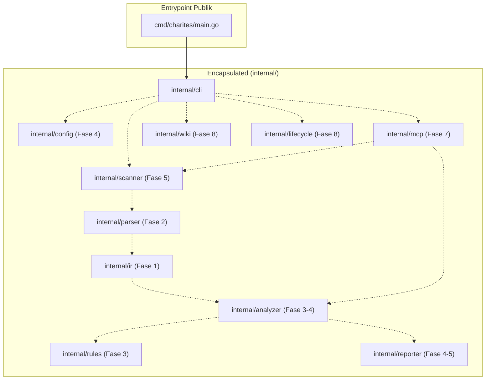

# 02-ARCHITECTURE: 00 - Repository Scaffolding & Package Boundaries

> **Kode Dokumen:** `ARCH-00-SETUP`
> **Tahapan:** Fase 0 - Inisialisasi Repositori & Toolchain
> **Peran Pilar:** ARCH = HOW (Rancangan Arsitektur, Boundaries & Metode Teknis)
> **Status:** Graduated (All Phase Gates Passed)

Dokumen ini menjelaskan rancangan arsitektur penataan modul Go, batasan visibilitas (*package boundaries*), dan mekanisme build pada tahap penyiapan awal (**Fase 0**).

---

## 1. Spesifikasi Toolchain & Standar Kompilasi

- **Go Version & Compatibility:**
  - **Language / Module Compatibility:** `Go 1.26` (dideklarasikan di `go.mod` sebagai `go 1.26`).
  - **Supported Local Toolchain:** `go1.26.x` (mendukung minor patch toolchain Go 1.26 lokal).
  - **CI / Reproducibility Baseline:** `go1.26.0` (dipin secara deterministik pada GitHub Actions CI runner).
- **Dependency Invariant:** Fase 0 murni memanfaatkan **Go Standard Library**. Berkas `go.sum` **MUST NOT** be required saat ketiadaan dependensi pihak ketiga.

---

## 2. Prinsip Batasan Visibilitas (`internal/` Encapsulation) & Isolasi Fase

Mengikuti konvensi resmi Go compiler, seluruh kode inti Charites diletakkan di dalam folder `internal/`.
- **Aturan Enkapsulasi:** Kode di dalam `internal/` **hanya dapat diimpor** oleh kode yang berada di dalam modul `github.com/will2469/charites`. Pihak luar dilarang mengimpor paket internal ini sebagai library publik.
- **Tujuan:** Menjaga kebebasan refactoring arsitektur internal tanpa khawatir merusak API eksternal (*no external contract leakage*).
- **Isolasi Fase (*Phase Isolation*):** Diagram arsitektur di bawah ini menggambarkan peta akhir sistem (*target architecture*). Pada **Fase 0**, hanya jalur `Main -> CLI` yang aktif dan dikompilasi. Paket-paket lain (`ir`, `parser`, `rules`, `analyzer`, `config`, `scanner`, `reporter`, `mcp`, `wiki`, `lifecycle`) merupakan **reservasi direktori arsitektur** (*skeleton directory reservation*) yang akan diisi kode logikanya strictly sesuai tahapan fase masing-masing.



---

## 3. Struktur Entrypoint Minimal (`cmd/charites/main.go`)

Fase 0 mendirikan pola entrypoint yang ramping:
```go
package main

import (
    "os"
    "github.com/will2469/charites/internal/cli"
)

func main() {
    exitCode := cli.Execute(os.Args[1:])
    os.Exit(exitCode)
}
```
Fungsi `main()` murni bertindak sebagai *trampoline*: meneruskan argumen CLI ke package `internal/cli` dan menerima nilai integer exit code untuk diteruskan ke `os.Exit()`. Hal ini mempermudah pengujian unit pada fungsi eksekusi CLI tanpa memaksa proses OS mati secara mendadak.

---

## 4. Implementasi Kompilasi Statis (Zero CGO) & Cross-Platform

Mengimplementasikan kontrak `SPEC-00-BUILD-001` dan `SPEC-00-BUILD-002`:
- **Zero CGO:** Perintah kompilasi menyertakan `CGO_ENABLED=0` secara eksplisit untuk menjamin pembuatan static binary tanpa ketergantungan library C sistem.
- **Flag Produksi:**
  ```bash
  CGO_ENABLED=0 go build -ldflags="-s -w" -o bin/charites ./cmd/charites
  ```
  *(Flag `-s -w` memangkas tabel simbol debug sehingga ukuran binary berkurang ~40% tanpa mengorbankan performa).*
- **Cross-Platform Compilation:** Karena mengandalkan murni Go standard library tanpa CGO, kompilasi ke target lintas platform dapat dieksekusi secara instan:
  - Linux: `GOOS=linux GOARCH=amd64` dan `GOOS=linux GOARCH=arm64`
  - macOS: `GOOS=darwin GOARCH=arm64`
  - Windows: `GOOS=windows GOARCH=amd64`

---

## 5. Standar Makefile Developer Automation

Makefile di akar proyek menyediakan target seragam dengan **urutan dependensi deterministik** (*build before test*):

```makefile
.PHONY: all build test test-unit lint cross-compile clean

BINARY_NAME=charites
BIN_DIR=bin

all: build test lint

build:
	@mkdir -p $(BIN_DIR)
	CGO_ENABLED=0 go build -o $(BIN_DIR)/$(BINARY_NAME) ./cmd/charites

test: build
	CGO_ENABLED=1 go test -v -race ./...

test-unit: build
	go test -v ./...

lint:
	golangci-lint run ./...

cross-compile:
	@echo "Verifying cross-compilation targets (SPEC-00-BUILD-002)..."
	GOOS=linux GOARCH=amd64 CGO_ENABLED=0 go build -o /dev/null ./cmd/charites
	GOOS=linux GOARCH=arm64 CGO_ENABLED=0 go build -o /dev/null ./cmd/charites
	GOOS=darwin GOARCH=arm64 CGO_ENABLED=0 go build -o /dev/null ./cmd/charites
	GOOS=windows GOARCH=amd64 CGO_ENABLED=0 go build -o /dev/null ./cmd/charites

clean:
	rm -rf $(BIN_DIR)
```

> [!IMPORTANT]
> **CGO Execution Environment Boundary Rationale (`SPEC-00-BUILD-001`):**
> - **Production & Artifact Boundary (`CGO_ENABLED=0`):** Target `build` dan `cross-compile` mengisolasi `CGO_ENABLED=0` secara mutlak, menjamin biner yang dihasilkan 100% statis murni tanpa ketergantungan pada glibc/musl host.
> - **Verification & Dynamic Analysis Boundary (`CGO_ENABLED=1`):** Target `test` menyematkan `CGO_ENABLED=1` semata-mata untuk mengaktifkan Go ThreadSanitizer (`-race`) pada harness verifikasi, tanpa mengubah sifat zero-CGO kode sumber.
> - **Pure Unit Testing (`test-unit`):** Pengembang pada lingkungan tanpa C compiler (misal minimal container atau Windows tanpa MinGW) dapat menjalankan `make test-unit` yang berjalan murni dengan `CGO_ENABLED=0`.

> [!IMPORTANT]
> **Dependency Ordering Rationale (`all: build test lint`):**
> Target `all` dan `test` mewajibkan `build` mendahului `test`. Pada *fresh checkout*, langkah ini menjamin artefak binary `bin/charites` telah tersedia sebelum pengujian subprocess end-to-end (`tests/e2e/smoke_test.go`) dieksekusi, mencegah kegagalan *missing binary* saat pipeline CI atau developer baru menjalankan `make all`.

> [!NOTE]
> **Makefile Host Environment Scope:**
> Automasi Makefile mengasumsikan lingkungan shell POSIX/Unix (`mkdir -p`, `rm -rf`, `/dev/null` di Linux, macOS, WSL, atau CI runner). Kontrak `SPEC-00-BUILD-002` mengatur portabilitas dan kompilasi silang binary keluaran Charites ke seluruh 4 target sistem operasi, bukan portabilitas skrip Makefile itu sendiri pada native Windows CMD/PowerShell.


