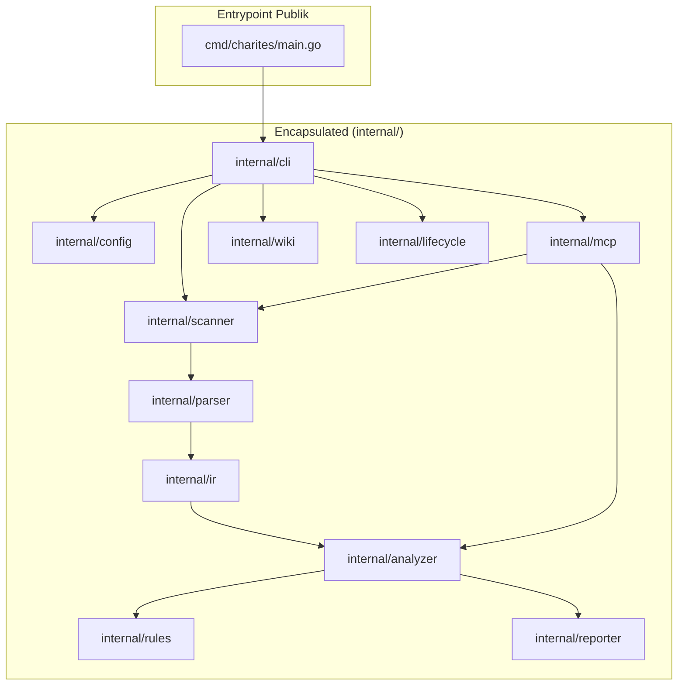

# 02-ARCHITECTURE: 00 - Repository Scaffolding & Package Boundaries

> **Kode Dokumen:** `ARCH-00-SETUP`
> **Tahapan:** Fase 0 - Inisialisasi Repositori & Toolchain
> **Status:** Ready for Execution

Dokumen ini menjelaskan rancangan arsitektur penataan modul Go, batasan visibilitas (*package boundaries*), dan mekanisme build pada tahap penyiapan awal (**Fase 0**).

---

## 1. Prinsip Batasan Visibilitas (`internal/` Encapsulation)

Mengikuti konvensi resmi Go compiler, seluruh kode inti Charites diletakkan di dalam folder `internal/`.
- **Aturan Enkapsulasi:** Kode di dalam `internal/` **hanya dapat diimpor** oleh kode yang berada di dalam modul `github.com/will2469/charites`. Pihak luar dilarang mengimpor paket internal ini sebagai library publik.
- **Tujuan:** Menjaga kebebasan refactoring arsitektur internal tanpa khawatir merusak API eksternal (*no external contract leakage*).



---

## 2. Struktur Entrypoint Minimal (`cmd/charites/main.go`)

Fase 0 mendirikan pola entrypoint yang ramping:
```go
package main

import (
    "os"
    "github.com/will2469/charites/internal/cli"
)

func main() {
    exitCode := cli.Execute(os.Args[1:])
    os.Exit(exitCode)
}
```
Fungsi `main()` murni bertindak sebagai *trampoline*: meneruskan argumen CLI ke package `internal/cli` dan menerima nilai integer exit code untuk diteruskan ke `os.Exit()`. Hal ini mempermudah pengujian unit pada fungsi eksekusi CLI tanpa memaksa proses OS mati secara mendadak.

---

## 3. Invarian Kompilasi Statis (Zero CGO)

Untuk menjamin portabilitas multi-platform tanpa masalah library C di Linux/macOS/Windows:
- Setiap perintah build **MUST** menyertakan variabel environment `CGO_ENABLED=0`.
- Flag build yang direkomendasikan untuk produksi:
  ```bash
  CGO_ENABLED=0 go build -ldflags="-s -w" -o bin/charites ./cmd/charites
  ```
  *(Flag `-s -w` memangkas tabel simbol debug sehingga ukuran binary berkurang ~40% tanpa mengorbankan performa).*

---

## 4. Standar Makefile Developer Automation

Makefile di akar proyek menyediakan target seragam untuk pengembang lokal dan pipeline CI:

```makefile
.PHONY: all build test lint clean

BINARY_NAME=charites
BIN_DIR=bin

all: lint test build

build:
	@mkdir -p $(BIN_DIR)
	CGO_ENABLED=0 go build -o $(BIN_DIR)/$(BINARY_NAME) ./cmd/charites

test:
	go test -v -race ./...

lint:
	golangci-lint run ./...

clean:
	rm -rf $(BIN_DIR)
```
