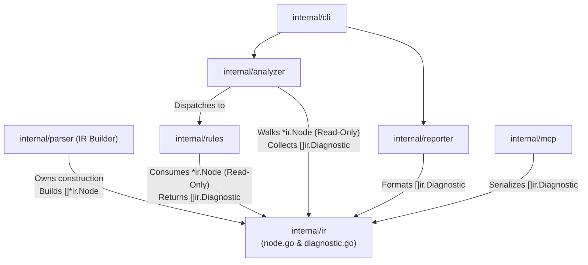

# 02-ARCHITECTURE: 01 - Data Contract Design & Iterator Mechanics

> **Kode Dokumen:** `ARCH-01-CONTRACT`
> **Tahapan:** Fase 1 - Kunci Kontrak Data (IR & Diagnostic)
> **Peran Pilar:** ARCH = HOW (Rancangan Arsitektur, Desain Iterator & Batasan Teknis)
> **Status:** Graduated (All Phase Gates Passed)
> **Standar Rujukan:** Go Memory Model & Go 1.26 Standard Iterator Specification

Dokumen ini menjelaskan rancangan teknis internal, batasan kepemilikan konstruksi, optimalisasi memory layout, dan mekanisme traversal pohon **Intermediate Representation (`ir.Node`)** menggunakan Go 1.26 native iterators.

---

## 1. Topologi Dependensi Paket (Zero-Cycle Guarantee)

Untuk menjamin kompilasi statis Go bebas dari error `import cycle not allowed`, paket `internal/ir` dirancang sebagai **Pure Leaf Package**:



### Invarian Arsitektural:
- `internal/ir` **hanya mengimpor paket bawaan Go** (`iter`, `strings`, `encoding/json`).
- `internal/rules` mengimpor `internal/ir`, tetapi **TIDAK PERNAH** mengimpor `internal/analyzer`.
- `internal/analyzer` mengimpor `internal/ir` dan `internal/rules`, sehingga aliran dependensi bersifat asiklik murni (DAG - *Directed Acyclic Graph*).
- **Siklus Kepemilikan (Lifecycle Ownership):** `internal/parser` memiliki hak eksklusif membangun pohon node (*owns construction*). Setelah diserahkan ke pipeline analisis, objek node diperlakukan *read-only* tanpa mutasi state.

---

## 2. Memory Layout & Field Alignment `ir.Node`

Pada repositori dengan ribuan komponen UI, terdapat ratusan ribu node elemen yang dialokasikan di memori. Untuk meminimalkan *padding bloat* pada arsitektur 64-bit, susunan field diatur secara presisi:

```go
type Node struct {
    Span       Span              // 32 bytes (4 int @ 8 bytes)
    Parent     *Node             // 8 bytes (pointer)
    Tag        string            // 16 bytes (ptr + len)
    RawClasses string            // 16 bytes (ptr + len)
    Attributes map[string]string // 8 bytes (pointer)
    Classes    []string          // 24 bytes (ptr + len + cap)
    Children   []*Node           // 24 bytes (ptr + len + cap)
    Type       NodeType          // 1 byte (uint8)
    _          [7]byte           // 7 bytes explicit padding to 8-byte word alignment
}
```
*Total Struct Size: 136 bytes per node.*

> [!NOTE]
> Ukuran struct $\le 136$ bytes diverifikasi secara empiris dalam unit test melalui `unsafe.Sizeof(ir.Node{})`, bukan disandarkan pada analyzer eksternal.

---

## 3. Desain Traversal (Go 1.26 Native Iterator)

Metode tradisional `Children()` yang mengembalikan slice baru atau rekursi fungsi callback dapat memicu penyalinan slice yang tidak efisien. Charites mengimplementasikan traversal pohon menggunakan fitur **Go 1.26 `iter.Seq`**:

```go
package ir

import "iter"

// Walk melakukan pre-order depth-first traversal pada pohon IR
// Didesain untuk iterasi idiomatik Go 1.26 tanpa perlu menyalin slice anak.
func (n *Node) Walk() iter.Seq[*Node] {
    return func(yield func(*Node) bool) {
        var walk func(curr *Node) bool
        walk = func(curr *Node) bool {
            if curr == nil {
                return true
            }
            if !yield(curr) {
                return false
            }
            for _, child := range curr.Children {
                if !walk(child) {
                    return false
                }
            }
            return true
        }
        walk(n)
    }
}
```

### Karakteristik Desain Traversal:
- **Zero-Copy Iteration:** Tidak ada alokasi slice penampung sementara saat melintasi pohon.
- **Idiomatic Consumption:** Konsumen (`analyzer`) melakukan traversal dengan sintaks loop Go 1.26 yang bersih:
  ```go
  for node := range root.Walk() {
      if node.Type == ir.NodeElement {
          rule.Evaluate(node)
      }
  }
  ```
- **Karakteristik Alokasi Memori:** Alokasi aktual diukur melalui benchmark suite. Target performa adalah 0 allocs/op di bawah optimasi compiler (inlining), yang dikelola di pilar Quality sebagai *Performance Budget*.

---

## 4. Helper API Inti `ir.Node`

Untuk mempercepat kerja rule evaluator, struct `Node` dilengkapi metode pembantu murni:

1. **`node.HasClass(name string) bool`**: Pencarian linear cepat dalam slice `Classes` tokenized.
2. **`node.GetAttr(name string) (string, bool)`**: Mengambil nilai atribut dari map `Attributes`.
3. **`node.IsElement(tags ...string) bool`**: Memeriksa kecocokan tag elemen secara variadic (misal: `node.IsElement("div", "section")`).

---

## 5. Mekanisme Pengurutan Total Diagnostik (Canonical Diagnostic Total Sorter)

Untuk memenuhi kontrak `SPEC-01-CONTRACT` (Canonical Diagnostic Total Ordering), paket `internal/ir` menyediakan fungsi perbandingan murni (*pure comparator*) 7-tingkat dan fungsi penyortir in-place:

```go
package ir

import (
    "cmp"
    "slices"
    "strings"
)

// severityRank memetakan tingkat keparahan ke bobot integer untuk perbandingan deterministik.
func severityRank(s Severity) int {
    switch s {
    case SeverityError:
        return 0
    case SeverityWarn:
        return 1
    case SeverityInfo:
        return 2
    default:
        return 3
    }
}

// CompareDiagnostics membandingkan dua Diagnostic menggunakan 7-level total ordering.
// Mengembalikan -1 jika a < b, 1 jika a > b, dan 0 jika a == b (identik mutlak).
func CompareDiagnostics(a, b Diagnostic) int {
    if c := strings.Compare(a.File, b.File); c != 0 {
        return c
    }
    if c := cmp.Compare(a.Line, b.Line); c != 0 {
        return c
    }
    if c := cmp.Compare(a.Column, b.Column); c != 0 {
        return c
    }
    if c := strings.Compare(a.Rule, b.Rule); c != 0 {
        return c
    }
    if c := cmp.Compare(severityRank(a.Severity), severityRank(b.Severity)); c != 0 {
        return c
    }
    if c := strings.Compare(a.Message, b.Message); c != 0 {
        return c
    }
    return strings.Compare(a.Hint, b.Hint)
}

// SortDiagnostics mengurutkan slice diagnosis secara in-place menggunakan 7-level total order
// dan memangkas duplikat identik (idempotent deduplication).
func SortDiagnostics(diags []Diagnostic) []Diagnostic {
    slices.SortFunc(diags, CompareDiagnostics)
    return slices.CompactFunc(diags, func(a, b Diagnostic) bool {
        return CompareDiagnostics(a, b) == 0
    })
}
```

### Invarian Arsitektural Pengurutan:
- **Pure Function & Zero Allocations:** `CompareDiagnostics` tidak mengalokasikan memori pada heap (`0 allocs/op`).
- **Idempotent Deduplication:** Penggunaan `slices.CompactFunc` menjamin jika aturan yang dievaluasi paralel melaporkan pelanggaran yang persis sama, hanya 1 entri yang dipertahankan.
- **Worker Pool Convergence:** Analyzer dan Reporter cukup memanggil `ir.SortDiagnostics(results)` sebelum pelaporan format apa pun untuk mengonvergensi hasil eksekusi multi-goroutine menjadi output yang 100% byte-identical.


