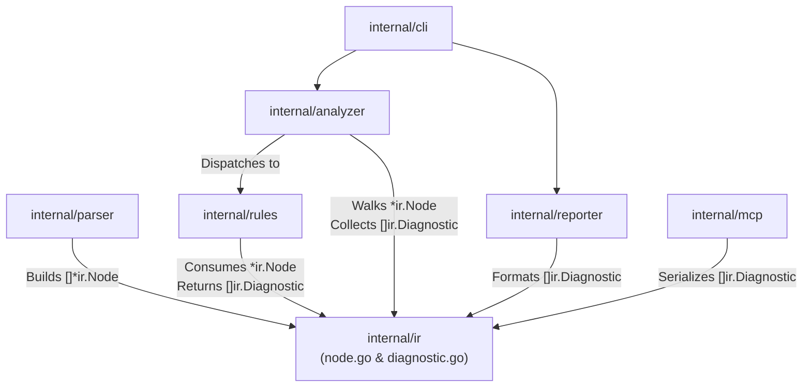

# 02-ARCHITECTURE: 01 - Data Contract Design & Iterator Mechanics

> **Kode Dokumen:** `ARCH-01-CONTRACT`
> **Tahapan:** Fase 1 - Kunci Kontrak Data (IR & Diagnostic)
> **Status:** Ready for Review
> **Standar Rujukan:** Go Memory Model & Go 1.26 Standard Iterator Specification

Dokumen ini menjelaskan rancangan teknis internal, optimalisasi memory layout, dan mekanisme traversal pohon **Intermediate Representation (`ir.Node`)** menggunakan Go 1.26 native iterators tanpa alokasi heap.

---

## 1. Topologi Dependensi Paket (Zero-Cycle Guarantee)

Untuk menjamin kompilasi statis Go bebas dari error `import cycle not allowed`, paket `internal/ir` dirancang sebagai **Pure Leaf Package**:



### Invarian Arsitektural:
- `internal/ir` **hanya mengimpor paket bawaan Go** (`iter`, `strings`, `encoding/json`).
- `internal/rules` mengimpor `internal/ir`, tetapi **TIDAK PERNAH** mengimpor `internal/analyzer`.
- `internal/analyzer` mengimpor `internal/ir` dan `internal/rules`, sehingga aliran dependensi bersifat asiklik murni (DAG - *Directed Acyclic Graph*).

---

## 2. Memory Layout & Field Alignment `ir.Node`

Pada repositori dengan ribuan komponen UI, terdapat ratusan ribu node elemen yang dialokasikan di memori. Untuk meminimalkan *padding bloat* pada arsitektur 64-bit:

```go
type Node struct {
    Span       Span              // 32 bytes (4 int @ 8 bytes)
    Parent     *Node             // 8 bytes (pointer)
    Tag        string            // 16 bytes (ptr + len)
    RawClasses string            // 16 bytes (ptr + len)
    Attributes map[string]string // 8 bytes (pointer)
    Classes    []string          // 24 bytes (ptr + len + cap)
    Children   []*Node           // 24 bytes (ptr + len + cap)
    Type       NodeType          // 1 byte (uint8)
    _          [7]byte           // 7 bytes explicit padding to 8-byte word alignment
}
```
*Total Struct Size: 136 bytes per node.*

---

## 3. Traversal Bebas Alokasi (Go 1.26 Native Iterator)

Metode tradisional `Children()` mengembalikan slice baru atau rekursi fungsi callback yang berpotensi menyebabkan alokasi heap saat melintasi pohon besar. Charites mengimplementasikan traversal pohon menggunakan fitur **Go 1.26 `iter.Seq`**:

```go
package ir

import "iter"

// Walk melakukan pre-order depth-first traversal pada pohon IR
// Menghasilkan zero heap allocation (0 B/op, 0 allocs/op)
func (n *Node) Walk() iter.Seq[*Node] {
    return func(yield func(*Node) bool) {
        var walk func(curr *Node) bool
        walk = func(curr *Node) bool {
            if curr == nil {
                return true
            }
            if !yield(curr) {
                return false
            }
            for _, child := range curr.Children {
                if !walk(child) {
                    return false
                }
            }
            return true
        }
        walk(n)
    }
}
```

### Penggunaan pada Analyzer Engine:
```go
// Traversal idiomatik Go 1.26 tanpa slice copy
for node := range root.Walk() {
    if node.Type == ir.NodeElement {
        rule.Evaluate(node)
    }
}
```

---

## 4. Helper API Inti `ir.Node`

Untuk mempercepat kerja rule evaluator, struct `Node` dilengkapi metode pembantu murni:

1. **`node.HasClass(name string) bool`**: Pencarian linear cepat dalam slice `Classes` tokenized.
2. **`node.GetAttr(name string) (string, bool)`**: Mengambil nilai atribut dari map `Attributes`.
3. **`node.IsElement(tags ...string) bool`**: Memeriksa kecocokan tag elemen secara variadic (misal: `node.IsElement("div", "section")`).
