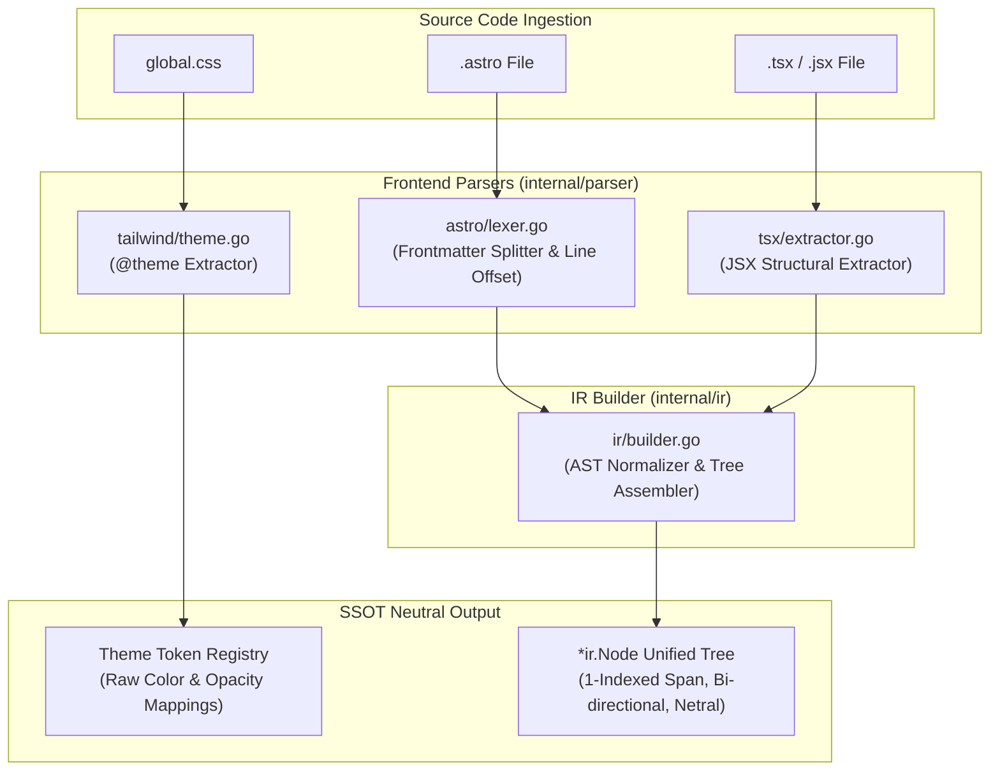

# 02-ARCHITECTURE: 02 - Parser Architecture & AST Normalization Pipeline

> **Kode Dokumen:** `ARCH-02-PARSER`
> **Tahapan:** Fase 2 - Parser Frontend & IR Builder
> **Peran Pilar:** ARCH = HOW (Rancangan Pipeline Parsing, Boundary Netral & Recovery)
> **Status:** Ready for Execution
> **Standar Rujukan:** Compiler Frontend Architecture & Zero-CGO Lexer Design

Dokumen ini menjelaskan arsitektur internal dari layer parser frontend (`internal/parser/*`), pembatasan lingkup ekstraksi struktural, dan mekanisme pembangunan pohon IR terpadu (`internal/ir/builder.go`) tanpa menggunakan library C (Zero CGO) maupun runtime Node.js.

---

## 1. Topologi Pipeline Parser & Prinsip Rule-Agnostic Substrate

Layer parser dirancang murni sebagai **substrat netral (*rule-agnostic substrate*)**. Parser hanya memetakan teks sumber menjadi struktur data, tanpa mengetahui atau mengevaluasi aturan audit:



---

## 2. Arsitektur Sub-Parser

### 2.1. Tailwind `@theme` Token Extractor (`internal/parser/tailwind/`)
- **Tugas:** Membaca blok `@theme { ... }` pada berkas `global.css`.
- **Mekanisme:**
  1. State-machine lexer memindai deklarasi CSS variable `--color-*`.
  2. Menyimpan pasangan `key: value` ke dalam `ThemeContext`.
  3. Mengidentifikasi token berakhiran `-light` dan `-subtle` sebagai token opacity bawaan (*Charites opinionated design convention*).
     ```go
     type ThemeContext struct {
         Colors    map[string]string // misal: "primary": "#2563eb"
         Opacities map[string]string // misal: "primary/10": "primary-light"
     }
     ```

### 2.2. Astro Component Lexer (`internal/parser/astro/`)
- **Tugas:** Memisahkan frontmatter dari template tanpa menggeser penomoran baris.
- **Mekanisme Offset Baris:**
  ```go
  // Hitung jumlah baris frontmatter
  lines := bytes.Count(frontmatterBytes, []byte("\n"))
  // Berikan baseLineOffset ke template lexer
  templateLexer := html.NewLexer(templateBytes, lines + 1)
  ```
- Dengan cara ini, node pertama template otomatis memiliki nomor baris akurat sesuai dengan posisi fisik di dalam berkas sumber `.astro`.

### 2.3. JSX Structural Extractor (`internal/parser/tsx/`)
- **Pendekatan Desain (Option B):**
  Menggunakan scanner struktural deterministik yang berfokus pada ekstraksi elemen JSX, atribut, dan class, menghindari overhead dan kompleksitas AST kompilator TypeScript penuh.
- **Strategi Pemrosesan:**
  - Memindai tag pembuka JSX (`<[A-Za-z0-9_.-]+`), atribut target (`className`, `class`, `id`, `role`), dan tag penutup.
  - Memisahkan string literal statis ke dalam token kelas terpisah.
  - Jika menemukan template literal dengan interpolasi dinamis (misal `` `p-4 ${cond ? 'a' : 'b'}` ``), scanner mempertahankan teks mentah pada `RawClasses` dan mengekstrak fragmen statis yang pasti ke `Classes`.

---

## 3. Mekanisme Assembly IR Builder & Penanganan Kedalaman Stack (`internal/ir/builder.go`)

IR Builder merangkai token mentah menjadi pohon objek:

1. **Stack-Based Tree Reconstruction & Nesting Guard:**
   - Mempertahankan stack elemen `[]*ir.Node` untuk melacak hierarki bersarang.
   - **Batas Kedalaman 256:** Saat opening tag masuk, jika `len(stack) >= 256`, elemen anak berikutnya tidak lagi menambah level stack (diperlakukan *flattened* di level 256) untuk mencegah bahaya eksploitasi *call-stack exhaustion*.
2. **Resynchronization & Panic-Safe Recovery:**
   - Menangani void elements (`img`, `input`, `br`, `hr`, `meta`, `link`) secara otomatis tanpa menunggu closing tag.
   - Jika terjadi token korup atau tag tidak seimbang, parser melakukan resinkronisasi ke karakter pembuka tag berikutnya (`<`) dan melakukan pop stack secara deterministik.

