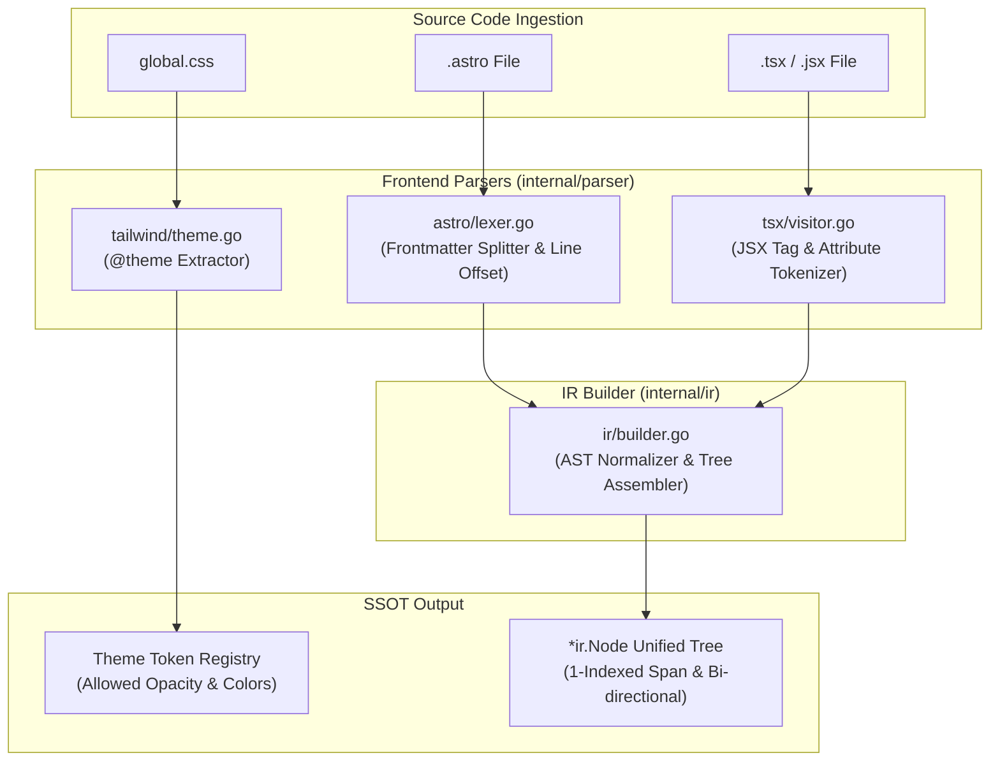

# 02-ARCHITECTURE: 02 - Parser Architecture & AST Normalization Pipeline

> **Kode Dokumen:** `ARCH-02-PARSER`
> **Tahapan:** Fase 2 - Parser Frontend & IR Builder
> **Status:** Ready for Review
> **Standar Rujukan:** Compiler Frontend Architecture & Zero-CGO Lexer Design

Dokumen ini menjelaskan arsitektur internal dari layer parser frontend (`internal/parser/*`) dan mekanisme pembangunan pohon IR terpadu (`internal/ir/builder.go`) tanpa menggunakan library C (Zero CGO) maupun runtime Node.js.

---

## 1. Topologi Pipeline Parser



---

## 2. Arsitektur Sub-Parser

### 2.1. Tailwind `@theme` Token Extractor (`internal/parser/tailwind/`)
- **Tugas:** Membaca blok `@theme { ... }` pada berkas `global.css`.
- **Mekanisme:**
  1. Menggunakan state-machine lexer ringan untuk mencari blok `@theme`.
  2. Melakukan scanning pasangan `key: value` CSS variable (`--color-*`).
  3. Menyimpan hasil ke dalam `ThemeContext`:
     ```go
     type ThemeContext struct {
         Colors   map[string]string // "primary": "#2563eb"
         Opacities map[string]string // "primary/10": "primary-light"
     }
     ```

### 2.2. Astro Component Parser (`internal/parser/astro/`)
- **Tugas:** Memisahkan frontmatter dari template tanpa menggeser penomoran baris.
- **Mekanisme Offset Baris:**
  ```go
  // Hitung jumlah baris frontmatter
  lines := bytes.Count(frontmatterBytes, []byte("\n"))
  // Berikan baseLineOffset ke template lexer
  templateLexer := html.NewLexer(templateBytes, lines + 1)
  ```
- Dengan cara ini, node pertama template otomatis memiliki nomor baris akurat sesuai dengan posisi fisik di dalam berkas sumber `.astro`.

### 2.3. TSX / JSX Syntax Visitor (`internal/parser/tsx/`)
- **Tugas:** Mengekstrak tag elemen JSX dan atribut `class`/`className` dari file TypeScript React.
- **Strategi Lexing:**
  - Menggunakan streaming tokenizer ringan yang mencari opening tag JSX (`<[A-Za-z0-9_.-]+`), atribut JSX, dan penutup tag (`/>` atau `>`).
  - Menghindari ketergantungan pada parser monolitik Babel/SWC yang membutuhkan CGO atau Node.js FFI.

---

## 3. Mekanisme Assembly IR Builder (`internal/ir/builder.go`)

IR Builder merangkai token mentah menjadi pohon objek:

1. **Stack-Based Tree Reconstruction:**
   - Mempertahankan stack `[]*ir.Node` untuk melacak hirarki elemen bersarang.
   - Saat opening tag masuk $\rightarrow$ *push* ke stack, tautkan sebagai anak ke elemen teratas stack.
   - Saat closing tag masuk $\rightarrow$ *pop* dari stack.
2. **Panic-Safe Recovery:**
   - Jika terdapat tag yang tidak seimbang (*unbalanced HTML tags* seperti `<input>` tanpa penutup atau elemen cacat), builder otomatis menangani void elements (`img`, `input`, `br`, `hr`) dan tidak melempar panic.
