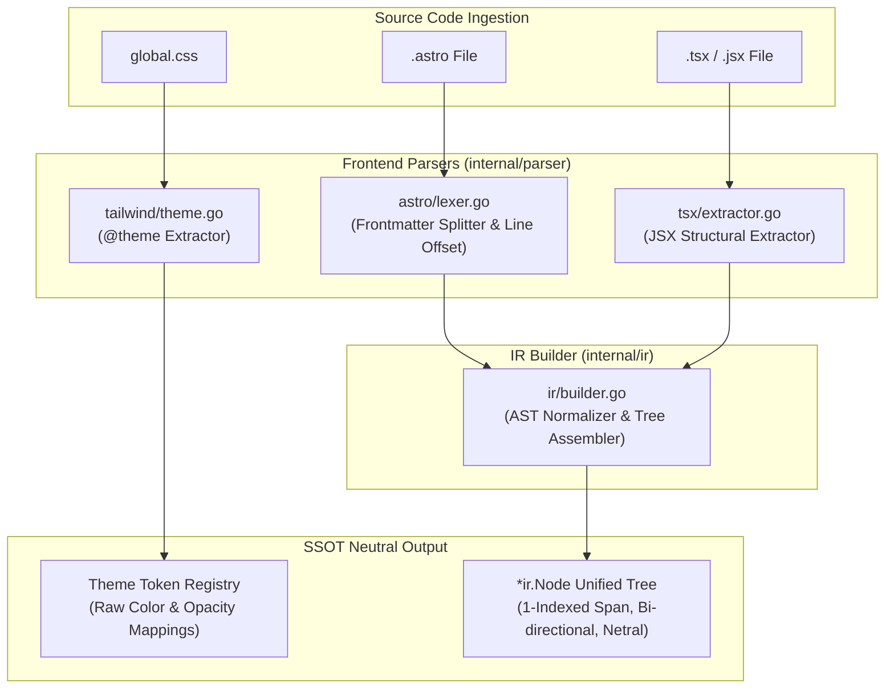

# 02-ARCHITECTURE: 02 - Parser Architecture & AST Normalization Pipeline

> **Kode Dokumen:** `ARCH-02-PARSER`
> **Tahapan:** Fase 2 - Parser Frontend & IR Builder
> **Peran Pilar:** ARCH = HOW (Rancangan Pipeline Parsing, Boundary Netral & Recovery)
> **Status:** Graduated (All Phase Gates Passed)
> **Standar Rujukan:** Compiler Frontend Architecture & Zero-CGO Lexer Design

Dokumen ini menjelaskan arsitektur internal dari layer parser frontend (`internal/parser/*`), pembatasan lingkup ekstraksi struktural, dan mekanisme pembangunan pohon IR terpadu (`internal/ir/builder.go`) tanpa menggunakan library C (Zero CGO) maupun runtime Node.js.

---

## 1. Topologi Pipeline Parser & Prinsip Rule-Agnostic Substrate

Layer parser dirancang murni sebagai **substrat netral (*rule-agnostic substrate*)**. Parser hanya memetakan teks sumber menjadi struktur data, tanpa mengetahui atau mengevaluasi aturan audit:



---

## 2. Arsitektur Sub-Parser

### 2.1. Tailwind `@theme` Token Extractor (`internal/parser/tailwind/`)
- **Tugas:** Membaca blok `@theme { ... }` pada berkas `global.css` dan mengekstrak deklarasi variabel mentah.
- **Mekanisme & Netralitas Substrat:**
  1. State-machine lexer memindai deklarasi CSS variable `--*` (termasuk `--color-*`).
  2. Menyimpan pasangan `variabel: nilai` mentah ke dalam `ThemeTokenRegistry`:
     ```go
     type ThemeTokenRegistry struct {
         Variables map[string]string // misal: "--color-primary": "#2563eb", "--color-primary-light": "rgba(37, 99, 235, 0.1)"
     }
     ```
  3. **Zero Semantic Coupling:** Parser **TIDAK** memetakan ekuivalensi semantik (misal tidak mengonversi `primary/10` menjadi `primary-light`). Seluruh logika ekuivalensi opacity didelegasikan secara murni ke Rule #1 (`theme.hardcode-opacity-color`) pada Fase 3.

### 2.2. Astro Component Lexer (`internal/parser/astro/`)
- **Tugas:** Memisahkan frontmatter dari template tanpa menggeser penomoran baris.
- **Mekanisme Offset Baris:**
  ```go
  // Hitung jumlah baris frontmatter
  lines := bytes.Count(frontmatterBytes, []byte("\n"))
  // Berikan baseLineOffset ke template lexer
  templateLexer := astro.NewLexer(templateBytes, lines + 1)
  ```
- Dengan cara ini, node pertama template otomatis memiliki nomor baris akurat sesuai dengan posisi fisik di dalam berkas sumber `.astro`.
- Mendukung tag HTML standar, komponen kustom PascalCase, serta tag bawaan Astro (`<Fragment>`, `<slot />`, `<slot name="..." />`).

### 2.3. JSX Structural Extractor (`internal/parser/tsx/`)
- **Pendekatan Desain (Option B):**
  Menggunakan scanner struktural deterministik yang berfokus pada ekstraksi elemen JSX, atribut, dan class, menghindari overhead dan kompleksitas AST kompilator TypeScript penuh.
- **Strategi Pemrosesan:**
  - Memindai tag pembuka JSX (`<[A-Za-z0-9_.-]+`), atribut target (`className`, `class`, `id`, `role`), dan tag penutup.
  - Memisahkan string literal statis ke dalam token kelas terpisah.
  - **Kontrak Template Literal Dinamis:**
    - Memindai teks di luar `${...}` dan memasukkan token kelas ke `Classes`.
    - Mengisolasi seluruh isi di dalam `${...}` sebagai wilayah dinamis buram (*opaque dynamic region*). Scanner **TIDAK** menafsirkan ekspresi ternary atau logika boolean di dalam interpolasi.
    - Menandai node memiliki kelas dinamis (`HasDynamicClasses`) dan menyimpan string mentah lengkap pada `RawClasses`.
  - **Disambiguasi Lexer:**
    - Mengabaikan karakter `<` di dalam komentar (`<!-- ... -->`, `{/* ... */}`).
    - Mengabaikan karakter `<` di dalam string atribut (`title="a < b"`).
    - Membedakan operator perbandingan `<` di dalam ekspresi JSX `{...}` dengan tag elemen.

---

## 3. Mekanisme Assembly IR Builder & Penanganan Kedalaman Stack (`internal/ir/builder.go`)

IR Builder merangkai token mentah menjadi pohon objek `*ir.Node`:

1. **Stack-Based Tree Reconstruction & Nesting Guard (Batas 256):**
   - Mempertahankan stack elemen `[]*ir.Node` untuk melacak hierarki bersarang (akar pada kedalaman 1).
   - **Aturan Flattening Kedalaman 256:** Saat tag pembuka masuk, jika `len(stack) == 256`, elemen baru tetap diekstrak sebagai `*ir.Node` yang valid dan disematkan sebagai anak di bawah node tingkat-256, namun **TIDAK DI-PUSH** ke dalam stack (*attached as flat siblings under the depth-256 parent*). Dengan demikian kedalaman stack dijamin $\le 256$.
2. **Aturan Resolusi Closing Tag & Stack Unwinding (`</X>`):**
   - Ketika menemukan tag penutup `</X>`:
     - Cari kecocokan tag `X` dari puncak stack ke bawah.
     - Jika ditemukan: pop seluruh elemen hingga elemen `X`. Node perantara yang tidak ditutup tetap berada di bawah induknya masing-masing.
     - Jika TIDAK ditemukan: buang token penutup `</X>` secara hening, stack tidak berubah.
3. **Void Elements & Panic-Safe Recovery:**
   - Menangani void elements (`img`, `input`, `br`, `hr`, `meta`, `link`) secara mandiri (*self-closing*) tanpa dimasukkan ke stack.
   - Jika terjadi token korup (`<broken` tanpa `>`), token dibuang dan parser melakukan resinkronisasi ke karakter `<` berikutnya.
   - Menjamin *Zero-Panic Invariant* pada segala bentuk input malformed.

