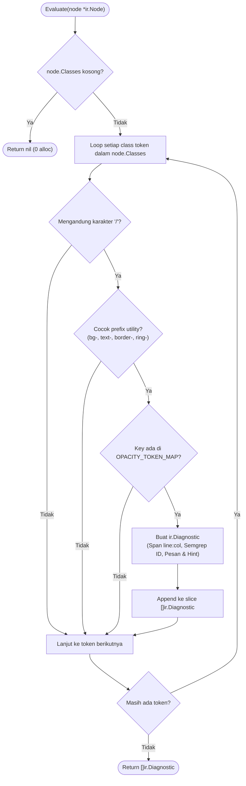

# 02-ARCHITECTURE: 03 - Rule Engine, In-Memory Registry & Proving Ground Architecture

> **Kode Dokumen:** `ARCH-03-RULES`
> **Tahapan:** Fase 3 - Rule Contract & Proving Ground Rule (`theme.hardcode-opacity-color`)
> **Status:** Ready for Review
> **Standar Rujukan:** Micro-Kernel Rule Engine Architecture & Zero-Circular Dependency Pattern

Dokumen ini mendefinisikan arsitektur internal dari layer rule Charites (`internal/rules/*`), mekanisme registri in-memory thread-safe (`sync.RWMutex`), integrasi evaluasi murni berbasis `ir.Node`, serta arsitektur proving ground rule pertama: **`theme.hardcode-opacity-color`**.

---

## 1. Topologi Arsitektur Rule Layer

Lapisan rule dirancang mengikuti pola *Micro-Kernel Plugin*. Rule adalah komponen independen tanpa status (*stateless*) yang hanya bergantung pada kontrak leaf `internal/ir`:

```mermaid
flowchart TD
    subgraph IR_Leaf ["Leaf Contract (internal/ir)"]
        Node["*ir.Node (AST Unified Tree)"]
        Diagnostic["ir.Diagnostic (Finding Payload)"]
        Severity["ir.Severity (Error/Warn/Info)"]
    end

    subgraph Rules_Kernel ["Rule Engine (internal/rules)"]
        RuleInterface["Rule Interface\n(ID, Category, Evaluate)"]
        Registry["In-Memory Registry\n(sync.RWMutex, Fast O(1) Lookup)"]

        subgraph Proving_Ground ["Rule Proving Ground"]
            RuleTheme["theme/hardcode_opacity_color.go\n(theme.hardcode-opacity-color)"]
            Map["OPACITY_TOKEN_MAP\n(Pre-compiled Semantic Lookup)"]
        end
    end

    subgraph Engine_Consumer ["Consumer (internal/analyzer - Fase 4)"]
        Engine["Analyzer Traversal Engine\n(iter.Seq[*ir.Node] Walk)"]
    end

    Node -->|Input Argument| RuleInterface
    RuleInterface -->|Returns Findings| Diagnostic
    RuleInterface -->|Specifies Default| Severity

    RuleTheme -.->|Implements| RuleInterface
    RuleTheme --> Map
    Registry -->|Registers & Queries| RuleInterface
    Engine -->|Queries Active Rules| Registry
    Engine -->|Calls Evaluate() on Tree Nodes| RuleTheme
```

### Invarian Ketergantungan Bebas Sirkular:
```text
internal/ir (Leaf: Tanpa import internal manapun)
     ▲
     │ imports
internal/rules (Mengimpor internal/ir. Dilarang mengimpor internal/analyzer atau internal/scanner)
     ▲
     │ imports
internal/analyzer (Mengimpor internal/ir dan internal/rules)
```

---

## 2. Arsitektur In-Memory Registry (`internal/rules/registry.go`)

Registry bertindak sebagai Single Source of Truth (SSOT) katalog seluruh rule yang terkompilasi ke dalam binary Charites:

```go
package rules

import (
    "fmt"
    "sync"
)

type Registry struct {
    mu         sync.RWMutex
    rules      map[string]Rule            // Key: Semgrep ID (misal: "theme.hardcode-opacity-color")
    categories map[string][]Rule          // Index kategori: "theme" -> []Rule
}

func NewRegistry() *Registry {
    return &Registry{
        rules:      make(map[string]Rule),
        categories: make(map[string][]Rule),
    }
}

func (r *Registry) Register(rule Rule) error {
    r.mu.Lock()
    defer r.mu.Unlock()

    id := rule.ID()
    if _, exists := r.rules[id]; exists {
        return fmt.Errorf("rule with ID %q already registered", id)
    }

    r.rules[id] = rule
    r.categories[rule.Category()] = append(r.categories[rule.Category()], rule)
    return nil
}

func (r *Registry) Get(id string) (Rule, bool) {
    r.mu.RLock()
    defer r.mu.RUnlock()
    rule, ok := r.rules[id]
    return rule, ok
}

func (r *Registry) All() []Rule {
    r.mu.RLock()
    defer r.mu.RUnlock()
    list := make([]Rule, 0, len(r.rules))
    for _, rule := range r.rules {
        list = append(list, rule)
    }
    return list
}

func (r *Registry) ByCategory(category string) []Rule {
    r.mu.RLock()
    defer r.mu.RUnlock()
    rules := r.categories[category]
    out := make([]Rule, len(rules))
    copy(out, rules)
    return out
}
```

### Karakteristik Desain:
1. **Thread-Safety Penuh:** Registrasi dilakukan pada saat inisialisasi binary (`init()` atau builder bootstrap). Pembacaan (`Get`, `All`, `ByCategory`) dilindungi oleh `sync.RWMutex` sehingga aman diakses serentak oleh ribuan goroutine worker pool.
2. **$O(1)$ Lookup:** Pencarian rule berdasarkan ID string Semgrep berjalan konstan melalui hashmap.
3. **Penyalinan Slice Defensif:** Metode `ByCategory` dan `All` mengembalikan salinan slice (*defensive copy*) untuk mencegah mutasi eksternal pada struktur data internal registri.

---

## 3. Arsitektur Rule Proving Ground: `theme.hardcode-opacity-color`

Rule `theme.hardcode-opacity-color` dirancang sebagai cetak biru (*reference blueprint*) untuk seluruh rule audit berikutnya.

### 3.1. Struktur Modul
```text
internal/rules/
├── rule.go                         # Definisi interface Rule & Severity mapper
├── registry.go                     # Registry katalog in-memory
├── registry_test.go                # Unit test registry concurrency & error handling
└── theme/
    ├── hardcode_opacity_color.go      # Logika evaluasi rule #1
    └── hardcode_opacity_color_test.go # Unit test table-driven & benchmark
```

### 3.2. Alur Eksekusi Evaluasi (`Evaluate`)



### 3.3. Optimasi Kinerja Evaluasi (Zero Heap Allocation pada Kasus Bersih)
- **Fast Path:** Jika `len(node.Classes) == 0`, fungsi langsung mengembalikan `nil` tanpa alokasi memori.
- **Fast Character Scan:** Sebelum menjalankan regex atau map lookup, periksa keberadaan byte `/` menggunakan `strings.IndexByte(class, '/')`. Utilitas tanpa slash seperti `p-4`, `flex`, `text-center` langsung diabaikan dalam $O(1)$ CPU cycle.
- **Pre-compiled Map:** Pasangan token slash dan pengganti semantiknya dimuat dalam in-memory lookup map global (`OPACITY_TOKEN_MAP`), menghindari operasi parsing CSS berulang saat evaluasi node.

---

## 4. Siklus Hidup dan Integrasi dengan Traversal Engine

Meskipun Traversal Engine baru diimplementasikan pada Fase 4 (`internal/analyzer/engine.go`), kontrak integrasinya diikat pada fase ini:

1. Engine memuat AST Unified Tree (`*ir.Node`).
2. Engine mengkueri seluruh rule aktif dari `Registry` (memperhitungkan filter `--category`, `--rule`, dan `charites.yaml`).
3. Menggunakan iterator Go 1.26 `node.Walk()`, setiap node diserahkan ke `rule.Evaluate(node)`.
4. Jika `node` memiliki flag `Ignore` yang cocok dengan Semgrep ID rule (`// charites:ignore theme.hardcode-opacity-color`), diagnostic yang dihasilkan langsung disaring (*dropped*).
5. Diagnostic yang valid dikumpulkan ke dalam buffer pelaporan.
