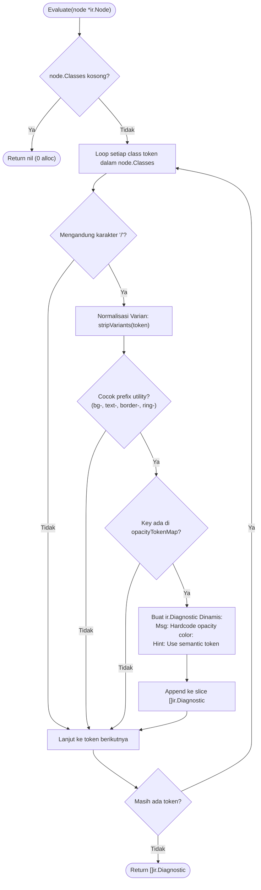

# 02-ARCHITECTURE: 03 - Rule Engine, In-Memory Registry & Proving Ground Architecture

> **Kode Dokumen:** `ARCH-03-RULES`
> **Tahapan:** Fase 3 - Rule Contract & Proving Ground Rule (`theme.hardcode-opacity-color`)
> **Peran Pilar:** ARCH = HOW (Rancangan Engine Rule, Registri Deterministik & Normalisasi Varian)
> **Status:** Graduated (All Phase Gates Passed)
> **Standar Rujukan:** Micro-Kernel Rule Engine Architecture & Zero-Circular Dependency Pattern

Dokumen ini mendefinisikan arsitektur internal dari layer rule Charites (`internal/rules/*`), mekanisme registri in-memory thread-safe (`sync.RWMutex`) dengan urutan deterministik, integrasi evaluasi murni berbasis `ir.Node`, serta mekanisme normalisasi varian leksikal pada rule pertama: **`theme.hardcode-opacity-color`**.

---

## 1. Topologi Arsitektur Rule Layer

Lapisan rule dirancang mengikuti pola *Micro-Kernel Plugin*. Rule adalah komponen independen tanpa status (*stateless*) yang hanya bergantung pada kontrak leaf `internal/ir`:

```mermaid
flowchart TD
    subgraph IR_Leaf ["Leaf Contract (internal/ir)"]
        Node["*ir.Node (AST Unified Tree)"]
        Diagnostic["ir.Diagnostic (Finding Payload)"]
        Severity["ir.Severity (Error/Warn/Info)"]
    end

    subgraph Rules_Kernel ["Rule Engine (internal/rules)"]
        RuleInterface["Rule Interface\n(ID, Category, Evaluate)"]
        Registry["In-Memory Registry\n(sync.RWMutex, Fast O(1) Lookup, Sorted Output)"]

        subgraph Proving_Ground ["Rule Proving Ground"]
            RuleTheme["theme/hardcode_opacity_color.go\n(theme.hardcode-opacity-color)"]
            VariantStripper["Lexical Normalizer\n(Strips hover:, dark:, md: etc.)"]
            Map["opacityTokenMap\n(Unexported Immutable Lookup)"]
        end
    end

    subgraph Engine_Consumer ["Consumer (internal/analyzer - Fase 4)"]
        Engine["Analyzer Traversal Engine\n(iter.Seq[*ir.Node] Walk)"]
        IgnoreFilter["Ignore Suppression Layer\n(Filters charites:ignore)"]
    end

    Node -->|Input Argument| RuleInterface
    RuleInterface -->|Returns Findings| Diagnostic
    RuleInterface -->|Specifies Default| Severity

    RuleTheme -.->|Implements| RuleInterface
    RuleTheme --> VariantStripper
    VariantStripper --> Map
    Registry -->|Registers & Queries| RuleInterface
    Engine -->|Queries Active Rules (Sorted)| Registry
    Engine -->|Calls Evaluate() on Tree Nodes| RuleTheme
    RuleTheme -->|Raw Diagnostics| IgnoreFilter
```

### Invarian Ketergantungan Bebas Sirkular:
```text
internal/ir (Leaf: Tanpa import internal manapun)
     ▲
     │ imports
internal/rules (Mengimpor internal/ir. Dilarang mengimpor internal/analyzer atau internal/scanner)
     ▲
     │ imports
internal/analyzer (Mengimpor internal/ir dan internal/rules)
```

---

## 2. Arsitektur In-Memory Registry Deterministik (`internal/rules/registry.go`)

Registry bertindak sebagai Single Source of Truth (SSOT) katalog seluruh rule yang terkompilasi ke dalam binary Charites:

```go
package rules

import (
    "fmt"
    "sort"
    "sync"
)

type Registry struct {
    mu         sync.RWMutex
    rules      map[string]Rule   // Key: Charites Rule ID (misal: "theme.hardcode-opacity-color")
    categories map[string][]Rule // Index kategori: "theme" -> []Rule
}

func NewRegistry() *Registry {
    return &Registry{
        rules:      make(map[string]Rule),
        categories: make(map[string][]Rule),
    }
}

func (r *Registry) Register(rule Rule) error {
    r.mu.Lock()
    defer r.mu.Unlock()

    id := rule.ID()
    if _, exists := r.rules[id]; exists {
        return fmt.Errorf("rule with ID %q already registered", id)
    }

    r.rules[id] = rule
    r.categories[rule.Category()] = append(r.categories[rule.Category()], rule)
    return nil
}

func (r *Registry) Get(id string) (Rule, bool) {
    r.mu.RLock()
    defer r.mu.RUnlock()
    rule, ok := r.rules[id]
    return rule, ok
}

func (r *Registry) All() []Rule {
    r.mu.RLock()
    defer r.mu.RUnlock()
    list := make([]Rule, 0, len(r.rules))
    for _, rule := range r.rules {
        list = append(list, rule)
    }
    // Menjamin urutan deterministik berdasarkan Rule ID
    sort.Slice(list, func(i, j int) bool {
        return list[i].ID() < list[j].ID()
    })
    return list
}

func (r *Registry) ByCategory(category string) []Rule {
    r.mu.RLock()
    defer r.mu.RUnlock()
    rules := r.categories[category]
    out := make([]Rule, len(rules))
    copy(out, rules)
    sort.Slice(out, func(i, j int) bool {
        return out[i].ID() < out[j].ID()
    })
    return out
}
```

### Karakteristik Desain:
1. **Thread-Safety Penuh:** Registrasi dilakukan pada saat inisialisasi binary (`init()` atau builder bootstrap). Pembacaan (`Get`, `All`, `ByCategory`) dilindungi oleh `sync.RWMutex`.
2. **Deterministic Output:** Karena iterasi map Go bersifat acak, `All()` dan `ByCategory()` wajib melakukan pengurutan leksikografis berdasarkan `rule.ID()`, memastikan reproduktibilitas urutan diagnosis.
3. **Penyalinan Slice Defensif:** Mengembalikan salinan slice (*defensive copy*) untuk mencegah efek samping mutasi eksternal.

---

## 3. Arsitektur Rule Proving Ground: `theme.hardcode-opacity-color`

### 3.1. Struktur Modul
```text
internal/rules/
├── rule.go                         # Definisi interface Rule & Severity mapper
├── doc.go                          # Interface DocumentedRule untuk SSOT dokumentasi
├── builtin.go                      # Registrasi rule bawaan & interface assertion
├── registry.go                     # Registry katalog in-memory deterministik
├── registry_test.go                # Unit test registry concurrency & sorting determinism
└── theme/
    ├── hardcode_opacity_color.go      # Logika evaluasi, Doc() SSOT & lexical normalizer
    └── hardcode_opacity_color_test.go # Unit test table-driven & benchmark
```

Model dokumentasi SSOT dipisahkan pada paket `internal/ir/doc.go` (tipe `RuleDocumentation`, `CodeExample`, `RiskItem`) untuk mencegah dependensi siklis antara `internal/rules` dan domain subpaket (`internal/rules/theme`). Paket `internal/wiki` bertindak sebagai konsumen hilir yang mengompilasi metadata dari `rules.DefaultRegistry()` ke direktori `wiki/` via `make wiki`.

### 3.2. Normalisasi Varian Leksikal (*Variant Stripping*)
Sebelum melakukan pencocokan utility dasar, rule memisahkan varian Tailwind (seperti `hover:`, `dark:`, `md:`, `focus:`) tanpa memerlukan parser CSS penuh:

```go
func stripVariants(token string) string {
    // Memotong seluruh prefix variant hingga ke utility dasar
    // Contoh: "md:hover:bg-primary/10" -> "bg-primary/10"
    lastColon := strings.LastIndexByte(token, ':')
    if lastColon >= 0 && lastColon < len(token)-1 {
        return token[lastColon+1:]
    }
    return token
}
```

### 3.3. Alur Eksekusi Evaluasi (`Evaluate`)



---

## 4. Pemisahan Tanggung Jawab: Evaluasi vs Pengabaian Direktif (*Separation of Concerns*)

1. **Tanggung Jawab Rule:** Fungsi `rule.Evaluate(node)` murni membandingkan token terhadap `opacityTokenMap` dan menghasilkan diagnosis mentah. Rule **TIDAK PERLU** memeriksa komentar ignore `charites:ignore`.
2. **Tanggung Jawab Engine Analyzer (Fase 4):** Lapisan engine traversal menerima diagnosis dari rule, memeriksa keberadaan direktif ignore pada node atau scope terkait, lalu menyaring (*suppress*) temuan yang diabaikan sebelum dikirim ke reporter.

