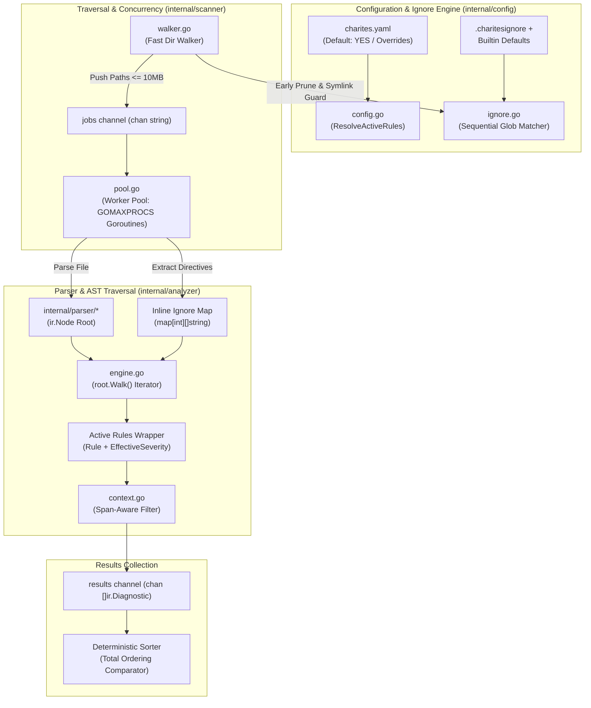

# 02-ARCHITECTURE: 04 - Configuration, Concurrency Scanner & Traversal Engine Architecture

> **Kode Dokumen:** `ARCH-04-ENGINE`
> **Tahapan:** Fase 4 - Konfigurasi, Concurrency Scanner & Traversal Engine
> **Peran Pilar:** ARCH = HOW (Rancangan Arsitektur, Struktur Data & Enkapsulasi Pipeline)
> **Status:** Ready for Review (Implementation Locked: DO NOT START YET)
> **Standar Rujukan:** High-Throughput Concurrency Patterns & Pipeline Architecture

Dokumen ini mendefinisikan arsitektur internal dari paket konfigurasi (`internal/config/*`), mesin pemindai direktori paralel berkonkurensi tinggi (`internal/scanner/*`), serta mesin traversal AST (`internal/analyzer/*`).

---

## 1. Topologi Pipeline Eksekusi Engine



---

## 2. Arsitektur Paket Konfigurasi (`internal/config/`)

Paket `internal/config` menjamin prinsip **Default: YES** (Model Argus) serta enkapsulasi aturan resolusi rule:

### 2.1. Rule Resolution & ActiveRule Wrapper (`internal/config/config.go`)

Untuk mempertahankan sifat *stateless* dan *immutable* dari `rules.Rule` (Fase 3), penyesuaian severity dibungkus dalam struct `ActiveRule`:

```go
package config

import (
    "strings"

    "github.com/will2469/charites/internal/ir"
    "github.com/will2469/charites/internal/rules"
)

// ActiveRule membungkus rule singleton dengan EffectiveSeverity hasil resolusi konfigurasi.
type ActiveRule struct {
    Rule              rules.Rule
    EffectiveSeverity ir.Severity
}

type Config struct {
    Rules  map[string]string `yaml:"rules"`  // "rule-id": "off" | "warn" | "error" | "info"
    Ignore []string          `yaml:"ignore"` // Pola path tambahan
}

// ResolveActiveRules menerapkan presedensi: Registry -> CLI Filter -> Config Policy.
func (c *Config) ResolveActiveRules(reg *rules.Registry, categoryFilter, ruleFilter string) []ActiveRule {
    var active []ActiveRule

    // Iterasi deterministik (All() terurut leksikografis berdasarkan Rule.ID())
    for _, rule := range reg.All() {
        id := rule.ID()

        // 1. CLI Candidate Scope Filter
        if ruleFilter != "" && id != ruleFilter {
            continue
        }
        if categoryFilter != "" && rule.Category() != categoryFilter {
            continue
        }

        // 2. Config Policy Resolution
        effectiveSev := rule.DefaultSeverity()
        if c != nil && c.Rules != nil {
            if override, exists := c.Rules[id]; exists {
                val := strings.ToLower(strings.TrimSpace(override))
                if val == "off" || val == "false" || val == "disable" || val == "disabled" {
                    continue // Policy mematikan rule (bahkan jika dipilih via CLI)
                }
                switch val {
                case "error":
                    effectiveSev = ir.SeverityError
                case "warn", "warning":
                    effectiveSev = ir.SeverityWarn
                case "info":
                    effectiveSev = ir.SeverityInfo
                }
            }
        }

        active = append(active, ActiveRule{
            Rule:              rule,
            EffectiveSeverity: effectiveSev,
        })
    }
    return active
}
```

### 2.2. Fast Pattern Matcher & Builtin Pruning (`internal/config/ignore.go`)

```go
package config

import (
    "path/filepath"
    "strings"
)

var builtinExclusions = []string{
    ".git", "node_modules", "dist", ".astro", ".next", ".turbo", "build", "coverage",
}

type IgnoreMatcher struct {
    patterns []ignorePattern
}

type ignorePattern struct {
    raw      string
    negation bool
    dirOnly  bool
}

// HasBuiltinAncestor memeriksa apakah ada segmen path yang cocok dengan builtin exclusion.
// Digunakan untuk proteksi eksplisit target berkas langsung (Explicit Target Safety).
func (m *IgnoreMatcher) HasBuiltinAncestor(path string) bool {
    clean := filepath.Clean(path)
    parts := strings.Split(clean, string(filepath.Separator))
    for _, part := range parts {
        for _, b := range builtinExclusions {
            if part == b {
                return true
            }
        }
    }
    return false
}

func (m *IgnoreMatcher) ShouldIgnoreDir(dirName, relPath string) bool {
    // 1. Invarian Hard Exclusion (Builtin tidak bisa dinegasi)
    for _, b := range builtinExclusions {
        if dirName == b || strings.HasPrefix(relPath, b+string(filepath.Separator)) {
            return true
        }
    }

    // 2. Evaluasi Sekuensial .charitesignore (Last matching pattern wins)
    ignored := false
    for _, p := range m.patterns {
        if matchPattern(p, relPath, true) {
            ignored = !p.negation
        }
    }
    return ignored
}
```

---

## 3. Arsitektur Concurrency Scanner (`internal/scanner/`)

### 3.1. Walker Direktori, Direct-Target Safety & Proteksi Symlink (`internal/scanner/walker.go`)

```go
const MaxScanFileSize = 10 * 1024 * 1024 // 10 Megabytes

type Walker struct {
    matcher *config.IgnoreMatcher
    extMap  map[string]bool
}

func (w *Walker) Walk(ctx context.Context, root string, jobs chan<- string) error {
    cleanRoot := filepath.Clean(root)

    // 1. Direct-Target Safety Check: Tolak target jika berada di dalam direktori terlarang
    if w.matcher.HasBuiltinAncestor(cleanRoot) {
        return fmt.Errorf("scan target %q is within excluded directory (builtin hard exclusion)", cleanRoot)
    }

    fi, err := os.Stat(cleanRoot)
    if err != nil {
        return err
    }

    // 2. Penanganan Target Berkas Tunggal Secara Langsung (Single File Target)
    if !fi.IsDir() {
        if w.extMap[filepath.Ext(cleanRoot)] && fi.Size() <= MaxScanFileSize {
            select {
            case jobs <- cleanRoot:
            case <-ctx.Done():
                return ctx.Err()
            }
        }
        return nil
    }

    // 3. Traversal Direktori Rekursif
    return filepath.WalkDir(cleanRoot, func(path string, d os.DirEntry, err error) error {
        if err != nil {
            return nil // Lanjutkan traversal
        }

        // Cek interupsi context
        select {
        case <-ctx.Done():
            return ctx.Err()
        default:
        }

        rel, _ := filepath.Rel(cleanRoot, path)

        // Proteksi Symlink: Jangan ikuti direktori symlink
        if d.Type()&os.ModeSymlink != 0 {
            return nil
        }

        // Direktori: Evaluasi Early Pruning
        if d.IsDir() {
            if rel != "." && w.matcher.ShouldIgnoreDir(d.Name(), rel) {
                return filepath.SkipDir
            }
            return nil
        }

        // Batas Ekstensi & Ukuran Berkas
        if !w.extMap[filepath.Ext(path)] {
            return nil
        }
        info, err := d.Info()
        if err != nil || info.Size() > MaxScanFileSize {
            return nil // Abaikan berkas > 10MB
        }

        select {
        case jobs <- path:
        case <-ctx.Done():
            return ctx.Err()
        }
        return nil
    })
}
```

### 3.2. Worker Pool & Kepemilikan Channel (Channel Ownership Architecture)

Worker pool menerapkan pola **Single Producer = Single Closer**:

```go
type Pool struct {
    workers int
}

func (p *Pool) Run(ctx context.Context, walker *Walker, target string, analyzer *analyzer.Engine) ([]ir.Diagnostic, error) {
    jobs := make(chan string, p.workers*2)
    results := make(chan []ir.Diagnostic, p.workers*2)

    var wg sync.WaitGroup

    // 1. Worker Goroutines (Producers untuk results)
    for i := 0; i < p.workers; i++ {
        wg.Add(1)
        go func() {
            defer wg.Done()
            for {
                select {
                case <-ctx.Done():
                    return
                case path, ok := <-jobs:
                    if !ok {
                        return
                    }
                    diags, err := analyzer.AnalyzeFile(path)
                    if err == nil && len(diags) > 0 {
                        select {
                        case results <- diags:
                        case <-ctx.Done():
                            return
                        }
                    }
                }
            }
        }()
    }

    // 2. Walker Goroutine (Single Producer & Closer untuk jobs)
    walkErrChan := make(chan error, 1)
    go func() {
        defer close(jobs) // Closer tunggal jobs
        walkErrChan <- walker.Walk(ctx, target, jobs)
    }()

    // 3. Coordinator Goroutine (Single Closer untuk results)
    go func() {
        wg.Wait()
        close(results) // Closer tunggal results
    }()

    // 4. Aggregator: Kumpulkan hasil dari results
    var allDiags []ir.Diagnostic
    for diags := range results {
        allDiags = append(allDiags, diags...)
    }

    if err := <-walkErrChan; err != nil && ctx.Err() == nil {
        return nil, err
    }
    if ctx.Err() != nil {
        return nil, ctx.Err()
    }

    return ir.SortDiagnostics(allDiags), nil
}
```

---

## 4. Arsitektur Traversal Analyzer Engine (`internal/analyzer/`)

### 4.1. Analisis Konteks & Direktif Span-Aware (`internal/analyzer/context.go`)

```go
type Context struct {
    FilePath      string
    InlineIgnores map[int][]string // Line -> []RuleIDs
    Diagnostics   []ir.Diagnostic
}

// IsIgnored memeriksa apakah diagnostic ditekan pada barisnya atau rentang node AST.
func (c *Context) IsIgnored(diag ir.Diagnostic, node *ir.Node) bool {
    // 1. Same-line trailing comment
    if rules, ok := c.InlineIgnores[diag.Line]; ok {
        if matchesRule(rules, diag.Rule) {
            return true
        }
    }
    // 2. Next-line preceding comment
    if rules, ok := c.InlineIgnores[diag.Line-1]; ok {
        if matchesRule(rules, diag.Rule) {
            return true
        }
    }
    // 3. Node Span Scope (jika node dimulai pada baris setelah directive)
    if node != nil && node.Span.StartLine > 1 {
        if rules, ok := c.InlineIgnores[node.Span.StartLine-1]; ok {
            if diag.Line >= node.Span.StartLine && diag.Line <= node.Span.EndLine {
                if matchesRule(rules, diag.Rule) {
                    return true
                }
            }
        }
    }
    return false
}

func matchesRule(rules []string, ruleID string) bool {
    for _, r := range rules {
        if r == "*" || r == ruleID {
            return true
        }
    }
    return false
}
```

### 4.2. Engine Traversal & Total Ordering Sorter (`internal/analyzer/sort.go`)

```go
func SortDiagnostics(diags []ir.Diagnostic) {
    sort.Slice(diags, func(i, j int) bool {
        a, b := diags[i], diags[j]
        if a.File != b.File {
            return a.File < b.File
        }
        if a.Span.StartLine != b.Span.StartLine {
            return a.Span.StartLine < b.Span.StartLine
        }
        if a.Span.StartColumn != b.Span.StartColumn {
            return a.Span.StartColumn < b.Span.StartColumn
        }
        if a.Rule != b.Rule {
            return a.Rule < b.Rule
        }
        if a.Severity != b.Severity {
            return a.Severity > b.Severity // Error > Warning > Info
        }
        if a.Message != b.Message {
            return a.Message < b.Message
        }
        return a.Hint < b.Hint
    })
}
```
Komparator total ordering ini memastikan bahwa urutan temuan bersifat deterministik mutlak tanpa kemungkinan kolisi acak.
