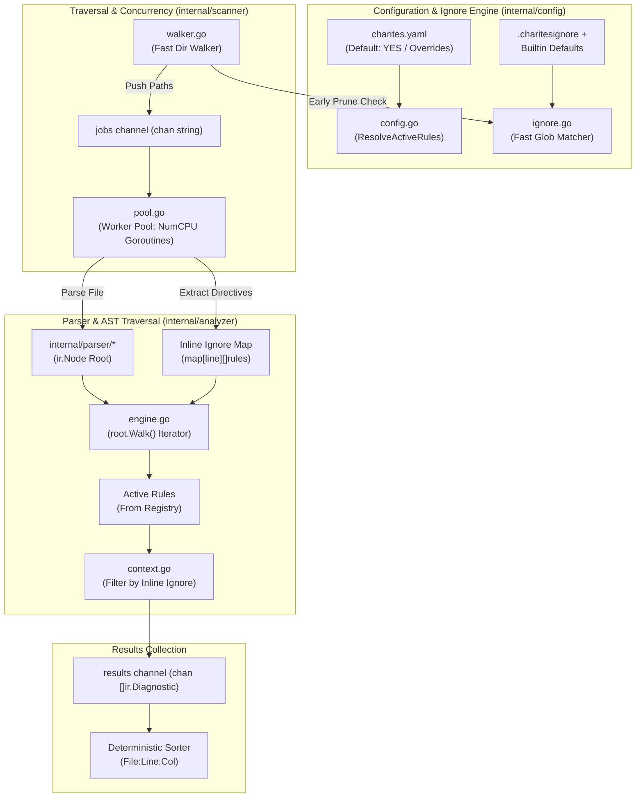

# 02-ARCHITECTURE: 04 - Configuration, Concurrency Scanner & Traversal Engine Architecture

> **Kode Dokumen:** `ARCH-04-ENGINE`
> **Tahapan:** Fase 4 - Konfigurasi, Concurrency Scanner & Traversal Engine
> **Status:** Ready for Review
> **Standar Rujukan:** High-Throughput Concurrency Patterns & Pipeline Architecture

Dokumen ini mendefinisikan arsitektur internal dari sistem konfigurasi (`internal/config/*`), mesin pemindai direktori berkonkurensi tinggi (`internal/scanner/*`), serta mesin traversal pohon AST (`internal/analyzer/*`).

---

## 1. Topologi Pipeline Eksekusi Engine



---

## 2. Arsitektur Paket Konfigurasi (`internal/config/`)

Paket `internal/config` menjamin prinsip **Default: YES** (Model Argus) dan penyaringan berkas efisien:

### 2.1. Rule Resolution Logic (`internal/config/config.go`)

```go
package config

import (
    "github.com/will2469/charites/internal/ir"
    "github.com/will2469/charites/internal/rules"
)

type Config struct {
    Rules  map[string]string `yaml:"rules"`  // "rule-id": "off" | "warn" | "error"
    Ignore []string          `yaml:"ignore"` // Path patterns tambahan
}

func (c *Config) ResolveActiveRules(reg *rules.Registry, categoryFilter, ruleFilter string) []rules.Rule {
    var active []rules.Rule
    for _, rule := range reg.All() {
        id := rule.ID()

        // 1. Filter CLI flag (--rule)
        if ruleFilter != "" && id != ruleFilter {
            continue
        }
        // 2. Filter CLI flag (--category)
        if categoryFilter != "" && rule.Category() != categoryFilter {
            continue
        }
        // 3. Filter charites.yaml overrides (Default: YES)
        if override, exists := c.Rules[id]; exists {
            if override == "off" || override == "false" || override == "disable" {
                continue // Rule dinonaktifkan
            }
        }

        active = append(active, rule)
    }
    return active
}
```

### 2.2. Fast Pattern Matcher & Early Pruning (`internal/config/ignore.go`)
Matcher mengkompilasi aturan glob menjadi pola yang dapat dievaluasi secara instan:
- **`ShouldIgnoreDir(dirName, relativePath string) bool`**:
  Dipanggil pada setiap level direktori. Jika direktori cocok dengan pola ignore (misal `node_modules` atau `dist`), fungsi mengembalikan `true`, dan walker langsung melewati pembacaan anak direktori.
- **`ShouldIgnoreFile(fileName, relativePath string) bool`**:
  Dipanggil saat walker menemukan berkas reguler sebelum berkas dimasukkan ke antrean worker pool.

---

## 3. Arsitektur Concurrency Scanner (`internal/scanner/`)

### 3.1. Walker Direktori Non-Blocking (`internal/scanner/walker.go`)
- **Direct Target Optimization:** Jika target berupa file tunggal (`os.Stat` mengindikasikan `!info.IsDir()`), walker langsung mengirimkan path tersebut ke channel tanpa penelusuran pohon direktori.
- **Batched Dir Read:** Menggunakan `os.ReadDir` yang lebih hemat alokasi dibandingkan `filepath.Walk` warisan karena tidak melakukan pemanggilan `os.Lstat` berulang pada setiap file.

### 3.2. Worker Pool Berkinerja Tinggi (`internal/scanner/pool.go`)
- Arsitektur worker pool mengadopsi pola **Fan-Out / Fan-In**:
  ```go
  type Pool struct {
      numWorkers int
      jobs       chan string
      results    chan []ir.Diagnostic
      wg         sync.WaitGroup
  }
  ```
- Setiap worker beroperasi secara mandiri tanpa berbagi state mutable (*share-nothing architecture*), membaca isi berkas, mengurai AST, dan memanggil traversal analyzer engine.

---

## 4. Arsitektur Traversal Analyzer Engine (`internal/analyzer/`)

### 4.1. Analisis Konteks Mandiri (`internal/analyzer/context.go`)
Struktur `Context` membungkus seluruh data yang dibutuhkan selama proses analisis satu berkas:
```go
type Context struct {
    FilePath      string
    Source        []byte
    InlineIgnores map[int][]string // Line -> []RuleIDs
    Diagnostics   []ir.Diagnostic
}

func (c *Context) IsIgnored(line int, ruleID string) bool {
    // Periksa apakah ada ignore pada baris yang sama atau baris tepat di atasnya
    for _, targetLine := range []int{line, line - 1} {
        if rules, ok := c.InlineIgnores[targetLine]; ok {
            for _, r := range rules {
                if r == ruleID || r == "*" {
                    return true
                }
            }
        }
    }
    return false
}
```

### 4.2. Engine Traversal Loop (`internal/analyzer/engine.go`)
Engine memanfaatkan Go 1.26 Range-Over-Func iterator `root.Walk()`:
```go
func (e *Engine) Analyze(ctx *Context, root *ir.Node, activeRules []rules.Rule) {
    if root == nil {
        return
    }

    // Zero-alloc depth-first traversal
    for node := range root.Walk() {
        for _, rule := range activeRules {
            findings := rule.Evaluate(node)
            for _, diag := range findings {
                // Terapkan penekanan inline ignore
                if !ctx.IsIgnored(diag.Line, diag.Rule) {
                    ctx.Diagnostics = append(ctx.Diagnostics, diag)
                }
            }
        }
    }
}
```

### 4.3. Deterministic Results Sorting
Karena pemrosesan berkas di worker pool bersifat asinkron, hasil diagnostic dari seluruh worker dikumpulkan dan diurutkan secara stabil sebelum dicetak:
1. Urutkan berdasarkan `File` (alfabetis).
2. Urutkan berdasarkan `Line` (numerik menaik).
3. Urutkan berdasarkan `Column` (numerik menaik).
4. Urutkan berdasarkan `Rule` (alfabetis).
Dengan demikian, output pemindaian dijamin 100% deterministik dan idempoten.
