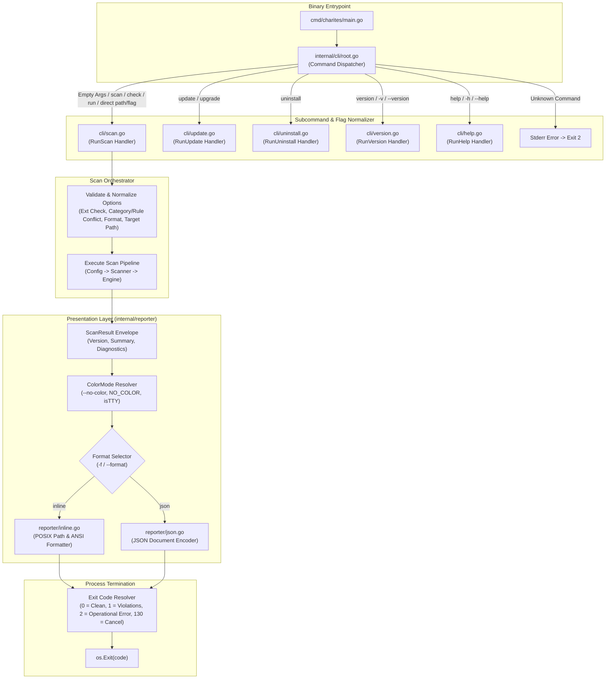

# 02-ARCHITECTURE: 05 - CLI Dispatcher, Command Architecture & Reporter Design

> **Kode Dokumen:** `ARCH-05-CLI`
> **Tahapan:** Fase 5 - Reporter Output & CLI Entrypoint
> **Peran Pilar:** ARCH = HOW (Rancangan Arsitektur CLI, Dispatcher & Abstraksi Reporter)
> **Status:** Ready / Approved for Implementation
> **Standar Rujukan:** Unix Philosophy CLI & Decoupled Presentation Layer Architecture

Dokumen ini mendefinisikan arsitektur internal dari paket antarmuka CLI (`internal/cli/*`), router dispatcher, validasi dan normalisasi flag, serta arsitektur presenter laporan (`internal/reporter/*`).

Sesuai kontrak [docs/00-CONTRACT.md](https://github.com/will2469/charites/blob/main/docs/00-CONTRACT.md), dokumen ARCH hanya menjelaskan **HOW** (implementasi struktural) dan secara ketat dilarang menambah, mengurangi, atau memodifikasi perilaku fungsional yang telah ditetapkan oleh `SPEC-05-CLI`.

---

## 1. Topologi Arsitektur CLI & Reporter



---

## 2. Matriks Kepemilikan Komponen (Component Ownership Matrix)

Setiap kebutuhan pada `SPEC-05-CLI` dipetakan ke komponen implementasi dengan batasan tanggung jawab yang terisolasi:

| Komponen Arsitektur | Berkas Sumber | Tanggung Jawab Kepemilikan (*Ownership*) | Masukan (*Input*) | Keluaran / Dampak |
| :--- | :--- | :--- | :--- | :--- |
| **Command Dispatcher** | `internal/cli/root.go` | Parsing argv tingkat atas, routing pemanggilan 0 argumen ke `scan .`, routing direct path/flag ke `scan`, alias `check`/`run`, alias `update`/`upgrade`, `uninstall`, penolakan unknown commands (exit 2). | `args []string`, `stdout`, `stderr` | Exit code `int` |
| **Scan Controller** | `internal/cli/scan.go` | Definisi `flag.FlagSet`, parsing flag ergonomi, validasi/normalisasi `--ext`, validasi irisan `--category` $\times$ `--rule`, validasi `--format`, orkestrasi pipeline pemindaian. | `args []string`, `stdout`, `stderr` | Exit code `int` |
| **Update Controller** | `internal/cli/update.go` | Pengecekan GitHub API rilis terbaru, flag `--check`, fallback `No update found.` (exit 0), penggantian atomik biner via `os.Rename`. Alias: `upgrade`. | `args []string`, `stdout`, `stderr` | Exit code `int` |
| **Uninstall Controller** | `internal/cli/uninstall.go` | Penghapusan biner eksekutabel tunggal via `os.Remove`, audit 0 residu host sistem (*Zero Residual Footprint*). | `args []string`, `stdout`, `stderr` | Exit code `int` |
| **Config Resolver** | `internal/config/config.go` | Pemuatan `charites.yaml` / custom path, penegakan Default: YES, resolusi 3-tier precedence (Policy `off` mengalahkan CLI), penggabungan pola `--ignore`. | Path config, CLI flags | `*config.Config`, `[]config.ActiveRule` |
| **Scanner & Pool** | `internal/scanner/` | Traversal direktori `Walker`, proteksi symlink & limit 10 MB, proteksi target langsung, eksekusi paralel worker pool terisolasi. | Target path, extensions, matcher | `[]ir.Diagnostic`, `error` |
| **AST Engine** | `internal/analyzer/` | Parsing AST, traversal node AST via iterator Go 1.26, evaluasi rule murni, penekanan inline ignore `ctx.IsIgnored()`. | Files, active rules, context | `[]ir.Diagnostic` |
| **Presentation Layer** | `internal/reporter/` | Abstraksi `Reporter`, DTO `ScanResult`/`ScanSummary`, resolusi `ColorMode` (TTY, `--no-color`, `NO_COLOR`), rendering teks ANSI inline dan dokumen JSON lengkap. | `*ScanResult`, `io.Writer` | Formatted output stream |
| **Exit Code Resolver** | `internal/cli/exit.go` | Pemetaan deterministik hasil pemindaian ke exit codes POSIX (0, 1, 2, 130) tanpa mencampuradukkan error operasional dan violation. | `*ScanSummary`, `failOnWarn bool` | Exit code `int` |

---

## 3. Arsitektur Dispatcher & Router Subcommand (`internal/cli/root.go`)

Untuk menjaga dependensi eksternal tetap nol (Zero Dependency Invariant):
- Menggunakan standar Go `flag.FlagSet` yang diisolasi per-subcommand.
- Normalisasi pemanggilan 0 argumen dan argumen path langsung:

```go
package cli

import (
    "fmt"
    "os"
    "strings"
)

func Execute(args []string) int {
    if len(args) == 0 {
        return RunScan([]string{"."})
    }

    switch args[0] {
    case "scan", "check", "run":
        return RunScan(args[1:])
    case "update", "upgrade":
        return RunUpdate(args[1:])
    case "uninstall":
        return RunUninstall(args[1:])
    case "version", "-v", "--version":
        return RunVersion()
    case "help", "-h", "--help":
        return RunHelp()
    default:
        // Jika argumen diawali dengan '-' (flag) atau berupa path berkas/direktori
        if strings.HasPrefix(args[0], "-") || isPath(args[0]) {
            return RunScan(args)
        }
        fmt.Fprintf(os.Stderr, "charites: error: unknown command \"%s\". Run 'charites help' for usage.\n", args[0])
        return 2
    }
}
```

---

## 4. Validasi & Normalisasi Flag Pemindaian (`internal/cli/scan.go`)

### 4.1. Normalisasi Flag `--ext`
- Input dibersihkan: huruf kecil (*lowercase*), spasi dipangkas (*trimmed*), dan tanda titik awal dipastikan ada.
- Verifikasi ekstensi terdaftar (`.astro`, `.tsx`, `.jsx`).
- Jika terdapat ekstensi tidak dikenal atau string kosong, fungsi mencetak error ke `stderr` dan mengembalikan exit code `2`.

### 4.2. Validasi Keberadaan & Konflik `--category` dan `--rule`
- Jika `--category` ditentukan, sistem memvalidasi keberadaannya di registri.
- Jika `--rule` ditentukan, sistem memvalidasi keberadaan rule ID di registri.
- Jika kedua flag disertakan, sistem memeriksa apakah kategori rule cocok dengan nilai `--category`.
- Jika terjadi ketidaksesuaian, sistem menolak eksekusi dengan exit code `2`.

### 4.3. Validasi Flag `--format`
- Format divalidasi hanya menerima `inline` atau `json`. Nilai lain ditolak dengan exit code `2`.

### 4.4. Validasi Path Target & Direct-Target Safety
- Path diperiksa keberadaannya via `os.Stat`. Jika tidak ada, exit code `2`.
- Path diperiksa dengan `matcher.HasBuiltinAncestor(target)`. Jika berada di dalam builtin exclusions, ditolak dengan exit code `2`.

---

## 5. Arsitektur Presenter Laporan (`internal/reporter/`)

### 4.1. Data Transfer Objects (DTO) & Interface Reporter (`reporter.go`)

```go
package reporter

import (
    "io"
    "github.com/will2469/charites/internal/ir"
)

type ScanSummary struct {
    ScannedFiles int   `json:"scanned_files"`
    DurationMS   int64 `json:"duration_ms"`
    ErrorCount   int   `json:"error_count"`
    WarningCount int   `json:"warning_count"`
    InfoCount    int   `json:"info_count"`
    Passed       bool  `json:"passed"`
}

type ScanResult struct {
    Version     string          `json:"version"`
    Summary     ScanSummary     `json:"summary"`
    Diagnostics []ir.Diagnostic `json:"diagnostics"`
}

type Reporter interface {
    Render(w io.Writer, result *ScanResult) error
}
```

### 4.2. Resolusi ColorMode Portabel (`internal/reporter/color.go`)

```go
type ColorMode int

const (
    ColorAuto ColorMode = iota
    ColorNever
)

func ResolveColorMode(noColorFlag bool) ColorMode {
    if noColorFlag {
        return ColorNever
    }
    if os.Getenv("NO_COLOR") != "" {
        return ColorNever
    }
    if !isTerminal(os.Stdout) {
        return ColorNever
    }
    return ColorAuto
}
```
Abstraksi `ColorMode` memungkinkan pengujian unit tanpa memerlukan emulator terminal nyata (*mocking `ColorMode`*).

### 5.3. Inline ANSI Reporter (`internal/reporter/inline.go`)
- **POSIX Path Formatting:** Menggunakan `filepath.ToSlash(relPath)` untuk memastikan separator forward slash (`/`) konsisten lintas Linux, macOS, dan Windows.
- **Visual Distinction:** Format terpisah untuk pemindaian bersih (*clean*) dan pemindaian dengan temuan (*violations*).

### 5.4. JSON Document Reporter (`internal/reporter/json.go`)
- Menggunakan `json.NewEncoder(w)` dengan `SetIndent("", "  ")`.
- Menulis dokumen JSON tunggal lengkap yang mencakup `version`, `summary`, dan slice `diagnostics`.

---

## 6. Mesin Resolusi Exit Code (`internal/cli/exit.go`)

```go
func ResolveExitCode(res *ScanResult, failOnWarn bool) int {
    if res.Summary.ErrorCount > 0 {
        return 1
    }
    if failOnWarn && res.Summary.WarningCount > 0 {
        return 1
    }
    return 0
}
```
Kesalahan operasional (flag salah, berkas tidak ditemukan, argumen tidak sah) ditangani langsung di level CLI router dengan mengembalikan exit code **`2`**.
Sesuai kontrak `SPEC-05-CLI`, temuan pelanggaran diagnostik dilarang keras menghasilkan exit code `2`.

---

## 7. Realisasi Arsitektur Bebas Residu (Zero Residual Footprint Architecture)

Untuk memenuhi persyaratan `SPEC-05-LIFECYCLE-001` dan `GOV-00-CONTRACT`:
1. **Stateless Memory Model:**
   - Seluruh pipeline eksekusi (`internal/cli`, `internal/scanner`, `internal/analyzer`, `internal/reporter`) beroperasi murni di heap memory proses.
   - Tidak ada modul yang memanggil `os.UserHomeDir()` atau `os.UserCacheDir()` untuk tujuan persistensi status atau cache biner.
2. **Ephemeral Process Lifecycle:**
   - Proses diinisialisasi melalui `cmd/charites/main.go`, mengalir secara sinkron lewat orchestrator, dan diakhiri dengan `os.Exit(code)`.
   - Tidak ada goroutine yang di-detach sebagai daemon di luar siklus hidup proses `main()`.
3. **Hermetic Host Isolation:**
   - Tidak ada berkas sementara (*scratch files*) yang ditulis ke filesystem host.
   - Saat biner dihapus dari filesystem host, tidak ada state tersembunyi yang tersisa (*100% clean uninstall*).

