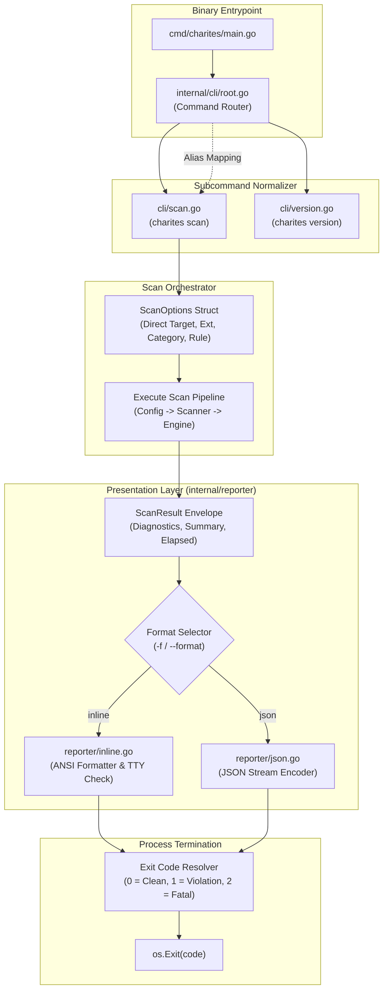

# 02-ARCHITECTURE: 05 - CLI Dispatcher, Command Architecture & Reporter Design

> **Kode Dokumen:** `ARCH-05-CLI`
> **Tahapan:** Fase 5 - Reporter Output & CLI Entrypoint
> **Status:** Ready for Review
> **Standar Rujukan:** Unix Philosophy CLI & Decoupled Presentation Layer Architecture

Dokumen ini mendefinisikan arsitektur internal dari layer antarmuka pengguna CLI (`internal/cli/*`), router dispatcher, normalisasi argumen dan flag, serta abstraksi presenter laporan (`internal/reporter/*`).

---

## 1. Topologi Arsitektur CLI & Reporter



---

## 2. Arsitektur Dispatcher & Router Subcommand (`internal/cli/`)

Untuk menjaga binary tetap ramping dan tanpa ketergantungan library pihak ketiga yang membengkak:
1. **Zero External CLI Dependency:**
   Dispatcher dibangun memanfaatkan paket bawaan Go `flag.FlagSet` yang diisolasi per-subcommand.
2. **Normalisasi Alias Otomatis:**
   ```go
   func Execute(args []string) int {
       if len(args) == 0 {
           return runScan([]string{"."})
       }

       switch args[0] {
       case "scan", "check", "run":
           return runScan(args[1:])
       case "version", "-v", "--version":
           return runVersion()
       case "help", "-h", "--help":
           return runHelp()
       default:
           // Jika argumen pertama berupa path berkas/folder atau flag
           return runScan(args)
       }
   }
   ```
3. **Penyelarasan Flag Ergonomi (A-E):**
   Flag parsing menyaring parameter ke dalam struktur `ScanOptions`:
   - `TargetPath`: Path sasaran (file tunggal atau direktori).
   - `Extensions`: Slice ekstensi yang diizinkan (misal `[]string{".astro", ".tsx"}`).
   - `CategoryFilter`: String kategori atau kosong.
   - `RuleFilter`: String Semgrep ID tunggal atau kosong.
   - `Format`: `"inline"` atau `"json"`.

---

## 3. Arsitektur Presenter Laporan (`internal/reporter/`)

Layer pelaporan dipisahkan secara bersih (*decoupled*) dari mesin evaluasi dan scanner:

### 3.1. Kontrak Antarmuka Reporter (`reporter.go`)

```go
package reporter

import (
    "io"
    "time"
    "github.com/will2469/charites/internal/ir"
)

type ScanSummary struct {
    ScannedFiles int           `json:"scanned_files"`
    Duration     time.Duration `json:"duration"`
    ErrorCount   int           `json:"error_count"`
    WarningCount int           `json:"warning_count"`
    InfoCount    int           `json:"info_count"`
    Passed       bool          `json:"passed"`
}

type ScanResult struct {
    Diagnostics []ir.Diagnostic `json:"diagnostics"`
    Summary     ScanSummary     `json:"summary"`
}

type Reporter interface {
    Render(w io.Writer, result *ScanResult) error
}
```

### 3.2. ANSI Terminal Formatter (`internal/reporter/inline.go`)
- **Deteksi TTY Otomatis:** Memeriksa apakah file descriptor `os.Stdout` terhubung ke pseudoterminal (*character device*) atau dialihkan ke pipe.
- **Dukungan `NO_COLOR` Standard:** Memeriksa `os.Getenv("NO_COLOR") != ""`. Jika aktif, seluruh kode warna escape string di-strip menjadi teks polos.
- **Grouping Diagnostik:** Menata keluaran berdasarkan urutan hierarki file untuk meminimalkan redundansi path di terminal.

### 3.3. JSON Stream Presenter (`internal/reporter/json.go`)
- Menggunakan `json.NewEncoder(w)` dengan indentasi teratur (`SetIndent("", "  ")`).
- Menulis output langsung ke `io.Writer` tanpa buffer alokasi string sementara yang besar.

---

## 4. Mesin Resolusi Exit Code (`exit.go`)

Exit code ditentukan secara deterministik berdasarkan ada tidaknya temuan dan flag:

```go
func ResolveExitCode(res *ScanResult, failOnWarn bool) int {
    if res.Summary.ErrorCount > 0 {
        return 1
    }
    if failOnWarn && res.Summary.WarningCount > 0 {
        return 1
    }
    return 0
}
```
Jika terjadi kesalahan I/O fatal (seperti direktori tidak ditemukan atau file konfigurasi korup), dispatcher langsung mengembalikan exit code **2**.
