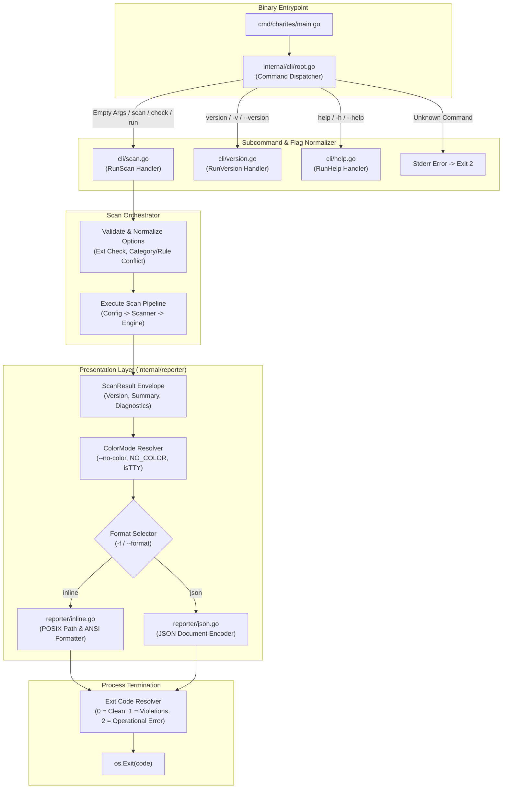

# 02-ARCHITECTURE: 05 - CLI Dispatcher, Command Architecture & Reporter Design

> **Kode Dokumen:** `ARCH-05-CLI`
> **Tahapan:** Fase 5 - Reporter Output & CLI Entrypoint
> **Peran Pilar:** ARCH = HOW (Rancangan Arsitektur CLI, Dispatcher & Abstraksi Reporter)
> **Status:** Ready for Review
> **Standar Rujukan:** Unix Philosophy CLI & Decoupled Presentation Layer Architecture

Dokumen ini mendefinisikan arsitektur internal dari paket antarmuka CLI (`internal/cli/*`), router dispatcher, validasi dan normalisasi flag, serta arsitektur presenter laporan (`internal/reporter/*`).

---

## 1. Topologi Arsitektur CLI & Reporter



---

## 2. Arsitektur Dispatcher & Router Subcommand (`internal/cli/`)

Untuk menjaga dependensi eksternal tetap nol (Zero Dependency Invariant):
- Menggunakan standar Go `flag.FlagSet` yang diisolasi per-subcommand.
- Normalisasi pemanggilan 0 argumen dan argumen path langsung:

```go
package cli

import (
    "fmt"
    "os"
    "strings"
)

func Execute(args []string) int {
    if len(args) == 0 {
        return RunScan([]string{"."})
    }

    switch args[0] {
    case "scan", "check", "run":
        return RunScan(args[1:])
    case "version", "-v", "--version":
        return RunVersion()
    case "help", "-h", "--help":
        return RunHelp()
    default:
        // Jika argumen diawali dengan '-' (flag) atau berupa path berkas/direktori
        if strings.HasPrefix(args[0], "-") || isPath(args[0]) {
            return RunScan(args)
        }
        fmt.Fprintf(os.Stderr, "charites: error: unknown command \"%s\". Run 'charites help' for usage.\n", args[0])
        return 2
    }
}
```

---

## 3. Validasi & Normalisasi Flag Pemindaian (`internal/cli/scan.go`)

### 3.1. Normalisasi Flag `--ext`
- Input dibersihkan: huruf kecil (*lowercase*), spasi dipangkas (*trimmed*), dan tanda titik awal dipastikan ada.
- Verifikasi ekstensi terdaftar (`.astro`, `.tsx`, `.jsx`).
- Jika terdapat ekstensi tidak dikenal atau string kosong, fungsi mencetak error ke `stderr` dan mengembalikan exit code `2`.

### 3.2. Validasi Konflik `--category` dan `--rule`
- Jika kedua flag disertakan, sistem memeriksa apakah kategori rule cocok dengan nilai `--category`.
- Jika terjadi ketidaksesuaian, sistem menolak eksekusi dengan exit code `2`.

---

## 4. Arsitektur Presenter Laporan (`internal/reporter/`)

### 4.1. Data Transfer Objects (DTO) & Interface Reporter (`reporter.go`)

```go
package reporter

import (
    "io"
    "github.com/will2469/charites/internal/ir"
)

type ScanSummary struct {
    ScannedFiles int   `json:"scanned_files"`
    DurationMS   int64 `json:"duration_ms"`
    ErrorCount   int   `json:"error_count"`
    WarningCount int   `json:"warning_count"`
    InfoCount    int   `json:"info_count"`
    Passed       bool  `json:"passed"`
}

type ScanResult struct {
    Version     string          `json:"version"`
    Summary     ScanSummary     `json:"summary"`
    Diagnostics []ir.Diagnostic `json:"diagnostics"`
}

type Reporter interface {
    Render(w io.Writer, result *ScanResult) error
}
```

### 4.2. Resolusi ColorMode Portabel (`internal/reporter/color.go`)

```go
type ColorMode int

const (
    ColorAuto ColorMode = iota
    ColorNever
)

func ResolveColorMode(noColorFlag bool) ColorMode {
    if noColorFlag {
        return ColorNever
    }
    if os.Getenv("NO_COLOR") != "" {
        return ColorNever
    }
    if !isTerminal(os.Stdout) {
        return ColorNever
    }
    return ColorAuto
}
```
Abstraksi `ColorMode` memungkinkan pengujian unit tanpa memerlukan emulator terminal nyata (*mocking `ColorMode`*).

### 4.3. Inline ANSI Reporter (`internal/reporter/inline.go`)
- **POSIX Path Formatting:** Menggunakan `filepath.ToSlash(relPath)` untuk memastikan separator forward slash (`/`) konsisten lintas Linux, macOS, dan Windows.
- **Visual Distinction:** Format terpisah untuk pemindaian bersih (*clean*) dan pemindaian dengan temuan (*violations*).

### 4.4. JSON Document Reporter (`internal/reporter/json.go`)
- Menggunakan `json.NewEncoder(w)` dengan `SetIndent("", "  ")`.
- Menulis dokumen JSON tunggal lengkap yang mencakup `version`, `summary`, dan slice `diagnostics`.

---

## 5. Mesin Resolusi Exit Code (`internal/cli/exit.go`)

```go
func ResolveExitCode(res *ScanResult, failOnWarn bool) int {
    if res.Summary.ErrorCount > 0 {
        return 1
    }
    if failOnWarn && res.Summary.WarningCount > 0 {
        return 1
    }
    return 0
}
```
Kesalahan operasional (flag salah, berkas tidak ditemukan, argumen tidak sah) ditangani langsung di level CLI router dengan mengembalikan exit code **`2`**.
