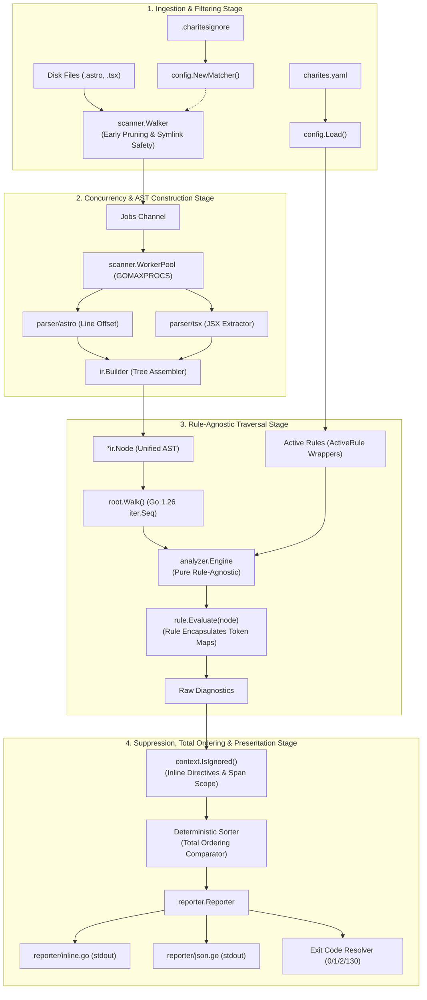

# 02-ARCHITECTURE: 06 - End-to-End Pipeline Integration & Golden Verification Architecture

> **Kode Dokumen:** `ARCH-06-GOLDEN`
> **Tahapan:** Fase 6 - Validasi Penuh & Golden Snapshots (Milestone Selesai Pipa)
> **Peran Pilar:** ARCH = HOW (Rancangan Arsitektur Pipa Terpadu, Harness Golden & Pembekuan Inti)
> **Status:** Approved / Frozen (Pipeline Locked)
> **Standar Rujukan:** Compiler Pipeline Integration & Golden Master Architecture

Dokumen ini mendefinisikan arsitektur integrasi pipa compiler (*unidirectional staged pipeline*), harness pembanding *golden snapshot*, pemisahan boundary rule, serta tata kelola pembekuan arsitektur inti.

---

## 1. Topologi Pipa Terpadu (Unidirectional Staged Pipeline)

Pipa pemindaian Charites dirancang sebagai aliran data bertahap searah tanpa siklus dependensi:



### 1.1. Invarian Kemurnian Boundary Engine (Rule-Agnostic Substrate)
- Engine `analyzer.Engine` **DILARANG KERAS** memiliki ketergantungan langsung ke `OPACITY_TOKEN_MAP` atau kamus token rule spesifik.
- Seluruh logika token semantik, kelas CSS warna, dan rekomendasi hint dienkapsulasi penuh di dalam rule terkait (misal: `internal/rules/theme/hardcode_opacity_color.go`).
- Engine murni bertindak sebagai orkestrator traversal AST yang memanggil interface `rule.Evaluate(node)`.

---

## 2. Arsitektur Test Harness Golden Snapshots (`tests/golden_test.go`)

*Harness* golden snapshot bertindak sebagai pagar pengaman absolut terhadap *diagnostic drift*:

```go
package tests

import (
    "bytes"
    "flag"
    "os"
    "path/filepath"
    "testing"

    "github.com/will2469/charites/internal/cli"
)

var update = flag.Bool("update", false, "Update golden snapshot files")

func TestPipeline_GoldenSnapshots(t *testing.T) {
    if *update && os.Getenv("CI") == "true" {
        t.Fatal("FATAL: Golden snapshots MUST NOT be updated in CI environments!")
    }

    scenarios := []string{"clean", "opacity_violations", "config_override", "ignore_patterns"}

    for _, sc := range scenarios {
        t.Run(sc, func(t *testing.T) {
            projectDir := filepath.Join("fixtures", "projects", sc)
            goldenJSON := filepath.Join("golden", "projects", sc+".golden.json")

            var stdout bytes.Buffer
            _ = cli.ExecuteWithBuffer([]string{"scan", projectDir, "-f", "json"}, &stdout)

            // 1. Normalisasi output aktual (hilangkan runtime duration_ms untuk komparasi)
            actualBytes := normalizeJSONForGolden(stdout.Bytes())

            if *update {
                _ = os.WriteFile(goldenJSON, actualBytes, 0644)
                t.Logf("UPDATED golden file: %s", goldenJSON)
                return
            }

            expectedBytes, err := os.ReadFile(goldenJSON)
            if err != nil {
                t.Fatalf("failed to read golden file: %v", err)
            }

            if !bytes.Equal(actualBytes, expectedBytes) {
                t.Fatalf("Golden snapshot mismatch on %s!\nDiff:\n%s", sc, computeDiff(expectedBytes, actualBytes))
            }
        })
    }
}
```

---

## 3. Arsitektur Ketahanan Fuzzing Bertingkat (`tests/fuzz/`)

Fuzzing dijalankan pada dua lapisan terpisah:
1. **Parser-Level Fuzzing:** Memvalidasi kekebalan scanner dan extractor terhadap byte malformed murni (`astro_fuzz_test.go`, `tsx_fuzz_test.go`).
2. **Pipeline-Level Fuzzing:** Memvalidasi aliran menyeluruh dari byte acak hingga traversal rule dan serialisasi reporter (`pipeline_fuzz_test.go`).

---

## 4. Invarian Pembekuan Arsitektur Inti (Core Architecture Freeze)

- **Architecture Freeze $\neq$ Bug Fix Freeze:**
  - Kontrak antarmuka `internal/ir`, `internal/parser`, `internal/scanner`, `internal/analyzer`, dan `internal/reporter` dibekukan dari perombakan arsitektural mayor.
  - Perbaikan cacat kode (*bug fixes*), penajaman deteksi, dan peningkatan efisiensi yang mematuhi kontrak antarmuka tetap diperbolehkan.
- **Modular Expansion:** Tahapan berikutnya (Fase 8) murni mengimplementasikan interface `Rule` di direktori terisolasi `internal/rules/<domain>/` tanpa memodifikasi pipeline engine.
