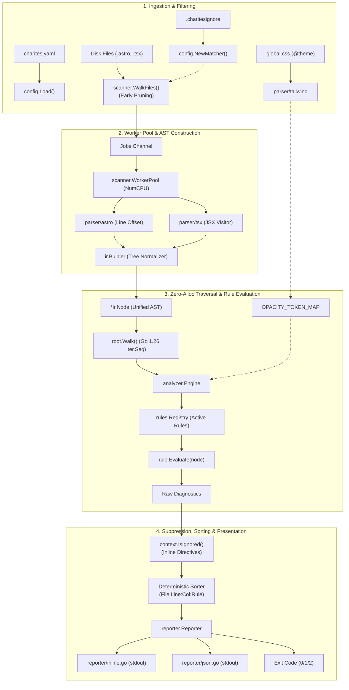

# 02-ARCHITECTURE: 06 - End-to-End Pipeline Integration & Golden Verification Architecture

> **Kode Dokumen:** `ARCH-06-GOLDEN`
> **Tahapan:** Fase 6 - Validasi Penuh & Golden Snapshots (Milestone Selesai Pipa)
> **Status:** Ready for Review
> **Standar Rujukan:** Compiler Pipeline Integration & Golden Master Architecture

Dokumen ini mendefinisikan arsitektur integrasi penuh dari ujung ke ujung (*end-to-end integrated compiler pipeline*), arsitektur *test harness* pembanding *golden snapshot*, serta jaminan kestabilan antarmuka internal sebelum memasuki tahapan ekspansi ekosistem dan rules.

---

## 1. Topologi Pipa Terpadu End-to-End (Single-Pass Architecture)

Pipa pemindaian Charites dirancang sebagai aliran data searah (*unidirectional single-pass pipeline*) berkinerja tinggi:



---

## 2. Arsitektur Test Harness Golden Snapshots (`tests/golden_test.go`)

*Harness* golden snapshot bertindak sebagai pagar pengaman absolut terhadap *diagnostic drift*:

```go
package tests

import (
    "bytes"
    "flag"
    "os"
    "path/filepath"
    "testing"

    "github.com/will2469/charites/internal/cli"
)

var update = flag.Bool("update", false, "Update golden snapshot files")

func TestPipeline_GoldenSnapshots(t *testing.T) {
    fixtures := []string{"astro_opacity", "tsx_opacity", "clean_project"}

    for _, fixture := range fixtures {
        t.Run(fixture, func(t *testing.T) {
            fixtureDir := filepath.Join("fixtures", fixture)
            goldenJSON := filepath.Join("golden", fixture+".golden.json")

            var stdout bytes.Buffer
            // Eksekusi pemindaian end-to-end via CLI controller
            exitCode := cli.ExecuteWithBuffer([]string{"scan", fixtureDir, "-f", "json"}, &stdout)

            actualBytes := stdout.Bytes()

            if *update {
                // Tulis ulang berkas golden jika -update aktif
                err := os.WriteFile(goldenJSON, actualBytes, 0644)
                if err != nil {
                    t.Fatalf("failed to update golden file: %v", err)
                }
                return
            }

            expectedBytes, err := os.ReadFile(goldenJSON)
            if err != nil {
                t.Fatalf("failed to read golden file: %v", err)
            }

            if !bytes.Equal(actualBytes, expectedBytes) {
                t.Fatalf("Golden snapshot mismatch on %s!\nDiff:\n%s", fixture, computeDiff(expectedBytes, actualBytes))
            }
        })
    }
}
```

---

## 3. Arsitektur Ketahanan Fuzzing (`tests/fuzz/`)

Fuzzing dijalankan pada layer perantara AST dan Lexer untuk membuktikan tidak ada rekursi tak berhingga (*infinite loop*) atau *panic dereference*:
- **Astro Splitter Resilience:** Menguji pemisahan blok frontmatter dengan kombinasi karakter tak lazim (`---` di dalam string, kutip gantung, comment HTML bersarang).
- **TSX Visitor Resilience:** Menguji tag JSX tanpa nama, penutup tag di luar kurung, kurung kurawal kurung siku tidak seimbang.
- **Tree Assembler Resilience:** Menguji pembuatan relasi `Parent`/`Children` pada dokumen dengan kedalaman melebihi 256 tingkat.

---

## 4. Invarian Pembekuan Pipa (Core Infrastructure Freeze)

Dengan berakhirnya Fase 6:
1. **Core Pipeline Locked:** Struktur kontrak `internal/ir`, `internal/parser`, `internal/scanner`, `internal/analyzer`, dan `internal/reporter` dinyatakan **FINAL**.
2. **Pluggable Expansion:** Tahapan berikutnya (Fase 8) dilarang mengubah arsitektur pipa. Penambahan puluhan rule audit baru murni dilakukan dengan membuat file mandiri di `internal/rules/<domain>/` yang mengimplementasikan interface `Rule` dan mendaftarkannya ke `Registry`.
