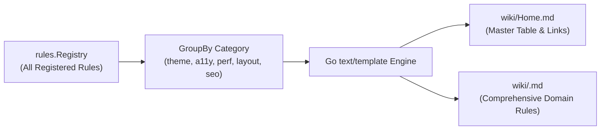

# 02-ARCHITECTURE: 07 - MCP Server, Stdio Protocol & Wiki Generator Architecture

> **Kode Dokumen:** `ARCH-07-MCP`
> **Tahapan:** Fase 7 - Ekosistem Lanjutan (MCP Server & Wiki Generator)
> **Status:** Ready for Review
> **Standar Rujukan:** Model Context Protocol (MCP) Architecture & JSON-RPC 2.0

Dokumen ini mendefinisikan arsitektur internal dari server **Model Context Protocol (MCP)** berbasis Stdio (`internal/mcp/*`), mekanisme isolasi kanal komunikasi JSON-RPC, serta arsitektur generator dokumentasi ensiklopedia (*wiki generator*).

---

## 1. Topologi Arsitektur Server MCP Stdio

Server MCP bertindak sebagai jembatan protokol antara AI Agent dengan mesin compiler Charites:

```mermaid
flowchart TD
    subgraph AI_Client ["AI Agent Host (Cursor / Claude / Antigravity)"]
        ClientProcess["AI Client Process"]
    end

    subgraph MCP_Server ["internal/mcp (charites mcp)"]
        StdioLoop["stdio.go\n(bufio.Scanner / NewEncoder)"]
        RPCDispatcher["dispatcher.go\n(JSON-RPC 2.0 Router)"]

        subgraph Tool_Handlers ["Tool Handlers"]
            ScanHandler["handler_scan.go\n(charites_scan)"]
            ExplainHandler["handler_explain.go\n(charites_explain_rule)"]
            ListHandler["handler_list.go\n(charites_list_rules)"]
        end
    end

    subgraph Core_Engine ["Charites Core Engine"]
        Registry["rules.Registry"]
        Pipeline["Engine Pipeline (Scanner + AST)"]
    end

    ClientProcess -->|stdin (JSON-RPC Request)| StdioLoop
    StdioLoop --> RPCDispatcher
    RPCDispatcher --> ScanHandler & ExplainHandler & ListHandler

    ScanHandler --> Pipeline
    ExplainHandler --> Registry
    ListHandler --> Registry

    RPCDispatcher -->|stdout (JSON-RPC Response)| StdioLoop
    StdioLoop -->|stdout| ClientProcess
```

---

## 2. Invarian Isolasi Kanal Stdio (Zero Protocol Pollution)

Karakteristik kritis dari implementasi MCP berbasis `stdio`:
1. **Pemisahan Aliran Mutlak:**
   - **`os.Stdin`**: Murni dibaca oleh loop JSON-RPC untuk menerima request agent.
   - **`os.Stdout`**: **HANYA BOLEH** memuat frame JSON-RPC valid. Dilarang keras mencetak teks apapun (seperti `fmt.Println("scanning...")` atau ANSI escape sequence) ke `os.Stdout`, karena akan langsung merusak parser JSON-RPC milik AI Host.
   - **`os.Stderr`**: Seluruh log diagnostik, error fatal internal, atau trace debugging dialihkan ke `os.Stderr`.
2. **Buffering Efisien:**
   - Menggunakan `bufio.Scanner` dengan buffer maksimum yang dapat diperbesar hingga **4 Megabytes** untuk menerima payload argumen panjang.

---

## 3. Arsitektur Dispatcher JSON-RPC 2.0

Pesan yang masuk dialirkan melalui struktur pesan terstandarisasi:

```go
package mcp

type JSONRPCRequest struct {
    JSONRPC string          `json:"jsonrpc"` // Wajib "2.0"
    ID      any             `json:"id,omitempty"`
    Method  string          `json:"method"`
    Params  json.RawMessage `json:"params,omitempty"`
}

type JSONRPCResponse struct {
    JSONRPC string `json:"jsonrpc"`
    ID      any    `json:"id,omitempty"`
    Result  any    `json:"result,omitempty"`
    Error   *RPCError `json:"error,omitempty"`
}
```

### Penanganan Method Utama:
- **`initialize`**: Merespons dengan versi protokol `2026-07-28` dan deklarasi kemampuan server (*server capabilities*).
- **`tools/list`**: Mengambil seluruh metadata rule dari `rules.Registry` untuk menyusun daftar tool JSON Schema.
- **`tools/call`**:
  - Untuk `charites_scan`: Menjalankan pipeline pemindaian secara in-memory dan membungkus hasil `ScanResult` ke dalam format MCP content block (`type: "text"`).
  - Untuk `charites_explain_rule`: Menarik deskripsi, severity, dan panduan remedi dari instance `Rule`.

---

## 4. Arsitektur Wiki Generator (`internal/wiki/`)

Subcommand `charites wiki` mengekspor metadata kompilasi menjadi berkas dokumentasi markdown:



### Mekanisme Ekspor:
1. **Grouping Domain:** Generator mengelompokkan rules berdasarkan `rule.Category()`.
2. **Template Rendering:** Template bawaan binary Go (`embed.FS`) digunakan untuk memformat tabel navigasi, contoh salah (*bad code*), dan perbaikan (*good code*).
3. **Atomic File Write:** Berkas ditulis ke direktori sasaran secara bersih. Jika folder sasaran belum ada, generator membuatnya secara otomatis (`os.MkdirAll`).
