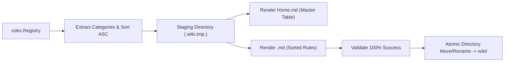

# 02-ARCHITECTURE: 07 - MCP Server, Stdio Protocol, Wiki Generator & Installer Architecture

> **Kode Dokumen:** `ARCH-07-MCP`
> **Tahapan:** Fase 7 - Ekosistem Lanjutan (MCP Server, Wiki Generator & Secure Installer)
> **Peran Pilar:** ARCH = HOW (Rancangan Protokol Stdio, Router MCP, Generator Wiki & Keamanan Pemasang)
> **Status:** Ready for Review
> **Standar Rujukan:** Model Context Protocol Architecture & JSON-RPC 2.0 Specification

Dokumen ini mendefinisikan arsitektur internal server **Model Context Protocol (MCP)** berbasis Stdio (`internal/mcp/*`), router JSON-RPC dengan state machine, isolasi trust boundary pemindaian, arsitektur generator ensiklopedia wiki, serta alur keamanan pemasang biner.

---

## 1. Topologi Arsitektur Server MCP Stdio

```mermaid
flowchart TD
    subgraph AI_Host ["AI Agent Host (Cursor / Claude / Antigravity)"]
        HostProcess["AI Client Process"]
    end

    subgraph MCP_Server ["internal/mcp (charites mcp)"]
        StdioLoop["stdio.go\n(LF Scanner, 4MB Max Frame)"]
        StateMachine["State Machine\n(NEW -> INITIALIZING -> READY)"]
        RPCDispatcher["dispatcher.go\n(JSON-RPC 2.0 Router)"]

        subgraph Tool_Registry ["MCP Tool Registry (Dedicated)"]
            ScanHandler["handler_scan.go\n(charites_scan + Trust Boundary)"]
            ExplainHandler["handler_explain.go\n(charites_explain_rule)"]
            ListHandler["handler_list.go\n(charites_list_rules)"]
        end
    end

    subgraph Core_Subsystems ["Charites Core Subsystems"]
        Registry["rules.Registry (SSOT Rule Metadata)"]
        Engine["Engine Pipeline (Scanner + AST + Rules)"]
    end

    HostProcess -->|stdin (JSON-RPC LF Frame)| StdioLoop
    StdioLoop --> StateMachine
    StateMachine --> RPCDispatcher
    RPCDispatcher --> ScanHandler & ExplainHandler & ListHandler

    ScanHandler -->|Workspace-Scoped Scan| Engine
    ExplainHandler -->|Read Metadata| Registry
    ListHandler -->|List Catalog| Registry

    RPCDispatcher -->|stdout (Raw JSON-RPC Response)| StdioLoop
    StdioLoop -->|stdout| HostProcess
    StdioLoop -.->|Diagnostic Logs ONLY| Stderr["os.Stderr"]
```

---

## 2. Arsitektur Transport & State Machine Protokol (`internal/mcp/`)

### 2.1. Stdio Framing & Zero Contamination Invariant
- **`os.Stdin`**: Dibaca baris demi baris menggunakan `bufio.Scanner` dengan pembatas `\n` dan batas buffer maksimum 4 Megabytes.
- **`os.Stdout`**: Dikelola eksklusif oleh JSON-RPC serializer. Setiap pesan keluar ditulis sebagai satu baris JSON utuh diakhiri `\n`. Logging internal dilarang keras menyentuh `stdout`.
- **`os.Stderr`**: Seluruh log operasional dialihkan ke `os.Stderr`.

### 2.2. Protocol State Machine & Preservasi Request ID

```go
package mcp

import (
    "encoding/json"
    "sync"
)

type ServerState int

const (
    StateNew ServerState = iota
    StateInitializing
    StateReady
    StateShuttingDown
)

type JSONRPCRequest struct {
    JSONRPC string          `json:"jsonrpc"` // Wajib "2.0"
    ID      json.RawMessage `json:"id,omitempty"` // Preservasi tipe identik (string/int)
    Method  string          `json:"method"`
    Params  json.RawMessage `json:"params,omitempty"`
}

type JSONRPCResponse struct {
    JSONRPC string          `json:"jsonrpc"`
    ID      json.RawMessage `json:"id,omitempty"`
    Result  any             `json:"result,omitempty"`
    Error   *RPCError       `json:"error,omitempty"`
}

type Server struct {
    state       ServerState
    workspace   string
    toolReg     *ToolRegistry
    activeScans sync.Map // RequestID -> context.CancelFunc
    mu          sync.RWMutex
}
```

### 2.3. Enkapsulasi Trust Boundary & Path Traversal Guard (`handler_scan.go`)
- Sebelum memanggil scanner, handler memvalidasi path target:
  1. Bersihkan path menggunakan `filepath.Clean`.
  2. Resolusikan path terhadap `s.workspace`.
  3. Verifikasi apakah path hasil resolusi memiliki prefiks direktori `s.workspace`. Jika path mengarah ke luar (misal `../`), handler mengembalikan error JSON-RPC `-32602` (*Invalid Params: path traversal detected*).
  4. Periksa symlink: jika symlink mengarah ke luar workspace, akses ditolak.
- **Penerapan Timeout 30 Detik & Pembatalan:**
  ```go
  ctx, cancel := context.WithTimeout(context.Background(), 30*time.Second)
  s.activeScans.Store(string(req.ID), cancel)
  defer s.activeScans.Delete(string(req.ID))
  ```

---

## 3. Arsitektur Wiki Generator Dinamis & Atomik (`internal/wiki/`)



### Mekanisme Generasi Determinis & Atomik:
1. **Dynamic Category Grouping:** Mengelompokkan rule dari `Registry` berdasarkan `rule.Category()`, diurutkan leksikografis menaik.
2. **Deterministic Entry Ordering:** Di dalam setiap berkas domain, rule diurutkan berdasarkan `Rule.ID() ASC`.
3. **Pentas Staging Atomik:** Seluruh berkas dirender ke direktori temporer terlebih dahulu. Target direktori `wiki/` hanya diperbarui setelah seluruh berkas terbukti valid, mencegah output setengah jadi (*partial corrupted state*).

---

## 4. Arsitektur Keamanan Pemasang Shell (`scripts/install.sh`)

1. **Unduhan HTTPS & Manifest Checksum:** Mengambil biner dan berkas `checksums.txt` resmi dari GitHub Releases.
2. **Verifikasi Hash Terisolasi:** Memverifikasi hash biner menggunakan `sha256sum -c` di direktori sementara (`mktemp -d`).
3. **Ekstraksi Bersih & Pemasangan Atomik:**
   - Memastikan tidak ada entri `..` di dalam tarball.
   - Memindahkan berkas ke lokasi tujuan (`/usr/local/bin` atau `$HOME/.local/bin`) menggunakan utilitas `install -m 0755` atau `mv` atomik.
   - Mengaktifkan trap pembersihan: `trap 'rm -rf "$TMP_DIR"' EXIT INT TERM`.
