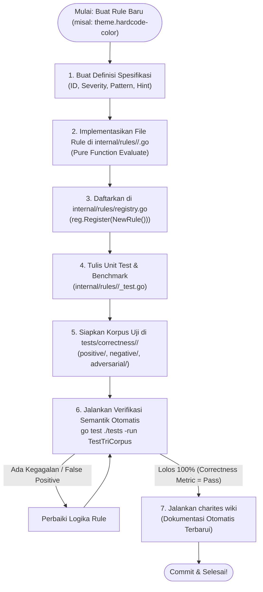

# 02-ARCHITECTURE: 08 - Repetitive Architecture Flow: Shared Components vs Rule-Specific Logic

> **Kode Dokumen:** `ARCH-08-EXPANSION`
> **Tahapan:** Fase 8 - Repetitive Pattern Flow Guide & Rule Authoring Template (Core Assessment)
> **Status:** Ready for Review
> **Standar Rujukan:** Micro-Kernel Plugin Architecture & Open-Closed Principle (OCP)

Dokumen ini mendefinisikan arsitektur penambahan rule secara berulang (*repetitive architecture flow*), menguraikan pemisahan mutlak antara **komponen bersama yang tidak boleh disentuh (*100% Shared Immutable Components*)** dengan **komponen spesifik rule yang perlu dibuat (*Rule-Specific Touchpoints*)**.

---

## 1. Pemetaan Arsitektur: Komponen Bersama vs Titik Sentuh Rule

Sesuai prinsip *Open-Closed Principle* (terbuka untuk ekstensi, tertutup untuk modifikasi), penambahan rule baru ke Charites **DILARANG KERAS** memodifikasi pipa inti compiler.

### 1.1. Matriks Komponen Bersama (100% Shared - Immutable / Nol Perubahan)

| Komponen | Status | Alasan Arsitektural |
| :--- | :---: | :--- |
| **`internal/config`** | **SHARED** | Parser `charites.yaml` bekerja otomatis dengan prinsip **Default: YES**. Rule baru otomatis aktif tanpa perlu mengubah parser konfigurasi. |
| **`internal/ir`** | **SHARED** | Kontrak data `*ir.Node`, `Diagnostic`, dan `Severity` sudah final dan mencakup seluruh struktur tag, atribut, class, dan span posisi. |
| **`internal/parser`** | **SHARED** | Parser Astro, TSX, dan Tailwind `@theme` mengekstrak representasi markup secara netral bahasa tanpa terikat rule spesifik. |
| **`internal/scanner`** | **SHARED** | Directory walker dan worker pool mendistribusikan berkas ke antrean tanpa memedulikan rule apa yang dievaluasi. |
| **`internal/analyzer`** | **SHARED** | Traversal engine menjalankan iterator Go 1.26 `root.Walk()` dan memanggil `Evaluate()` pada seluruh rule aktif dari registry secara generik. |
| **`internal/reporter`** | **SHARED** | Presenter ANSI terminal, JSON stream, dan Markdown merender objek `ir.Diagnostic` apa saja tanpa modifikasi kode. |
| **`internal/mcp`** | **SHARED** | Tool `charites_scan`, `charites_explain_rule`, dan `charites_list_rules` membaca katalog rule secara dinamis langsung dari registry. |
| **`internal/wiki`** | **SHARED** | Generator dokumentasi otomatis mengekstrak rule baru dari registry dan merendernya ke `wiki/*.md` saat `charites wiki` dieksekusi. |

### 1.2. Titik Sentuh Spesifik Rule (The 3 Touchpoints)

Untuk menambahkan rule baru (misal `theme.hardcode-color`), pengembang **HANYA** menyentuh 3 lokasi:
1. **`internal/rules/<domain>/<rule_slug>.go`** (*New File*): Mengimplementasikan interface `rules.Rule`.
2. **`internal/rules/registry.go`** (*1 Line Modification*): Mendaftarkan instance singleton rule ke in-memory map.
3. **`tests/correctness/<rule_id>/`** (*New Directory*): Menyediakan berkas uji Argus Tri-Corpus (`positive/`, `negative/`, `adversarial/`).

---

## 2. Diagram Alur Kerja Pengembang (Developer Authoring Flow)



---

## 3. Template Struktur Kode Baku Rule (`<rule_slug>.go`)

Setiap file rule baru di `internal/rules/<domain>/` wajib mengikuti pola struktur berikut:

```go
package theme

import (
    "github.com/will2469/charites/internal/ir"
    "github.com/will2469/charites/internal/rules"
)

type HardcodeColorRule struct{}

func NewHardcodeColorRule() rules.Rule {
    return &HardcodeColorRule{}
}

func (r *HardcodeColorRule) ID() string {
    return "theme.hardcode-color"
}

func (r *HardcodeColorRule) Description() string {
    return "Mendeteksi penggunaan kode warna mentah yang wajib diganti dengan token semantik dari global.css"
}

func (r *HardcodeColorRule) Category() string {
    return "theme"
}

func (r *HardcodeColorRule) DefaultSeverity() ir.Severity {
    return ir.SeverityWarn
}

func (r *HardcodeColorRule) Evaluate(node *ir.Node) []ir.Diagnostic {
    // Fast path: jika tidak ada class dan tidak ada atribut style, return nil (0 B/op)
    if len(node.Classes) == 0 && len(node.Attributes["style"]) == 0 {
        return nil
    }

    var diags []ir.Diagnostic

    // Logika evaluasi murni berbasis string scanning atau pattern matching...
    for _, class := range node.Classes {
        if isRawHexOrRGB(class) {
            diags = append(diags, ir.Diagnostic{
                File:     node.Span.File,
                Line:     node.Span.Line,
                Column:   node.Span.Column,
                Rule:     r.ID(),
                Category: r.Category(),
                Severity: r.DefaultSeverity(),
                Message:  "Hardcode color (" + class + ") - gunakan semantic token dari global.css",
                Hint:     "Ganti dengan token semantik dari global.css",
            })
        }
    }

    return diags
}
```
