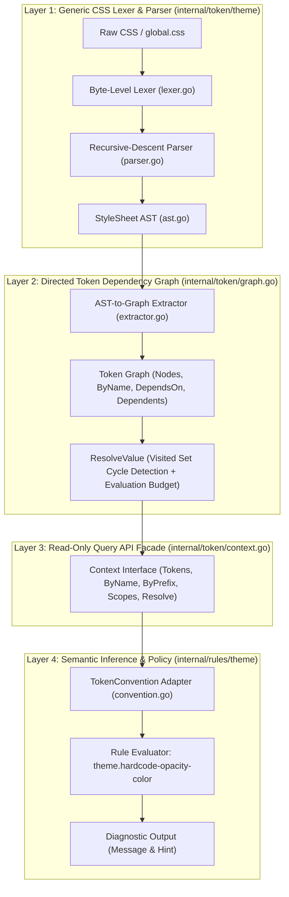

# 02-ARCHITECTURE: 09 - Design-Agnostic Token Subsystem & Dependency Graph

> **Kode Dokumen:** `ARCH-09-TOKEN`
> **Tahapan:** Fase 2/3 - SSOT Design Token Engine & Dependency Resolution
> **Peran Pilar:** ARCH = HOW (Rancangan Arsitektur, Graph Traversal, Boundary Isolation)
> **Status:** Active / Graduated
> **Standar Rujukan:** W3C Design Tokens Community Group (DTCG), CSS Cascading & Inheritance Level 5

Dokumen ini menjelaskan rancangan arsitektural subsistem **Design Token & Directed Token Dependency Graph** (`internal/token`) pada Charites. Subsistem ini memisahkan secara ketat antara **FAKTA** (ekstraksi properti CSS murni tanpa opini desain) dan **INFERENSI / POLISI** (evaluasi kepatuhan semantik pada layer rule).

---

## 1. Topologi Arsitektur 4-Layer

Arsitektur token Charites mengadopsi pemisahan 4-layer independen:



---

## 2. Invarian P0 Arsitektur (Zero Design Opinion)

Paket inti `internal/token` tunduk pada batasan normatif mutlak:

1. **Bebas Heuristik Warna/Skala:**
   - Dilarang keras memuat string: `primary`, `secondary`, `muted`, `light`, `subtle`, `destructive`, atau nama token spesifik desain sistem mana pun.
   - Dilarang keras mengkategorisasikan nilai secara prematur di Layer 2 (seperti fungsi tebak-tebakan `FindColorTokens()` atau `FindRadiusTokens()`).
   - Nilai disimpan dan di-resolve sebagai **fakta mentah** (*raw CSS string*). Klasifikasi tipe data (apakah sebuah nilai adalah warna, dimensi, waktu, dsb.) merupakan wewenang Layer 4.

2. **The Banana Test Invariant:**
   Parser dan Token Graph wajib memproses struktur token buatan pengguna tanpa perlu memahami arti namanya:
   ```css
   :root {
     --banana: #123456;
     --thing-that-is-definitely-not-primary: red;
     --super-special-design-token: var(--banana);
   }
   ```
   Ketiga token diekstrak sebagai node independen, relasi dependensi `--super-special-design-token -> --banana` terhubung, dan resolusi nilai `--super-special-design-token` menghasilkan `#123456` secara deterministik.

---

## 3. Layer 1: Generic CSS Lexer & Parser (`internal/token/theme`)

Layer 1 bertugas mem-parse stream byte CSS menjadi Abstract Syntax Tree (`StyleSheet`, `AtRule`, `StyleRule`, `Declaration`).

### 3.1. Verbatim Source Slicing
Untuk menghindari cacat spasi (*spacing glitches*) akibat penggabungan token sintetik (seperti `. card` alih-alih `.card`, atau `var (--banana)` alih-alih `var(--banana)`), parser menggunakan **pemotongan sumber verbatim**:
```go
func (p *Parser) sliceTokens(tokens []Token) string {
    if len(tokens) == 0 {
        return ""
    }
    start := tokens[0].StartOffset
    end := tokens[len(tokens)-1].EndOffset
    if start >= 0 && end <= len(p.src) && start <= end {
        return strings.TrimSpace(string(p.src[start:end]))
    }
    return tokensToString(tokens)
}
```
Setiap token mencatat `StartOffset` dan `EndOffset`, sehingga string selektor, at-rule prelude, dan nilai deklarasi 100% presisi sesuai kode sumber asli pengembang.

---

## 4. Layer 2: Directed Token Dependency Graph (`internal/token/graph.go`)

### 4.1. Bukan DAG: Graph Dapat Memiliki Siklus (*Cycle-Resilient*)
Token CSS dapat mengandung referensi sirkular akibat kesalahan manusia:
```css
:root {
  --a: var(--b);
  --b: var(--a);
}
```
Oleh karena itu, graph tidak diasumsikan sebagai DAG (*Directed Acyclic Graph*), melainkan **Directed Token Dependency Graph**.

### 4.2. Identitas Deklarasi Unik (`ID uint32`)
Sebuah token bernama sama dapat dideklarasikan berulang pada scope yang berbeda:
```css
:root { --brand: red; }
.card { --brand: blue; }
```
Untuk mencegah kehilangan identitas deklarasi, graph tidak menggunakan `map[string][]Token` sebagai model utama, melainkan daftar node beridentitas numerik:
```go
type ID uint32

type Token struct {
    ID         ID
    Name       string         // "--brand"
    RawValue   string         // "red" vs "blue"
    Scope      Scope          // Selektor, AtRules, Layers, Specificity
    Span       theme.SourceSpan
    References []string       // Nama-nama token lain yang direferensikan via var(--...)
}

type Graph struct {
    Nodes      []Token
    ByName     map[string][]ID
    DependsOn  map[ID][]ID
    Dependents map[ID][]ID
}
```

### 4.3. Deteksi Siklus vs Batas Evaluasi (Safety)
Pemisahan tegas antara **Kebenaran (*Correctness*)** dan **Keamanan DoS (*Safety Protection*)**:
- **Kebenaran (Cycle Detection):** Menggunakan `visited map[ID]bool` pada jalur penelusuran aktif. Jika token yang sedang dievaluasi dikunjungi kembali, sistem mengembalikan `ErrCycleDetected`.
- **Keamanan DoS (Evaluation Budget):** Menggunakan parameter `opts.MaxNodes` (default 1000). Jika rantai dependensi patologis melebihi batas, sistem mengembalikan `ErrEvaluationBudgetExceeded` secara deterministik tanpa crash atau goroutine leak.

---

## 5. Layer 3: Read-Only Query API Facade (`internal/token/context.go`)

Layer 3 membungkus graph menjadi antarmuka `Context` yang murni *read-only*:
```go
type Context interface {
    Path() string
    Tokens() []Token
    TokenByID(id ID) (Token, bool)
    ByName(name string) []Token
    ByPrefix(prefix string) []Token
    Scopes() []Scope
    Graph() *Graph
    Resolve(id ID, opts ResolveOptions) (string, bool, error)
    HasScopeProperty(property, value string) bool
}
```
Aturan (*rules*) di Layer 4 hanya berinteraksi melalui antarmuka ini, sehingga implementasi parser atau struktur internal graph dapat diubah di masa depan tanpa merusak satu pun aturan linting.

---

## 6. Layer 4: Semantic Inference & Convention Adapter (`internal/rules/theme`)

### 6.1. Pemisahan Fakta dan Inferensi
- **Fakta:** Proyek mendeklarasikan `--color-primary: #3b82f6` dan `--color-primary-light: #60a5fa`.
- **Inferensi:** Developer menulis `bg-primary/10`. Adapter konvensi memeriksa apakah proyek memiliki token `-light` resmi.
- **Kebijakan (Policy):** Jika token `-light` ada di graph, Charites menerbitkan diagnostik dengan hint penggantian. Jika tidak ada, Charites tidak berasumsi dan tidak menimbulkan *false positive*.

### 6.2. Antarmuka `TokenConvention`
```go
type TokenCandidate struct {
    Name     string
    RawValue string
}

type TokenConvention interface {
    FindOpacityReplacement(
        base string,
        opacity string,
        ctx token.Context,
    ) ([]TokenCandidate, bool)
}
```
Charites menyediakan `DefaultCharitesConvention` (`primary/10 -> primary-light`), namun arsitektur ini memungkinkan proyek eksternal mengimplementasikan konvensi kustom (`brand-main/10 -> brand-tint-low`) tanpa memodifikasi ekstraktor inti.

---

## 7. Matriks Pengujian & Verifikasi Empiris

| Tingkat Uji | File Sumber | Cakupan Skenario |
| :--- | :--- | :--- |
| **Unit Parser (Layer 1)** | `internal/token/theme/parser_test.go` | Quotes dengan semicolon, data URI, CSS nesting `&`, nested `@layer`/`@media`, Banana Test. |
| **Unit Graph (Layer 2-3)** | `internal/token/extractor_test.go` | Banana Test, deteksi siklus sirkular, multi-hop resolution, batas budget DoS, spesifisitas scope. |
| **Unit Rule (Layer 4)** | `internal/rules/theme/hardcode_opacity_color_test.go` | 30 boundary test cases, validasi token convention, dynamic context. |
| **E2E Integration** | `tests/token_integration_test.go` | Upward directory discovery, multi-scope `:root` vs `.dark`, deteksi loop sirkular, CLI scan JSON. |
| **Fuzz Testing** | `tests/fuzz/css_fuzz_test.go` | 14.500+ mutasi acak (unclosed quotes, malformed delimiters, null bytes, cyclic graphs). |
