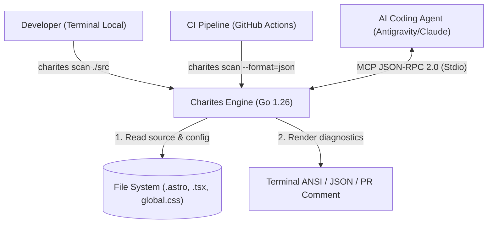
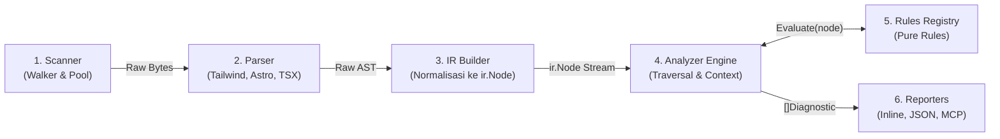
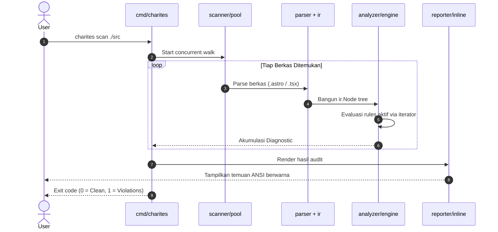

# 02-ARCHITECTURE: System Architecture Description

> **Dokumen Status:** Active / Draft
> **Standar Rujukan:** arc42 v8.2 (CC-BY-SA 4.0) & C4 Model
> **Domain:** Cetak Biru Rekayasa Mesin Static Analyzer Charites (Go 1.26)

Dokumen ini membedah rancangan arsitektur internal mesin **Charites** menggunakan kerangka kerja **arc42**.

---

## 1. Introduction & Goals

Charites dirancang untuk menggantikan eksekusi multi-script TypeScript legacy yang lambat dan berat menjadi satu binary native yang cepat, ringan, dan mandiri.

| Kualitas Arsitektur | Deskripsi & Target |
| :--- | :--- |
| **High Throughput** | Memanfaatkan goroutine worker pool untuk memproses ratusan file secara paralel dengan saturasi I/O optimal. |
| **Zero-Alloc Traversal** | Menggunakan fitur iterator modern Go 1.26 (`iter.Seq[*ir.Node]`) untuk traversal AST tanpa membuat slice penampung sementara. |
| **Modular Rule Engine** | Menjaga rule sebagai fungsi murni (*pure function*) yang terisolasi dari detail parsing berkas fisik. |
| **Multi-Interface Delivery** | Satu inti analisis melayani antarmuka CLI terminal ANSI, JSON stream, dan protokol MCP JSON-RPC 2.0. |

---

## 2. Architecture Constraints (Batasan Arsitektur)

1. **Bahasa & Runtime:** Go 1.26 murni.
2. **Portabilitas Binary (`CGO_ENABLED=0`):** Binary harus dapat dikompilasi silang (*cross-compile*) secara statis untuk target `linux/amd64`, `linux/arm64`, `darwin/arm64` (Apple Silicon), dan `windows/amd64` tanpa dependensi glibc / C runtime eksternal.
3. **Pemisahan Tanggung Jawab:** Rules tidak boleh melakukan pembacaan berkas disk secara mandiri. Semua berkas dibaca dan diparse oleh layer `scanner` dan `parser`.

---

## 3. Context & Scope (C4 Level 1: System Context)



---

## 4. Building Block View (C4 Level 3: Component Decomposition)

Arsitektur Charites mengadopsi model **Compiler Pipeline** klasik yang dibagi menjadi 6 subsistem independen:



### Rincian Sub-komponen:

1. **`internal/scanner`**:
   - `walker.go`: Membaca pohon direktori secara rekursif dengan filter cepat berbasis `.ignore`.
   - `pool.go`: Mengelola sejumlah $N$ goroutine worker (biasanya sejumlah `runtime.NumCPU()`).
2. **`internal/parser`**:
   - `tailwind/`: Mengekstrak daftar semantic token dari `@theme` di `global.css`.
   - `astro/`: Memisahkan blok frontmatter JS/TS (di antara pembatas `---`) dan blok template HTML/JSX.
   - `tsx/`: Mengekstrak tag elemen JSX, nama atribut, dan nilai ekspresi literal.
3. **`internal/ir` (Intermediate Representation)**:
   - Menghubungkan output parser yang heterogen menjadi struktur data terpadu `ir.Node`.
4. **`internal/analyzer`**:
   - Traversal engine yang mengiterasi seluruh `ir.Node` dan mendistribusikan node ke rules yang relevan.
   - Menampung seluruh temuan `Diagnostic` ke dalam `Context`.
5. **`internal/rules`**:
   - Registry modul rule. Berisi aturan logika murni (Rule #1: `hardcode_opacity_color.go` / `theme.hardcode-opacity-color`).
6. **`internal/reporter` & `internal/mcp`**:
   - Mengubah slice `[]Diagnostic` menjadi representasi teks berwarna ANSI terminal, JSON terstruktur, atau pesan respon MCP `tools/call`.

---

## 5. Data Contract (Single Source of Truth)

### 5.1. Kontrak Node IR (`internal/ir/node.go`)
```go
package ir

type NodeType uint8

const (
    NodeElement NodeType = iota
    NodeAttribute
    NodeText
)

type Node struct {
    Type       NodeType
    Tag        string            // contoh: "div", "button", "Card"
    Attributes map[string]string // contoh: {"class": "bg-[#123] p-4", "id": "btn"}
    Classes    []string          // token class siap audit: ["bg-[#123]", "p-4"]
    Line       int               // posisi baris (1-indexed)
    Column     int               // posisi kolom (1-indexed)
    Children   []*Node
    Parent     *Node
}
```

### 5.2. Kontrak Diagnostic (`internal/ir/diagnostic.go`)
```go
package ir

type Severity string

const (
    SeverityError Severity = "error"
    SeverityWarn  Severity = "warn"
    SeverityInfo  Severity = "info"
)

type Diagnostic struct {
    File     string   `json:"file"`
    Line     int      `json:"line"`
    Column   int      `json:"column"`
    Rule     string   `json:"rule"`
    Severity Severity `json:"severity"`
    Message  string   `json:"message"`
    Hint     string   `json:"hint,omitempty"`
}
```

---

## 6. Runtime View (Execution Flow)

### Sequence: CLI Scan Execution (`charites scan ./src`)



### 6.2. Mekanisme Dispatcher CLI & Filter Routing

Subcommand `charites scan` (beserta alias `check` dan `run`) mendukung arsitektur pemindaian bertingkat:
1. **Auto-Detection (Default):** Walker secara otomatis memetakan berkas `.astro` ke Astro parser, `.tsx`/`.jsx` ke TSX parser, dan membaca `global.css` dalam satu kali jalan paralel.
2. **Direct File Targeting (A):** Jika path yang diberikan adalah berkas tunggal (contoh: `charites scan src/pages/index.astro`), scanner langsung memproses berkas tersebut tanpa full directory traversal.
3. **Extension Filtering (B):** Flag `--ext` menyaring ekstensi berkas sebelum antrean worker pool diisi.
4. **Category & Rule Filtering (C & D):** Flag `--category` dan `--rule` memfilter daftar `[]Rule` yang aktif di registry sebelum traversal IR berjalan.
5. **Alias Normalization (E):** Dispatcher CLI di `internal/cli/root.go` memetakan alias `check` dan `run` ke handler controller `scan`.

---

## 7. Cross-Cutting Concepts

1. **Go 1.26 Range-Over-Func Iterators:**
   Traversal pohon IR diimplementasikan dengan pola iterator:
   ```go
   func (n *Node) Walk() iter.Seq[*Node] {
       return func(yield func(*Node) bool) {
           var traverse func(*Node) bool
           traverse = func(cur *Node) bool {
               if !yield(cur) { return false }
               for _, child := range cur.Children {
                   if !traverse(child) { return false }
               }
               return true
           }
           traverse(n)
       }
   }
   ```
   Pola ini memastikan traversal tree tidak memerlukan alokasi slice sementara (zero heap allocation).

2. **Memory Recycling via `sync.Pool`:**
   Buffer token, slice string, dan struktur analyzer context didaur ulang menggunakan `sync.Pool` untuk meminimalkan beban Garbage Collector (GC) saat memindai ribuan berkas.

---

## 8. Architectural Decision Records (ADR Index)

Keputusan teknis mendalam didokumentasikan di folder [`adr/`](adr/):
- **ADR-001:** Pemilihan Strategi Parser AST (Zero-CGO vs FFI).
- **ADR-002:** Desain Unified IR untuk Normalisasi Astro & TSX.
- **ADR-003:** Penggunaan Go 1.26 Iterators untuk Zero-Alloc AST Traversal.
