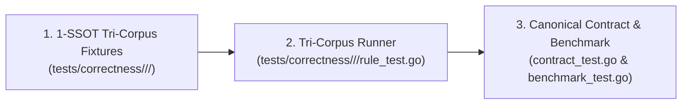

# 03-TESTING: 08 - Standardized Rule Verification & Tri-Corpus Authoring Protocol

> **Kode Dokumen:** `TEST-08-EXPANSION`
> **Tahapan:** Fase 8 - Repetitive Pattern Flow Guide & Rule Authoring Template (Core Assessment)
> **Peran Pilar:** TEST = PROOF (Harness Pengujian, Matriks Semantik Ekspektasi & Tri-Corpus)
> **Status:** Ready for Review
> **Standar Rujukan:** Semantic Verification Matrix & Tri-Corpus Correctness Protocol

Dokumen ini mendefinisikan protokol pengujian terstandarisasi yang **WAJIB** dipenuhi saat menambahkan rule baru ke repositori Charites, menggantikan asersi longgar dengan **Matriks Semantik Ekspektasi Kasus-per-Kasus**.

---

## 1. Protokol Verifikasi Semantik Ekspektasi (Case-by-Case Matrix)

Metrik kelulusan rule baru tidak boleh hanya mengandalkan kondisi `PositiveViolations > 0`. Setiap rule wajib menyertakan tabel ekspektasi kasus:

```text
tests/correctness/<category>.<slug>/
├── positive/          # File-file pelanggaran nyata (POS-001, POS-002, ...)
├── negative/          # File-file kode sah (NEG-001, NEG-002, ...)
├── adversarial/       # File-file jebakan sintaks & ignore (ADV-001, ADV-002, ...)
└── matrix.json        # Deklarasi ekspektasi presisi per kasus
```

### Format Deklarasi Matriks Ekspektasi (`matrix.json`):
```json
[
  {
    "case_id": "POS-001",
    "file": "positive/hex_classes.tsx",
    "expected_violations": [
      { "line": 5, "column": 12, "rule": "theme.hardcode-color", "hint_contains": "bg-primary" }
    ]
  },
  {
    "case_id": "NEG-001",
    "file": "negative/semantic_tokens.astro",
    "expected_violations": []
  },
  {
    "case_id": "ADV-001",
    "file": "adversarial/anchor_hash.astro",
    "expected_violations": []
  }
]
```

### Syarat Kelulusan Semantik Mutlak:
$$\text{Actual Findings} \equiv \text{Expected Findings}$$
1. Jika terdapat temuan pada kasus `NEG-*` $\rightarrow$ **FAIL (False Positive)**.
2. Jika terdapat temuan pada kasus `ADV-*` $\rightarrow$ **FAIL (Bait Vulnerability)**.
3. Jika temuan pada kasus `POS-*` tidak persis sama dengan ekspektasi baris/kolom $\rightarrow$ **FAIL (False Negative / Mislocation)**.

---

## 2. Alur Pengujian 3 Langkah untuk Rule Baru (1-SSOT Architecture)

> [!CRITICAL]
> **Larangan Keras Monolith `rules_test.go` & Duplikasi Mocks:**
> Pengujian fungsionalitas rule **DILARANG** dilakukan melalui berkas unit test monolitik sintetis (`rules_test.go` atau `*_test.go` masif di dalam `internal/rules/<category>/`).
> Praktik tersebut melahirkan ribuan baris boilerplate AST tiruan (`&ir.Node{...}`) yang terlepas dari parser nyata dan rentan terhadap *drift* semantik.
>
> Seluruh pengujian semantik rule berpusat secara tunggal pada **1-SSOT Tri-Corpus** di `tests/correctness/<category>/<slug>/` menggunakan berkas Astro dan TSX asli yang diproses parser resmi. Direktori `internal/rules/<category>/` hanya memiliki `contract_test.go` (verifikasi metadata & 8-Pillars) dan `benchmark_test.go` (verifikasi alokasi memori nol).



### Langkah 1: Penyusunan Berkas 1-SSOT Tri-Corpus
Membuat berkas `.astro` dan `.tsx` nyata di dalam `tests/correctness/<category>/<slug>/`:
- `positive/`: Berkas dengan pelanggaran nyata sesuai target invarian.
- `negative/`: Berkas kode bersih dan legal (*zero-noise invariant*).
- `adversarial/`: Berkas jebakan sintaks, dynamic classes, and edge cases.

### Langkah 2: Eksekusi Otomatis Runner Tri-Corpus
Runner terisolasi per-rule di `tests/correctness/<category>/<slug>/rule_test.go` mengevaluasi berkas korpus:
```bash
go test -v ./tests/correctness/<category>/<slug>/...
```
Dan diverifikasi secara global di level repositori:
```bash
go test -v ./tests -run TestGoldenCorpus_AdoptionMatrix
go test -v ./tests -run TestCorrectnessGate
```

### Langkah 3: Verifikasi Kontrak Kanonikal & Benchmark Nol Alokasi (`QUAL-03`)
1. **Canonical Contract (`internal/rules/<category>/contract_test.go`):** Memastikan Semgrep Canonical ID (`<category>.<slug>`), non-empty description, severity, kelengkapan 8-Pillars Doc, serta fail-safe nil/empty node invariant.
2. **Zero Allocation Benchmark (`internal/rules/<category>/benchmark_test.go`):** Memastikan `0 B/op` dan `0 allocs/op` pada fast-path node legal:
```go
func BenchmarkA11yRules_ZeroAllocClean(b *testing.B) { ... }
```
Target desain mutlak: `0 B/op` dan `0 allocs/op` pada fast-path node legal.

