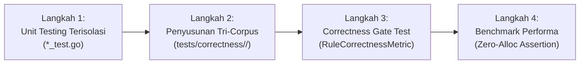

# 03-TESTING: 08 - Standardized Rule Verification & Tri-Corpus Authoring Protocol

> **Kode Dokumen:** `TEST-08-EXPANSION`
> **Tahapan:** Fase 8 - Repetitive Pattern Flow Guide & Rule Authoring Template (Core Assessment)
> **Status:** Ready for Review
> **Standar Rujukan:** Argus Tri-Corpus Protocol & Automated Semantic Verification

Dokumen ini mendefinisikan protokol pengujian terstandarisasi yang **WAJIB** diikuti oleh setiap kontributor saat menambahkan rule baru ke dalam repositori Charites.

---

## 1. Protokol Pengujian 4 Langkah untuk Rule Baru

Untuk menjamin setiap rule baru memiliki tingkat akurasi tinggi dan bebas dari *false positive fatigue*:



### Langkah 1: Table-Driven Unit Testing (`internal/rules/<domain>/<rule>_test.go`)
- Uji coba fungsi murni `rule.Evaluate(node)` dengan beragam variasi input node AST secara langsung di memori.
- Memverifikasi pesan kesalahan, teks rekomendasi (*hint*), dan baris posisi span.

### Langkah 2: Penyusunan Sub-Korpus Argus Tri-Corpus (`tests/correctness/<rule_id>/`)
Kontributor wajib membuat 3 subdirektori dengan konten berkas `.astro` dan `.tsx` nyata:
1. **`positive/`**: Minimal 2 berkas uji yang memuat pelanggaran murni.
2. **`negative/`**: Minimal 2 berkas uji kode sah yang menggunakan token semantik/best practice resmi.
3. **`adversarial/`**: Minimal 3 skenario jebakan (*false positive bait*):
   - Karakter mirip tapi sah (misal `#anchor` pada atribut link saat menguji hex color).
   - Template literals JavaScript dinamis.
   - Pengecualian inline ignore: `// charites:ignore <rule_id>`.

### Langkah 3: Eksekusi Otomatis Correctness Gate Test
Jalankan test harness otomatis yang mengevaluasi ketiga sub-korpus:
```bash
go test -v ./tests -run TestTriCorpus_AllRules
```
**Kriteria Kelulusan Mutlak (`RuleCorrectnessMetric`):**
```text
Pass = (PositiveViolations > 0) && (NegativeViolations == 0) && (AdversarialViolations == 0)
```
- Jika `NegativeViolations > 0` $\rightarrow$ Terjadi **False Positive** (DITOLAK).
- If `AdversarialViolations > 0` $\rightarrow$ Engine termakan jebakan sintaks (DITOLAK).

### Langkah 4: Pengukuran Benchmark Memori & Latensi
Tulis pengujian benchmark per-node:
```go
func BenchmarkEvaluate_CleanNode(b *testing.B) {
    rule := NewHardcodeColorRule()
    node := &ir.Node{Tag: "div", Classes: []string{"flex", "p-4", "bg-primary"}}
    b.ResetTimer()
    b.ReportAllocs()
    for i := 0; i < b.N; i++ {
        _ = rule.Evaluate(node)
    }
}
```
**Syarat Kelulusan:** Wajib membuktikan alokasi **`0 B/op`** dan **`0 allocs/op`** pada node legal tanpa pelanggaran.

---

## 2. Matriks Pengujian Studi Kasus: `theme.hardcode-color`

| Sub-Korpus | Nama Berkas Fixture | Isi Skenario Kode | Ekspektasi Temuan |
| :--- | :--- | :--- | :---: |
| **Positive** | `hex_classes.tsx` | `<div className="bg-[#2563eb] text-[#000]" />` | $\ge 2$ temuan |
| **Positive** | `inline_styles.astro`| `<div style="background-color: #ffffff;">` | $\ge 1$ temuan |
| **Negative** | `semantic_tokens.astro`| `<div class="bg-primary text-muted border-border">` | **0 temuan** |
| **Negative** | `layout_classes.tsx` | `<div className="p-4 flex flex-col gap-4">` | **0 temuan** |
| **Adversarial**| `anchor_hash.astro` | `<a href="#section-hero">Link Anchor</a>` | **0 temuan** |
| **Adversarial**| `inline_ignore.tsx` | `// charites:ignore theme.hardcode-color`<br>`<div className="text-[#333]" />` | **0 temuan** |
