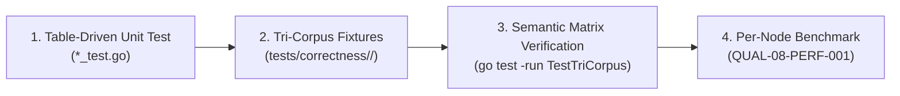

# 03-TESTING: 08 - Standardized Rule Verification & Tri-Corpus Authoring Protocol

> **Kode Dokumen:** `TEST-08-EXPANSION`
> **Tahapan:** Fase 8 - Repetitive Pattern Flow Guide & Rule Authoring Template (Core Assessment)
> **Peran Pilar:** TEST = PROOF (Harness Pengujian, Matriks Semantik Ekspektasi & Tri-Corpus)
> **Status:** Ready for Review
> **Standar Rujukan:** Semantic Verification Matrix & Tri-Corpus Correctness Protocol

Dokumen ini mendefinisikan protokol pengujian terstandarisasi yang **WAJIB** dipenuhi saat menambahkan rule baru ke repositori Charites, menggantikan asersi longgar dengan **Matriks Semantik Ekspektasi Kasus-per-Kasus**.

---

## 1. Protokol Verifikasi Semantik Ekspektasi (Case-by-Case Matrix)

Metrik kelulusan rule baru tidak boleh hanya mengandalkan kondisi `PositiveViolations > 0`. Setiap rule wajib menyertakan tabel ekspektasi kasus:

```text
tests/correctness/<category>.<slug>/
├── positive/          # File-file pelanggaran nyata (POS-001, POS-002, ...)
├── negative/          # File-file kode sah (NEG-001, NEG-002, ...)
├── adversarial/       # File-file jebakan sintaks & ignore (ADV-001, ADV-002, ...)
└── matrix.json        # Deklarasi ekspektasi presisi per kasus
```

### Format Deklarasi Matriks Ekspektasi (`matrix.json`):
```json
[
  {
    "case_id": "POS-001",
    "file": "positive/hex_classes.tsx",
    "expected_violations": [
      { "line": 5, "column": 12, "rule": "theme.hardcode-color", "hint_contains": "bg-primary" }
    ]
  },
  {
    "case_id": "NEG-001",
    "file": "negative/semantic_tokens.astro",
    "expected_violations": []
  },
  {
    "case_id": "ADV-001",
    "file": "adversarial/anchor_hash.astro",
    "expected_violations": []
  }
]
```

### Syarat Kelulusan Semantik Mutlak:
$$\text{Actual Findings} \equiv \text{Expected Findings}$$
1. Jika terdapat temuan pada kasus `NEG-*` $\rightarrow$ **FAIL (False Positive)**.
2. Jika terdapat temuan pada kasus `ADV-*` $\rightarrow$ **FAIL (Bait Vulnerability)**.
3. Jika temuan pada kasus `POS-*` tidak persis sama dengan ekspektasi baris/kolom $\rightarrow$ **FAIL (False Negative / Mislocation)**.

---

## 2. Alur Pengujian 4 Langkah untuk Rule Baru



### Langkah 1: Table-Driven Unit Testing (`internal/rules/<domain>/<rule>_test.go`)
Menguji fungsi murni `rule.Evaluate(node)` pada node-node AST in-memory.

### Langkah 2: Penyusunan Berkas Tri-Corpus
Membuat berkas `.astro` dan `.tsx` nyata yang merepresentasikan skenario dunia nyata.

### Langkah 3: Eksekusi Otomatis Runner Tri-Corpus
Runner memvalidasi setiap kasus terhadap deklarasi `matrix.json`:
```bash
go test -v ./tests -run TestTriCorpus_AllRules
```

### Langkah 4: Pengukuran Benchmark Memori & Latensi (`QUAL-08-PERF-001`)
Memastikan fungsi `Evaluate()` tidak memicu alokasi heap saat mengevaluasi node legal:
```go
func BenchmarkEvaluate_CleanNode(b *testing.B) {
    rule := NewHardcodeColorRule()
    node := &ir.Node{Tag: "div", Classes: []string{"flex", "p-4", "bg-primary"}}
    b.ResetTimer()
    b.ReportAllocs()
    for i := 0; i < b.N; i++ {
        _ = rule.Evaluate(node)
    }
}
```
Target desain: `0 B/op` dan `0 allocs/op` pada fast-path node legal.
