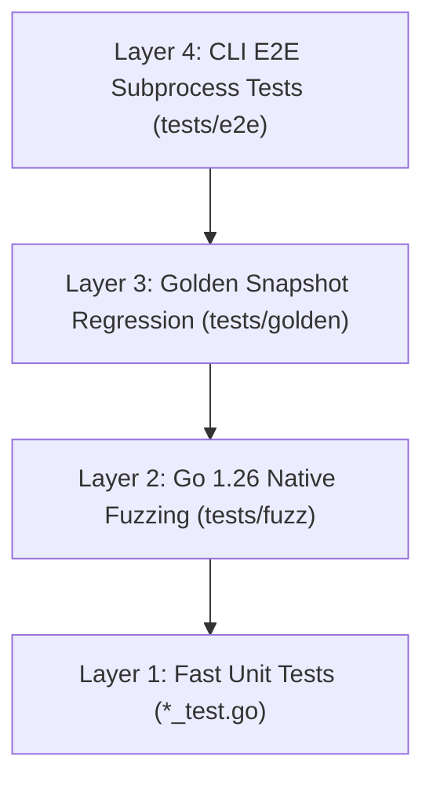

# 03-TESTING: Test Strategy & Verification Plan

> **Dokumen Status:** Active / Draft
> **Standar Rujukan:** Modern Testing Principles & Golden File Testing Specification
> **Domain:** Strategi Pengujian Otomatis, Snapshot Regression, & Fuzzing Charites

Dokumen ini mendefinisikan strategi dan standar pengujian menyeluruh untuk memastikan mesin **Charites** berfungsi dengan benar, berperforma tinggi, dan bebas dari regresi.

---

## 1. Filosofi Pengujian

Charites mengadopsi prinsip **Automated Deterministic Verification**:
1. **Zero Flaky Tests:** Seluruh test suite harus berjalan deterministik dan tidak bergantung pada kondisi jaringan, waktu sistem, atau urutan eksekusi goroutine.
2. **Snapshot-Driven Truth (Golden Files):** Validasi diagnosis rule dan AST mengandalkan berkas *golden snapshot* teruji. Setiap perubahan output diagnosis harus disengaja dan tercatat dalam git diff berkas snapshot.
3. **Fuzzing against Chaos:** Frontend code di dunia nyata penuh dengan sintaks kompleks, template dinamis, dan malformed HTML. Mesin parser Charites wajib diuji ketahanannya dengan native fuzzing agar **tidak pernah mengalami panic**.
4. **No Happy-Path Bias (Adversarial Testing):** Pengujian dilarang keras hanya menguji skenario ideal (*happy path*). Test suite harus memuat kode yang sengaja dirancang salah, edge-cases ekstrem, dan sintaks JSX ambigu. Dilarang mengakali kode linter demi tampilan hijau semu di CI. Jika suatu berkas merupakan eksepsi sah, eksepsi tersebut harus diverifikasi melalui engine **Ignore Pattern resmi** (`.ignore` / `.charites.yaml`), bukan dengan melemahkan invarian rule.

---

## 2. Piramida & Layer Pengujian



### Layer 1: Unit Tests (`*_test.go`)
- **Fokus:** Menguji fungsi-fungsi murni secara terisolasi.
- **Cakupan:**
  - Parser regex Tailwind v4: pemisahan arbitrary values, opacity values, dan semantic tokens.
  - Astro parser: pemisahan tepat blok frontmatter `---` vs template HTML.
  - TSX parser: ekstraksi atribut `class` / `className` baik format string literal maupun template expression.
  - Ignorer: pencocokan pola glob `.ignore` / `.gitignore`.
- **Target Kecepatan:** Seluruh unit test harus selesai dalam < 1 detik.

### Layer 2: Go 1.26 Native Fuzzing (`tests/fuzz/`)
- **Fokus:** Menguji parser dan IR builder terhadap jutaan mutasi string acak.
- **Implementasi:**
  ```go
  func FuzzAstroParser(f *testing.F) {
      // Seed corpus
      f.Add([]byte("---\nconst a = 1;\n---\n<div class=\"p-4\">Hello</div>"))
      f.Fuzz(func(t *testing.T, data []byte) {
          _, _ = astro.Parse(data) // MUST NOT PANIC
      })
  }
  ```
- **Kriteria Lolos:** Tidak ada *crash*, *unhandled panic*, atau *infinite loop* saat memproses input cacat.

### Layer 3: Tri-Corpus Correctness & Golden Snapshots (`tests/correctness/` & `tests/golden/`)
- **Fokus:** Menjamin akurasi diagnosis rule, ketahanan terhadap false positive, dan stabilitas output laporan.
- **Model Tri-Corpus Argus (Zero-Noise & Adversarial Soundness):**
  Setiap rule dalam Charites wajib memiliki 3 sub-korpus uji coba terpisah:
  1. **Positive Corpus (`tests/correctness/<rule_id>/positive/`):** Berkas yang sengaja memuat pelanggaran murni. Engine **wajib** mendeteksi pelanggaran (`PositiveCount > 0`).
  2. **Negative Corpus (`tests/correctness/<rule_id>/negative/`):** Berkas valid yang mengikuti panduan desain. Engine **wajib** menghasilkan 0 peringatan (`NegativeCount == 0`, *Zero-Noise Invariant*). Terjadinya deteksi di sini adalah **False Positive**.
  3. **Adversarial Corpus (`tests/correctness/<rule_id>/adversarial/`):** Berkas dengan sintaks ekstrem, interpolasi string template JSX/Astro dinamis, arbitrary Tailwind values bertingkat, atau teknik penulisan ambigu. Engine **wajib** lolos evaluasi ketahanan sintaks dan mendeteksi vektor pelanggaran terselubung (`AdversarialCount > 0`).
### Layer 4: CLI E2E Subprocess Tests (`tests/e2e/`)
- **Fokus:** Menguji interaksi command line dari sudut pandang pengguna akhir.
- **Cakupan:**
  - Eksekusi binary `./charites scan <path> --format=json`.
  - Verifikasi exit code:
    - Exit code `0` saat memindai direktori bersih (zero issues).
    - Exit code `1` saat memindai direktori yang memuat pelanggaran rule.
    - Exit code `2` saat path direktori tidak ditemukan atau konfigurasi parsing gagal.
  - Verifikasi pewarnaan ANSI pada mode default terminal dan output stream redirection.

---

## 3. Struktur Berkas Pengujian

```text
tests/
├── correctness/                   # Argus-style Tri-Corpus Semantic Verification
│   └── theme.hardcode-opacity-color/
│       ├── positive/              # Kode melanggar (contoh: bg-primary/10, text-destructive/20)
│       ├── negative/              # Kode valid (contoh: bg-primary-light, text-destructive-light)
│       └── adversarial/           # False-positive bait (dynamic className, non-color slash w-1/2)
├── golden/                        # Golden regression snapshots (JSON & ANSI CLI output)
│   ├── theme.hardcode-opacity-color.positive.golden.json
│   └── theme.hardcode-opacity-color.adversarial.golden.json
├── fixtures/                      # Mock global.css, tailwind.config, & .charitesignore
│   ├── global.css
│   └── .charitesignore
├── integration/
│   └── pipeline_test.go           # Scanner -> Parser -> Analyzer -> Reporter pipeline test
├── fuzz/
│   ├── astro_fuzz_test.go         # Go 1.26 native parser fuzzing
│   └── tsx_fuzz_test.go
└── e2e/
    └── cli_test.go                # Subprocess exec & exit code assertion
```

---

## 4. Benchmark & Profiling Performa

Sebelum merge fitur baru atau rule baru, wajib dilakukan pengukuran benchmark alokasi memori:

```bash
# Menjalankan benchmark throughput dan alokasi heap
go test -bench=. -benchmem ./internal/...
```

**Kriteria Penerimaan Performa (Performance Gate):**
1. **Zero Heap Allocations on Traversal:** Iterator `ir.Node.Walk()` wajib `0 B/op` dan `0 allocs/op`.
2. **Scan Throughput:** Mampu memproses minimal **10.000 lines of code per detik** per core CPU.

---

## 5. Definition of Done (DoD) Pengujian

Setiap Pull Request (PR) atau penambahan rule baru hanya boleh di-merge jika:
- [ ] Seluruh unit test lulus 100% (`go test -v ./...`).
- [ ] **Tri-Corpus Correctness Gate (Argus Standard)** lulus 100%:
  - `PositiveCount > 0` (Semua pelanggaran terdeteksi).
  - `NegativeCount == 0` (Zero False Positive / Invarian Noise Nol).
  - `AdversarialCount > 0` (Vektor sintaks rumit & jebakan false positive tertangkap/aman).
- [ ] Golden snapshot tests cocok dan tidak ada unintended drift.
- [ ] Fuzz test berjalan minimal 30 detik tanpa menemukan crash.
- [ ] Code coverage minimum 80% pada package `internal/parser/` dan `internal/analyzer/`.
- [ ] Subprocess CLI test memvalidasi exit code `0`, `1`, dan `2` dengan benar.
