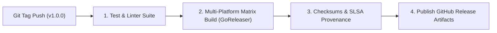

# 05-RELEASE: Configuration, Delivery & Supply Chain Plan

> **Dokumen Status:** Active / Draft
> **Standar Rujukan:** Semantic Versioning 2.0.0, Conventional Commits 1.0.0, OpenSSF SLSA
> **Domain:** Manajemen Rilis, Strategi Branching Git, Pipeline CI/CD, & Distribusi Binary

Dokumen ini menetapkan aturan baku pengelolaan versi, otomatisasi rilis, dan distribusi binary mandiri **Charites** ke berbagai platform sistem operasi.

---

## 1. Strategi Branching Git (Trunk-Based Development)

Charites mengadopsi model **Trunk-Based Development** dengan alur kerja Pull Request berbasis GitHub:
1. **Branch `main` sebagai SSOT:**
   - Branch `main` selalu berada dalam kondisi siap rilis (*always deployable*).
   - Seluruh perubahan kode masuk ke `main` melalui Pull Request (PR) yang telah lolos quality gate dan disetujui maintainer.
2. **Short-Lived Feature Branches:**
   - Nama branch fitur menggunakan format: `feat/<nama-fitur>`, `fix/<nama-bug>`, `chore/<nama-tugas>`.
   - Umur branch dianjurkan pendek (< 2 hari) untuk menghindari konflik merge besar.
3. **Release Tagging:**
   - Rilis resmi ditandai dengan Git tag beranotasi: `vX.Y.Z` (contoh: `v1.0.0`).

---

## 2. Kebijakan Semantic Versioning 2.0.0 (SemVer)

Penomoran versi mengikuti formula `MAJOR.MINOR.PATCH`:

| Kenaikan Versi | Pemicu (Trigger) | Contoh Skenario di Charites |
| :--- | :--- | :--- |
| **MAJOR (vX.0.0)** | Perubahan tidak kompatibel ke belakang (*breaking changes*). | Mengubah format output default JSON, menghapus/mengganti nama flag CLI penting, atau mengubah ID rule secara drastis. |
| **MINOR (v0.X.0)** | Penambahan fitur baru yang kompatibel ke belakang. | Menambahkan rule audit baru, menambahkan subcommand CLI baru (`charites mcp`), atau menambah opsi format reporter. |
| **PATCH (v0.0.X)** | Perbaikan bug yang kompatibel ke belakang. | Memperbaiki parsing edge-case Astro/TSX, memperbaiki false positive pada rule, atau optimasi alokasi memori. |

---

## 3. Standar Commit Messages (Conventional Commits)

Format pesan commit wajib mengikuti spesifikasi:
```text
<type>(<scope>): <short summary>

[optional body]

[optional footer(s)]
```
- **Tipe Utama:**
  - `feat`: Menambahkan fungsionalitas baru (menaikkan MINOR).
  - `fix`: Memperbaiki bug (menaikkan PATCH).
  - `perf`: Optimasi performa / alokasi memori.
  - `refactor`: Restrukturisasi kode tanpa mengubah fungsionalitas.
  - `docs`: Pembaruan dokumentasi.
  - `test`: Penambahan fixture atau test case baru.
- **Breaking Changes:** Wajib menyertakan tanda seru `!` setelah type/scope atau menyertakan footer `BREAKING CHANGE: <penjelasan>`.

---

## 4. Pipeline Otomatisasi CI/CD (GitHub Actions)

Setiap pembuatan tag rilis `v*` akan memicu workflow `.github/workflows/release.yml`:



### Matriks Target Kompilasi Silang (Cross-Compilation Matrix):
Binary dikompilasi secara statis (`CGO_ENABLED=0`) untuk:
- `linux-amd64` (Server & workstation Linux x86_64)
- `linux-arm64` (Server Linux ARM / Raspberry Pi)
- `darwin-amd64` (macOS Intel)
- `darwin-arm64` (macOS Apple Silicon M1/M2/M3/M4)
- `windows-amd64` (Windows 64-bit `.exe`)

Setiap arsip rilis (`.tar.gz` dan `.zip`) disertai dengan berkas ringkasan hash kriptografis `checksums.txt` (SHA-256) untuk verifikasi integritas rantai pasok software (OpenSSF SLSA Level 2).

---

## 5. Manajemen Changelogs & Release Notes

Charites mengadopsi pendekatan dua lapis (*two-tier changelog strategy*):

1. **Berkas Ringkasan Global (`CHANGELOG.md` di Root Repo):**
   - Mengikuti panduan [Keep a Changelog](https://keepachangelog.com/).
   - Berisi daftar singkat perubahan per versi dengan kategori: *Added*, *Changed*, *Deprecated*, *Removed*, *Fixed*, *Security*.
2. **Katalog Release Notes Modular (`docs/05-release/changelogs/`):**
   - Setiap rilis major/minor memiliki berkas dokumentasi mendalam tersendiri, misalnya:
     - [`changelogs/v1.0.0.md`](changelogs/v1.0.0.md)
   - Berisi:
     - Sorotan fitur utama (*Highlights*).
     - Panduan migrasi (*Migration Guide*).
     - Matriks benchmark performa versi tersebut vs versi sebelumnya.
     - Tautan download binary beserta SHA256 checksums.

---

## 6. Distribusi & Script Instalasi Mandiri

Untuk memudahkan pengembang dan pipeline CI, Charites menyediakan installer satu baris:

### Linux & macOS (Bash)
```bash
curl -fsSL https://raw.githubusercontent.com/will2469/charites/main/scripts/install.sh | bash
```
*Script ini otomatis mendeteksi OS dan arsitektur CPU, mengunduh binary terkompilasi dari GitHub Releases, memvalidasi SHA256, dan meletakkannya di `$HOME/.local/bin` atau `/usr/local/bin`.*

### Windows (PowerShell)
```powershell
irm https://raw.githubusercontent.com/will2469/charites/main/scripts/install.ps1 | iex
```

### Fitur Self-Update Binary
Binary Charites menyertakan command pembaruan mandiri:
```bash
charites update
```
Perintah ini memeriksa rilis terbaru di GitHub API, membandingkan hash binary aktif, dan mengganti binary lama secara atomik (*in-place atomic binary replace*).

---

## 7. Prosedur Rollback Darurat (Hotfix)

Jika versi rilis yang dipublikasikan mengandung bug fatal yang meloloskan false-positive massal:
1. Segera buat branch `fix/hotfix-<issue>` dari tag rilis yang bermasalah.
2. Terapkan patch minimal, jalankan seluruh test suite golden.
3. Rilis versi PATCH baru (misal: `v1.0.1`) dalam waktu < 2 jam.
4. Jangan pernah menghapus atau me-reuse tag rilis yang sudah pernah dipublikasikan.

---

## 8. Target Kesiapan Rilis v1.0.0 (Production Release Gate)

Rilis publik pertama (**v1.0.0**) menandai kesiapan produksi Charites dengan cakupan audit frontend lengkap:

- [ ] **A11y Audit Rules:** Deteksi label form tanpa `htmlFor`, tombol/icon tanpa *accessible name*, dan kelengkapan atribut kontrol formulir.
- [ ] **Design System & Theme Rules:** Penegakan semantic design tokens dari `@theme` CSS, deteksi *arbitrary hex/rgb classes*, pencegahan raw palette, dan normalisasi opacity token.
- [ ] **Core Web Vitals Rules:** Penegakan atribut prioritas gambar LCP (`fetchpriority="high"` / `loading="eager"`), dimensi eksplisit gambar untuk mitigasi CLS (`width` & `height`), dan audit handler berat untuk INP.
- [ ] **React Hooks & SEO Rules:** Audit dependensi hook React (`useEffect`, `useMemo`), aturan hooks, serta kelengkapan meta tag SEO (canonical URL & meta description).
- [ ] **High-Performance Native CLI:** Eksekusi binary tunggal mandiri tanpa ketergantungan runtime eksternal, pemindaian paralel multi-core, serta pelaporan format ANSI dan JSON.
