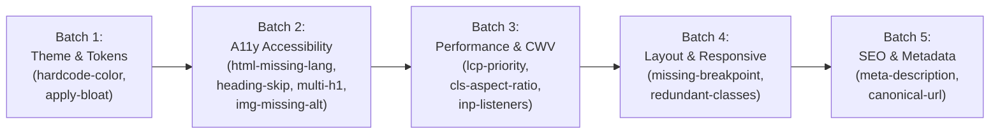

# 06-ROADMAP: 08 - Phase 8 Milestone, Rule Authoring Checklist & Expansion Phasing

> **Kode Dokumen:** `ROAD-08-EXPANSION`
> **Tahapan:** Fase 8 - Repetitive Pattern Flow Guide & Rule Authoring Template (Core Assessment)
> **Status:** Ready for Review

Dokumen ini menetapkan *checklist* baku pengerjaan rule baru (*Standard Rule Authoring Checklist*), urutan tahapan ekspansi aturan (*batch expansion roadmap*), serta kriteria penutupan dokumentasi perencanaan sebelum memulai penulisan kode Go dari Fase 0.

---

## 1. Standar Checklist Pengerjaan Rule Baru (The Standard Checklist)

Setiap pengembang atau kontributor yang menambahkan rule baru ke repositori Charites wajib menyelesaikan 7 langkah verifikasi berikut:

- [ ] **Langkah 1 (Spesifikasi & Semgrep ID):**
  Tentukan Semgrep ID baku (`<category>.<slug>`), default severity (`error`/`warn`/`info`), pola pelanggaran, dan rekomendasi perbaikan (*hint*).
- [ ] **Langkah 2 (Implementasi Rule):**
  Tulis implementasi murni pada `internal/rules/<domain>/<rule_slug>.go` yang mematuhi kontrak `rules.Rule` dengan fast-path string check.
- [ ] **Langkah 3 (Pendaftaran di Registry):**
  Daftarkan instance singleton rule ke dalam katalog in-memory di `internal/rules/registry.go`.
- [ ] **Langkah 4 (Penyusunan Tri-Corpus Fixtures):**
  Siapkan direktori `tests/correctness/<rule_id>/` dengan 3 sub-korpus nyata:
  - `positive/` (minimal 2 berkas yang memuat pelanggaran murni).
  - `negative/` (minimal 2 berkas bersih/sah, zero noise).
  - `adversarial/` (minimal 3 berkas jebakan false positive dan inline ignore).
- [ ] **Langkah 5 (Unit Testing & Benchmark):**
  Tulis table-driven test di `internal/rules/<domain>/<rule_slug>_test.go` dan benchmark performa per-node (wajib membuktikan alokasi `0 B/op` pada node legal).
- [ ] **Langkah 6 (Verifikasi Semantik Tri-Corpus):**
  Jalankan runner otomatis `go test -v ./tests -run TestTriCorpus` dan pastikan metrik kelulusan terpenuhi:
  `RuleCorrectnessMetric == Pass (Pos > 0 && Neg == 0 && Adv == 0)`.
- [ ] **Langkah 7 (Regenerasi Wiki Otomatis):**
  Jalankan `charites wiki` untuk memperbarui ensiklopedia dokumentasi di `wiki/<domain>.md` dan `wiki/Home.md` secara otomatis.

---

## 2. Urutan Peta Jalan Ekspansi Rule Berkelanjutan (Batch Expansion Roadmap)

Setelah pipeline stabil diuji dengan Rule #1 (`theme.hardcode-opacity-color`), penambahan rule warisan dilakukan secara bertahap dalam 5 batch:

### 2.1. Batch 1: Theme & Design Tokens (`internal/rules/theme/`)
- `theme.hardcode-color`: Deteksi nilai warna hex/rgb sembarang (menggunakan template Fase 8).
- `theme.apply-bloat`: Deteksi penggunaan directive `@apply` berlebih di file CSS/komponen.

### 2.2. Batch 2: Accessibility & Inclusivity (`internal/rules/a11y/`)
- `a11y.html-missing-lang`: Elemen `<html>` wajib menyertakan atribut `lang`.
- `a11y.heading-skip`: Hirarki heading tidak boleh melompat (misal `<h1>` langsung ke `<h3>`).
- `a11y.multiple-h1`: Halaman dokumen dilarang memuat lebih dari satu tag `<h1>`.
- `a11y.img-missing-alt`: Tag `` wajib menyertakan atribut `alt`.
- `a11y.button-accessible-name`: Tag `<button>` wajib memiliki teks atau `aria-label`.

### 2.3. Batch 3: Web Vitals & Performance (`internal/rules/perf/`)
- `perf.lcp-priority`: Gambar hero/LCP wajib menyertakan atribut `fetchpriority="high"`.
- `perf.cls-aspect-ratio`: Tag `` dan `<video>` wajib menyertakan dimensi `width`/`height` atau utility class rasio aspek.
- `perf.inp-listeners`: Deteksi event listener berat yang memicu degradasi INP.

### 2.4. Batch 4: Responsive & Layout (`internal/rules/layout/`)
- `layout.missing-breakpoint`: Deteksi inkonsistensi grid pada breakpoint mobile vs desktop.
- `layout.redundant-classes`: Deteksi duplikasi class Tailwind yang saling menimpa.

### 2.5. Batch 5: SEO & Document Metadata (`internal/rules/seo/`)
- `seo.meta-description`: Halaman wajib memuat tag `<meta name="description">`.
- `seo.canonical-url`: Halaman wajib memuat tag `<link rel="canonical">`.

---

## 3. Gerbang Penyelesaian Perencanaan & Eksekusi Fase 0

Dengan selesainya perumusan Fase 8:
1. **Seluruh Perencanaan Arsitektur & Spesifikasi (Fase 0 s.d. Fase 8) telah 100% lengkap dan tersinkronisasi** di 5 pilar dokumentasi (`01-spec`, `02-architecture`, `03-testing`, `04-quality`, `06-roadmap`).
2. **Berkas Sementara `docs/stratch.md` Resmi Dihapus**, sesuai tujuan utama (*main goal*) agar repositori bersih dan dokumentasi mengacu 100% pada struktur 6 pilar resmi.
3. Repositori siap melangkah ke tahap implementasi kode nyata: **Mulai Eksekusi Fase 0 (Inisialisasi `go.mod`, skeleton folder, konfigurasi CI/lint, dan Makefile)**.
