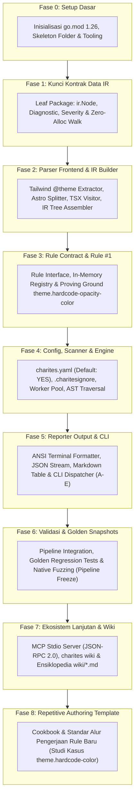

# Charites Architecture & Documentation Portal

> **Engine:** Go 1.26 Standalone Native Binary
> **Status:** Architecture Design Complete & Locked (Phases 0-8)
> **Prinsip Utama:** *Single-Pass Zero-CGO Compiler Pipeline, Default-YES Configuration, Argus Tri-Corpus Verification*

Selamat datang di portal dokumentasi teknis resmi **Charites**. Direktori `docs/` ini dirancang dengan standar arsitektur kelas enterprise yang memisahkan tanggung jawab (*Separation of Concerns*) ke dalam **6 Pilar Dokumentasi**, didukung oleh matriks tahapan implementasi modular terpadu dari **Fase 0 hingga Fase 8**.

---

## 1. Kerangka 6 Pilar Dokumentasi

Sistem dokumentasi Charites memisahkan **Jalur Rekayasa Teknis (Engineering Track)** dan **Pagar Tata Kelola & Mutu (Governance & Quality Track)**:

```text
+-------------------------------------------------------------+
| 06-ROADMAP (Project Governance & Phasing)                   | <-- Mengatur milestone, risiko, & gerbang transisi
+-------------------------------------------------------------+
                              |
              +---------------+---------------+
              |                               |
              v                               v
       [ JALUR TEKNIS ]               [ PAGAR PENGAWAS ]
+----------------------------+   +----------------------------+
| 01-SPEC (RFC Requirements) |   | 04-QUALITY (Standards/Sec) |
| (WHAT to build)            |<= | Diaudit & dipantau         |
| IETF RFC 2119 Standards    |=> | OpenSSF, Pure Function Inv |
+----------------------------+   +----------------------------+
              |                               |
              v                               v
+----------------------------+   +----------------------------+
| 02-ARCHITECTURE (arc42/C4) |   | 05-RELEASE (GitOps/Supply) |
| (HOW to build)             |<= | Baseline terkontrol        |
| Pipeline, IR, Zero-Alloc   |=> | SemVer 2.0, SLSA, Install  |
+----------------------------+   +----------------------------+
              |
              v
+----------------------------+
| 03-TESTING (Verification)  |
| (VERIFY compliance)        |
| Tri-Corpus, Golden, Fuzzing|
+----------------------------+
```

### Panduan Navigasi 6 Pilar:

| Pilar | Domain & Tanggung Jawab | Dokumen Utama |
| :--- | :--- | :--- |
| **[01-SPEC](01-spec/README.md)** | **Requirements Specification (WHAT to build):** Standar fungsional & non-fungsional, kontrak interface, dan batas sistem (RFC 2119). | [01-spec/README.md](01-spec/README.md) |
| **[02-ARCHITECTURE](02-architecture/README.md)** | **System Architecture (HOW to build):** arc42 v8.2, topologi compiler pipeline, normalisasi IR, dan ADR (*Architecture Decision Records*). | [02-architecture/README.md](02-architecture/README.md) |
| **[03-TESTING](03-testing/README.md)** | **Test Strategy & Verification (VERIFY compliance):** Model semantik Argus Tri-Corpus, Golden Snapshots, native fuzzing, dan benchmark. | [03-testing/README.md](03-testing/README.md) |
| **[04-QUALITY](04-quality/README.md)** | **Quality Assurance & Invariants:** Standar OpenSSF, Pure Function Invariant, anti-sycophancy (zero secret bypass), dan keamanan sistem. | [04-quality/README.md](04-quality/README.md) |
| **[05-RELEASE](05-release/README.md)** | **Release & Supply Chain:** Manajemen versi SemVer 2.0.0, integritas SLSA, instalasi satu baris, dan [katalog changelog](05-release/changelogs/). | [05-release/README.md](05-release/README.md) |
| **[06-ROADMAP](06-roadmap/README.md)** | **Project Charter & Phasing:** Peta jalan implementasi bertahap, matriks mitigasi risiko FMEA, dan gerbang transisi Definition of Done (DoD). | [06-roadmap/README.md](06-roadmap/README.md) |

---

## 2. Peta Jalan Pembangunan Bertahap (Master Phased Roadmap)

Pengembangan Charites mengadopsi prinsip **Pondasi Compiler Dulu, Aturan Bisnis Kemudian** (*Engine-First, Rules-Last*). Tahapan pengerjaan diorganisir dalam 9 fase berurutan:



---

## 3. Matriks Referensi Silang Dokumen Modular (Cross-Reference Matrix)

Setiap tahapan pengembangan memiliki 5 dokumen modular yang tersebar di 5 pilar utama:

| Fase | Topik Pengerjaan | 01-SPEC | 02-ARCHITECTURE | 03-TESTING | 04-QUALITY | 06-ROADMAP |
| :---: | :--- | :---: | :---: | :---: | :---: | :---: |
| **0** | **Inisialisasi & Setup** | [SPEC-00](01-spec/00-setup.md) | [ARCH-00](02-architecture/00-setup.md) | [TEST-00](03-testing/00-setup.md) | [QUAL-00](04-quality/00-setup.md) | [ROAD-00](06-roadmap/00-setup.md) |
| **1** | **Kontrak Data IR** | [SPEC-01](01-spec/01-contract.md) | [ARCH-01](02-architecture/01-contract.md) | [TEST-01](03-testing/01-contract.md) | [QUAL-01](04-quality/01-contract.md) | [ROAD-01](06-roadmap/01-contract.md) |
| **2** | **Parser Frontend & Builder** | [SPEC-02](01-spec/02-parser.md) | [ARCH-02](02-architecture/02-parser.md) | [TEST-02](03-testing/02-parser.md) | [QUAL-02](04-quality/02-parser.md) | [ROAD-02](06-roadmap/02-parser.md) |
| **3** | **Rule Contract & Rule #1** | [SPEC-03](01-spec/03-rules.md) | [ARCH-03](02-architecture/03-rules.md) | [TEST-03](03-testing/03-rules.md) | [QUAL-03](04-quality/03-rules.md) | [ROAD-03](06-roadmap/03-rules.md) |
| **4** | **Config, Scanner & Engine** | [SPEC-04](01-spec/04-engine.md) | [ARCH-04](02-architecture/04-engine.md) | [TEST-04](03-testing/04-engine.md) | [QUAL-04](04-quality/04-engine.md) | [ROAD-04](06-roadmap/04-engine.md) |
| **5** | **Reporter & CLI Entrypoint** | [SPEC-05](01-spec/05-cli.md) | [ARCH-05](02-architecture/05-cli.md) | [TEST-05](03-testing/05-cli.md) | [QUAL-05](04-quality/05-cli.md) | [ROAD-05](06-roadmap/05-cli.md) |
| **6** | **Validasi & Golden Tests** | [SPEC-06](01-spec/06-golden.md) | [ARCH-06](02-architecture/06-golden.md) | [TEST-06](03-testing/06-golden.md) | [QUAL-06](04-quality/06-golden.md) | [ROAD-06](06-roadmap/06-golden.md) |
| **7** | **Ekosistem MCP & Wiki** | [SPEC-07](01-spec/07-mcp.md) | [ARCH-07](02-architecture/07-mcp.md) | [TEST-07](03-testing/07-mcp.md) | [QUAL-07](04-quality/07-mcp.md) | [ROAD-07](06-roadmap/07-mcp.md) |
| **8** | **Repetitive Authoring Template**| [SPEC-08](01-spec/08-expansion.md) | [ARCH-08](02-architecture/08-expansion.md) | [TEST-08](03-testing/08-expansion.md) | [QUAL-08](04-quality/08-expansion.md) | [ROAD-08](06-roadmap/08-expansion.md) |

---

## 4. Target Struktur Direktori Repositori

Struktur repositori dirancang bersih, modular, dan memisahkan logika domain secara ketat:

```text
charites/
├── cmd/
│   └── charites/                  # Titik masuk utama binary
│       └── main.go
├── internal/
│   ├── cli/                       # Command dispatcher & flag parsing (Ergonomi A-E)
│   │   ├── root.go                # Command router (scan, check, run, version, wiki, mcp)
│   │   ├── scan.go                # Subcommand scan handler
│   │   ├── mcp.go                 # Subcommand mcp handler
│   │   └── wiki.go                # Subcommand wiki handler
│   ├── config/                    # Konfigurasi proyek & ignore engine
│   │   ├── config.go              # Parser charites.yaml (Prinsip Default: YES)
│   │   └── ignore.go              # Matcher .charitesignore dengan strict early pruning
│   ├── ir/                        # Intermediate Representation (Leaf SSOT Data Contract)
│   │   ├── node.go                # Unified AST node & zero-alloc iter.Seq Walk
│   │   ├── diagnostic.go          # Struct Diagnostic & Severity
│   │   └── builder.go             # Perakit pohon AST ke representasi terpadu
│   ├── parser/                    # Layer parsing kode sumber mentah
│   │   ├── tailwind/              # Ekstraktor token @theme di global.css
│   │   ├── astro/                 # Splitter frontmatter --- dengan offset baris presisi
│   │   └── tsx/                   # Visitor streaming elemen JSX & class attributes
│   ├── rules/                     # Kernel evaluasi audit & registry katalog
│   │   ├── registry.go            # In-memory registry thread-safe (sync.RWMutex)
│   │   ├── rule.go                # Interface baku Rule (pure function Evaluate)
│   │   └── theme/                 # Paket domain theme
│   │       └── hardcode_opacity_color.go # Rule #1 proving ground
│   ├── analyzer/                  # Mesin traversal AST terisolasi
│   │   ├── context.go             # Buffer diagnostik per-berkas & inline ignore filter
│   │   └── engine.go              # Loop traversal IR dengan iterator Go 1.26
│   ├── scanner/                   # Pemindai direktori berkonkurensi tinggi
│   │   ├── walker.go              # Fast dirwalker patuh .charitesignore
│   │   └── pool.go                # Goroutine worker pool (runtime.NumCPU())
│   ├── reporter/                  # Presenter keluaran hasil audit
│   │   ├── inline.go              # Presenter ANSI terminal (deteksi TTY & NO_COLOR)
│   │   ├── json.go                # Presenter streaming JSON envelope
│   │   └── markdown.go            # Ringkasan tabel markdown untuk PR comment
│   ├── mcp/                       # Server Model Context Protocol (JSON-RPC 2.0 Stdio)
│   │   ├── stdio.go               # I/O framing Stdio non-blocking terisolasi
│   │   ├── dispatcher.go          # Protocol routing (initialize, tools/list, tools/call)
│   │   └── handlers.go            # Tools: charites_scan, charites_explain_rule, charites_list_rules
│   └── wiki/                      # Generator ensiklopedia rule otomatis
│       ├── generator.go           # Ekspor metadata rule ke direktori wiki/
│       └── templates/             # Template markdown
├── wiki/                          # Katalog dokumentasi ringkas per bidang
│   ├── Home.md                    # Indeks utama & tabel navigasi rule
│   ├── theme.md                   # Rules bidang Theme & Design Tokens
│   ├── a11y.md                    # Rules bidang Aksesibilitas
│   ├── perf.md                    # Rules bidang Web Vitals & Performa
│   ├── layout.md                  # Rules bidang Layout & Responsive Design
│   └── seo.md                     # Rules bidang SEO & Metadata
├── tests/
│   ├── correctness/               # Model Evaluasi Semantik Argus (Tri-Corpus)
│   │   └── theme.hardcode-opacity-color/
│   │       ├── positive/          # True violations (Wajib terdeteksi > 0)
│   │       ├── negative/          # Clean valid code (Zero Noise Invariant == 0)
│   │       └── adversarial/       # False positive bait & inline ignore
│   ├── golden/                    # Snapshot regresi kebenaran mutlak (.json & .txt)
│   ├── fixtures/                  # Sampel berkas uji (.astro, .tsx, global.css)
│   ├── fuzz/                      # Go 1.26 native fuzzing suite (zero panic)
│   ├── integration/               # Uji integrasi pipeline penuh
│   └── e2e/                       # Subprocess CLI runner & exit code assertions
├── scripts/
│   ├── install.sh                 # One-line curl installer (Linux & macOS)
│   └── install.ps1                # Automated PowerShell installer (Windows)
├── docs/                          # Portal dokumentasi arsitektur 6 pilar resmi
├── .charitesignore                # Pola ignore bawaan
├── .golangci.yml                  # Konfigurasi linter wajib (zero tolerance)
├── Makefile                       # Automasi build, test, lint, dan fuzzing
└── go.mod                         # Go 1.26 module definition (zero external dependencies)
```

> [!NOTE]
> - **Zero Dependency Invariant:** Berkas `go.sum` **MUST NOT** be required pada Fase 0 karena ketiadaan dependensi pihak ketiga.
> - **Skeleton Directory Reservation:** Direktori `internal/` selain `cli/` dan direktori `tests/` selain `e2e/` merupakan reservasi struktur arsitektur repositori yang diisi secara terisolasi per fase sesuai roadmap.


---

## 5. Invarian Kualitas & Kriteria Kesiapan Eksekusi

Sebelum melangkah ke penulisan kode nyata di **Fase 0**, seluruh sistem wajib mematuhi batasan kualitas berikut:

1. **Zero Runtime Dependency:**
   Charites dikompilasi menjadi **single static binary** tanpa memerlukan runtime Node.js, `node_modules`, interpreter Python, ataupun CGO.
2. **Sub-100ms Monorepo Latency:**
   Pemindaian 1.000 berkas frontend di SSD selesai dalam waktu $< 100\text{ milidetik}$.
3. **Model Argus Tri-Corpus Semantic Verification:**
   Setiap rule wajib memenuhi metrik kelulusan: `RuleCorrectnessMetric == Pass` (`PositiveViolations > 0`, `NegativeViolations == 0`, `AdversarialViolations == 0`).
4. **Prinsip Konfigurasi Default: YES:**
   Tanpa berkas `charites.yaml`, 100% rule aktif otomatis. File konfigurasi murni digunakan untuk penyesuaian (*overrides*).
5. **Invarian Anti-Sycophancy (Zero Secret Bypass):**
   Dilarang keras menyisipkan whitelist nama berkas tersembunyi di kode rule. Seluruh pengecualian harus transparan via ignore resmi.
