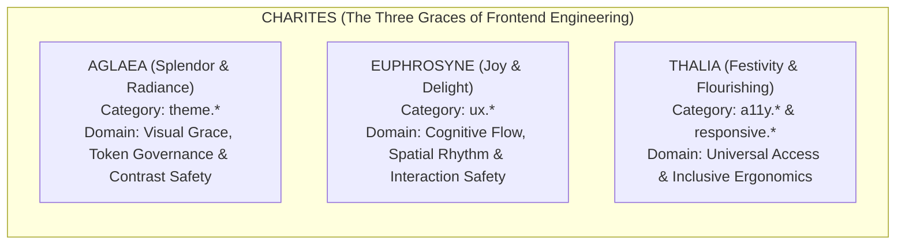
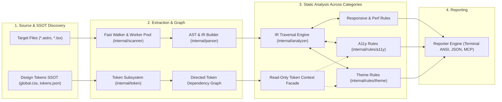

# Charites Static Analysis Rule Catalog

Welcome to the **Charites Static Analysis Rule Catalog**. Charites is an ultra-fast, zero-CGO, zero-Node.js static analysis compiler for Astro, React TSX, and Tailwind CSS design tokens.

---

##  The Greek Mythology of Charites: Why This Name?

In Greek mythology, the **Charites** ($\text{Χάριτες}$ / *The Three Graces*: **Aglaea** / Splendor, **Euphrosyne** / Mirth, and **Thalia** / Bloom) are the goddesses of charm, grace, beauty, joy, and visual elegance. Companions of Aphrodite and craftswomen of Olympian splendor, the Charites bring harmony, proportion, and delightful aesthetic design to all human and divine creations.

In modern software engineering, Charites occupies a unique, highly respectful position:

$$\mathbf{Linter} < \mathbf{Charites} < \mathbf{Developer\ Preference}$$

Charites is **one step ahead of conventional linters** (evaluating relational graphs, design token resolution, and interaction data-flow), yet it **never infringes on developer preference, aesthetic taste, or brand identity**.

> **The Runway Fashion Principle:**
> In fashion, choreographers do not dictate subjective standards of model beauty or forbid avant-garde styles. Rather, they enforce professional runway attitude, posture mechanics, stride rhythm, and safety so the model does not trip over the hem or suffer a wardrobe failure.
> Similarly, in Charites:
> - **Brand & Aesthetic Freedom (The Met Gala):** Whether your design embraces *Neo-Brutalism*, *Minimalist Bento*, *Skeuomorphism*, or *Cyberpunk Neon*, you have full creative liberty.
> - **Ergonomic & Structural Integrity:** Charites intervenes strictly when fundamental usability and safety are breached-such as tiny unclickable touch targets ($< 44\text{px}$), un-isolated async actions causing duplicate mutations, broken mobile keyboard submit paths, collapsed dark-mode elevation shadows, or inverted spatial spacing.

### The Three Goddesses as Rule Domain Archetypes

Each of the Three Graces personifies a foundational static analysis domain in Charites:

#### 1.  Aglaea (Splendor & Radiance) $\longrightarrow$ `theme.*` Rules
*Aglaea represents visual elegance, harmony of form, and the purity of light.*
- **Architectural Role:** Acts as the dress code guardian of the design system (the *Met Gala* manifesto declared in `global.css`).
- **Invariant Scope:** Eliminates arbitrary color/scalar leaks (`theme.hardcode-color`), ensures dark/light theme parity without elevation collapse (`theme.shadow-without-border-dark`), resolves multi-theme tokens, and prevents specificity clashes between Tailwind v3 and v4.
- **Creative Freedom:** Choose any palette, gradient, or theme mode-as long as it is tokenized and consistent across your application.

#### 2.  Euphrosyne (Joy & Delight) $\longrightarrow$ `ux.*` Rules
*Euphrosyne represents good cheer, seamless ease of living, and freedom from user frustration.*
- **Architectural Role:** Protects the user's cognitive flow, spatial rhythm, and interaction state safety.
- **Invariant Scope:** Prevents duplicate form mutations via async reentry guards (`ux.submit-feedback-missing`), eliminates infinite loading spinners on network failures (`ux.unbounded-async-flag`), maintains natural spatial hierarchy ($\text{Micro} < \text{Meso} < \text{Macro}$ via `ux.spacing-inversion`), ensures inline links are clearly discernible in prose (`ux.camouflaged-link`), and protects state persistence in multi-step workflows (`ux.wizard-state-not-persisted`).
- **Creative Freedom:** Style your components in any aesthetic movement-as long as the interaction body language remains transparent, communicative, and safe for the user.

#### 3.  Thalia (Festivity & Flourishing) $\longrightarrow$ `a11y.*` & `responsive.*` Rules
*Thalia represents abundance, social harmony, and opening the celebration to everyone without barrier.*
- **Architectural Role:** Ensures universal accessibility and touch-first ergonomics across all devices and physical capabilities.
- **Invariant Scope:** Enforces Apple HIG / WCAG 2.2 touch targets ($\ge 44 \times 44\text{px}$ via `a11y.touch-target-size`), safeguards mobile viewports against iOS Safari auto-zoom traps (`a11y.input-ios-zoom-hazard`), links form errors programmatically (`a11y.error-not-announced`), and eliminates modal keyboard traps (`a11y.keyboard-trap-missing-escape`).
- **Creative Freedom:** Build any layout while guaranteeing that screen reader users, keyboard navigators, and mobile touch users participate with equal dignity.

---

## Categories

| Category | Rules Count | Documentation |
| :--- | :---: | :--- |
| `a11y` | 16 | [`a11y`](a11y) |
| `browser` | 4 | [`browser`](browser) |
| `theme` | 32 | [`theme`](theme) |

---

## All Registered Rules

| Rule ID | Category | Severity | Description | Documentation |
| :--- | :---: | :---: | :--- | :--- |
| `a11y.button-type-missing` | `a11y` | `WARN` | Enforces explicit type attribute on <button> elements inside forms to prevent unintended form submission | [`a11y.button-type-missing`](a11y.button-type-missing) |
| `a11y.dialog-missing-aria` | `a11y` | `ERROR` | Enforces that custom modal dialogs declare aria-modal="true" and have an accessible name | [`a11y.dialog-missing-aria`](a11y.dialog-missing-aria) |
| `a11y.empty-interactive` | `a11y` | `ERROR` | Enforces accessible names on interactive elements (buttons, links) containing only icons or visual elements | [`a11y.empty-interactive`](a11y.empty-interactive) |
| `a11y.error-not-announced` | `a11y` | `ERROR` | Ensures form controls with aria-invalid are programmatically linked to error messages via aria-describedby (WCAG 3.3.1) | [`a11y.error-not-announced`](a11y.error-not-announced) |
| `a11y.form-input-missing-name` | `a11y` | `WARN` | Ensures form input controls declare an identifying name or id attribute for form submission and autofill (WCAG 4.1.2) | [`a11y.form-input-missing-name`](a11y.form-input-missing-name) |
| `a11y.form-label-composite-control` | `a11y` | `WARN` | Warns when <FormLabel> is directly bound to a composite multi-field control causing screen reader ambiguity | [`a11y.form-label-composite-control`](a11y.form-label-composite-control) |
| `a11y.form-label-missing-control` | `a11y` | `ERROR` | Enforces that Shadcn UI <FormItem> containing <FormLabel> also contains an associated <FormControl> or input element | [`a11y.form-label-missing-control`](a11y.form-label-missing-control) |
| `a11y.img-missing-alt` | `a11y` | `ERROR` | Enforces required 'alt' attribute on Astro <Image>, <Picture>, and native  elements (WCAG 1.1.1) | [`a11y.img-missing-alt`](a11y.img-missing-alt) |
| `a11y.input-cramped-padding` | `a11y` | `WARN` | Flags input controls with cramped vertical padding or height under 42px that clip text and impede touch targeting | [`a11y.input-cramped-padding`](a11y.input-cramped-padding) |
| `a11y.input-ios-zoom-hazard` | `a11y` | `WARN` | Prevents forced Safari iOS viewport auto-zoom by requiring at least 16px font size on inputs on mobile viewports | [`a11y.input-ios-zoom-hazard`](a11y.input-ios-zoom-hazard) |
| `a11y.keyboard-trap-missing-escape` | `a11y` | `ERROR` | Enforces that custom modal dialogs provide an Escape key listener or an accessible dismiss mechanism | [`a11y.keyboard-trap-missing-escape`](a11y.keyboard-trap-missing-escape) |
| `a11y.label-missing-control` | `a11y` | `ERROR` | Ensures label htmlFor attributes match an existing input control ID in the same document (WCAG 1.3.1) | [`a11y.label-missing-control`](a11y.label-missing-control) |
| `a11y.missing-focus-ring` | `a11y` | `WARN` | Enforces visible focus indicator when suppressing default outline with outline-none (WCAG 2.4.7) | [`a11y.missing-focus-ring`](a11y.missing-focus-ring) |
| `a11y.placeholder-as-label` | `a11y` | `ERROR` | Flags form inputs relying solely on placeholder attributes without a persistent label or accessible name (WCAG 3.3.2) | [`a11y.placeholder-as-label`](a11y.placeholder-as-label) |
| `a11y.touch-target-size` | `a11y` | `WARN` | Enforces minimum 44x44px physical touch target size on interactive controls (Apple HIG / WCAG 2.5.8) | [`a11y.touch-target-size`](a11y.touch-target-size) |
| `a11y.touch-target-spacing` | `a11y` | `WARN` | Enforces at least 8px spacing between adjacent interactive elements to prevent miss-taps (WCAG 2.5.8) | [`a11y.touch-target-spacing`](a11y.touch-target-spacing) |
| `browser.appearance-native-override` | `browser` | `WARN` | Enforces explicit appearance-none on form controls with custom styling to prevent WebKit/Safari native UI clashes | [`browser.appearance-native-override`](browser.appearance-native-override) |
| `browser.hover-only-interaction` | `browser` | `ERROR` | Ensures interactive actions and state reveals have keyboard and touch counterparts instead of relying solely on hover | [`browser.hover-only-interaction`](browser.hover-only-interaction) |
| `browser.obsolete-vendor-prefix` | `browser` | `WARN` | Detects obsolete CSS vendor prefixes and incomplete -webkit-line-clamp multi-line truncation triads | [`browser.obsolete-vendor-prefix`](browser.obsolete-vendor-prefix) |
| `browser.scrollbar-vendor-incomplete` | `browser` | `WARN` | Enforces bidirectional cross-engine scrollbar styling pairing between WebKit pseudo-elements and W3C standard properties | [`browser.scrollbar-vendor-incomplete`](browser.scrollbar-vendor-incomplete) |
| `theme.apply-bloat` | `theme` | `WARN` | Detects excessive use of @apply with more than 8 utility classes in CSS or style blocks | [`theme.apply-bloat`](theme.apply-bloat) |
| `theme.backdrop-blur-hardcode` | `theme` | `WARN` | Detects hardcoded arbitrary blur and backdrop-blur scalars in Tailwind utility classes | [`theme.backdrop-blur-hardcode`](theme.backdrop-blur-hardcode) |
| `theme.chart-color-hardcode` | `theme` | `ERROR` | Detects hardcoded color values on chart visualization components | [`theme.chart-color-hardcode`](theme.chart-color-hardcode) |
| `theme.dual-strategy-collision` | `theme` | `WARN` | Detects conflicting dark mode strategies (@media vs .dark/[data-theme]) in the same style scope | [`theme.dual-strategy-collision`](theme.dual-strategy-collision) |
| `theme.dynamic-class` | `theme` | `ERROR` | Detects unpadded dynamic template strings breaking Tailwind JIT class generation | [`theme.dynamic-class`](theme.dynamic-class) |
| `theme.focus-ring-hardcode` | `theme` | `WARN` | Detects hardcoded primitive palette or arbitrary hex colors on focus rings and outlines | [`theme.focus-ring-hardcode`](theme.focus-ring-hardcode) |
| `theme.gradient-hardcode` | `theme` | `WARN` | Detects hardcoded primitive, arbitrary hex, or monochrome colors in gradient stops | [`theme.gradient-hardcode`](theme.gradient-hardcode) |
| `theme.hardcode-border-color` | `theme` | `WARN` | Detects hardcoded border and divider colors using primitive palettes, raw hex literals, or static monochrome | [`theme.hardcode-border-color`](theme.hardcode-border-color) |
| `theme.hardcode-border-radius` | `theme` | `WARN` | Detects hardcoded arbitrary border-radius scalars in Tailwind utility classes | [`theme.hardcode-border-radius`](theme.hardcode-border-radius) |
| `theme.hardcode-color` | `theme` | `WARN` | Detects hardcoded arbitrary hex or rgb color literals in Tailwind utility classes and arbitrary properties | [`theme.hardcode-color`](theme.hardcode-color) |
| `theme.hardcode-monochrome` | `theme` | `WARN` | Detects hardcoded monochrome utilities (white/black) that fail to adapt across light and dark themes | [`theme.hardcode-monochrome`](theme.hardcode-monochrome) |
| `theme.hardcode-opacity-color` | `theme` | `ERROR` | Detects utility classes with hardcoded slash opacity modifiers that have official semantic token replacements | [`theme.hardcode-opacity-color`](theme.hardcode-opacity-color) |
| `theme.hardcode-shadow-color` | `theme` | `WARN` | Detects hardcoded color literals embedded in box-shadow declarations | [`theme.hardcode-shadow-color`](theme.hardcode-shadow-color) |
| `theme.hardcode-size` | `theme` | `WARN` | Detects hardcoded arbitrary size, spacing, or typography scalars in Tailwind utility classes | [`theme.hardcode-size`](theme.hardcode-size) |
| `theme.hardcode-z-index` | `theme` | `WARN` | Detects hardcoded arbitrary z-index scalars that trigger stacking context wars | [`theme.hardcode-z-index`](theme.hardcode-z-index) |
| `theme.hydration-theme-mismatch` | `theme` | `WARN` | Detects SSR root layouts lacking blocking inline script for theme initialization | [`theme.hydration-theme-mismatch`](theme.hydration-theme-mismatch) |
| `theme.image-theme-hardcode` | `theme` | `WARN` | Detects graphic assets and logos in img tags lacking dark mode theme adaptation | [`theme.image-theme-hardcode`](theme.image-theme-hardcode) |
| `theme.important-override` | `theme` | `ERROR` | Detects !important modifiers on color utility classes that break theme cascade and specificity hierarchy | [`theme.important-override`](theme.important-override) |
| `theme.inline-style-hardcode` | `theme` | `ERROR` | Detects hardcoded color literals inside HTML/JSX style attributes that prevent theme cascade | [`theme.inline-style-hardcode`](theme.inline-style-hardcode) |
| `theme.meta-theme-color-mismatch` | `theme` | `WARN` | Detects static meta theme-color tags lacking media prefers-color-scheme queries | [`theme.meta-theme-color-mismatch`](theme.meta-theme-color-mismatch) |
| `theme.missing-color-scheme` | `theme` | `WARN` | Detects dark theme definitions (.dark, [data-theme="dark"]) missing color-scheme property | [`theme.missing-color-scheme`](theme.missing-color-scheme) |
| `theme.missing-token-fallback` | `theme` | `WARN` | Detects CSS variable references without fallback values | [`theme.missing-token-fallback`](theme.missing-token-fallback) |
| `theme.nested-opacity-contrast` | `theme` | `WARN` | Detects nested opacity modifiers that compound to cause catastrophic text contrast degradation | [`theme.nested-opacity-contrast`](theme.nested-opacity-contrast) |
| `theme.no-reduced-motion` | `theme` | `WARN` | Detects global theme transitions without prefers-reduced-motion media query wrapping | [`theme.no-reduced-motion`](theme.no-reduced-motion) |
| `theme.primitive-in-component` | `theme` | `ERROR` | Detects direct usage of Tailwind primitive palette colors in component classes instead of semantic tokens | [`theme.primitive-in-component`](theme.primitive-in-component) |
| `theme.pseudo-hardcode-color` | `theme` | `WARN` | Detects hardcoded primitive, arbitrary hex, or monochrome colors inside pseudo-element and pseudo-class variants | [`theme.pseudo-hardcode-color`](theme.pseudo-hardcode-color) |
| `theme.shadow-without-border-dark` | `theme` | `WARN` | Detects elevated containers with shadow lacking border or ring indicators in dark mode | [`theme.shadow-without-border-dark`](theme.shadow-without-border-dark) |
| `theme.split-theme-state` | `theme` | `WARN` | Detects ad-hoc direct access to theme state via localStorage outside ThemeProvider | [`theme.split-theme-state`](theme.split-theme-state) |
| `theme.svg-hardcode-fill` | `theme` | `WARN` | Detects hardcoded color attributes on SVG markup preventing theme adaptation | [`theme.svg-hardcode-fill`](theme.svg-hardcode-fill) |
| `theme.token-source-drift` | `theme` | `ERROR` | Detects hardcoded color values bypassing the single source of truth design token pipeline | [`theme.token-source-drift`](theme.token-source-drift) |
| `theme.unlayered-token-definition` | `theme` | `ERROR` | Detects CSS custom property definitions declared outside @layer theme or @layer base | [`theme.unlayered-token-definition`](theme.unlayered-token-definition) |
| `theme.unpaired-dark-variant` | `theme` | `WARN` | Detects one-sided dark theme variant declarations causing severe contrast collisions | [`theme.unpaired-dark-variant`](theme.unpaired-dark-variant) |

---

## How the Static Analysis Pipeline Works

Charites processes project source code and design tokens through a unified 4-stage pipeline:

### Pipeline Flow:
1. **Target Discovery & AST Construction:** `internal/scanner` discovers and walks workspace source files in parallel, streaming `.astro` and `.tsx` components to `internal/parser` to construct normalized `ir.Node` structures.
2. **Multi-Format SSOT Token Graph:** `internal/token` auto-discovers design token sources across both CSS (`global.css`, `index.css`, `@theme`) and JSON manifests (`tokens.json` W3C DTCG format). It parses custom properties (`--*`), nested themes (`:root`, `.dark`), and variable references (`var(--...)`), constructing a design-agnostic `Directed Token Dependency Graph` with visited-set cycle detection and recursion budget limits.
3. **Stateless Traversal & Multi-Category Evaluation:** `internal/analyzer` coordinates parallel IR node traversal across modular rule domains:
   - **Theme Governance (`internal/rules/theme`):** Validates utility classes, stripping variants and ensuring opacity/color modifications use official semantic tokens declared in the graph.
   - **Accessibility Verification (`internal/rules/a11y`):** Replaces legacy regex heuristics (migrated from `charites-legacy/a11y-checker.ts`) with AST-grounded validation of label/input bindings, heading hierarchies, missing alt-text, and token-resolved WCAG 2.2 color contrast ratios.
   - **Responsive & Performance (`internal/rules/{responsive,perf}`):** Enforces Fitts's Law touch target ergonomics (>= 44x44px), modern `@container` queries, and Core Web Vitals (LCP, CLS, INP).
4. **Multi-Channel Delivery:** Diagnostics are deterministically rendered for ANSI terminal output, streaming JSON envelopes, or MCP JSON-RPC 2.0 tool calls.

---

## How Testing Works Across Charites (The 4-Layer Verification Harness)

Charites enforces correctness, resilience, and zero false positives across four interconnected testing tiers:

### Testing Tier Flow:
1. **Layer 1 (Subsystem Units):** Validates deterministic lexing, zero-panic parsing, graph cycle detection (`ErrCycleDetected`), and traversal recursion budget limits (`ErrEvaluationBudgetExceeded`).
2. **Layer 2 (1-SSOT Golden Tri-Corpus):** Every static analysis rule is tested against an exhaustive 17-pattern matrix in `tests/correctness/<rule-id>/`:
   - **Positive (P1-P5):** Obvious, indirect, helper-wrapped, deeply nested, and aliased violations.
   - **Negative (N1-N5):** Valid tokens, explicit ignore directives, third-party libraries, standard HTML, and untokenized custom values (the Banana Test).
   - **Adversarial (A1-A7):** Template literal interpolations, ternary conditionals, spread props, dynamic classes, variable shadowing, and cyclic references.
3. **Layer 3 (Monorepo Integration):** Validates end-to-end multi-scope token resolution (`:root` vs `.dark`), upward directory walks, and CLI output rendering in `tests/token_integration_test.go`.
4. **Layer 4 (Continuous Fuzzing):** Employs native Go 1.26 fuzzing (`tests/fuzz/css_fuzz_test.go`) over tens of thousands of malformed mutations to guarantee memory safety and crash resilience.

---

## Architectural Principles

1. **Deterministic Execution:** Pure-function AST visitors without file system or network I/O during evaluation.
2. **SSOT Token Evidence:** Static rules only enforce semantic token replacements that genuinely exist in the project's token dependency graph.
3. **1-SSOT Tri-Corpus Assurance:** Every rule is validated against a 3-part golden test corpus (`positive/`, `negative/`, `adversarial/`).
4. **Canonical Semgrep Identifiers:** All rules follow the `<category>.<slug>` standard.

