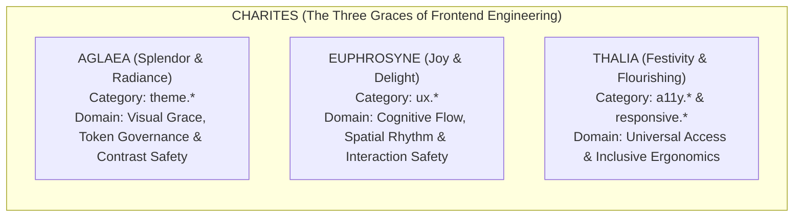
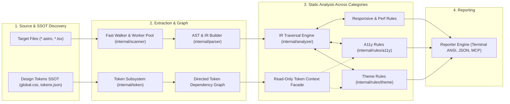

# Charites Static Analysis Rule Catalog

Welcome to the **Charites Static Analysis Rule Catalog**. Charites is an ultra-fast, zero-CGO, zero-Node.js static analysis compiler for Astro, React TSX, and Tailwind CSS design tokens.

---

##  The Greek Mythology of Charites: Why This Name?

In Greek mythology, the **Charites** ($\text{Χάριτες}$ / *The Three Graces*: **Aglaea** / Splendor, **Euphrosyne** / Mirth, and **Thalia** / Bloom) are the goddesses of charm, grace, beauty, joy, and visual elegance. Companions of Aphrodite and craftswomen of Olympian splendor, the Charites bring harmony, proportion, and delightful aesthetic design to all human and divine creations.

In modern software engineering, Charites occupies a unique, highly respectful position:

$$\mathbf{Linter} < \mathbf{Charites} < \mathbf{Developer\ Preference}$$

Charites is **one step ahead of conventional linters** (evaluating relational graphs, design token resolution, and interaction data-flow), yet it **never infringes on developer preference, aesthetic taste, or brand identity**.

> **The Charites Iceberg Principle:**
> Web application quality follows an iceberg model: developers and users are captivated by the **first impression** above the waterline, but long-term user trust and retention are decided by the **runtime performance** submerged beneath it.
>
> ```text
>                               ▲
>                              / \
>                             /   \
>                            /     \
>                           /       \
>                          /  VISUAL \
>   ======================/=========== \====================== WATERLINE (First Impression)
>                        /   THEME      \
>                       /     A11Y       \   ABOVE WATER (112 RULES)
>                      /   RESPONSIVE     \  "What is Seen & Touched"
>                     /     ERGONOMY       \  • Design token consistency (global.css SSOT)
>                    /       BROWSER        \ • Fitts's Law touch ergonomics (>= 44x44px)
>                   /         PWA / UX       \• Mobile viewport integrity (dvh, min-w-0)
>                  /                          \
>   ~~~~~~~~~~~~~~/~~~~~~~~~~~~~~~~~~~~~~~~~~~~\~~~~~~~~~~~~~~ DEVELOPER AWARENESS THRESHOLD
>                /                              \
>               /       CORE WEB VITALS          \   SUBMERGED MASS (64 RULES)
>              /        & FRAMEWORK PERF          \  "What is Felt & Sustained"
>             /                                    \ • Layout shift stability without jank (CLS)
>            /    CLS  •  INP  •  LCP  •  PERF     \ • Main-thread interaction latency <50ms (INP)
>           /                                       \• Critical asset discovery & preload (LCP)
>          /  React Compiler • Astro Island • Oxide  \• Zero-JS hydration & VDOM hygiene
>         /                                           \
>        /─────────────────────────────────────────────\
> ```
>
> - **Above the Waterline (Surface Presence - 112 Rules):** Solve what is seen and touched first. If an interface suffers from rogue hex codes, dark mode elevation collapse, iOS Safari auto-zoom traps, clipped mobile tables, or unclickable 24px icon buttons, users bounce immediately. Charites guarantees token and ergonomic integrity while granting full creative brand liberty.
> - **Beneath the Waterline (Runtime Perception - 64 Rules):** Solve what is felt next. Once the visual presentation is pristine, user delight hinges on runtime execution: zero layout shift on asset load (CLS), sub-50ms main-thread responsiveness (INP), instant hero image paint (LCP), and leak-free framework compiler efficiency (React Compiler, Astro Islands, and Tailwind v4 Oxide).

### The Three Goddesses as Rule Domain Archetypes

Each of the Three Graces personifies a foundational static analysis domain in Charites:



#### 1.  Aglaea (Splendor & Radiance) $\longrightarrow$ `theme.*` Rules
*Aglaea represents visual elegance, harmony of form, and the purity of light.*
- **Architectural Role:** Acts as the dress code guardian of the design system (the *Met Gala* manifesto declared in `global.css`).
- **Invariant Scope:** Eliminates arbitrary color/scalar leaks (`theme.hardcode-color`), ensures dark/light theme parity without elevation collapse (`theme.shadow-without-border-dark`), resolves multi-theme tokens, and prevents specificity clashes between Tailwind v3 and v4.
- **Creative Freedom:** Choose any palette, gradient, or theme mode-as long as it is tokenized and consistent across your application.

#### 2.  Euphrosyne (Joy & Delight) $\longrightarrow$ `ux.*` Rules
*Euphrosyne represents good cheer, seamless ease of living, and freedom from user frustration.*
- **Architectural Role:** Protects the user's cognitive flow, spatial rhythm, and interaction state safety.
- **Invariant Scope:** Prevents duplicate form mutations via async reentry guards (`ux.submit-feedback-missing`), eliminates infinite loading spinners on network failures (`ux.unbounded-async-flag`), maintains natural spatial hierarchy ($\text{Micro} < \text{Meso} < \text{Macro}$ via `ux.spacing-inversion`), ensures inline links are clearly discernible in prose (`ux.camouflaged-link`), and protects state persistence in multi-step workflows (`ux.wizard-state-not-persisted`).
- **Creative Freedom:** Style your components in any aesthetic movement-as long as the interaction body language remains transparent, communicative, and safe for the user.

#### 3.  Thalia (Festivity & Flourishing) $\longrightarrow$ `a11y.*` & `responsive.*` Rules
*Thalia represents abundance, social harmony, and opening the celebration to everyone without barrier.*
- **Architectural Role:** Ensures universal accessibility and touch-first ergonomics across all devices and physical capabilities.
- **Invariant Scope:** Enforces Apple HIG / WCAG 2.2 touch targets ($\ge 44 \times 44\text{px}$ via `a11y.touch-target-size`), safeguards mobile viewports against iOS Safari auto-zoom traps (`a11y.input-ios-zoom-hazard`), links form errors programmatically (`a11y.error-not-announced`), and eliminates modal keyboard traps (`a11y.keyboard-trap-missing-escape`).
- **Creative Freedom:** Build any layout while guaranteeing that screen reader users, keyboard navigators, and mobile touch users participate with equal dignity.

---

## Categories

| Category | Rules Count | Documentation |
| :--- | :---: | :--- |
| `a11y` | 16 | [`a11y`](a11y) |
| `browser` | 12 | [`browser`](browser) |
| `cls` | 16 | [`cls`](cls) |
| `ergonomy` | 4 | [`ergonomy`](ergonomy) |
| `inp` | 8 | [`inp`](inp) |
| `mobile` | 5 | [`mobile`](mobile) |
| `pwa` | 10 | [`pwa`](pwa) |
| `responsive` | 17 | [`responsive`](responsive) |
| `theme` | 32 | [`theme`](theme) |
| `ux` | 16 | [`ux`](ux) |

---

## All Registered Rules

| Rule ID | Category | Severity | Description | Documentation |
| :--- | :---: | :---: | :--- | :--- |
| `a11y.button-type-missing` | `a11y` | `WARN` | Enforces explicit type attribute on <button> elements inside forms to prevent unintended form submission | [`a11y.button-type-missing`](a11y.button-type-missing) |
| `a11y.dialog-missing-aria` | `a11y` | `ERROR` | Enforces that custom modal dialogs declare aria-modal="true" and have an accessible name | [`a11y.dialog-missing-aria`](a11y.dialog-missing-aria) |
| `a11y.empty-interactive` | `a11y` | `ERROR` | Enforces accessible names on interactive elements (buttons, links) containing only icons or visual elements | [`a11y.empty-interactive`](a11y.empty-interactive) |
| `a11y.error-not-announced` | `a11y` | `ERROR` | Ensures form controls with aria-invalid are programmatically linked to error messages via aria-describedby (WCAG 3.3.1) | [`a11y.error-not-announced`](a11y.error-not-announced) |
| `a11y.form-input-missing-name` | `a11y` | `WARN` | Ensures form input controls declare an identifying name or id attribute for form submission and autofill (WCAG 4.1.2) | [`a11y.form-input-missing-name`](a11y.form-input-missing-name) |
| `a11y.form-label-composite-control` | `a11y` | `WARN` | Warns when <FormLabel> is directly bound to a composite multi-field control causing screen reader ambiguity | [`a11y.form-label-composite-control`](a11y.form-label-composite-control) |
| `a11y.form-label-missing-control` | `a11y` | `ERROR` | Enforces that Shadcn UI <FormItem> containing <FormLabel> also contains an associated <FormControl> or input element | [`a11y.form-label-missing-control`](a11y.form-label-missing-control) |
| `a11y.img-missing-alt` | `a11y` | `ERROR` | Enforces required 'alt' attribute on Astro <Image>, <Picture>, and native  elements (WCAG 1.1.1) | [`a11y.img-missing-alt`](a11y.img-missing-alt) |
| `a11y.input-cramped-padding` | `a11y` | `WARN` | Flags input controls with cramped vertical padding or height under 42px that clip text and impede touch targeting | [`a11y.input-cramped-padding`](a11y.input-cramped-padding) |
| `a11y.input-ios-zoom-hazard` | `a11y` | `WARN` | Prevents forced Safari iOS viewport auto-zoom by requiring at least 16px font size on inputs on mobile viewports | [`a11y.input-ios-zoom-hazard`](a11y.input-ios-zoom-hazard) |
| `a11y.keyboard-trap-missing-escape` | `a11y` | `ERROR` | Enforces that custom modal dialogs provide an Escape key listener or an accessible dismiss mechanism | [`a11y.keyboard-trap-missing-escape`](a11y.keyboard-trap-missing-escape) |
| `a11y.label-missing-control` | `a11y` | `ERROR` | Ensures label htmlFor attributes match an existing input control ID in the same document (WCAG 1.3.1) | [`a11y.label-missing-control`](a11y.label-missing-control) |
| `a11y.missing-focus-ring` | `a11y` | `WARN` | Enforces visible focus indicator when suppressing default outline with outline-none (WCAG 2.4.7) | [`a11y.missing-focus-ring`](a11y.missing-focus-ring) |
| `a11y.placeholder-as-label` | `a11y` | `ERROR` | Flags form inputs relying solely on placeholder attributes without a persistent label or accessible name (WCAG 3.3.2) | [`a11y.placeholder-as-label`](a11y.placeholder-as-label) |
| `a11y.touch-target-size` | `a11y` | `WARN` | Enforces minimum 44x44px physical touch target size on interactive controls (Apple HIG / WCAG 2.5.8) | [`a11y.touch-target-size`](a11y.touch-target-size) |
| `a11y.touch-target-spacing` | `a11y` | `WARN` | Enforces at least 8px spacing between adjacent interactive elements to prevent miss-taps (WCAG 2.5.8) | [`a11y.touch-target-spacing`](a11y.touch-target-spacing) |
| `browser.appearance-native-override` | `browser` | `WARN` | Enforces explicit appearance-none on form controls with custom styling to prevent WebKit/Safari native UI clashes | [`browser.appearance-native-override`](browser.appearance-native-override) |
| `browser.chrome-only-api` | `browser` | `WARN` | Flags reliance on Chromium-exclusive APIs without cross-browser fallbacks for Firefox and Safari | [`browser.chrome-only-api`](browser.chrome-only-api) |
| `browser.date-input-format-assumption` | `browser` | `ERROR` | Prohibits localized string splitting assumptions on HTML5 date input values in favor of normative ISO 8601 parsing | [`browser.date-input-format-assumption`](browser.date-input-format-assumption) |
| `browser.experimental-api-no-featuredetect` | `browser` | `ERROR` | Detects invocation of experimental Web APIs without runtime feature detection guards | [`browser.experimental-api-no-featuredetect`](browser.experimental-api-no-featuredetect) |
| `browser.firefox-only-api` | `browser` | `WARN` | Flags usage of legacy Gecko/Firefox-exclusive DOM extensions and APIs without standard W3C equivalents | [`browser.firefox-only-api`](browser.firefox-only-api) |
| `browser.hover-only-interaction` | `browser` | `ERROR` | Ensures interactive actions and state reveals have keyboard and touch counterparts instead of relying solely on hover | [`browser.hover-only-interaction`](browser.hover-only-interaction) |
| `browser.non-passive-scroll-listener` | `browser` | `WARN` | Enforces { passive: true } option on touch and wheel event listeners to prevent main thread scroll blocking | [`browser.non-passive-scroll-listener`](browser.non-passive-scroll-listener) |
| `browser.obsolete-vendor-prefix` | `browser` | `WARN` | Detects obsolete CSS vendor prefixes and incomplete -webkit-line-clamp multi-line truncation triads | [`browser.obsolete-vendor-prefix`](browser.obsolete-vendor-prefix) |
| `browser.safari-only-api` | `browser` | `WARN` | Flags unguarded Apple WebKit/Safari-proprietary APIs without universal web platform fallbacks | [`browser.safari-only-api`](browser.safari-only-api) |
| `browser.scrollbar-vendor-incomplete` | `browser` | `WARN` | Enforces bidirectional cross-engine scrollbar styling pairing between WebKit pseudo-elements and W3C standard properties | [`browser.scrollbar-vendor-incomplete`](browser.scrollbar-vendor-incomplete) |
| `browser.user-agent-sniffing` | `browser` | `WARN` | Flags conditional branching based on navigator.userAgent string sniffing and enforces W3C capability/feature detection | [`browser.user-agent-sniffing`](browser.user-agent-sniffing) |
| `browser.webkit-only-api` | `browser` | `WARN` | Flags direct invocation of WebKit-prefixed legacy APIs without standard W3C equivalents or graceful fallbacks | [`browser.webkit-only-api`](browser.webkit-only-api) |
| `cls.client-only-hydration-pop` | `cls` | `WARN` | Astro client:only island lacks a slot='fallback' shell or reserved min-height container, causing hydration layout shift | [`cls.client-only-hydration-pop`](cls.client-only-hydration-pop) |
| `cls.collapsible-height-jump` | `cls` | `WARN` | Collapsible accordion or drawer animates arbitrary max-height bounds instead of zero-shift CSS Grid | [`cls.collapsible-height-jump`](cls.collapsible-height-jump) |
| `cls.dynamic-content-without-reserved-space` | `cls` | `WARN` | Dynamic widget or banner injected in document flow lacks reserved vertical dimensions (min-h/h), risking content reflow | [`cls.dynamic-content-without-reserved-space`](cls.dynamic-content-without-reserved-space) |
| `cls.dynamic-table-reflow` | `cls` | `WARN` | Dynamic <table> lacks a statically inferable column sizing strategy, risking continuous column reflow | [`cls.dynamic-table-reflow`](cls.dynamic-table-reflow) |
| `cls.font-display-missing` | `cls` | `ERROR` | Requires font-display descriptor on custom @font-face declarations to prevent FOIT reflow | [`cls.font-display-missing`](cls.font-display-missing) |
| `cls.font-import-late-discovery` | `cls` | `WARN` | Warns when CSS @import is used for external font loading, delaying discovery and risking layout shift | [`cls.font-import-late-discovery`](cls.font-import-late-discovery) |
| `cls.layout-trigger-animation` | `cls` | `WARN` | CSS @keyframes animation mutates layout-triggering geometry properties instead of GPU-composited transforms | [`cls.layout-trigger-animation`](cls.layout-trigger-animation) |
| `cls.layout-trigger-transition` | `cls` | `WARN` | CSS transition targets layout-triggering geometry properties instead of GPU-composited transforms | [`cls.layout-trigger-transition`](cls.layout-trigger-transition) |
| `cls.text-icon-late-reflow` | `cls` | `INFO` | Requires locked bounding dimensions on text-ligature icon elements to prevent text reflow | [`cls.text-icon-late-reflow`](cls.text-icon-late-reflow) |
| `cls.unadjusted-font-metric` | `cls` | `INFO` | Recommends font metric overrides on fallback font declarations to reduce swap CLS | [`cls.unadjusted-font-metric`](cls.unadjusted-font-metric) |
| `cls.unconstrained-carousel` | `cls` | `WARN` | Warns when carousel or slider containers lack bounded height or slide aspect-ratio constraints | [`cls.unconstrained-carousel`](cls.unconstrained-carousel) |
| `cls.unreserved-ad-container` | `cls` | `WARN` | Warns when dynamic ad containers lack reserved vertical dimensions or initial skeleton placeholders | [`cls.unreserved-ad-container`](cls.unreserved-ad-container) |
| `cls.unreserved-fixed-header` | `cls` | `WARN` | Fixed or sticky header lacks layout space compensation (pt/mt) on subsequent in-flow content or spacer block | [`cls.unreserved-fixed-header`](cls.unreserved-fixed-header) |
| `cls.unsized-embed-frame` | `cls` | `WARN` | Warns when embedded media frames lack explicit dimensions or an aspect-ratio container wrapper | [`cls.unsized-embed-frame`](cls.unsized-embed-frame) |
| `cls.unsized-image` | `cls` | `WARN` | Warns when image elements lack explicit dimensions, aspect-ratio, or Tailwind box sizing | [`cls.unsized-image`](cls.unsized-image) |
| `cls.unstable-scrollbar-gutter` | `cls` | `INFO` | Root document scroller declares overflow-y: auto without scrollbar-gutter: stable, risking horizontal layout shifts | [`cls.unstable-scrollbar-gutter`](cls.unstable-scrollbar-gutter) |
| `ergonomy.bottom-nav-thumb-unreachable` | `ergonomy` | `INFO` | Warns when primary call-to-action (CTA) buttons are exclusively located in the top mobile header without reachable alternatives in the bottom thumb zone | [`ergonomy.bottom-nav-thumb-unreachable`](ergonomy.bottom-nav-thumb-unreachable) |
| `ergonomy.gesture-without-touch-action` | `ergonomy` | `WARN` | Enforces CSS touch-action declaration on elements with custom gesture swipe/drag event handlers | [`ergonomy.gesture-without-touch-action`](ergonomy.gesture-without-touch-action) |
| `ergonomy.missing-inputmode-keyboard` | `ergonomy` | `INFO` | Enforces contextual virtual keyboard inputmode and type attributes on mobile form inputs (Tesler's Law) | [`ergonomy.missing-inputmode-keyboard`](ergonomy.missing-inputmode-keyboard) |
| `ergonomy.tap-highlight-not-handled` | `ergonomy` | `INFO` | Flags clickable non-native custom elements lacking tactile tap feedback or tap-highlight management | [`ergonomy.tap-highlight-not-handled`](ergonomy.tap-highlight-not-handled) |
| `inp.heavy-event-handler` | `inp` | `WARN` | Interactive event handler executes heavy synchronous operations (JSON.parse, Array.sort) without cooperative yields | [`inp.heavy-event-handler`](inp.heavy-event-handler) |
| `inp.hydration-contention` | `inp` | `WARN` | Concurrently hydrating multiple Astro client:load islands saturates the main thread and spikes input delay | [`inp.hydration-contention`](inp.hydration-contention) |
| `inp.hydration-heavy-island` | `inp` | `WARN` | Client island wraps excessive static DOM subtree forcing heavy virtual DOM reconciliation on the client | [`inp.hydration-heavy-island`](inp.hydration-heavy-island) |
| `inp.layout-thrashing` | `inp` | `ERROR` | Sequential DOM style mutation followed by layout geometry reading triggers forced synchronous reflow | [`inp.layout-thrashing`](inp.layout-thrashing) |
| `inp.missing-start-transition` | `inp` | `INFO` | Secondary non-urgent state update inside interactive handler should be wrapped in startTransition to prevent input lag | [`inp.missing-start-transition`](inp.missing-start-transition) |
| `inp.render-blocking-script` | `inp` | `WARN` | External script element without defer, async, or type="module" synchronously blocks rendering and input responsiveness | [`inp.render-blocking-script`](inp.render-blocking-script) |
| `inp.repeated-state-update` | `inp` | `WARN` | Repeated state updater calls inside loops breaking automatic batching trigger cascading re-renders | [`inp.repeated-state-update`](inp.repeated-state-update) |
| `inp.unyielded-long-task` | `inp` | `WARN` | Long task processing large arrays without cooperative scheduling yields stalls main-thread responsiveness | [`inp.unyielded-long-task`](inp.unyielded-long-task) |
| `mobile.fixed-action-obstruction` | `mobile` | `WARN` | Warns when fixed bottom elements lack compensating bottom padding on parent or content siblings, risking content obstruction | [`mobile.fixed-action-obstruction`](mobile.fixed-action-obstruction) |
| `mobile.keyboard-viewport-risk` | `mobile` | `INFO` | Advises using dynamic viewport units (dvh/svh) on containers with inputs and fixed controls to prevent layout breaking when virtual keyboard appears | [`mobile.keyboard-viewport-risk`](mobile.keyboard-viewport-risk) |
| `mobile.modal-viewport-lock` | `mobile` | `ERROR` | Detects modal dialog containers locked with overflow-hidden without an internal scrollable region on mobile viewports | [`mobile.modal-viewport-lock`](mobile.modal-viewport-lock) |
| `mobile.orientation-lock-risk` | `mobile` | `INFO` | Advises against rigid screen orientation locking which restricts accessibility for mounted or assistive mobile setups (WCAG 2.2 SC 1.3.4) | [`mobile.orientation-lock-risk`](mobile.orientation-lock-risk) |
| `mobile.pointer-events-block` | `mobile` | `WARN` | Warns when an ancestor declares pointer-events-none over interactive children without restoring pointer-events-auto on mobile | [`mobile.pointer-events-block`](mobile.pointer-events-block) |
| `pwa.apple-meta-missing` | `pwa` | `WARN` | Warns when an HTML document head with a Web App Manifest is missing Apple WebKit standalone meta tags (apple-mobile-web-app-capable and apple-touch-icon) | [`pwa.apple-meta-missing`](pwa.apple-meta-missing) |
| `pwa.icon-maskable-missing` | `pwa` | `WARN` | Warns when a Web App Manifest defines icons but none has purpose: 'maskable' for Android adaptive launcher icons | [`pwa.icon-maskable-missing`](pwa.icon-maskable-missing) |
| `pwa.insecure-context-resource` | `pwa` | `ERROR` | Errors when a resource element loads assets over an insecure HTTP protocol (http://) in violation of W3C Secure Contexts | [`pwa.insecure-context-resource`](pwa.insecure-context-resource) |
| `pwa.manifest-missing` | `pwa` | `WARN` | Warns when the HTML document <head> is missing a <link rel="manifest" href="..."> declaration | [`pwa.manifest-missing`](pwa.manifest-missing) |
| `pwa.manifest-required-fields-missing` | `pwa` | `ERROR` | Errors when a Web App Manifest definition is missing required fields (name/short_name, start_url, display, icons) | [`pwa.manifest-required-fields-missing`](pwa.manifest-required-fields-missing) |
| `pwa.pwa-cache-runtime-api-risk` | `pwa` | `ERROR` | Prevents access to main-thread DOM and synchronous Web Storage APIs (window, document, localStorage) inside Service Worker scripts | [`pwa.pwa-cache-runtime-api-risk`](pwa.pwa-cache-runtime-api-risk) |
| `pwa.service-worker-missing` | `pwa` | `WARN` | Warns when an HTML document head links to a Web App Manifest but lacks a Service Worker registration in the document | [`pwa.service-worker-missing`](pwa.service-worker-missing) |
| `pwa.service-worker-no-offline-fallback` | `pwa` | `WARN` | Warns when a Service Worker intercepts fetch events without providing an offline cache fallback or failure handler | [`pwa.service-worker-no-offline-fallback`](pwa.service-worker-no-offline-fallback) |
| `pwa.service-worker-registration` | `pwa` | `WARN` | Warns when Service Worker registration lacks feature detection ('serviceWorker' in navigator) or error handling (.catch) | [`pwa.service-worker-registration`](pwa.service-worker-registration) |
| `pwa.start-url-inconsistency` | `pwa` | `ERROR` | Errors when a Web App Manifest start_url uses an insecure protocol (http://), script scheme (javascript:), or path traversal (../) | [`pwa.start-url-inconsistency`](pwa.start-url-inconsistency) |
| `responsive.aspect-ratio-overflow` | `responsive` | `WARN` | Warns against fixed aspect-ratio combined with rigid static heights without fluid width boundaries on mobile viewports | [`responsive.aspect-ratio-overflow`](responsive.aspect-ratio-overflow) |
| `responsive.container-overconstraint` | `responsive` | `WARN` | Warns against excessive mobile horizontal padding or overconstrained widths that pinch usable content width below 280px on smartphone viewports | [`responsive.container-overconstraint`](responsive.container-overconstraint) |
| `responsive.desktop-only-content` | `responsive` | `WARN` | Warns when primary action buttons or form submit controls are hidden on mobile viewports without mobile alternatives | [`responsive.desktop-only-content`](responsive.desktop-only-content) |
| `responsive.dynamic-viewport-inconsistency` | `responsive` | `WARN` | Warns when static viewport units (100vh, h-screen) and modern dynamic units (dvh, svh) are mixed inconsistently across layout hierarchies | [`responsive.dynamic-viewport-inconsistency`](responsive.dynamic-viewport-inconsistency) |
| `responsive.fixed-width-overflow` | `responsive` | `ERROR` | Detects static fixed container widths exceeding 320px that cause horizontal overflow on mobile viewports | [`responsive.fixed-width-overflow`](responsive.fixed-width-overflow) |
| `responsive.flex-child-overflow` | `responsive` | `WARN` | Warns when a flex child containing text or dynamic content lacks min-w-0, causing min-width: auto container blowout | [`responsive.flex-child-overflow`](responsive.flex-child-overflow) |
| `responsive.grid-min-column` | `responsive` | `WARN` | Warns against CSS grid minmax column definitions with rigid minimum sizes (> 320px) that cause horizontal overflow on mobile viewports | [`responsive.grid-min-column`](responsive.grid-min-column) |
| `responsive.horizontal-overflow` | `responsive` | `WARN` | Warns when unconstrained overflow-x-scroll is declared without fluid width boundary or dynamic auto-scrolling | [`responsive.horizontal-overflow`](responsive.horizontal-overflow) |
| `responsive.image-overflow` | `responsive` | `WARN` | Warns when media elements with large fixed dimensions lack responsive max-w-full scaling | [`responsive.image-overflow`](responsive.image-overflow) |
| `responsive.keyboard-obstruction` | `responsive` | `WARN` | Warns against fixed bottom action bars in forms lacking vertical scroll containers, which can be obstructed by the mobile virtual keyboard | [`responsive.keyboard-obstruction`](responsive.keyboard-obstruction) |
| `responsive.missing-breakpoint` | `responsive` | `WARN` | Warns when multi-column grids or giant font sizes are declared on mobile baseline without responsive breakpoint modifiers | [`responsive.missing-breakpoint`](responsive.missing-breakpoint) |
| `responsive.mobile-density-overload` | `responsive` | `WARN` | Warns when toolbars or action rows cram more than 4 interactive buttons in a single unscrollable row on mobile viewports | [`responsive.mobile-density-overload`](responsive.mobile-density-overload) |
| `responsive.mobile-text-overflow` | `responsive` | `WARN` | Warns when whitespace-nowrap text or code blocks lack truncation, word breaking, or horizontal scroll wrappers | [`responsive.mobile-text-overflow`](responsive.mobile-text-overflow) |
| `responsive.safe-area-missing` | `responsive` | `WARN` | Warns when bottom-docked fixed or sticky elements lack safe-area-inset-bottom padding for modern mobile home indicators | [`responsive.safe-area-missing`](responsive.safe-area-missing) |
| `responsive.unwrapped-table-overflow` | `responsive` | `WARN` | Warns when an HTML table element lacks a responsive horizontal scroll wrapper (overflow-x-auto) or responsive display transformation | [`responsive.unwrapped-table-overflow`](responsive.unwrapped-table-overflow) |
| `responsive.viewport-meta-missing` | `responsive` | `WARN` | Warns when <meta name="viewport"> is missing width=device-width or viewport-fit=cover | [`responsive.viewport-meta-missing`](responsive.viewport-meta-missing) |
| `responsive.viewport-unit-leak` | `responsive` | `WARN` | Warns when viewport height relies on static 100vh instead of modern dynamic dvh or svh units | [`responsive.viewport-unit-leak`](responsive.viewport-unit-leak) |
| `theme.apply-bloat` | `theme` | `WARN` | Detects excessive use of @apply with more than 8 utility classes in CSS or style blocks | [`theme.apply-bloat`](theme.apply-bloat) |
| `theme.backdrop-blur-hardcode` | `theme` | `WARN` | Detects hardcoded arbitrary blur and backdrop-blur scalars in Tailwind utility classes | [`theme.backdrop-blur-hardcode`](theme.backdrop-blur-hardcode) |
| `theme.chart-color-hardcode` | `theme` | `ERROR` | Detects hardcoded color values on chart visualization components | [`theme.chart-color-hardcode`](theme.chart-color-hardcode) |
| `theme.dual-strategy-collision` | `theme` | `WARN` | Detects conflicting dark mode strategies (@media vs .dark/[data-theme]) in the same style scope | [`theme.dual-strategy-collision`](theme.dual-strategy-collision) |
| `theme.dynamic-class` | `theme` | `ERROR` | Detects unpadded dynamic template strings breaking Tailwind JIT class generation | [`theme.dynamic-class`](theme.dynamic-class) |
| `theme.focus-ring-hardcode` | `theme` | `WARN` | Detects hardcoded primitive palette or arbitrary hex colors on focus rings and outlines | [`theme.focus-ring-hardcode`](theme.focus-ring-hardcode) |
| `theme.gradient-hardcode` | `theme` | `WARN` | Detects hardcoded primitive, arbitrary hex, or monochrome colors in gradient stops | [`theme.gradient-hardcode`](theme.gradient-hardcode) |
| `theme.hardcode-border-color` | `theme` | `WARN` | Detects hardcoded border and divider colors using primitive palettes, raw hex literals, or static monochrome | [`theme.hardcode-border-color`](theme.hardcode-border-color) |
| `theme.hardcode-border-radius` | `theme` | `WARN` | Detects hardcoded arbitrary border-radius scalars in Tailwind utility classes | [`theme.hardcode-border-radius`](theme.hardcode-border-radius) |
| `theme.hardcode-color` | `theme` | `WARN` | Detects hardcoded arbitrary hex or rgb color literals in Tailwind utility classes and arbitrary properties | [`theme.hardcode-color`](theme.hardcode-color) |
| `theme.hardcode-monochrome` | `theme` | `WARN` | Detects hardcoded monochrome utilities (white/black) that fail to adapt across light and dark themes | [`theme.hardcode-monochrome`](theme.hardcode-monochrome) |
| `theme.hardcode-opacity-color` | `theme` | `ERROR` | Detects utility classes with hardcoded slash opacity modifiers that have official semantic token replacements | [`theme.hardcode-opacity-color`](theme.hardcode-opacity-color) |
| `theme.hardcode-shadow-color` | `theme` | `WARN` | Detects hardcoded color literals embedded in box-shadow declarations | [`theme.hardcode-shadow-color`](theme.hardcode-shadow-color) |
| `theme.hardcode-size` | `theme` | `WARN` | Detects hardcoded arbitrary size, spacing, or typography scalars in Tailwind utility classes | [`theme.hardcode-size`](theme.hardcode-size) |
| `theme.hardcode-z-index` | `theme` | `WARN` | Detects hardcoded arbitrary z-index scalars that trigger stacking context wars | [`theme.hardcode-z-index`](theme.hardcode-z-index) |
| `theme.hydration-theme-mismatch` | `theme` | `WARN` | Detects SSR root layouts lacking blocking inline script for theme initialization | [`theme.hydration-theme-mismatch`](theme.hydration-theme-mismatch) |
| `theme.image-theme-hardcode` | `theme` | `WARN` | Detects graphic assets and logos in img tags lacking dark mode theme adaptation | [`theme.image-theme-hardcode`](theme.image-theme-hardcode) |
| `theme.important-override` | `theme` | `ERROR` | Detects !important modifiers on color utility classes that break theme cascade and specificity hierarchy | [`theme.important-override`](theme.important-override) |
| `theme.inline-style-hardcode` | `theme` | `ERROR` | Detects hardcoded color literals inside HTML/JSX style attributes that prevent theme cascade | [`theme.inline-style-hardcode`](theme.inline-style-hardcode) |
| `theme.meta-theme-color-mismatch` | `theme` | `WARN` | Detects static meta theme-color tags lacking media prefers-color-scheme queries | [`theme.meta-theme-color-mismatch`](theme.meta-theme-color-mismatch) |
| `theme.missing-color-scheme` | `theme` | `WARN` | Detects dark theme definitions (.dark, [data-theme="dark"]) missing color-scheme property | [`theme.missing-color-scheme`](theme.missing-color-scheme) |
| `theme.missing-token-fallback` | `theme` | `WARN` | Detects CSS variable references without fallback values | [`theme.missing-token-fallback`](theme.missing-token-fallback) |
| `theme.nested-opacity-contrast` | `theme` | `WARN` | Detects nested opacity modifiers that compound to cause catastrophic text contrast degradation | [`theme.nested-opacity-contrast`](theme.nested-opacity-contrast) |
| `theme.no-reduced-motion` | `theme` | `WARN` | Detects global theme transitions without prefers-reduced-motion media query wrapping | [`theme.no-reduced-motion`](theme.no-reduced-motion) |
| `theme.primitive-in-component` | `theme` | `ERROR` | Detects direct usage of Tailwind primitive palette colors in component classes instead of semantic tokens | [`theme.primitive-in-component`](theme.primitive-in-component) |
| `theme.pseudo-hardcode-color` | `theme` | `WARN` | Detects hardcoded primitive, arbitrary hex, or monochrome colors inside pseudo-element and pseudo-class variants | [`theme.pseudo-hardcode-color`](theme.pseudo-hardcode-color) |
| `theme.shadow-without-border-dark` | `theme` | `WARN` | Detects elevated containers with shadow lacking border or ring indicators in dark mode | [`theme.shadow-without-border-dark`](theme.shadow-without-border-dark) |
| `theme.split-theme-state` | `theme` | `WARN` | Detects ad-hoc direct access to theme state via localStorage outside ThemeProvider | [`theme.split-theme-state`](theme.split-theme-state) |
| `theme.svg-hardcode-fill` | `theme` | `WARN` | Detects hardcoded color attributes on SVG markup preventing theme adaptation | [`theme.svg-hardcode-fill`](theme.svg-hardcode-fill) |
| `theme.token-source-drift` | `theme` | `ERROR` | Detects hardcoded color values bypassing the single source of truth design token pipeline | [`theme.token-source-drift`](theme.token-source-drift) |
| `theme.unlayered-token-definition` | `theme` | `ERROR` | Detects CSS custom property definitions declared outside @layer theme or @layer base | [`theme.unlayered-token-definition`](theme.unlayered-token-definition) |
| `theme.unpaired-dark-variant` | `theme` | `WARN` | Detects one-sided dark theme variant declarations causing severe contrast collisions | [`theme.unpaired-dark-variant`](theme.unpaired-dark-variant) |
| `ux.camouflaged-link` | `ux` | `WARN` | Warns when inline prose links rely solely on color without persistent underline or non-color affordance | [`ux.camouflaged-link`](ux.camouflaged-link) |
| `ux.competing-primary-cta` | `ux` | `WARN` | Warns when an action group or interactive container contains more than one primary call-to-action button | [`ux.competing-primary-cta`](ux.competing-primary-cta) |
| `ux.destructive-action-unconfirmed` | `ux` | `ERROR` | Enforces confirmation gating for destructive actions to prevent accidental data loss from slips | [`ux.destructive-action-unconfirmed`](ux.destructive-action-unconfirmed) |
| `ux.disabled-control-no-explanation` | `ux` | `WARN` | Enforces feedforward explanation for disabled interactive controls to prevent user dead ends | [`ux.disabled-control-no-explanation`](ux.disabled-control-no-explanation) |
| `ux.empty-collection-unhandled` | `ux` | `INFO` | Advises handling empty collection state when mapping dynamic items to avoid zero-state blindness | [`ux.empty-collection-unhandled`](ux.empty-collection-unhandled) |
| `ux.missing-autofill` | `ux` | `WARN` | Enforces W3C Living Standard autocomplete attributes on personal identity, credential, and payment form inputs (Tesler's Law) | [`ux.missing-autofill`](ux.missing-autofill) |
| `ux.monolithic-form-bloat` | `ux` | `WARN` | Warns when a monolithic form contains excessive unchunked inputs (> 9 total or > 7 per chunk), violating Cognitive Load Theory | [`ux.monolithic-form-bloat`](ux.monolithic-form-bloat) |
| `ux.nav-overflow-chunking` | `ux` | `WARN` | Warns when a navigation landmark contains more than 7 direct navigation links without chunking mechanisms | [`ux.nav-overflow-chunking`](ux.nav-overflow-chunking) |
| `ux.orphaned-error-state` | `ux` | `WARN` | Flags error state updates in event handlers that lack corresponding UI error presentation elements | [`ux.orphaned-error-state`](ux.orphaned-error-state) |
| `ux.radio-overchoice` | `ux` | `WARN` | Warns when radio groups present excessive flat options (> 7) without filtering or combobox grouping, violating Hick-Hyman Law | [`ux.radio-overchoice`](ux.radio-overchoice) |
| `ux.silent-catch-swallow` | `ux` | `ERROR` | Detects swallowed catch blocks in event handlers that lack user feedback (toast/alert) or re-throw | [`ux.silent-catch-swallow`](ux.silent-catch-swallow) |
| `ux.spacing-inversion` | `ux` | `WARN` | Warns when child element intra-spacing exceeds parent gap or when space-y conflicts with child mt margin in Tailwind v3 | [`ux.spacing-inversion`](ux.spacing-inversion) |
| `ux.submit-feedback-missing` | `ux` | `WARN` | Enforces reentry guard (disabled) and perceivable feedback (aria-busy/spinner) on async mutation triggers | [`ux.submit-feedback-missing`](ux.submit-feedback-missing) |
| `ux.unbounded-async-flag` | `ux` | `ERROR` | Detects async handlers setting loading flags without guaranteed reset in finally/catch exit paths | [`ux.unbounded-async-flag`](ux.unbounded-async-flag) |
| `ux.unconventional-home-link` | `ux` | `WARN` | Enforces Jakob's Law by ensuring header logo/brand identity links to the root home page ('/') | [`ux.unconventional-home-link`](ux.unconventional-home-link) |
| `ux.unthrottled-input-handler` | `ux` | `WARN` | Flags text input handlers that trigger unthrottled network calls directly on keystrokes | [`ux.unthrottled-input-handler`](ux.unthrottled-input-handler) |

---

## How the Static Analysis Pipeline Works

Charites processes project source code and design tokens through a unified 4-stage pipeline:



### Pipeline Flow:
1. **Target Discovery & AST Construction:** `internal/scanner` discovers and walks workspace source files in parallel, streaming `.astro` and `.tsx` components to `internal/parser` to construct normalized `ir.Node` structures.
2. **Multi-Format SSOT Token Graph:** `internal/token` auto-discovers design token sources across both CSS (`global.css`, `index.css`, `@theme`) and JSON manifests (`tokens.json` W3C DTCG format). It parses custom properties (`--*`), nested themes (`:root`, `.dark`), and variable references (`var(--...)`), constructing a design-agnostic `Directed Token Dependency Graph` with visited-set cycle detection and recursion budget limits.
3. **Stateless Traversal & Multi-Category Evaluation:** `internal/analyzer` coordinates parallel IR node traversal across modular rule domains:
   - **Theme Governance (`internal/rules/theme`):** Validates utility classes, stripping variants and ensuring opacity/color modifications use official semantic tokens declared in the graph.
   - **Accessibility Verification (`internal/rules/a11y`):** Replaces legacy regex heuristics (migrated from `charites-legacy/a11y-checker.ts`) with AST-grounded validation of label/input bindings, heading hierarchies, missing alt-text, and token-resolved WCAG 2.2 color contrast ratios.
   - **Responsive & Performance (`internal/rules/{responsive,perf}`):** Enforces Fitts's Law touch target ergonomics (>= 44x44px), modern `@container` queries, and Core Web Vitals (LCP, CLS, INP).
4. **Multi-Channel Delivery:** Diagnostics are deterministically rendered for ANSI terminal output, streaming JSON envelopes, or MCP JSON-RPC 2.0 tool calls.

---

## How Testing Works Across Charites (The 4-Layer Verification Harness)

Charites enforces correctness, resilience, and zero false positives across four interconnected testing tiers:

```mermaid
flowchart TD
    subgraph Suite ["The 4-Layer Verification Harness"]
        subgraph L1 ["Layer 1: Unit & Subsystem Tests"]
            U1["CSS Lexer & Parser Tests (internal/parser/css)"]
            U2["Token Graph Cycles & DoS Budget (internal/token)"]
            U3["Extractor & Scope Specificity (internal/token)"]
            U4["IR Parser & AST Visitors (internal/parser)"]
        end
        subgraph L2 ["Layer 2: 1-SSOT Golden Tri-Corpus"]
            G1["Positive (P1-P5): Verified true positives with exact line & span"]
            G2["Negative (N1-N5): Zero false positives on valid tokens & Banana Test"]
            G3["Adversarial (A1-A7): Resilience to cyclic vars, ternaries, obfuscation"]
        end
        subgraph L3 ["Layer 3: Monorepo Integration"]
            I1["Upward Directory Discovery: global.css from nested subdirectories"]
            I2["Multi-Scope Theme Switching: :root vs .dark resolution"]
            I3["E2E CLI Parity: Terminal ANSI, Streaming JSON, MCP JSON-RPC 2.0"]
        end
        subgraph L4 ["Layer 4: Continuous Fuzz Testing"]
            F1["Native Go 1.26 Fuzzing (tests/fuzz/css_fuzz_test.go)"]
            F2["14,000+ Synthetic CSS Mutations: Zero Panics, Zero OOM, Zero Leaks"]
        end
    end

    L1 --> L2
    L2 --> L3
    L3 --> L4
```



### Testing Tier Flow:
1. **Layer 1 (Subsystem Units):** Validates deterministic lexing, zero-panic parsing, graph cycle detection (`ErrCycleDetected`), and traversal recursion budget limits (`ErrEvaluationBudgetExceeded`).
2. **Layer 2 (1-SSOT Golden Tri-Corpus):** Every static analysis rule is tested against an exhaustive 17-pattern matrix in `tests/correctness/<rule-id>/`:
   - **Positive (P1-P5):** Obvious, indirect, helper-wrapped, deeply nested, and aliased violations.
   - **Negative (N1-N5):** Valid tokens, explicit ignore directives, third-party libraries, standard HTML, and untokenized custom values (the Banana Test).
   - **Adversarial (A1-A7):** Template literal interpolations, ternary conditionals, spread props, dynamic classes, variable shadowing, and cyclic references.
3. **Layer 3 (Monorepo Integration):** Validates end-to-end multi-scope token resolution (`:root` vs `.dark`), upward directory walks, and CLI output rendering in `tests/token_integration_test.go`.
4. **Layer 4 (Continuous Fuzzing):** Employs native Go 1.26 fuzzing (`tests/fuzz/css_fuzz_test.go`) over tens of thousands of malformed mutations to guarantee memory safety and crash resilience.

---

## Architectural Principles

1. **Deterministic Execution:** Pure-function AST visitors without file system or network I/O during evaluation.
2. **SSOT Token Evidence:** Static rules only enforce semantic token replacements that genuinely exist in the project's token dependency graph.
3. **1-SSOT Tri-Corpus Assurance:** Every rule is validated against a 3-part golden test corpus (`positive/`, `negative/`, `adversarial/`).
4. **Canonical Semgrep Identifiers:** All rules follow the `<category>.<slug>` standard.

