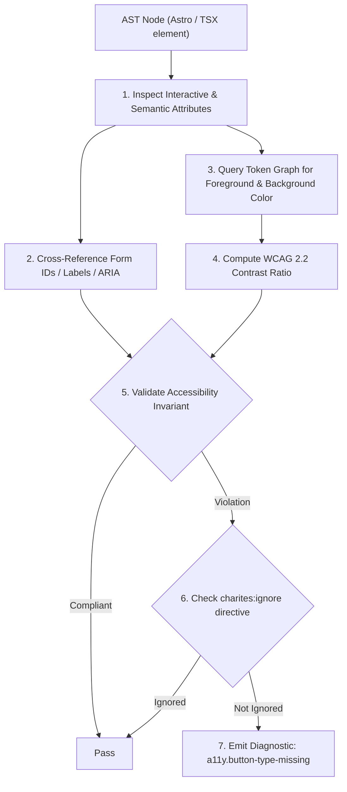
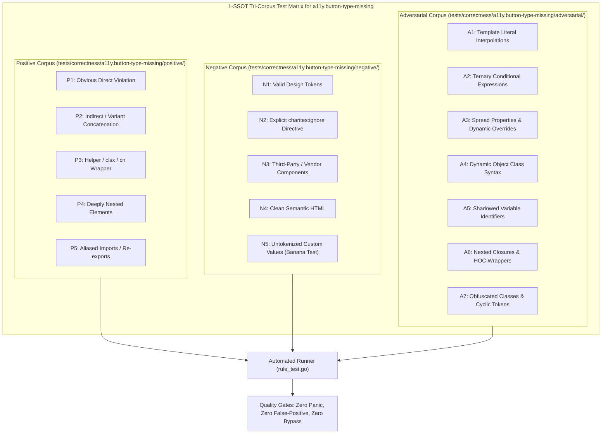

# a11y.button-type-missing

> **Rule ID:** `a11y.button-type-missing`
> **Severity:** `WARN`
> **Category:** `a11y`
> **Target Standards:** W3C Web Content Accessibility Guidelines (WCAG) 2.2 SC 3.2.2 (On Input), HTML Living Standard 4.10.6 (The button element), React SPA Form Submission Invariants

---

## 1. Overview & Core Invariant

Enforces explicit type attribute on <button> elements inside forms to prevent unintended form submission

### Core Invariant:
> **"<button> elements nested within a <form> must explicitly declare their type attribute (type="button", type="submit", or type="reset")."**

---
## 2. Technical Grounding & Engine Realities

In HTML and React applications, a <button> without an explicit type attribute defaults to type="submit".

When secondary action buttons (such as "Batal", "Close", "Preview", or modal dismiss buttons) are placed inside a <form> without type="button":
1. Unintended Submission: Clicking the button triggers the enclosing form's onSubmit handler and validation logic.
2. Unwanted Full-Page Reload: If event.preventDefault() is missing in the click handler, the browser reloads the entire page.
3. State Mutation Hazards: Form fields may be serialized or posted inadvertently to the server.

Charites traverses element ancestors to detect <button> tags rendered inside <form> lacking explicit type definitions.

---
## 3. Vulnerability & Risk Taxonomy

| Risk Vector | Severity | Impact |
| :--- | :---: | :--- |
| **Accidental Form Submission** | HIGH | Clicking secondary buttons submits the form, triggers validation errors, or mutates data. |
| **Full-Page Browser Reload** | MEDIUM | React SPAs reload the entire page unexpectedly if event.preventDefault is absent. |

---
## 4. Non-Compliant Code Patterns (Bad Examples)
### TSX (Button inside form lacks type, defaulting to type="submit"):
```tsx
<form onSubmit={handleSubmit}>
  <input name="query" className="h-11 px-3.5 text-base border rounded-lg" />
  <button onClick={handlePreview} className="h-11 px-4 text-sm font-medium">Pratinjau</button>
  <button type="submit" className="h-11 px-4 text-sm font-medium bg-primary text-primary-foreground">Simpan</button>
</form>
```

---
## 5. Compliant Implementation Patterns (Good Examples)
### TSX (Explicit type="button" prevents accidental submission):
```tsx
<form onSubmit={handleSubmit}>
  <input name="query" className="h-11 px-3.5 text-base border rounded-lg" />
  <button type="button" onClick={handlePreview} className="h-11 px-4 text-sm font-medium">Pratinjau</button>
  <button type="submit" className="h-11 px-4 text-sm font-medium bg-primary text-primary-foreground">Simpan</button>
</form>
```

---

## 6. Detection & Verification Pipeline (How The Rule Evaluates Code)
This `a11y` rule evaluates template markup and cross-references resolved design tokens for accessibility:



### Step-by-Step Evaluation:
1. **AST Traversal:** Inspects semantic elements, form controls, images, and landmark containers.
2. **Structural & Attribute Invariant Check:** Verifies accessible names, heading hierarchies, label/input bindings, and positive tabindex avoidance.
3. **Token-Aware Contrast Verification:** If analyzing color classes, queries `token.Context` to resolve foreground and background values, calculating relative luminance ratios.
4. **Directive Suppression Check:** Inspects preceding comments for `charites:ignore a11y.button-type-missing`.
5. **Diagnostic Emission:** Emits WCAG-grounded diagnostics for non-compliant patterns.

---

## 7. Verification & Test Harness (How The Test Works: 1-SSOT Tri-Corpus)

This rule is rigorously tested and validated across the canonical **1-SSOT Tri-Corpus** in `tests/correctness/a11y.button-type-missing/`:



- **Positive Fixtures (P1-P5):** Verified to trigger diagnostics at exact lines and column spans.
- **Negative Fixtures (N1-N5):** Verified to produce zero diagnostics on valid tokens and legitimate exemptions.
- **Adversarial Fixtures (A1-A7):** Verified to prevent evasion across dynamic expressions, string interpolations, and cyclic references.

---

## 8. How to Suppress (Ignore Directives)

If this pattern is required for an intentional exception, suppress the diagnostic using the canonical Charites Rule ID:

```astro
<!-- charites:ignore a11y.button-type-missing intentional exception -->
```

```tsx
// charites:ignore a11y.button-type-missing intentional exception
```

---

## 9. Configuration Reference (`charites.yaml`)

```yaml
rules:
  a11y.button-type-missing:
    severity: warn # error | warn | info | off
```

